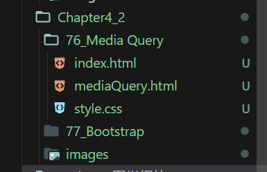

# References

> [Git 面試題 - Git 教學 | 高見龍 (gitbook.tw)](https://gitbook.tw/interview)
> 
> 上面這個還不錯 ，該看。
> 
> [《為你自己學 Git》 閱讀筆記. 人生不能重來，但 GIT 可以 （Git 篇） | by Leo Kao | Medium](https://medium.com/@leokao0726/%E7%82%BA%E4%BD%A0%E8%87%AA%E5%B7%B1%E5%AD%B8-git-%E9%96%B1%E8%AE%80%E7%AD%86%E8%A8%98-f76e4026dbce) 

## GitBook

> [Git 面試題 - Git 教學 | 高見龍 (gitbook.tw)](https://gitbook.tw/interview) 
> 
> 有很多有用的 例如

### 問 :  如何把歷史的某 commit 拆分 ?

#### 可以拆，只是hash 全部會被改，之後可能只能 force push

- > [【狀況題】把一個 Commit 拆解成多個 Commit - 為你自己學 Git | 高見龍 (gitbook.tw)](https://gitbook.tw/chapters/rewrite-history/split-one-commit-to-many-commits) 

- ```batch
  💡 先找出初始的 commit 然後 rebase 是填上它的 hash
  d87f1fc (origin/CH0-CH2-HTML, CH0-CH2-HTML) CH2_結束，完成到33section
  65696f3 CH2_中途上傳，內容包含到27section，預計明天會完成CH2和更多
  718dc1f first commit
  PS C:\CodeSForGit\2023WebFullStack> git rebase -i 718dc1f
  ```
  
  💡下個頁面 VIM 頁面 按 `i` 可以 開始輸入文字  按`:` + `w` +`q` 離開
  
  💡把我要拆分的 從 pick變成edit
  
  ```batch
  pick 26177d5 Project1 - 台灣ok 、完成Project1
  edit f8b620c Ch4.2 - section77 接觸bootstrap
  pick 47b771d Ch4.2 - section78 User snippest 類似預製內容熱鍵
  pick f44615d Ch4.2 - section81 HTML-bookmart功能
  
  # Rebase 718dc1f..f44615d onto 718dc1f (40 commands)
  ```
  
  💡打字完 按 `esc` 可以解除輸入模式 
  
  然後目前交互vim狀態下面 原本輸入 :wq 可以離開 `直接離開就好`
  
  ```batch
  ...
  d87f1fc (origin/CH0-CH2-HTML, CH0-CH2-HTML) CH2_結束，完成到33section
  65696f3 CH2_中途上傳，內容包含到27section，預計明天會完成CH2和更多
  718dc1f first commit
  PS C:\CodeSForGit\2023WebFullStack> git rebase -i 718dc1f ⭐離開vim後⭐
  Stopped at f8b620c...  Ch4.2 - section77 接觸 bootstrap ⭐會在這⭐
  You can amend the commit now, with
  
    git commit --amend
  
  Once you are satisfied with your changes, run
  
    git rebase --continue
  
  💡然後偷偷 git log 會發現 🔥目前 HEAD 在拆分目標上🔥
  PS C:\CodeSForGit\2023WebFullStack> git log
  commit f8b620cc9d1e7d64bb27747dff8fb584eb9cb96d (HEAD)
  Author: Oni <qw28425382694@gmail.com>
  Date:   Wed Dec 6 22:57:34 2023 +0800
  
      Ch4.2 - section77 接觸bootstrap
  ```
  
  `接下來要拆分 Commit `了 💡直接輸入以下💡
  
  ```batch
  git reset HEAD^
  ```
  
  
  
  🍉會發現之前的對象都 untrack 了 !
  
  ```batch
  💡直接輸入以下💡
  PS C:\CodeSForGit\2023WebFullStack> git status
  interactive rebase in progress; onto 718dc1f
  Last commands done (38 commands done):
     pick 26177d5 Project1 - 台灣ok 、完成Project1
     edit f8b620c Ch4.2 - section77 接觸bootstrap
    (see more in file .git/rebase-merge/done)
  Next commands to do (2 remaining commands):
     pick 47b771d Ch4.2 - section78 User snippest 類似預製內容熱鍵
     pick f44615d Ch4.2 - section81 HTML-bookmart功能
    (use "git rebase --edit-todo" to view and edit)
  You are currently editing a commit while rebasing branch 'master' on '718dc1f'.
    (use "git commit --amend" to amend the current commit)
    (use "git rebase --continue" once you are satisfied with your changes)
  
  Untracked files:
    (use "git add <file>..." to include in what will be committed)
          Chapter4_2/
  
  nothing added to commit but untracked files present (use "git add" to track)
  PS C:\CodeSForGit\2023WebFullStack>
  ```

- 💡很討厭，只顯示資料夾 。 先 git add . 再查看 git status💡
  
  ```batch
  Changes to be committed:
    (use "git restore --staged <file>..." to unstage)
          new file:   Chapter4_2/76_Media Query/index.html
          new file:   Chapter4_2/76_Media Query/mediaQuery.html
          new file:   Chapter4_2/76_Media Query/style.css
          new file:   Chapter4_2/77_Bootstrap/index.html
          new file:   Chapter4_2/images/Nihon_Ki-in_Headquarter_(2016-05-05)_5.jpg
          new file:   Chapter4_2/images/background.png
          new file:   Chapter4_2/images/go-equipment.png
  
  PS C:\CodeSForGit\2023WebFullStack>
  ```

- 💡單獨移除我不要的  `Chapter4_2/77_Bootstrap/index`  即可。
  
  ```batch
  git reset Chapter4_2/77_Bootstrap/index.html
  🔥移除之後成功如下🔥
  Changes to be committed:
    (use "git restore --staged <file>..." to unstage)
          new file:   Chapter4_2/76_Media Query/index.html
          new file:   Chapter4_2/76_Media Query/mediaQuery.html
          new file:   Chapter4_2/76_Media Query/style.css
          new file:   Chapter4_2/images/Nihon_Ki-in_Headquarter_(2016-05-05)_5.jpg
          new file:   Chapter4_2/images/background.png
          new file:   Chapter4_2/images/go-equipment.png
  
  Untracked files:
    (use "git add <file>..." to include in what will be committed)
          Chapter4_2/77_Bootstrap/
  ```
  
  接下來就只是單純的 commit 
  
  ```batch
  PS C:\CodeSForGit\2023WebFullStack> git commit -m "Ch4.2-section76_Media Query 重返歷史成"
  功拆分~"
  
  🔥上面使被分離以外的 重組成一個commit🔥
  🔥下面再git add . 重新把被分離的加入 另外commit🔥
  PS C:\CodeSForGit\2023WebFullStack> git commit -m "Ch4.2-section77_BootStrap 接觸簡單用~  
  重返歷史成功拆分~"  
  ```

- 💡 收尾別忘了 要讓 rebase 跑完
  
  ```batch
  git rebase --continue
  ```

- ⭐⭐⭐
  
  所有的 hash 值 都會被改掉，從更改的commit往後會被改而已，之前不變。
  
  ⭐⭐⭐

- ```batch
  PS C:\CodeSForGit\2023WebFullStack> git push
  To https://github.com/odenmeow/FullStackLearn
  🔥被拒絕 因為 hash 被改了🔥
   ! [rejected]        master -> master (non-fast-forward)
  error: failed to push some refs to 'https://github.com/odenmeow/FullStackLearn'
  hint: Updates were rejected because the tip of your current branch is behind
  hint: its remote counterpart. Integrate the remote changes (e.g.
  hint: 'git pull ...') before pushing again.
  hint: See the 'Note about fast-forwards' in 'git push --help' for details.
  PS C:\CodeSForGit\2023WebFullStack> 
  ```

### 問：如何把好幾個 Commit 合併成同一個？

- `互動式的rebase`  >  git rebase -i

- `git reflog`  :  顯示歷史紀錄 跟log不同 !

- ```batch
  PS C:\CodeSForGit\2023WebFullStack> git reflog
  6ceb3f6 (HEAD -> master, origin/master) HEAD@{0}: commit (amend): Ch3-section37
  1002aa9 HEAD@{1}: commit (amend): Ch3-section37
  805692d HEAD@{2}: checkout: moving from 805692d1a3b3d6358215f81e549721599498732e to master
  805692d HEAD@{3}: checkout: moving from master to 805692d1a3b3d6358215f81e549721599498732e
  805692d HEAD@{4}: commit: Ch3-section37
  74948d9 HEAD@{5}: commit: Ch3-section36
  e0a188c HEAD@{6}: commit: Ch3-section35
  6a842cf HEAD@{7}: commit: Ch3-section34
  d87f1fc (origin/CH0-CH2-HTML, CH0-CH2-HTML) HEAD@{8}: commit: CH2_結束，完成到33section
  65696f3 HEAD@{9}: commit: CH2_中途上傳，內容包含到27section，預計明天會完成CH2和更多
  718dc1f HEAD@{10}: commit (initial): first commit
  PS C:\CodeSForGit\2023WebFullStack> 
  ```

- 預計要把 `805692d` 跟 `6ceb3f6` 合併成一個歷史紀錄就好

- 🔥<font style="color:lightgreen">type :wq Enter to save changes and exit vim.</font>🔥輸入`:` ，後續就可以輸入文字 `:wq` 之後`enter` 就可以離開了。

- ```batch
  noop
  pick 65696f3 CH2_中途上傳，內容包含到27section，預計明天會完成CH2和更多
  pick d87f1fc CH2_結束，完成到33section
  pick 6a842cf Ch3-section34
  pick e0a188c Ch3-section35
  pick 74948d9 Ch3-section36
  pick 6ceb3f6 Ch3-section37
  ```
  
  🔥<font style="color:lightgreen">這邊跟我預想不同耶</font> 🔥。所以`log`為主，reflog則是為輔，安全機制 ...?
  
  之前使用 amend 就已經把資料改成同一個 
  
  `reflog` 🔥 <font style="color:lightgreen">保留默認時間 90天。 </font> 🔥

## Git 清理歷史紀錄

- ```batch
  git reset --hard $commit_id
  // 上面可以強制退版
  
  git reflog expire --expire --all
  git gc --prune=now
  ```

- /pruːn/  刪減

- 不用管我這沒關係。

## (HEAD detached from 6ceb3f6)

- 不小心忘了切換回來master 就commit 

- ```batch
  PS C:\CodeSForGit\2023WebFullStack> git branch -a
  * (HEAD detached from 6ceb3f6)
    CH0-CH2-HTML
    master
    remotes/origin/CH0-CH2-HTML
    remotes/origin/master
  PS C:\CodeSForGit\2023WebFullStack> git checkout master
  Warning: you are leaving 1 commit behind, not connected to
  any of your branches:
  
    fd49d62 Ch3-section38
  
  If you want to keep it by creating a new branch, this may be a good time
  to do so with:
  
   git branch <new-branch-name> fd49d62
  
  Switched to branch 'master'
  Your branch is up to date with 'origin/master'.
  PS C:\CodeSForGit\2023WebFullStack> 
  ```

- 使用 merge 合併

- ```batch
  
  ```

## 丟棄工作區的更改 ( 還沒git add . )

- ```batch
  git checkout -- path/to/yourdir_foldername
  ```

## 如果已經staged ( git add . )

- ```batch
  git reset Head path/to/yourdir_foldername
  ```
  
  上述指令 能把staged 的對象 unstaged 
  
  可能還需要 checkout

## 簡單顯示 Commit的Hash

- ```batch
  PS C:\CodeSForGit\2023WebFullStack> git log --oneline
  47b771d (HEAD -> master, origin/master) Ch4.2 - section78 User snippest 類似預製內容熱鍵
  f8b620c Ch4.2 - section77 接觸bootstrap
  26177d5 Project1 - 台灣ok 、完成Project1
  5e5daf5 Project1 - 小改日本 下面article 的 left margin 跟 index 中棋戰圖片的 left margin 、完成中國棋院、加入小動
  畫到目前完成頁面中。之後還要做台灣的頁面才算完成Project1
  944a55a Project1 - section72~75 日本棋院CSS改進、做出canvas-nest效果、改進index排版(自己想改)、之後還要做中國跟台
  灣的頁面才算完成Project1
  631b6a6 Project1 - section71 日本棋院html為主 ( index+style) 日本的文字跟圖稿，基本還沒上CSS，僅改main的flex-direction:column
  ```

## 顯示兩者diff 檔案名稱就好

- ```batch
  git diff --name-only f8b620c 26177d5
  ```

## Commit 附加標籤

- ```batch
  git commit -a -m "Commit message" -m "Additional description"
  ```

- GPT說的，要試試看才知道 @ @🔥 <mark>上面這個最好別用</mark> 🔥

- 這樣會將兩個訊息合併到一起成為提交的訊息。第一個 `-m` 後的內容是主要的提交訊息，第二個 `-m` 後的內容則是附加的描述。 這不是tag @@

- ```batch
  git add .
  git commit -m "直接上傳囉"
  git tag <tag_name> 就可以  之後再push
  git push 
  ```

## 後續附加標籤 tag

- ```batch
  git tag -a <tag_name> -m "Tag message" <commit_hash>
  ```

- 後來我的作法如下
  
  ```batch
  git tag -a section76 f8b620cc9d1e7d64bb27747dff8fb584eb9cb96d -m "忘了說有section76-MediaQuery"                                           
  ```

## 取消 tag

- ```batch
  PS C:\CodeSForGit\2023WebFullStack> git tag
  section76
  PS C:\CodeSForGit\2023WebFullStack> git tag -d section76
  Deleted tag 'section76' (was 4e37a95)
  ```

## 創建分支並推送過去遠倉

- ```batch
  git branch Chapter8  左邊是章節8的意思  (因為我要依照章節做切換)
  git push origin Chapter8 這樣就能推送上去
  ```

## 我想要替某 Commit 的位置增加branch

- 起因是我忘了Project 1 做branch 因此使用一下試試
  
  ```batch
  git checkout commit_hash
  git branch new_branch_name
  ```

- 照上面做
  
  ```batch
  26177d5 Project1 - 台灣ok 、完成Project1
  ...
  git checkout 26177d5  
  git branch Project1-Go-Game
  git checkout master
  git push --force origin Project1-Go-Game
  ```
  
  結束，有了。

## Git log 顯示一行就好

- ```batch
  git log -n 1  或者是
  git log --max-count=1
  ```

- 傻子才選下 

## 不小心detached分支上commit怎麼辦?

- ##### 先用 git reset --soft HEAD^ 回到上一步驟
  
  ```batch
  由於我們需要 保存那些不小心commit的資料 然後攜帶回去master
  使用soft才會留住 ，不能、不能用hard !
  git reset --soft HEAD^      
  ```

- ##### 儲存變更、運用stash
  
  ```batch
  -------------  存到獨立空間  -------------
  git stash
  -------------  切回 master  -------------
  git checkout master
  -------------  從獨立空間丟回 master  -------------
  git stash apply
  ```

```

```
