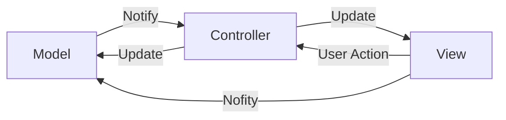
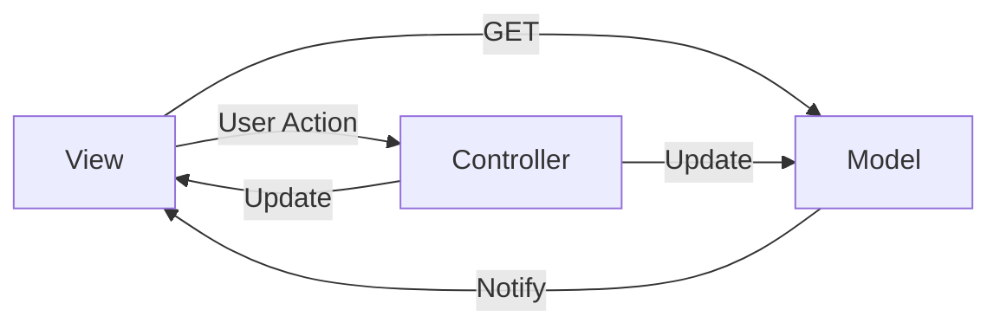

# 教你寫mermaid

> [快速上手Mermaid流程图 · 雪之梦 (snowdreams1006.github.io)](https://snowdreams1006.github.io/write/mermaid-flow-chart.html)

# 參考來源:

> https://juejin.cn/post/6901200799242649607 比較清楚(?) 稍亂

> [Android 三種開發架構，MVC、MVP、MVVM怎麼選？ - YouTube](https://www.youtube.com/watch?v=nViX8m7gS7I)

> [MVC vs MVVM！MVVM 是什麼？能吃嗎？(上) - HackMD](https://hackmd.io/@leoho0722/rJtBdJFJc/https%3A%2F%2Fhackmd.io%2F%40leoho0722%2Frkaj8tXH9)

> [MVC,MVP和MVVM之間的優缺點-有解無憂 (uj5u.com)](https://www.uj5u.com/ruanti/277826.html) 

> [探究 Android MVC、MVP、MVVM 的区别以及优缺点_android mvc mvp mvvm 优缺点_怪伽先森的博客-CSDN博客](https://blog.csdn.net/u011033906/article/details/118113466)

# 先來點心得:

- 是的，你說得對。在軟體開發中，特別是在前端和手機應用程式開發中，有時會出現MVVM和MVP等變種架構。這些架構模式主要是為了更好地管理應用程式的邏輯、視圖和資料之間的關係，以提高代碼的可讀性、可擴展性和測試性。

- MVVM（Model-View-ViewModel）和MVP（Model-View-Presenter）是一些衍生於MVC的設計模式，它們更關注如何管理和處理視圖、邏輯和數據層之間的關係。這些模式的目標是將應用程式的不同層次分開，使得每一個部分可以獨立地進行測試和維護。

- 在後端，特別是像Spring Boot這樣的框架中，MVC是一種常見的架構模式，它將應用程式分為模型（Model）、視圖（View）和控制器（Controller）。但是在前端開發中，經常會使用MVVM或MVP這樣的模式，因為這些模式更適合處理前端的複雜邏輯和數據處理。

- 不同的框架和平台有不同的需求和特點，因此在開發過程中選擇適合的架構模式是很重要的。MVVM和MVP等模式可以幫助開發者更好地管理代碼和提高應用程式的可維護性。

# MVC

(Model-View-Controller)

- 下圖是Medium找的 ， 跟我們常用(算是變種) 的不同
  
  > [MVC、MVP、MVVM架構比較 - Learn & Record - Medium](https://medium.com/learn-record/mvc-mvp-mvvm%E6%9E%B6%E6%A7%8B%E6%AF%94%E8%BC%83-62b5657d2e21)

- 代原始版本好像如下

  跟我們認知的比較接近，但是分層得不是很乾淨，主動跑去Model找資料

# MVVM (GOOGLE Android)

(Model-View-ViewModel)

- 這邊切更乾淨，並且解決MVP循環相依問題 (?)
  
  - 在MVP中，View和Presenter之間有相互依賴的情況，這可能會導致一些問題，例如難以測試、難以維護和理解等。解決這種問題的一種方法是使用介面（Interface）。

- databinding讓資料綁定 自動同步UI DATA
  
  - 但由於雙向綁定 不易除錯 可能是UI 也可能是DB

- ViewModel 讓資料持久，減少因選轉產生查詢。

- 觀察者模式 view 觀察ViewModel 如果有異動就主動更新 (?)

# MVP (View跟Present循環相依)

(Model-View-Presenter) /prɪˈzen.t̬ɚ/ 主持人

- 切割讓view 自己有控制器，控制自己的畫面
- present 專心處理 view跟model 之間就好 不處理畫面了
- 大量接口處理 解耦 頁面邏輯多= =接口多

在MVP架構中，相互依賴可能會出現在View和Presenter之間。這是因為View負責`接收用戶輸入`和`顯示數據`，而Presenter則`負責處理業務邏輯`和`更新View`。當這兩者相互依賴時，可能會導致一些問題：

1. **測試困難**：當View和Presenter相互依賴時，測試時需要同時考慮兩者。這會增加測試的複雜性，因為單獨測試View或Presenter變得困難。

2. **代碼耦合**：相互依賴會增加代碼之間的耦合。這意味著一個組件的更改可能需要修改另一個組件，增加代碼的脆弱性和維護成本。

3. **難以理解**：相互依賴可能導致代碼不清晰，難以理解。這會使代碼的可讀性和可維護性下降。

通過使用介面（Interface）來解決相互依賴的問題，可以減少這些問題的影響。例如，Presenter可以實現一個與View相關的介面，而View僅依賴於這個介面而不是具體的Presenter實現。这样的话，View 和 Presenter 的交互将通过这个介面来完成，从而降低了彼此的耦合性。
