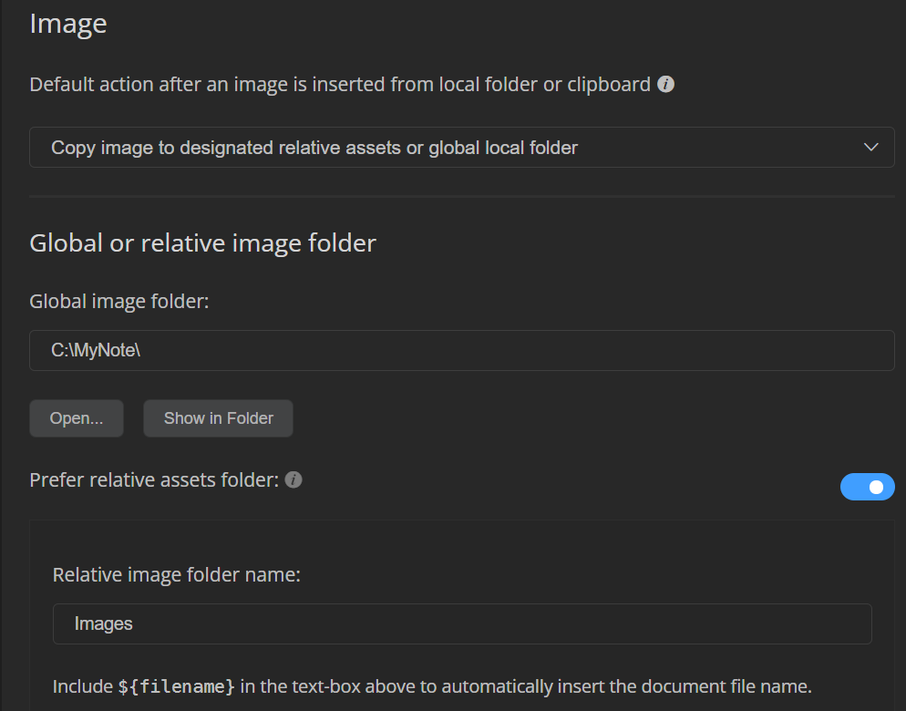

# MyNote

好不容易使用.md

這邊基本上就拿來放筆記囉~

超連結要使用 \<span>  github才有效果

然後 \<font> 或 \<span> 中使用 style 顏色都無效果

提供符號 可以用 github

🔥 建議使用 🔥

上面這種方式 因為GitHub 看不到顏色

雖然 font 無法超連結 span 可以超連結

但是 兩者style 都無效

建議使用 🔥包住重點。

- # 🔥 重點

- # 🏆

- # ⌛

- # ⭐ 重要度

- # ⚠️ 注意

- # 🙄
  
  # 😕

- # 🍉

- # 🗨 可能有想說的話 可能藏我小實驗

- # 💡 小技巧、提示之類
1. ``\`\`\`diff``
2. `- red`
3. `+ green`
4. `! orange`
5. `# gray`
6. `` \`\`\` ``

```diff
- 紅色字
+ 綠色字
! 橘色字
# 灰色
```

---

# VsCode 快捷鍵

- Ctrl+enter 快速 add line

- Ctrl+shift +k 刪除 current line

- Ctrl+k +0  摺疊所有區塊

- Ctrl+k +j   展開所有

- Ctrl+D 先選喜歡的文字之後 按這個組合 可以快速讓光標cursor 出現在目標上
  
  - 相當於 alt + 滑鼠點下去 可以一次多個滑鼠光標選取、輸入、刪除之類很方便
  
  - Ctrl+Shift+左右 箭頭 可以選取多個 或者 alt 排列組合試試。我忘了

---

Udemy 預定進度 :

如果沒面試。 QQ

| 12/11 一 | 11節 12節 7小時左右  |
|:-------:|:--------------:|
| 12/12 二 | 13、14 =7H      |
| 12/13 三 | 15、16、17=7H    |
| 12/14 四 | 18、19、20、21=7H |
| 12/15 五 | 22+23+24+25=7H |
| 12/16 六 | 26+27+28+29=7H |

| 12/17 日 | 30+31+32=7.5H |
|:-------:|:-------------:|
| 12/18 一 | 33+34+35=8H   |
|         | over          |
|         |               |
|         |               |

---

# MarkText 設定

# 圖片設定



選擇

`Copy image to designated relative assets or global local folder` 。

然後

Global image folder: 填入

`C:\MyNote\`

以及 Relative image folder name:

`Images`

---

Project4 - section174 改變select顏色，使用了之前所學，JS、preventDefault防止enter表單送出、防止點擊垃圾桶送出、探測select標籤change的時候、以及target value、改變選單顏色之類【我偷回過去改變數名稱allbtns -> allBtns】
