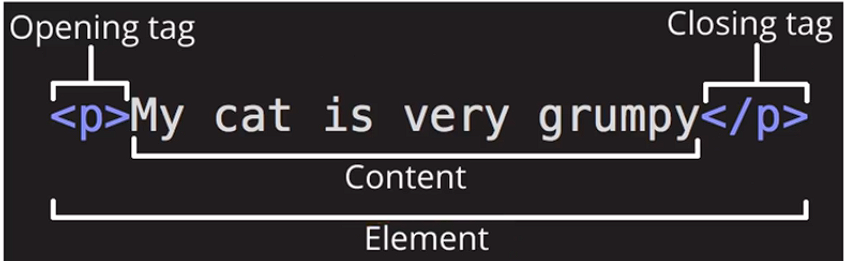
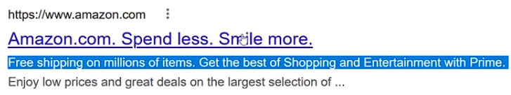
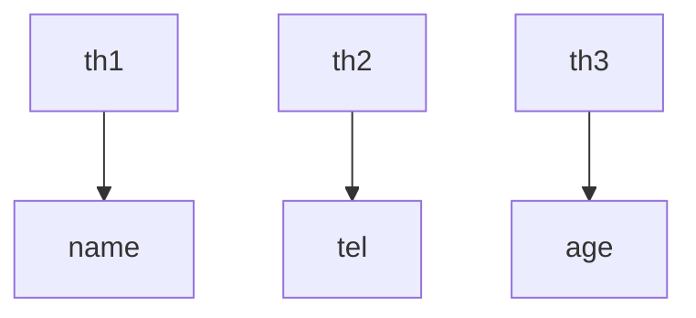
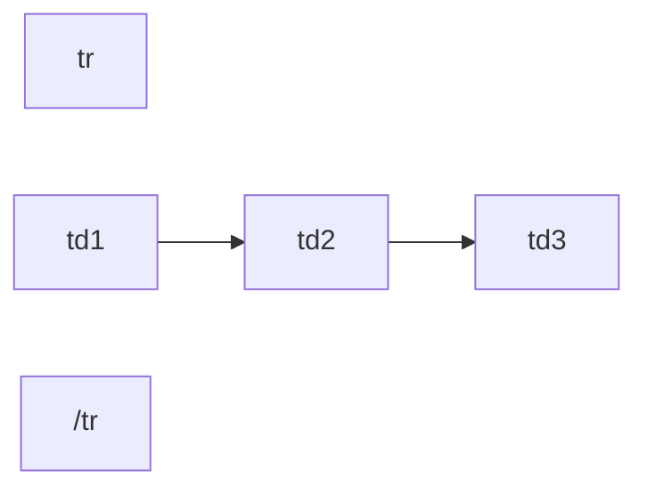
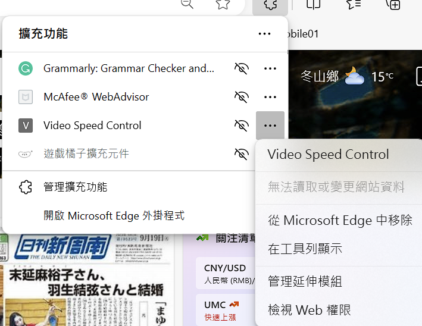
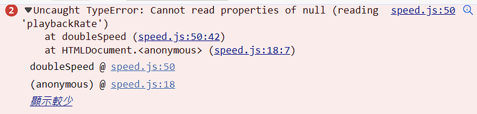

# HTML簡介

- HyperText Markup Language ( 超文本標記語言 )

- 外觀描述 CSS

- 功能動作 JavaScript

- HyperText 超連結  ( 連到其他網頁的文字 )

# 第一個網頁製作

- 預設網頁瀏覽器 他使用firefox 

- 去設定、預設應用程式 改瀏覽器

- 然後他使用了VisualStuido 

- 我叫做FirstWeb.html

- p 然後按 tab就會自動變成 \<p> \</p>

- 開始標籤 opening tab 結束標籤 closing tag

- forward slash   =>    【   /  】

- 

- 下載故宮博物館的資料然後跟著做而已

## 巢狀元素 Nesting Elements

- \<p>  \<Strong> </Strong> \</p>  放到其他元素內

## W3C Validator

- 可以幫忙校正HTML是否有誤

# 物件導向 Object-Oriented

- HTML 採用物件導向的想法

- Attribute  屬性

- Methods  方法、行為

- ```html
  <p style="color: brown" onclick="alert('你按了<p>')"> 
  
  ....
  ...
  </p>
  ```

# HTML Skeleton (骨架) 1+2

- ```html
  <!DOCTYPE html>
  <html lang="en">        
      <head>
          <meta charset="UTF-8">
          <meta name="viewport" content="width=device-width, initial-scale=1.0">
          <title>Document</title>
      </head>
      <body>
  
      </body>
  </html>
  ```

- <head> 包含 meta data 、title 、script、script linking 、CSS ...etc.

- <title> 是 網頁tab的顯示名稱

- ctrl+/ 註解 !  comment out some codes  /ˈkɑː.ment/  重音不在後面

- `< html lang ="en" >` 會輔助翻譯系統詢問 使用者要不要翻譯
  
  - 台灣 zh-Hant

- `viewport` 的設定 所以內容文字會跟著變動、而不是scroll bar 自己滑動去看 

- `initial-scale` 初始放大程度 firefox好像沒反應 據說要去chrome觀看 ( ? )

# HEAD 標籤

- htmlhead.dev 有稍微介紹head 內容相關

- `\<title>我做的故宮博物館介紹 \</title> `
  
  <font style="color:lightgreen"> 可以讓別人比較容易找到我們</font>.

- `<meta name="description" content="簡單描述故宮博物館" />`
  
  同上  效果如下
  
  

- ```html
  <meta name="robots" content="index,follow" />
  
  <meta name="google" content="index,follow" />
  ```
  
  上面設定可以讓機器人爬或者被搜尋到

- `<meta name="autor" content="ONI">` 
  
  讓人家知道是誰做的

- 順便這邊也講live server ( 雖然我們也許早知道了? )

# H1-H6 請正確使用for SEO

- HTML `<h1>`  最大最重要 

- 一個頁面應該使用1個 `<h1>`

- 偷偷放 `h7` 會發現沒比 `h6` 更小

- 錯誤可以丟進去`W3C Validator` 測試

- `<font style="color:lightgreen"> 自己取用 </font>`

- <font style="color:lightgreen"> 正確使用標籤可以做到SEO</font> Search Engine Optimization

# Anchor tag

- `<p>` 會在前後自動增加空行 \n

- `<a herf="https://www.npm.gov.tw">` 
  
  - 透過 target 設定如何開啟連結
  
  - 去mdn 查找 anchor target property
  
  - `預設使用` _self 
  
  - _blank 新分頁
  
  - `_top` `_parent`  有興趣者自己查詢

- 使用<font style="color:lightgreen"> Base Tag <base target="_blank"> </font> .
  
  - 如果刪除  `attribute`  中的 `target` 
  
  - 在`head` 使用該標籤就會讓所有 `target`  套用此預設
    
    ```html
    <a href="https://www.npm.gov.tw/"> 故宮網站連結</a>
    <a href="https://www.gamer.com.tw/"> 巴哈姆特連結</a>
    <p> 如果自己有寫清楚就不會套用base</p> 
    <a href="https://www.gamer.com.tw/" target="_self"> 巴哈姆特連結</a>
    ```
  
  - <font style="color:lightgreen"> 如果自己寫清楚target就會用自己的唷 </font>`看上面`

# img 絕對路徑、相對路徑

- `` 搭配 以下 attr
  
  - `<src>` 圖片來源
    
    - ./cat.jpg 目前檔案資料夾位置內的cat 
    
    - ../cat.jpg上一層資料夾下的 cat
    
    - /cat 則是 vscode folder 根基 
    
    - <font style="color:lightgreen"> 檔名避免空白 ， 因為編碼問題可能抓不到</font>. 
    
    - `圖片網址`
  
  - `<alt>`無法顯示要使用什麼替代文字

- 透過 referer 的設定 可以讓後端不回應非自己網站的請求

- 下載到本地 會讓網站額度傳輸被吃掉 所以使用URL各有好壞
  
  - `好`  額度可以省 而且伺服器輕鬆
  
  - `壞` 別人限制 或者 圖片搬家 或者改名稱路徑 

# ul, ol標籤

- unordered list  
  
  - `attr` type 
    
    - circle   空心圓
    
    - disc
    
    - square  正方形
    
    - <font style="color:lightgreen"> 建議不要改因為css可以改，避免被廢棄造成麻煩</font>.

- ordered list 
  
  - `attr` type
    
    - a 小寫字母
    
    - A 大寫字母
    
    - i 羅馬小寫
    
    - I 羅馬大寫
    
    - 1 預設 = 數字

# Block - Inline elements

- block 會單獨佔據一行 前後內容都會被自動換行
  
  - - p
    
    - ul ol 
    
    - navigation menus 
    
    - footers 頁尾
    
    - div
    
    - h1 h2...
    
    - ...etc
  
  - 不會被巢套在inline elements 但被其他 block 套是有可能的
    
    - `<ul> <p></p> <ul>` 這順序才對
    
    - `<p>`    在外 也許能顯示 但 !<font style="color:lightgreen"> 建議不要 !</font>.

- inline 只要能放下 就會一直放到最後塞不下頁面才換到下一行 !
  
  - - a
    
    - span 也是

# 表格製作

- `<table>`

- `<tr>` table row 

- `<th>` table heading

- `<td>` table data

- | 姓名  | 電話  | 年紀  |
  |:---:|:---:|:---:|
  | td1 | td2 | td3 |
  | td4 | td5 | td6 |
  | td7 | td8 | td9 |

- 表示方法用 [C,R] 而不是 RC哦~  [2,3] 代表 td8  (th不納考慮的話)





- 只要知道就好 我隨便練習flowchart而已 不要管我= =
  
  <font style="color:lightgreen"> th放tr內方便擴充 !</font>. 不放也可以 依樣上面<tr>放<th>就能擴
  
  ```html
  <table> 
      <tr>
          <th>姓名</th>
          <th>電話</th>
          <th>年紀</th>
      </tr>
      <tr>
  
          <td>td1</td> 
          <td>td2</td>
          <td>td3</td>    
      </tr>
      <tr> 
          <td>td4</td> 
          <td>td5</td>
          <td>td6</td>    
      </tr>
      <tr> 
          <td>td7</td> 
          <td>td8</td>
          <td>td9</td>    
      </tr>
  </table>
  ```

- 以及一些CSS技巧
  
  ```html
      <style>
        table,
        tr,
        th,
        td {
          border: 1px black solid;
          border-collapse: collapse;
          text-align: center;
        }
      </style>
  ```

- `colspan` 跟 `rowspan` 介紹

- thead 跟 tbody 就是輔助觀看  沒影響

# 表單製作

- HTML `<form>`  的 `attr`  __ `action`  

- ```html
  <form action="">
        <label for="名字"> 姓名: </label>
        <input id="名字" type="text" name="姓名" />
        <button type="submit">提交</button>
  </form>
  ```

- for 跟 id 如果一致 ，點標籤的時候會自動cursor 出現在對應 input

- <font style="color:lightgreen"> name 屬性</font>. 
  
  - 如果有設定才能對應到資料庫的parameter
  
  - URL ?姓名=oni 這邊 可以看出
  
  - 不寫表單送出也沒用因為沒有對應的key value就無法存在

# GET POST

- 預設使用 Get 
  
  ```html
  <form action="" method="GET">
    <!-- <label for="名字"> 姓名: </label>
    <input id="名字" type="text" name="姓名" /> -->
      <label for="email"> 帳號: </label>
      <input id="email" type="text" name="email" />
      <label for="password"> 密碼: </label>
      <input id="password" type="password" name="password" />
  
      <button type="submit">提交</button>
  </form>
  ```

- method不寫就是預設GET 

- GET 可以被加入書籤

- POST不能因為URL不會儲存資料

- <font style="color:lightgreen"> Google 以 GET搜尋 有助於分享搜尋、提高效率、還能被【緩存】</font>.

# checkbox email file

- [<input>: The Input (Form Input) element - HTML: HyperText Markup Language | MDN (mozilla.org)](https://developer.mozilla.org/en-US/docs/Web/HTML/Element/input)

- 到上面網站可以很清楚知道 `<input>` attr 長怎麼樣
  
  ```html
  <form action="" method="GET">
      <label for="名字"> 姓名: </label>
      <input id="名字" type="text" name="姓名" />
      <input id="電子報" type="checkbox" name="是否訂閱" value="是" />
      <label for="電子報">訂閱電子報</label>
      <button type="submit">提交</button>
  </form>
  ```
  
  - - checkbox
      
      `value` 可以給自訂預設值 如果有打勾就傳送 
      
      key value   [ 是否訂閱 = 是   ]
      
      `checked` 讓它預設就是 打勾狀態
    
    - eamil 
      
      `type="email"`
      
      `required` 填了才可送出、空白不可
      
      <font style="color:lightgreen"> 雖然是說一定要，但是無法預防postman之類方式 所以後端也要處理</font>.
    
    - file
      
      `<input id="upload" type="file" name="upload_pic" />`
      
      例如上述 就可以讓使用者傳資料帶入POST

# Number password

- 跟剛剛一樣的表單延伸 然後使用 `number` 
  
  `<input id="年齡" type="number" name="age" value="18" />`
  
  這邊放了value 預設18 之類
  
  <font style="color:lightgreen">雖然也可能繞過但是對於一般使用者要設定min 年齡不為負</font>.
  
  - `step`  每次增減 加多少 預設是1 
    
    - <font style="color:lightgreen">可以設定成0.01 這樣就可以輸入小數了</font>.
  
  - `min` 限制最小   0    不會比0小 最多0
  
  - `max` 限制最大  100 不會>100 最多100

- password 搭配 JS 自己做按鈕 視與不視 但是edge好像有提供功能了...( 半套? )
  
  ```html
      <script>
        let checkbox = document.querySelector("#seePass");
        //   下面這可以替代
        //   let checkbox = document.getElementById("seePass");
        let password2 = document.querySelector("#password2");
  
        checkbox.addEventListener("click", () => {
          if (password2.type == "text") {
            password2.type = "password";
          } else {
            password2.type = "text";
          }
        });
      </script>
  ```
  
  這邊可以混用兩種沒錯 但下面比較通用、可以用class或標籤名稱選

- 順便提到 限制姓名`<input type="text">`的 最短跟最長
  
  `minlength="5"`     小於不給送出
  
  <font style="color:lightgreen">但不填可以送出，要搭配required使用</font>.
  
  `maxlength="20"`   <font style="color:lightgreen">大於會自動停止</font>.

- `<input type="password">` 也使用`minlength`  `maxlength` !

- `placeholder="中文姓名"`  <font style="color:lightgreen">Input 區塊顯示提示字串</font>.

- 

- 

- 我的按按鈕就會自動加速之類就是因為有安裝到這個插件 所以我跑去移除垃圾 

# Radio Range

- `Range` 滑桿 跟 `Radio`  類似劃卡的多選一功能
  
  ```html
  0<input
            type="range"
            max="50000"
            min="0"
            step="10000"
            name="salary_4"
            id="salary_4"
   />50000
  ```

- 基本上就跟其他input差不多 `Range`大概就這樣

- `radio` 搭配 `name` 如果name一樣的話 就可以做出 只能擇一的功能
  
  ```html
  <input id="男性_4" type="radio" name="gender_4" value="male" />
  <label for="男性_4">男性</label>
  
  <input id="女性_4" type="radio" name="gender_4" value="female" />
  <label for="女性_4">女性</label>
  ```
  
  如果上面用 `checkbox` <font style="color:lightgreen">就做不到單選了</font>. 即使`checkbox` `name`一樣 
  
  `checkbox` HTML 適合用 多選
  
  `radio` 一樣可以搭配 `required` 讓人一定要有所選擇 
  
  - name如果一樣好像也能只填一個 required 其他自動會被識別 但最好小心 !

# Button, selection, option, datalist, textarea

- `Button` 放在 form 比較有用 ，form 內其預設為 submit不用設別設
  
  [The Button element - HTML: HyperText Markup Language | MDN (mozilla.org)](https://developer.mozilla.org/en-US/docs/Web/HTML/Element/button)  
  
  ```java
  <div style="background-color: rgb(247, 216, 233)">
    <button type="button">我是按鈕</button>
    不在表單標籤內，沒作用 (沒加上script，加了才可以附加功能)
  </div>
  ```
  
  - `submit`  對表單
  
  - `reset` 好像沒特別用處 強制讓表單填好的東西變成為初始值
  
  - `button` 等著加上 script才有用吧

- `select` 
  
  範例如下
  
  ```java
  <select name="gender_5" id="sex_5">
       <option value="male">男性</option>
       <option value="female">女性</option>
       <option value="other" selected>不定義</option>
  </select>
  <label for="sex_5">選擇性別</label>
  ```
  
  特別注意到value原本在 input 是可以預設自訂值 但這邊變成這樣
  
  所以這邊有別的方法<font style="color:lightgreen">預設 </font> 
  
  `selected` 使用這個就可以囉 !
  
  作者有說明怎麼強制別人填資料 故意設空白`<option>`然後 required 。
  
  <font style="color:lightgreen">請注意 </font>它`<select  required>`是依照 `選取` 而非 `value`有沒有給定 
  
  > <font style="color:lightgreen">下面範例可以 成功阻止送出</font>
  
  ```java
  <select name="gender_5" id="sex_5" required>
      <option></option>
      <option value="male">男性</option>
      <option value="female">女性</option>
      <option value="other">不定義</option>
  </select>
  ```
  
  > <font style="color:lightgreen">下面不阻止，因有seleted，required覺得有選就好 !</font>
  
  ```java
  <select name="gender_5" id="sex_5" required>
      <option value="male">男性</option>
      <option value="female">女性</option>
      <option value="other">不定義</option>
      <option seleted > </option>
  </select>
  ```

- `datalist` 
  
  ```java
  <input list="area-list_5" type="text" name="area" id="area5" />
       <datalist id="area-list_5">
       <option value="台北市">台北市</option>
       <option value="新北市">新北市</option>
       <option value="桃園市">桃園市</option>
       <option value="台中市">台中市</option>
       <option value="高雄市">高雄市</option>
  </datalist>
  ```
  
  這邊上面有個小問題就是 還是可以輸入臺北 ，送出，沒強制。只能減少雙關。

- `textarea` 
  
  ```java
  <label for="suggestion_5">給網站的建議</label>
  <textarea
       name="suggestion"
       id="suggestion_5"
       cols="30"
       rows="10"
       placeholder="建議填在這邊"
  ></textarea>
  ```
  
  可以縮放 或者預設大小但是不知道能幹嘛 @ @"

# 其他資訊 br hr comment

## `<br>`

- 換行功能

- 在成對標籤`<p>` 內可以用~  `</p>`

## `<hr>`

- 分層~

## `<!--AAA-->`

- 註釋功能

# 其他資訊 index.html html entity

## `數學運算符號、箭頭之類特殊符號添加`

- © 之類的奇怪符號

- [Games Symbols - HTML Symbol (htmlsymbols.xyz)](https://www.htmlsymbols.xyz/games-symbols) 

- &#9816; 

- 直接查詢 Copyright symbol html entity code

- HTML entity 

- 開頭 &  結尾 ;   ( 空白也是 )

## `index.html`

- 伺服器在目錄查詢的默認文件

- 避免使用者直接看到root directory 

- [listing directory /Chapter2/pages/](http://127.0.0.1:5500/Chapter2/pages/) 直接暴露

- 我加入index.html 了，不會直接看到了!

# favicon.ico

## self-closing tag

- 又稱 void element  

- 不含任何content 也就是 `` 不會、不能夾擊文字

## Favicon favorites icon

- 寫在index.html 
  
  ```html
    ....
    <link rel="icon" href="../images/2-22+favicon.ico" />    
  </head>
  ```
