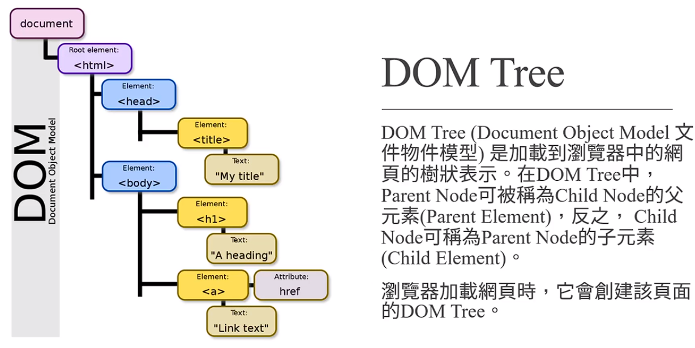
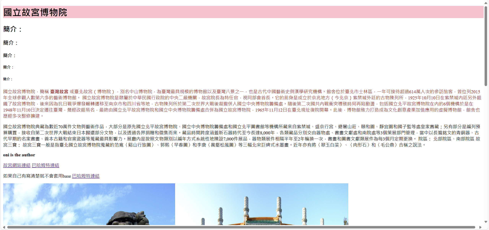

# DOM Tree



# CSS簡介

- Cascading Style Sheet 階層式樣式表

- [CSS reference - CSS: Cascading Style Sheets | MDN (mozilla.org)](https://developer.mozilla.org/en-US/docs/Web/CSS/Reference)
  
  不用全部屬性都知道 常用跟實用就夠

- <font style="color:lightgreen"> 還是直接拿上次故宮的例子接下去做@@ "</font> 

- `我決定新開CH3 複製品 、比較值觀方便` ，依舊會做Git 版控 : )

- comment 為 `/*....*/` 

## 取名方式不同 我叫GuGon 它叫index

- 自己注意 雖然我不知道會不會有問題、留意應該就ok !

# CSS放置位置

- <font style="color:lightgreen"> 查看方式F12 點選要查看物件 > 樣式 ~~blue~~ 的可知效果、順序</font>

- `inline styling`
  
   <font style="color:lightgreen"> 優先最高</font>但只能對特定標籤設定 最優先
  
  ```html
  <body>
      <h1 style="color: rgb(0, 118, 118)">國立故宮博物院</h1>
      <style>
        h1 , h2{
          color: blueviolet;   
        }
      </style>
  ```
  
  這邊 inline 不會被下面的style影響 但 沒寫=原本套用head style
  的h2藍色標題們 會變成紫羅色 !

- `internal styling`
  
  方便 但是難維護
  
  CSS 直接放在 HTML 中 
  
  ```html
  <style>
  h1 {
          color: red;
  }
  h2 {
          color: blue;
  }
  </style>
  ```

- `external styling`
  
  最常見、容易維護
  
  CSS 放外部 可以讓別的 HTML 也使用 !
  
  基本上都命名為 `style.css` 
  
  ```html
       ....
       <link rel="stylesheet" href="./style.css" />
  
   </head>
  ```
  
  使用外部CSS  連結的方式

# CSS顏色設定

- `<named-color>`[ CSS: Cascading Style Sheets | MDN (mozilla.org)](https://developer.mozilla.org/en-US/docs/Web/CSS/named-color) 

- Color Keyword: red、 black、coral....etc.

- RGB 
  
  - 0~255 共256 ^3   
  
  - 顏色通道 channel 每個顏色   `1byte` 儲存
  
  - ```css
    h1 {
      color: rgb(22, 355, 19);
    }
    ```

- RGBA
  
  - 同RGB但多了alpha 儲存透明度  `0-1`  表示 
  
  - 如下，接近亮綠
  
  - ```css
    h1 {
      color: rgba(22, 355, 19,0.5);
    }
    ```

- HEX
  
  - 使用十六進制  0-F 
  
  - 如下，淺灰
    
    ```css
    h1 {
      color: #AABBCC;
    }
    ```

- HSL 
  
  - Hue 色相
  
  - Saturation 飽和度
  
  - Brightness 亮度

# CSS Selectors 1

- Universal Selector (*) 匹配任何類型的HTML element。
  
  - ```css
    h1 {
      color: #aabbcc;
    }
    h2 {
      color: blue;
    }
    * {
      color: yellowgreen;
    }
    ```
  
  - 除h1,h2,以及`inlineStyle`，其他 HTML element都變黃綠色。

- Element Selector 可選擇特定的 HTML element。
  
  - ```css
    h2 {
      color: blue;
    }
    ```

- ID Selector可選擇有特定ID屬性的HTML element。
  
  - ```css
    #first-paragraph {
      color: coral;
    }
    ```

- Class Selector可選擇所有有特定class屬性的HTML element。
  
  - ```css
    .b-text {
      color: blue;
    }
    ```
  
  - 跟ID最大不同就是可以重複寫上去
  
  - space-separated "A-1 B-2"  代表有兩個類別 `A-1` `B-2` 
  
  - ```html
     <p id="first-paragraph" class="b-text large-text" onclick="alert('你按了<p>')">
    ```

- 使用標籤+類別如下
  
  - ```html
     <a class="large-text" href="https://www.npm.gov.tw/"> 故宮網站連結</a>
    ```
  
  - ```css
    a.large-text {
      font-size: 35px;
    }
    ```
  
  - 滑鼠移上去 就可以知道是不是真的套用到`<a class="large-text">`

# CSS Selectors 2

- Grouping Selector 可一次選擇所有數個 HTML 元素,並以逗號分隔。
  
  ```css
  h1,
  h2 {
    color: red;
  }
  ```

- Descendant Selector 由兩個或多個用空格分隔的選擇器組成。
  
  ```css
  /* -------Descendant Selector------------ */
  
  div.link1 a {
    color: red;
  }
  div.link2 a {
    color: green;
  } 
  ```

```
- Attribute Selector 選擇所有具有相同屬性的HTML 元素。

```css
/* -------Attribute Selector------------ */

input[type="text"] {
  color: rgb(248, 53, 53);
}
```

# (39) Pseudo class, element

- `pseudo-class` 指定所選元素其特殊狀態(樣式) 
  
  :hover 滑鼠懸停在按鈕上
  
  :active 滑鼠按下去才變色
  
  :focus 專注 = 輸入會有 顯示藍色 那就是聚焦物件 
  
  :nth-child() 選擇第n個元素
  
  ```css
  p::before {
    content: ">>";
    color: rgb(47, 47, 255);
  }
  ```
  
  加入GuGonMuseum.html 第二段落`<p>` 之後使用~上面

- `pseudo-element` 設置所選元素的指定 '部分樣式' 
  
  ::first-line 用於更改段落第一行字體字型 
  
  ```css
  p::first-line {
    font-size: 29px;
    color: rgb(47, 47, 255);
  }
  ```
  
  真的就是只改第一行字體大小跟顏色，隨著螢幕放大縮小 某些文字因放大不在第一行就不再是藍色了。不只第一個`<p>` 第二個也會套用第一行。

- `*::selection` 改變反白 區塊的CSS
  
  ```css
  *::selection {
    background-color: aqua;
  }
  ```

        <font style="color: chartreuse;"> 上面蠻酷的</font>

# (40) CSS重點概念

- Inherited and Non-Inherited Properties
  
  - CSS 樣式<font style="color: chartreuse;"> 有些會被子元素繼承，有些不會。</font> 
    
    - Parent element / Child element
  
  - https://www.w3.org/TR/CSS21/propidx.html
  
  - 會繼承的 常見有
    
    - color
    
    - font-family
    
    - font-size
    
    - font-weight
    
    - list-style-type
    
    - text-align
  
  - 由於user agent styling 優先度 > inheritance 所以瀏覽器預設樣式可能覆蓋繼承屬性 例如 `<a>` 的顏色通常要額外設定。

- Conflicting Styling
  
  - 例如顏色衝突 ， 如下，以後執行為主。
  
  - ```css
    h1 {
      color: red;
    }
    h1 {
      color: blue;
    }
    ```
  
  - 衝突處理原則
    
    - Priority
    
    - Specificity
    
    - Order Rule

- Specificity 
  
  - 順序而言
    
    - Inline Styling
    
    - User Stylesheet ( .css )
    
    - User Agent Stylesheet
    
    - Inheritance
  
  - specificities
    
    - id - specificity (1,0,0)
    
    - class - specificity (0,1,0)
    
    - tag - specificity (0,0,1)
    
    ```html
    <h1 class="gugu">國立故宮博物院</h1>
    ```
    
    ```css
    h1.gugu {
      color: red;
    }
    .gugu {
      color: blue;
    }
    ```
    
    會發現後面沒有蓋掉前面，因為滑鼠移過去 
    
    (0,1,1) > (0,1,0)
    
    因為 `h1.gugu` 更加 specific 特定(具體)。 

- Order Rule 
  
  - 相同 specificity 則 後面覆蓋前面。
  
  - ```css
     <link rel="stylesheet" href="./style.css" />
     <link rel="stylesheet" href="./style2.css" />
    ```
    
    後者 覆蓋前者。

# (41) CSS 單位

- `Absolute units` 指有預設的數值或是現實生活定義的單位
  
  px ( pixel ) = 2.54cm 的 1/96 、in、mm、cm之類都可以。

- `Relative units`  
  
  - `em` 相對於parent element的單位 根據上層節點計算
    
    ```css
    body {
      font-size: 40px;
    }
    h1 {
      font-size: 1em;   /* 40px*1   =40px */
    }
    ```
    
    瀏覽器如果沒動過通常是預設16px ( 下圖是預設的CSS )
    
    
    
    但通常避免使用em，因為 DOM tree越下層越難以計算。
  
  - `rem` root em的意思 根據瀏覽器預設為主而非parent
    
    也就是說 不會因為節點居後而縮小 ，而是固定倍數於瀏覽器預設。假設預設16px 則 2 rem=32px
  
  - `vw` viewport width  ( 瀏覽器視窗 ) 的 1/100 
    
    然而100vw長度略寬於網頁寬度，所以會出現horizontal scrollbar
    
    ```css
    /* ------------------ 使用 vw ----------------- */
    
    h1 {
      background-color: pink;
      width: vw;
    }
    ```
    
    通常不會設定`100vw`這樣， 我的電腦而言則是 `98vw` 才不會跑出水平scrollbar ( 圖例如下 )
    
    

- [CSS Default Browser Values for HTML Elements (w3schools.com)](https://www.w3schools.com/cssref/css_default_values.php)
