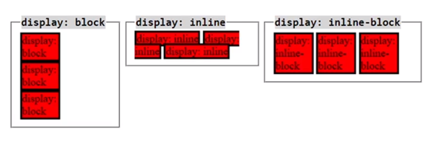

# DOM Tree


# CSS簡介

- Cascading Style Sheet 階層式樣式表

- [CSS reference - CSS: Cascading Style Sheets | MDN (mozilla.org)](https://developer.mozilla.org/en-US/docs/Web/CSS/Reference)
  
  不用全部屬性都知道 常用跟實用就夠

- <font style="color:lightgreen"> 還是直接拿上次故宮的例子接下去做@@ "</font> 

- `我決定新開CH3 複製品 、比較值觀方便` ，依舊會做Git 版控 : )

- comment 為 `/*....*/` 

## 取名方式不同 我叫GuGon 它叫index

- 自己注意 雖然我不知道會不會有問題、留意應該就ok !

# CSS放置位置

- <font style="color:lightgreen"> 查看方式F12 點選要查看物件 > 樣式 ~~blue~~ 的可知效果、順序</font>

- `inline styling`
  
   <font style="color:lightgreen"> 優先最高</font>但只能對特定標籤設定 最優先
  
  ```html
  <body>
      <h1 style="color: rgb(0, 118, 118)">國立故宮博物院</h1>
      <style>
        h1 , h2{
          color: blueviolet;   
        }
      </style>
  ```
  
  這邊 inline 不會被下面的style影響 但 沒寫=原本套用head style
  的h2藍色標題們 會變成紫羅色 !

- `internal styling`
  
  方便 但是難維護
  
  CSS 直接放在 HTML 中 
  
  ```html
  <style>
  h1 {
          color: red;
  }
  h2 {
          color: blue;
  }
  </style>
  ```

- `external styling`
  
  最常見、容易維護
  
  CSS 放外部 可以讓別的 HTML 也使用 !
  
  基本上都命名為 `style.css` 
  
  ```html
       ....
       <link rel="stylesheet" href="./style.css" />
  
   </head>
  ```
  
  使用外部CSS  連結的方式

# CSS顏色設定

- `<named-color>`[ CSS: Cascading Style Sheets | MDN (mozilla.org)](https://developer.mozilla.org/en-US/docs/Web/CSS/named-color) 

- Color Keyword: red、 black、coral....etc.

- RGB 
  
  - 0~255 共256 ^3   
  
  - 顏色通道 channel 每個顏色   `1byte` 儲存
  
  - ```css
    h1 {
      color: rgb(22, 355, 19);
    }
    ```

- RGBA
  
  - 同RGB但多了alpha 儲存透明度  `0-1`  表示 
  
  - 如下，接近亮綠
  
  - ```css
    h1 {
      color: rgba(22, 355, 19,0.5);
    }
    ```

- HEX
  
  - 使用十六進制  0-F 
  
  - 如下，淺灰
    
    ```css
    h1 {
      color: #AABBCC;
    }
    ```

- HSL 
  
  - Hue 色相
  
  - Saturation 飽和度
  
  - Brightness 亮度

# CSS Selectors 1

- Universal Selector (*) 匹配任何類型的HTML element。
  
  - ```css
    h1 {
      color: #aabbcc;
    }
    h2 {
      color: blue;
    }
    * {
      color: yellowgreen;
    }
    ```
  
  - 除h1,h2,以及`inlineStyle`，其他 HTML element都變黃綠色。

- Element Selector 可選擇特定的 HTML element。
  
  - ```css
    h2 {
      color: blue;
    }
    ```

- ID Selector可選擇有特定ID屬性的HTML element。
  
  - ```css
    #first-paragraph {
      color: coral;
    }
    ```

- Class Selector可選擇所有有特定class屬性的HTML element。
  
  - ```css
    .b-text {
      color: blue;
    }
    ```
  
  - 跟ID最大不同就是可以重複寫上去
  
  - space-separated "A-1 B-2"  代表有兩個類別 `A-1` `B-2` 
  
  - ```html
     <p id="first-paragraph" class="b-text large-text" onclick="alert('你按了<p>')">
    ```

- 使用標籤+類別如下
  
  - ```html
     <a class="large-text" href="https://www.npm.gov.tw/"> 故宮網站連結</a>
    ```
  
  - ```css
    a.large-text {
      font-size: 35px;
    }
    ```
  
  - 滑鼠移上去 就可以知道是不是真的套用到`<a class="large-text">`

# CSS Selectors 2

- Grouping Selector 可一次選擇所有數個 HTML 元素,並以逗號分隔。
  
  ```css
  h1,
  h2 {
    color: red;
  }
  ```

- Descendant Selector 由兩個或多個用空格分隔的選擇器組成。
  
  ```css
  /* -------Descendant Selector------------ */
  div.link1 a {
    color: red;
  }
  div.link2 a {
    color: green;
  } 
  ```

- 還有其他補充一下
  
  ```html
  <div class="container2">
        <a href="">oni</a>
        <div>
          <a href="">oniwww</a>
        </div>
        <a href="">umi</a>
        <a href="">corn</a>
  </div>
  ```
  
  ```css
  div.container2 {
    display: flex;
  }
  div.container2 > a {
    color: goldenrod;
  }
  ```
  
  \> a 是所有 \<div> 直接子標籤 \<a> 才可以 
  
  
  
  ` ` a 則是 \<div> 所有子孫標籤有 \<a> 都被選取

- Attribute Selector 選擇所有具有相同屬性的HTML 元素。
  
  ```css
  /* -------Attribute Selector------------ */
  input[type="text"] {
    color: rgb(248, 53, 53);
  }
  ```

# (39) Pseudo class, element

- `pseudo-class` 指定所選元素其特殊狀態(樣式) 
  
  :hover 滑鼠懸停在按鈕上
  
  :active 滑鼠按下去才變色
  
  :focus 專注 = 輸入會有 顯示藍色 那就是聚焦物件 
  
  :nth-child() 選擇第n個元素
  
  ```css
  p::before {
    content: ">>";
    color: rgb(47, 47, 255);
  }
  ```
  
  加入GuGonMuseum.html 第二段落`<p>` 之後使用~上面

- `pseudo-element` 設置所選元素的指定 '部分樣式' 
  
  ::first-line 用於更改段落第一行字體字型 
  
  ```css
  p::first-line {
    font-size: 29px;
    color: rgb(47, 47, 255);
  }
  ```
  
  真的就是只改第一行字體大小跟顏色，隨著螢幕放大縮小 某些文字因放大不在第一行就不再是藍色了。不只第一個`<p>` 第二個也會套用第一行。

- `*::selection` 改變反白 區塊的CSS
  
  ```css
  *::selection {
    background-color: aqua;
  }
  ```

        <font style="color: chartreuse;"> 上面蠻酷的</font>

# (40) CSS重點概念

- Inherited and Non-Inherited Properties
  
  - CSS 樣式<font style="color: chartreuse;"> 有些會被子元素繼承，有些不會。</font> 
    
    - Parent element / Child element
  
  - https://www.w3.org/TR/CSS21/propidx.html
  
  - 會繼承的 常見有
    
    - color
    
    - font-family
    
    - font-size
    
    - font-weight
    
    - list-style-type
    
    - text-align
  
  - 由於user agent styling 優先度 > inheritance 所以瀏覽器預設樣式可能覆蓋繼承屬性 例如 `<a>` 的顏色通常要額外設定。

- Conflicting Styling
  
  - 例如顏色衝突 ， 如下，以後執行為主。
  
  - ```css
    h1 {
      color: red;
    }
    h1 {
      color: blue;
    }
    ```
  
  - 衝突處理原則
    
    - Priority
    
    - Specificity
    
    - Order Rule

- Specificity 
  
  - <mark>順序而言</mark>  
    
    - Inline Styling
    
    - User Stylesheet ( .css )
    
    - User Agent Stylesheet
    
    - Inheritance
  
  - specificities
    
    - id - specificity (1,0,0)
    
    - class - specificity (0,1,0)
    
    - tag - specificity (0,0,1)
    
    ```html
    <h1 class="gugu">國立故宮博物院</h1>
    ```
    
    ```css
    h1.gugu {
      color: red;
    }
    .gugu {
      color: blue;
    }
    ```
    
    會發現後面沒有蓋掉前面，因為滑鼠移過去 
    
    (0,1,1) > (0,1,0)
    
    因為 `h1.gugu` 更加 specific 特定(具體)。 

- Order Rule 
  
  - 相同 specificity 則 後面覆蓋前面。
  
  - ```css
     <link rel="stylesheet" href="./style.css" />
     <link rel="stylesheet" href="./style2.css" />
    ```
    
    後者 覆蓋前者。

# (41) CSS 單位  【Text styling】

- `font-size` 可設置字體大小，分為 `絕對單位` 跟 `相對單位` 。

- `Absolute units` 指有預設的數值或是現實生活定義的單位
  
  px ( pixel ) = 2.54cm 的 1/96 、in、mm、cm之類都可以。

- `Relative units`  
  
  - `em` 相對於parent element的單位 根據上層節點計算
    
    ```css
    body {
      font-size: 40px;
    }
    h1 {
      font-size: 1em;   /* 40px*1   =40px */
    }
    ```
    
    瀏覽器如果沒動過通常是預設16px ( 下圖是預設的CSS )
    
    
    
    但通常避免使用em，因為 DOM tree越下層越難以計算。
  
  - `rem` root em的意思 根據瀏覽器預設為主而非parent
    
    也就是說 不會因為節點居後而縮小 ，而是固定倍數於瀏覽器預設。假設瀏覽器的預設為16px 則 2 rem=32px
  
  - `vw` viewport width  ( 瀏覽器視窗 ) 的寬度的 1/100 
    
    然而100vw長度略寬於網頁寬度，所以會出現horizontal scrollbar
    
    ```css
    /* ------------------ 使用 vw ----------------- */
    
    h1 {
      background-color: pink;
      width: vw;
    }
    ```
    
    通常不會設定`100vw`這樣， 我的電腦而言則是 `98vw` 才不會跑出水平scrollbar ( 圖例如下 )
    
    
  
  - `vh` 跟上面類似，基本單位是瀏覽器 高度  1/100
  
  - `%` 百分比 代表相對於 parent element的值
    
    假設父元素為width500px Child設定width 50%則其寬度為250px
    
    <font style="color: chartreuse;"> 突然發現如果vsCode輸入div.box 會變成</font> 
    
    ```html
    <div class="box"></div>
    ```

# (42-3) font 設定1-2 【Text styling】

- `text-align`  
  
  設置block element 或 table cell 中的 content的水平對齊位置。
  
  ```css
  h1 {
    text-align: center;
  }
  
  p {
    text-align: center;
  }
  /* ----- 對 <a> 使用text-align無效 因為不是block elem \ table cell ------ */
  
  /* ----- <a>  = inline elem ------ */
  a {
    text-align: right;
  }
  ```
  
  `<a>` 屬於 inline element 故對齊無效

- `text-decoration`   文字裝飾外觀
  
  ```css
  /* ----- <a>  讓超連結的底線消失 ------ */
  
  a {
    text-decoration: none;
  }
  ```

- `line-height` 文字each row之間的distance。 
  
  ```css
  /* ------------------ 使用 line-height ----------------- */
  p {
    line-height: 50px;
  }
  ```

- `letter-spacing` 文字水平間距
  
  ```css
  /* ------------------ 使用 letter-spacing ----------------- */
  p {
    letter-spacing: 5px;
  }
  ```

- `font-family` 為所選的元素指定一個或者多個字體系列的優先列表
  
  - [Noto Sans Traditional Chinese - Google Fonts](https://fonts.google.com/noto/specimen/Noto+Sans+TC) 從這邊玩
  
  - 
  
  - 因為我們使用的是 外部css 所以要先提供google `<link>` 在自己的.css 之前，這樣我們的css才能讀到這個沒見過的字體。
    
    ```html
    <link rel="preconnect" href="https://fonts.googleapis.com" />
    <link rel="preconnect" href="https://fonts.gstatic.com" crossorigin />
    <link
      href="https://fonts.googleapis.com/css2?family=Noto+Sans+TC&display=swap"
      rel="stylesheet"
    />
    <link rel="stylesheet" href="../../Chapter3/pages/style.css" />
    ```
    
    之後CSS設定
  
  - ```css
    /* ------------------ 使用 font-family google font ----------------- */
    img + p {
      font-family: "Noto Sans TC", sans-serif;
    }
    p::first-line {
      font-family: "Noto Sans TC", sans-serif;
    }
    ```
    
    除此之外也可以用<font style="color: chartreuse;"> h1~p 全體兄弟選擇器 </font> 選擇與 h1
    
    同位階 <font style="color: chartreuse;">( 輩分 )</font> 的元素 p

# (44) 背景樣式

- `background-color` 
  
  ```css
  /* ------------------ 使用 Background-color ----------------- */
  h1 {
    background-color: antiquewhite;
  }
  ```

- `background-im` 
  
  ```css
  /* ------------------ 使用 background-image ----------------- */
  body {
    font-family: "Noto Sans TC", sans-serif;
    background-image: url(../images/故宮圖片2.jpeg);
  }
  ```

- `background-size`
  
  > [background-size - CSS: Cascading Style Sheets | MDN (mozilla.org)](https://developer.mozilla.org/en-US/docs/Web/CSS/background-size)  有範例可以玩 !
  
  ```css
  body{
      background-size:contain;
      background-repeat:no-repeat;
  }
  ```
  
  > [Beautiful Free Images & Pictures | Unsplash](https://unsplash.com/) 免費圖庫
  
  圖片改用 101 。

- `background-position` 
  
  ```css
  background-position: bottom;
    /* 使用bottom會發現上面被裁切 */
  ```

- `background` 只是個shorthand
  
  > [background - CSS: Cascading Style Sheets | MDN (mozilla.org)](https://developer.mozilla.org/en-US/docs/Web/CSS/background) 有介紹  可減少打字
  
  ```css
  body {
    background: url(../images/tommy-tsao-TZldfnLPZ3Q-unsplash.jpg);
  }
  ```

# (45) Box Model 基本認識

## content、padding、border、...

- 每個 `block element` 都被視為一個Box ，由下組成。
  
  
  
  Inline element 只有持有 Box中的一部份屬性 ，不是Box。

- `content` 
  
  - 顯示內容的區域 ，用width 、height等屬性調整
    
    h1就是一個block元素
    
    ```css
    h1 {
      background-color: aqua;
      width: 300px;
      height: 500px;
    }
    ```
  
  - 透過 F12 查看會發現 怎麼會有被設定 margin ，從下面網址找h1即可知。
  
  > [CSS Default Browser Values for HTML Elements (w3schools.com)](https://www.w3schools.com/cssref/css_default_values.php) 

- `padding` 
  
  > [padding - CSS: Cascading Style Sheets | MDN (mozilla.org)](https://developer.mozilla.org/en-US/docs/Web/CSS/padding) 
  
  - ```css
    padding-left: 150px;
    padding: 15rem;  
    瀏覽器預設
    ```

- `border` 
  
  > [border - CSS: Cascading Style Sheets | MDN (mozilla.org)](https://developer.mozilla.org/en-US/docs/Web/CSS/border) 
  > 
  > [border-style - CSS: Cascading Style Sheets | MDN (mozilla.org)](https://developer.mozilla.org/en-US/docs/Web/CSS/border-style) 
  
  - 可以從上面網址查看border有哪些樣式
    
    - solid
    
    - dotted
    
    - dashed ...之類
  
  - ```css
     border: 5px solid blue;
    ```
  
  - 還有 `boder-radius` 能玩
  
  - ```css
    .box {
      width: 200px;
      height: 200px;
      background-color: blueviolet;
      border-radius: 50%;
    }
    ```
    
    
    
    ```css
    /*     GPT輔助  */
    .box2 {
      width: 200px;
      height: 200px;
      background-color: blueviolet;
      border-radius: 40%;
      text-align: center;
      position: relative;
      color: aqua;
    }
    
    .box2::before {
      content: var(--content-text, "40%");
      position: absolute;
      top: 50%;
      left: 50%;
      transform: translate(-50%, -50%);
    }
    ```
    
    後續再去研究 content跟transform 怎麼讓字跑到中心。

# (46) BoxModel - width, height與overflow屬性

- `width` 
  
  - 可以用%設定，跟著網頁寬度變動。

- `height`
  
  - <font style="color: chartreuse;">單用%設定，不會跟著變動，而是固定數值或0。因瀏覽器預設而異，除非親自設定ParentElement的height</font>。
    
    - 下面<mark>不會</mark>隨著視窗縮放改變
    
    ```css
    body {
            height: 1000px;
          }
    div.box {
            width: 50%;
            height: %;
            padding: 10px;
            border: 10px solid black;
            background-color: aquamarine;
          }
    ```
    
    - 下面<mark>會隨著</mark> ， 因為他的body使用 `vh` 單位
    
    ```css
    ```css
    body {
            height: 80vh;
          }
    div.box {
            width: 50%;
            height: %;
            padding: 10px;
            border: 10px solid black;
            background-color: aquamarine;
          }
    ```
    
    ```
    
    ```
  
  - 使用Lorem20 跟 Lorem100 ，使用F12會發現 `<p>` 高度不同，是瀏覽器自己決定，因為我們沒定義。

- `overflow` 
  
  通常不會去設定某個元素的高度，而是browser自己根據內容決定元素高度。否則需要去考慮overflow的情況，也就是寬度或者高度小於content ，去設定overflow屬性來選擇處理方式。
  
  - `visible-content` 
    
    - 不會被修剪，可以呈現在元素框之外，為預設值。
      
      ```css
      p {
          background-color: bisque;
          height: 100px;
      }
      ```
      
      
      
      
  
  - `hidden` 
    
    - 隱藏，不顯示。
  
  - `scroll`
    
    - 提供滾動軸
  
  - `overflow-x` 、`overflow-y` 
    
    - 特定方向個別設定。
      
      
    
    ```css
    p {
            background-color: bisque;
            height: 100px;
            /* overflow: hidden; */
            /* overflow: scroll; */
            overflow-y: scroll;
          }
    ```

# (47) BoxModel - content-box and border-box

## box-sizing : border-box / content-box

- `content-box`  
  
  
  
  高= 150+25+25+5+5=210px ( 不計入margin = 餘裕 )
  
  CSS **預設 box-sizing == content-box**
  
  所以 width height 為content的高寬 。

- `border-box`
  
  
  
  如果使用border-box 則 width 跟 height 包含 :
  
  content+padding+border 。  ( margin 餘裕不計算) 
  
  350 - ( 25\*2 ) - ( 5\*2 ) = 290

# (48)  border-box示範(練習)

- 實際如下
  
  ```css
   * {
     margin: 0px;
     padding: 0px;
     box-sizing: border-box;
  }
   p {
     width: 500px;
     background-color: beige;
     padding: 50px;
     border: solid yellow 5px;
  }
  ```
  
  由於 寬度固定， 內部padding增加，高度沒給定，所以高度增加才能使內容通通填入 ( 沒設定高，所以採 overflow 預設值 = 瀏覽器自訂 )

- 所以通常不設定 height 否則還要設定 overflow ... 否則內容會超出框

# (49) Display屬性

## outer display / inner display

## outer有block、inline、inline-block之類

- `outer display type` 
  
  - `block`
    
    ```html
    <a class="myClass" href="https://www.npm.gov.tw/"> 故宮網站連結</a>
    <a href="https://www.gamer.com.tw/"> 巴哈姆特連結</a>
    ```
    
    ```css
    .myClass {
      display: block;
      width: 250px;
      height: 100px;
      background-color: burlywood;
    }
    ```
    
    改成這樣之後，超連結原本同一行，會自動換行 ( block特性 )。
    
    <mark>使用 inline 則 width跟height 無效</mark> 
  
  - `inline` 
    
    - 動它的width、height 不會有效果。
    
    - 他的padding、margin 則會覆蓋到別人身上。
    
    - 下面表格有提到<mark>不會推開</mark>其他`element`，實際程式碼跟圖片如下
      
      ```html
      <div style="background-color: salmon">
        <a class="myClass2" href="https://www.gamer.com.tw/"> 巴哈姆特連結</a>
      </div>
      <div style="background-color: aquamarine">
        <a class="myClass" href="https://www.npm.gov.tw/"> 故宮網站連結</a>
      ...</div>
      ```
      
      ```css
      /* ------------------------------ inline ----------------------------- */
      .myClass2 {
        width: 250px;
        height: 100px;
        background-color: rgb(244, 161, 52);
        padding: 1.5rem 3rem;
      }
      ```
      
      
  
  - `inline-block`  例如圖片，空間不夠 = 上下排列、空間夠=水平排列。
    
    ```html
    
    
    
    ```
    
    ```css
    #image1 {
      width: 600px;
      height: 300px;
    }
    #image2 {
      width: 500px;
      height: 400px;
    }
    ```
  
  
  
  | display tpye | 換行        | width   height                              | 上下margin、padding                                           | 左右margin、padding | 範例                                                 |
  |:------------:|:---------:|:-------------------------------------------:|:----------------------------------------------------------:|:----------------:|:--------------------------------------------------:|
  | block        | 會         | 可設定                                         | 可設定                                                        | 可設定              | `<h1>`、`<p>` ...                                   |
  | inline       | 不會        | <font style="color:lightgreen"> 不能設定</font> | 可設定，<font style="color:lightgreen"> 但不會推開其他elements</font> | 可設定              | `<a>``<span>` ...                                  |
  | inline-block | 不一定、看空間決定 | 可設定                                         | 可設定                                                        | 可設定              | 只有```<button>``<input>``<select>``<textarea>` |
  | flex item    | 不會        | 可設定                                         | 可設定                                                        | 可設定              | 任何在flex之下的element                                  |

- `inner display type` 
  
  - 決定boxes內部元素，在網頁的排版呈現，之後才談。
    
    - `flex`
    
    - `grid` 

# (50) Position 1

## position 屬性 設置元素在文檔的定位方式

> top bottom left right 四個屬性用來確定定位元素的最終位置。

--- 

static 、relative 、absolute  、 ( 下一節51講 )  fixed、 sticky 

---

- `static`  
  
  - 元素根據文檔的normal flow 定位。
    
    top bottom left right 和 z-index 屬性無效，此為position的預設值。
    
    > CSS normal flow 是指瀏覽器的正常排版規則，例如block element換行、inline element 並排直到沒空間之類。
    > 
    > **<u>Static 並不是 positioned element </u>**=> 指的是元素按照正常文檔流自然排列，而不受任何額外定位的影響。
  
  - `z-index` 相同的 stacking context的情況下，positioned element會使有較大的z-index <mark>覆蓋較小者</mark>，static不會。
  
  - <mark>positioned element 是指被定位的元素</mark>，也就是設置了 `position` 屬性為 `relative`, `absolute`, `fixed` 或 `sticky` 的元素。

- `relative` 
  
  - 想要偏離原本該存在的位置，保持預留位置 (布局)。
    
    ```html
    <div class="container">
          <div class="box box1">1</div>
          <div class="box box2">2</div>
          <div class="box box3">3</div>
    </div>
    ```
    
    ```css
    .box2 {
      background-color: goldenrod;
      position: relative;
      top: 100px;
      left: 30px;
      z-index: 10;
    }
    .box3 {
      background-color: cornflowerblue;
      position: relative;
      right: 20px;
      z-index: 5;
    }
    ```
    
    偏離原本的位置。
    
    
    
    <mark>如果使用 static + index-z 則無效</mark>
    
    ```css
    .box2 {
      background-color: goldenrod;
      position: relative;
      top: 100px;
      left: 30px;
      z-index: 10;
    }
    .box3 {
      background-color: cornflowerblue;
      position: static;
      right: 20px;
      z-index: 15;
    }
    ```
    
    

- `absolute` 
  
  - 元素從normal flow 中移除，不保留空間。
    
    根據top bottom left right的值進行定位。
    
    參考對象是<mark>closest positioned ancestor</mark>，如果往上父元素找都沒有人是positioned element，則定位參考initial containing block = 瀏覽器初始視窗。
    
    > <font style="color:lightgreen">再次提示只要不是 **static** 的定位方式 那就是 **positioned element** !</font> 
    
    ```css
    div.container {
      width: 500px;
      height: 2000px;
      background-color: aquamarine;
      /* 如果父元素 是 positioned elem 則依據此元素定位，打開看差別 */
      position: relative;
    }
    .box {
      width: 200px;
      height: 200px;
    }
    .box1 {
      background-color: beige;
    }
    .box2 {
      background-color: goldenrod;
      position: absolute;
      top: 0px;
      right: 0px;
      z-index: 10;
    }
    .box3 {
      background-color: cornflowerblue;
      position: static;
      right: 20px;
      z-index: 15;
    }
    ```
    
    

# (51) Position 2

## position 屬性 設置元素在文檔的定位方式

- `fixed`
  
  - 該元素從normal flow中移除，不保留空間，根據 top、bottom、left、right定位，固定在瀏覽器視窗的固定位置，類似購物車那樣懸浮、固定在那。
    
    定位參考為 viewport 形成的initial containing block

- `sticky`
  
  - **<u>relative 和 fixed 的混合體</u>** 
    
    一開始視為相對定位，直到超過threshold，此時變成fixed。
    
    > [首頁.-衛生福利部疾病管制署 (cdc.gov.tw)](https://www.cdc.gov.tw/) 範例
    
    如果指定
    
    ```css
    .box2 {
      background-color: goldenrod;
      position: sticky;
      top: 50px;
      left: 300px;
    }
    ```
    
    則一開始relative 直到 scroll down，然後它會強迫.box2 跟視窗上方保持 50px。
    
    另外，會保留原始空間 (預留)。
    
    

# (52-53) Sticky, Fix 比較補充

- `sticky` 
  
  上小節沒說到，它會依賴Parent 的空間，所以不會一直保持50px，
  
  它會黏在Parent給予的空間最下面而不會超出。
  
  ```html
   <div class="container">
        <div class="box box1">1</div>
        <div class="box box2">2</div>
        <div class="box box3">3</div>
      </div>
  ```
  
  ```css
  body {
    height: 3000px;
  }
  
  div.container {
    width: 500px;
    height: 1000px;
    background-color: aquamarine;
  }
  .box {
    width: 200px;
    height: 200px;
  }
  .box1 {
    background-color: beige;
  }
  .box2 {
    background-color: goldenrod;
    position: sticky;
    top: 50px;
    left: 300px;
  }
  .box3 {
    background-color: cornflowerblue;
  }
  ```
  
  

- `fixed` 
  
  - 除了會從normal flow 移除，也會一直往下，超出Parent element。
    
    
  
  - 另外很重要就是說<mark>這邊的 top bottom left right 是 threshold 而不是位置偏移量</mark> 
    
    
  
  - 如上圖所示，只是碰巧調到而已。

# (54) Stacking Context, Cursor, Table

- **Stacking Context**
  
  - HTML元素沿著 假想z軸穿出螢幕指向用戶的3D概念
    
    形成情況包含以下 ( 不限於 )
    
    - Root element of the document <html>
    
    - <font style="color:lightgreen">任何元素有設定position 為 absolute 或 relative 且 z-index不是auto </font>
      
      則其 <u>**內部形成新的 stacking context**</u> ，其<u>**本身不算**</u>在內=不在一組。
      
      <mark>例子如下</mark> 
    
    ```html
    <div class="container">
          <div class="box box1">1</div>
          <div class="box box2">
            2
            <div class="small-box box4">4</div>
            <div class="small-box box5">5</div>
          </div>
          <div class="box box3">3</div>
    </div>
    ```
    
    ```css
    .box2 {
      background-color: goldenrod;
      position: relative;
      z-index: 0;
    }
    .box3 {
      background-color: cornflowerblue;
    }
    .box4 {
      background-color: greenyellow;
      position: absolute;
      top: 70px;
    
      z-index: -1;
    }
    .box5 {
      background-color: brown;
      position: relative;
      z-index: 2;
    }
    ```
    
    
    
    `4` [綠色] 並沒有被 `2` [玉米色] 覆蓋 。 因為`2`獨立於 `4`跟 `5` 的 z-index
    
    > 自己去MDN參考更多情況

- **表格樣式設定** 
  
  簡單講一下表格設定然後她為了示範 overflow-x:auto
  
  ```html
  <div style="overflow-x: auto">
        <table>
          <thead>
            <tr>
              <th colspan="3">故宮的基礎資訊</th>....
  ```
  
  ```css
  /* ------------------------------ (54) 表格樣式 ----------------------------- */
  table,
  th,
  tr,
  td {
    /* border: solid salmon; */
    border-bottom: solid salmon;
    border-collapse: collapse;
  }
  th,
  td {
    padding: 50px 150px;
  }
  tr:hover {
    background-color: aqua;
  }
  ```
  
  我使用增加padding讓表格變大，模擬手機擠不下，然後縮小時，overflow-x : auto 就會自動添增 scroll bar 給div以呈現完整表格。
  
  

- `opacity` 
  
  - 0 = 透明
    
    1 = 實體
    
    ```css
    td {
      padding: 50px 150px;
      /* Opacity 0 =透明 1=實體=預設*/
      opacity: 0.3;
    }
    ```

- `cursor` 
  
  > [cursor - CSS: Cascading Style Sheets | MDN (mozilla.org)](https://developer.mozilla.org/en-US/docs/Web/CSS/cursor) 
  
  - 切換滑鼠圖案
    
    下面有效果
    
    ```css
    td {
      cursor: pointer;
    }
    ```
  
  - 如果使用td:hover 則無效果出現

# (55) Transition

- 該屬性可以幫助我們設定某個CSS屬性轉化時的timing function、速度。本身為一個 shorthand property，可一次設定四種以下屬性。
  
  - transition-property
  
  - transition-duration
  
  - transition-timing-function
  
  - transition-delay
  
  > [transition - CSS | MDN (mozilla.org)](https://developer.mozilla.org/zh-TW/docs/Web/CSS/transition) 
  
  > [Easing Functions Cheat Sheet (easings.net)](https://easings.net/) 
  
  ```css
  /* ----------------------------- (55) Transition ----------------------------- */
  
  h1 {
    transition: all 2s ease-out;
  }
  h1:hover {
    background-color: aqua;
  }
  /* 提示transition放入:hover則只有懸浮時有過渡效果、離開沒有 */
  ```
  
  如果 transition放到 hover 又會有不同效果

# (56) Transform

- 該屬性允許我們旋轉、縮放、傾斜或平移HTML元素。
  
  可以設定的值有以下，皆可分別設定x,y,z的變換 :
  
  - `translate` 
    
    ```css
    /* ------------------------------ (56) Transform ----------------------------- */
    div.container {
      width: 1000px;
      height: 1000px;
      background-color: aqua;
    }
    div.box {
      width: 100px;
      height: 100px;
      background-color: orange;
      transition: all 1s ease-out;
    }
    div.box:hover {
      transform: translate(100px, 200px);
    }
    ```
    
    - <mark>下面教你置中 div</mark>
      
      由於top、 left 50%只有橘色箱子左上角的點在中心所以運用
      
      transform 就可以達成想要的置中了~
    
    ```css
    div.container {
      width: 300px;
      height: 300px;
      background-color: aqua;
      position: relative;
    }
    div.box {
      width: 100px;
      height: 100px;
      background-color: orange;
      transition: all 1s ease-out;
      position: absolute;
      top: 50%;
      left: 50%;
      transform: translate(-50%, -50%);
    }
    div.box:hover {
      transform: translate(100px, 200px);
    }
    ```
    
    
  
  - `rotate` + `scale`
    
    ```css
    /* ------------------------------ (56) Rotate ----------------------------- */
    div.container {
      width: 300px;
      height: 300px;
      background-color: aqua;
      position: relative;
    }
    div.box {
      width: 100px;
      height: 100px;
      background-color: orange;
      transition: all 1s ease-out;
      position: absolute;
      top: 50%;
      left: 50%;
      transform: translate(-50%, -50%);
    }
    div.box:hover {
      /* 下面的translate是為了不要讓div.box的transform失效 */
      transform: scale(2, 1) RotateZ(180deg) translate(-50%, -50%);
      /* 可以自己玩XYZ ，取下Scale看看原本的*/
      /* 不能夠重複寫 無效而且壞掉*/
      /* transform: translate(-50%, -50%); */
    }
    ```
    
    

# (57) Animation

## animation-name|duration|timing-funciton|delay|.....

是一個 shorthand property 可一次設定多種 順序跟下面介紹一樣，如果跳過則使用CSS預設值。

- animation-name (keyframes)

- animation-duration

- animation-timing-function

- animation-delay

- animation-iteration-count

- animation-direction、animation-fill-mode、animation-play-state...之類。

```css
/* ------------------------------ (57) Animation ----------------------------- */
div.container {
  width: 300px;
  height: 300px;
  background-color: aqua;
}
div.box {
  width: 100px;
  height: 100px;
  background-color: orange;
  position: relative;
  /*下面能一行替代其後面的部分  */
  /* animation: changeColor 2s ease-in 1s infinite alternate forwards; */
  animation-name: changeColor;
  animation-duration: 2s;
  animation-timing-function: ease-in;
  animation-delay: 1s;
  animation-iteration-count: infinite;
  /* 倒放動畫 */
  /* animation-direction: reverse; */
  /* 正反播放 */
  animation-direction: alternate;
  /* 維持最後顏色 */
  animation-fill-mode: forwards;
}
@keyframes changeColor {
  from {
    background-color: yellow;
    top: 0px;
    left: 0px;
  }
  to {
    background-color: blue;
    top: 200px;
    left: 200px;
  }
}
```


# CH3考試有意思的題目

- 程式碼放置於 internal styling 優點跟缺點是
  
  - 不方便維護但是方便寫。

- CSS 優先順序為
  
  1. Inline Styling
  
  2. Inheritance
  
  3. User Agent Stylesheet
  
  4. User Stylesheet ( 內部順序由Specificity決定 )

- 如果年長使用者的網頁瀏覽器設定字體放大，則在CSS中設定1rem以及1em的長度分別會是？
  
  - 兩者都跟瀏覽器設定有關係，只是 `rem` 不會被 Parent 綁架，直接先綁定root ( 瀏覽器預設 )。

- 設定block element的height: 50%並不能改變其高度的根本原因是因為？
  
  - 它是說 所有element高度都是auto，如果要求根據預設計算則會得到undefined。
  
  - 不過好像如果元素是relative 
