# (58) Semantic Elements

## HTML Semantic Tags

例如 div 可以知道他可能佔據一個block ， 但要詳細看才知道。

因此 HTML5 開始，新增了 

- \<article>

- \<aside>

- \<details>

- \<figcaption>

- \<figure>

- \<footer>

- \<header>

- \<main>

- \<mark>

- \<nav>

- \<section>

- \<summary>

- \<time> 等等 semantic tags。

> Semantic elements = elements with a meaning.
> 
> 以上標籤本質上跟 div 一樣 只是更具形象意義

> **正確使用可以很好告訴團隊每個標籤作用與功能。** 
> 
> [HTML Semantic Elements (w3schools.com)](https://www.w3schools.com/html/html5_semantic_elements.asp) 


# (59) RWD設計

## 響應式網頁 Responsive Web Design

以前使用需要針對不同裝置進行不同的設計，目前主流則是 : 

- Flexbox 自動排版 不用再去對不同螢幕寬度作個別設定

- 元素、圖片皆使用相對單位，例如 rem、%、vh、vw調整大小防止跑版

## Flexbox

主要思想是讓容器能夠改變其項目的寬高、順序，最好地填充可用空間，適應各種設備。彈性容器擴展項目可填充可用的空間、或縮小他們以防溢出。

> [A Complete Guide to Flexbox | CSS-Tricks - CSS-Tricks](https://css-tricks.com/snippets/css/a-guide-to-flexbox/) 

### Properties for the Parent ( flex container)

- display : flex 是一種 `inner display type`。

- 任何元素被定義為 display : flex 其內部元素皆為 `flex item` 

- `flex item` 可以定義 display : flex 。
  
  - 因此，元素可同時為 `flex item` 兼 flex-container <容器>。
  
  - 對於該元素`outer display type` 是 flex item  然而
    
    `inner display type`是 flex 。  `身 兼 兩 職`  
  
  ```html
  <div class="container">
        <div class="box box1">box1</div>
        <div class="box box2">box2</div>
        <div class="box box3">box3</div>
        <div class="box box4">box4</div>
        <div class="box box5">box5</div>
  </div>
  ```
  
  ```css
  /* ------------------------------ (59) flex ----------------------------- */
  div.container {
    border: 3px solid black;
    display: flex;
  }
  .box {
    width: 250px;
    height: 250px;
  }
  .box1 {background-color: coral;}
  .box2 {background-color: aquamarine;}
  .box3 {background-color: burlywood;}
  .box4 {background-color: goldenrod;}
  .box5 {background-color: thistle;}
  ```
  
  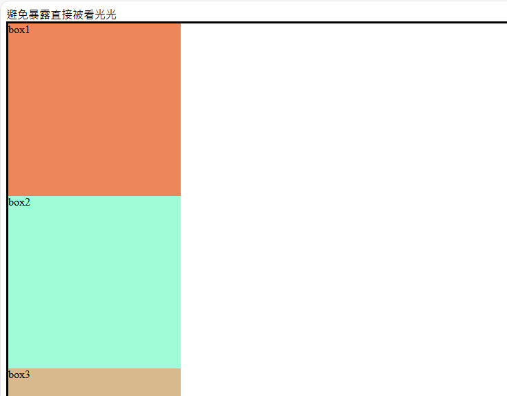
  
  

- 比較兩個 會發現 flex 讓 容器變成橫的 而且 div.container 空間有效利用
  
  
  
  很酷。

> **接下來 演示 \<a> 變成 flex item 改變原本 inline element**<mark>不能更改 w,h 的特性變成可以改w,h。 </mark> 

- 原因就是它變成了 flex item 
  
  ```html
  <div class="container2">
    <a href="">oni</a>
    <a href="">umi</a>
    <a href="">corn</a>
  </div>
  ```
  
  ```css
  div.container2 {
    display: flex;
  }
  /* 直屬子標籤用 > 選擇 */
  div.container2 > a {
    color: goldenrod;
    /* %依舊不能用在高 */
    height: 35px;
    width: 15%;
    background-color: cadetblue;
    border: salmon solid 2px;
  }
  ```
  
  會發現原本明明不能改w,h的 a 突然可以改 ~ 因為他變成flex item
  
  

- `套娃`  
  
  ```html
  <div class="container">
    <div class="box box1">box1</div>
    <div class="box box2">
      <div class="smallbox">smallbox1</div>
      <div class="smallbox">smallbox2</div>
      <div class="smallbox">smallbox2</div>
    </div>
    <div class="box box3">box3</div>
    <div class="box box4">box4</div>
    <div class="box box5">box5</div>
  </div>
  ```
  
  ```css
  /* ------------------------------ smallbox in flex item----------------------------- */
  /* 拿掉flex 或說改成block(div預設) 可知有什麼不同 *//
  .box2 {
    display: flex;
  }
  .smallbox {
    border: 3px solid violet;
    height: 70px;
    width: 70px;
    /* w 90也會有所感悟 */
  }
  ```
  
  
  
  可以看出 裡面的flex item 原本預設也是block 但是能改flex

# (60) flex direction,flex-wrap

## flex-direction

可以設置item的排序方向 (main axis)


- row - flex 橫向 ( 預設 )

- column-flex  直向

- row-reverse-flex 逆橫

- column-reverse-flex 逆直
  
  ```css
  /* ------------------------------ (60) flex-direction ----------------------------- */
  div.container {
    border: 3px solid black;
    display: flex;
    flex-direction: row-reverse;
  }
  ```
  
  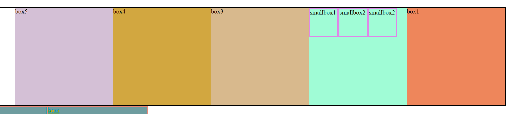

- 下面是拿掉flex-item = `.box{}`的高跟寬，則預設由其內容填充。
  
  `寬度` : 文字寬。
  
  `高度` : 裡面 smallbox 設定高度所以撐高了 div 所以就變成這樣。
  
  

## flex-wrap

- 💡預設no wrap ， 可以壓縮直到內容極限， 不會換行。

- 使用wrap 可以幫助我們換行。
  
  ```css
  div.container {
    border: 3px solid black;
    display: flex;
    /* flex-direction: row-reverse; */
    /* wrap 預設=no wrap */
    flex-wrap: wrap;
  }
  ```
  
  

# (61) justify-content, align-items

## justify-content

定義瀏覽器如何沿著flex container的 main axis在 flex items 分配空間


- flex-start ( 預設值 )

- flex-end

- center

- space-between

- space-around

- space-evenly
  
  ```css
  /* ------------------------------ (61) justify-content ----------------------------- */
  div.container {
    height: 1500px;
    border: 3px solid black;
    display: flex;
    /* flex-direction: row-reverse; */
    /* wrap 預設=no wrap */
    flex-wrap: wrap;
    /* 預設 flex-start */
    /* justify-content: flex-start;  */
    /* justify-content: flex-end; */
    /* justify-content: center; */
    /* justify-content: space-between; */
    /* justify-content: space-around; */
    /* evenly 平均分配 */
    justify-content: space-evenly;
    flex-direction: column;
  }
  ```
  
  
  
  可以看出來 即使垂直，有預留空間分配也能使用 `justify-content`

## align-items

💡與 main axis 軸 `垂直的`另一軸上的對齊方式


- stretch ( 預設值 )
  
  由於 `.box{}`  有設定高 所以不會被拉伸 ，先取消才會拉伸。
  
  且要水平才會拉伸效果，也就是flex-direction 為 row 之流派。
  
  ```css
  /* ------------------------------ (61) justify-content ----------------------------- */
  div.container {
    height: 1500px;
    border: 3px solid black;
    display: flex;
    /* flex-direction: row-reverse; */
    /* wrap 預設=no wrap */
    flex-wrap: wrap;
    /* 預設 flex-start */
    /* justify-content: flex-start;  */
    /* justify-content: flex-end; */
    /* justify-content: center; */
    /* justify-content: space-between; */
    /* justify-content: space-around; */
    /* evenly 平均分配 */
    justify-content: space-evenly;
    flex-direction: row;
    align-items: stretch;
  }
  .box {
    width: 250px;
    /* height: 250px; */
  }
  ```
  
  

- flex-start
  
  ```css
    ....
    justify-content: space-evenly;
    flex-direction: row;
    align-items: flex-start;
  }
    .box {
    width: 250px;
    /* height: 250px; */
  }
  ```
  
  

- flex-end
  
  ```css
    ...
    justify-content: space-evenly;
    flex-direction: row;
    align-items: flex-end;
  }
    .box {
    width: 250px;
    /* height: 250px; */
  }
  ```
  
  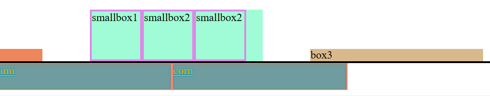

- center
  
  ```css
     ...
    justify-content: space-evenly;
    flex-direction: row;
    align-items: center;
  }
    .box {
    width: 250px;
    /* height: 250px; */
  }
  ```
  
  

- baseline 
  
  🔥 <mark>以上我都並沒有還它們 `.box{}` 的高 ! </mark> 🔥
  
  
  
  ```css
  /* ------------------------------ (61) justify-content ----------------------------- */
  div.container {
    height: 1500px;
    border: 3px solid black;
    display: flex;
    /* flex-direction: row-reverse; */
    /* wrap 預設=no wrap */
    flex-wrap: wrap;
    /* 預設 flex-start */
    /* justify-content: flex-start;  */
    /* justify-content: flex-end; */
    /* justify-content: center; */
    /* justify-content: space-between; */
    /* justify-content: space-around; */
    /* evenly 平均分配 */
    justify-content: space-evenly;
    flex-direction: row;
    align-items: baseline;
  }
  .box {
    width: 250px;
    /* height: 250px; */
  }
  ```
  
  效果可以說跟flex-start 好像一致 ?
  
  
  
  > 決定讓紫色框框文字置中 透過transfrom => 失敗了、不會影響
  > 
  > rotate也無效 scale 也是
  
  ```css
  .box2 {
    display: flex;
    transform: translateY(50px);
  }
  ```
  
  
  
  
  
  🔥實際做一下如下，<mark>主要是因為smallbox的margin讓文字基準線往下</mark>🔥
  
  ```css
  .box2 {
    display: flex;
    /* transform: rotateX(180deg); */
    height: 300px;
  }
  .smallbox {
    margin-top: 100px;
    border: 3px solid violet;
    height: 70px;
    width: 70px;
  
    /* w 90也會有所感悟 */
  }
  ```
  
  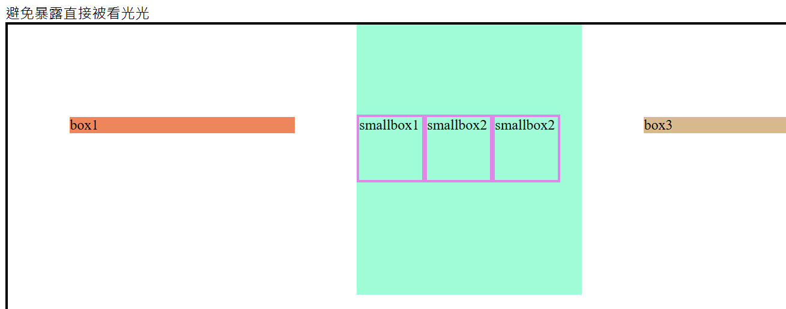
  
  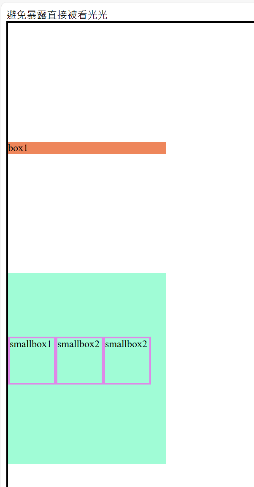
  
  🔥上面另外也提供 flex-direction : column 🔥

# (62) flex grow, shrink, basis

**Flex items 可設定的常見屬性包含 :** 

- **flex-grow** 
  
  指定如何將 flex container 中的剩餘空間 remaining space 分配給 flex items。 flex-grow 屬性可以設定每個 flex item 的彈性增長因子 ( grow factor ) 。 成長因子範圍 = [0,infinite)  。
  
  - remaining space 是 flex container 的大小減 flex items 的總和。
    
    如果所有同級的flex items 具有相同的 grow factor 則所有項目將獲得相同的剩餘空間份額，否則會依據 持有的 factor 比例分配。

- **flex-shrink** 
  
  定義 flex item 必要時的收縮能力。
  
  > [flex-shrink - CSS: Cascading Style Sheets | MDN (mozilla.org)](https://developer.mozilla.org/en-US/docs/Web/CSS/flex-shrink) 
  
  - 💡預設為1 也就是會收縮，縮到容器內。
  
  - 💡如果設0 則不收縮，不壓縮item，所以會凸出container 邊界。

- **flex-basis** 
  
  基本寬或高，取決於使用的flex-direction方向是row 或 column，如果是row 則對應寬，反之則高，下面有介紹。 
  
  - 💡如果使用 % 則是**取決於父容器的寬或高的百分比** !
  
  - 💡如果 flex-wrap:wrap 則 若顯示的寬或高 被限縮到低於 基準則會往下掉，移動到其他空間。

> **以上三種可用shorhand property flex: 一次設定**

- **align-self** 

---

`以下為範例`

> 下面示範，移除.box 寬高 改用 flex-basis 則將依據 剩餘空間分配%數

```css
/* ------------------------------ (62) Flex grow shrink basis  ----------------------------- */
div.container {
  height: 1500px;
  border: 3px solid black;
  display: flex;
  /* flex-direction: row-reverse; */
  /* wrap 預設=no wrap */
  flex-wrap: wrap;
  /* 預設 flex-start */
  /* justify-content: flex-start;  */
  /* evenly 平均分配 */
  justify-content: space-evenly;
  flex-direction: row;
  align-items: baseline;
}
.box {
  /* width: 250px; */
  /* height: 250px; */
}
```

`flex item 也就是 .box{} 寬高`

> 還沒設定，處於content寬度。 綠色高度是被紫框margin撐高的。


> 設定 flex-basis : 200 px  沒特別說寬或者高 則依照 flex-direction決定，🔥目前處於 row (也是預設) 所以 自動設定的會是寬。🔥

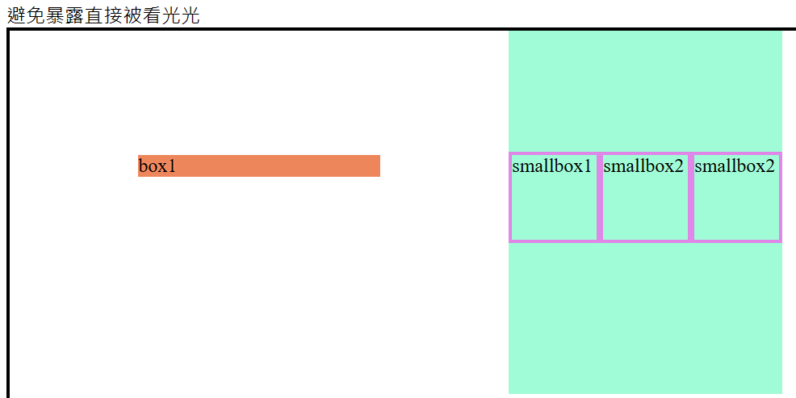

> 如果設定🔥 flex-basis:50% 是依照其父容器的寬 / 高計算🔥 ，這邊因為flex-direction:row 所以會如下圖顯示，各佔一半。

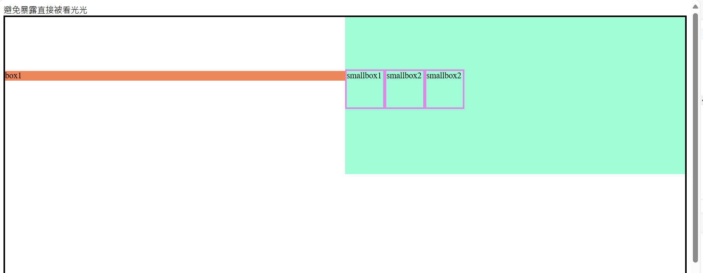

`flex item 附加屬性flex-grow 進去 也就是寫在 .box{}內`

> 如果 .box1  \~ .box5 都設定 flex-grow : 1 ，flex-basis:200px  則
> 
> 🔥main axis剩餘空間將毫無保留的  /平均/  分配使用。🔥
> 
> 如下圖大家都佔據相同剩餘的份額 + ( 本身設定基本200px )

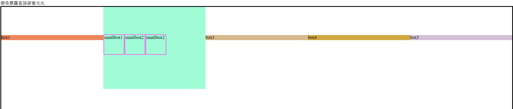

> 下面程式碼我設定為 **.box2 flex-grow : 6**  其他boxes **:** 1 

```css
/* ------------------------------ (62) Flex grow shrink basis  ----------------------------- */
div.container {
  height: 1500px;
  border: 3px solid black;
  display: flex;
  /* flex-direction: row-reverse; */
  /* wrap 預設=no wrap */
  flex-wrap: wrap;
  /* 預設 flex-start */
  /* justify-content: flex-start;  */
  /* justify-content: flex-end; */
  /* justify-content: center; */
  /* justify-content: space-between; */
  /* justify-content: space-around; */
  /* evenly 平均分配 */
  justify-content: space-evenly;
  flex-direction: row;

  align-items: baseline;
}
.box {
  /* width: 250px; */
  /* height: 250px; */
  flex-basis: 200px;
}
.box1 {
  flex-grow: 1;
  background-color: coral;
}
.box2 {
  flex-grow: 6;
  background-color: aquamarine;
}
.box3 {
  flex-grow: 1;
  background-color: burlywood;
}
.box4 {
  flex-grow: 1;
  background-color: goldenrod;
}
.box5 {
  flex-grow: 1;
  background-color: thistle;
}
/* ------------------------------ a 原本不能改w h  ----------------------------- */
div.container2 {
  display: flex;
}
/* 直屬子標籤用 > 選擇 */
div.container2 > a {
  color: goldenrod;
  /* %依舊不能用在高 */
  height: 35px;
  width: 15%;
  background-color: cadetblue;
  border: salmon solid 2px;
}
/* ------------------------------ smallbox in flex item----------------------------- */
/* 拿掉flex 或說改成block(div預設) 可知有什麼不同 */
.box2 {
  display: flex;
  /* transform: rotateX(180deg); */
  height: 300px;
}
.smallbox {
  margin-top: 100px;
  border: 3px solid violet;
  height: 70px;
  width: 70px;

  /* w 90也會有所感悟 */
}
```

右邊下面為 藍綠色的區塊的配置圖，254 然後滑鼠指向為209 我原本分配是200px 每個人`flex-basis:200px` 🔥有看到grow factor 6 跟1 的差別了吧🔥

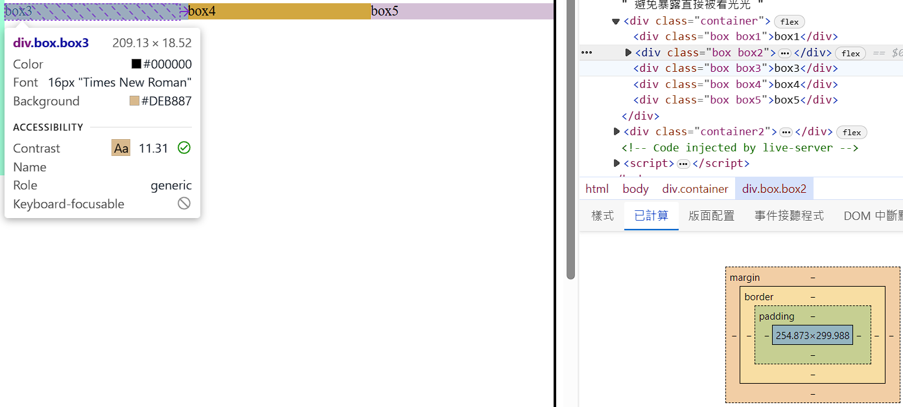

`關於flex-shrink收縮` 

> 如果basis 是固定值，然後容器因網頁縮放而變小，flex item 是否跟著縮小，或者🔥突出 flex container 🔥。

```css
.box {
  /* width: 250px; */
  /* height: 250px; */
  flex-basis: 3000px;
  flex-shrink: 1;
}
```

由於我的 container 沒設定寬 (自動撐滿網頁寬度)，所以3000px一定 > 容器寬

**當我設定shrink : 1結果顯示如下**

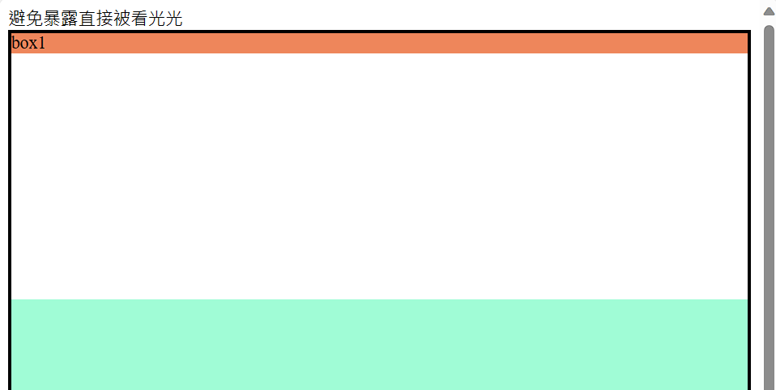

 **當我設定shrink : 0結果顯示如下** ， 每個都突出，當然也可單獨設定box1、2、3

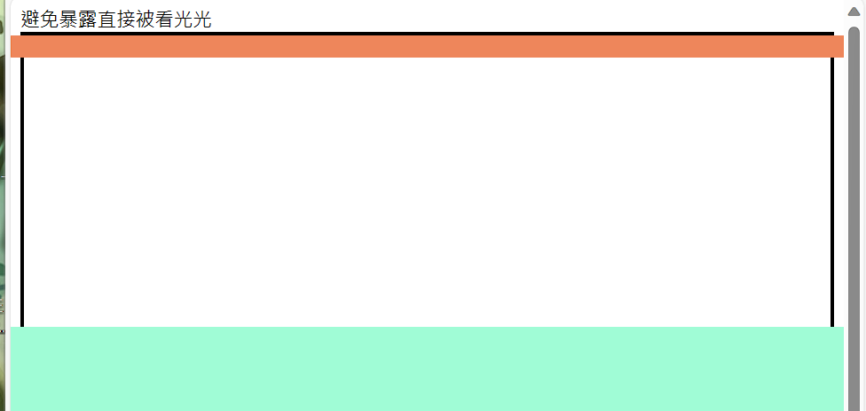

# (63) align-self

💡允許 flex item 複寫 默認對齊方式

- 這邊說的默認對齊
  
  指的是 **Flex Contanier 的屬性 align-items** 指定的對齊方式。

`下面實際 獨讓 .box3  center，其他則 baseline` 

```css
/* ------------------------------ (62) Flex grow shrink basis  ----------------------------- */
div.container {
  height: 600px;
  border: 3px solid black;
  display: flex;
  /* flex-direction: row-reverse; */
  /* wrap 預設=no wrap */
  flex-wrap: wrap;
  /* 預設 flex-start */
  /* justify-content: flex-start;  */
  /* justify-content: flex-end; */
  /* justify-content: center; */
  /* justify-content: space-between; */
  /* justify-content: space-around; */
  /* evenly 平均分配 */
  justify-content: space-evenly;
  flex-direction: row;

  align-items: baseline;
}
.box {
  /* width: 250px; */
  /* height: 250px; */
  flex-basis: 100px;
  flex-shrink: 1;
}
.box1 {
  /* flex-grow: 1; */
  background-color: coral;
}
.box2 {
  /* flex-grow: 6; */
  background-color: aquamarine;

}
.box3 {
  /* flex-grow: 1; */
  background-color: burlywood;
}
.box4 {
  /* flex-grow: 1; */
  background-color: goldenrod;
}
.box5 {
  /* flex-grow: 1; */
  background-color: thistle;
}
/* ------------------------------ a 原本不能改w h  ----------------------------- */
div.container2 {
  display: flex;
}
/* 直屬子標籤用 > 選擇 */
div.container2 > a {
  color: goldenrod;
  /* %依舊不能用在高 */
  height: 35px;
  width: 15%;
  background-color: cadetblue;
  border: salmon solid 2px;
}
/* ------------------------------ smallbox in flex item----------------------------- */
/* 拿掉flex 或說改成block(div預設) 可知有什麼不同 */
.box2 {
  display: flex;
  /* transform: rotateX(180deg); */
  height: 300px;
}
.smallbox {
  margin-top: 100px;
  border: 3px solid violet;
  height: 70px;
  width: 70px;

  /* w 90也會有所感悟 */
}
```

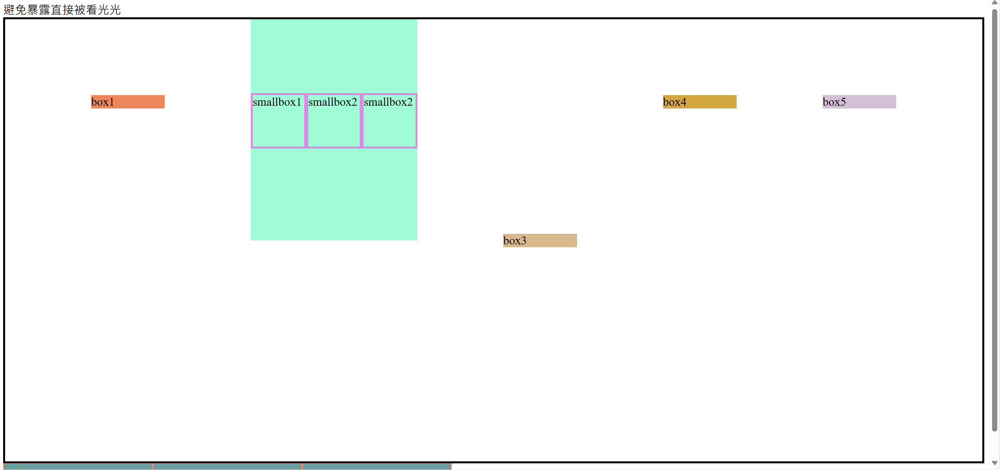

# (64) Flexbox and Images

## 處理 在 Flexbox圖片很大的時候的解法

`圖片超過 flex-base: 500px` 

- 那就超過，不是大家都死死固定500px，若圖片大小或block元素超過可能因此換行。

- ```html
  <body>
      
      
    </body>
  ```

- ```css
   body {
          display: flex;
          flex-wrap: wrap;
        }
        /* 子類 */
        body img {
          flex: 1 1 500px;
        }
  ```

- 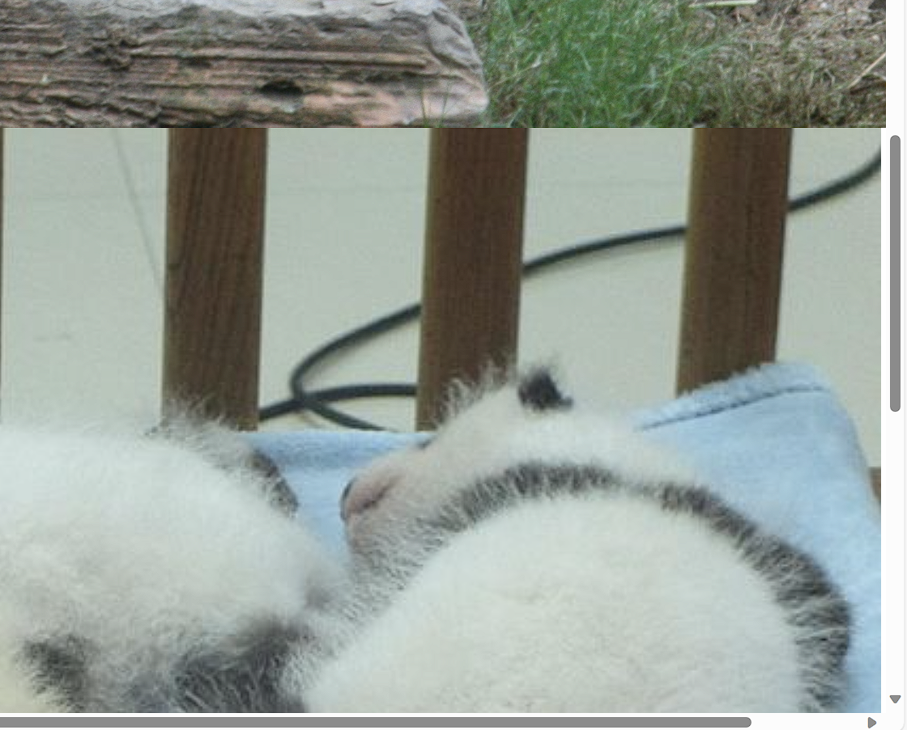

`放到 div 裡面 讓他們不要那麼大` 

- **小技巧**

- `html+css`
  
  ```html
   <style>
        body {
          display: flex;
          flex-wrap: wrap;
        }
        body div {
          flex: 1 1 500px;
        }
        /* 子類 */
        body div img {
          width: 50%;
        }
      </style>
    </head>
    <body>
      <div>
        
      </div>
      <div></div>
    </body>
  ```

- `100%` 


- `50%` 

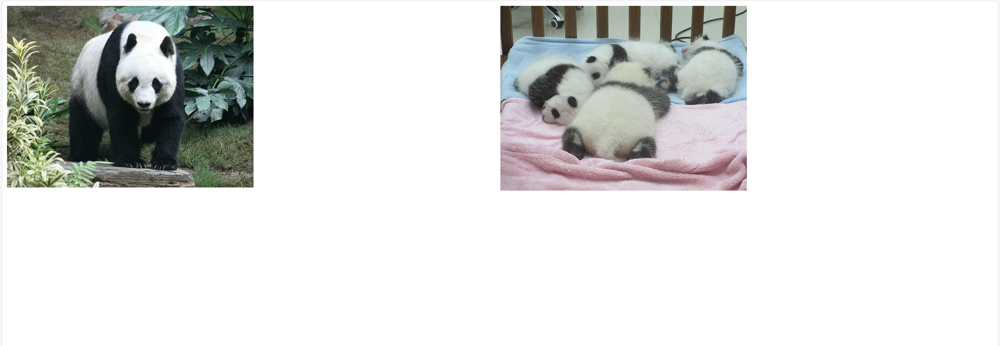

- `加入 < p > Lorem150`

- `html+css` 
  
  ```html
      <style>
        body {
          display: flex;
          flex-wrap: wrap;
        }
        body div {
          flex: 1 1 500px;
        }
        /* 子類 */
        body div img {
          width: 50%;
        }
        body div p {
          width: 50%;
        }
      </style>
    </head>
    <body>
      <div>
        
      </div>
      <div></div>
      <div>
        <p>
          Lorem ips......
      </p>
      </div>
    <body>
  ```

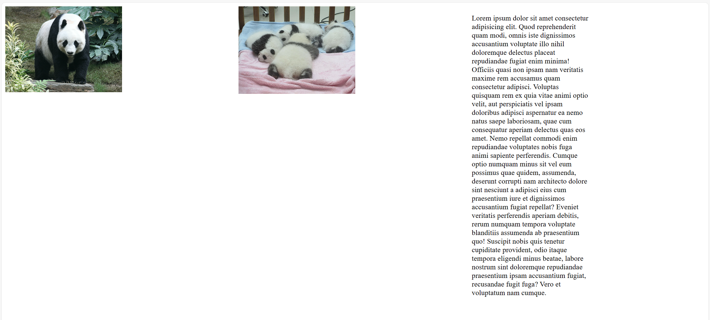
