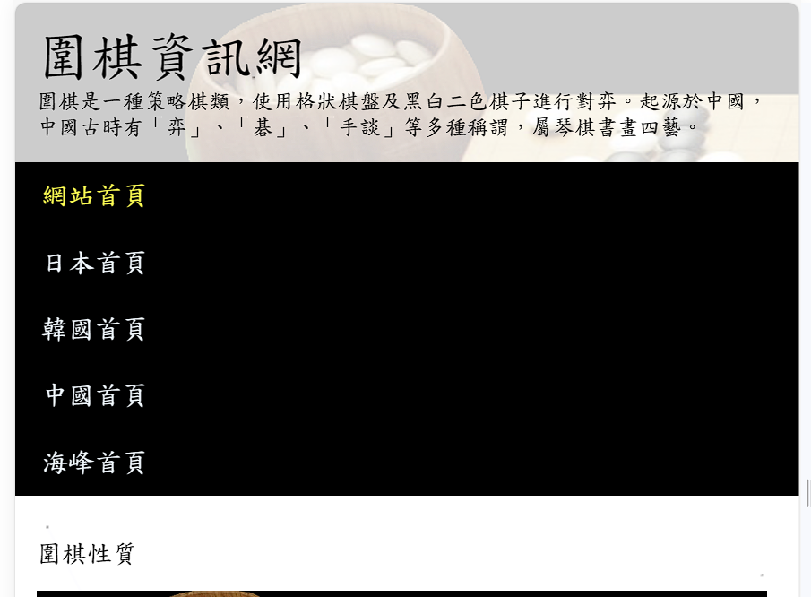
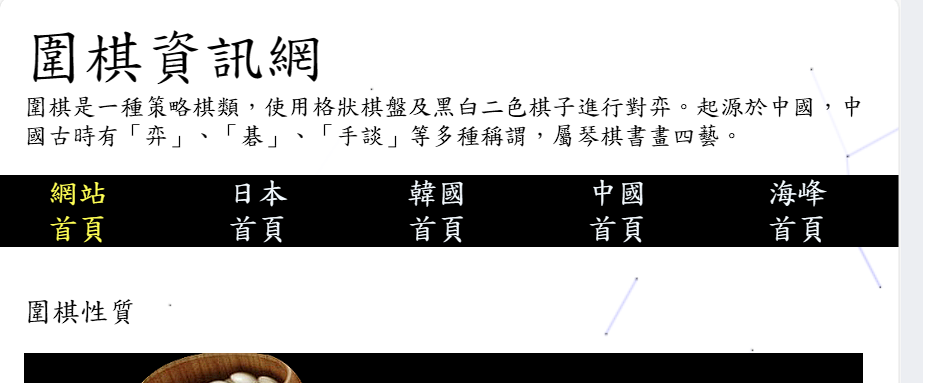
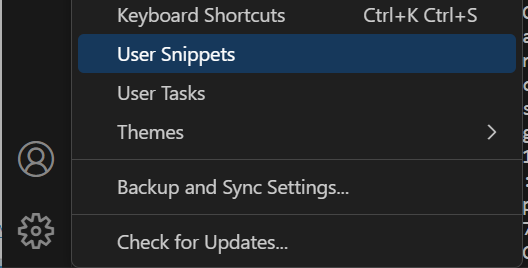
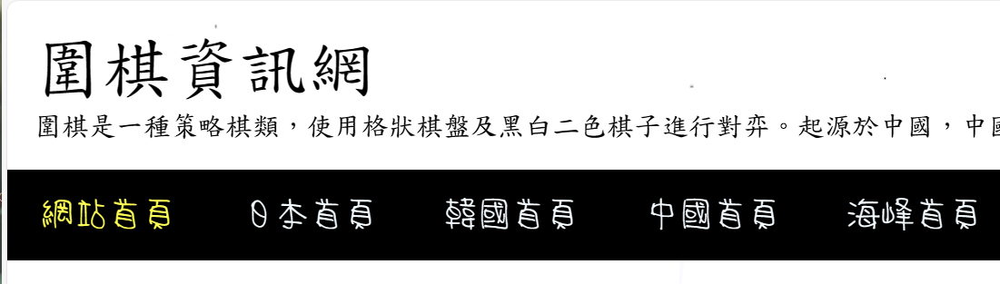
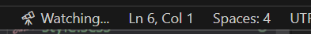
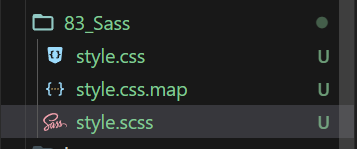

# (76) Media Query

## 響應式網頁設計

1. 專注螢幕大小而非特別裝置
   
   - 320px~480px 屬於行動裝置
   
   - 481px~768px 屬於平板裝置
   
   - 769px~1024px 屬於小型螢幕、筆電
   
   - 1025px~1200px 屬於桌上型電腦螢幕
   
   - 1200px 以上屬於 大型螢幕、電視之類

2. 能用flexbox 就用 ，如果不能，則使用 **media query** 處理

3. 圖片與其他元素應該要隨著螢幕大小變化 

## 開始說明Media Query

- 使用新的 mediaQuery.html 做 詳情依舊看 git log 多了什麼就是。
  
  🗨 下面這邊是 新開的 for 76_Media Query

```html
 <style>
      h1 {
        background-color: burlywood;
      }
      @media screen and (max-width: 800px) {
        h1 {
          background-color: aqua;
        }
      }
    </style>
  </head>
  <body>
    <h1>我是h1標籤的文字</h1>
  </body>
```

  💡能根據裝置pixel 去決定顯示內容

  ⚠️ 除了使用新的mediaQuery， 也改 **Project 1 ，header 的 nav**! ⚠️

  🔥 我直接複製過去76資料夾了 ， 只有index.html + style.css🔥

  

  `有點醜` 看能不能別的好看點的



`透過增加 <li> padding達成了` 

```css
@media screen and (max-width: 600px) {
  header nav ul {
    /* flex-direction: column; */
  }
  header nav ul li {
    padding: 0 2rem;
  }
}
```

# (77) Bootstrap

> Bootstrap是一組用於網站和網路應用程式開發的開源前端框架，包括HTML、CSS及JavaScript的框架，提供字體排印、表單、按鈕、導航及其他各種元件及Javascript擴充套件，旨在使動態網頁和Web應用的開發更加容易。

套別人寫好的東西~

使動態網頁跟應用更容易。

- 去官網複製 cdn來用也可以
  
  > [Bootstrap · The most popular HTML, CSS, and JS library in the world. (getbootstrap.com)](https://getbootstrap.com/) 
  
  ```css
  <link href="https://cdn.jsdelivr.net/npm/bootstrap@5.3.2/dist/css/bootstrap.min.css" rel="stylesheet" integrity="sha384-T3c6CoIi6uLrA9TneNEoa7RxnatzjcDSCmG1MXxSR1GAsXEV/Dwwykc2MPK8M2HN" crossorigin="anonymous">
  <script src="https://cdn.jsdelivr.net/npm/bootstrap@5.3.2/dist/js/bootstrap.bundle.min.js" integrity="sha384-C6RzsynM9kWDrMNeT87bh95OGNyZPhcTNXj1NW7RuBCsyN/o0jlpcV8Qyq46cDfL" crossorigin="anonymous"></script>
  ```

- 跟著做 然後使用他們預設的CSS 就能簡單使用了
  
  > [Forms · Bootstrap v5.3 (getbootstrap.com)](https://getbootstrap.com/docs/5.3/forms/overview/) 例如表單 
  
  自己加進去 自己的網頁就能用很方便~
  
  > [Navbar · Bootstrap v5.3 (getbootstrap.com)](https://getbootstrap.com/docs/5.3/components/navbar/) navbar

- 下載到自己電腦也可以用
  
  > [Download · Bootstrap v5.3 (getbootstrap.com)](https://getbootstrap.com/docs/5.3/getting-started/download/#compiled-css-and-js)  
  
  打開可以看一下裡面長怎樣，但8MB真的不小，不放進git了。

# (78) User Snippet

> [snippet generator (snippet-generator.app)](https://snippet-generator.app/) 

基本上就是 文字編輯器內建的 hotkey概念，可以幫忙提供建議、直接使用常用的。




其他也是可以設定的。 大致如下

```json
{
    // Place your snippets for html here. Each snippet is defined under a snippet name and has a prefix, body and 
    // description. The prefix is what is used to trigger the snippet and the body will be expanded and inserted. Possible variables are:
    // $1, $2 for tab stops, $0 for the final cursor position, and ${1:label}, ${2:another} for placeholders. Placeholders with the 
    // same ids are connected.
    // Example:
    // "Print to console": {
    //     "prefix": "log",
    //     "body": [
    //         "console.log('$1');",
    //         "$2"
    //     ],
    //     "description": "Log output to console"
    // }
    "HTML skeleton": {
    "prefix": "myskeleton",
    "body": [
    "<!DOCTYPE html>",
    "<html lang=\"en\">",
    "  <head>",
    "    <meta charset=\"UTF-8\" />",
    "    <meta name=\"viewport\" content=\"width=device-width, initial-scale=1.0\" />",
    "    <title>Document</title>",
    "    <meta name=\"author\" content=\"Onini\" />",
    "  </head>",
    "  <body></body>",
    "</html>",
    ""
   ],
   "description": "HTML skeleton"
   }

   "HTML onitable": {
   "prefix": "onitable",
   "body": [
    "<table style=\"border: steelblue 2px solid; border-collapse: collapse\">",
    "      <thead>",
    "        <tr>",
    "          <td>姓名</td>",
    "          <td>電話</td>",
    "        </tr>",
    "      </thead>",
    "      <tbody>",
    "        <tr>",
    "          <td>oni</td>",
    "          <td>09999999999</td>",
    "        </tr>",
    "      </tbody>",
    "    </table>"
   ],
   "description": "HTML onitable"
   }
}
```

# (79) 免費圖片

## Google

- 要找 commercial license 才能哦

## Unsplash

- > [A group of people walking down a street next to tall buildings photo – Free Tokyo Image on Unsplash](https://unsplash.com/photos/a-group-of-people-walking-down-a-street-next-to-tall-buildings-isDYrkDaXZc)

- 也可以做

## Pexels 沒錯 是這個才是我們要的網站

- > [免費圖庫相片 (pexels.com)](https://www.pexels.com/zh-tw/) 

## iStock 付費的

- 略過ㄅ

# (80) 免費圖形與圖案

## icons8

- 可以下載，有些免費 只要有給 link

## font awesome

- cdn 使用或從網站 但好像不是每個都能用 有點麻煩QQ

## unDraw

- 有svg檔案 向量檔案 ~

# (81) HTML BookMark

- 設定 id  `Tag` `a`  網頁內部跳轉 方便定位 
  
  ```html
   <a href="./#paragraph1">跳轉一</a>
      <a href="./#paragraph2">跳轉二</a>
      <a href="./#paragraph3">跳轉三</a>
      <h1 id="paragraph1">第一個段落</h1>
      <p>lorem200<p>
  ```

# (82) Local Font 設定

- 先去找到免費的 清松手寫體 然後下載放到資料夾
  
  ```css
  @font-face {
    font-family: "jasonhandwrite";
    src: url(./JasonHandwriting6.ttf);
  }
  nav li a {
    font-family: jasonhandwrite;
  }
  ```
  
  

# (83) Sass

Syntactically  Awesome Stylesheets

## 將CSS 視為程式語言的網頁開發技術

- 支援設定變數 函數 import nested 等等

- 高相容性 跨瀏覽器的CSS 程式碼

- Bootstrap內部大量的程式碼是由 scss文件編譯而成 (CSS) 網頁才能讀取。

## Vs Code 安裝 Compiler

- 增加 Live Sass Compiler 

## 實際使用

- style.scss 然後按 Watch Sass 就會自動生成另外兩個檔案
  
  
  
  

## 主要功能

### Nested CSS 巢狀語法

就為了 手寫 很不直覺、維護上的方便性而言，避免上下跳亂找找不到。

```html
<style>
      header nav ul li a {
        color: violet;
        text-decoration: none;
      }
</style>
```

透過 scss 如下 

```scss
$anchorColor: red;
header {
  nav {
    ul {
      display: flex;
      flex-wrap: wrap;
      li {
        list-style-type: none;
        a {
          color: $anchorColor;
          text-decoration: none;
        }
      }
    }
  }
}
```

會自動生成 style.css

```css
header nav ul {
  display: flex;
  flex-wrap: wrap;
}
header nav ul li {
  list-style-type: none;
}
header nav ul li a {
  color: red;
  text-decoration: none;
} /*# sourceMappingURL=style.css.map */ `
```

### 變數設定

上面有了不寫了

### self ampersand (&)

```scss
a {
          color: $anchorColor;
          text-decoration: none;
          &:hover {
            color: green;
          }
}
```

& 代表 a 自己，不用像以前分開寫

### import

分類、重複利用

💡檔名開頭要是 `_` 然後名稱 `.scss` 

```scss
@import "./header";
💡上面這個才是哦 不是 url(./)
```

### mixin

類似 function功能 如下

```scss
@mixin flexbox($direction) {
  display: flex;
  flex-direction: $direction;
}
header {
  nav {
    ul {
      @include flexbox(row);
      //   display: flex;
      flex-wrap: wrap;
      li {
        list-style-type: none;
        a {
          color: $anchorColor;
          text-decoration: none;
          &:hover {
            color: green;
          }
        }
      }
    }
  }
}
```


