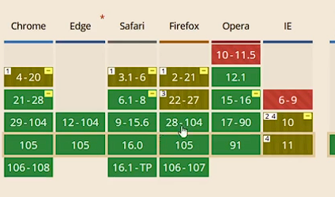
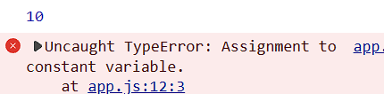
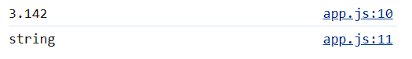
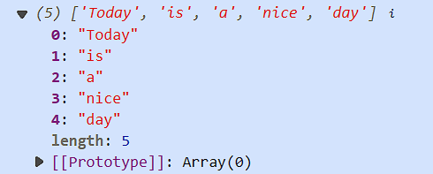
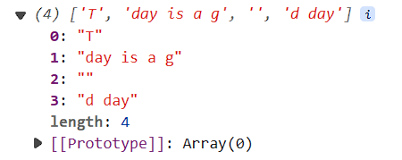
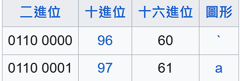
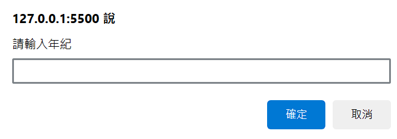
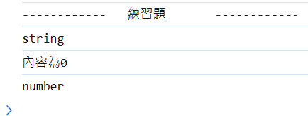
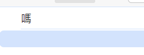

# (106) JS 簡介

## 名稱由來

- 最初叫做LiveScript 因 Java流行所以才叫做 JavaScript 

## ECMA Script

- European computer manufactures association

## Vanilla JavaScript

- 純 JavaScript 而不需要 任何額外 library或框架。

- 常見的 JavaScript library 有 jQuery。

- 瀏覽器有各自的 JS Engine

## 查詢Caniuse...

> [Can I use... Support tables for HTML5, CSS3, etc](https://caniuse.com/) 

- 透過上述網站 查功能、那些瀏覽器支援
  
  

## <script>放哪

- 最下方、讓頁面最後才執行、用戶比較留得住。

# (107) Lexical Structure

## 常見 JS 函數

### console.log()

### window.alert()

- 指示瀏覽器顯示帶有可選消息的對話框、並等待用戶關閉對話框。

### window.prompt()

- 指示瀏覽器顯示帶有可選消息的對話框、等待用戶提交或關閉。

## 設定Snippet

```json
"console":{
        "prefix":"con",
        "body":[
            "console.log()"
        ],
        "description":"console"
}
```

- 方便以後快速打出console.log()

## Lexical Structure JS語法規則

### Case Sensitive

### 空白、換行會被忽略 ( minification)

- 減少 JS 大小。

- 不是針對字串所言 而是語言code本身 被讀取的時候 普通coding 會被minification ，除非使用字串之類。

- 也就是說console.log("Hello     a~"); 不會縮

### 註解使用 【//】    【/\*\*/】

### 變數開頭要是 _ 或 $ 或英文

- 其他符號 跟 0~9不能當開頭

### 關鍵字

null of if then in finally for while break continue switch try let const var ...不能當變數名稱。

### JS 使用 Unicode 字元

### Semicolons ; 分隔語句

- 使用 ; 分隔語句，(optional)

- 不然就使用換行。 替代。

# (108) 變數與賦值

x=5 , x=x+1;

## 語法糖 syntax sugar

- x=x+1  可寫 x+=1 。

## 變數 let const var 時機

### 值會變動、用let

### 不會變動、用const

### ⭐請勿使用var 進階JS解釋

## ⚠️特別注意的規則

### const 一定要賦予initializer

### let 可不賦值，但get undefined。

### ⭐引擎允許 x=5 ; 但容易出錯

- 最好乖乖使用 let x=5;

### 不可以重複宣告 (let var const)

- let x=5;

- let x=6;  不可以 !  

### ⭐⭐const 不可以重複賦值

- 編譯器偷偷放行

- 但瀏覽器會報錯，雖然好像不會怎樣
  
  
  
  🔥還是我們的JAVA 比較好，final 會報錯QQ🔥

## 有GC 會自動刪除無法訪問的Object

# (109) 略

- 各位同學，這裡有個 Quick Fix 需要你們注意一下！下支影片中的 4:19 談到的 Number 範圍中，9,007,199,254,740,992 是 2 的 53 次方，不是 253 次方。編寫講義時沒有注意到多寫了一個 2，請在做筆記的時候更正成 53，謝謝！

# (110) 數字運算

## ⭐數據類型 DataType

| Number    | 整數與帶小數點的數字      |
| --------- | --------------- |
| BigInt    | 任意長度的整數         |
| String    | 字符串             |
| Boolean   | true 或 false    |
| null      | 故意代表不存在的值       |
| undefined | 沒被賦值就是undefined |

symbol - unique identifier 也是。

第八種數據類型 = object。

---

## JS整數範圍2^53 或2^-53次方

- 大概900億正負

## 運算符號

- \+ \- \* / 

- ** 次方
  
  ```js
  let x = 5;
  let y = 2;
  console.log(y ** x) ; 
  得32
  ```

- % 取餘數

- ++ 

- --

- +=   -=  /=   \*=

## ⭐++x 或 x++

- 區別自己去查，很常見。
  
  - 變數先+1，後執行其他、或帶入。
  
  - 先執行整行，之後變數+1。

# (111) String基本介紹

### " oni's world "

- 字串用法

### 串接 concatenation 使用 +

- 其他符號 -*/ 會導致NaN (Not a Number)

### 數字 串接 文字 會變成str+str

### \n 換行

- ```js
  /*         文字+數字 會怎樣?  版本2      */
  
  let n1 = 20;
  let n2 = 30;
  let name = "json";
  let n3 = 10;
  let n4 = 15;
  //猜看看?
  console.log(n1 + n2 + name + n3 + n4);
  // 結果1 50json25
  // 結果2 50json1015   >>>正確
  ```

# (112) Number Methods

## js 是物件導向、數字也是物件 !

## toString() / typeof

- 回傳數字的字串得到的是string

- age.toString 就能變成 25 ，"25"。
  
  ```js
  console.log(typeof age.toString());
  ```

## toFixed(n)

- 回傳轉換後的數字，到小數點後第n位，得String

- 
  
  ```js
  const pi = 3.1415926;
  console.log(pi.toFixed(3));
  console.log(typeof pi.toFixed(3));
  ```
  
  ##### 🔥之後才會說明怎麼變回num

## 🔥🔥神奇的問題🔥🔥

```js
/*           function也是物件           */
let r = 11;
let s = r.toString;
console.log(s);
// 無法使用s()，除非是r.toString() 才有得到11 但是如果function就GG。
console.log(s.call(5));
  上面這是 GPT 說的方式 
```

## 0.1+0.2===0.3 會是false

- ```js
  if (0.1 + 0.2 != 0.3) {
    console.log("不等於哦");
    console.log(0.1 + 0.2);
    //得到 0.30000000000000004
  }
  ```

# (113) StringAttributesAndMethods

> [字串 - JavaScript | MDN (mozilla.org)](https://developer.mozilla.org/zh-TW/docs/Web/JavaScript/Reference/Global_Objects/String) 

有問題就要去mdn 自己看用法比較實際。

## 常用屬性

### length

- 回傳字串長度

- ```js
  let str="oni";
  console.log("'oni ',Length is " + str.length);
  ```

### [n] 超出回傳undefined

- 回傳第n項的字元

- ```js
  let str2 = "helloween oni";
  console.log("str2[4] is: " + str2[4]);  ===> o
  console.log("證明從0開始數");
  /*     [-100]    [100]  ==undefined           */
  console.log("str2[100] is: " + str2[100]);
  console.log("str2[-100] is: " + str2[-100]);
  ```
  
  #### 💡 使用不存在的index 回傳 undefined

## Methods

### slice(indexStart [,indexEnd])

- ##### 提取字串的部分，回傳新的字串，不修改原始字串。 💡

- ##### 左邊 inclusive 右邊 exclusive
  
  - 我猜是為了避免出錯 因為 str長度6 但是如果兩邊都inclusive 很容易提取到6 
    
    而不是最後一個 [5] , [0,1,2,3,4,5]。 

#### 🔥[,indexEnd] 代表可選。

- ##### 默認行為是 ~ end。
  
  ```js
  let str3 = "oni umi wonderful";
  console.log("str3.slice(2,5)= " + str3.slice(2, 6));
  console.log("str3.slice(2)= " + str3.slice(2));
  
  // str3.slice(2,5)= i um
  // str3.slice(2)= i umi wonderful
  ```

### ⚠️indexOf(subString)

- ##### 💡回傳substr開頭位置，找不到則return -1
  
  ```js
  /*           indexOf(subString) 回傳substr開頭位置 找不到return -1         */
  
  let str4 = "oni umi wonderful";
  console.log("oni umi wonderful ，找到了，從" + str4.indexOf("wond") + "開始");
  console.log("oni umi wonderful ，找不到=" + str4.indexOf("wondd"));
  ```
  
  ##### 💡注意、找到就不會往後找。
  
  ```js
  let sentence = "Today is a good day";
  console.log(sentence.indexOf("a")); ====> 3
  console.log(sentence.indexOf("a "));====> 9
  ```

### toUpperCase() 變大寫

#### ⚠️不影響str本身，是回傳新的字串。

### toLowerCase() 變小

#### ⚠️不影響str本身，是回傳新的字串。

### split(pattern) ⭐⭐

- ```js
  /*         split(pattern)           */
  let sentence = "Today is a nice day";
  // "Today","is","a","nice","day"
  let result = sentence.split(" ");
  console.log(result);
  result =sentence.split("o");
  console.log(result);lt);
  ```
  
  

- #### 朝o 切下去⭐⭐⭐
  
  

### startsWith(s) 是否以字串s開頭

### endsWith(s) 是否以字串s結尾

### includes(str) 是否包含 str

### charCodeAt(position)

- ```js
  搭配 charAt、indexOf 
  let sentence = "Today is a good day";
  /*        charCodeAt       */
  console.log(sentence.indexOf("a "));
  console.log(sentence.charAt(9));
  console.log(sentence.charCodeAt(9));
  ```
  
  

# (114)  Boolean, Undefined, Null

### Boolean🗨

- ```js
  let isPremium=false;
  ```

- Unary Operator 【!】 可以反轉布林值。

- ##### 比較特別如下⭐
  
  ```js
  console.log(isPremium == "false"); //false
  console.log(isPremium == "0");     // true
  console.log(!isPremium == "1"); // true
  console.log(!isPremium == "2"); // false
  ```
  
  💡跟 JAVA 不同，JAVA if (非零) 則恆成立。

### Undefined 💡

- ### JS function的預設回傳值。

### Null

- #### 故意代表不存在的值。

# (115)  logical, comparison operator

## Operators

### assignment operator

### comparison operator

```js
==
!=
===  相同 資料型態 且內容也相同
!==
>,>=,<,<=

/*            ===             */
console.log("    ===    ");
console.log(3 == "3"); //true
console.log(3 === "3"); //false 多檢查了typeof both
console.log(3 === 5 - 2); //true 有優先順序 ===比較後面才做;

/**    🔥加碼🔥  === 使用變數    **/
let x = "3";
let y = "3";
console.log(x === y); // true
```

### logical operator⚠️⭐⭐⭐

| A   | B   | A&&B | A\|\|B |
|:---:|:---:|:----:|:------:|
| 0   | 0   | 0    | 0      |
| 0   | 1   | 0    | 1      |
| 1   | 0   | 0    | 1      |
| 1   | 1   | 1    | 1      |

```js
/*            && || Logical Op             */
console.log(1 || 0); // 1
console.log(1 && 0); // 0
console.log(1 && 1); // 1
console.log(true && false); //false
// 
```

- ⭐一個回傳 true false 一個回傳 1或0 ⭐
- ⭐⭐⭐下面額外補充 

```js
console.log("-------混搭 0 1 true false && || 會怎樣?-------");
/*  或運算|| */
// 第一個值為真  直接回傳第一個值 !
// 第一個值為假  直接回傳第二個值 !
console.log(0 || true); //true
console.log(1 || true); //1
console.log(true || 0); //true
console.log(true || 1); //true
console.log("----4/16----");
console.log(1 || false); //1
console.log(0 || false); //false
console.log(false || 1); //1
console.log(false || 0); //0
/*  and運算&& */
// 第一個值為真  直接回傳第2個值 !
// 第一個值為假  直接回傳第1個值 !
console.log("----8/16----");
console.log(0 && true); //0
console.log(1 && true); //true
console.log(true && 0); //0
console.log(true && 1); //1
console.log("----12/16----");
console.log(0 && false); //0
console.log(1 && false); //false
console.log(false && 1); //false
console.log(false && 0); //false
```

### typeof operator  (unary)

### negation operator (unary)

`! 就是`

### increment operator (unary)

`x++ x--`

### bitwise operator

### arithmetic operator

```java
+ ,-, *, /  ,+=,-=,/=,*=,*,%
```

# (116) Bitwise Operators

- 上面是宏觀 提到而已。

## 講解一下十進位二進位而已

## bitwise op

### ⚠️將數字operand視為32bits進行

### a&b,  a|b,  ⭐ a^b 看互斥就好

- 32 bit對齊後，對bit 做 and 或 or 或 XOR
  
  ```js
  /*          Bitwise Operators            */
  /*           簡單測試 & | ^             */
  
  let a = 7; //0111
  let b = 11; //1011
  
  console.log(a & b); //0011 =3
  console.log(a | b); //1111 =15
  console.log(a ^ b); //1100 =12⭐⭐⭐
  ```

- ##### XOR⭐⭐⭐
  
  ```js
   0跟任何數字互斥或 都會得到 另一個數字的結果
   1跟1 互斥或 會得到 0   
   then
   : 1^1^1=1
   : 1^1=0
   : 0^0=0
  
   不局限於特定數 任何二進制表示的文件或圖像或數字... 對自己XOR 都會得到 0 ⭐⭐⭐⭐
   如果 self XOR self XOR self 會得到 self  ⭐⭐⭐⭐
  ```

### ~a

- 反轉operand每個bit
  
  ```js
  console.log("---   ~ a   ---");
  console.log(~a); //不是8 其實是-8 這個要去了解 2's complement
  // 原始有32位元 每個都要反轉，所以是1111.....1000 這才是我們的數字
  
  // -------- 2's complement 可得知負數1111.....1000 所代表數字為何 -------
  // 簡單說就是 bit 取反轉 然後最低位bit代表2^0的那位 +1  可得知對應的數是誰。
  // 1111....1000 做2's complement 先反轉
  // 0000....0111 +1
  // 0000....1000 = 8   因為原本數字 1開頭 ，代表負數 => 實為 -8
  // 8 如何轉成 -8   一樣的事情照做 先反轉位元
  // 1111....0111 +1  得到下面
  // 1111....1000  就是 -8的表示值
  ```

### a<<b

- a乘二的b次方

### a>>b

- ```js
  /*           <<   >>                  */
  let x = 16;
  let y = 8;
  console.log("------- << ------");
  console.log("x<<2: " + (x << 2)); //*4= 64
  console.log("x<<3: " + (x << 3)); //*8= 128
  console.log("y<<3: " + (y << 2)); //*4= 32
  console.log("y<<3: " + (y << 3)); //*8= 64
  console.log("------- >> ------");
  console.log("x>>2: " + (x >> 2)); //div4= 4
  console.log("x>>3: " + (x >> 3)); //div8= 2
  console.log("y>>3: " + (y >> 2)); //div4= 2
  console.log("y>>3: " + (y >> 3)); //div8= 1
  ```

## 何時會用到?

- 編碼

- 資料傳出 socket 、ports

- 加密、SHA

- OS、CPU

- Finite State Machine

- Graphics 影像處理 AI

# (117) 公式轉換，只是講2進制，跳。

# (118) if statement

- 常見用法~跳過 太簡單 code看一看就知道 不提了。

## 😕稍微提到String跟String比大小會用字典...?

## 💡幾個window.prompt搭配狀況 (練習題)

```js
console.log("------------   練習題       ------------ ");

let input_age = window.prompt("請輸入年紀");
console.log(typeof input_age); //String
input_age = Number(input_age);
console.log("內容為" + input_age);
console.log(typeof input_age); // number

if (input_age <= 12 && input_age >= 0) {
  window.alert("額同票100");
} else if (input_age > 12 && input_age <= 65) {
  window.alert("盤子票250");
} else if (input_age < 120) {
  window.alert("老票150");
} else {
  window.alert("太老或太小、不可能、不能買");
}
```

- 如果沒輸入 直接按確定 ，得到預設 0
  
  
  
  

- 輸入文字得到 NaN
  
  

# (119) Truthy and Falsy Values

## 🔥Boolean Context

JS 中 每個值在 BooleanContext下都能被視為true或者false。

### 常見的2人

#### if statement

#### logical operators

#### ...

### 🔥JS 會自動幫值做 type coercion 強制類型轉換

## Truthy😕

- [] empty array 

- {} empty obj 也是屬於truthy 

## Falsy Values🔥🔥

- false

- 0,   -0,   0n (BitInt)😕😕😕
  
  而 `0n` 是 BigInt（大整數）的表示法，它表示的是 BigInt 中的零，也被視為 `falsy` 值。BigInt 是用於表示大整數的資料類型，不同於普通的 JavaScript 數字，它可以處理比 Number 型態更大的數值。

- "",'',`` 空字串

- null

- undefined

- NaN

- 除此之外都是Truthy values 包含 [] {} 
  
  [] empty array
  
  {} empty obj 也是屬於truthy
  
  ```js
  let x = {};
  if (x) {
    console.log("im true"); // true啦
  } else {
    console.log("im false");
  }
  ```

## "" && "" 😕 還沒講到...冒出哭阿

- ```js
  if ("天氣好") {
    // true  !?
    console.log("嗎");
  }
  
  console.log("" && "");
  ```
  
  

- 空字串 firefox出現 \<empty string>

## 少使用if( 條件==true)

- 最好可以 if ( variable )  就做判斷

- if (hasPremium){ }

# (120) Logical Operator與其他資料類型處理

- 根據是否為turthy 或 falsy 決定回傳的是 前一個operand或後一個。

- ```js
  console.log(NaN||100) 會輸出 NaN 因為它是truthy
  如果 1 nd 是 falsy 則回傳 2 nd
  如果 1 nd 是 truthy 則回傳 1 nd 
  
  console.log(NaN&&100) 會輸出 100 因為 && 總是 
  如果 1 nd是falsy output= 1 nd  ，若非如此 代表
      1 nd是truthy 則 output=2 nd
  ```

- ```js
  console.log(NaN || 1);
  let data = "";
  console.log(data || "資料讀取失敗"); //😕得到  資料讀取失敗
  data = "oni";
  console.log(data || "資料讀取失敗"); //😕得到  oni
  ```

# (121)Coding Convention And Restrictions


## Convention 慣例、習慣

### fun、var全小寫、兩單字以上使用camelCase或_。

### operators 周圍 + 上空白鍵

- `z = x + y`   

- operators 代表 運算符號之類 = + - / % & \** 

### constant 使用常數全大寫

- `const PI=3.14;`

### Class 由大寫字母開頭

## Coding Restrictions

- 變數 函數名稱 不可以數字開頭、不可包含 - (hyphen)

- 當然也不能使用reserved words

# 總結考試

## <script> 放最下面 why

- 先讓HTML CSS完成比較重要。

- [] {}  = truthy

- 好像沒考到什麼重要的。@@
