# (122) 認識函式

## 數學函數

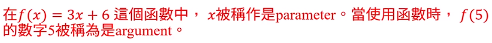

如果同一個輸入有兩個不同的輸出，那就非函數。

下面就非函數 一個x 有兩種 y

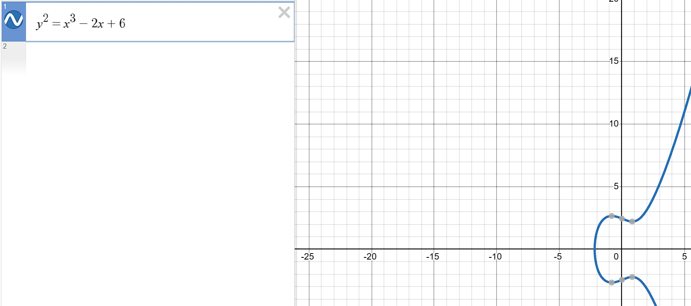

### Desmos 不錯的繪圖數學網站

> [Desmos | 繪圖計算機](https://www.desmos.com/calculator?lang=zh-TW) 

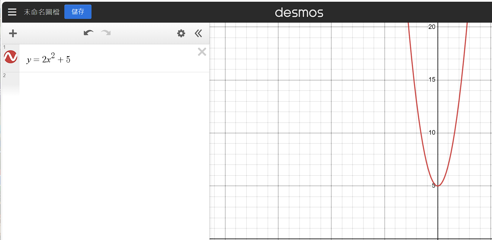

## JS Function

```js
function name ([param[,param[,...param]]]){
    statements 
}
```

```js
/*       認識函數            */
function f() {
  console.log("first函數");
}
f(); // 寫了才會有輸出!  
```

- 引用函數
  
  function execution 
  
  invoke a function
  
  function invocation
  
  call a function

```js
/*      第二個帶參數   */
function sayHi(name, meal) {
  console.log("你好我" + name);
  console.log("我要去吃" + meal + "了");
}

sayHi("oni");
sayHi("oni","午餐")
```

- 不用像JAVA 還要宣告型態

- 不帶入 午餐 直接得到 undefined 😕😕
  
  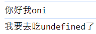

# (123) return關鍵字

## 沒有寫return 會默認回傳undefined。

- ```js
  function circle(r) {
    3.14 * r ** 2;
  }
  console.log(circle(10)); //undefined
  ```

## 💡特殊情況1😕

- 這個特性應該是提升hoisting之類 之後會另外說。

- ```js
  function circle(r) {
    3.14 * r ** 2;
  }
  console.log(circle(10)); //314  ，沒有下面這些code，原本是undefined 。
  
  function circle(r) {
    return 3.14 * r ** 2;
  }
  console.log(circle(10)); //314
  ```

## 💡特殊情況2 😕😕

- 自己多加的
  
  ```js
  /*  自製特殊情況2 */
  function sayHiToPeople(name) {
    return console.log("你好" + name);
  }
  console.log(sayHiToPeople());
  ```
  
  - 你好undefined
  
  - undefined  ====> 這是因為 console.log函數沒有返回值。

Undefined+Undefined=NaN

## ⭐JS函數實際上是物件

- #### 每個function都有instance properties/ methods。🗨

# (124) Array陣列

## 特性

### Not primitive data type.

- ```js
  let friends = ["apple", "banana", "cat", "dog", "umi"];
  ```

### 可以調整大小

### 可以不同資料類型⭐🗨🗨

- ```js
  let anotherArray = [null, ,undefined,false, "String", 3.14];
  console.log(anotherArray);
  ```
  
  - ,, 或者 , , 都是空白，沒差別 prettier 做的事情沒關係。
    
    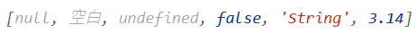
    
    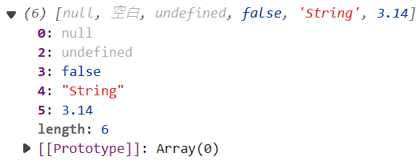
  
  - ### 實際印出來是 undefined 雖然用 console給我寫上面那樣=🙄🙄🙄
    
    ```js
    console.log(anotherArray[0]);
    console.log(anotherArray[1]);
    console.log(anotherArray[2]);
    console.log(anotherArray[3]);
    ```
    
    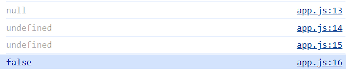

### 使用非負整數訪問index

### Array複製會複製reference💡

```js
let friends = ["apple", "banana", "cat", "dog", "umi"];
let f_copy = friends;
f_copy[0] = "pig";
console.log(" -   - - - 經過複製與修改後- - - - - - -");
console.log("friends= " + friends);
// friends 陣列會被改 因為複製的是Reference 而不是deep copy (甚至不是shadow copy)
console.log("f_copy= " + f_copy);

/*        跟JAVA 相似，物件會複製目標reference 原始型態則複製value    */

let deposit = 500;
let anotherDeposit = deposit;
anotherDeposit = 600;
console.log(" -   - - - 經過複製與修改後- - - - - - -");
console.log("deposit: " + deposit);
console.log("anotherDeposit: " + anotherDeposit);
```

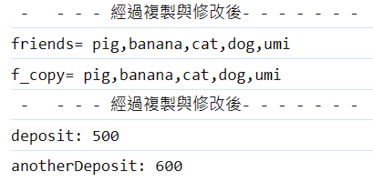

# (125) Reference Data Type 比較

## 類似JAVA 不能陣列==陣列

```js
/*       Reference Data Type比較            */
let x = 10;
let y = 10;
console.log(x == y); //true

let a = [1, 2, 3];
let b = [1, 2, 3];
console.log(a == b); //false
```

- primitive type 比較會相同。

- 陣列兩個算是不一樣的 obj 所以即使內容一樣不能這樣比較。

## 有字串池的概念

```js
/*          字串池概念?            */
let r = "花";   //引用池子的 花
let s = "花";  //引用池子的 花
console.log("r==s : ", r == s); //  true
console.log("r===s : ", r === s); //  true
console.log("r=='花' : ", r == "花"); //  true
console.log("r==='花' : ", r === "花"); //  true
console.log("r=='花' : ", "花" == "花"); //  true
```

# (126) ArrayMethods

## array instance properties.

### length

- ```js
  let friends = ["apple", "banana", "cat", "dog", "umi"];
  console.log(friends.length); //5
  ```

## array instanece methods.常見

### ⚠️push(element,[e2,[e3]]) 可多

- 一個或者多個元素添加到array末端，並return陣列新長度。

- 不會創造新的陣列，然後丟過去，是針對原始修改新增。

- friends.push( );
  
  - 不會增加內容例如多一個undefined 。 維持原本，不做事。⭐
    
    - 除非填入undefined
      
      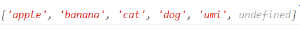
  
  - 不會出現下面這樣⭐⭐
    
    ```js
    function callphone(number) {
      console.log("印出數字" + number);
      return 1 + number;
    }
    console.log(callphone());
    ```
    
    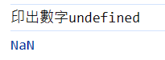

### ⚠️ pop

- 從陣列中移除最後一個element並且將它return回傳。
  
  ```js
  let friends = ["apple", "banana", "cat", "dog", "umi"];
  console.log(friends);
  console.log(friends.pop()); //得到umi
  console.log(friends);// ["apple", "banana", "cat", "dog"]
  ```

- 跟 JAVA  的一些異同 ，java使用前最好真的知道該類別提供的方法。
  
  ```java
  ==========================  add  =======================
  Deque<String> st = new LinkedList<String>();
  
  // populating stack
  st.add("Java");
  st.add("Source");
  st.add("code");
  st.forEach(s->System.out.println(s));
  
  > Java
  > Source
  > code
  > [Java,Source,code]
  >   ========= 透過pop/poll 彈出依序是 =========
  >           Java,Source,code
  >   ==========================  push  ====================
  >   Deque<String> st = new LinkedList<String>();
  
    // populating stack
    st.push("Java");
    st.push("Source");
    st.push("code");
    st.forEach(s->System.out.println(s));
  
  > code
  > Source
  > Java
  > [code,Source,Java]
  >   ========= 透過pop/poll 彈出依序是 =========
  >           code,Source,Java
  ```
  
  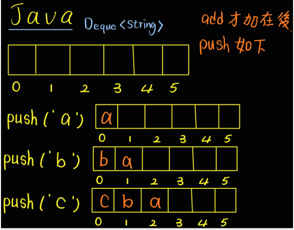
  
  

- Deque 的`add`對應到 JS 的 `push` !     

- 兩邊的 `push` 不同⚠️⚠️⚠️

### ⚠️ shift

- 刪除第一個元素，並回傳刪除的元素本體。

### unshift(element)

- 將一個或者多個元素加到 Array開頭，並且回傳新長度。

### 

### 
