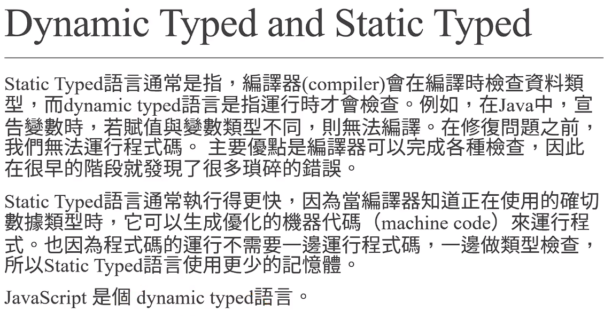

# (218) default parameters, backtick, ternary operator

## Ternary Operator

這些術語描述的是運算子（operator）的操作數量：

- **Unary Operator（一元運算子）**：僅接受一個操作數。例如，`-5` 中的負號 `-` 就是一元運算子。

- **Binary Operator（二元運算子）**：需要兩個操作數。例如，`5 + 3` 中的加號 `+` 就是二元運算子。

- **Ternary Operator（三元運算子）**：接受三個操作數。在許多程式語言中 ， `a ? b : c` 中的 `?` 和 `:` 就是三元條件運算子，它根據條件 `a` 的結果選擇 `b` 或 `c`。

## Default parameters

- 過去的作法
  
  ```js
  /*               Default parameters                      */
  
  // 過去的作法
  function mutiply(a, b) {
    //   if (a == undefined) {
    //     a = 1;
    //   }
    //   if (b == undefined) {
    //     b = 1;
    //   }
    return a * b; //數字跟undefined相乘 為 NaN
  }
  console.log(mutiply(5));
  ```

- 現在有default可以做
  
  ```js
  function defaultMutiply(a = 1, b = 1) {
    return a * b;
  }
  console.log(defaultMutiply());
  ```

## Back tick

- 製作字串 或格式化
  
  ```js
  /*               BackTick                      */
  let years_old = 25;
  let addr = "TW";
  let oni = "Oni Lin";
  let introduce = oni + "年紀" + years_old + "住在" + addr;
  console.log(introduce);
  introduce = `${oni}年紀${years_old}住在${addr}`;
  console.log(introduce);
  ```

# (219) JS語言類型

## Strong Typing

- 一定要相同型別才能、例如JAVA  ，宣告是字串則不可以放數字。
  
  ```java
  String e=5+"";  可以 ， 因為 數字+"" 運算後結果為字串
  String x=5;  不可以這樣 因為強型態
  
  只有某些地方  做運算 會幫忙型態轉換
  基本還是要自己注意
  ```

## Weak Typing

- JS 就是這樣

## Dynamic Typed

- 動態，執行時期才發現。

## Static Typed

- 實際跑之前就知道類型。



# (220) IIFE, destructuring assignment

immediately invoked function expression

## IIFE

### 如果沒使用⭐

```js
function hello() {
  console.log("hello");
}

let hello = 5;

---------------------------------------------------------
let hello = 5;
    ^

SyntaxError: Identifier 'hello' has already been declared
```

### 如果使用IIFE 則不會有衝突!⭐⭐⭐

#### 有命名不會產生衝突

```js
(function hello() {
  console.log("hello");
})();
let hello = 5;
console.log(hello);
------------------------------------------------------
hello
5
```

#### 沒命名也可以直接執行 (也不太需要命名)

```js
(() => {
  console.log("hello");
})();
```

## Destructuring assignment🔥🔥🔥🔥

### 版本一 : 大量參數轉印🔥

- 不用傻傻一個一個轉移
  
  ```js
  // 版本一
  let arr = [1, 2, 3, 4, 5, 6, 7];
  // 不需要傻傻一個一個去用index 賦值
  let [a1, a2, a3, a4, a5, a6, a7] = arr;
  console.log("a5 is", a5);
  ```

### 版本二 : 剩餘參數採陣列🔥

- 大量解構、包含利用了     ...寫法
  
  ```js
  
  //  版本二 關於剩餘參數 採陣列
  let arr = [100, 200, 300, 400, 500];
  let [a1, a2, ...a3] = arr;
  console.log("版本二 a1 is", a1);
  console.log("版本二 a3 is", a3);
  
  ```

### 版本三 : 物件轉印🔥

- 轉印物件屬性、方法 到特定名稱變數身上
  
  ```js
  let Oni = {
    name: "Oni",
    age: 25,
    addr: "Tw",
    height: 167,
    weight: 66,
  };
  let { name, age, addr } = Oni;
  console.log(name, age, addr);
  ---
  
  Oni 25 Tw
  ```

- 轉印剩餘物件屬性、方法 到 特定名稱物件身上
  
  ```js
  let { height, weight, ...detail } = Oni;
  console.log( height, weight, detail);
  ---------------------------------------
  167 66 { name: 'Oni', age: 25, addr: 'Tw' }
  ```
  
  

# (221) Switch Statement

# (222) 錯誤處理

# (223) 客製化錯誤訊息

```

```
