# (224) 版本控制

## 架構

- hardware 硬體、SSD ...之類

- kernel 核心 系統聽完shell 翻譯後再指示硬體

- shell 外殼 ，跟user溝通

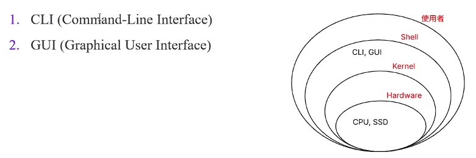

## 簡單示範指令

### touch html.index

### 或github上另一種方式

- echo "# aaa" >> README.md   也能印出來!
  
  ```batch
  echo "# aaa" >> README.md
  git init
  git add README.md
  git commit -m "first commit"
  git branch -M main
  git remote add origin https://github.com/odenmeow/aaa.git
  git push -u origin main
  ```

# (225) Command Prompt 常用指令

## Windows 用戶的指令⭐⭐⭐⭐

| cd                        | change directory       |
|:-------------------------:|:----------------------:|
| mkdir                     | make a new directory   |
| type nul > "filename.txt" | make new file          |
| cls                       | clear screen           |
| dir                       | list directory content |
| ctrl+c                    | 強制終止                   |

- 補充一下如果進去 git 的 interactive 介面，:wq 才能退出 或者:qw 我不確定。

### cd

- 透過 cd 字首 +tab可以快速提示

- 或者 cd .. 回到上一層

# (226) Unix作業系統

## Linux MacOS 直接下載git就好

## Windows 還要下載 GitBash

# (227) 下載Git (Windows)

# 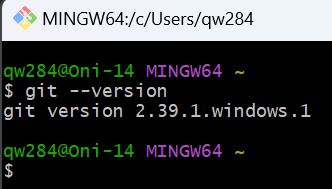

> **不過我都是使用terminal**

# (228) 下載Git (macOS)

# (229) Unix 指令

| Unix Command | Description                                                                  |
|:------------ |:---------------------------------------------------------------------------- |
| cd           | Change directory                                                             |
| ls           | List files or directories in a directory                                     |
| pwd          | Stands for "present working directory"                                       |
| mkdir        | Make directory                                                               |
| touch        | Create, change and modify timestamps of a file                               |
| rm           | Remove file                                                                  |
| rmdir        | Remove an empty directory                                                    |
| rm -rf       | rf stands for remove forcefully; can be used to remove a non-empty directory |

## MINGW64 = GitBash

```bash
qw284@Oni-14 MINGW64 ~
$ pwd             >>>>>>>>>>>>目前工作目錄
/c/Users/qw284
qw284@Oni-14 MINGW64 ~/OneDrive
$ ls             >>>>>>>>>>>>列印出目前資料夾中有哪些
 文件/
 桌面/
 簡報.pptx
 電子郵件附件/

qw284@Oni-14 MINGW64 ~/OneDrive
$ cd 桌面           >>>>>>>>>>>>>>>切換目錄

qw284@Oni-14 MINGW64 ~/OneDrive/桌面
$ mkdir styles    >>>>>>>>>>>>>  製作新的資料夾

qw284@Oni-14 MINGW64 ~/OneDrive/桌面
$ cd styles

qw284@Oni-14 MINGW64 ~/OneDrive/桌面/styles
$ touch style.scss      >>>>>>>>>製作新的文件

-------------------rm 刪除檔案------------------------------------------
垃圾桶是找不到的
qw284@Oni-14 MINGW64 ~/OneDrive/桌面/styles
$ ls
style.scss

qw284@Oni-14 MINGW64 ~/OneDrive/桌面/styles
$ rm style.scss

qw284@Oni-14 MINGW64 ~/OneDrive/桌面/styles

-------------------rmdir 移除空白檔案夾-----------------------
垃圾桶是找不到的
空的才能刪除
-------------------rm -rf 強制移除 不空也能刪除
```

## 絕對不能執行的 下面這個會殺掉系統

> GPT

在 Linux 中，`rm` 指令可以刪除檔案和目錄，如果不小心使用了錯誤的參數或選項，可能會導致重大的資料損失。以下是一些常見的危險指令，特別是搭配 `rm` 時應該特別小心的：

- `rm -rf /`：這個指令會刪除整個根目錄下的所有檔案和子目錄，導致系統無法正常運作，造成嚴重的資料損失。
- `rm -rf *`：在當前目錄下刪除所有的檔案和目錄，加上 `-rf` 選項會將檔案和目錄全部刪除，包括隱藏檔案。

這些指令都具有毀滅性，刪除了系統或重要資料。請確保在使用 `rm` 指令時小心謹慎，特別是搭配 `-rf` 選項時，避免對系統造成災難性後果。為了安全起見，儘量避免使用 `rm -rf` 指令來避免不必要的資料損失。

# (230) Git and GitHub

## Work Directory

- 工作的資料夾 包含所有資料

## Staging Area

- 想要commit的資料 加入這個區域就可以被控管追蹤。

- `git add` 加入追蹤區

## Local Repository

- .git 檔案 隱藏的資料夾，藏住追蹤的歷史資料，所以能只呈現目前版本內容

- .git 會在 `git init` 被執行 然後產出

- `git commit` 做成版本， 讓`git`記錄目前狀況，方便以後審查。

## Remote Repository

## 流程

- `git init`

- `git add` 

- `git commit -m "上傳"`

- `git push -u origin master` 
  
  - `git remote add origin https://github.com/odenmeow/aaa.git` 🍉 
  
  - origin 是從上面來的
  
  - -u 讓`git`關聯 遠端倉庫名稱+遠端分支名稱+本地目前分支
  
  - -u 可以讓下次推送 只要輸入git push 就能執行 🍉那行。
  
  - 但是只適用當初設定的branch (分支)⚠️
  
  - 如果切換了分支，會被要求重新設定⚠️

## 檔案狀態

Git 對Local Repository的檔案有4種主要狀態:

1. untracked:檔案是全新的,Git 對此一無所知。 我們要用 git add <file> 加入

2. staged:現在 Git 知道檔案(tracked),但也將檔案作為下一個commit的一 部分。如果我們做 git commit,檔案會變成:

3. unchanged:檔案自上次commit以來未更改。如果我們修改檔案,檔案 就變成:

4. unstaged:modified,但還不是下一次commit的一部分。 我們可以使用 git add 再次讓他變成staged狀態。

# (231) Git 指令

## 表格

| Git Command                              | Description                                                       |
|:---------------------------------------- | ----------------------------------------------------------------- |
| `git init`                               | Initialize an empty git repository.                               |
| `git config --list`                      | Display all configuration settings.                               |
| `git --version`                          | Display the current version of Git.                               |
| `git config --global user.name "name"`   | Set username.                                                     |
| `git config --global user.email "email"` | Set email address.                                                |
| `git status`                             | Displays the state of the working directory and the staging area. |
| `git add filename`                       | Add files to staging area.                                        |
| `git commit -m "commit message"`         | Commit all files on staging area.                                 |
| `git rm --cached filename`               | Remove files from staging area.                                   |

## git config --list

- 印出設定

- 主要找到 `user.name`  `user.email`。

## git rm  等同於git reset HEAD path/to/file

> **rm 就是刪除檔案** 
> 
> **rm --cached 則是從 staging area 搬離** 

> **reset HEAD 也可以 而且比較不怕真的永久刪除檔案** 

沒錯，`git rm` 和 `git rm --cached` 有不同的作用：

- `git rm`: 會將檔案從工作目錄中刪除，並將刪除操作添加到暫存區（staging area）。如果接著進行提交（commit），這個刪除操作會被紀錄下來，並且檔案會從 Git 的版本控制中移除。

- `git rm --cached`: 只會將檔案從暫存區（staging area）中移除，但不會刪除實際的檔案。這意味著，即使暫存區中不再跟蹤這個檔案，但這個檔案依然存在於你的工作目錄中，並會在下次提交時保留。

因此，`git rm` 會刪除實際的檔案，並將刪除操作包含在提交中，而 `git rm --cached` 則只是將檔案從暫存區移除，但不會影響實際的檔案。

### 刪除遠端分支

```batch
git push origin --delete branch_name
```

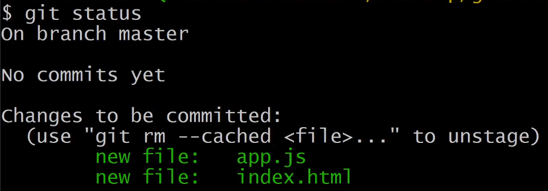

## 不希望檔案被追蹤

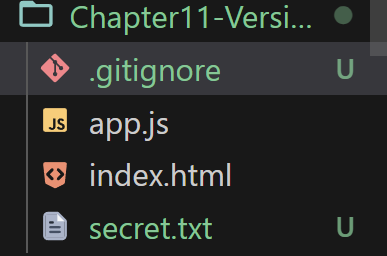

在這份檔案輸入

```gitignore
secret.txt
```

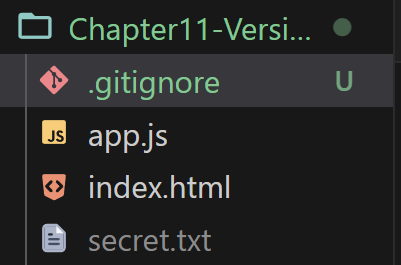

> 取消追蹤了!

# (232) branch, checkout and merge

## 步驟:

### 1. 先創建分支 然後checkout過去那邊更動index.html

```batch
PS C:\CodeSForGit\2023WebFullStack> git commit -m "Ch11 - section 232-1 建立新分支，並且在新分支上新增form，然後commit "
[CH11-being-merged 9b0e77a] Ch11 - section 232-1 建立新分支，並且在新分支上新增form，然後commit
 1 file changed, 5 insertions(+)
```

### 2. 改動index.html後 commit 然後切回master

```batch
PS C:\CodeSForGit\2023WebFullStack> git checkout master
```

### 3. 回到master後 執行merge指令就可以 合併分支

- #### 發現這邊的 log 跟 branch不同!

```batch
PS C:\CodeSForGit\2023WebFullStack> git log -n 1
commit 05ba3ef6e887bfc720af17152540808ea1382bd4 (HEAD -> master)
Author: Oni <qw28425382694@gmail.com>
Date:   Mon Dec 25 19:22:14 2023 +0800

    Ch11 - section 231-2，演示.gitignore 避免追蹤特定檔案
PS C:\CodeSForGit\2023WebFullStack> git merge CH11-being-merged
Updating 05ba3ef..9b0e77a
Fast-forward
 Chapter11-Version-Control/index.html | 5 +++++
 1 file changed, 5 insertions(+)
PS C:\CodeSForGit\2023WebFullStack>
```

### 4. 合併後 再度顯示紀錄

```batch
PS C:\CodeSForGit\2023WebFullStack> git log -n 1
commit 9b0e77afec6d0ee63bb0e3a7c5187512fe3ffb8f (HEAD -> master, CH11-being-merged)
Author: Oni <qw28425382694@gmail.com>
Date:   Mon Dec 25 19:29:03 2023 +0800

    Ch11 - section 232-1 建立新分支，並且在新分支上新增form，然後commit
PS C:\CodeSForGit\2023WebFullStack> 
```

### 由於採用fast-forward合併所以沒有產新提交，看不出合併。

## 示範合併衝突 ⭐⭐⭐⭐⭐

### 步驟如下:

1. 建立分支後 分別在branch跟master 同一個index.html ，同一個Row，寫上不同文字。 `然後commit`

2. 切換到 CH11-being-merge，同個地方寫上不同文字。`然後commit`

3. 接下來回到 `master` 執行 `merge` 
   
   ```batch
   PS C:\CodeSForGit\2023WebFullStack> git merge  CH11-being-merged
   Auto-merging Chapter11-Version-Control/index.html
   CONFLICT (content): Merge conflict in Chapter11-Version-Control/index.html
   Automatic merge failed; fix conflicts and then commit the result.
   PS C:\CodeSForGit\2023WebFullStack> 
   ```
   
   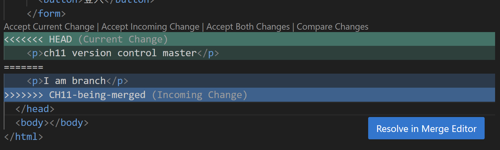

4. 這邊 vs 可能有合作所以幫我們提示哪邊需要解決
   
   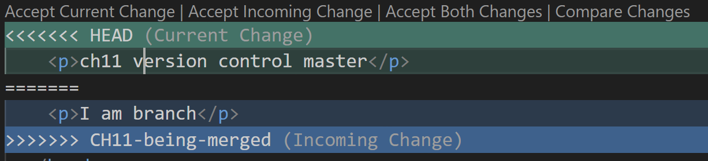
   
   > 分別有四個可以選擇 
   
   我選擇 accept both 
   
   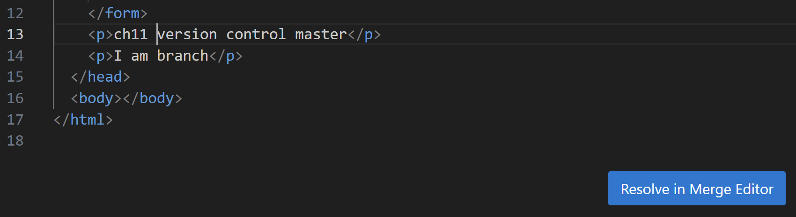
   
   我不小心按下了 藍色 所以
   
   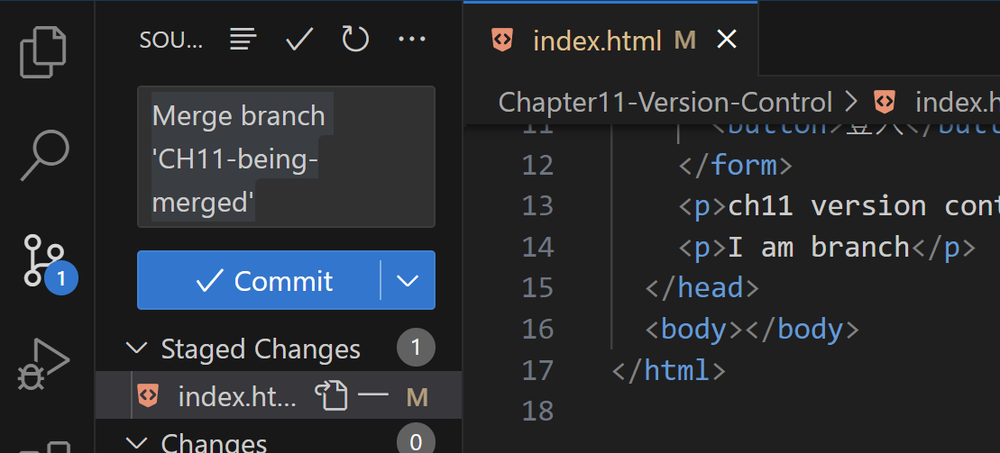
   
   跳到 VScode 默認的合併介面。
   
   但我堅持使用git command line 所以，回到terminal 使用
   
   git status 就可以查看目前
   
   ```batch
   PS C:\CodeSForGit\2023WebFullStack> git status
   On branch master
   Your branch is ahead of 'origin/master' by 4 commits.
     (use "git push" to publish your local commits)
   
   All conflicts fixed but you are still merging.
     (use "git commit" to conclude merge)
   
   Changes to be committed:
           modified:   Chapter11-Version-Control/index.html
   
   PS C:\CodeSForGit\2023WebFullStack>
   ```

5. 直接繼續 commit即可 。

6. 查看git log --graph

```bash
PS C:\CodeSForGit\2023WebFullStack> git log --graph
*   commit 90a2aaec21eee5d8901a4c97be9e916e92eb4f9f (HEAD -> master)
|\  Merge: a865d7e 7d241ce
| | Author: Oni <qw28425382694@gmail.com>
| | Date:   Mon Dec 25 19:58:06 2023 +0800
| | 
| |     Ch11 - section 232-2 合併衝突，步驟-3 合併發生衝突，確定解決後，git status查看狀態，處於still merging ，接著再去使用commit 提交，就可以合併完成了，因為我選擇both所以有兩個p tag 文字
| | 
| * commit 7d241cecd10555d9ea78d36574b85fe5ab158bb7 (CH11-being-merged)
| | Author: Oni <qw28425382694@gmail.com>
| | Date:   Mon Dec 25 19:48:38 2023 +0800
| | 
| |     Ch11 - section 232-2 合併衝突，步驟-2 分支在相同檔案且相同ROW提交commit
| | 
* | commit a865d7eacffd067c191ca464df34919636a26771
|/  Author: Oni <qw28425382694@gmail.com>
|   Date:   Mon Dec 25 19:46:37 2023 +0800
|   
|       Ch11 - section 232-2 合併衝突，步驟-1 主幹提交commit
| 
* commit 9b0e77afec6d0ee63bb0e3a7c5187512fe3ffb8f
| Author: Oni <qw28425382694@gmail.com>
| Date:   Mon Dec 25 19:29:03 2023 +0800
| 
|     Ch11 - section 232-1 建立新分支，並且在新分支上新增form，然後commit
| 
* commit 05ba3ef6e887bfc720af17152540808ea1382bd4
| Author: Oni <qw28425382694@gmail.com>
| Date:   Mon Dec 25 19:22:14 2023 +0800
|
|     Ch11 - section 231-2，演示.gitignore 避免追蹤特定檔案
|
* commit 9dc57eaadcab07d37babf1e14422d880eded80d3
| Author: Oni <qw28425382694@gmail.com>
| Date:   Mon Dec 25 19:17:35 2023 +0800
|
|     Ch11 - section 跳到231-1，演示commit，雖然好像不用?但我先增加上去
|
```

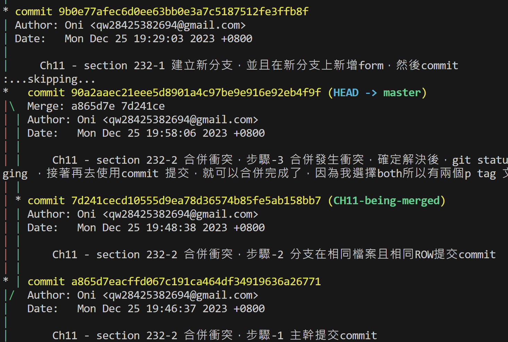

# (233) Push到GitHub

第一次commit完成後

```batch
git remote add origin https://github.XXXX
git push -u origin master
-----------------以後只要做下面就好
git push
```

## 移除遠端關聯💡

```batch
git remote remove origin 
```

# (234) remote Support for password # authentication was removed on August 13, 202

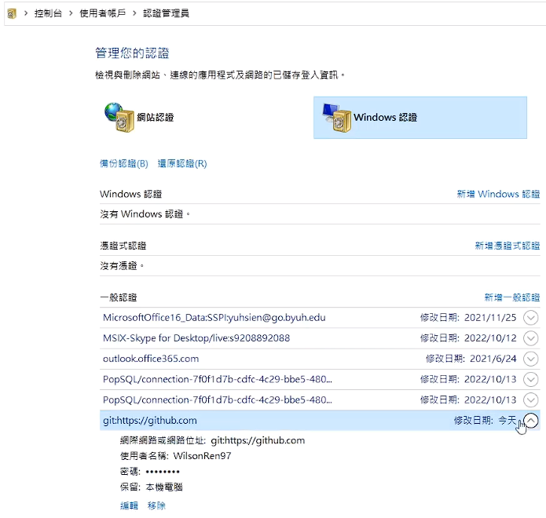

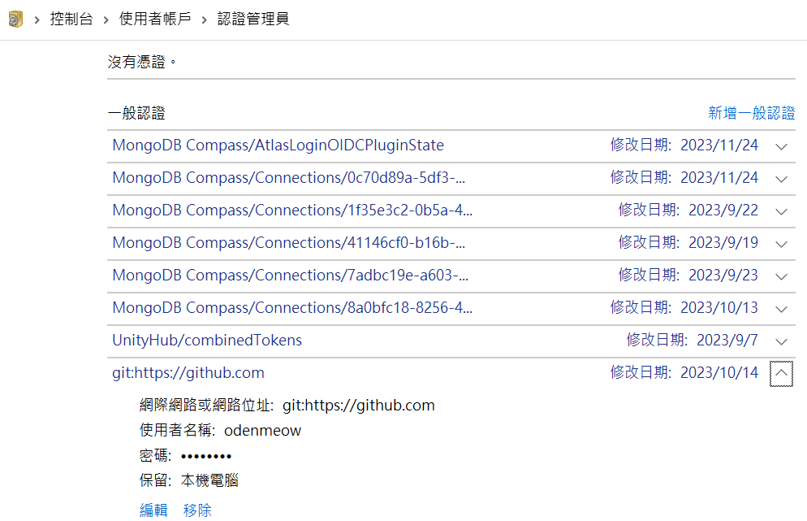

# (235) Git Pull

## git clone

## git pull

# 課後小考

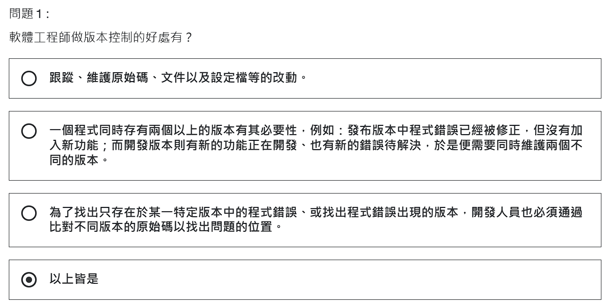
