# (236) 靜態與動態網頁

靜態很快但死板。

動態慢，但客製化。

# (237) 網頁開發工具

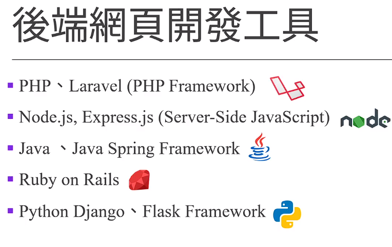

## Node.js

> V8 js engine = chrome 的引擎


# (238) Module Wrapper

## module

一組的程式碼，組成簡單或複雜功能，用來與外部其他程式碼連結、可以單個文件、多個文件、或資料夾的集合。

- 第一個js

```js
// (function (exports, require, module, __filename, __dirname) {
//   // Module code actually lives in here
// })(); //IIFE

console.log("這是app1.js文件");
let name = "oni";
require("./app2");
// 上面這個函數幫我們丟進去 node.js提供的第二個參數
// 由於使用IIFE 所以不會被汙染變數!!!
```

- 第二個js

```js
let name = "AAA";
let age = 10;
console.log(name, age);
```

## 執行module的程式碼之前 node.js會用下方函數包裝它

```js
(function(exports,require,module,__filename,__dirname){
    // Module code actually lives in here
})(); //IIFE
```

1. 使用該 module 的 .js檔案 ，本身使用的global variable不會被 module內部的變數影響

2. 讓 module內部的global 變成function scope

3. 讓 module內部的js文件可使用某些實用的變數例如
   
   - module 
   
   - exports
   
   可以用來輸出本身module
   
   - require
   
   可以用來獲得其他module

4. `__filename` 、 `__dirname` 再開發上變得方便 因為兩者包module的絕對路徑名稱跟資料夾路徑

```js
// (function (exports, require, module, __filename, __dirname) {
//   // Module code actually lives in here
// })(); //IIFE

console.log("這是app1.js文件");
let name = "oni";
require("./app2");
// 上面這個函數幫我們丟進去 node.js提供的第二個參數
// 由於使用IIFE 所以不會被汙染變數!!!

console.log(__filename);
console.log(__dirname);


---------------------------------------------


這是app1.js文件
AAA 10
c:\CodeSForGit\2023WebFullStack\Chapter12-Node.js\app1.js
c:\CodeSForGit\2023WebFullStack\Chapter12-Node.js
```

# (239) Self-made Modules⚠️⚠️

- 找功能可以到下面去找

> [Index | Node.js v21.5.0 Documentation (nodejs.org)](https://nodejs.org/docs/latest/api/)   

## modules分三種

### 內建的modules直接使用

### 自製的 self - made modules⭐⭐⭐⭐

#### module變數是一個物件

> module 包含id path exports parent filename 等資訊

```js
console.log(module);
-----------------------------------------
PS C:\CodeSForGit\2023WebFullStack> node "c:\CodeSForGit\2023WebFullStack\Chapter12-Node.js\app1.js"
{
  id: '.',
  path: 'c:\\CodeSForGit\\2023WebFullStack\\Chapter12-Node.js',
  exports: {},
  filename: 'c:\\CodeSForGit\\2023WebFullStack\\Chapter12-Node.js\\app1.js',    
  loaded: false,
  children: [],
  paths: [
    'c:\\CodeSForGit\\2023WebFullStack\\Chapter12-Node.js\\node_modules',       
    'c:\\CodeSForGit\\2023WebFullStack\\node_modules',
    'c:\\CodeSForGit\\node_modules',
    'c:\\node_modules'
  ]
}
```

#### exports 是 module物件的屬性 本身是empty object

透過下面方式設定

```js
module.exports.morning = morning;
console.log(module.exports);  // {}
-------------------------------
```

#### require 是一個function可以讀取/執行 js文件。⭐⭐

⭐⭐⭐⭐⭐⭐

> **執行後會return 該文件的exports object** 

> **如果讀取的是資料夾，則讀取該資料夾的index.js文件、執行該文件。**
> 
> **return該文件的exports object**

- 執行方法如下 下面是app1.js

```js
// console.log(module);

let app2 = require("./app2");
app2.morning();
----------------------------
早安
```

#### 如果讀取資料夾則回傳內部index.js執行後結果⭐

⭐⭐⭐⭐⭐

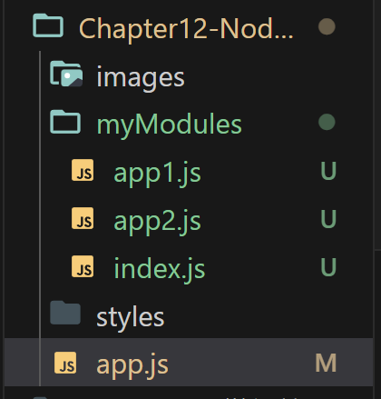

- app.js
  
  ```js
  let myModule = require("./myModules");
  
  myModule.evening();
  myModule.morning();
  ```

- index.js   因為存在於資料夾 所以會被執行
  
  ```js
  let app1 = require("./app1");
  let app2 = require("./app2");
  
  module.exports.morning = app2.morning;
  module.exports.evening = app1.evening;
  ```

- app1.js
  
  ```js
  // console.log(module);
  
  // let app2 = require("./app2");
  // app2.morning();
  
  function evening() {
    console.log("晚安");
  }
  module.exports.evening = evening;
  ```

- app2.js
  
  ```js
  function morning() {
    console.log("早安");
  }
  
  // console.log(module.exports);  // {}
  module.exports.morning = morning;
  ```

### 網路上第三方透過npm下載使用

- node package manager 

## 總結 (commit)

- git commit -m "Ch12 - section239 講解模組、使用方式、require ( '資料夾名稱或者app.js')如果放資料夾名稱則自動執行其中的 <index.js> 然後把exports物件回傳 或者 寫清楚<檔案.js>、也是回傳exports物件，透過設定module.exports.aaa=aaa; 這樣就可以得到aaa方法或者屬性。exports本身是一個空物件，也是溝通橋樑，透過require可以取得其他模組提供的方法或屬性!"

# (240) Node內建Module

## node.js 提供的fs (file system)

### writeFile(路徑參數) 議題⚠️⚠️⚠️

- 這個路徑參數是根據 相對於執行node app.js的位置 ，而不是檔案本身位置。 ⚠️

- 解決辦法如下
  
  ```js
  const fs = require("fs");
  const path = require("path");
  let myfilePath = path.join(__dirname + "/myFile.txt");
  myfilePath = "C" + myfilePath.substring(1); //0不需要，從1開始擷取
  
  // console.log(__dirname);
  // console.log(__filename);
  // c:\CodeSForGit\2023WebFullStack\Chapter12-Node.js
  
  fs.writeFile(myfilePath, "今天很冷", (e) => {
    if (e) {
      throw e;
    }
    console.log("文件成功撰寫完畢");
  });
  ```

### ReadFile 讀取檔案

### 如果存在則

```js
fs.readFile(myfilePath, "utf8", (e, data) => {
  if (e) throw e;
  console.log(data);
});
```

### 如果不存在

```js
/*********    如果檔案不存在              ************** */
fs.readFile("myfilePath", "utf8", (e, data) => {
  if (e) {
    console.log(e);
  }
  console.log(data); //undefined
});

---------------------------------------

[Error: ENOENT: no such file or directory, open 'C:\CodeSForGit\2023WebFullStack\myfilePath'] {
  errno: -4058,
  code: 'ENOENT',
  syscall: 'open',
  path: 'C:\\CodeSForGit\\2023WebFullStack\\myfilePath'
}
undefined
```

## 心得:

 git commit -m "Ch12 - section240 Node內建模組，講解fs 可以讀取檔案，寫入檔案，採用執行node app.js 時的路徑，例如我是C:\CodeSForGit\2023WebFullStack 那麼我如果檔案寫入填上 ./myfile.txt 則會出現在C:\CodeSForGit\2023WebFullStack\myfile.txt 而不是在 Chapter12-Node.js\myfile.txt ，這 
算一個缺陷，我有透過字串結合，利用__dirname去得到絕對位置路徑，然後改寫字首大寫，讓他可以變成相對路徑(相對於文件本身位置)而非(相對執行文件的位置)"

# (241) IP, DNS, Port

他忘記說 http 內建的module，這邊說。

## IP

### > IPv4 32位元

`192.168.1.1`

### > IPv6 128位元

`2001:0db8:85a3:0000:0000:8a2e:0370:7334`

## DNS

Domain Name System

## Port

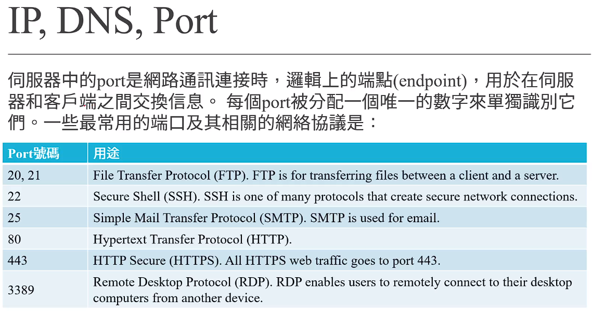

| Port 號碼 | 用途                                     |
| ------- | -------------------------------------- |
| 20, 21  | 檔案傳輸協定 (FTP)。FTP用於客戶端和服務器之間的文件傳輸。      |
| 22      | 安全外殼（SSH）。SSH是創建安全網絡連接的眾多協議之一。         |
| 25      | 簡單郵件傳輸協議 (SMTP)。SMTP用於電子郵件。            |
| 80      | 超文本傳輸協議 (HTTP)。                        |
| 443     | HTTP安全 (HTTPS)。所有的HTTPS網絡流量都通過443端口。   |
| 3389    | 遠程桌面協議 (RDP)。RDP允許用戶從另一設備遠程連接到他們的桌面電腦。 |

### localhost = 127.0.0.1

代表本電腦

### loopback

> 連接自己的port，方便測試 

### 通常架設都是用3000/8080

# (242) HTTP Request and Response Header

## 基本規定格式如下

### Request-Line for HTTP

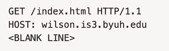

#### 交出表格則如下

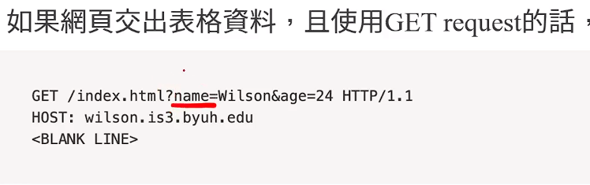

#### Post內部有表格的話則是

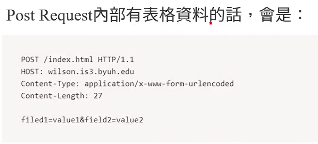

- 僅憑網址看不到該內容

#### Cookie也是這樣

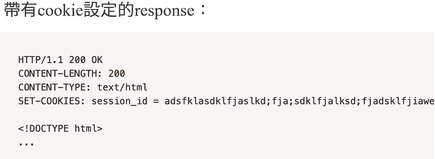

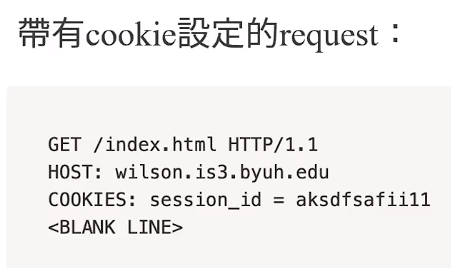

### Status-Line for HTTP Response

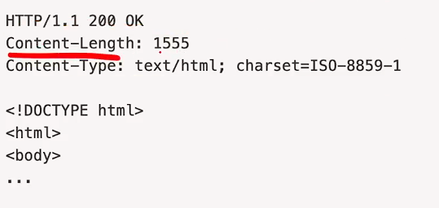

### Header

編碼、文件長度之類

### empty line indicating the end of the header fields

有空行就代表上面結束了

### Optionally a message section

可選擇 要不要使用的訊息區塊

# (243) 網頁伺服器製作

## req headers 長下面這樣

```js
const http = require("http");

// request obj  ,  response obj
const server = http.createServer((req, res) => {
  console.log(req.headers);
});

server.listen(3000, () => {
  console.log("正在3000運行中");
});

--------------------------------------------
正在3000運行中
{
  host: 'localhost:3000',
  connection: 'keep-alive',
  'cache-control': 'max-age=0',
  'sec-ch-ua': '"Not_A Brand";v="8", "Chromium";v="120", "Microsoft Edge";v="120"',
  'sec-ch-ua-mobile': '?0',
  'sec-ch-ua-platform': '"Windows"',
  'upgrade-insecure-requests': '1',
  'user-agent': 'Mozilla/5.0 (Windows NT 10.0; Win64; x64) AppleWebKit/537.36 (KHTML, like Gecko) Chrome/120.0.0.0 Safari/537.36 Edg/120.0.0.0',
  accept: 'text/html,application/xhtml+xml,application/xml;q=0.9,image/webp,image/apng,*/*;q=0.8,application/signed-exchange;v=b3;q=0.7',
  'sec-fetch-site': 'none',
  'sec-fetch-mode': 'navigate',
  'sec-fetch-user': '?1',
  'sec-fetch-dest': 'document',
  'accept-encoding': 'gzip, deflate, br',
  'accept-language': 'zh-TW,zh;q=0.9,en;q=0.8,en-GB;q=0.7,en-US;q=0.6',        
  cookie: 'JSESSIONID=9D01158B8D4DFB98E1791E921B181BF1'
}
```

## 避免亂碼

### 以下會產生亂碼

```js
const server = http.createServer((req, res) => {
  //   console.log(req.headers);
  res.write("歡迎來到我的網頁");
  res.end();
});
```

### 避免法方法 要設定utf8

```js
const server = http.createServer((req, res) => {
  res.writeHead(200, { "Content-Type": "text/html; charset=utf-8" });
  res.write("歡迎來到我的網頁");
  res.end();
});
```


## 顯示請求的url

切換到 localhost:3000/mypage就會顯示我請求網頁為

```js
const server = http.createServer((req, res) => {

  console.log(req.url); // 請求的url是什麼
});

---------------------------------------------------

PS C:\CodeSForGit\2023WebFullStack> node "c:\CodeSForGit\2023WebFullStack\Chapter12-Node.js\app.js"
正在3000運行中
/mypage
```

### 透過配合req.url可以給予不同顯示

```js
const http = require("http");

// request obj  ,  response obj
const server = http.createServer((req, res) => {

  res.writeHead(200, { "Content-Type": "text/html; charset=utf-8" });
  if (req.url == "/") {
    res.write("歡迎來到我的網頁");
  } else if (req.url == "/anotherPage") {
    res.write("歡迎來到另一個頁面");
  } else {
    res.write("不存在這頁面");
  }
  res.end(); // 如果沒有這個會導致轉圈圈的問題，瀏覽器收不到回應完成的訊號
});

server.listen(3000, () => {
  console.log("正在3000運行中");
});
```


### 配合file system  ReadFile

```js
else if (req.url == "/myFile") {
    fs.readFile(myfilePath + "/myFile.html", (e, data) => {
      if (e) {
        res.write("存取html文件出錯");
        res.end();
        // 如果沒有這個會導致轉圈圈的問題，瀏覽器收不到回應完成的訊號
        // 必須一個一個增加，因為asynchronous 會導致可能先end() 結果還沒送出檔案
      } else {
        res.write(data);
        res.end();
        // 如果沒有這個會導致轉圈圈的問題，瀏覽器收不到回應完成的訊號
        // 必須一個一個增加，因為asynchronous 會導致可能先end() 結果還沒送出檔案
      }
    });
```

- 當我沒有建立該html就會出錯🔥

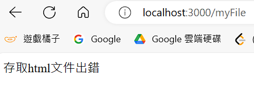

- 建立之後🔥
  
  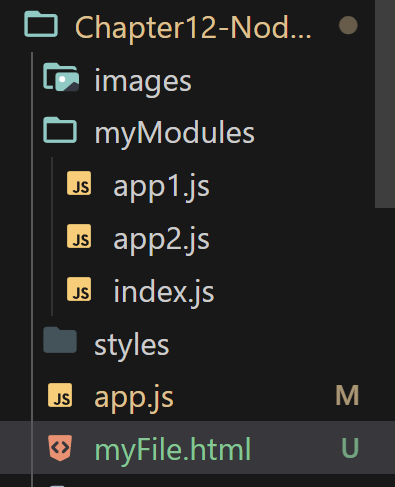
  
  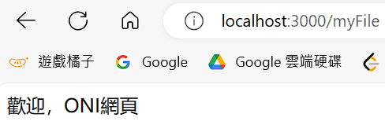

## res.end() 導致轉圈圈問題、同步問題

如果沒有這個會導致轉圈圈的問題，瀏覽器收不到回應完成的訊號!

如果不是寫在 write之後就end 而是最後一口氣end，也會出現同步錯誤。

# (244) nodemon: 因為這個系統上已停用指令碼執行，所以無法載入

## 請使用 VScode中的 commandPrompt=CMD

# (245) Error: EACCES: permission denied, access '/usr/local/lib/node_modules'

# (246) NPM與nodemon

Node package manager 是預設的node.js預設套件管理系統

隨著node.js自動安裝，我們可以再CLI下指令，讓電腦去抓別人的node package

Package是一個資料夾，其中包含一個或者多個module。

Module是js文件。

如果想要用別人的、下載他們的東西來使用、並管理可以透過

## npm init

> **裡面有 package.json🔥🔥**

## 請注意工作目錄

> C:\CodeSForGit\2023WebFullStack\Chapter12-Node.js>

## 執行

```batch
C:\CodeSForGit\2023WebFullStack\Chapter12-Node.js> npm init
See `npm help init` for definitive documentation on these fields
and exactly what they do.

Use `npm install <pkg>` afterwards to install a package and
save it as a dependency in the package.json file.

Press ^C at any time to quit.
package name: (chapter12-node)                -----enter就好
version: (1.0.0)                            -----enter就好
description: This is a simple node folder !  -----自己輸入文字
entry point: (app.js)
test command:
git repository:
keywords:
author:
license: (ISC)
About to write to C:\CodeSForGit\2023WebFullStack\Chapter12-Node.js\package.json:

{
  "name": "chapter12-node",
  "version": "1.0.0",
  "description": "This is a simple node folder !",
  "main": "app.js",
  "scripts": {
    "test": "echo \"Error: no test specified\" && exit 1"
  },
  "author": "",
  "license": "ISC"
}


Is this OK? (yes)            --------輸入 yes就好
```

## 介紹npmjs網站可以找功能

> cowsay 印出說話的牛

## 安裝的語法⭐

### npm install <package> 或者 npm i

- 直接執行 npm i cowsay 會安裝當時最新版本

### 安裝特定版本的語法⭐⭐

#### npm install <package> @ <version>

- npm install cowsay@1.5.0

- 安裝完畢就會出現資料夾 node_modules⭐⭐⭐
  
  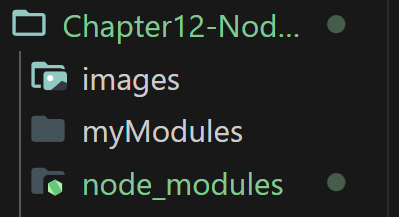

## package.json 會管理你安裝的東西

```json
{
  "name": "chapter12-node",
  "version": "1.0.0",
  "description": "This is a simple node folder !",
  "main": "app.js",
  "scripts": {
    "test": "echo \"Error: no test specified\" && exit 1"
  },
  "author": "",
  "license": "ISC",
  "dependencies": {
    "cowsay": "^1.5.0"
  }
}
```

## cowsay使用方式

> [cowsay - npm (npmjs.com)](https://www.npmjs.com/package/cowsay#usage-as-a-module) 

- 上面網址有告知怎麼使用 ! 

```js
var cowsay = require("cowsay");

console.log(
  cowsay.say({
    text: "I'm a moooodule",
    e: "oO",
    T: "U ",
  })
);
```

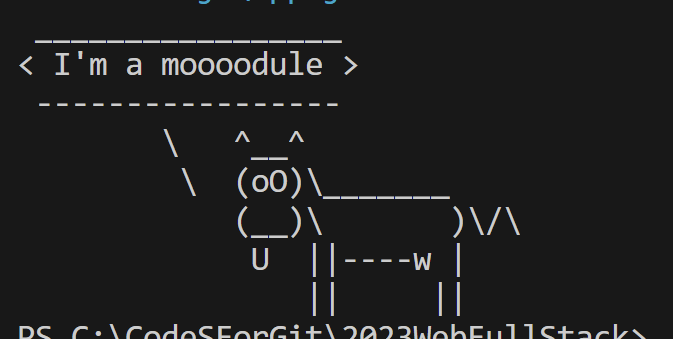

## nodemon 自動重啟server

## 順便提示 npm install -g 參數很重要⭐⭐

- npm install -g <package> 

- 上面指令會安裝到作業系統內部 任何地方都能使用

- 之後就不用重複安裝了⭐⭐⭐⭐

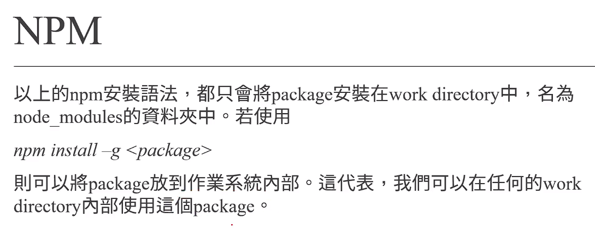

## 使用nodemon !  範例 !

- 輸入 nodemon app.js 就可以啟用

```js
C:\CodeSForGit\2023WebFullStack\Chapter12-Node.js>nodemon app.js
[nodemon] 3.0.2
[nodemon] to restart at any time, enter `rs`
[nodemon] watching path(s): *.*
[nodemon] watching extensions: js,mjs,cjs,json
[nodemon] starting `node app.js`
 _________________
< I'm a moooodule >
 -----------------
        \   ^__^
         \  (oO)\_______
            (__)\       )\/\
             U  ||----w |
                ||     ||
[nodemon] clean exit - waiting for changes before restart
[nodemon] restarting due to changes...
[nodemon] starting `node app.js`
 _______
< 牛牛! >
 -------
        \   ^__^
         \  (oO)\_______
            (__)\       )\/\
             U  ||----w |
                ||     ||
[nodemon] clean exit - waiting for changes before restart
```

# (補充說明  node install -g)

關於-g在電腦用globally安裝dependencies的方式，上支影片忘記補充，用-g安裝的package，其二進制的文件會被放入電腦的PATH 環境變量中 (也就是作業系統知道的某個地方)。因此，這種package可以在shell被直接使用，在Windows的CMD當中，或是Mac的terminal當中，都可以直接透過shell使用套件。

當然，如果是資料夾內用需要用require()所取得的package，則一定要在本地透過npm install <package>的指令安裝。只有像nodemon這種透過shell執行的package適合使用-g做全域安裝。6

# 最終小考

## 問題 4：

伺服器中的port是網路通訊連接時，邏輯上的端點(endpoint)，用於在伺服器和客戶端之間交換信息。 每個port被分配一個唯一的數字來單獨識別它們。以下Port與用途的配對，何者錯誤？

- 25 - SMTP

- 80 - HTTP

- 443 - HTTPs

- 3000 - FTP >>>>>>>>>>>>>>>20, 21才是FTP協議使用的port!

## 問題 5：

在HTTP協議中，規定是使用何種字符當作header與message section的分隔標示？

- 驚嘆號

- 空白的一行 >>>>>>>>>>>>>>>

- 問號

- 句號

## 問題 6：

如果網頁交出表格資料，且使用GET request的話，表格內的哪些資料會被夾帶在HTTP request當中？

- 有設定class屬性的<input>(或其他)標籤

- 有設定id屬性的<input>(或其他)標籤

- 有設定for屬性的<input>(或其他)標籤

- 有設定name屬性的<input>(或其他)標籤  >>>>>>>>>>>>>>>

## 問題 7：

如果網頁交出表格資料，且使用GET request的話，表格內的資料會被放在HTTP request的哪個地方？

- name=value   url中 ? 之後 分隔方式為&

## 問題 8：

如果網頁中的表格以POST request的方式送往後端，表格內的資料會附在HTTP request的哪個區域？

- message section   >>>>>>>>>>>>>>>>>>>>>>

- 連接在URL的後方，以「?」分隔開來。

- 使用SHA演算法算出雜湊值，再附加在URL後方。

- 使用Bcrypt演算法算叫雜湊值，再附加在URL後方。
