# 提醒事項💡💡💡💡💡

先對目前檔案做以下

npm init 全預設直接 enter，y 就可以

npm install express

會多出以下檔案

- Chapter13-Express.js\package.json

- Chapter13-Express.js\package-lock.json

- Chapter13-Express.js\node_modules

# (248) ExpressJS

>  **建構在node.js之上，是他的框架，為了加速伺服器開發。**

**步驟**

1. 切換到正確的資料夾，然後用VsCode cmd
   
   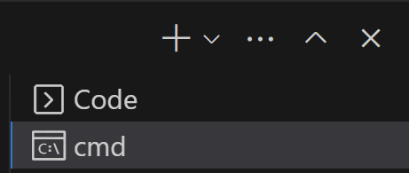

2. npm init 全部預設，yes 直接創建

3. npm install express

## 回傳function而不是exports.myfunction

- 原本如下
  
  ```js
  const try2 = require("./try2");
  try2.try2function();
  ```

- 目標如下
  
  ```js
  const try2function= require("./try2");
  
  try2function();
  ---------------------------------------
  function try2function() {
    console.log("hii form try2");
  }
  module.exports = try2function;
  ```

## express使用方式

```js
const express = require("express");
const app = express(); //回傳一個物件過來

// HTTP request GET  POST PUT DELETE

app.get("/", (req, res) => {
  res.send("歡迎來到首頁");
});

app.get("/anotherPage", (req, res) => {
  res.send("這是另一個頁面");
});

// port callback
app.listen(3000, () => {
  console.log("伺服器正在聆聽port3000..");
});
```

## framework / library

一個是自己搭配(但較為受限制)、一個是較原始工具(自己製作但很沒方向)

### library

- Bootstrap  => HTML CSS的library 

- jQuery   = >   JS的 

- Flask  => python web framework

# (249) HTTP Request Methods

## 常見的請求methods

### GET

- 只應該使用於取得資料

- 例如初訪網頁、搜尋

### POST

- 通常會改變伺服器狀態或者已經儲存的資料

- 例如登入


## 其他幾個常見，但不能純HTML寫出功能

> 搭配 js 或者 postman才能

### PUT

- 用於修改資源的方法，發送更新整個資源的數據

### PATCH

- 更新**部分數據** 而不是修改整個數據

### Delete

- 用於刪除資源

# (250) Express Routing與Response Object

## Express Routing

---

路由 (routing) 指伺服器如何回應特定端點endpoint的請求，由特定的URI和特定的HTTP請求方法(GET、POST之類)組成。

▪ an endpoint that handles GET /weather /taiwan requests.

▪ an endpoint that handles GET /weather / hongkong requests.

▪ an endpoint that handles POST / weather / taiwan requests. 

▪ an endpoint that handles POST / weather / hongkong requests.

---

### express中 製作routing endpoints的方法如下

1. app.listen(port,callbackFn)

2. app.method(path,handler)
   
   - app.get( "/login" , ( req,res )=>{} )

## 常用ResponseObject Methods

| Methods                    | Description                                                                          |
| -------------------------- | ------------------------------------------------------------------------------------ |
| res.send(body)             | 傳送出HTTP Respsonse。 Body可以是String, object, array, boolean等等。                          |
| res.sendFile(path)         | 將位於path的文件傳送出去。                                                                      |
| res.json(body)             | 發送 JSON response。此method會先使用JSON.stringify()將body轉換為 JSON String後,再發送一個response給客戶端。 |
| res.redirect(path)         | 伺服器通過發送狀態為302 的HTTP response 要求客戶端到 path。客戶端 會重新發送一個HTTP GET request到path。           |
| res.render(view[, locals]) | res.render(view[, locals]) 將view模板套用locals的文字後,將view發送到客戶端。                          |
| res.status()               | HTTP Response status code                                                            |

### 示範send 會產生的錯誤

```js
app.get("/example", (req, res) => {
  res.send("<h1>這是一個h1標籤示範</h1>"); 
  res.send("<p>這是一個段落</p>");
});


------------------------------------------------
Error [ERR_HTTP_HEADERS_SENT]: 
Cannot set headers after they are sent to the client
```

- 這是因為 res.send 會幫忙設定header ，因為呼叫兩次所以兩次都設定，只能設定一次!

### 示範sendFile 需要絕對路徑否則出錯

- __dirname
  
  ```js
  app.get("/example", (req, res) => {
    // 下面一定要用absolutely rout
    res.sendFile(__dirname + "/example.html");
  });
  ```

```
### 示範Json

- 想要傳送物件過去 可以這樣

```js
app.get("/example", (req, res) => {
  let obj = {
    title: "Web Design",
    website: "Udemy",
  };
  res.json(obj);
});
```

  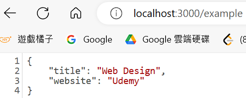

### 302 Found 就會觸發redirect

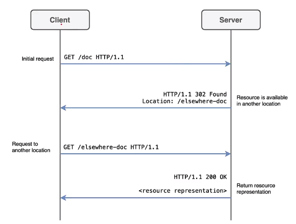

- 因此我們就會讓使用者去另外一個網址
  
  ```js
  app.get("/example", (req, res) => {
    res.redirect("/newPosition");
  });
  ```
  
  瞬間被移動過去
  
  ```js
  app.get("/newPosition", (req, res) => {
    console.log(res.send("這邊才是正確資源位置"));
  });
  ```

### res.render 跳過 14章EJS才打算說明

### res.status() 也跳過嚕

# (251) Request object常用屬性

## 避免別人亂打網址 然後出現

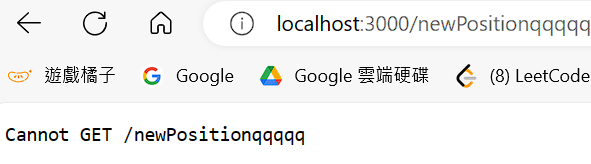

- 解決方式如下
  
  ```js
  app.get("*", (req, res) => {
    console.log(res.send("你所找的頁面不存在"));
  });
  ```
  
  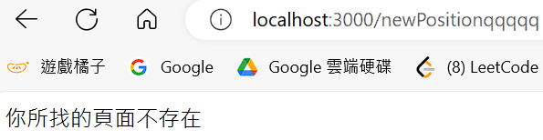

### 特別注意不可放最上面，否則大家都找不到

- 蠻笨的，不過看起來沒打算改變@@

## 常見方法、屬性

| Attributes | Description                                                                                                                      |
| ---------- | -------------------------------------------------------------------------------------------------------------------------------- |
| req.body   | 此屬性是一個物件,預設值是undefined,但若使用express.json()或是<br>express.urlencode()這種middleware,可以讓內部包含POST request寄來的資料訊息, 並且用key-value pair來表示。 |
| req.params | 此屬性是一個物件,內部屬性為named route parameters。例如,如果我們有route是 /user/:name,則“req.params.name”屬性可取得route當中的name的值。此物件默認為 0 。                 |
| req.query  | 此屬性是一個物件,其中包含route中“?”後面的key-value pair。例如,如果我們有 route 是/api/getUser/?id=1,則req.query.id就會是1。                                    |

### req.params

`(http://localhost:3000/fruit/suica)`

```js
app.get("/fruit", (req, res) => {
  res.send("歡迎來到水果頁面");
});
app.get("/fruit/:someFruit", (req, res) => {
  res.send(req.params.someFruit);
});
```

- 透過params.someFruit可以取得

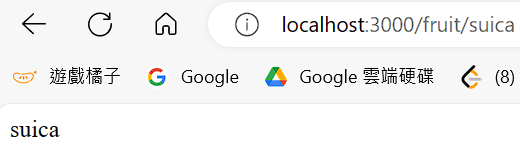

### req.query ()

```js
<form action="/formhandling" method="GET">
    <label for="name">名稱:</label>
    <input type="text" id="name" name="name" />
    <label for="age">年齡:</label>
    <input type="number" id="age" name="age" />
    <button>送出!</button>
</form>form>
```

```js
app.get("/example", (req, res) => {
  res.sendFile(__dirname + "/example.html");
});


//app.get("/formhandling", (req, res) => {
//  console.log(req.query);
//});
app.get("/formhandling", (req, res) => {
  console.log(req.query);
  res.send(
    "伺服器已經收到表單，你收到的資料如下" +
      "\n" +
      "名稱:" +
      req.query.name +
      "年紀:" +
      req.query.age
  );
});
```

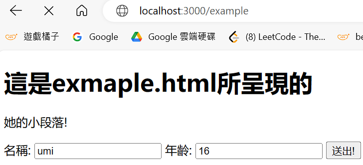

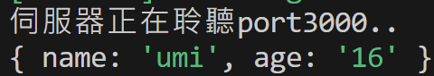


### req.body !!!💡💡

#### express.json ()

- 會去檢查requests的header有沒有Content-Type:application/json

- 如果有就把text-based JSON 換成 JS 能夠存取的JSON物件

#### express.urlencoded()

- 去檢查 requests的header有沒有Content-Type:application/x-www-form-urlencoded，也就是檢查是不是帶有資料的POST request，如果有也設定成JS 能存取的JSON物件。

- **Extended屬性設定為true可以讓JSON物件內部儲存String以外的資料類型。**

> 功能幾乎一樣 只是處裡的Content-Type不同，轉換後的JSON物件會被放入req.body

#### post form寫法、讀取reqbody步驟

```js
app.get("/example", (req, res) => {
  res.sendFile(__dirname + "/example.html");
});
app.post("/formhandling", (req, res) => {
  console.log(req.body);
});
```

> 最上方記得補上以下 ，否則express不會幫你添加進去req.body

```js
const express = require("express");
const app = express(); //回傳一個物件過來

// middleware
app.use(express.json());
app.use(express.urlencoded({ extended: true }));
```

- 放到所有的router上面去

- 如果添加上面之後就會出現
  
  `{ email: 'yee885495@gmail.com', password: '22222' }`

# (252) Express Middleware

> 中介軟體，發出HTTP請求之後到伺服器回應之前，用來做特定用途的程式。

> 每個middleware可以針對所收到的物件進行修改或者解析，處理後在決定是否要繼續把物件傳遞給下一個middleware。

Express.js中 最基礎的使用middleware的語法是app.use(callbackfn)

無論是何種 GET POST PUT...app.use(  fn )都會被執行

## callbackFn被express執行的三個參數

### req,res,next

### next本身是一個function

> **如果不打算結束或者回應，那就用這個方式交給下一個callbackfn**

---

**錯誤處理中介軟體(error-handling middleware)是專門用來處理錯誤狀況所使用的。撰寫錯誤處 理中介軟體時, callbackFn則會使用四個參數,分別為為err、req、res 與 next。err參數代表,當錯 誤發生時,Express.js會把error object當作argument放入callbackFn內部。**

> 之後會在特別說錯誤怎麼辦

---

```js
// 實際使用
app.use((req, res, next) => {
  console.log("正在經過middleware");
});
```

- 如果不執行`next()` 就會卡在這邊也不會回應給前端

```js
app.use((req, res, next) => {
  console.log("正在經過middleware");
  next();
});
app.use((req, res, next) => {
  console.log("正在經過第二個middleware");
  next();
});
----------------------
伺服器正在聆聽port3000..
正在經過middleware
正在經過第二個middleware
```

# (253) Static Files

> 靜態文件是指客戶端可以下載的文件，例如404錯誤網頁、CSS文件、JS文件、網頁圖片之類，不需要透過腳本組成網頁後再傳輸，而是可以直接寄送。

預設情況不能提供 static files 需要使用 middleware

`app.use(express.static('public'))`

才能向客戶端提供

## 工作目錄創造資料夾public

> **一定要叫做 public**

## 實驗步驟:

```js
app.get("/", (req, res) => {
  res.sendFile(__dirname + "/index.html");
});
```

```html
<!DOCTYPE html>
<html lang="zh-Hants">
  <head>
    <meta charset="UTF-8" />
    <meta name="viewport" content="width=device-width, initial-scale=1.0" />
    <title>Document</title>
    <meta name="author" content="Onini" />
    <link rel="stylesheet" href="styles/style.css" />
  </head>
  <body>
    <h1>歡迎到網頁首頁</h1>
  </body>
</html>
```

```scss
body {
  background-color: black;
  color: white;
}
```

- 沒有被套用樣式

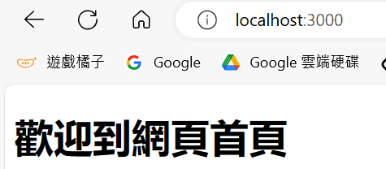

### 因為沒有使用中介軟體 !!

```js
app.use(express.static("public"))
```

#### 相對路徑、不需要public⚠️⚠️

- 雖然普通在寫的時候會以為要使用/public/styles/style.css 但這邊不用

```js
<link rel="stylesheet" href="styles/style.css" />
```

- ⚠️因為他會直接到public下面去找。🔥


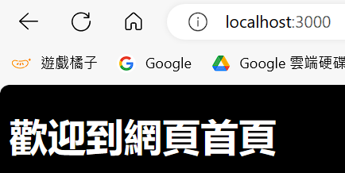

# (254) HTTP Status Code

HTTP狀態碼(Status Code)是伺服器對任何HTTP請求的回應代碼。 

當我們寄送請求到伺服器後,伺服器會使用一個三位數的代碼表明一個 HTTP請求

是否已經被完成。HTTP Status Code分為五種:

1. 資訊回應(Informational responses, 100-199)

2. 成功回應(Successful responses, 200-299)

3. 重定定向(Redirects, 300-399)

4. 用戶端錯誤 (Client errors, 400-499)

5. 伺服器端錯誤(Server errors, 500-599)

## 最常見與最常使用的HTTP Status Code:

| Code                      | Meaning                                                      |
| ------------------------- | ------------------------------------------------------------ |
| 200 OK                    | 表示請求成功。                                                      |
| 201 Created               | 請求成功且新的資源成功被創建,通常用於POST 或一些 PUT 請求後的回應。                      |
| 302 Found                 | 表示請求資源的URI已臨時更改。將來可能會對 URI 進行新的更改。因此,客戶 端在以後的請求中應該使用相同的 URI。 |
| 400 Bad Request           | 表示伺服器因為收到無效語法,而無法理解請求。                                       |
| 401 Unauthorized          | 需要授權以回應請求。它有點像403,但這裡的授權,是有可能辦到的。                            |
| 403 Forbidden             | 用戶端並無訪問權限,例如未被授權,所以伺服器拒絕給予回應。不同於 401,伺 服端知道用戶端的身份。           |
| 404 Not Found             | 伺服器找不到請求的資源。因為在網路上它很常出現,這回應碼也許最為人所悉。                         |
| 500 Internal Server Error | 伺服器端發生未知或無法處理的錯誤。                                            |


### res.status(404)

```js
app.get("*", (req, res) => {
  res.status(404);
  res.send("你所找的頁面不存在");
});
```

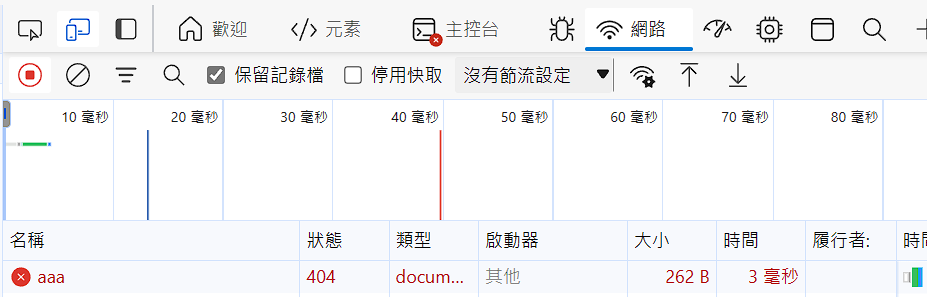

## Method Chain

```js
res.status(404).send("你所找的頁面不存在");
```

## req , res +上return

```js
app.get("*", (req, res) => {
  res.status(404);
  res.send("你所找的頁面不存在");

     return xxx; 直接中斷
});
```

# 最終小考

## 問題 4：在HTTP POST request的表格值，可以透過以下何者取得？

- req.body >>>>>>>>>>>>>>>>>>>>>>>>>>

- req.params

- req.query

- req.user

## 問題 5：在HTTP GET request的表格值，可以透過以下何者取得？

- req.body

- req.params

- req.query  >>>>>>>>>>>>>>>>>>>>>>>>>>

- req.user

## 問題 6：如果我們有route是/user/:name，則要取的name代表的值，需要用以下何者？

- req.body

- req.params  >>>>>>>>>>>>>>>>>>>

- req.query 

- req.user

## 問題 7：關於HTTP status code代表的意思，以下何者錯誤？

- 200 OK 表示請求成功。

- 400 Bad Request 表示伺服器因為收到無效語法，而無法理解請求。

- 403 Forbidden 用戶端並無訪問權限，例如未被授權，所以伺服器拒絕給予回應。不同於 401，伺服端知道用戶端的身份。

- 500  Server Error 伺服器爆炸了，請趕快打給消防隊。 >>>>>
