# (255) (補充套件) EJS Syntax Highlighting

- 去使用 EJS 套件  

# (256) EJS 基本介紹

- ### EJS 全名 Embedded JavaScript

## 模板、template

- 基本上就跟 Java的 .jsp 一樣，在網頁中嵌入你要執行的部分。
- rendering 把HTML 渲染成我們想要的東西

## EJS文件需要放在views資料夾⚠️

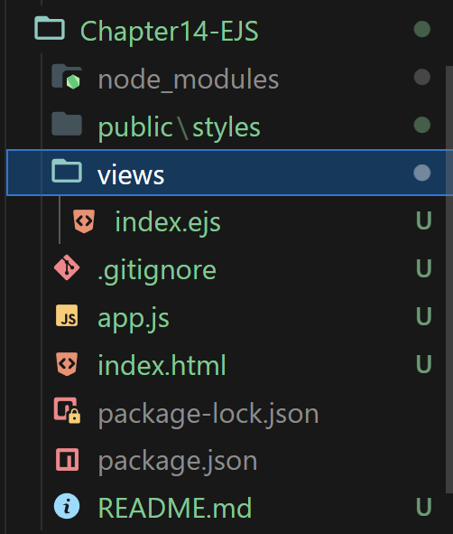

```js
const express = require("express");
const app = express();

// middleware
app.use(express.static("public"));
app.use(express.json());
app.use(express.urlencoded({ extended: true }));

app.get("/", (req, res) => {
  //   res.send("歡迎來到首頁");
  res.render("index.ejs");
});

app.get("*", (req, res) => {
  res.status(404).send("你所找的頁面不存在");
});
app.listen(3000, () => {
  console.log("正在聆聽port 3000中");
});
```

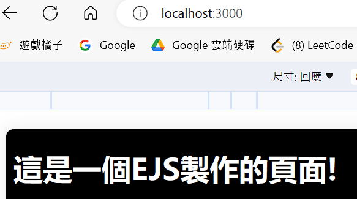

## 如果有設定，就不需要加上 .ejs💡

```js
app.set("view engine", "ejs");
```

```js
app.get("/", (req, res) => {
  //   res.send("歡迎來到首頁");
  res.render("index");
});
```

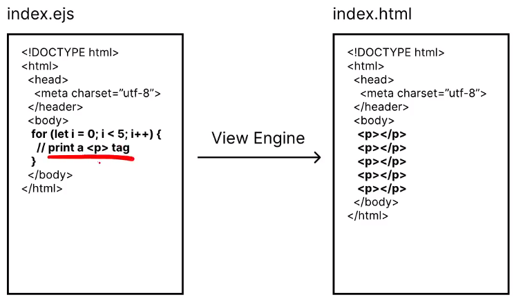

## EJS 實際使用在html的語法

```html
<body>
    <h1>這是一個EJS製作的頁面!<%= name %></h1>
  </body>
```

### 注意 物件的語法🔥🔥🔥🔥🔥

- 首先 let { name } = req.params  可以快速取得params.name 賦值🔥

```js
app.get("/:name", (req, res) => {
  //   res.send("歡迎來到首頁");
  let { name } = req.params;
  // k v 相同的狀況 可以直接寫 name就好🔥🔥
  res.render("index", { name });🔥🔥🔥
  console.log(req.params.name);
});
```

# (257) EJS 語法

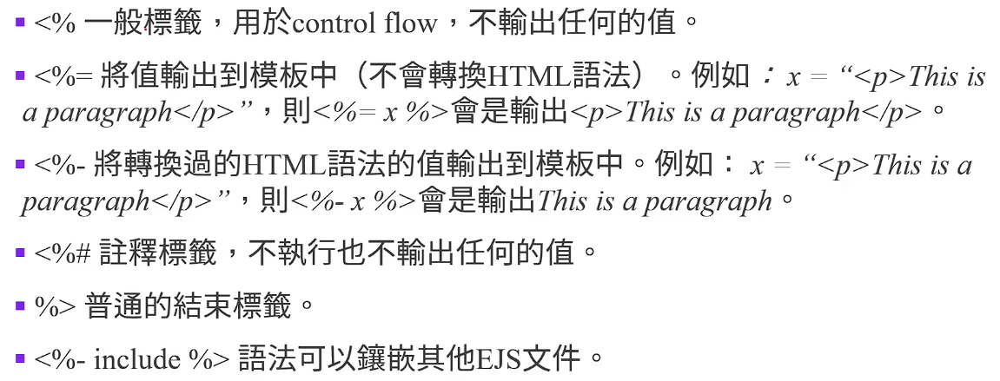

- 往下一點點就看得到 <%-的範例

## 直接看.ejs檔案比較快

```js
 <body>
    <%for(let i=0;i<10;i++){%>
    <h1>< % = i ;%></h1>
    <%}%>
  </body>
```

- 如果先給予變數 如同剛剛所用的param傳入render

### <%- 變數>

```js
app.get("/:name", (req, res) => {

  let name = "<p>oni world</p>";
  res.render("index", { name });
  console.log(req.params.name);
});
----------------------------------------------------

<body>
    <%for(let i=0;i<10;i++){%> 
      <%-name ;%> 
    <%}%>
  </body>
```

### 使用 %- 的話

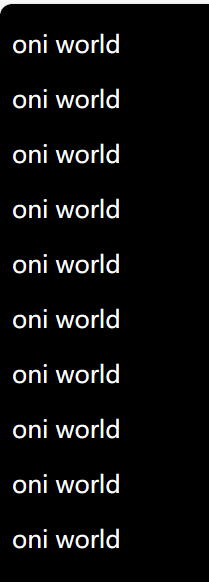

### 如果使用 %=

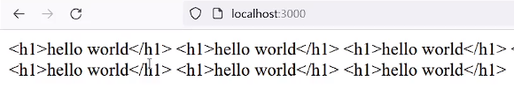

## 關於 涵蓋ejs進去別人裡面

### 通常會建立partials

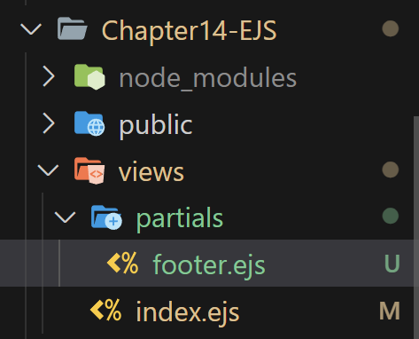

```js
<%-include("partials/footer")%>
  </body>
```

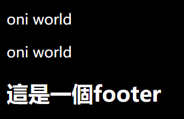

- 文件被當作html 所以使用 % -

# (258) EJS應用示範

## JavaScriptAdvanced-I 有用過該陣列

```js
const languagesRes = [
  { name: "Python", rating: 9.5, popularity: 9.7, trending: "super hot" },
  { name: "Java", rating: 9.4, popularity: 8.5, trending: "hot" },
  { name: "C++", rating: 9.2, popularity: 7.7, trending: "hot" },
  { name: "PHP", rating: 9.0, popularity: 5.7, trending: "decreasing" },
  { name: "JS", rating: 8.5, popularity: 8.7, trending: "hot" }
]
```

## 搭配表單 回傳收到的網頁

- index.ejs
  
  ```js
  <body>
      <form action="/example" method="GET">
        <label for="name">名稱: </label>
        <input type="text" id="name" name="name" />
        <label for="age">年齡: </label>
        <input type="number" name="age" id="age" />
        <button>送出表單</button>
      </form>
  </body>
  ```

- response.ejs
  
  ```js
  <body>
      <h1>資料已經蒐集成功</h1>
      <h3>以下是提交的資料內容</h3>
      <p>名稱為: <%=name%></p>
      <p>年齡為: <%=age%></p>
    </body>
  ```

- app.js
  
  ```js
    res.render("index");
  });
  app.get("/example", (req, res) => {
    let { name, age } = req.query;
    res.render("response", { name, age });
  });
  ```

- 成功畫面
  
  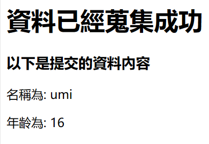

## 模擬資料庫取得的資料

- app.js
  
  ```js
  app.get("/", (req, res) => {
    const languagesRes = [
      { name: "Python", rating: 9.5, popularity: 9.7, trending: "super hot" },
      { name: "Java", rating: 9.4, popularity: 8.5, trending: "hot" },
      { name: "C++", rating: 9.2, popularity: 7.7, trending: "hot" },
      { name: "PHP", rating: 9.0, popularity: 5.7, trending: "decreasing" },
      { name: "JS", rating: 8.5, popularity: 8.7, trending: "hot" },
    ];
    res.render("index", { languagesRes });
  });
  ```

- index.ejs
  
  ```js
  <table>
    <tr>
      <th>名稱</th>
      <th>評價</th>
      <th>熱門程度</th>
      <th>流行度</th>
    </tr>
    <%languagesRes.forEach(lang=>{ %>
    <tr>
      <td><%=lang.name%></td>
      <td><%=lang.rating%></td>
      <td><%=lang.popularity%></td>
      <td><%=lang.trending%></td>
    </tr>
    <%})%>
  </table>
  ```

- 成果
  
  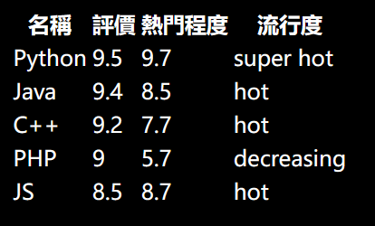

- #### 偷偷改scss ，請記得watch saas🍉
  
  ```scss
  body {
    background-color: black;
    color: white;
  }
  
  table,
  tr,
  th,
  td {
    border-collapse: collapse;
    border: 2px solid white;
    text-align: center;
  }
  
  th,
  td {
    padding: 0.25rem;
  }
  ```
  
  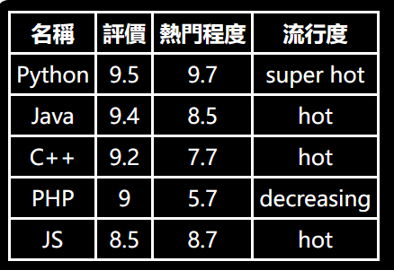

# (259) MVC 模式

## Model、View、Controller 的分工如下:

- 模型(Model)
  
  封裝與應用程式的邏輯相關的資料以及對資料的處理方法。 「 Model」有對資料直接存取的權力,例如對資料庫的存取。

- 視圖(View)
  
  將資料有目的的顯示出來。

- 控制器(Controller)
  
  用於控制應用程式的流程,處理事件並作出回應。「事件」包括使用者的行為和 Model 上的改變。

# 最終小考

## 做得很好！

routes的部分是屬於控制器(Controller ) ！

問題 4：

在MVC 模式的分工描述，以下何者錯誤？

- 模型(Model) – 封裝與應用程式的邏輯相關的資料以及對資料的處理方法。「 Model 」有對資料直接存取的權力，例如對資料庫的存取。

- 視圖(View) – 將資料有目的的顯示出來。

- 控制器(Controller ) – 用於控制應用程式的流程，處理事件並作出回應。「事件」包括使用者的行為和 Model 上的改變。

- 伺服器端程式碼中的routes部分，用來接收與回應HTTP request，所以可以歸類為view。
