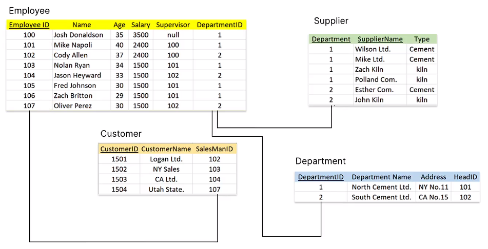
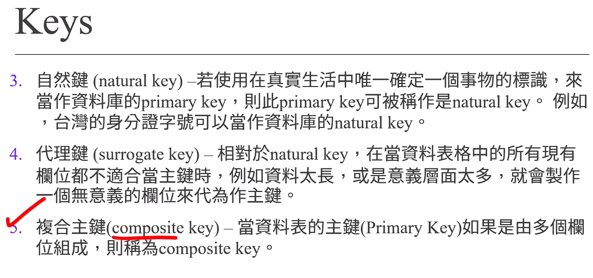
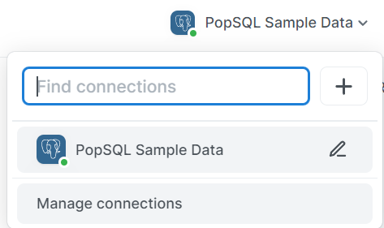
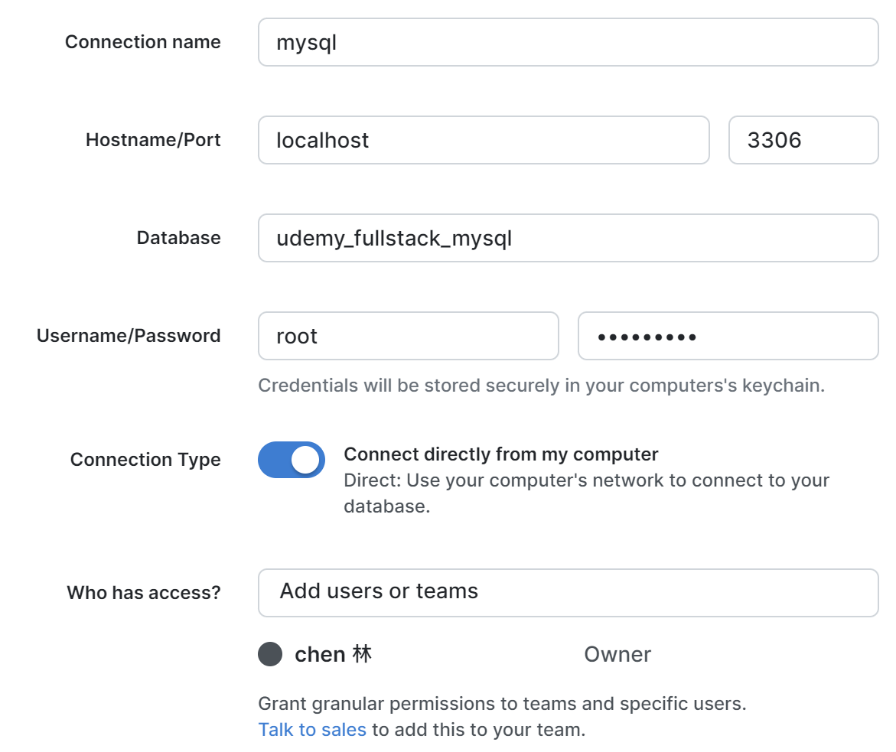
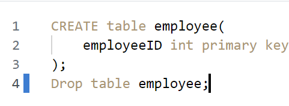
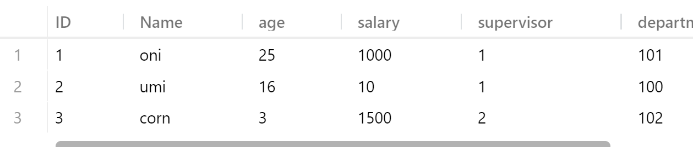
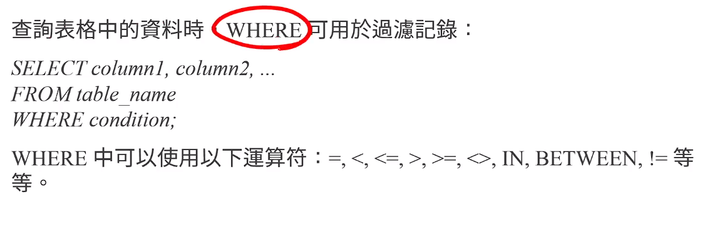
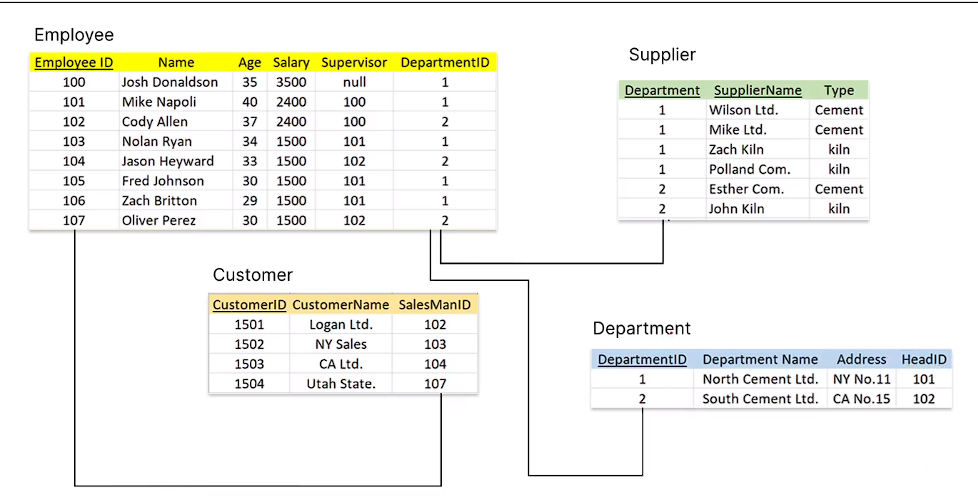
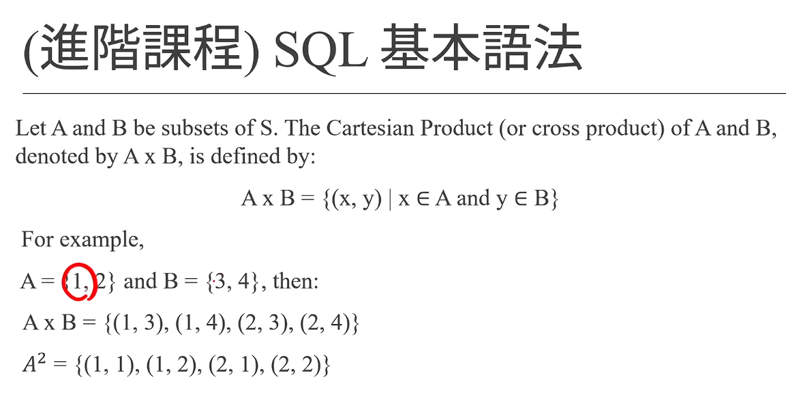
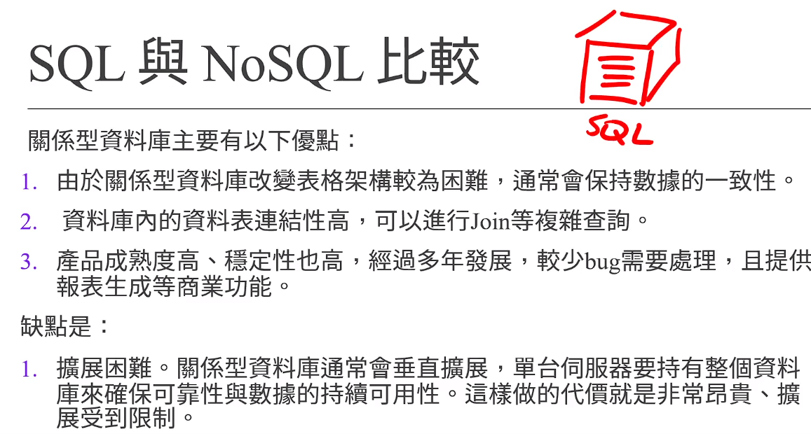

# 想說一下

> 這邊教的超級無敵淺，看一下兩種SQL NOSQL 的優缺點就好

如果想要學習，自己去找還比較有效!⭐⭐

## 看小考跟比較就好⭐⭐⭐

# (260) 資料庫管理系統 DBMS

分為 SQL 、NoSQL

# (261) 增刪查改 CRUD

- 存影片沒寫codeㄟ

- Create Read Update Delete

# (262) Keys

- primary key 

- foreign key

- 

- composite key





# (263) SQL

SQL= structured query language . 結構化查詢語言

# (264) SQL 下載 (Windows)

- Custom

- MySQL server

- Mysql Server 8.0

- 安裝好後

- 不用改設定，設定root password就好

- 就一直安裝吧

# (265) SQL Server下載 (MacOS)

# (266) PopSQL下載

> 去網路安裝理由自己編好後



管理連線、new connection

打開mysql command line client 去那邊新創一個DB

```sql
Enter password: *********
Welcome to the MySQL monitor.  Commands end with ; or \g.
Your MySQL connection id is 10
Server version: 8.0.34 MySQL Community Server - GPL

Copyright (c) 2000, 2023, Oracle and/or its affiliates.

Oracle is a registered trademark of Oracle Corporation and/or its
affiliates. Other names may be trademarks of their respective
owners.

Type 'help;' or '\h' for help. Type '\c' to clear the current input statement.

mysql> create database udemy_fullstack_mysql
    -> ^C
mysql> create database udemy_fullstack_mysql;
Query OK, 1 row affected (0.01 sec)

mysql>
```

- 要記得加上分號



- 藍色這邊代表只跑這一行SQL Command



# (267) SQL表格設定

| Data Types    | Bytes         | Description                                                              |
| ------------- | ------------- | ------------------------------------------------------------------------ |
| INT           | 4 bytes       | -2^31 ~ 2^31 − 1 ( -2147483648 ~ 2147483467)                             |
| DECIMAL(p, s) | 視精確度而定        | p代表total digits，s代表小數點後的digits。例如，153.23為例，p 是5，s是2。資料範圍是10^38+1~10^38-1 |
| VARCHAR(n)    | 變動長度, max=2GB | 資料範圍是1~2^31−1                                                            |
| DATETIME      | 8 bytes       | 1753/1/1 ~ 9999/12/31 ex: 2008-11-27 08:08:08.888                        |

[MySQL 的 varchar 水真的太深了，你真的會用嗎？ - 閱坊 (readfog.com)](https://www.readfog.com/a/1659085630560374784) 

## 上面這個網址可以深入知道varchar

```sql
CREATE TABLE employees(
    ID int primary key,
    Name varchar(30),
    age int,
    salary int DEFAULT 1500,
    supervisor int,
    department int
);
```

# (268) 增加資料

```sql
CREATE TABLE employees(
    ID int primary key auto_increment ,
    Name varchar(30),
    age int,
    salary int DEFAULT 1500,
    supervisor int,
    department int
);

describe employees;
-- drop table employees;
insert into employees values(
    1,
    "oni",
    25,
    1000,
    1,
    101
);
select * from employees;

insert into employees (id,name,age,salary,supervisor,department)
values(
    2,"umi",16,10,1,100
);
insert into employees (name,age,supervisor,department)
values(
    "corn",3,2,102
)
```



- 他會自動增加，明明我沒有手動給予id，他會根據上一個自己增加

# (269) 刪除、查詢、修改資料

```sql
update employees
set id=107
where id=108;

-- 薪水太少的就會被增加
update employees
set salary = 1800
where salary<1800;
-- where 一定要寫，否則無條件大家變成1800
```



```sql
CREATE TABLE employees(
    ID int primary key auto_increment ,
    Name varchar(30),
    age int,
    salary int DEFAULT 1500,
    supervisor int,
    department int
);

describe employees;


TRUNCATE employees;
select * from employees;


INSERT INTO employees VALUES(100, "Josh Donaldson", 35, 3500, null, 1);
INSERT INTO employees(id, name,age, salary, supervisor, department)
VALUES(101,"Mike Napoli", 40, 2400, 100, 1);
INSERT INTO employees VALUES(102, "Cody Allen", 37, 2400, 100, 2);
INSERT INTO employees VALUES(103, "Nolan Ryan", 34, 1500, 101, 1);
INSERT INTO employees VALUES(104, "Jason Heyward", 33, 1500, 102, 2);
INSERT INTO employees VALUES(105, "Fred Johnson", 30, 1500, 101, 1);
INSERT INTO employees VALUES(106, "Zach Britton", 29, 1500, 101, 1);
INSERT INTO employees VALUES(108, "Oliver Perez", 30, 1500, 102, 2);

update employees
set id=107
where id=108;

-- 薪水太少的就會被增加
update employees
set salary = 1800
where salary<1800;
-- where 一定要寫，否則無條件大家變成1800⚠️

-- 刪除資料
delete from employees
where id=107;
select * from employees;
-- 如果沒有使用where 會刪除所有資料徒留表格

-- 查詢資料
select id,age,name from employees;


-- 查詢、配合Order by
select * from employees
order by age;

-- 查詢、配合where
select * from employees
where department =1
order by age desc ;


-- 查詢 
select * from employees
where department =1 and salary>2000;
```

## 注意 where 一定要記得加上去⚠️

- 否則 =>  全刪除 或者全部更改為同數值

# (270) Join 表格



...

## sql

```sql

```

## 笛卡爾積




- 所以如果沒有指定條件，會得到所有可能組合。

# (271) SQL 與 NoSQL 比較



## SQL 優缺點

### 優點

數據一致性

資料表做複雜查詢

穩定

### 缺點

NoSQL 通常只要增加多台主機就好不用擔心關聯限制，但SQL不能這樣，因為要確保可靠性。

成本高 授權貴

讀寫慢 ，數據太大 會很複雜

因為 MySQL use both B-Tree ,B+Tree, 可以自我平衡資料

HASH indexes 

還可能有死鎖的問題，所以下滑嚴重

## NoSQL

### 優點

1. 可擴展性、可分散

2. 快速讀寫 主要例子有Redis 只在RAM操作 使性能非常出色，每秒10萬次讀寫
   
   如果資料在RAM 增刪查改都是O1的時間複雜度 不受資料數量影響

3. 成本低廉 主要都是開源

### 缺點

1. 不支持SQL 所以有遷移成本跟學習成本

2. 支持特性不夠豐富 例如自動生成報表

3. 不夠成熟

# 小考試


一筆資料只能有一個主鍵(但可以由兩個以上的行組成primary key)。這種情況就稱為composite key!

## 問題 2：關於DBMS當中的keys，以下何者錯誤？

- 主鍵 (英語：primary key) – 是資料庫表中對儲存資料物件予以唯一和完整標識的資料列或屬性的鍵。

- 一個表格內最多只能用一個欄位可以當作primary key。

- 外鍵 (Foreign Key) – 是指向其他表格的主鍵的欄位，用於確定兩張表格的關聯性。

- 代理鍵 (surrogate key) – 相對於natural key，在當資料表格中的所有現有欄位都不適合當主鍵時，例如資料太長，或是意義層面太多，就會製作一個無意義的欄位來代為作主鍵。


## 問題 3：若使用用戶的身分證字號當作primary key，則這個primary key又可以稱為？

- 自然鍵 (natural key) >>>>>>>>>>>>>>>>>>>>>>>

- 代理鍵 (surrogate key)

- 複合主鍵(composite key)

- 外鍵 (Foreign Key)
