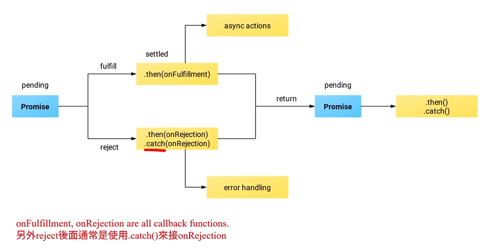

# (272) Ajax

總之就是可以更新網頁特定區塊內容的技術

而不用重新載入全部。

# (273) 同步與異步


- window.setTimeout就是異步
  
  ```js
  console.log("開始執行");
  setTimeout(() => {
    console.log("兩秒號才會出現");
  }, 2000);
  console.log("結束");
  ```

- 

產生質數的function如果運作的時候

textArea就癱瘓無法運作了

# (274) Promise物件⚠️

JS的異步基礎，由asynchronous function  ，return的物件。

Promise (pending) 還沒有結果

- 成功變成 success

- 失敗變成 rejected

## 三種狀態

### pending

- 擱置，初始狀態

### fulfilled⚠️

- 操作成功

- 如果🔥遇到404的情況🔥，fetch()的promise並不會出現rejected狀態，🔥而是會變成fulfilled狀態🔥。但我們可以用使用Response Object的屬性status或ok來確定我們得到的Response是200 OK還是404 Not Found。

### rejected

- 失敗了



## JAVA有stream概念...JS?s

當你使用 JavaScript 在瀏覽器環境中進行資料操作時，沒有直接對應於 Java 中的 `InputStream` 或流的概念。JavaScript 在處理數據時通常使用異步操作，例如使用 `fetch` API 或 `XMLHttpRequest` 來進行網絡請求。

對於網絡請求，在使用 `fetch` API 獲取響應後，一旦調用了 `response.json()` 或 `response.text()` 等方法讀取了響應體內容，就無法再次讀取，因為流式數據的特性是一次性的。

在 JavaScript 中，如果在使用 `fetch` 或類似的請求方法時，先讀取了響應體，在後續的操作中可能無法再次獲取到原始的響應數據。這種情況下，如果需要在多個地方使用響應體數據，可以將其保存在變量中，或者根據需求將數據複製到不同的變量中，以便後續多次使用。

在前端開發中，沒有像 Java Servlet 過濾器那樣的專門機制來處理請求，但可能會使用拦截器（interceptors）或類似的方法來攔截和處理網絡請求。

在 JavaScript 的瀏覽器環境中，處理請求體或響應數據時，需要根據異步操作的特性和限制，合理設計和處理數據的讀取和傳遞，確保數據在需要時能夠正確地使用。

# (275) Response.json() 與fetch()補充🔥

## fetch的response物件

- 只能看到header相關資訊 status

- 無法看到message section 需要用.json()轉後才能使用

## 遵守streaming 概念🔥

- 節省資源 部會立刻加載

- 判斷真的需要的時候才會加載

# (276) Catching Errors

```js
fetchPromise
  .then((response) => response.json())
  .then((data) => {
    console.log(data);
  })
  .catch((e) => {
    console.log(e);
    console.log(fetchPromise);
  });
```

# (277) Combining Multiple Promises

Promise.all()  也會返回一個promise !

## Promise.all()

- 使好幾個異步，都成功後 再返回
  
  ```js
  const fetchPromise1 = fetch(
    "https://mdn.github.io/learning-area/javascript/apis/fetching-data/can-store/products.json"
  );
  const fetchPromise2 = fetch(
    "https://mdn.github.io/learning-area/javascript/apis/fetching-data/can-store/not-found"
  );
  const fetchPromise3 = fetch(
    "https://mdn.github.io/learning-area/javascript/oojs/json/superheroes.json"
  );
  
  Promise.all([fetchPromise1, fetchPromise2, fetchPromise3]).then((responses) => {
    responses.forEach((response) => {
      console.log(response.url, response.status);
    });
  });
  ```


### catch in .all

```js
Promise.all([fetchPromise1, fetchPromise2, fetchPromise3])
  .then((responses) => {
    responses.forEach((response) => {
      console.log(response.url, response.status);
    });
  })
  .catch((e) => {
    console.log(e);
  });
```

- 只要有人出錯就會報錯

## Promise.any()

### catch in .any

```js
Promise.any([,,,]).then
.catch
```

- 如果所有都被拒絕 才會執行.catch()

- 任何一個fulfilled 就執行.then

- 最先成功的才會被執行喔


# (278) Async and Await⚠️

## 參考網址

[Async function / Await 深度介紹 | 卡斯伯 Blog - 前端，沒有極限 (casper.tw)](https://www.casper.tw/development/2020/10/16/async-await/) 

[7 張圖，20 分鐘搞定 async-await 原理！別拖了！ - 閱坊 (readfog.com)](https://www.readfog.com/a/1657828796603142144)  

## 特殊規則return 會變成下個fn參數⚠️

- 如果aysnc function中 return ，都不會影響function回傳promise物件，這個return的內容會自動變成回傳的promise物件的參數!
  
  - ⚠️⚠️⚠️⚠️⚠️
  
  ```js
  async function myFunction(){
      return 10;
  }
  let promise=myFunction();  //得到Promise物件
  promise.then(data=>{
      console.log(data); //自動帶入參數10
  })
  -----
  10
  ```

## await

```js
/*****透過await得到就是完整Response物件而非Promise物件********/
async function fetchProduct() {
  const response = await fetch(
    "https://mdn.github.io/learning-area/javascript/apis/fetching-data/can-store/products.json"
  );
  console.log(response);
}
fetchProduct();
```

### 搭配JSON

```js
/*****搭配JSON()******/
async function fetchProduct() {
  try {
    const response = await fetch(
      "https://mdn.github.io/learning-area/javascript/apis/fetching-data/can-store/products.json"
    );
    const data = await response.json();
    console.log(data);
  } catch (e) {
    // 手動抓出錯誤 而不是依賴Promise chain.catch
    console.log(e);
  }
}
fetchProduct();
```

- 這邊有點不清楚 ， await。

## 補充⚠️

> GPT 解釋

```js
function request() {
  return new Promise((resolve, reject) => {
    // 模拟异步操作，比如向服务器发送请求
    setTimeout(() => {
      // 假设遇到了一个错误情况
      const error = new Error("Operation failed");
      reject(error); // 使用 reject 拒绝 Promise，并传递错误对象
    }, 1000);
  });
}

// 使用 Promise
request()
  .then((result) => {
    // 如果操作成功，这里的代码将不会执行，因为 Promise 被拒绝了
    console.log(result);
  })
  .catch((error) => {
    // 捕获 Promise 的拒绝状态，并处理错误
    console.error("Error:", error.message); // 输出错误信息
  });
```

> 應用

```js
//  以下為google後增加的內容補充
function request(num) {
  // 模擬接口請求
  return new Promise((resolve) => {
    // 該承諾執行此匿名函數
    // 成功的時候會調用resolve
    // 失敗調用reject 但這邊沒寫、暫時沒關係先忽略
    setTimeout(() => {
      resolve(num * 2); // 如果成功執行完畢後 回傳結果 到下面res1的參數位置
    }, 1000);
  });
}
// 這邊的1跟2 是 數字而不是時間
// 帶入 30 顯示 60 ，一樣2秒就看得到
// 秒數是因為前者執行要等待 1秒 ，自己也要1秒
request(1).then((res1) => {
  console.log(res1); // 1秒後 輸出 2

  request(2).then((res2) => {
    console.log(res2); // 2秒後 輸出 4
  });
});
async function fn() {
  const res1 = await request(5); //花費1秒  res1=10
  const res2 = await request(res1); //花費1秒
  console.log(res2); // 2秒後輸出 20
}
fn();
console.log("看看我有沒有先印出來，後面才是數字");
```

> 看看我有沒有先印出來，後面才是數字
> 2
> 4
> 20

# (279) Node.js Event Loop


## 按造該圖loop⭐⭐⭐


## Event Loop級別

### 優先級別

#### nextTick queue

> 優先程度最高的

process.nextTick(callbackFn) 的 callbackFn都會被放入這個Queue內部

#### microTask queue

> 第二高

promise object狀態由pending轉變為fulfilled或者rejected時

.then(callbackFn)或者 .catch(callbackFn)所執行的callbackFn

會被排在這個queue。

### 普通級別

#### macrotask queue (task queue)

又細分

##### 1. timers

- 當setTimeout(callbackFn)跟setInterval(callbackFn)所設定的時間倒數完畢時，callbackFn會被放到這裡等待執行

##### 2. pending callbacks

- 給作業系統使用的queue 例如socket連線的錯誤，或者傳輸控制協定層出現的錯誤，相關的callbackFn會被放到這

##### 3. Idle,prepare

- Node.js 內部所使用的queue 可略過。

##### 4. polling

- I/O 有 callback function時 使用的queue。

- 例如 .on('data',callbackFn) 這邊的callbackFn就會放入polling。

##### 5. check

- 給setImmediate()的callback funtcion使用的queue。

##### 6. close callbacks

- socket或者檔案被關閉或者突然中斷連線 ，使用的關閉動作callback 會放到這邊。

## 運行程式碼的順序

1. 先掃描整份程式碼，如果遇到同步函數 就馬上執行。

2. 若遇到異步函式，則將callback function分配到各自歸屬的queue內部。例如，setImmediate()的callback function就會被放到Check。

3. 當整份程式碼完成掃描後,Node.js會重複event loop。
   
   只要queue還有callback尚未被觸發，Node.js就會一直循環，不斷循環下去。
   
   例如，setTimeout()有callback unction，但需要幾秒後才觸發，那這之間的時間 event loop就會不斷循環。
   
   當然，這中間的幾秒也有可能有其他的callback functions被放入queue。

4. 循環至某個queue時，發現callback可以被執行了，就把queue內部的 callback依照先進先出的原則處理。
   
   如果在循環的過程中，若nextTick Queue有函式可以執行，則優先將
   
   nextTick Queue清空。
   
   microtask Queue也是同樣操作，若microtask Queue 當中有函式可以執行，則優先將 microtask Queue 清空。

## code

```js
console.log("start"); //sync 同步 所以先執行了

process.nextTick(function () {
  // 優先層級最高的queue
  console.log("nextTick1");
});

setTimeout(function () {
  // 普通層級
  console.log("setTimeout");
}, 0);

// 14本身是synchronous 同步。
new Promise(function (resolve, reject) {
  console.log("promise");
  resolve("resolve");
}).then(function (result) {
  console.log("promise then");
});

// IIFE async
(async function () {
  console.log("async");
})();

setImmediate(function () {
  console.log("setImmediate");
});

process.nextTick(function () {
  console.log("nextTick2");
});

console.log("end");
```

### 預測結果順序

start ( 同步所以出現 )

- nextTick1   ( 最優先queue )

- setTimeout()  ( 普通層級 )

new Promise 新增物件是同步 並且帶入callbackfn位置的函數會被立刻執行，他的resolve 要等.then (microQueue第二優先queue)

- async 使用IIFE 所執行，先排入普通吧?

- setImmediate( ) 普通級別 

- nextTick2  ( 最優先的二號 )

end ( 同步所以出現) 

> 目前有
> 
> start
> 
> promise
> 
> async
> 
> end

> 後續出現
> 
> nextTick1 ( 最優先queue )
> 
> nextTick2 ( 最優先的二號 )
> 
> resolve 要等.then (microQueue第二優先queue)
> 
> setTimeout() ( 普通層級 )
> 
> setImmediate( ) 普通級別


# (280)(進階課程) Race Condition


訪問critical region 要先上鎖 避免其他人訪問


.Lock 也稱作 mutex mutual exclusion lock 。

Mutex另一個名字是 binary semaphore。

## 下面是範例

### 有時100大多數只得到50

```js

async function loadBalance() {
  await randomDelay(); //等時間到達 0~0.1s
  return balance;
}
async function saveBalance(value) {
  await randomDelay();
  balance = value;
}

async function sellGrapes() {
  const balance = await loadBalance();
  console.log(`賣葡萄前，帳戶${balance}`);
  const newBalance = balance + 50;
  await saveBalance(newBalance);
  console.log(`賣葡萄後，帳戶${newBalance}`);
}
async function sellOlives() {
  const balance = await loadBalance();
  console.log(`賣橄欖前，帳戶${balance}`);
  const newBalance = balance + 50;
  await saveBalance(newBalance);
  console.log(`賣橄欖後，帳戶${newBalance}`);
}

/** 由於讀取錢跟存錢都要花時間 所以互相會對同一個變數產生錯誤 */
// 持有舊訊息、並且以此為依據更改 所以出錯。
// 時間差 常常交錯而過 導致錯誤
async function main() {
  await Promise.all([sellGrapes(), sellOlives()]);
  const balance = await loadBalance();
  console.log(`兩者都賣光後金額為${balance}`);
}
main();

```

### 改進如下


- mutex直接生成的時候就是fulfilled的 promise物件所以直接往下


```js
/******下面透過MUTEX 解決race condition  */

let mutex = Promise.resolve(); //return fulfilled promise
async function loadBalance() {
  await randomDelay(); //等時間到達 0~0.1s
  return balance;
}
async function saveBalance(value) {
  await randomDelay();
  balance = value;
}

async function sellGrapes() {
  mutex = mutex.then(async () => {
    const balance = await loadBalance();
    console.log(`賣葡萄前，帳戶${balance}`);
    const newBalance = balance + 50;
    await saveBalance(newBalance);
    console.log(`賣葡萄後，帳戶${newBalance}`);
  });
  // return的東西會變成後續.then的參數
  return mutex;
}
async function sellOlives() {
  mutex = mutex.then(async () => {
    const balance = await loadBalance();
    console.log(`賣橄欖前，帳戶${balance}`);
    const newBalance = balance + 50;
    await saveBalance(newBalance);
    console.log(`賣橄欖後，帳戶${newBalance}`);
  });
  return mutex;
}

/** 由於讀取錢跟存錢都要花時間 所以互相會對同一個變數產生錯誤 */
// 持有舊訊息、並且以此為依據更改 所以出錯。
// 時間差 常常交錯而過 導致錯誤
async function main() {
  // 下面會同時啟用 賣葡萄跟賣水果，如果他們有順序地賣就不會出事
  await Promise.all([sellGrapes(), sellOlives()]);
  const balance = await loadBalance();
  console.log(`兩者都賣光後金額為${balance}`);
}
main();
```

## 心得:

git commit -m "Ch16 section - 280 實際使用
例子、更深刻了解promise物件的resolve如果執行才會讓.then接收到訊號，另外mutex則
是透過把物件(鎖)分散到函數中，讓函數執行的時候受限於這個物件，乖乖排隊"

# (281) (進階課程) Mutex製作原因


總而言之就是 

1. 不想要確定 方法的執行順序

2. 不希望因方法前面+ await而阻塞後面

# (282) Promise Based API

# (283) 連接到外部API
