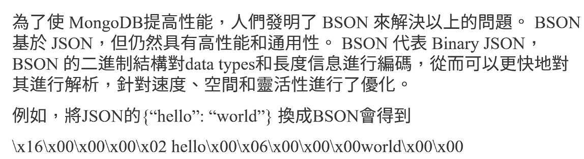
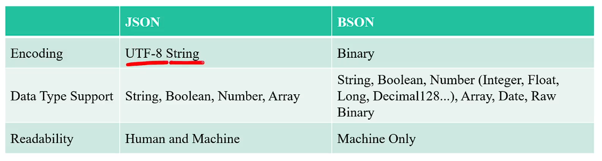
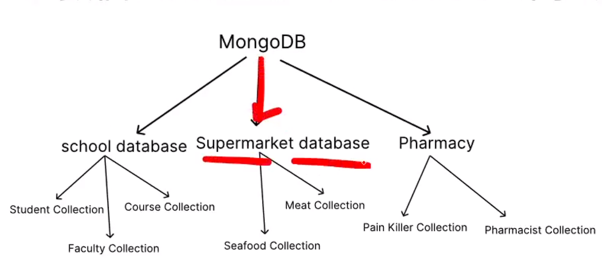

# (284) (Windows) 安裝MongoDB與Mongo Shell

## 記得安裝shell

# (285) (macOS) 安裝mongoDB與mongo shell

# (286) Quick Fix

## 更正

這裡更正一下，下支影片中的投影片內，JSON物件的key對應到的value中，是沒有function的！JSON key-value pair能夠對應的值中，

全部只有：Number, String, Object, Array, Boolean, null。

# (287) JSON and BSON

## JSON 由js創造者定義為js的一部份

JavaScript Objection Notation

1. 純文字 解析慢

2. 高可讀性無法節省空間、

3. 有限數量的data type

## BSON儲存資料

mongodb的提高性能的方式

BSON = Binary JSON



## 差別



|                   | JSON                        | BSON                                                                                  |
| ----------------- | --------------------------- | ------------------------------------------------------------------------------------- |
| Encoding          | UTF-8 String                | Binary                                                                                |
| Data Type Supoprt | String,Boolean,Number,Array | String,Boolean,Number<br>(Integer,Float,Long,Decimall128..)<br>,Array,Date,Raw Binary |
| Readability       | Human and Machine           | Machine only                                                                          |

# (288) mongos

# h 與數據新增

MongoDB shell 功能齊全，JS和Node.js的REPL環境

REPL=Read Evaluate Print Loop 

```mongodb
test> db.version()
7.0.1
test> 1*5
5
test>
```

## databases為資料庫

內含collections

## collections對應表格



## 常用指令

### 1. show dbs 顯示所有資料庫

```mongodb
test> db.version()
7.0.1
test> 1*5
5
test> show dbs
admin    40.00 KiB
config   60.00 KiB
local   104.00 KiB
```

### 2. db 展示目前所在的資料庫

```mongodb
test> db
test
```

### 3. use db 使用資料庫 若無則創建

```mongodb
test> use exampleDB
switched to db exampleDB
exampleDB
```

### 4. show collections

```mongodb
exampleDB> show collections

exampleDB>
```

沒東西

## 新增資料指令

document基本上就是資料塊，

### 1. db.collection.insertOne(<document>)

使用 db.students.insertOne

```mongodb
exampleDB> db.students.insertOne(
{name:"Umi",age:16,major:"ComputerScience",
    scholarship:{merit:3000,other:1500}
})
------------------------------
{
  acknowledged: true,
  insertedId: ObjectId('659680a040755e95391dfbc9')
}
exampleDB>
```

merit 表示應得獎學金，other表示其他來源獎學金

> 他自動新增 primary key ID

### 2. db.students.find()

查找

```mongodb
exampleDB> db.students.find()
[
  {
    _id: ObjectId('659680a040755e95391dfbc9'),
    name: 'Umi',
    age: 16,
    major: 'ComputerScience',
    scholarship: { merit: 3000, other: 1500 }
  }
]
exampleDB>
```

### 3.db.students.insertMany([<document>,<document>...])

```mongodb
db.students.insertMany([
  { name: "Umi", age: 16, major: "ComputerScience", scholarship: { merit: 3000, other: 1500 } },
  { name: "Kai", age: 18, major: "Engineering", scholarship: { merit: 2500, other: 1200 } },
  { name: "Ryo", age: 17, major: "Mathematics", scholarship: { merit: 2800, other: 1300 } }
]);
```

```mongodb
exampleDB> db.students.find()
[
  {
    _id: ObjectId('659680a040755e95391dfbc9'),
    name: 'Umi',
    age: 16,
    major: 'ComputerScience',
    scholarship: { merit: 3000, other: 1500 }
  },
  {
    _id: ObjectId('6596822d40755e95391dfbca'),
    name: 'Umi',
    age: 16,
    major: 'ComputerScience',
    scholarship: { merit: 3000, other: 1500 }
  },
  {
    _id: ObjectId('6596822d40755e95391dfbcb'),
    name: 'Kai',
    age: 18,
    major: 'Engineering',
    scholarship: { merit: 2500, other: 1200 }
  },
  {
    _id: ObjectId('6596822d40755e95391dfbcc'),
    name: 'Ryo',
    age: 17,
    major: 'Mathema',
    scholarship: { merit: 2800, other: 1300 }
  }
]
```

### 4.db.collection.insert(<document or array of documents>)

新版本比較推薦用One或者Many 比較好

# (289) 數據查詢

> [Query Documents — MongoDB Manual](https://www.mongodb.com/docs/manual/tutorial/query-documents/#specify-and-as-well-as-or-conditions) 

## 透過物件屬性查找

```mongodb
exampleDB> db.students.find({name:"Umi"})
[
  {
    _id: ObjectId('659680a040755e95391dfbc9'),
    name: 'Umi',
    age: 16,
    major: 'ComputerScience',
    scholarship: { merit: 3000, other: 1500 }
  },
  {
    _id: ObjectId('6596822d40755e95391dfbca'),
    name: 'Umi',
    age: 16,
    major: 'ComputerScience',
    scholarship: { merit: 3000, other: 1500 }
  }
]
```

## comparision query Operator

### $lt

lt        = less than  

gte     = greater than 

```mongodb
exampleDB> db.students.find(
    {"scholarship.merit":{$lt: 3000}}
)
--------------------------
[
  {
    _id: ObjectId('6596822d40755e95391dfbcb'),
    name: 'Kai',
    age: 18,
    major: 'Engineering',
    scholarship: { merit: 2500, other: 1200 }
  },
  {
    _id: ObjectId('6596822d40755e95391dfbcc'),
    name: 'Ryo',
    age: 17,
    major: 'Mathema',
    scholarship: { merit: 2800, other: 1300 }
  }
]
```

# (290) 修改與刪除數據

## db.collection.updateOne(\<filter>,\<update>)

修改第一個找到的對象

```mongodb
exampleDB> db.students.updateOne({name:"Umi"},{$set:{name:"UmiChan",age:16.5}});
{
  acknowledged: true,
  insertedId: null,
  matchedCount: 1,
  modifiedCount: 1,
  upsertedCount: 0
}
exampleDB> db.students.find()
[
  {
    _id: ObjectId('659680a040755e95391dfbc9'),
    name: 'UmiChan',
    age: 16.5,
    major: 'ComputerScience',
    scholarship: { merit: 3000, other: 1500 }
  },
  {
    _id: ObjectId('6596822d40755e95391dfbca'),
    name: 'Umi',
    age: 16,
    major: 'ComputerScience',
    scholarship: { merit: 3000, other: 1500 }
  },
  {
    _id: ObjectId('6596822d40755e95391dfbcb'),
    name: 'Kai',
    age: 18,
    major: 'Engineering',
    scholarship: { merit: 2500, other: 1200 }
  },
  {
    _id: ObjectId('6596822d40755e95391dfbcc'),
    name: 'Ryo',
    age: 17,
    major: 'Mathema',
    scholarship: { merit: 2800, other: 1300 }
  }
]
```

### 最後修改的時間

db.students.updateOne({name:"Umi"},

{

    set:{age:17},

    currentDate:{lastModified:true}

});

```mongodb
exampleDB> db.students.updateOne({name:"Umi"},{$set:{age:17},$currentDate:{lastModified:true}})
{
  acknowledged: true,
  insertedId: null,
  matchedCount: 1,
  modifiedCount: 1,
  upsertedCount: 0
}
exampleDB> db.students.find()
[
  {
    _id: ObjectId('659680a040755e95391dfbc9'),
    name: 'UmiChan',
    age: 16.5,
    major: 'ComputerScience',
    scholarship: { merit: 3000, other: 1500 }
  },
  {
    _id: ObjectId('6596822d40755e95391dfbca'),
    name: 'Umi',
    age: 17,
    major: 'ComputerScience',
    scholarship: { merit: 3000, other: 1500 },
    lastModified: ISODate('2024-01-04T14:11:14.095Z')
  },
  {
    _id: ObjectId('6596822d40755e95391dfbcb'),
    name: 'Kai',
    age: 18,
    major: 'Engineering',
    scholarship: { merit: 2500, other: 1200 }
  },
  {
    _id: ObjectId('6596822d40755e95391dfbcc'),
    name: 'Ryo',
    age: 17,
    major: 'Mathema',
    scholarship: { merit: 2800, other: 1300 }
  }
]
```

## db.collection.updateAll()

```mongodb
exampleDB> db.students.updateMany({age:17},{$set:{age:16}})
{
  acknowledged: true,
  insertedId: null,
  matchedCount: 2,
  modifiedCount: 2,
  upsertedCount: 0
}
exampleDB> db.students.find()
[
  {
    _id: ObjectId('659680a040755e95391dfbc9'),
    name: 'UmiChan',
    age: 16.5,
    major: 'ComputerScience',
    scholarship: { merit: 3000, other: 1500 }
  },
  {
    _id: ObjectId('6596822d40755e95391dfbca'),
    name: 'Umi',
    age: 16,
    major: 'ComputerScience',
    scholarship: { merit: 3000, other: 1500 },
    lastModified: ISODate('2024-01-04T14:11:14.095Z')
  },
  {
    _id: ObjectId('6596822d40755e95391dfbcb'),
    name: 'Kai',
    age: 18,
    major: 'Engineering',
    scholarship: { merit: 2500, other: 1200 }
  },
  {
    _id: ObjectId('6596822d40755e95391dfbcc'),
    name: 'Ryo',
    age: 16,
    major: 'Mathema',
    scholarship: { merit: 2800, other: 1300 }
  }
]
```

## db.collection.deleteOne()

## db.collection.deleteMany()
