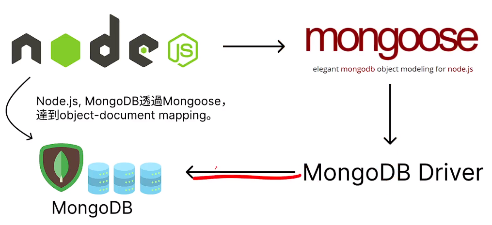
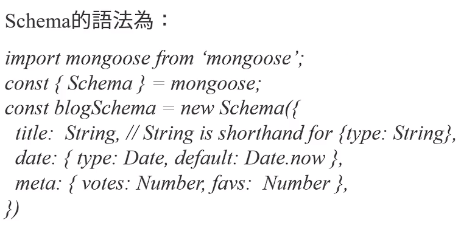
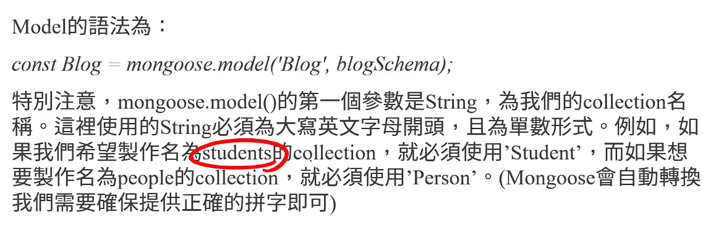
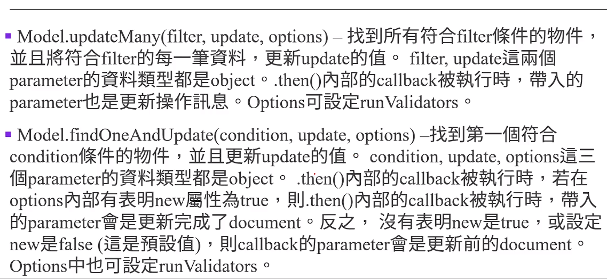
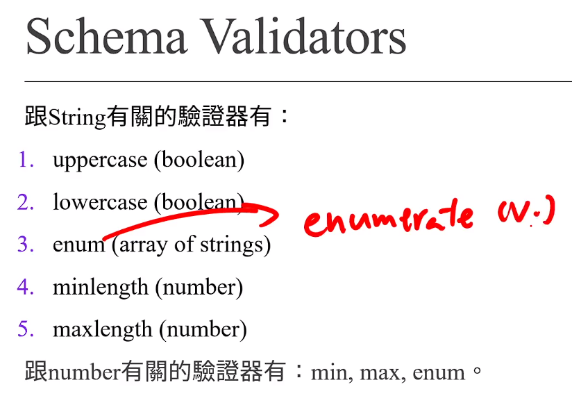
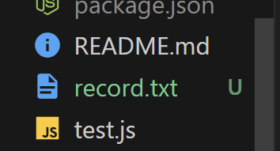
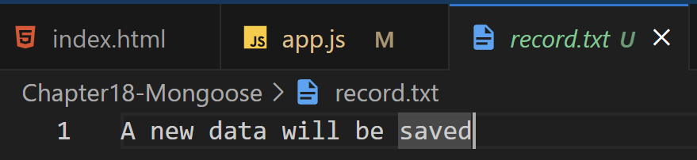

# (291) 特別注意！！版本差異要怎麼處理？

同學們，往後的多個課程中，我們會透過 npm 安裝多個套件。錄影當下版本與你觀看影片時的最新版本會有差別，因此，為了確保你在操作上可以完全跟著影片實作，我建議你可以：

1. 每個單元最後都會有 Final Code。下載Final Code後，找到 package.json 文件，**放到自己的專案資料夾內，在 command line prompt 或 terminal 執行**`**npm install**`**指令，就可以自動下載所有正確版本的dependencies**。這是最容易也是我最推薦的方式。

2. 你也可以根據影片中看到的套件版本，直接使用 `npm install <package>@<version>`這樣的指令來下載與影片相同版本的套件。<package> 的部分要改成套件名稱，<version> 的部分要改成版本數字。

3. 如果你想要使用全部都是最新的套件的話，你也可以選擇自己閱讀documentation，選擇自學最新版本的寫法。這樣也是可以的。如果 Documentation 都是英文看不懂的話，也可善用 Google 或是 DeepL 翻譯功能。

# (292) Mongoose介紹

## ODM (object document mapping)

## ODM好處:

1. 資料結構能被追蹤、通常的話若結構改變 很難退回，但ODM可以把結構寫在程式碼內，方便追蹤、更改。

2. ORM/ODM 會內建保護機制 防止SQL Injection

3. 讓Project更符合 MVC模型，View=EJS Controller=app.js Model=Mongoose



# (293) 遇到MongooseServerSelectionError: connect ECONNREFUSED ::1:27017怎麼辦？

下支影片中，如果遇到MongooseServerSelectionError: connect ECONNREFUSED ::1:27017的錯誤的話，將程式碼中的localhost的部分改成：

.connect("mongodb://127.0.0.1/exampleDB")

這樣的形式就可以了。localhost這個字在電腦內的DNS會被轉換成127.0.0.1，所以一般的情況來說，都是可以轉換的。會發生上面的錯誤是因為，電腦的編碼無法將localhost轉換成127.0.0.1，所以才會發生寫localhost但卻無法連線的情況。(但本質上來說，localhost與127.0.0.1是一樣的)

# (294) Mongoose套件下載

## 我有寫Readme.md

```js
# 自己安裝

記得先初始化
PS C:\CodeSForGit\2023WebFullStack\Chapter18-Mongoose> npm init

npm install ejs@3.1.8
npm install express@4.18.2
npm install mongoose@6.6.5
```

> npmjs  去找到 mongoose

```js
const express = require("express");
const app = express();
const mongoose = require("mongoose");

// 會回傳成功或失敗 (promise)
mongoose
  .connect("mongodb://127.0.0.1:27017/exampleDB")
  .then(() => {
    console.log("mongodb連接成功");
  })
  .catch((e) => {
    console.log("連線失敗", e);
  });

app.set("view engine", "ejs");
app.listen(3000, () => {
  console.log("正在聽port 3000");
});
```

# (295) Model and Schema

## Schema

映射到 mongodb的 collection 並且定義架構

包含 默認值、最大長度、最大、小值之類。

## Model

包裝Schema的容器，作為接口，Collection 透過他 可以CRUD 。

> Model 像是SQL table 然後 Schema = create table的部分

稍微提到了 import mongoose from mongoose ;

他說REACT 才會學這用法

基本上=  const mongoose=require("mongoose")



mongoose schema type 基本上就是 SQL 的 data type的部分 

  提示一下解構

```js
class People {
  constructor(name, age, height) {
    this.name = name;
    this.age = age;
    this.height = height;
  }
}
let umi = new People("Umi", 16, 155);
let { age, height } = umi;
console.log(age); //得到16
console.log(name); // ReferenceError = undefined
```



> **上圖說明只要我們提供英文名稱後 會被自動轉換為單數形式**

# ⚠️總之小心被自動轉單數

```js
const { Schema } = mongoose;
const studentSchema = new Schema({
  name: String,
  // name:{type:String}  也可以
  age: Number,
  major: String,
  scholarship: {
    merit: Number,
    other: Number,
  },
});const Student = mongoose.model("Student", studentSchema);
const newObject = new Student({
  name: "Esther",
  age: 27,
  major: "Mathematics",
  scholarship: {
    merit: 6000,
    other: 7000,
  },
});
```

### document.save()儲存物件 會是promise 物件!

doc.save().then(savedDoc=>{savedDoc===doc; //true}); 

物件自動被套用進去後續的then，如果成功還可以繼續往下執行

```js
const Student = mongoose.model("Student", studentSchema);

const newObject = new Student({
  name: "UmiOOO",
  age: 17,
  major: "Mathematics",
  scholarship: {
    merit: 1000,
    other: 2000,
  },
});
console.log("儲存之前");
console.log(newObject);//建立的時候就已經有id了
newObject
  .save()
  .then((savedObject) => {
    console.log("資料成功儲存");
    console.log(savedObject);
  })
  .catch((e) => {
    console.log(e);
  });
```

Ch18 section - 295 model and schema ，實際上使用了const Student=mongoose.model(collectionName,collectionsSchema)、new Student得到的物件 自帶id，透過.save().then(savedObj=>{} ).catch()可以更好連攜

# (296) Mongoose資料查詢

## Query

許多方法的回傳型態都是Query ，為mongoose特有的class

根據doc 可知道 `Query is thenable object`但不是`Promise`

提供 find update delete 等操作能玩 chaining 。

如果要讓它變成Promise則使用 Query 物件的 .exec()

## Model  (對應collection)

### Model.find(filter) 找所有符合的物件

```js
/***比較弱的作法 */
Student.find()
  .exec()
  .then((data) => {
    console.log(data);
  })
  .catch((e) => {
    console.log(e);
  });
```

```js
app.get("/", async (req, res) => {
  try {
    let data = await Student.find().exec();
    //會直接得到 或者透過try catch拋出錯誤
    res.send(data);
  } catch (e) {
    console.log(e);
  }
});
```

### Model.findOne(filter) 找第一個符合的物件

```js
app.get("/", async (req, res) => {
  try {
    // let data = await Student.find().exec();
    let data = await Student.findOne({ name: "UmiOOO" }).exec();
    //會直接得到 或者透過try catch拋出錯誤
    res.send(data);
  } catch (e) {
    console.log(e);
  }
});
```

# (297) Query Object與Promise比較補充

關於Query Object與Promise的比較，我用文字在這裡補充。Query Object 以及 Promise兩者非常相像：

1. Query Object本身是一種 thenable object，代表後面可以串接 .then() 以及 .catch()。在上支影片當中的 find() 以及findOne() 兩個 method 的 return 值都是Query Object。因此，如果你把上支影片範例中的 .exec() 全部刪掉，會發現程式碼還是能夠照常運作的。

2. Promise 語法我想你應該很熟悉了。也是可以使用 .then() 以及 .catch()。

這裡可以看出，在Query Object後面加上.exec()，轉變成Promise，這個步驟，似乎不是必要的。那兩者有何不同？或者，哪些情況該用哪個呢？

答案是，不管在哪種情況，在 Query Object 後面加上 .exec()，讓它變成 Promise 都是比較好的。原因在於，使用Promise的話，JavaScript的 try... catch... 語法中，catch 可以顯示更好的錯誤追蹤訊息。詳細的例子可以參考mongoose的documentation：https://mongoosejs.com/docs/promises.html 。使用 Promise 的話，錯誤追蹤訊息會顯示出問題的 .exec() 是在哪一行程式碼。因此，加上 .exec() 會比不加來得更好。

# (298) 更新資料

## Model.updateOne(filter,update,options)

### 重要! 沒保證順序⭐⭐⭐⭐⭐

> 資料找的方向不是固定，隨機找到人就更改所以 小心使用!

```js
            "merit": 1000,
            "other": 2000
        },
        "_id": "6596dad97f39ed4103ef0880",
        "name": "UmiOAO",
        "age": 2,
        "major": "Mathematics",
        "__v": 0
    },
    {
        "scholarship": {
            "merit": 1000,
            "other": 2000
        },
        "_id": "6596db2351d06ae964028c8d",
        "name": "UmiOAO",
        "age": 17,
        "major": "Mathematics",
        "__v": 0
    },
    {
        "scholarship": {
            "merit": 1000,
            "other": 2000
        },
        "_id": "6596db2b521098ba2165f87d",
        "name": "UmiOAO",
        "age": 17,
        "major": "Mathematics",
        "__v": 0
    },
    {
        "scholarship": {
            "merit": 1000,
            "other": 2000
        },
        "_id": "6596db6bb5e7fe695d08ca78",
        "name": "UmiOOO",
        "age": 15,
        "major": "Mathematics",
        "__v": 0
    },
```

找到第一個符合的，更新值，前兩個參數都是obj。

.then內部帶入的是更新操作的訊息:

    acknowledged , modifiedCount,upsertedId 之類 下

---

```js
{
  acknowledged: true,
  modifiedCount: 1,
  upsertedId: null,
  upsertedCount: 0,
  matchedCount: 1
}
```

---

`Option` 物件可以設定`run Validators` 如果值 不符合`Schema`

則出現`error`。

### update使用上要小心⭐⭐⭐⭐⭐

#### $set 可以避免全體更新，而是更新關注的部分

#### 其實不寫，mongoose也會自己追加的樣子!

```js
Student.updateOne({ name: "UmiOOO" }, 
{$set:{ name: "UmiOAO" }})
```

```js
Student.updateOne({ name: "UmiOOO" }, { name: "UmiOAO" })
  .exec()
  .then((msg) => {
    console.log(msg);
  })
  .catch((e) => {
    console.log(e);
  });
----------------------------------

正在聽port 3000
mongodb連接成功
{
  acknowledged: true,
  modifiedCount: 1,
  upsertedId: null,
  upsertedCount: 0,
  matchedCount: 1
}

-----------------------------------------
Student.find()
  .exec()
  .then((data) => {
    console.log(data);
  })
  .catch((e) => {
    console.log(e);
  }); 
===========================
...
...

 },
  {
    scholarship: { merit: 1000, other: 2000 },
    _id: new ObjectId("6596dad97f39ed4103ef0880"),
    name: 'UmiOAO',
    age: 17,
    major: 'Mathematics',
    __v: 0
  },
```

---

## 搭配schema 限制

```js
const studentSchema = new Schema({
  name: String,
  // name:{type:String}  也可以
  // age: Number,
  age: { type: Number, min: [0, "年齡不能小於0"] },
  major: String,
  scholarship: {
    merit: Number,
    other: Number,
  },
});
```

### schema可限制<創建>的時候不能亂創

關於min 也是 條件不符合

```js
let newStudent = new Student({
  name: "Oni",
  age: -10,
  major: "CS",
  scholarship: {
    merit: 10,
    other: 0,
  },
});
newStudent.save().then((data) => {
  console.log(data);
});

---------------------------------------------------    


    this.$__.validationError = new ValidationError(this);
                               ^

ValidationError: Student validation failed: age: 年齡不能小於0
```

## runValidators 可以強制update符合schema

如果省略，則不管schema長怎樣

```js
Student.updateOne({ name: "UmiOOO" }, { age: -5 })
--------------------------------------
Student.updateOne({ name: "UmiOOO" },
 { age: -5 }, { runValidators: true })


------------------------------------------------------------
     properties: [Object],
      kind: 'min',
      path: 'age',
      value: -5,
      reason: undefined,
      [Symbol(mongoose:validatorError)]: true
    }
  },
  _message: 'Validation failed'
}
mongodb連接成功
```

### updateOne第三個參數中的new

new:true 對updateOne無效

```js
Student.updateOne({ name: "UmiOOO" }, 
{ age: 15 }, { runValidators: true,new:true })
```



## Model.updateMany(filter,update,options)

略過說明

## Model.findOneAndUpdate(condition,update,options)

找到第一個符合的，更新。

參數都是objecct型態

.then ()內部的 callbackFn 

被執行帶入的parameter會是更新完成的document。

如果沒有表明new 是 true ，false (預設)，則parameter會是更新前的document。

```js
Student.findOneAndUpdate(
  { name: "Oni" },
  { age: 255 },
  { runValidators: true, new: true } //得到的then data 會是更新完成的資料
)
  .then((data) => {
    console.log("找到並且更新了");
    console.log(data);
  })
  .catch((e) => {
    console.log(e);
  });
```

> 如果沒有找到 會印出null   !

⚠️沒找到怎麼不是丟錯誤呢 蠻詭異 ㄏ

# (299) 刪除資料

## 先提一下如果要ODM找尋特定條件

如下

```js
Student.find({ "scholarship.merit": { $gte: 3500 } }).exec()
```

## 如果要刪除

### deleteOne

```js
Student.deleteOne({ name: "UmiOAO" })
  .exec()
  .then((msg) => {
    console.log(msg);
  })
  .catch((e) => {
    console.log(e);
  });


正在聽port 3000
mongodb連接成功
{ acknowledged: true, deletedCount: 1 }
```

### deleteMany

```js
Student.deleteMany({ name: "UmiOOO" })
正在聽port 3000
mongodb連接成功
{ acknowledged: true, deletedCount: 2 }
```

# (300) Schema Validators

放到collection之前設定驗證

## 大致上寫法

```json
name: {
    type:String,
    required:true
}
```

## 每種data type 不一定通用validator

## default不是validator

## 通用的validator有以下:

### required + function

> **除了required : true 還能放錯誤訊息 跟 function !** 

但小心 this 在update開啟runValidator時會找不到

僅new Student 中 this才有效

因此不使用runValidator比較好，用其他方式。

```js
const studentSchema = new Schema({
  // name: String,
  // name:{type:String}  也可以
  // age: Number,
  name: { type: String, required: true },
  age: { type: Number, min: [0, "年齡不能小於0"] },
  // major: String,
  major: { type: String, required: [true, "需要一個主修"] },
  scholarship: {
    merit: Number,
    other: Number,
  },
});
const Student = mongoose.model("Student", studentSchema);
let newStudent = new Student({
  name: "Ani",
  age: 25,
  scholarship: {
    merit: 10,
    other: 10,
  },
});
// newStudent.save();
```

- ### 如果沒有使用.save() 則不報錯誤，真的做才會報。

#### function放在new Schema🔥🔥🔥🔥

```js
major: { type: String, required: [true, "需要一個主修"] },

變成


const studentSchema = new Schema({
  // name: String,
  // name:{type:String}  也可以
  // age: Number,
  name: { type: String, required: true },
  age: { type: Number, min: [0, "年齡不能小於0"] },
  // major: String,
  major: {
    type: String,
    required: function () {
      return this.scholarship.merit >= 3000;🔥🔥🔥
    },
  },
  scholarship: {
    merit: Number,
    other: Number,
  },
});
...
let newStudent = new Student({
  name: "Ani",
  age: 25,
  scholarship: {
    merit: 3000,
    other: 10,
  },
});
newStudent
  .save()
```

- 上面會出錯，因為條件設定>=3000會是主修必填入🔥🔥🔥

### default: update也會套用!!!!!

如果update沒有寫完整，則也會被默認更改值

```js
   merit: { type: Number, default: 0 },
    other: { type: Number, default: 0 },
```



## 跟String有關的驗證器

### 重點1: update別依賴schema💡💡💡💡💡

1. 關於使用 updateMany的時候 因為我更新字段不是$set 所以是全改

2. 由於Schema 中 使用this 只支持 new 的save ，update 中validator會出錯。

```js
const studentSchema = new Schema({
  // name: String,
  // name:{type:String}  也可以
  // age: Number,
  name: { type: String, required: true },
  age: { type: Number, min: [0, "年齡不能小於0"] },
  // major: String,
  major: {
    type: String,
    required: function () {
      console.log(this);
      console.log("印出來了在上面");
      console.log("==========");
      console.log(this.scholarship);
      console.log("==========");
      return this.scholarship.merit >= 3000;
    },
    enum: ["Chemistry", "Computer Science", "Mathematics", "Civil Engineering"],
  },
  scholarship: {
    // merit: Number,
    // other: Number,
    merit: { type: Number, default: 0 },
    other: { type: Number, default: 0 },
  },
});


Student.updateMany(
  { major: "ComputerScience" },
  { major: "Computer Science", scholarship: { merit: 3200 } },
  { runValidators: true, new: true }
)
  .exec()
  .then((msg) => {
    console.log("成功改變");
    console.log(msg);
  })
  .catch((e) => {
    console.log(e);
  });
```

- 由於沒使用$set 所以被默認 全改 ，但那不是重點，實際上mongoose也會幫我們追加，重點是因為schema使用了this，update找不到導致error發生 !   實際上印出來就知道哪邊有問題了，真的只有new Student的時候驗證才可以找到，透過update 開驗證器，如果裡面有this真的找不到!!!!💡💡💡💡

### 重點2:update對象被設為預設?!💡

```js
Student.updateMany(
  { name: "UmiChan" },
  { $set: { major: "Science", scholarship: 
                { merit: 3200 } } 
},
```

明明設定merit 而已，並且使用$set 但是怎麼會另一個被變成預設=0  ?
這樣算是有跑validator??? 🙄🙄

> 寫不寫$set都一樣，mongoose會自己追加，至於validator歸validator， default還是會幫我們做。💡
> 
> 除非使用"scholarship.merit" 更精細的操作! 💡

#### 寫法一: 不會更動other

採用物件寫法，不寫other也不會被自動套用預設值

```js
Student.updateMany(
  { name: "UmiChan" },
  { major: "Science", "scholarship.merit": 3000 },
  { runValidators: false, new: true }
)
```

#### 寫法二: other被設為預設!

這邊明明沒設定 other ，只因為我用JSON寫法且忽略other 就自動被預設

```js
Student.updateMany(
  { name: "UmiChan" },
  { major: "Science", scholarship: { merit: 3200 }  },
  { runValidators: false, new: true }
)
```

### enum驗證器:

```js
enum: ["Chemistry", "Computer Science", "Mathematics", "Civil Engineering"],

-------------------------------無法建立成功，因為不存在enum

let newStudent = new Student({
  name: "Jared",
  age: 40,
  major: "Nuclear Engineering",
  scholarship: {
    merit: 3000,
    other: 100,
  },
});
newStudent
  .save()
  .then((data) => {
    console.log("成功保存", data);
  })
  .catch((e) => {
    console.log(e);
  });
```

### maxlength驗證器:

```js
const studentSchema = new Schema({
  // name: String,
  // name:{type:String}  也可以
  // age: Number,
  name: { type: String, required: true, maxlength: 20 },
  age: { type: Number, min: [0, "年齡不能小於0"] },


-----------
let newStudent = new Student({
  name: "Jaredaaaaaaaaaaaaaaaaaaaaaaaaaaaaaaaaaaaaaaaaaa",
  age: 40,

---------
errors: {
    name: ValidatorError: Path `name` (`Jaredaaaaaaaaaaaaaaaaaaaaaaaaaaaaaaaaaaaaaaaaaa`) is longer than the maximum allowed length (20).
```

## 跟Number有關的驗證器

最一開始圖片有寫:

### min

前面有用過囉

```js
age: { type: Number, min: [0, "年齡不能小於0"] },
```

### max

### enum (可以列舉只能填入什麼數字 )

## 結論:

Ch18 section - 300 Schema Validators 真的就是驗證，主要介紹兩
個，分別是String、 Number，專注在String上，有enum、maxlength、可設定，順便提醒
，mongoose好像會自動追加，主要差別在於update若使用runValidators:true 則 會跑驗
證部分 ， 小提示:default不算驗證屬性，驗證部分如果使用required: function(){this... 的話要小心，因為update那邊this會找不到merit 因為scholarship在找的時候已經是undefined，merit時直接報錯誤、最後，使用更新的時候要小心 'scholarship.merit':500 比 {scholarship:{merit:500}}安全，因為後面如果有預設other:0，會變成0，前面則 精準只改merit，如果沒有預設，也不會放過，會直接只剩下merit!!!!!!!!

# (301) Static method, instance method

## instance method

Mongoose Model 每筆資料稱作doucment，又可稱instance。

如果希望某個model 中所有documents都能使用某method 則可以將此method定義在Schema上。 稱作Instance method。

### 有兩種語法 、作法可以達成:

效果一樣

#### 第一種 : 物件建立時

const schema=new Schema(setting,{methods:{})

```js
const studentSchema=new Schema(屬性require之類, 方法);
```

```js
const studentSchema = new Schema(
  {
    // name: String,
    // name:{type:String}  也可以
    // age: Number,
    name: { type: String, required: true, maxlength: 20 },
    age: { type: Number, min: [0, "年齡不能小於0"] },
    // major: String,
    major: {
      type: String,
      required: function () {
        // console.log(this);
        // console.log("印出來了在上面");
        // console.log("==========");
        // console.log(this.scholarship);
        // console.log("==========");
        return this.scholarship.merit >= 3000;
      },
      enum: [
        "Chemistry",
        "Computer Science",
        "Mathematics",
        "Civil Engineering",
        "undecided",
      ],
    },
    scholarship: {
      // merit: Number,
      // other: Number,
      merit: { type: Number, default: 0 },
      other: { type: Number, default: 0 },
    },
  },
  {
    methods: {
      printTotalScholarship() {
        return this.scholarship.merit + this.scholarship.other;
      },
    },
  }
);
const Student = mongoose.model("Student", studentSchema);
Student.find({})
  .exec()
  .then((arr) => {
    arr.forEach((data) => {
      console.log(data.printTotalScholarship());
    });
  })
  .catch((e) => {
    console.log(e);
  });
```

#### 第二種: 屬性去增加

```js
const studentSchema = new Schema({
  name: { type: String, required: true, maxlength: 20 },
  age: { type: Number, min: [0, "年齡不能小於0"] },
  major: {
    type: String,
    required: function () {
      return this.scholarship.merit >= 3000;
    },
    enum: [
      "Chemistry",
      "Computer Science",
      "Mathematics",
      "Civil Engineering",
      "undecided",
    ],
  },
  scholarship: {
    merit: { type: Number, default: 0 },
    other: { type: Number, default: 0 },
  },
});
studentSchema.methods.printTotalScholarship = function () {
  return this.scholarship.merit + this.scholarship.other;
};
```

## Static methods

專屬於 Schema 使用 而不是model內部documents持有。

基本上跟class物件導向一樣，基本核心差不多。

### static 簡單呼叫實驗

```js
const studentSchema=new Schema(...
{name:String,age:{type:Number,min:[0,'不小於0']},major:...} 
,{statics:{
     findAllMajorStudents(major) {
        console.log(this);
      },
}} 
)

const Student = mongoose.model("Student", studentSchema);

Student.findAllMajorStudents();
```

- 呼叫的時候 先使用this觀察，發現this是Model{Student}。

### static 搭配find找資料🔥🔥🔥🔥

#### async所以 出現undefined ，小心使用!🔥

```js
const studentSchema = new Schema(
  {
    name: { type: String, required: true, maxlength: 20 },
    age: { type: Number, min: [0, "年齡不能小於0"] },
    major: {
      type: String,
      required: function () {
        return this.scholarship.merit >= 3000;
      },
      enum: [
        "Chemistry",
        "Computer Science",
        "Mathematics",
        "Civil Engineering",
        "undecided",
      ],
    },
    scholarship: {
      merit: { type: Number, default: 0 },
      other: { type: Number, default: 0 },
    },
  },
  {
    statics: {
      findAllMajorStudents(major) {
        this.find({ major: major })
          .exec()
          .then((data) => {
            console.log("執行中");
            return data;
          })
          .catch((e) => {
            console.log(e);
          });
      },
    },
  }
);


console.log(
    Student.findAllMajorStudents("Computer Science")
);
```

- 請注意，這邊會印出undefined 因為async 會先印 不會等撈完資料!

### static 使用dot notation屬性去寫

```js
const studentSchema = new Schema({
  name: { type: String, required: true, maxlength: 20 },
  age: { type: Number, min: [0, "年齡不能小於0"] },
  major: {
    type: String,
    required: function () {
      return this.scholarship.merit >= 3000;
    },
    enum: [
      "Chemistry",
      "Computer Science",
      "Mathematics",
      "Civil Engineering",
      "undecided",
    ],
  },
  scholarship: {
    merit: { type: Number, default: 0 },
    other: { type: Number, default: 0 },
  },
});
studentSchema.methods.printTotalScholarship = function () {
  return this.scholarship.merit + this.scholarship.other;
};
studentSchema.statics.findAllMajorStudents = function (major) {
  // console.log(this);
  this.find({ major: major })
    .exec()
    .then((data) => {
      console.log("執行中");
      console.log(data);
    })
    .catch((e) => {
      console.log(e);
    });
};
const Student = mongoose.model("Student", studentSchema);
Student.findAllMajorStudents("Computer Science");
```

- #### 注意是statics 跟 methods 別拼錯~

#### 變種 跟前一個一樣，但少s 沒必要用這個

第一個參數=名稱 第二個放函數

```js
studentSchema.static("findAllMajorStudents", function (major) {
  // console.log(this);
  this.find({ major: major })
    .exec()
    .then((data) => {
      console.log("執行中");
      console.log(data);
    })
    .catch((e) => {
      console.log(e);
    });
});
```

## 心得

git commit -m "Ch18 section - 301 static method , instance method ，兩者都可以寫在new Schema({name:value...},{statics:{function()}})  或 statics換成methods、但拆出來直接studentSchema.statics.findAllMajorStudents=function (major){...}或者 methods.printTotalScholarship也是一樣的玩法，一個instance透過find後可以調用方法、 一個static 靜態直接使用，static fn的this，在後續const Student=mongoos.model('Student',studentSchema) 後Student.findAllMajor.....中，指向Student了 ，筆記說過 Model{Student}! "

# (302) Mongoose Middleware

## middleware寫在放入model之前

const studentSchema=new Schema({}) ;

這邊

studentSchema.pre("save",callbackFunction)

const Student=mongoose.model("Student",studentSchema)

## if (e) throw e  該補強一下囉~

## 使用了fs 在pre 中函數練習

```js
studentSchema.pre("save", () => {
  fs.writeFile("record.txt", "A new data will be saved", (e) => {
    if (e) throw e;
  });
});

const Student = mongoose.model("Student", studentSchema);
Student.findAllMajorStudents("Computer Science");

let newStudent = new Student({
  name: "Umimi",
  age: 16,
  major: "Computer Science",
  scholarship: {
    merit: 3333,
    other: 1111,
  },
});
newStudent
  .save()
  .then((data) => {
    console.log(data);
  })
  .catch((e) => {
    console.log(e);
  });
```





### 關於lastModified⭐⭐⭐

```js
正在聽port 3000
mongodb連接成功
執行中
[
  {
    scholarship: { other: 0, merit: 500 },
    _id: new ObjectId("6596822d40755e95391dfbca"),
    name: 'Umi',
    age: 16,
    major: 'Computer Science',
    lastModified: 2024-01-04T14:11:14.095Z⭐⭐⭐
  }
]
{
  name: 'Umimi',
  age: 16,
  major: 'Computer Science',
  scholarship: { merit: 3333, other: 1111 },
  _id: new ObjectId("65981cd5618f0b4dd5122861"),
  __v: 0
}
```

### 是因為之前

```mongodb
exampleDB> db.students.updateOne({name:"Umi"},
        {$set:{age:17},$currentDate:{lastModified:true}})
```

# (303) Final Code

# 測驗:


## 問題 2：以下何者不是使用ODM的好處？

- Project更符合MVC模型。Mongoose是model，用來與MongoDB互動獲得或改變資料、View是EJS，Controller則是app.js來擔任。

- 可以讓沒有用過ODM的人感覺你很厲害，從而獲得無謂的自尊心以及虛榮心。

- 資料庫的結構能被追蹤。通常資料庫的結構經過改變之後，很難退回到未改變的結構。使用ODM可以將資料庫的結構寫在程式碼內部，方便追蹤與更改。

- 通常 ORM/ODM 會內建保護機制或是保護型語法，所以使用SQL資料庫時，就不用擔心SQL Injection之類的攻擊。

`b`錯


---

## 問題 3：在Mongoose中，關於Model and Schema的敘述，以下何者錯誤？

- 每個Schema映射到一個 MongoDB 中的Collection，而Model是包裝包裝Schema的容器。

- Model可以用來定義Collection的document架構，包含默認值、最大長度、最大值、最小值等等。

- Schema所對應到的Collection提供了一個接口，可以用Model來對Collection進行新增、查詢、更新、刪除記錄等功能。

- Model就像是SQL當中的table，而Schema是create table的步驟。


`b` 有錯 ，這是schema的事情。

---

## 問題 4：在Mongoose中，如果使用document.save()，則return value的data type是？

- Promise object

- Array

- Mongoose document

- Query, a thenable object


`a`  是正確 


---

## 問題 5：在Mongoose中，Model.find(filter)的return value的data type是？

- Promise object

- Array

- Query, a thenable object

- Mongoose document


`c`   ， 要透過exec()才會被變成Promise

---


## 問題 6：在Mongoose中，Model.updateMany().exec()的return value的data type是？

- Query, a thenable object

- Array

- Promise Object >>>>>>>>>>>>>>>>>>>>>>>>>>>>>>>>

- Mongoose document  


----


## 問題 7：若我們希望某個model中的所有documents都可以使用某個method，則這種method就叫做？

- instance method  >>>>>>>>>>>>>>>>>>>>>>>>>>>>>>>>>

- static method

- document method

- collection method

-------


## 問題 8：如果我們想要定義某個專屬於Schema使用的method，則我們可以定義？

- instance method

- static method >>>>>>>>>>>>>>>>>>>>>>>>>>>>>>>>>>>>>>>>>>>>

- document method

- collection method
