⭐⚠️💡

# (305) Restful API

## Representational State Transfer

允許USER 以URI ( uniform resource identifier )存取操作網路資源

## SOAP

則是以自己本身所定義的操作集合來存取網路資源

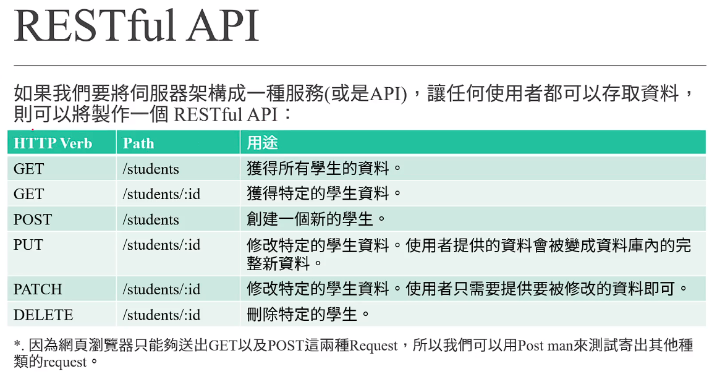

| HTTP verb | Path          | 用途                    |
| --------- | ------------- | --------------------- |
| GET       | /students     | 全體學生                  |
| GET       | /student/:id  | 得到目標對象                |
| POST      | /students     | 創建新對象                 |
| PUT       | /students/:id | 修改目標資料 ( 以提供的作為覆蓋 )   |
| PATCH     | /students/:id | 修改目標特定資料 (只需提供要修改的部分) |
| DELETE    | /students/:id | 刪除目標                  |

## 使用postman

# (306) Quick Fix

# (307) GET 學生資料

## 新章節基本流程:

npm init 

npm install express mongoose ejs

然後 .gitignore readme.md

這次比較特別，有創models資料夾放資料

### 在 JavaScript 中有兩種主要的模組系統：

- **CommonJS**（通常在 Node.js 中使用）使用 `require` 和 `module.exports` 語法。
- **ES 模組**（ECMAScript 模組）使用 `import` 和 `export` 語法。

在 CommonJS 中，你可以使用 `require` 來導入其他模組：

### 基礎設定-app.js

```js
const express = require("express");
const app = express();
const mongoose = require("mongoose");
const Student = require("./models/student");

app.set("view engine", "ejs");

mongoose
  .connect("mongodb://127.0.0.1:27017/exampleDB")
  .then(() => {
    console.log("mongoDB 連線成功");
  })
  .catch((e) => {
    console.log(e);
  });

app.listen(3000, () => {
  console.log("伺服器聆聽中");
});
```

### 基礎設定-student.js

```js
const mongoose = require("mongoose");
const { Schema } = mongoose; //從mongoose解構

const studentSchema = new Schema({
  name: {
    type: String,
    require: true,
    minlength: 2,
  },
  age: {
    type: Number,
    default: 18,
    max: [80, "有點太老了..."],
  },
  scholarship: {
    merit: {
      type: Number,
      max: [5000, "學生應得獎學金給太多囉"],
      min: 0,
      default: 0,
    },
    other: {
      type: Number,
      min: 0,
      default: 0,
    },
  },
});

const Student = mongoose.model("Student", studentSchema);
module.exports = Student;
```

## get students

```js
app.get("/students", async (req, res) => {
  try {
    let studentData = await Student.find({}).exec();
    return res.send(studentData);
  } catch (e) {
    // console.log(e); //只有伺服器看得到的錯誤不好
    return res.status(500).send("尋找資料時發生錯誤"); //內部錯誤=500
 essage);
  }
});
```

## get students/:id

```js
app.get("/students/:id", async (req, res) => {
  try {
    let studentData = await Student.find({ _id: req.params.id }).exec();
    return res.send(studentData);
  } catch (e) {
    console.log(e);
    console.log("資料型態為", typeof e);
    return .send("尋找資料時發生錯誤" + "\n" + e.message + "\n" + e.reason); 
    }
});
```

### 優化的版本如下

因為key : value 如果key跟變數value一樣則可以省略 

```js
app.get("/students/:_id", async (req, res) => {
  try {
    let { _id } = req.params;
    let studentData = await Student.find({ _id }).exec();
```

# (308) POST 新增學生資料

## 預先步驟

### app.use( )先加入中介軟體

```js
app.use(express.json());
app.use(express.urlencoded({ extended: true }));
```

#### express.json解析請求為JSON

#### urlencoded 寫了才能解析出 req.body

> **不使用 只能看到header**

## Postman使用x-www-form +Post

而不是 **raw json** ，因此解構直接使用以下

```js
app.post("/students", async (req, res) => {
  let { name, age, major, merit, other } = req.body;
  console.log(name, age, major, merit, other);
});
```

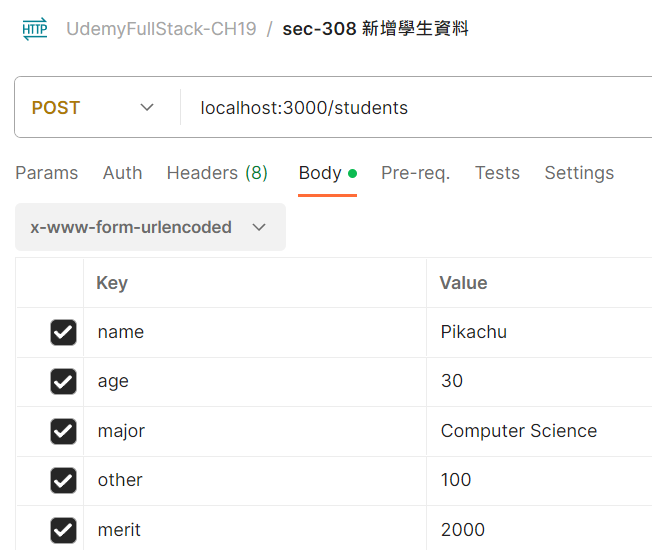

```js
app.post("/students", async (req, res) => {
  try {
    let { name, age, major, merit, other } = req.body;
    //   console.log(name, age, major, merit, other);
    let newStudent = new Student({
      name,
      age,
      major,
      scholarship: {
        merit,
        other,
      },
    });
    let result = await newStudent.save();
    return res.send({ msg: "資料儲存成功", result });
  } catch (e) {
    return res.status(500).send("儲存發生錯誤" + e.message);
  }
});
```

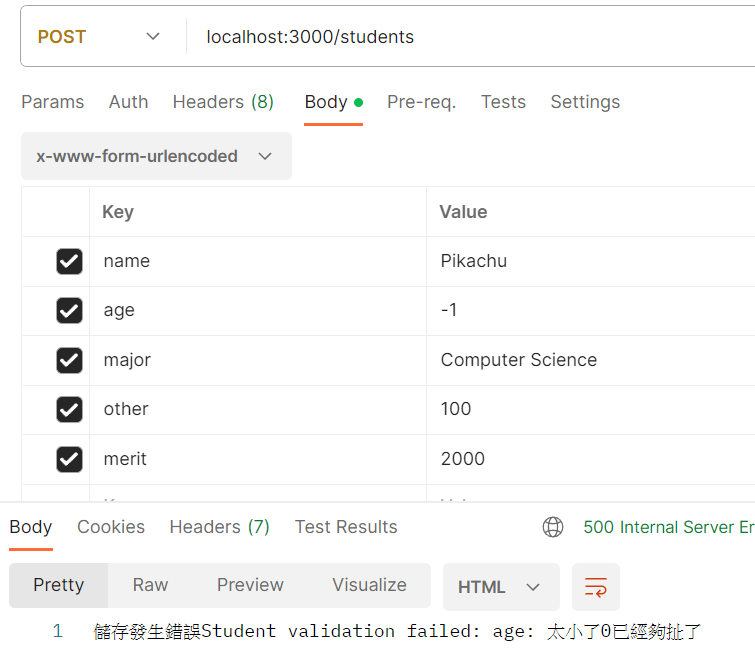

# (309) PUT, PATCH 更新資料

## PUT


### 明明給了 11111超過 schema限制

結果還是能回應給我? update那邊居然沒有限制或者拋錯誤??

### bug解釋

為什麼沒有出現預設 merit,other =0 ?

原本寫 {name, age, major,  merit, other}

所以完全沒提到 scholarship字段，因此只會修改其以外。

如果有提到，但是沒有給值，merit other會被說是undefined

`xxxxx 9 Computer Science undefined undefined`

那個時候系統才會 自動帶入預設值  

```js
let newData = await Student.findOneAndUpdate(
      { _id },
      { name, age, major, scholarship: { merit, other } },
      { new: true, runValidators: true, overwrite: true }
      // 因為put 本來就要提供所有數據，如果省略 自然要變成預設或者不存在該數據!
    ).exec();
```

如果沒取消勾勾，則帶入"" 空字串 ，被解析為null

### 沒取消勾勾 得到null

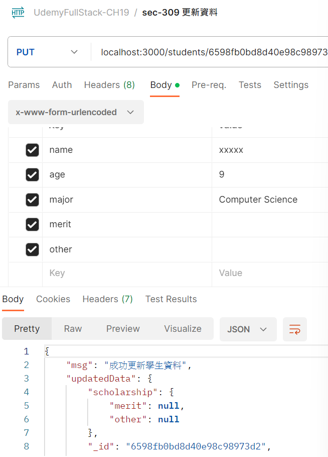

`xxxxx 9 Computer Science        `

### 取消勾勾則是

`xxxxx 9 Computer Science undefined undefined`

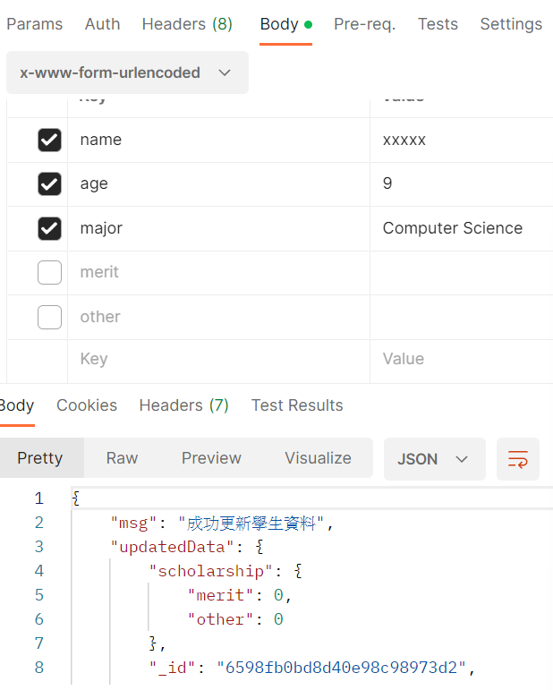

### update神奇事件-1

```js
{ name, age, major, scholarship: 
    { merit: 111, other: 555 } },
```

- 上面這個做法，如果原本是 scholarship: "" 則可以創造出
  
  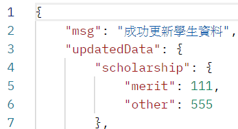

```js
{ name , age , major ,
 scholarship.merit:merit,scholarship.other:other},
```

- 上面這邊的話則會報錯說他無法create filed。

#### GPT解釋⭐⭐⭐⭐🔥

在 MongoDB 中，執行 `findOneAndUpdate()` 操作時，有兩種方式可以進行更新：

1. **直接指定物件的屬性名稱及其值：**
   
   ```js
   { name, age, major, scholarship: 
       { merit: 111, other: 555 } 
   }
   ```
   
   這種方式可以用來直接更新物件的屬性及其值。如果 `scholarship` 原本是一個空字串或未定義，這種寫法會將其設定為一個新的物件 
   
   `{ merit: 111, other: 555 }`。

2. **使用物件屬性設置的語法：⭐⭐**
   
   ```js
   { name, age, major, 
       "scholarship.merit": merit,
       "scholarship.other": other 
   }
   ```
   
   這種語法是針對巢狀物件中的特定屬性進行更新，但這樣的寫法會報錯，因為這裡試圖建立 `scholarship.merit` 和 `scholarship.other` 這兩個屬性，但在 MongoDB 中無法直接建立嵌套的屬性。這個寫法可能會導致錯誤。

基本上，第一種方式是直接為 `scholarship` 🔥創建一個新物件🔥，而第二種方式則嘗試對 `scholarship` 物件中的🔥特定屬性進行更新🔥，但在 MongoDB 中無法直接創建巢狀屬性名。

### update神奇事件-2🔥🔥🔥🔥🔥

明明age也有default 但是卻只有merit跟other在update生效

```js
age: {
    type: Number,
    default: 18,
    max: [80, "有點太老了..."],
    min: [0, "太小了0已經夠扯了"],
  },
  major: String,
  scholarship: {
    merit: {
      type: Number,
      max: [5000, "學生應得獎學金給太多囉"],
      min: 0,
      default: 111,
    },
    other: {
      type: Number,
      min: 0,
      default: 1,
    },
  },
```

#### 解釋:⭐⭐⭐⭐⭐

```js
let newData = await Student.findOneAndUpdate(
      { _id },
      { name, major, "scholarship.merit": merit },
```

##### document.property 的情況

雖然上面我拿掉了age， 正常思路是覺得 scholarship.other拿掉了，值被設定成預設 0 ，age我也拿掉了，所以應該也要是預設=18。

實際上他卻是如果 document.property 是 undefined (不管放不放在替換參數物件裡面)、就是不會把我替換預設值。

總之`mongoose` 不管你第一層 只有第二層nestedProperty才會被default 。

##### document.property.nestedProperty的情況

`1` nestedProperties 都有預設值，沒填就自動幫她用預設

`2` nestedProperties 有人沒有預設 ， 沒預設又沒填，那它會直接消失。

###### Mongoose不會在意怎麼忽略的⭐⭐

兩種方式它都會幫你default (因為他們都是nestedProperty) 

然後你都忽略other所以都會幫你預設 other 

包含如果`merit==undefined`  例如沒填或x-www-form沒打勾

只要`merit==undefined` 那也會一起被給預設值 !

> 下面第二種方式只有update時候不存在該屬性才會出bug
> 
> 剛剛上面GPT解釋中有提到了

```js
{ name, age, major, scholarship: { merit } },

跟
{ name, age, major, "scholarship.merit":merit } },
```

### 小結論

> 可是 nested . 屬性 會報錯

對的，對於嵌套的屬性，如果要更新的屬性不存在，MongoDB 將不會自動創建它。如果你試圖更新一個嵌套的屬性，而這個屬性的父屬性是不存在的，這可能會導致錯誤。這時需要確保你的更新操作是針對已存在的屬性。否則，可能會報錯指示找不到該屬性。

> 嵌套屬性如果找不到則可能出錯 除非使用物件寫法，但是物件寫法又會導致使用者沒給予，系統使用預設 🔥這是因為物件寫法視為創造，創造會看有沒有給，否則使用default🔥

### findAndUpdateOne() 新版本不適用🔥🔥

#### 新版本無法overwrite 要改用replaceOne🔥

6.6.5 跟 8.0.3

6.6.5 如果使用findOneAndUpdate 🔥

doc.age 不給值，會使用預設，但如果是name(沒預設) 新物件會沒有name屬性，如果是nested.other(有預設) 則 0 。

8.0.3 如果使用 replaceOne🔥

不提供 doc.age則使用預設18，不提供nested.other也會預設0

8.0.3 如果使用 findOneAndUpdate🔥

不提供 doc.age則略過(維持原樣) ，不提供nested.other則預設0

### 建議使用findAndReplaceOne或者版本要6.6.5

## Patch

### 使用自定義格式

```js
class NewData {
  constructor() {}
  setProperty(key, value) {
    if (key !== "merit" && key !== "other") {
      this[key] = value;
    } else {
      this[`scholarship.${key}`] = value;
    }
  }
}
app.patch("/students/:_id", async (req, res) => {
  try {
    // let { name, age, major, merit, other } = req.body;
    let { _id } = req.params;
    let newObject = new NewData();
    for (let property in req.body) {
      newObject.setProperty(property, req.body[property]);
    }
    console.log(newObject);
    console.log(req.body);
  } catch (e) {
    return res.status(500).send(e.message);
  }
});
======================================================
{ name: 'xxxxx', age: '9', major: 'Computer Science' }
NewData {
  name: 'xxxxx',
  age: '9',
  major: 'Computer Science',
  'scholarship.merit': '11'
}
{ name: 'xxxxx', age: '9', major: 'Computer Science', merit: '11' }
```

- 為了讓 mongoose那邊不要用解構 導致沒輸入變成undefined，然後導致雖然overwrite:false 但卻幫我寫上undefined。

- `{ name, age, major, scholarship: { merit, other } },`

- 沒有給scholarship 即使overwrite:true也不會覆蓋而是預設

### patch 使用findOneAndUpdate 就好

新版本8.03不會受到影響，如果怕全改(6.6.5確實會PUT替換掉全部) ，那就overwrite乖乖寫false

但新版本好像要用replace才會有PUT的效果所以寫true也不會覆蓋沒給的資料。

update的話最多scholarship.other 或merit被變成預設值，但doc.p沒給定也不會屬性消失，而是維持先前的值。

.......反正有點複雜使用的時候去注意各版本的話會比較好。

> 注意 不需要用{} 包住newObject

```js
app.patch("/students/:_id", async (req, res) => {
  try {
    // let { name, age, major, merit, other } = req.body;
    let { _id } = req.params;
    let newObject = new NewData();
    for (let property in req.body) {
      newObject.setProperty(property, req.body[property]);
    }
    console.log(newObject);
    console.log(req.body);
    let result = await Student.findOneAndUpdate(
        { _id },
         newObject, 💡💡💡💡💡
        {
              new: true,
              runValidators: true,
              overwrite: true,
        }
    );
    return res.send({ msg: "成功更新學生資料", updatedData: result });
  } catch (e) {
    return res.status(500).send(e.message);
  }
});
```

## 別人的問題💡💡💡

> 蠻多ㄟ 包含constructor不寫 其實預設也會幫寫。

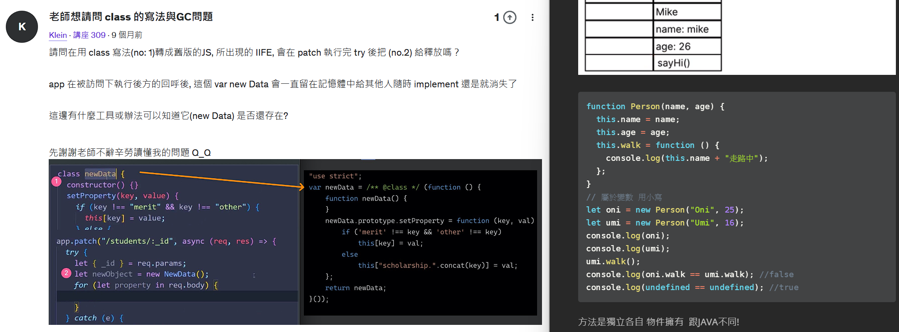

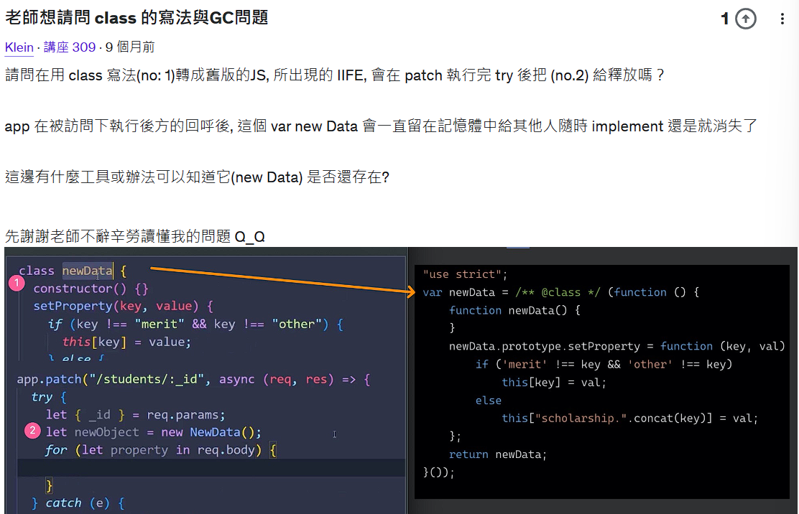

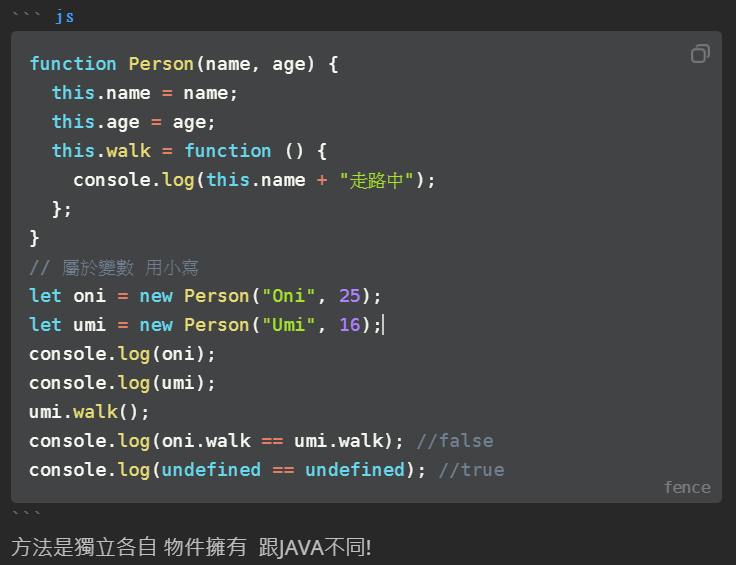

- 它的舊版的寫法真的蠻神奇，
  
  

### 學員提供的古老方法 (明明可以用class)QQ💡

```js
let newData = /**@class*/ (function () {
  function newData() {}
  newData.prototype.setProperty = function (k, v) {
    if (`merit` !== k && "other" != k) {
      this[k] = v;
    } else {
      this[`scholarship.${k}`] = v;
    }
  };
  return newData;
})();

let n = new newData();
n.setProperty("name", "umi");
n.setProperty("age", 10);
n.setProperty("merit", 1000);
console.log(n);
```

## 有點亂的mongoose版本因素總結:

刪掉文字了 要看去Udemy問答別人的問題下面找 重點是下面

### 總結: 6.6.5

勾name不填值:  一定報錯

不勾name ，且overwrite:true  會報錯。

不勾name ，且overwrite:false 不報錯誤。

### 總結:  8.0.3

勾name不填值 : 一定報錯 

不勾name ，都沒事 ，( true false都無所謂 )

兩者差別在於8.0.3的PUT 功能 update overwrite ture壞掉或消失然後不會報錯。

## git 心得🔥🔥🔥🔥🔥

git commit -m "Ch19 section 309 PUT PATCH、這邊比較雜亂，因為版本關係還會導致結果不同，新版要用Replace才有PUT效果，而且舊版一定要勾name才不會報錯( **<u>可能是因為舊版overwrite:true屬於replace?</u>** 所以會被要求填寫，但是新版寫true也沒PUT效果，功能好像被拿掉，所以同時也不會像6.6.5版本說強制填name)"🔥

# (310) 額外補充

## 上一節的第二個參數不能如下

```js
{    
    name,
    age,
    scholarship:{merit,other}
}
```

- 因為會 undefined  被帶入變成 0 , 0 

- 假定使用者在發送PATCH request中，都沒有提供merit與other，則使用上面的寫法的話，findOneAndUpdate的第二個參數中的scholarship屬性，會被設定成一個物件`{merit: undefined, other: undefined}`。此時的情況就不符合「findOneAndUpdate的第二個參數的某個屬性是undefined」。因此，mongoose會嘗試去將scholarship屬性設定成`{merit: undefined, other: undefined}`這個物件。但因為schema有設定merit與other的default 是 0，所以PATCH request的結果將scholarship屬性變成{merit:  0, other: 0}**。**

乖乖使用newObject =new NewData();比較好

# (311) DELETE 移除資料

```js
app.delete("/students/:_id", async (req, res) => {
  try {
    let { _id } = req.params;
    let deleteResult = await Student.deleteOne({ _id });
    return res.send({ msg: "成功刪除", obj: deleteResult });
  } catch (e) {
    return res.status(400).send(e.message);
  }
});
app.listen(3000, () => {
  console.log("伺服器聆聽中");
});
```

# (312) Restful API Final Code

# (313) cors套件介紹

Cross-origin resource sharing

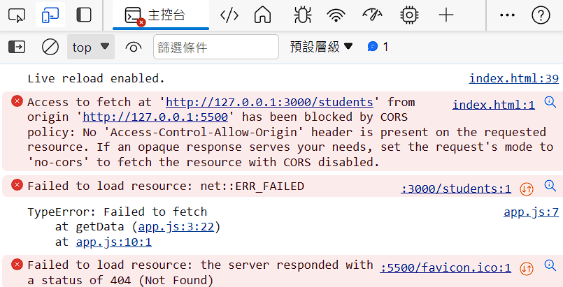

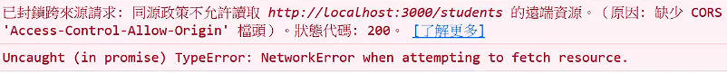

## 操作步驟兩個

### index.html =>用這開啟才會 有policy問題

```js
<!DOCTYPE html>
<html lang="zh-Hants">
  <head>
    <meta charset="UTF-8" />
    <meta name="viewport" content="width=device-width, initial-scale=1.0" />
    <title>Document</title>
    <meta name="author" content="Onini" />
  </head>
  <body>
    <script src="./app.js"></script>
  </body>
</html>
```

### app.js

```js
async function getData() {
  try {
    let data = await fetch("http://127.0.0.1:3000/students");
    let result = await data.json();
    console.log(result);
  } catch (e) {
    console.log(e);
  }
}
getData();
```

## cors

先npm安裝一下再使用

```js
const cors = require("cors");
app.set("view engine", "ejs");
app.use(express.json());
app.use(express.urlencoded({ extended: true }));
app.use(cors());
```

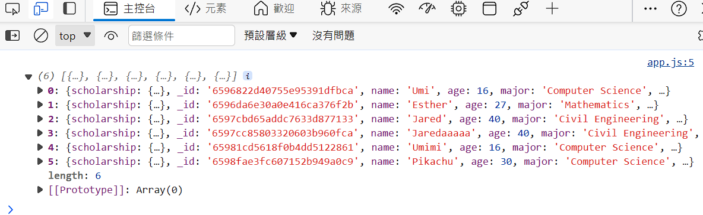

# (314) 透過網頁瀏覽學生資料

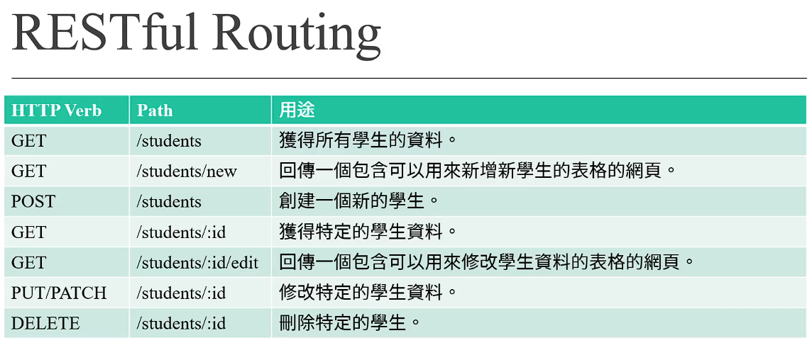

| HTTP verb | Path               | 用途              |
| --------- | ------------------ | --------------- |
| GET       | /students          | 獲得所有學生資料        |
| GET       | /students/new      | 回傳(可以新增學生的表格)網頁 |
| POST      | /students          | 創建一個新的學生        |
| GET       | /students/:id      | 獲得特定的學生資料       |
| GET       | /students/:id/edit | 回傳網頁(可以修改學生資料)  |
| PUT/PATCH | /students/:id      | 修改特定的學生資料       |
| DELETE    | /students/:id      | 刪除特定學生          |

## 得到學生全體

```js
<body>
    <h1>學生首頁</h1>
    <ul>
      <% studentData.forEach(student => { %>
      <li>
        <%=student.name%>
      </li>
      <% }); %>
    </ul>
  </body>
```


## 透過ID查出詳細資料

```js
<body>
    <h1>學生首頁</h1>
    <ul>
      <% studentData.forEach(student => { %>
      <li>
        <a href="students/<%=student._id%>"><%=student.name%></a>
      </li>
      <% }); %>
    </ul>
  </body>
```

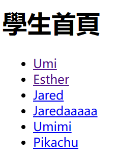

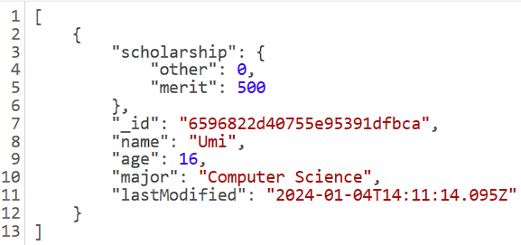

### bug= for i in Obj🔥🔥🔥

`for...in` 迴圈會讓你遍歷物件的所有可列舉屬性，包括它的原型鏈上的屬性。


#### 使用 Object.keys(student)🔥🔥🔥

一般自己建立的就很簡單直接用這招

```js
let student = {
  scholarship: { other: 0, merit: 500 },
  _id: new ObjectId("6596822d40755e95391dfbca"),
  name: 'Umi',
  age: 16,
  major: 'Computer Science',
  lastModified: '2024-01-04T14:11:14.095Z'
};
let properties = Object.keys(student);
console.log(properties);
```

- 上面這樣就ok

- 另一個則是
  
  ```js
  for (let key in student) {
    if (student.hasOwnProperty(key)) {
      console.log(key + ": " + student[key]);
    }
  }
  ```

#### 不可枚舉的情況下!!!🔥🔥🔥🔥

對，看起來在該程式碼中，無法正確地印出屬性名稱。這種情況通常發生在對象的屬性是不可枚舉的情況下。這種情況下，你可以使用 `Object.getOwnPropertyNames()` 方法來獲取屬性名稱，即使它們不可枚舉。

Mongoose可能為了防止誤用 有特別設定，然後放在 `._doc`

```js
let obj = {};
Object.defineProperties(obj, {
  property1: {
    value: 'value1',
    enumerable: true // 可枚舉
  },
  property2: {
    value: 'value2',
    enumerable: false // 不可枚舉
  }
});
```

```js
let properties = Object.getOwnPropertyNames(studentData[0]._doc);

[ 'scholarship', '_id', 'name', 'age', 'major', 'lastModified' ]
```

##### ⭐⭐⭐mongoose特別保護 ，因此也可以先轉成物件直接弄

在 Mongoose 中，`.toObject()` 和 `.toJSON()` 方法將返回模型的 JavaScript 物件版本，但是 Mongoose 將其內部數據儲存在 `._doc` 中。這樣做是為了防止直接修改 Mongoose 模型的內部數據，因為直接修改模型可能會導致意外的行為或數據不一致。

在 Mongoose 中，模型的內部數據是保護的，但你可以使用 `.toObject()` 或 `.toJSON()` 方法將其轉換為普通的 JavaScript 物件，並對其進行操作。這兩種方法都會返回一個去除了 Mongoose 內部屬性的純 JavaScript 物件版本，這樣你就可以安全地對其進行更改。

```js
const student = new Student({ name: 'John', age: 25 });

// Mongoose 內部屬性儲存在 ._doc 中
console.log(student._doc);

// 將 Mongoose 模型轉換為普通 JavaScript 物件
const plainObject = student.toObject(); // 或者使用 toJSON()

// 此時內部數據不再儲存在 ._doc 中
console.log(plainObject);

// 對普通 JavaScript 物件進行更改
plainObject.age = 30;

// 沒有影響到原始的 Mongoose 模型
console.log(student.age); // 25
console.log(plainObject.age); // 30
```

##### 小節論:

```js
/** Mongoose避免我們直接改原始數據 因此用 ._doc保護 */
   let properties = Object.getOwnPropertyNames(studentData[0]._doc);
    console.log(properties);
    properties.forEach((e) => {
      console.log(e);
    });/ });
/** 可以將物件透過.toJSON 抽離，那就不需要透過上面那招了 */
    let obj = studentData[0].toJSON();
    for (let i in obj) {
      console.log(i);
    }
```

## id找學生 - 2  : 表格版本

```js
app.get("/students/:_id", async (req, res) => {
  try {
    let { _id } = req.params;
    let studentData = await Student.find({ _id }).exec();

    if (studentData.length > 0)
      return res.render("students-page", { studentData });
    else {
      return res.render("student-not-found", { _id });
    }
  } catch (e) {
    console.log(e);
    console.log("資料型態為", typeof e);
    return (
      res
        .status(400)
        // .send("尋找資料時發生錯誤" + "\n" + e.message + "\n" + e.reason);
        .render("error", { e })
    );
  }
});
```

```js
<style>
      tr,
      td,
      table {
        border-collapse: collapse;
        border: 2px black solid;
        padding: 1rem;
      }
      a {
        position: absolute;
        left: 50%;
        bottom: 0%;
      }


    </style>
<table>
      <tbody>
        <tr>
          <td>編號</td>
          <td><%=studentData[0]._id%></td>
        </tr>
        <tr>
          <td>名稱</td>
          <td><%=studentData[0].name%></td>
        </tr>
        <tr>
          <td>年齡</td>
          <td><%=studentData[0].age%></td>
        </tr>
        <tr>
          <td>主修</td>
          <td><%=studentData[0].major%></td>
        </tr>
        <tr>
          <td>merit</td>
          <td><%=studentData[0].scholarship.merit%></td>
        </tr>
        <tr>
          <td>other</td>
          <td><%=studentData[0].scholarship.other%></td>
        </tr>
      </tbody>
    </table>
    <a href="/students">回首頁</a>
```

### 回憶 定位差別 : absolute vs fixed

1. **`position: absolute`**:
   
   - 元素的位置相對於其最近的已定位（父元素或祖先元素）的祖先元素（非 static 定位的元素）。
   - 如果沒有已定位的祖先元素，則相對於瀏覽器窗口進行定位。
   - 元素的位置會從文檔流中移除，不會對其他元素造成影響。
   - 通常會使用 `top`, `bottom`, `left`, `right` 屬性來定位。

2. **`position: fixed`**:
   
   - 元素的位置相對於瀏覽器窗口本身進行定位，即使網頁滾動，該元素也會固定在視口的某個位置。
   - 不會因為頁面的滾動而改變其位置。
   - 通常也會使用 `top`, `bottom`, `left`, `right` 屬性來定位。

簡而言之，`position: absolute` 會相對於其最近的已定位的祖先元素定位，而 `position: fixed` 則是相對於瀏覽器窗口進行定位，並且在頁面滾動時保持固定位置。

# (315) 透過網頁新增學生資料

## 必須建立在:id的Router之前

```js
// 建立for 網頁new student 必須在:id 的router之前
app.get("/students/new", async (req, res) => {
    return res.render("student-new");
});
```

## 使用表格做表單

```html
<form action="/students/new" method="post">
    <table>
    <tr>
        <td><label for="student-name">姓名</label></td>
        <td><input type="text" id="student-name" nage="name" /></td>
    </tr>
    <tr>
        <td><label for="student-age">年齡</label></td>
        <td><input type="text" id="student-age" name="age" /></td>
    </tr>
    <tr>
        <td><label for="student-major">主修</label></td>
        <td><input type="text" id="student-major" name="major" /></td>
    </tr>
    <tr>
        <td><label for="student-merit">merit</label></td>
        <td><input type="text" id="student-merit" name="merit" /></td>
    </tr>
    <tr>
        <td><label for="student-other">other</label></td>
        <td><input type="text" id="student-other" name="other" /></td>
    </tr>
    </table>
    <button type="input">送出表單</button>
</form>
```

## 提示resolve await

對的，`await` 與 `then` 的目的都是獲取 `resolve` 的值。使用 `await` 將會直接返回 `resolve` 的值，而在 `then` 中的參數就是這個值，所以兩者得到的結果是相同的。

## relative 跟 fixed h1寬度議題

- 為什麼使用fixed 則 h1 寬度就以內容為主

- `position: fixed;` 會將元素固定在視窗中的位置，忽略其他內容的佈局。這意味著該元素不再參與正常的文檔流，而是相對於視窗本身進行定位。
  
  > 元素會因脫離正常文檔流，因此其寬度將🔥基於其內容自動調整。🔥

## 讓 li 圓點消失:

```css
li {
        /* text-decoration: none; */
        /* text-decoration-style: none; */
        list-style-type: none;
      }
```

# (316) 透過網頁更新學生資料

`/students/:_id/edit` 這個router會先解析id再去 input value設定覆蓋。

```js
app.get("/students/:_id/edit", async (req, res) => {
  try {
    //這次玩findOne 就不會arr[0]
    let { _id } = req.params;
    let data = await Student.findOne({ _id }).exec();
    if (data != null) {
      return res.render("student-edit", { data });
    } else {
      return res.render("student-not-found", { _id });
    }
  } catch (e) {
    return res.render("error", { e });
  }
});
```

## 重點在於form本身只有POST GET 所以

### 安裝method-override💡

```npmignore
npm install method-override
```

```js
const methodOverride = require('method-override');
app.use(methodOverride("_method"));
```

```html
<body>
    <h1>修改資料</h1>
    <!-- 必須使用POST 這樣才會幫忙放到BODY ! -->
    <form action="/students/<%=data._id%>?_method=PATCH" method="POST">
      <!-- <input type="hidden" name="_method" value="PATCH" /> -->💡💡💡
      <table>
        <tr>
```

💡 偷偷送出一個`_method` 的參數給express 然後解析路徑💡

- 現在好像改成不是用hidden那邊的作法 而是上面那

## input.value 採用讀取到的data!

```js
<tr>
   <td><label for="student-name">姓名</label></td>
   <td>
     <input
       type="text"
       id="student-name"
       name="name"
       value="<%=data.name%>"
     />
   </td>
</tr>
```

# 最終小考


## 問題 1：符合REST的網路服務，允許使用者端向「？」發出存取和操作網路資源的請求，而與預先定義好的無狀態操作集一致化。

- 聯合國總部辦公室

- 柯南動畫中的神秘組織

- 統一資源標識符（簡稱為URI） >>>>>>>>>

- 光明會？

## 問題 2：對一個儲存學生資料的RESTful API來說，如果要獲得所有學生的資料，定義的route會是？

- GET /students  >>>>>>>>>>>>>>>>>>>>>>>>>>>

- POST /students

- GET /students/:id

- PUT  /students/:id


## 問題 3：對一個儲存學生資料的RESTful API來說，如果更新特定學生的資料，定義的route會是？

- PUT/PATCH /students/:id >>>>>>>>>>>>>>>>>>>>>>>>>>>>

- GET /students

- GET /students/:id

- DELETE /students/:id


## 問題 4：對一個儲存學生資料的RESTful API來說，如果要回傳一個可以修改特定學生資料的表格，定義的route會是？

- POST /students

- POST /students/:id

- GET /students/:id/edit >>>>>>>>>>>>>>>>>>>>>>>>>>>>

- POST /students/:id/edit
