# (318) Express Middlewares

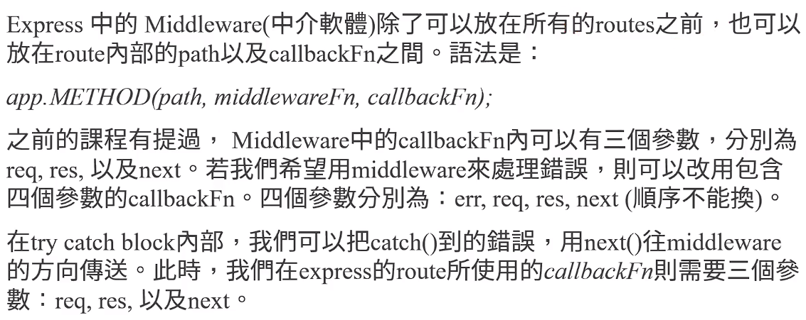

- 最後一行有誤，是err,req,res,next 四個才對哦。

## Middleware 之前講過 補充:

### 以前的語法是全體適用:

- `app.use(middlewareFn)` 

- ```js
  app.use((req, res, next) => {
    console.log("正在經過middleware");
    next();
  });
  ```

### 除了routes之前，也能指定對象:

目的是為了更精細的使用 middleware

> route.path以及callBackFunction之間。 

#### 語法 :

- `app.method(path,middlewareFn,callbackFn);`

- 使用arrowFn也完全ok。

### 甚至多個middleware in route

- `app.method(path,[mid_fn,mid_fn],callbackFn)`

- 只要放在陣列中就行，使用arrowFn也完全ok。

### middleware err的參數順序介紹

- `err,req,res,next` 🔥🔥🔥

- 順序不能換🔥

## app.use((err,req,res,next)=>{})使用方法

### 緣由:

當 app.method 的callbackfn 出錯，next(e)可以把錯誤傳到routes最下面，然後使用`app.use((err,req,res,next)=>{})` 處理錯誤!

### 注意: 🔥

原本函數記得加上next參數、use內記得要🔥`next ()`傳出去🔥

- `app.get("/",(req,res,next)=>{}` 🔥

- ```js
  app.use((err, req, res, next) => {
    res.status(500).render("error", { e: err });
    next();🔥否則下面不會被使用🔥
  });
  app.use((req, res, next) => {
    console.log("我是下一個next");
  });
  ```

## 結論:

middleware可以放在全體routes之前，也可選定要放的對象，app.method("/",middleWare, (req,res,next) =>{  catch(e) {next(e) ;}  }) 、另外 錯誤也能透過next(e) 一路傳到 下一個middleWare 、 或常常放route最下層，如果最下層放 app.use((err,req,res,next)=>{} ) 就能大家把錯誤丟給它執行，放置app.use的順序很重要。

# (319) express Router()

伺服器擴大的話，routes會變很多，所以要分類。

## 大致如下:

- birds.js
  
  ```js
  const express=require('express');
  const router=express.Router();
  router.use(...);
  router.get('/',(req,res)=>{res.send('Birds home page')});
  module.exports=router;
  ```

- app.js
  
  ```js
  const birds=require('./birds');
  app.use('/birds',birds);
  ```
  
  上面這邊 所有請求是 /birds  開頭的就會被 傳送到birds那邊處理。

## 

## student-routes.js 關於next()

- 順便說明，最後需要module.exports=router 導出 !

```js
router.post("/", async (req, res) => {
  try {
    let { name, age, major, merit, other } = req.body;
    //   console.log(name, age, major, merit, other);
    let newStudent = new Student({
      name,
      age,
      major,
      scholarship: {
        merit,
        other,
      },
    });
    let result = await newStudent.save();
    // return res.send({ msg: "資料儲存成功", result });
    return res.render("sucessInsert", { result });
  } catch (e) {
    // return res.status(500).send("儲存發生錯誤" + e.message);
    // return res.status(500).render("error", { e });
    next(e);
  }
});
......
.....
...
router.delete("/:_id", async (req, res, next) => {
  try {
    let { _id } = req.params;
    let deleteResult = await Student.deleteOne({ _id });
    return res.send({ msg: "成功刪除", obj: deleteResult });
  } catch (e) {
    // return res.status(400).send(e.message);
    next(e);
  }
});

module.exports = router; 
```

- bug告訴我說 找不到next ，我回去看，確實我沒加到

- 加上去後就ok了，也就是說 不需要每一個下面都寫next，可以傳到最外層。

## 實際操作:

### 建立routes資料夾，專門放置router

student - routes 負責學生的 router

faculty - routes 負責教職員 router

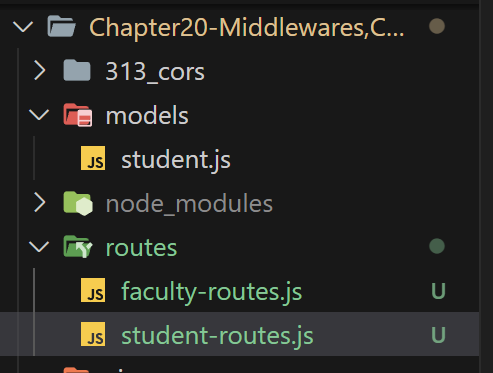

### student-routes.js

關於這邊，原本在app.js 我們使用app.get 。

移動到student-routes.js後

首先透過const router = `express.Router()`  創物件

> 原本是 const app = express(); 然後 app.get

#### 使用router.get ("/") 就可以代替 "/student"

外面`app.js` 會幫我們 轉換路徑

```js
const studentRouter = require("./routes/student-routes");
app.use("/students", studentRouter);
```

- app = express  會自動解析、導向目標  `router` !

#### 另外提醒，student-routes.js中 next(e) 拋出錯誤

- 這些錯誤在student-routes如果沒有處理，或者處理後沒有next(e)，
  
  則最外面的app.js 最下面的error處理 會幫忙處理!

- `app.js`
  
  ```js
  app.use('/student',studentRouter);
  ...
  app.use((err,req,res,next)=>{
      err會幫忙處理 studentRouter如果沒有中介的話
  })
  ```

## 建議觀看該次commit比較能沉浸接納、習慣

- 自己操作看看比較好!

# (320) Cookies簡介

## 接下來都用app2.js

伺服器傳給browser 然後下次客戶再度訪問的話，一同發回給server。

> 保留偏好、登入帳號、語言、字體、其他設定

## Express 、cookies

### server設定

```js
app.get("/setCookies", (req, res) => {
  res.cookie("yourCookie", "Oreo");
  return res.send("已經設置cookie了");
});
```

### server取得

#### 先安裝cookie-parser套件💡

```js
npm install cookie-parser;
const cookieParser=require("cookie-parser");
app.use(cookieParser()) 
```

#### 取得，直接印是JSON，搭配字串變[object Object]

```js
app.get("/seeCookies", async (req, res) => {
  let cookies = req.cookies;
  console.log(cookies);
  //   let json = JSON.stringify(cookies);
  //   console.log(json);
  return res.send("偷看一下cookies" + cookies);
});
```

- 務必配合 JSNO.stringify才能 跟文字一同輸出!

```bash
偷看一下cookies[object Object]
----------------------------------------------------
偷看一下cookies{"JSESSIONID":"9D01158B8D4DFB98E1791E921B181BF1","yourCookie":"Oreo","yourCookie2":"Oreo2"}
```

### fetch才需要.json跟await

# (321) Cookie簽名

由於客戶端瀏覽器可以隨意修改，所以我們要簽名，避免竄改，然後還傻傻的拿回來使用。

## cookie-parser 這個middleWare

他會幫忙解析、並且它也會判斷是不是加密的，所以普通的

`req.cookies` 並不會包含加密過的

`req.signedCookies` 使用這個才會單獨顯示出! 

## 操作方式

```js
app.use(cookieParser("我是密碼，塞密碼就對了"));
```

```js
app.get("/seeCookies", async (req, res) => {
  let cookies = req.cookies;
  //   console.log(cookies);
  let json = JSON.stringify(cookies);
  console.log(req.signedCookies);
  return res.send("偷看一下cookies" + json);
});
```

- 依舊是看不到 secretCookie 要去瀏覽器f12查看

```batch
偷看一下cookies
{
    "JSESSIONID":"9D01158B8D4DFB98E1791E921B181BF1",
    "yourCookie":"Oreo",
    "yourCookie2":"Oreo2"
}
```

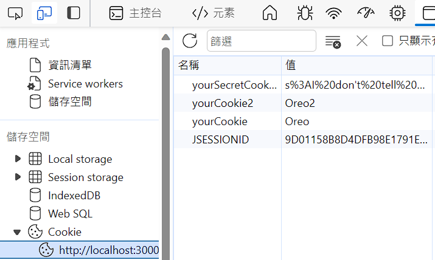

- 但是我console 有印出來 req.signedCookies !

```batch
[Object: null prototype] 
{ yourSecretCookie: "I don't tell you" }
```

## 如何看破真與假😕😕

### 原始沒被竄改的話

```js
app.get("/seeCookies", async (req, res) => {
  let cookies = req.cookies;
  //   console.log(cookies);
  let json = JSON.stringify(cookies);
  console.log(req.signedCookies);
  return res.send("偷看一下cookies: " + req.signedCookies.yourSecretCookie);
});
```

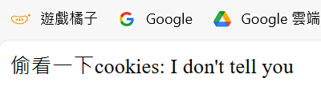

### 被篡改的話

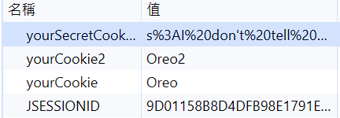

- 隨便點它然後亂改 就會被知道⭐ =false

- 另外只是保證不會竄改，但並沒有幫忙加密⭐

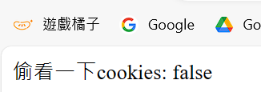

- 或者值通通刪除是undefined⭐

- 偷改=false 

### 這是簽名而不是加密，所以資料是會被知道的!⭐⭐⭐

## 結論🔥🔥🔥

Ch20 section 321 cookie 簽名，主要依賴node套件cookie-parser 輔助，包含解析跟驗證是否被竄改過，req.signedCookies.yourSecretCookie 跟req.cookies ，兩者得到的是不同的，🔥如果開頭被竄改的話就會被視為一般cookie🔥，如果開頭沒被竄改，就是秘密cookie， 並沒有key的名稱存到內部伺服器唷!

# (322) (進階課程) Signing Cookies

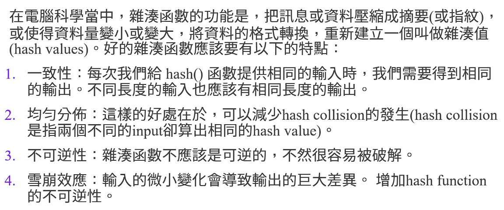

## 雜湊函數 特點

### 1. 一致性

1. 每次相同輸入都得到相同輸出。

2. diff length input =>  same length output

### 2. 均勻分布

- 減少碰撞 hash collision發生，兩個不同input得到相同hash value

### 3. 不可逆性

- 否則會被破解

### 4. 雪崩效應

- 細微變化 得到巨大產出差異

## 有名的HASH

SHA  Secure Hash Algorithm 由美國國家安全局研發。

## HMAC

cookies 簽名 的演算法

HMAC Hash MAC 

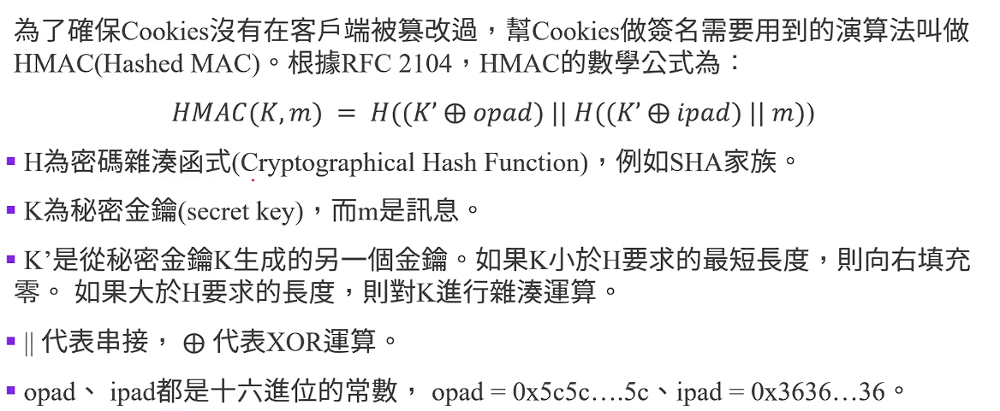

## 簽名流程

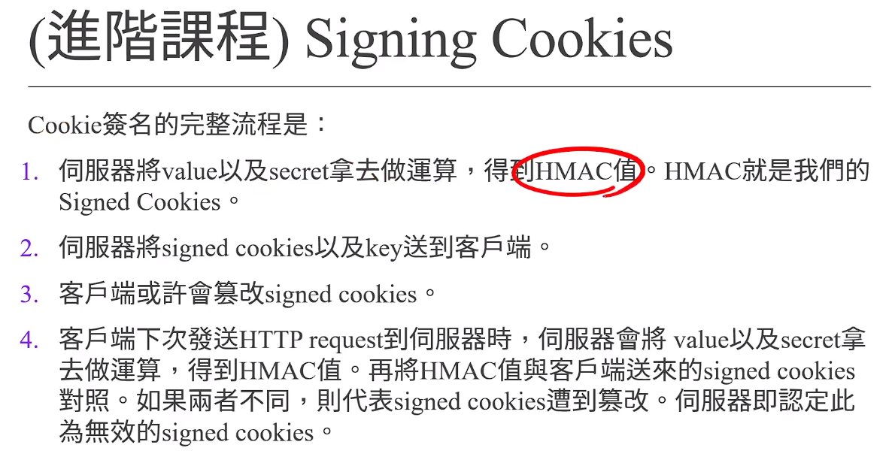

# (323) (進階課程) 伺服器怎麼取得value？

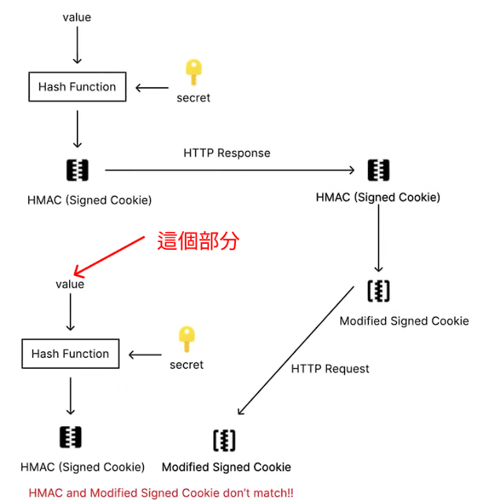

這個問題比較複雜，我試著用比較容易的方式講解：

1. value可以存在任何地方，讓server最後比對時，可以去計算出HMAC的值。至於這個value要存在哪裡，有很多種做法。可以存在server，這是最容易的。但隨著用戶增加與流量增加，server會儲存太多垃圾資訊，所以server可能需要一段時間後就清理這些value。這也就代表著存在client的signed cookies全部都會作廢(或者說是過期)了。

2. value可以存在client side。如果去看影片299的signed cookie的值，會發現Oreo也在signed cookie裡面。這就代表，對於server來說，只要把signed cookie前面的s%3A刪掉，以及把後面固定長度的HMAC值拿掉，就可以得到value值了。如果client曾經改動過signed cookie前面的s%3A，那server會能夠更快的判斷這個signed cookie已經被篡改過了。另外，如果你看了後面課程的session，會看到connect.sid內部儲存的signed cookie都是s:開頭。在session的原始碼內部：

https://github.com/expressjs/session/blob/1010fadc2f071ddf2add94235d72224cf65159c6/index.js#L542

你可以看到function getcookie(req, name, secrets)的541行與542行，馬上就會檢查signed cookie有沒有s:開頭。如果沒有的話，馬上就會認定這是被篡改過的cookies了。所以我們知道，對於server而言，如果把value存在client side的話，需要先去取得value值。

3. 那如果是被篡改過的value怎麼辦？例如，signed cookie前面的s%3A保留了，後面的HMAC的值也沒有更動，只有Oreo的部分被篡改過。假定Oreo被篡改成Oreos，那對server來說也沒有問題，可以直接用Oreos配上secret去計算HMAC的值。但我們知道，Oreos與Oreo的HMAC值，因為雪崩效應，所以會非常不一樣。這兩個值去比較，server馬上就會知道signed cookie被篡改過。但有沒有可能Oreo的部分被篡改成某個值，這個新值的HMAC與Oreo的HMAC是一樣的？有，這種情況就做「Hash Collision」。通常機率很低，但如果我們希望降低Hash Collision發生的機率，可以使用SHA256或是更長的Hash function，而非使用SHA1。

4. 那如果是被篡改過的HMAC怎麼辦？那也沒問題，server可以取得value是Oreo，去計算HMAC，馬上就會發現計算出的HMAC與client送過來的HMAC不同，server馬上就會知道signed cookie被篡改過。

5. 如果只保留signed cookie前面的s%3A，後面的部分全部都變了，怎麼辦？那也沒有問題，server可以去看後面的部分長度是否夠長。如果不夠長，server馬上就會知道signed cookie被篡改過。如果夠長，server也可以去計算嘗試取得HMAC以及value的部分，然後使用value去計算HMAC值。

以上就是兩種value可以存放的地方，以及篡改了又要怎麼拿到原先正確的cookie的value的方法。如果看不懂，也不用勉強。

# (324) Cookies and Storage 差別

|            | cookies                | storage  |
| ---------- | ---------------------- | -------- |
| purpose    | server讀取資料、保留user設定    | 運作在user端 |
| HTTP       | 會隨著HTTP寄送到server       | 不會       |
| Data Size  | each web mx 4095 Bytes | 最大5MB    |
| Expiration | 可能會過期                  | 不會過期     |

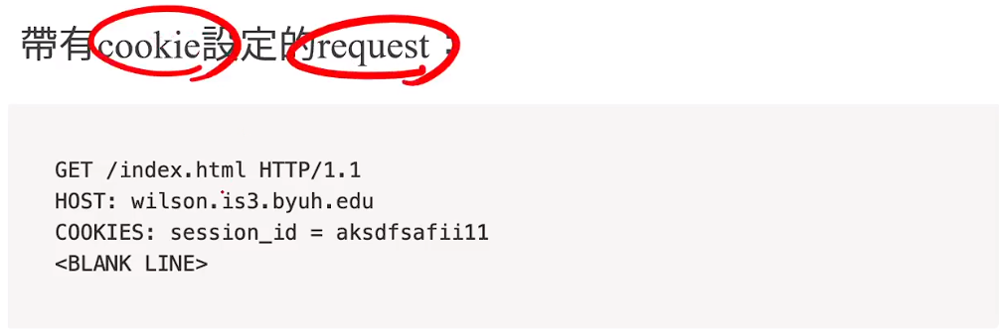

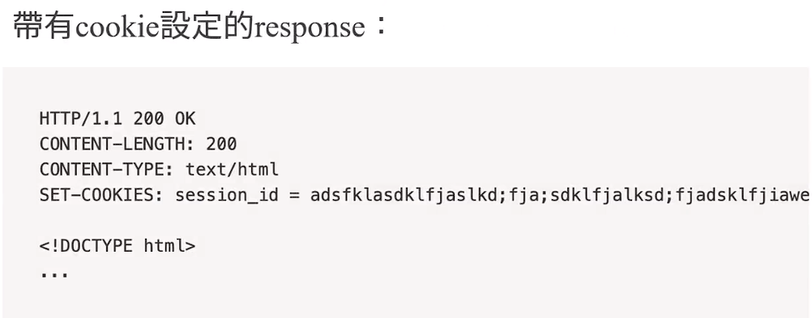

# (325) Session設定

## Cookies 問題

- cookies 最多 4095bytes而已。

- cookies 可以輕易被修改，如果是透過`id`編號而已，很容易就讓其他人假冒，即使有簽名，也有一定危險。

> 為了解決這些問題，我們可以在伺服器端使用Sessions

- 另外 ( 共通缺點 ) 只要整包帶走，還是可以假冒對方，不修改也能騙。

## Sessions🔥🔥

session是網頁伺服器上的儲存空間，使用者登入時，sever會製作一個`session id`，以及此`session id` 所相對應的資料。

`session id` 會被以 `cookie` 的形式送到伺服器，而伺服器使用的session id找到對應的資料來確認使用者的身分。

🔥session就是有人考慮過cookies安全性而設計，直接用就好🔥

🔥也不必自己重新考量如何安全化🔥

### Session解決cookie隱患:

- server的儲存空間不受4095bytes限制
  
  > 關於這一點，其實就是讓user只記住 sessionID ，剩下的購物車內容都交由server去記憶。
  
  `如下` ，`server` 負責記憶
  
  ```batch
  {
      sessionID : sdd2313_$22144kkjaosx,
      cart : {
          babyShark:1,
          dududu:2
      } 
  }
  ```

- 如果用戶竄改自己session id ，雖然 也可能被不小心猜到，但難度比`id` 難上很多，因為長度很長。

> 發出 session id之前 對session id簽名，如果有人竄改，想依此登入，可以迅速識別出來。

## express-session

### 安裝express-session套件

```batch
npm install express-session
```

### 語法

```js
app.use(session({
    secret:'keyboard cat',  >>>>簽名的密碼string
    resave:false,
    saveUninitialized:false,
    cookie:{secure:true}
})
```

#### resave : false 建議false

強制將此session重新保存回server's session 儲存區。

即使在上次到本次的HTTP request期間，從未修改過此session。

`default` : `true` ，但建議使用 `false` 。💡

`true` 的話可能會導致server race condition，例如同時發出2個request，`request1`對session所做的改變，可能會在另一個`request2`結束時被覆蓋。

- ⭐簡單的解釋競爭，如下!⭐

> 所以如果使用db，內存可能會有 兩個相同的session obejct從database被同時取出，然後一個完成後放回，但另一個忽略了放回的修改。

- 關於儲存，其實也可以自己選地方 但既然不推薦用，僅供參考。
  
  ```js
  const session = require('express-session');
  const MongoStore = require('connect-mongo');
  // 💡專門儲存會話紀錄的工具💡
  
  app.use(session({
      secret: 'keyboard cat',
      resave: true,
      saveUninitialized: false,
      store: MongoStore.create({ 
          mongoUrl: 'mongodb://localhost/yourDatabase',
          ttl: 24 * 60 * 60 // Session TTL (time to live) in seconds
      })
  }));
  ```

#### saveUninitialized : false 建議false

當 request 送到server，如果header沒有session id的cookie，伺服器會

- 順序不一定正確，但大概如下
1. 生成獨特session id

2. 儲存到cookie內寄給用戶

3. 創建empty session object

4. 根據 `saveUninitialized` 的值，request結束的時候，session object可能被儲存在server內

> 如果當整個request完成後，session object都沒有被修改，則請求結束時，如果false則不會儲存到database。
> 
> **Uninitialized = new but not modified** 

- 預設為true 建議使用false 💡 防止系統儲存大量空物件，沒有有用資訊，所以不建議儲存空物件。也能降低race condition發生

#### cookie : {secure :true}

只有https 才會傳輸，不安全則不傳。

### 使用方式:

```js
const session = require("express-session");

app.use(
  session({
    secret: "onimimimi555111",
    resave: false,
    saveUninitialized: false,
    cookie: { secure: false }, //localhost無法https
  })
);
```

如果想要獲得 session id所對應的session data，只需要express中取得request object的 session屬性即可 `req.session`。 

#### 小提示session 在cookie key,value:

> express-sessions 給客戶端設定的cookie名稱是connect.sid
> 
> value則是簽名過的session id

#### 設定session 的 js

```js
app.get("/setSessionData", (req, res) => {
  console.log(req.session);
  req.session.example = "some msg here";
  return res.send("在server設置session資料，在browser設定簽名後的sessionid");
});
```

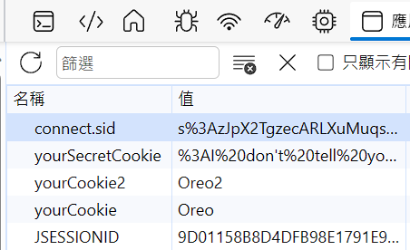

- 真的有多了一個sid !

### 假裝登入 模擬

```js
app.get("/secret", (req, res) => {
  if (!req.session.isVerified) {
    return res.send("請先登入才能看到內容");
  } else {
    return res.send("早餐吃什麼");
  }
});
app.get("/verifyUser", (req, res) => {
  req.session.isVerified = true;
  return res.send("你已經被驗證了!");
});
```

### 假裝登入 -變種 透過middleware方式

```js
const checkUser = (req, res, next) => {
  if (!req.session.isVerified) {
    return res.send("先驗證過才能看到內容");
  } else {
    next();
 }
};

app.get("/secret", checkUser, (req, res) => {
  return res.send("早餐吃什麼");
});
app.get("/verifyUser", (req, res) => {
  req.session.isVerified = true;
  return res.send("你已經被驗證了!");
});
```

# (326) dotenv

## 不要直接code放密碼

透過環境變數比較好。

## 步驟:

先安裝 `npm i dotenv` 

建立`.env`在root folder

```batch
COOKIEKEY="密碼，塞密碼就對了"
SESSONKEY="onimi5111"
```

之後`app2.js` 頂層套用

```js
require("dotenv").config();

app.use(cookieParser(process.env.COOKIEKEY));
app.use(
  session({
    secret: process.env.SESSIONKEY,
    resave: false,
    saveUninitialized: false,
    cookie: { secure: false }, //localhost無法https
  })
);
```

# (327) flash

一個儲存資料的地方，放在session，所以要設定。

## 文件的做法是下面

```js
var flash = require('connect-flash');
var app = express();

app.configure(function() {
  app.use(express.cookieParser('keyboard cat'));
  app.use(express.session({ cookie: { maxAge: 60000 }}));
  app.use(flash());
});
```

## 影片是新express作法

```js
app.use(cookieParser(process.env.COOKIEKEY));
app.use(
  session({
    secret: process.env.SESSIONKEY,
    resave: false,
    saveUninitialized: false,
    cookie: { secure: false }, //localhost無法https
  })
);
app.use(flash());
```

```js
app.get("/", (req, res) => {
  return res.send("這是首頁" + req.flash("info"));
});
```

```js
app.get("/flash", (req, res) => {
  req.flash("info", "flasssssssh Fish");
  res.redirect("/");
});
```

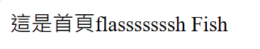

# 最終小考

## 問題 1：什麼是Cookie？

- 是便利商店賣的甜點。

- 是在網頁伺服器上的儲存空間。

- 是「餅乾」，非常好吃。

- 是伺服器傳送給瀏覽器，並在客戶端下次訪問同一網站時一同發回的一小段文字。🔥

## 問題 2：為了確保寄給客戶端的cookie沒有被篡改過，我們可以？

- 每天祈禱或是去廟裡拜拜，祈求所有的客戶都不會篡改cookie的內容。

- 把Cookie烤的難吃一點，這樣客戶端就不會想要把cookie拿出來了。

- 打電話去給客戶端，問說「你好，請問你有篡改過cookie的內容嗎？」如果客戶端說沒有，那就代表真的沒有被篡改過，不會有問題。

- 將Cookie做「簽名」。🔥

## 問題 3：在電腦科學中，以下何者不是好的雜湊函數應該要有以下的特點？

- 一致性：每次我們給 hash() 函數提供相同的輸入時，我們需要得到相同的輸出。不同長度的輸入也應該有相同長度的輸出。

- 分佈結果需要不均勻，這樣才能產生意想不到的效果。🔥

- 不可逆性：雜湊函數不應該是可逆的，不然很容易被破解。

- 雪崩效應：輸入的微小變化會導致輸出的巨大差異。 增加hash function的不可逆性。

### 做得很好！

應該要是均勻分佈：這樣的好處在於，可以減少hash collision的發生(hash collision是指兩個不同的input卻算出相同的hash value)。

## 問題 4：為了確保Cookies沒有在客戶端被篡改過，幫Cookies做簽名需要用到的演算法叫做？

- HMAC(Hashed MAC)🔥

- ECC (Elliptic curve cryptography)

- RSA

- Diffie-Hellman Key Exchange 

## 問題 5：關於Cookies and Storage的比較，以下何者錯誤？

- Storage運行在用戶端的儲存空間，而Cookies是給伺服器端讀取資料、保留使用者的偏好設置。

- Storage內的資料會自動隨著HTTP請求寄送到伺服器端🔥

- Cookies的資料大小是，對每個網站來說，最大4095 Bytes。

- Local Storage的資料不會過期

cookie才會
