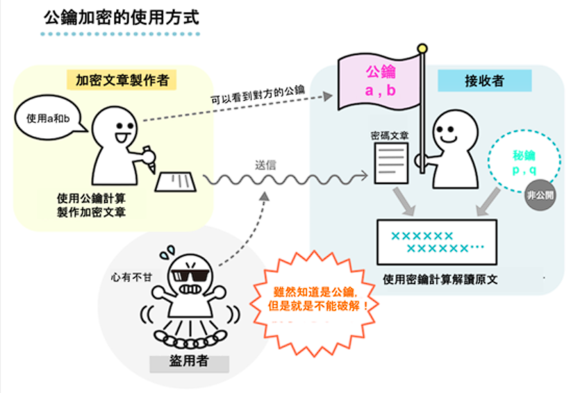
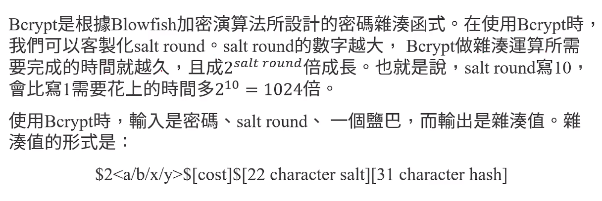
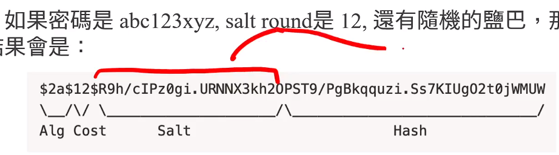
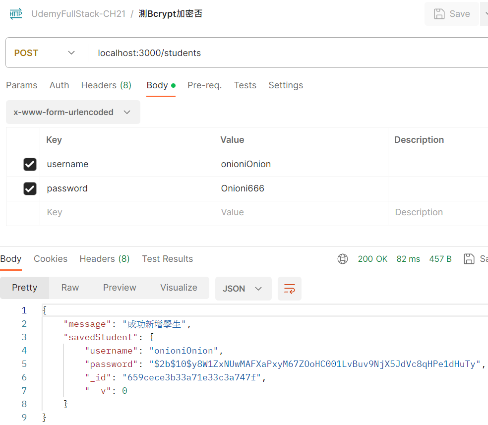
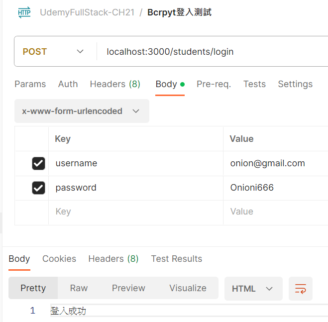
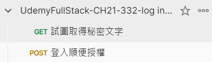

# (329) Authentication and Authorization

Authentication 認證

Authorization 授權

## 非對稱加密

`public key` 跟 `private key`分別是不同的功能

`public key`用來讓使用者加密 ，大家都看得到。

`private key`用來讓伺服器解密 ，只有伺服器持有。



> [什麼是公鑰加密？說明結構與RSA的計算方法 - OANDA Lab](https://www.oanda.com/bvi-ft/lab-education/cryptocurrency/public_key_cryptography/)　

- SSL

- 數位簽章

## OAuth介紹

開放授權=OAuth，是一個開放標準，允許使用者讓第三方app存取該user在某一網站上儲存的私密資源，例如相片、影片、聯絡人列表，且無須把user name password 提供給第三方。

# (330) 密碼學導論與密碼加鹽

## 純原始文字儲存密碼很糟糕!

最好先進行加密 ! 

## 使用hash，避免能反推原始密碼

雖然可能有hash collision ，但是可以避免原始密碼外洩。

## 別用SHA，因為它太快

所以駭客可以快速猜測，而且有可能🔥參考一萬種最常見的密碼🔥

- 所謂的 dictionary attack🔥

## rainbow table

包含許多密碼 >1億 及雜湊值的表

可以反推

最好算出雜湊值越長越好，這樣創建rainbow table就要越多成本

## Bcrypt 最有名

透過加鹽，可以讓相同password得到不同的 hash Value

因此別想透過 hash value去比較。

### 關於salt

隨機的鹽 會被存在hash中被Bcrypt知道 

驗證的時候會提出鹽 然後再進行加密 看看有沒有相同。

# (331) Bcrypt密碼處理



## 雜湊執形式

`$2<a/b/x/y>$[cost]$[22character salt][31 charater hash]` 

`cost`: salt round  的部分



`$2a$` : hash 演算法

`12` : Input cots i.e 4096 rounds 2^12次方

`R9h/cI....2O` : salt

`剩下` :hash

## node.js語法

### 1. bcrypt.genSalt(saltRounds, function(err, salt)

```js
bcrypt.genSalt(saltRounds, function(err, salt) {
    bcrypt.hash(myPlaintextPassword, salt, function(err, hash) {
        // Store hash in your password DB.
    });
});
```

### 2. bcrypt.hash(myPlaintextPassword, saltRounds, function(err, hash)

```js
bcrypt.hash(myPlaintextPassword, saltRounds, function(err, hash) {
    // Store hash in your password DB.
});
```

## 實際操作

### 記得安裝npm i bcrypt

### app.js

```js
app.get("/students", async (req, res) => {
  let foundStudent = await Student.find({}).exec();
  // console.log("找到了");
  return res.send(foundStudent);
});
app.post("/students", async (req, res) => {
  try {
    let { username, password } = req.body;
    let hashValue = bcrypt.hash(password, process.env.SALTROUNDs);
    let newStudent = new Student({ username, password: hashValue });
    let savedStudent = await newStudent.save();
    return res.send({ message: "成功新增學生" }, savedStudent);
  } catch (e) {
    return res.status(400).send(e);
  }
});
```

### student.js

```js
const mongoose = require("mongoose");
const { Schema } = mongoose; //從mongoose解構

const studentSchema = new Schema({
  username: {
    type: String,
    minlength: [6, "太短了"],
  },
  password: {
    type: String,
    minlength: [6, "太短了"],
  },
});

const Student = mongoose.model("Student", studentSchema);
module.exports = Student;
```



# (332) 登入系統

## 驗證雜湊值跟帳密是否相同!

```js
app.post("/students/login", async (req, res) => {
  try {
    let { username, password } = req.body;
    let data = await Student.findOne({ username }).exec();
    console.log("準備驗證");
    if (!data) {
      return res.status(404).send("查無使用者");
    } else {
      //如果右邊錯誤，直接沒反應，需要用catch
      let result = await bcrypt.compare(password);
      console.log(result);
      if (result) {
        return res.send("登入成功");
      } else {
        return res.send("登入失敗");
      }
    }
  } catch (e) {
    return res.status(400).send("失敗" + e);
  }
});
```

## 請注意不要只有印出e會失敗{}

會得到 {} 因為他是物件 

應該要stringify(e)或者 前面加上字串，讓它顯示文字

## compare(password, data.password);

記得放上右邊參數不然會失敗

- 失敗Error: data and hash arguments required

然後參數也不要`undefined`

- 失敗ReferenceError: Cannot access 'result' before initialization



## 搭配session持久登入/主動登出 (整體流程)

### middleware (verifyUser)

```js
const verifyUser = (req, res, next) => {
  if (!req.session.isVerified) {
    return res.send("先登入");
  } else {
    next();
  }
};
```

### 主體

```js
app.post("/students/login", async (req, res) => {
  try {
    let { username, password } = req.body;
    let data = await Student.findOne({ username }).exec();
    console.log("準備驗證");
    if (!data) {
      return res.status(404).send("查無使用者");
    } else {
      //如果右邊錯誤，直接沒反應，需要用catch
      let result = await bcrypt.compare(password, data.password);
      console.log(result);
      if (result) {
        req.session.isVerified = true;
        return res.send("登入成功");
      } else {
        req.session.isVerified = false;
        return res.send("登入失敗");
      }
    }
  } catch (e) {
    return res.status(400).send("失敗" + e);
  }
});
app.post("/students/logout", (req, res) => {
  req.session.isVerified = false;
  return res.send("已經登出");
});
app.get("/secret", verifyUser, async (req, res) => {
  return res.send("看得到我代表成功登入");
});
```

### 配合postman



#### 1. GET 試圖取得秘密文字

`GET > localhost:3000/secret` 

#### 2. POST 登入順便授權

`localhost:3000/students/login`

##### Body>x-www-form-urlencoded

`username` : `onion@gmail.com`

`password` : `Onioni666` 

#### 3. POST 登出

`localhost:3000/students/logout`

# (333) (進階課程) Blowfish演算法

對稱金鑰   分組加密  演算法

跟 DES AES 相似，都是分組加密演算法。

Blowfish 沒有商用限制 

分組大小為64bits 可變金鑰長度 32~448bits

演算法進行16輪加密操作

## 優點

新的金鑰都要進行4KB文字的pre process 

比其他AES DES 慢很多，所以可以抵抗字典攻擊或者rainbow table

## Bcrypt 根據 Blowfish演變而來

# 最終小考🔥

## 問題 1：

在我們的數據庫中以純文字的形式存儲密碼是一個非常糟糕的主意。以下何者為其原因？

- 若駭客駭入系統內部，就可以馬上看到所有用戶的密碼。

- 員工也可以訪問數據庫，看到所有用戶的密碼，可能會有資安疑慮。

- 由於很多人在多個網站上都會重複使用相同的密碼(並不是一個非常好的習慣)，若我們的數據庫內的密碼外洩，受影響的用戶的Google、 Facebook、銀行等帳戶可能都會同時遭到入侵。

- 以上皆是。🔥

## 問題 2：即使我們在將密碼保存到數據庫之前對密碼進行了雜湊函數轉換，仍然不安全。這是因為？

- 不確定，但心裡就是不踏實。。。

- 許多用戶會使用簡單的密碼，而駭客可以用彩虹表來比對，推算出用戶原本的密碼。🔥

- 因為課程講義是這樣寫的

- 我也不確定。

## 問題 3：在Bcrypt當中，salt round設定 n 或是 n+6，則完成運算的時間差會差多少倍？

- 6倍

- 64倍🔥

- 128倍

- n倍

## 問題 4：在Bcrypt當中，salt round設定 n 或是 3n，則完成運算的時間差會差多少倍？

- 4^n (也就是4的n次方)🔥 ???why  明明是8吧

- 2n

- n^2 (也就是n的平方)

- 3

哦哦 因為差了2n 所以 2^(2n)= 4^n

## 問題 5：Bcrypt演算法是基於何種演算法設計而成的？

- Blowfish🔥

- Starfish

- DES

- AES
