# (348) SPA

Single Page Application SPA

大概就是 Ajax 那種技術

## 優點:

減少server 生成HTML大量頻寬

核心得到餘裕，讓user自己的CPU去跑js就好。

## 缺點:

SPA 複雜，功能越多 越複雜、增加BUG

SEO 搜尋引擎優化會出問題，GOOGLE IE 的腳本不會運行 JS 加載數據，

# (349) Get Started with React

免費 且開源的 js框架

用UI組件 來架構user介面

FB 和 個人 開發維護

基本原理 : 透過js 生成畫面 

React native則是可以用於 ios android手機平台

React 常常和 另一個 Next.js 合作使用

初始版本=2013/9月 

## 好處:

### 1. 可以重複使用的組件 ( reusable components )

component 是 react 的核心架構。

創建UI 會更簡單 易於管理 也能重複使用節省時間

### 2. 無須更改整個DOM

更改網站 components 無須更改整個DOM，他是透過 virtual DOM完成的

虛擬的DOM 是 DOM的虛擬表示 或者copy

每次操作都會更新虛擬DOM，然後比較更新前後 ， 只更新受影像物件而不是刷新整個DOM ，網頁性能跟反應會更高。

### 3. JSX JavaScript XML

JSX  = js的語法擴展， 允許coder 在js中 寫入類似HTML的語法的程式碼

React 的工作就是將 JSX 轉換成 DOM 元素

## 框架的使用統計圖


## npx create-react-app myapp

可以安裝 `React` 專案

`npx` : 代表 Node Package Execution，npm內建功能。

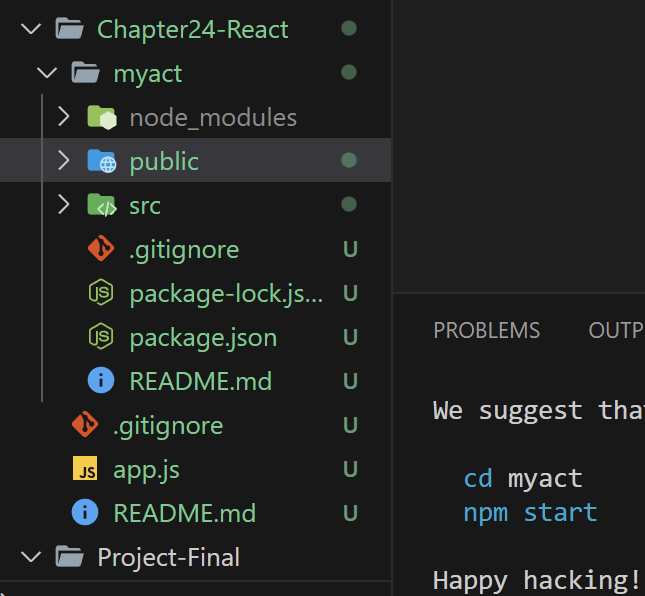

```batch
You can now view myact in the browser.

  Local:            http://localhost:3000
  On Your Network:  http://192.168.100.107:3000

Note that the development build is not optimized.
To create a production build, use npm run build.

webpack compiled successfully
```

- 這邊如果電腦跟手機同一個網域 則可以透過ip連接!

## 解釋REACT 內部資料夾

### public 內部

放置靜態檔案的地方

只留下 `index.html` 即可 

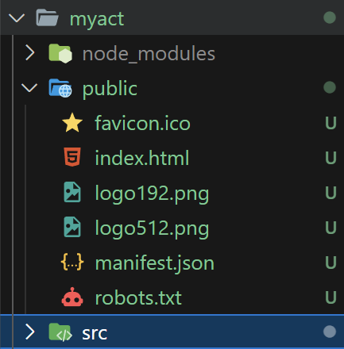

#### index.html 用不到的內容

`link icon` 刪除

`theme-color` 刪除 

`description` 刪除 

`<link rel="apple-touch-icon" />` 刪除

`manifest` 刪除

---

`<noscript>` 如果沒開啟js則會顯示告知需要開啟

### src 資料夾

`React` 的核心資料夾 :

包含`components` 

`index.js`  : 功能是將Component渲染到index.html id為root的標籤。

`App.js` : 製作 App Component ，其責任是根據不同URL route製作畫面。

#### src資料夾內暫用不到的檔案

`reportWebVitals.js`  : 監測跟報告網頁性能數據、加載時間...之類。

`index.css`  :  全域風格

`App.test.js`  :  單元測試使用

`App.css` : 主要負責3000開始看到的轉動畫面

`logo.svg` : 轉動的圖示

`setupTests.js` : 設定測試環境的setting。

#### index.js 改成以下 修剪一下

```js
import React from 'react';
import ReactDOM from 'react-dom/client';
import App from './App';

const root = ReactDOM.createRoot(document.getElementById('root'));
root.render(
  <React.StrictMode>
    <App />
  </React.StrictMode>
);
```

- `<React.StrictMode>` 內部要使用嚴謹的React語法填入畫面

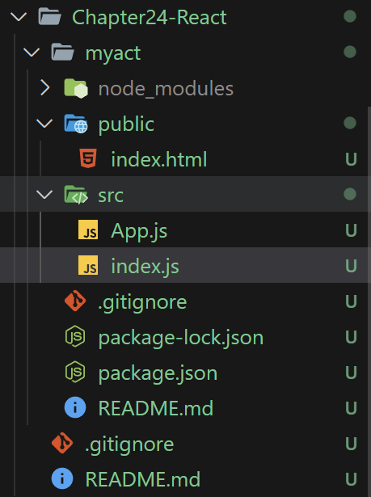

#### App.js 嘗試寫網頁


手動點取 換成 js react模式

這樣就會開啟輔助的功能

移除用不到的 import !

修改return 內容為以下

```js
function App() {
  return (
    <div>
      <h1>這是 app.js H1</h1>
    </div>
  );
}

export default App;
```

# (350) React專案環境設定

## 設定js 預設開啟為 jsreact

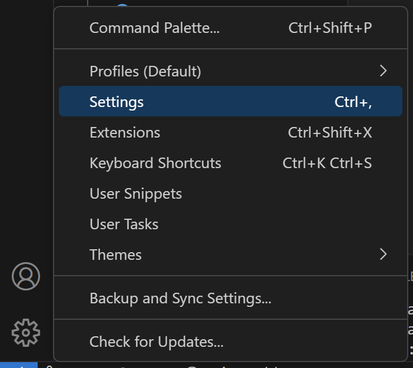

齒輪打開後 點右上方這個地方


### settings.json

裡面最後 加入 `files.associations` 的設定

還有 `javascriptreact` 預設的 `formatter` 為 `prettier`

```js
  "[javascriptreact]": {
    "editor.defaultFormatter": "esbenp.prettier-vscode"
  },
  "files.associations": {
    "*.js":"javascriptreact"
  }
  ,
  "code-runner.languageIdToFileExtensionMap": {
    "bat": ".bat",
    "powershell": ".ps1",
    "typescript": ".ts"
  }
}
```

## 設定 extensions 增加

`ES7+ React/Redux/React-Native snippets`

千萬次數下載的那個

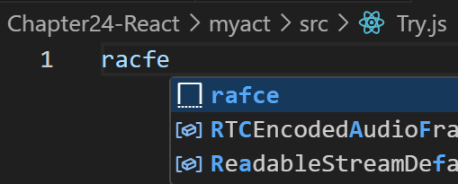

- 如果有安裝好就會出現提示字 (小抄) snippets

# (351) JSX語法第一部分

JSX 可以讓我們在 JS 內部使用類 HTML 程式碼製作Component

由於網頁瀏覽器無法理解 `JSX` 所以需要先 `JSX Transformation`

React Project Module 中 有 `babel`  直譯 喧嘩 ( 參雜各種語言的聲音 )

`babel`

屬於 JavaScript 編譯器，可以<u>將不是每個瀏覽器都理解的最新 Js功能 轉換為當前和舊瀏覽器、或者環境中向後兼容的 JS版本</u>。

在React 中負責將 JSX 語法 轉換為React Components。

## 按照步驟做:

...

前面都是基本，讓App.js能放入其他人的畫面
之後 嘗試使用 {} 語法
然後版本2的 info.js
版本3 的 更進階 方式

## info.js

### v1 版本

`rafce` 關鍵字 快速做出外觀

```js
import React from 'react'

const info = () => {
  return (
    <div>
        <h1>這是info組件</h1>
    </div>
  )
}

export default info
```

### v2 版本

```js
import React from "react";
const something = () => {
  return 100;
};
const info = () => {
  let friends = ["咪咪", "阿橘", "黑皮"];
  return (
    <div>
      <h1>這是info組件</h1>
      <h1>{5 * 10}</h1>
      <h1>{10}</h1>
      <h1>{Math.random()}</h1>
      <h1>{something()}</h1>
    </div>
  );
};
export default info;
```

### v3 版本

會自動去除 [ , , , ] 不要的部分，所以才會乾淨顯示

使用 let t=[1,2,3] 讓他住進去 `<p> {t} </p>` 

就會畫面出現 123 而不是 [1,2,3] 。

```js
const info = () => {
  let friends = ["咪咪", "阿橘", "黑皮"];
  return (
    <div>
      <p>朋友:</p>
      {friends.map((friend) => {
        return <p>{friend}</p>;
      })}
    </div>
  );
};
```

`乾淨的寫法` 減少使用return

```js
    <div>
      <p>朋友:</p>
      {friends.map((friend) => (
        <p>{friend}</p>
      ))}
    </div>
```

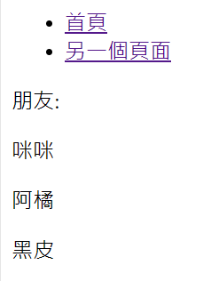

## nav.js

統一小寫好了 避免錯誤

```js
import React from "react";

const nav = () => {
  return (
    <nav>
      <ul>
        <li>
          <a href="#">首頁</a>
        </li>
        <li>
          <a href="#">另一個頁面</a>
        </li>
      </ul>
    </nav>
  );
};

export default nav;
```

## App.js 其他人的容器

透過 babel 把 JSX 編譯
一定要透過 `div` 放在這裡面 `div/`

```js
import Nav from "./nav";
import Info from "./info";
function App() {
  return (
    <div>
      <Nav />
      <Info />
    </div>
  );
}

export default App;
```

## JSX 特殊語法

在component塞入 Js語法

`statement` : 代表動作或指令

- 代表一個動作或指令，它並不返回值。
- 陳述式通常以分號 `;` 結尾。
- 例如，`if` 陳述式、`for` 迴圈、函數宣告、變數宣告等都是陳述式。
- 陳述式的目的是執行某些操作，而不是產生一個值。

`expression` : 會算出某個值的操作 包含四則運算、function

- 代表一個計算並返回值的操作。
- 表達式可以是單純的值、變數、函數呼叫、四則運算、邏輯運算等。
- 表達式的值可以被賦值給一個變數，或者作為另一個表達式的一部分。
- 函數是一種特殊的表達式，因為它可以返回一個值。

> An expression is something, while a statement does something.

### 1.  JSX 使用 { }

使用{ }  執行expression並return value

### 2. 保留字 避開class

HTML class屬性要改稱 className 因為class是JS 保留字

```batch
git commit -m "Ch23 section 351 JSX-1 ，初步使用JSX語法，建立info.js 跟 nav.js 兩個頁面，引入App.js中，info那邊則好好練習怎麼使用JSX語法"
```

# (352) JSX語法第二部分

承上，JSX 特殊語法 2 保留字

## Manipulate Flow

先講解保留字class 應該為 className

然後設定了`info.js`的 className=info

並且import  css進來使用

接著是`nav.js`的部分

使用 inline-style 

要使用 {{}}

## JSX 特殊語法

### 2. 保留字 避開class

HTML 的 class屬性要改稱 className 因為class是JS 保留字

另外要建立styles 資料夾

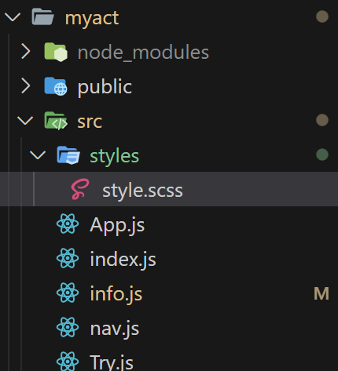

### 3. JSX inline-styling 注意事項

要給 expression 

style = {   {  }  } 外面是JSX expression 內部=JS 物件語法

## info.js

使用 className 而不是class

```js
import React from "react";
const something = () => {
  return 100;
};

const info = () => {
  let friends = ["咪咪", "阿橘", "黑皮"];
  return (
    <div className="info">
      <p>朋友:</p>
      {friends.map((friend) => (
        <p>{friend}</p>
      ))}
    </div>
  );
};

export default info;
```

## style.scss

```scss
.info {
  background-color: black;
  color: white;
}
```

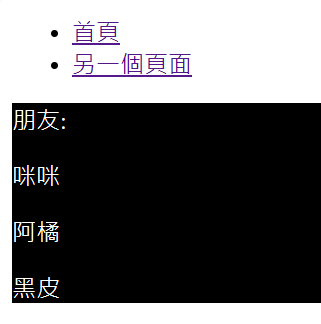

## nav.js

設定 style { { } } 、 `-` hyphen  改用 `CamelCase`  

e.g.  `background-color` : `backgroundColor`

```js
<nav style={{ color: "red" }}>
```

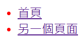

```js
<li>
    <a href="#" style={{ color: "red" }}>
```

只設定 a 連結紅字

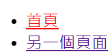

```js
<nav style={{ backgroundColor: "lightpink" }}>
```

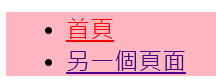

# (353) Props

## Manipulate Flow

app.js 使用的  Info 添加屬性跟值

然後 info.js 就可以拿來使用 

## 屬性 Props

也就是 `App.js` 的 Components 標籤部分，可以添加屬性!  

設定的參數會透過 `argument` 的方式傳給 `Component` 

參數會在 info的 參數那邊被傳入

以物件的形式 

`key` 就是 標籤內的 name 跟 age

`value` 就是標籤內 = `{ friends[0] }` 或者 `{ 3 }` 

## App.js

### 版本一

```js
import Nav from "./nav";
import Info from "./info";
function App() {
  let friends = ["咪咪", "阿橘", "黑皮"];
  return (
    <div>
      <Nav />
      <Info name={friends[0]} age={3} />
      <Info name={friends[1]} age={5} />
      <Info name={friends[2]} age={1} />
    </div>
  );
}

export default App;
```

### 版本二

```js
function App() {
  let friends = ["咪咪", "阿橘", "黑皮"];
  return (
    <div>
      <Nav />
      {friends.map((friend) => (
        <Info name={friend.name} age={friend.age} />
      ))}
    </div>
  );
}
```

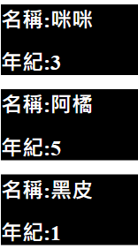

## nav.js

### 避開href="#" 錯誤題示

```js
const nav = () => {
  return (
    <nav style={{ backgroundColor: "lightpink" }}>
      <ul>
        <li>
          {
            // eslint-disable-next-line
            <a href="#" style={{ color: "red" }}>
              首頁
            </a>
          }
        </li>
        <li>
          {
            // eslint-disable-next-line
            <a href="#">另一個頁面</a>
          }
        </li>
      </ul>
    </nav>
  );
};
```

## index.js

造成多次顯示console的元兇是

React.StrictMode 之後會說

```js
<React.StrictMode>
    <App />
  </React.StrictMode>
```

## info.js🔥

這邊就可以取得 props 物件 取得App.js 套用的屬性值

```js
const info = (props) => {
  console.log(props);
  return (
    <div className="info">
      <h1>名稱:{props.name}</h1>
      <h1>年紀:{props.age}</h1>
    </div>
  );
};
```

> **也可以用 ({name}) =>{  console.log(name) }🔥**
> 
> 就不需要 props.name 了!

# (354) 事件處理

## Manipulate Flow

React 這邊跟 DOM element 處理事件也很相似

先講語法差異

## 事件處理的語法差異

### camelCase

不能使用 hyphen所以只能用camelCase

使用全部小寫 onclick 變成 onClick

### expression {}

`Dom` 使用 string 

```js
<button onclick="myFunction()"> 按我一下 </button>

<script>
    const myFunction=()=>{
    alert("你按了按鈕");
}
</script>
```

`React` 使用 {   } expression

```js
  const buttonHandler = () => {
    alert("你按了按鈕");
  };
  return (
    <div>
      <Nav />
      {friends.map((friend) => (
        <Info name={friend.name} age={friend.age} />
      ))}
      <button onClick={buttonHandler}>按我</button>
    </div>
  );
}
export default App;
```

## App.js

### 版本一 沒放參數而是Fn名稱

```js
import Nav from "./nav";
import Info from "./info";
function App() {
  let friends = ["咪咪", "阿橘", "黑皮"];
  const buttonHandler = () => {
    alert("你按了按鈕");
  };
  return (
    <div>
      <Nav />
      {friends.map((friend) => (
        <Info name={friend.name} age={friend.age} />
      ))}
      <button onClick={buttonHandler}>按我</button>
    </div>
  );
}

export default App;
```

### 版本二 嘗試放參數

```js
import Nav from "./nav";
import Info from "./info";
function App() {
  let friends = ["咪咪", "阿橘", "黑皮"];
  const buttonHandler = (msg) => {
    alert(msg);
  };
  return (
    <div>
      <Nav />
      {friends.map((friend) => (
        <Info name={friend.name} age={friend.age} />
      ))}
      <button onClick={buttonHandler("天氣不錯喔")}>按我</button>
    </div>
  );
}

export default App;
```

出現alert 好幾次 ( 因為react運作本來就會讀好幾次 )

buttonHandler如果放 ( ) 會造成React 讀取的時候 直接執行

buttonHandler( ) 這個function 。

只能放buttonHandler 才不會直接執行

#### 如果想要放參數的話?

{  ()=>Handler("今天天氣不錯")  }

裡面被當匿名函數 會之後才調用

```js
return (
    <div>
      <Nav />
      {friends.map((friend) => (
        <Info name={friend.name} age={friend.age} />
      ))}
      <button onClick={() => buttonHandler("天氣不錯喔")}>按我</button>
    </div>
  );
```

# (355) State

## chrome , edge可以擴充功能

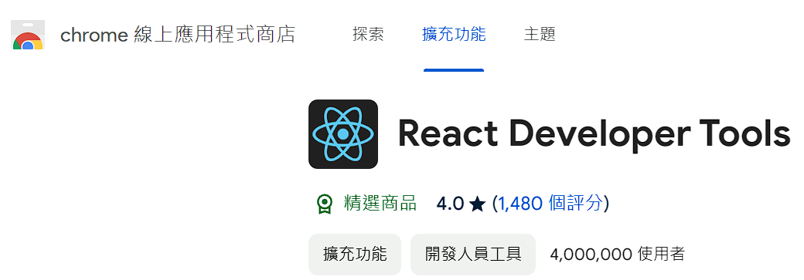

可以查看f12

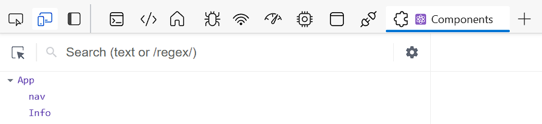 

重新連線才可以 localhost:3000

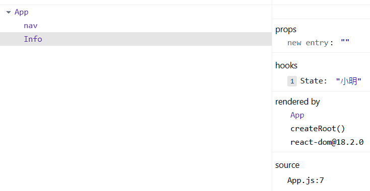

可以看到hooks 、State

## Manipulate Flow

看完介紹

`App.js`

先刪除 之前的複雜東西，直到以下再開始跟著做

```js
function App() {
  return (
    <div>
      <Nav />
      <Info />
    </div>
  );
}
```

`info.js`

初步改寫，但是不使用state所以不會重新渲染

第二次改寫，使用state

React.ustState ，因為我們用{useState} 所以可以快速解構

另外 const info 應該用大寫否則會出錯

再來是內部有用到陣列快速解構的觀念

## 背景介紹

React 好處在於可以只更改必須改變的Components，無須更改整個DOM

`State` 就是 實現這件事情的。

State 透過 React Hooks中的 useState達成。

React 中 ，State 是 Component所持有的物件，可被改變。

如果State被改變，持有它的Component就會全部重新Rerender

> **<u>React Components 的props 或 state改變 都會重新render</u>**

### Hooks

React 16.8新功能 可以不編寫class的情況下使用 State和其他React功能

class是舊版本的React常見語法。

Hooks在class內部無法起作用。

可以理解為 Hooks是 從 function component中 鉤入

React State 和生命週期特性 的函數

> 以前使用的是 <u>**Class Component**</u>
> 
> 現在使用 **<u>Functional Component</u>** 

`class component` : 

State , Props => 功能

`functional component` : 

useState , useEffect => 功能對應 在這邊稱作Hooks

1.function App(){ return ...} export default App;

2.const Info=()=>{...}

## State語法

`const [name,setName] = useState(initialValue)` 

`name`       : state的名稱 可以隨意稱呼

`setName` : 更新state時，使用的函數

`initialValue` : name ( state ) 持有的初始值

## info.js

### 第一次改寫 不使用state

並不會有成功改寫的跡象 因為不會重新渲染

```js
import React from "react";
import "./styles/style.css";

const info = () => {
  let name = "小名";
  let age = 20;
  const changeNameHandler = () => {
    name += "先生";
  };
  return (
    <div className="info">
      <h1>名稱:{name}</h1>
      <h1>年紀:{age}</h1>
      <button onClick={changeNameHandler}>改名按鈕</button>
    </div>
  );
};

export default info;
```

### 第二次改寫 使用state

讓狀態能被察覺需要重寫，先要import功能

另外 const info要用 大寫才能 const Info

#### 需要import {useState}

`import React,{useState} from "react";` 

解構的寫法就不需要 `React.ustState()` 

#### 快速解構陣列

`let [name, setName] = useState("小明")` 

因為回傳的是陣列 這個寫法可以快速取得陣列前兩者 

```js
import React, { useState } from "react";
import "./styles/style.css";

const Info = () => {
  let [name, setName] = useState("小明");
  let age = 20;
  const changeNameHandler = () => {
    setName("小明星");
  };
  return (
    <div className="info">
      <h1>名稱:{name}</h1>
      <h1>年紀:{age}</h1>
      <button onClick={changeNameHandler}>改名按鈕</button>
    </div>
  );
};

export default Info;
```

## err

遇到錯誤

> React Hook names must start with the word "use" react-hooks/rules-of-hooks

這邊const info 應該要用大寫 Info

然後export default Info ;這樣

# (356) State Lifting

希望兩個 Component間 可以共享某個state

如果兩者屬於不同鏈，同層級  `或`  不同鏈，不同層級

則將state往兩邊最近的common ancestor (ancestor component)移動

稱作 state lifting

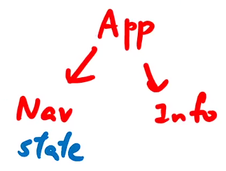

上圖就是不同鏈 但同層級的意思

## Work Flow

大致講解之後

`App.js`  

移除Nav (用不到)

創造新的叫做 Create.js

`Create.js` 

有三個版本 按照順序往下讀

第一個版本就是preventDefault

第二個版本    setMessages(input)

第三個版本    setMessages([...messages,input]); 

練習解構 spread syntax 用法

`Create.js` `版本4` 搭配 `App.js`   `版本2`

目的是讓 State 也可以傳遞給另一個Component 

接著跳到 `info.js`  刪除之前的內容

`App.js` `版本3` 搭配 `info.js` 

透過map 確實可以每次 messages有所改變 都會重新render畫面!🔥

結果出現錯誤說 

> **<u>Warning: Each child in a list should have a unique "key" prop.</u>** Check the render method of `Info`. See https://reactjs.org/link/warning-keys for more information. at p at Info (http://localhost:3000/main.1269bd3d6a6b9123f2eb.hot-update.js:26:3) at div at App (http://localhost:3000/main.e56b908553d9a8c9c303.hot-update.js:31:80)

他希望我們加上 unique key  給標籤

然後就不會報錯了

## App.js

### 版本1 配合Create1~3

nav先弄掉了

```js
// import Nav from "./nav";
import Info from "./info";
import Create from "./Create";
function App() {
  return (
    <div>
      <Create />
      <Info />
    </div>
  );
}
export default App;
```

### 版本2 配合Create4

為了傳遞 State 

```js
function App() {
  let [messages, setMessages] = useState([]); //初始值為空arr

  return (
    <div>
      <Create messages={messages} setMessages={setMessages} />
      <Info />
    </div>
  );
}
```

### 版本3 配合info.js

就只是傳遞過去而已

```js
function App() {
  let [messages, setMessages] = useState([]); //初始值為空arr
  return (
    <div>
      <Create messages={messages} setMessages={setMessages} />
      <Info messages={messages} setMessages={setMessages} />
    </div>
  );
}
```

## Create.js   Versions

### 1. 簡單使用preventDefault

preventDefault了以後，按鈕按下去就不會刷新頁面 (送出)

```js
import React from "react";

const Create = () => {
  const submitButtonHandler = (e) => {
    e.preventDefault();
  };
  return (
    <form>
      <input type="text" />
      <button onClick={submitButtonHandler}>Submit</button>
    </form>
  );
};

export default Create;
```

### 2. useState 開始要著手

會看得到差別，我們這邊使用兩個on去監聽 

onChange監聽輸入

onClick 監聽按鈕

value= {input} 讓每次畫面Rerender時候，重新渲染要跟input一致

- 在這邊的作用是submit之後 變回空白，讓人感受有送出的感覺

```js
import React, { useState } from "react";

const Create = () => {
  let [input, setInput] = useState("");
  let [messages, setMessages] = useState([]); //初始值為空arr
  const submitButtonHandler = (e) => {
    e.preventDefault();
    // let v = e.target.parentElement.querySelector("input").value;
    // 取得text input文字.... 改用監聽onChange比較能看出差異
    setMessages([...messages, input]);
    setInput(""); //按鈕後清空input
  };
  const inputHandler = (e) => {
    console.log(e.target.value);
    setInput(e.target.value);
  };
  return (
    <form>
      <input onChange={inputHandler} value={input} type="text" />
      <button onClick={submitButtonHandler}>Submit</button>
    </form>
  );
};

export default Create;
```

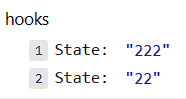

### 3. useState

也順便練習Spread Operator Array 作法

```js
setMessages([...messages, input]);
```

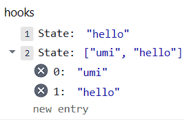

### 4. 使用參數傳入 (useState放到App.js)

```js
const Create = ({ messages, setMessages }) => {
  let [input, setInput] = useState("");
  const submitButtonHandler = (e) => {
    e.preventDefault();
    // let v = e.target.parentElement.querySelector("input").value;
    // 取得text input文字.... 改用監聽onChange比較能看出差異
    setMessages([...messages, input]);
    setInput(""); //按鈕後清空input
  };
```

## info.js

### 版本一

這邊先把之前的內容刪除了，準備改寫

結果發現會有錯誤

> 他希望我們加上 unique key 給標籤
> 
> 如果有做 就不會warning

```js
// import React, { useState } from "react";
import "./styles/style.css";

const Info = ({ messages, setMessages }) => {
  return (
    <div className="info">
      {messages.map((m) => (
        <p>學習內容:{m}</p>
      ))}
    </div>
  );
};

export default Info;
```

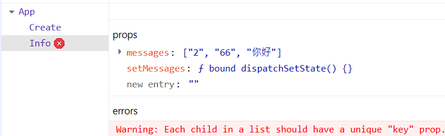

### 版本二

想讓warn消失 

替 tag 加上 key ( unique ) 就可以

```js
const Info = ({ messages, setMessages }) => {
  return (
    <div className="info">
      {messages.map((m, index) => (
        <p key={index}>學習內容:{m}</p>
      ))}
    </div>
  );
};
```

# (357) useEffect

## Work Flow

先介紹函數行為

接著介紹useEffect

介紹完之後

`App.js` 

刪除之前做的東西，練習userEffect

## 函數行為介紹

### 1. return value

計算或者找出某個值，從函數內傳出。

### 2. side effect

函數用來做某事的話，稱為side effect，例如讀取寫入 資料庫

### O.補充敘述

常見的有side effect有 API fetch數據，使用setTimeout之類的計時函數。

React 當中，functional component 如果想要做side effect可以使用

useEffect這個hook。

## useEffect語法

### useEffect ( myfunction , dependencies )

Dependencies是一個 array of states 

#### dependencies = [ ]⭐⭐⭐⭐

Component 第一次被render的時候

就會執行 `myfunction`一次

#### dependencies = [name] ⭐⭐⭐⭐

行為跟上面一樣

另外每次 `name` 這個 `state` 更新也會重新執行 `myfunction` 一次

## App.js

### 第一版本🔥dependencies不放參數🔥

把之前的稍為改成以下，為了使用useEffect

執行兩次是因為`index.js` 使用StrictMode 導致

🔥dependencies不放參數🔥

```js
import { useState, useEffect } from "react";
function App() {
  let [myName, setMyName] = useState("Oni");
  const buttonHandler = () => {
    setMyName("Umi");
  };
  useEffect(() => { 
    console.log("useEffect內部的fn執行中");⭐⭐⭐⭐
  }, []);
  return (
    <div>
      <h1>{myName}</h1>
      <button onClick={buttonHandler}>改變姓名</button>
    </div>
  );
}

export default App;
```

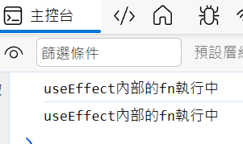

### 第二版本🔥dependencies 放myName🔥

我沒拿掉 React.RestrictMode 所以一開始會跑兩次出來💡💡

但是我按按鈕後，會多一次💡

案很多次也不會增加了，只會有三個 ， 因為myName沒有實際改變。💡

```js
useEffect(() => {
    console.log("useEffect內部的fn執行中");
  }, [myName]);
```

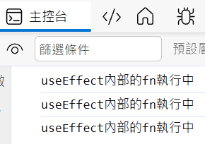


## 結論

使用App.js去做，這個函數第一參數是function，第二則是放state的位置，陣列，可以空=執行一次函數，有參數則參數變化時，執行函數"

# (358) (進階課程) Class Component, Life Cycle

## Work Flow🏆

先看簡介

介紹語法

`App.js` 清乾淨 ，然後建立 `Car.js`

`Car.js` 

`App.js` `v2` 搭配 `Car.js` `v3`

然後一路做到 `v5` 

`Car` `v5-3` 註解就寫得不錯🔥🔥🔥🔥

講解生命週期

`Car` `v6` 搭配生命週期

## 簡介🏆

### React 16 之前

React 16之前，Component製作只有一種方式 `class component`

其內部帶有state跟component生命週期有關的函數。

### React 16.8 之後

`出現Hooks`

不需要使用 class component的寫法，不過還是有很多舊專案有用到

## class component 語法🏆

render函數可以定義Component的 `JSX` 架構

也可以初始化某些屬性 需要用到 `constructor()`

大致如下

```javascript
class Car extends React.Component{
    render(){
        return <h2> Hi ,I am a Car!</h2>
    }
}
```

## App.js🏆

### version 1

清空，方便作業

```js
import Car from "./Car";
function App() {
  return (
    <div>
      <Car />
    </div>
  );
}
export default App;
```

### version 2

填入props而已

```js
import Car from "./Car";
function App() {
  return (
    <div>
      <Car brand="toyota" />
    </div>
  );
}

export default App;
```

## Car.js🏆

### 版一

```js
import React from "react";
class Car extends React.Component {
  render() {
    return <h2>我是一台車</h2>;
  }
}
export default Car;
```

### 版二，加入state、constructor

```js
import React from "react";
class Car extends React.Component {
  constructor() {
    super();
    this.state = { color: "綠色" };
  }
  render() {
    return <h2>我是一台 {this.state.color} 車</h2>;
  }
}
export default Car;
```


### 版3 ，使用Props

`App.js` 要記得傳入prop

然後下面這邊要 super上去 constructor也要props，取得一下obj

```js
import React from "react";
class Car extends React.Component {
  constructor(props) {
    super(props);
    this.state = { color: "綠色" };
  }
  render() {
    return (
      <h2>
        我是一台{this.props.brand} {this.state.color} 車
      </h2>
    );
  }
}
export default Car;
```

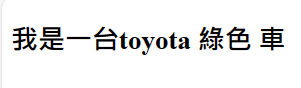

### 版本4 ，有錯誤的版本 多了按鈕功能換色

> 因為 React 機掰 ，為了確認我知道不可以用傳統函數 
> 
> 或者    用了傳統函數要手動綁定
> 
> 或者    乾脆用arrow fn

後續版本會教你怎麼辦

```js
import React from "react";
class Car extends React.Component {
  constructor(props) {
    super(props);
    this.state = { color: "綠色" };
  }
  buttonHandler() {
    this.setState({ color: "白色" });
  }
  render() {
    return (
      <div>
        <h2>
          我是一台{this.props.brand} {this.state.color} 車
        </h2>
        <button onClick={this.buttonHandler}> 改變顏色 </button>
      </div>
    );
  }
}
export default Car;
```

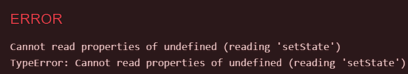

### 版本五 解決錯誤後

加入 bind 讓React 建立的時候自動替function buttonHandler綁定React本身

#### 兩方法 1號

手動綁定，讓傳統function的this被覆蓋

原本好像被設定成 undefined了

```js
constructor(props) {
    super(props);
    this.state = { color: "綠色" };
    this.buttonHandler = this.buttonHandler.bind(this);
  }
```

#### 兩方法 2號

透過箭頭函數

因為button本身是arrow 所以沒有this 它會去捕捉別人的this 
因為 如果用箭頭函數 它就直接

```js
buttonHandler = () => {
    this.setState({ color: "白色" });
  };
```

#### 整體概觀 3號

```js
import React from "react";
class Car extends React.Component {
  constructor(props) {
    super(props);
    this.state = { color: "綠色" };
    this.buttonHandler = this.buttonHandler.bind(this);
  }
  // 沒被指定所以沒ˊ關係，this不怕被置換 .call(null,event)的事情
  getMyself() {
    return this.state;
  }
  // 因為是被指定為事件監聽使用的函數
  //需要透過arrow fn來做static binding 或者強行手動綁定
  buttonHandler() {
    console.log(this.state);
    this.setState({ color: "白色" });
  }
  render() {
    return (
      <div>
        <h2>
          我是一台{this.props.brand} {this.state.color} 車
        </h2>
        <button onClick={this.buttonHandler}> 改變顏色 </button>
        <p>不綁事件監聽的component函數中this為{this.getMyself().color}</p>
      </div>
    );
  }
}
export default Car;
```

### 版本六 搭配life cycle

```js
class Car extends React.Component {
  constructor(props) {
    super(props);
    this.state = { color: "綠色" };
    this.buttonHandler = this.buttonHandler.bind(this);
  }
  componentDidMount() {
    console.log("車子有被渲染");
  }
  componentDidUpdate() {
    console.log("車子狀態更新");
  }
```

## 上面重要資訊、重點!🏆⭐⭐⭐⭐⭐⭐⭐⭐⭐⭐

> [這就是為什麼我們需要在 React 的類元件中綁定事件處理程式 (freecodecamp.org)](https://www.freecodecamp.org/news/this-is-why-we-need-to-bind-event-handlers-in-class-components-in-react-f7ea1a6f93eb/) 

---

`buttonHandler` 因為是傳統函數 所以自帶 `this` ，而不屬於 `static binding`

`this` 的指向會根據呼叫者而改變

如果想要綁定要使用 `bind` 才不會因環境而影響

- 因為我們 onClick 是屬於事件觸發，React 內部 呼叫component可能不是透過obj.buttonHandler呼叫，所以需要綁定。
- ⭐`React` 內部比較像是下面這樣⭐ ，因為不是透過物件呼叫，所以this失蹤

```js
let myfield_function = componentInstance.buttonHandler;
myfield_function.call(null, event);
```

### 回憶傳統的方式:

> 先說明一下簡單事

js如果函數不是作為物件的方法被調用，則內部this指向 global

`作為對象的方法調用`  = obj 、`普通函數調用` = global

#### 綁定方式:

##### 1.static Binding :

arrow fn，沒有自己的this，捕獲最近的外部this。

一開始創建就會確定了

##### 2.Dynamic Binding:

function 傳統函數的方式，會製作自己的this，指向直屬 物件。

如果是透過物件呼叫函數，則this指向物件。

如果獨立呼叫函數，則指向global。

## Component Life Cycle生命週期🏆

每個component都有一個生命週期，主要有三個階段

能監控跟操作

### componentDidMount()

component被mount (加入DOMtree中) 後，componentDidMount()會馬上被呼叫。

### componentDidUpdate()

會在更新後馬上被呼叫，不會在初次render被呼叫。

### componentWillUnmount()

component即將被unmount時會呼叫。

### 其他注意事項

React的 dev mode下，`<React.StrictMode>` 

會讓 componentDidMount 執行兩次

除了這三個 ，還有許多其他lif cycle，有需要再去讀

---

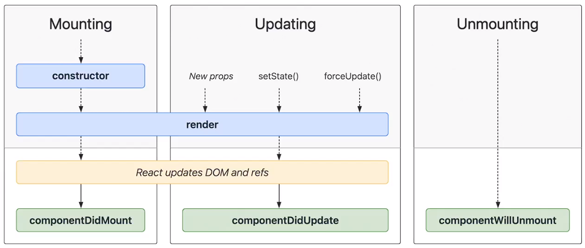


### 如果熟悉life cycle

> **根據React文件，如果熟悉React class生命週期方法，可以把useEffect視為** 
> 
> <u>**componentDidMount，componentDidUpdate，componentWillUnmount** </u>
> 
> **的組合** 

#### 例如

`useEffect` 第`2`個參數放入 empty array 效果類似

> componentDidMount

`useEffect` 第`2`個參數放入 [ state ]  效果類似

> ComponentDidMount    +    componentDidUpdate

## GPT 我認為比較準確的說明🔥🔥🔥

在React中，事件處理函數（如`onClick`中的`buttonHandler`）的執行上下文（`this`的值）可能取決於函數如何被定義和使用。在你的程式碼中，`getMyself` 和 `buttonHandler` 之間的不同之處在於函數的定義方式。

`getMyself` 是一個普通的函數，它在類的內部被定義，並且它的執行上下文會被綁定到該類的實例。當你呼叫 `this.getMyself()` 時，`this` 指向的是當前 `Car` 類的實例，因此 `getMyself` 函數能夠正確地訪問到該實例的 `state`。

然而，`buttonHandler` 是一個🔥普通的方法，它沒有被綁定到類實例🔥。當你將它傳遞給 `onClick` 事件時，React 將它視為一個普通函數，並在調用時將其執行上下文設置為 `undefined` 或全局對象（取決於嚴格模式等因素）。這就是為什麼在 `buttonHandler` 中的 `this.state` 可能為 `undefined`。

使用箭頭函數語法或者在構造函數中使用 `.bind()` 方法都是為了確保事件處理函數中的 `this` 正確地指向類的實例，從而能夠訪問到該實例的 `state`。這就是在前面的例子中將 `buttonHandler` 定義為箭頭函數的原因。

---

在JavaScript中，函數的 `this` 關鍵字的值是在函數被呼叫的時候確定的，這取決於呼叫方式。當函數被作為對象的方法呼叫時，`this` 會指向該對象；但當它被作為一個普通函數呼叫時，`this` 的值可能會指向全局對象（在浏覽器中是 `window`），或者在嚴格模式下是 `undefined`。

在React中，🔥當你將一個方法作為事件處理函數傳遞給React元素的事件屬性時，React會將該方法視為普通函數🔥。這是因為React在調用該函數時，使用的方式不是作為對象的方法，而是🔥作為一個獨立的函數🔥。因此，React不會自動將其綁定到類實例，這就是為什麼在事件處理函數中使用 `this` 時可能會遇到問題的原因。

為了確保事件處理函數中的 `this` 正確地指向類的實例，你可以使用箭頭函數語法，因為箭頭函數會自動捕獲它們被創建時的上下文。這樣，無論在哪裡調用該函數，它都會保持對類實例的正確引用。

---


### You⭐⭐⭐

錯了吧
我猜應該是myfield_function.call(null, event);⭐

### ChatGPT⭐⭐⭐

抱歉，我的前一個回答中有點混淆。你的猜測是正確的。

在React中，實際上是使用`null`作為`call`方法的第一個參數，而不是傳遞`componentInstance`。React的實現方式是透過特殊的語法來處理這個問題，而不是使用真正的`call`方法。這個特殊的語法保證了在事件處理函數中，`this` 正確地指向React元件的實例。

實際上，React內部使用了類似於以下的程式碼：

```js
let myfield_function = componentInstance.buttonHandler;
myfield_function.call(null, event);
```

因此，你的理解是正確的，我對混淆的回答表示歉意。感謝你的指正。

# (359) React Router

## Work Flow 🏆

為了讓畫面根據 route 轉換

需要使用 react-router-dom

`App.js` 身為所有 component的容器

從它先下手 `App.js` `v1`  初步作業

之後創建`Layout.js` 

`Layout.js` `v1` 填 Link 、Outlet

回到 `App.js` 

`App.js` `v2`  加入 `Layout` `v1` 進來 ，

要創建 `Homepage.js` 、 `About.js`  、`Page404` (基本畫面div文字)

`App.js` `v2`  + 上面 3 者 。

## 安裝 react-router-dom🏆

## App.js🏆

### v1

初步作外觀出來

先引用 `react-router-dom` 然後解構出

`BrowserRouter` 、`Routes` 、`Route`

```js
import Car from "./Car";
import {BrowserRouter,Routes,Route} from "react-router-dom";

function App() {
  return (
    <BrowserRouter>
      <Routes>

      </Routes>
    </BrowserRouter>
  );
}

export default App;
```

### v2 把 Layout加入💡

注意字不要打錯 prop打錯不會直接跟你說error明顯提示💡

例如element  我打成elemnet 所以沒畫面💡💡

```js
// import Car from "./Car";
import { BrowserRouter, Routes, Route } from "react-router-dom";
import Layout from "./Layout";
import Homepage from "./Homepage";
import About from "./About";
import Page404 from "./Page404";
function App() {
  return (
    <BrowserRouter>
      <Routes>
        <Route path="/" element={<Layout />}>
          <Route index element={<Homepage />}></Route>
          <Route path="about" element={<About />}></Route>
          <Route path="*" element={<Page404 />}></Route>
        </Route>
      </Routes>
    </BrowserRouter>
  );
}

export default App;
```

## Layout.js

先引用 `react-router-dom` 然後解構出

`Outlet` 、`Link` 

```js
import { Outlet, Link } from "react-router-dom";
import React from "react";

import React from "react";

const Layout = () => {
  return (
    <div>
      <nav>
        <ul>
          <li>
            <Link to="/">首頁 </Link>
          </li>
          <li>
            <Link to="/about">關於這個網站 </Link>
          </li>
        </ul>
      </nav>
      <Outlet />
    </div>
  );
};

export default Layout;
```

## Homepage.js

rafce 乾乾淨淨如下

```js
import React from "react";

const Homepage = () => {
  return <div>Homepage</div>;
};

export default Homepage;
```

## About.js

同上

## Page404.js

同上

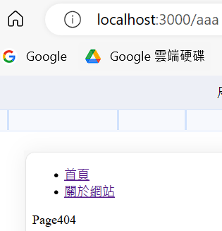

# 最終小考

## 問題 1：

以下何者不是使用SPA的優點？

- 減少了伺服器的負載

- 減少需要通過網絡傳輸的數據量

- 對SEO有非常大的幫助🔥

- 不需要重新整理頁面，即可更新網頁內容

## 問題 2：以下何者不是市面上的SPA製作框架？

- React.js

- Vue.js

- Django🔥

- Angular.js

## 問題 3：React是由哪個公司所發行的？

- Google

- Apple

- Amazon

- Facebook (or Meta)🔥

## 問題 4：以下JavaScript語法，何者不是express?

- `3 + 6`  

- `[2, 3, 4, 5].push(6)`  🔥

- `x`  

- 1. if (true) {  ⚠️  if statement不算⚠️💡💡💡💡
  2. // something here...
  3. }

## 問題 5：在JSX當中，HTML的標籤內，class屬性都需要改叫做className。這是因為？

- class這個字在JavaScript內部是個保留字，所以不能直接寫class。🔥

- React的開發者討厭class這個屬性。

- React使用者之間的不成文規定。

- class這個字會被誤會成「班級」，所以應該要避免使用。
