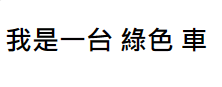
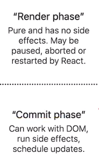

# (348) SPA

Single Page Application SPA

大概就是 Ajax 那種技術

## 優é»:

減少server 生æˆHTML大é‡é »å¯¬

核心得到餘裕，讓user自己的CPUå»è·‘js就好。

## 缺é»:

SPA 複雜，功能越多 越複雜ã€å¢åŠ BUG

SEO æœå°‹å¼•æ“優化會出å•é¡Œï¼ŒGOOGLE IE 的腳本ä¸æœƒé‹è¡Œ JS 加載數據，

# (349) Get Started with React

å…è²» 且開æºçš„ js框æ¶

用UI組件 來æ¶æ§‹user介é¢

FB 和 個人 開發維護

基本åŸç† : é€éjs 生æˆç•«é¢ 

React native則是å¯ä»¥ç”¨æ–¼ ios android手機平å°

React 常常和 å¦ä¸€å€‹ Next.js åˆä½œä½¿ç”¨

åˆå§‹ç‰ˆæœ¬=2013/9月 

## 好處:

### 1. å¯ä»¥é‡è¤‡ä½¿ç”¨çš„組件 ( reusable components )

component 是 react 的核心æ¶æ§‹ã€‚

創建UI 會更簡單 æ˜“æ–¼ç®¡ç† ä¹Ÿèƒ½é‡è¤‡ä½¿ç”¨ç¯€çœæ™‚é–“

### 2. 無須更改整個DOM

更改網站 components 無須更改整個DOM，他是é€é virtual DOM完æˆçš„

虛擬的DOM 是 DOM的虛擬表示 或者copy

æ¯æ¬¡æ“作都會更新虛擬DOM，然後比較更新å‰å¾Œ ， åªæ›´æ–°å—å½±åƒç‰©ä»¶è€Œä¸æ˜¯åˆ·æ–°æ•´å€‹DOM ，網é æ€§èƒ½è·Ÿå應會更高。

### 3. JSX JavaScript XML

JSX  = jsçš„èªæ³•æ“´å±•ï¼Œ å…許coder 在js中 寫入é¡ä¼¼HTMLçš„èªæ³•çš„程å¼ç¢¼

React 的工作就是將 JSX 轉æ›æˆ DOM 元素

## 框æ¶çš„使用統計圖


## npx create-react-app myapp

å¯ä»¥å®‰è£ `React` 專案

`npx` : 代表 Node Package Execution，npm內建功能。


```batch
You can now view myact in the browser.

  Local:            http://localhost:3000
  On Your Network:  http://192.168.100.107:3000

Note that the development build is not optimized.
To create a production build, use npm run build.

webpack compiled successfully
```

- 這邊如æœé›»è…¦è·Ÿæ‰‹æ©ŸåŒä¸€å€‹ç¶²åŸŸ 則å¯ä»¥é€éip連æ¥!

## 解釋REACT 內部資料夾

### public 內部

放置éœæ…‹æª”案的地方

åªç•™ä¸‹ `index.html` å³å¯ 


#### index.html 用ä¸åˆ°çš„內容

`link icon` 刪除

`theme-color` 刪除 

`description` 刪除 

`<link rel="apple-touch-icon" />` 刪除

`manifest` 刪除

---

`<noscript>` 如æœæ²’é–‹å•Ÿjs則會顯示告知需è¦é–‹å•Ÿ

### src 資料夾

`React` 的核心資料夾 :

包å«`components` 

`index.js`  : 功能是將Component渲染到index.html id為root的標籤。

`App.js` : 製作 App Component ，其責任是根據ä¸åŒURL route製作畫é¢ã€‚

#### src資料夾內暫用ä¸åˆ°çš„檔案

`reportWebVitals.js`  : 監測跟報告網é æ€§èƒ½æ•¸æ“šã€åŠ è¼‰æ™‚é–“...之é¡ã€‚

`index.css`  :  全域風格

`App.test.js`  :  單元測試使用

`App.css` : 主è¦è² è²¬3000開始看到的轉動畫é¢

`logo.svg` : 轉動的圖示

`setupTests.js` : 設定測試環境的setting。

#### index.js 改æˆä»¥ä¸‹ 修剪一下

```js
import React from 'react';
import ReactDOM from 'react-dom/client';
import App from './App';

const root = ReactDOM.createRoot(document.getElementById('root'));
root.render(
  <React.StrictMode>
    <App />
  </React.StrictMode>
);
```

- `<React.StrictMode>` 內部è¦ä½¿ç”¨åš´è¬¹çš„Reactèªæ³•å¡«å…¥ç•«é¢


#### App.js 嘗試寫網é 


手動é»å– æ›æˆ js react模å¼

這樣就會開啟輔助的功能

移除用ä¸åˆ°çš„ import !

修改return 內容為以下

```js
function App() {
  return (
    <div>
      <h1>這是 app.js H1</h1>
    </div>
  );
}

export default App;
```

# (350) React專案環境設定

## 設定js é è¨­é–‹å•Ÿç‚º jsreact


齒輪打開後 é»å³ä¸Šæ–¹é€™å€‹åœ°æ–¹


### settings.json

裡é¢æœ€å¾Œ 加入 `files.associations` 的設定

還有 `javascriptreact` é è¨­çš„ `formatter` 為 `prettier`

```js
  "[javascriptreact]": {
    "editor.defaultFormatter": "esbenp.prettier-vscode"
  },
  "files.associations": {
    "*.js":"javascriptreact"
  }
  ,
  "code-runner.languageIdToFileExtensionMap": {
    "bat": ".bat",
    "powershell": ".ps1",
    "typescript": ".ts"
  }
}
```

## 設定 extensions å¢åŠ 

`ES7+ React/Redux/React-Native snippets`

åƒè¬æ¬¡æ•¸ä¸‹è¼‰çš„那個


- 如æœæœ‰å®‰è£å¥½å°±æœƒå‡ºç¾æ示字 (å°æŠ„) snippets

# (351) JSXèªæ³•ç¬¬ä¸€éƒ¨åˆ†

JSX å¯ä»¥è®“我們在 JS å…§éƒ¨ä½¿ç”¨é¡ HTML 程å¼ç¢¼è£½ä½œComponent

由於網é ç€è¦½å™¨ç„¡æ³•ç†è§£ `JSX` 所以需è¦å…ˆ `JSX Transformation`

React Project Module 中 有 `babel`  ç›´è­¯ 喧嘩 ( åƒé›œå„種èªè¨€çš„è²éŸ³ )

`babel`

屬於 JavaScript 編譯器，å¯ä»¥<u>å°‡ä¸æ˜¯æ¯å€‹ç€è¦½å™¨éƒ½ç†è§£çš„最新 Js功能 轉æ›ç‚ºç•¶å‰å’ŒèˆŠç€è¦½å™¨ã€æˆ–者環境中å‘後兼容的 JS版本</u>。

在React 中負責將 JSX èªæ³• 轉æ›ç‚ºReact Components。

## 按照步驟åš:

...

å‰é¢éƒ½æ˜¯åŸºæœ¬ï¼Œè®“App.js能放入其他人的畫é¢
之後 嘗試使用 {} èªæ³•
然後版本2的 info.js
版本3 çš„ æ›´é€²éš æ–¹å¼

## info.js

### v1 版本

`rafce` é—œéµå­— 快速åšå‡ºå¤–觀

```js
import React from 'react'

const info = () => {
  return (
    <div>
        <h1>這是info組件</h1>
    </div>
  )
}

export default info
```

### v2 版本

```js
import React from "react";
const something = () => {
  return 100;
};
const info = () => {
  let friends = ["咪咪", "阿橘", "黑皮"];
  return (
    <div>
      <h1>這是info組件</h1>
      <h1>{5 * 10}</h1>
      <h1>{10}</h1>
      <h1>{Math.random()}</h1>
      <h1>{something()}</h1>
    </div>
  );
};
export default info;
```

### v3 版本

會自動å»é™¤ [ , , , ] ä¸è¦çš„部分，所以æ‰æœƒä¹¾æ·¨é¡¯ç¤º

使用 let t=[1,2,3] 讓他ä½é€²å» `<p> {t} </p>` 

就會畫é¢å‡ºç¾ 123 而ä¸æ˜¯ [1,2,3] 。

```js
const info = () => {
  let friends = ["咪咪", "阿橘", "黑皮"];
  return (
    <div>
      <p>朋å‹:</p>
      {friends.map((friend) => {
        return <p>{friend}</p>;
      })}
    </div>
  );
};
```

`乾淨的寫法` 減少使用return

```js
    <div>
      <p>朋å‹:</p>
      {friends.map((friend) => (
        <p>{friend}</p>
      ))}
    </div>
```


## nav.js

統一å°å¯«å¥½äº† é¿å…錯誤

```js
import React from "react";

const nav = () => {
  return (
    <nav>
      <ul>
        <li>
          <a href="#">首é </a>
        </li>
        <li>
          <a href="#">å¦ä¸€å€‹é é¢</a>
        </li>
      </ul>
    </nav>
  );
};

export default nav;
```

## App.js 其他人的容器

é€é babel 把 JSX 編譯
一定è¦é€é `div` æ”¾åœ¨é€™è£¡é¢ `div/`

```js
import Nav from "./nav";
import Info from "./info";
function App() {
  return (
    <div>
      <Nav />
      <Info />
    </div>
  );
}

export default App;
```

## JSX 特殊èªæ³•

在componentå¡å…¥ Jsèªæ³•

`statement` : 代表動作或指令

- 代表一個動作或指令，它並ä¸è¿”å›å€¼ã€‚
- 陳述å¼é€šå¸¸ä»¥åˆ†è™Ÿ `;` çµå°¾ã€‚
- 例如，`if` 陳述å¼ã€`for` 迴圈ã€å‡½æ•¸å®£å‘Šã€è®Šæ•¸å®£å‘Šç­‰éƒ½æ˜¯é™³è¿°å¼ã€‚
- 陳述å¼çš„目的是執行æŸäº›æ“作，而ä¸æ˜¯ç”¢ç”Ÿä¸€å€‹å€¼ã€‚

`expression` : 會算出æŸå€‹å€¼çš„æ“作 包å«å››å‰‡é‹ç®—ã€function

- 代表一個計算並返å›å€¼çš„æ“作。
- 表é”å¼å¯ä»¥æ˜¯å–®ç´”的值ã€è®Šæ•¸ã€å‡½æ•¸å‘¼å«ã€å››å‰‡é‹ç®—ã€é‚輯é‹ç®—等。
- 表é”å¼çš„值å¯ä»¥è¢«è³¦å€¼çµ¦ä¸€å€‹è®Šæ•¸ï¼Œæˆ–者作為å¦ä¸€å€‹è¡¨é”å¼çš„一部分。
- 函數是一種特殊的表é”å¼ï¼Œå› ç‚ºå®ƒå¯ä»¥è¿”å›ä¸€å€‹å€¼ã€‚

> An expression is something, while a statement does something.

### 1.  JSX 使用 { }

使用{ }  執行expression並return value

### 2. ä¿ç•™å­— é¿é–‹class

HTML class屬性è¦æ”¹ç¨± className 因為class是JS ä¿ç•™å­—

```batch
git commit -m "Ch23 section 351 JSX-1 ，åˆæ­¥ä½¿ç”¨JSXèªæ³•ï¼Œå»ºç«‹info.js è·Ÿ nav.js 兩個é é¢ï¼Œå¼•å…¥App.js中，info那邊則好好練習æ€éº¼ä½¿ç”¨JSXèªæ³•"
```

# (352) JSXèªæ³•ç¬¬äºŒéƒ¨åˆ†

承上，JSX 特殊èªæ³• 2 ä¿ç•™å­—

## Manipulate Flow

先講解ä¿ç•™å­—class 應該為 className

然後設定了`info.js`的 className=info

並且import  css進來使用

æ¥è‘—是`nav.js`的部分

使用 inline-style 

è¦ä½¿ç”¨ {{}}

## JSX 特殊èªæ³•

### 2. ä¿ç•™å­— é¿é–‹class

HTML çš„ class屬性è¦æ”¹ç¨± className 因為class是JS ä¿ç•™å­—

å¦å¤–è¦å»ºç«‹styles 資料夾


### 3. JSX inline-styling 注æ„事項

è¦çµ¦ expression 

style = {   {  }  } 外é¢æ˜¯JSX expression 內部=JS 物件èªæ³•

## info.js

使用 className 而ä¸æ˜¯class

```js
import React from "react";
const something = () => {
  return 100;
};

const info = () => {
  let friends = ["咪咪", "阿橘", "黑皮"];
  return (
    <div className="info">
      <p>朋å‹:</p>
      {friends.map((friend) => (
        <p>{friend}</p>
      ))}
    </div>
  );
};

export default info;
```

## style.scss

```scss
.info {
  background-color: black;
  color: white;
}
```


## nav.js

設定 style { { } } 〠`-` hyphen  改用 `CamelCase`  

e.g.  `background-color` : `backgroundColor`

```js
<nav style={{ color: "red" }}>
```


```js
<li>
    <a href="#" style={{ color: "red" }}>
```

åªè¨­å®š a 連çµç´…å­—


```js
<nav style={{ backgroundColor: "lightpink" }}>
```


# (353) Props

## Manipulate Flow

app.js 使用的  Info 添加屬性跟值

然後 info.js å°±å¯ä»¥æ‹¿ä¾†ä½¿ç”¨ 

## 屬性 Props

也就是 `App.js` çš„ Components 標籤部分，å¯ä»¥æ·»åŠ å±¬æ€§!  

設定的åƒæ•¸æœƒé€é `argument` çš„æ–¹å¼å‚³çµ¦ `Component` 

åƒæ•¸æœƒåœ¨ infoçš„ åƒæ•¸é‚£é‚Šè¢«å‚³å…¥

ä»¥ç‰©ä»¶çš„å½¢å¼ 

`key` 就是 標籤內的 name 跟 age

`value` 就是標籤內 = `{ friends[0] }` 或者 `{ 3 }` 

## App.js

### 版本一

```js
import Nav from "./nav";
import Info from "./info";
function App() {
  let friends = ["咪咪", "阿橘", "黑皮"];
  return (
    <div>
      <Nav />
      <Info name={friends[0]} age={3} />
      <Info name={friends[1]} age={5} />
      <Info name={friends[2]} age={1} />
    </div>
  );
}

export default App;
```

### 版本二

```js
function App() {
  let friends = ["咪咪", "阿橘", "黑皮"];
  return (
    <div>
      <Nav />
      {friends.map((friend) => (
        <Info name={friend.name} age={friend.age} />
      ))}
    </div>
  );
}
```


## nav.js

### é¿é–‹href="#" 錯誤題示

```js
const nav = () => {
  return (
    <nav style={{ backgroundColor: "lightpink" }}>
      <ul>
        <li>
          {
            // eslint-disable-next-line
            <a href="#" style={{ color: "red" }}>
              首é 
            </a>
          }
        </li>
        <li>
          {
            // eslint-disable-next-line
            <a href="#">å¦ä¸€å€‹é é¢</a>
          }
        </li>
      </ul>
    </nav>
  );
};
```

## index.js

造æˆå¤šæ¬¡é¡¯ç¤ºconsole的元兇是

React.StrictMode 之後會說

```js
<React.StrictMode>
    <App />
  </React.StrictMode>
```

## info.js🔥

這邊就å¯ä»¥å–å¾— props 物件 å–å¾—App.js 套用的屬性值

```js
const info = (props) => {
  console.log(props);
  return (
    <div className="info">
      <h1>å稱:{props.name}</h1>
      <h1>å¹´ç´€:{props.age}</h1>
    </div>
  );
};
```

> **也å¯ä»¥ç”¨ ({name}) =>{  console.log(name) }🔥**
> 
> å°±ä¸éœ€è¦ props.name 了!

# (354) 事件處ç†

## Manipulate Flow

React 這邊跟 DOM element 處ç†äº‹ä»¶ä¹Ÿå¾ˆç›¸ä¼¼

先講èªæ³•å·®ç•°

## 事件處ç†çš„èªæ³•å·®ç•°

### camelCase

ä¸èƒ½ä½¿ç”¨ hyphen所以åªèƒ½ç”¨camelCase

使用全部å°å¯« onclick è®Šæˆ onClick

### expression {}

`Dom` 使用 string 

```js
<button onclick="myFunction()"> 按我一下 </button>

<script>
    const myFunction=()=>{
    alert("你按了按鈕");
}
</script>
```

`React` 使用 {   } expression

```js
  const buttonHandler = () => {
    alert("你按了按鈕");
  };
  return (
    <div>
      <Nav />
      {friends.map((friend) => (
        <Info name={friend.name} age={friend.age} />
      ))}
      <button onClick={buttonHandler}>按我</button>
    </div>
  );
}
export default App;
```

## App.js

### 版本一 沒放åƒæ•¸è€Œæ˜¯Fnå稱

```js
import Nav from "./nav";
import Info from "./info";
function App() {
  let friends = ["咪咪", "阿橘", "黑皮"];
  const buttonHandler = () => {
    alert("你按了按鈕");
  };
  return (
    <div>
      <Nav />
      {friends.map((friend) => (
        <Info name={friend.name} age={friend.age} />
      ))}
      <button onClick={buttonHandler}>按我</button>
    </div>
  );
}

export default App;
```

### 版本二 嘗試放åƒæ•¸

```js
import Nav from "./nav";
import Info from "./info";
function App() {
  let friends = ["咪咪", "阿橘", "黑皮"];
  const buttonHandler = (msg) => {
    alert(msg);
  };
  return (
    <div>
      <Nav />
      {friends.map((friend) => (
        <Info name={friend.name} age={friend.age} />
      ))}
      <button onClick={buttonHandler("天氣ä¸éŒ¯å–”")}>按我</button>
    </div>
  );
}

export default App;
```

出ç¾alert 好幾次 ( 因為reacté‹ä½œæœ¬ä¾†å°±æœƒè®€å¥½å¹¾æ¬¡ )

buttonHandler如æœæ”¾ ( ) 會造æˆReact 讀å–的時候 ç›´æ¥åŸ·è¡Œ

buttonHandler( ) 這個function 。

åªèƒ½æ”¾buttonHandler æ‰ä¸æœƒç›´æ¥åŸ·è¡Œ

#### 如æœæƒ³è¦æ”¾åƒæ•¸çš„話?

{  ()=>Handler("今天天氣ä¸éŒ¯")  }

裡é¢è¢«ç•¶åŒ¿å函數 會之後æ‰èª¿ç”¨

```js
return (
    <div>
      <Nav />
      {friends.map((friend) => (
        <Info name={friend.name} age={friend.age} />
      ))}
      <button onClick={() => buttonHandler("天氣ä¸éŒ¯å–”")}>按我</button>
    </div>
  );
```

# (355) State

## chrome , edgeå¯ä»¥æ“´å……功能


å¯ä»¥æŸ¥çœ‹f12

 

é‡æ–°é€£ç·šæ‰å¯ä»¥ localhost:3000


å¯ä»¥çœ‹åˆ°hooks ã€State

## Manipulate Flow

看完介紹

`App.js`

先刪除 之å‰çš„複雜æ±è¥¿ï¼Œç›´åˆ°ä»¥ä¸‹å†é–‹å§‹è·Ÿè‘—åš

```js
function App() {
  return (
    <div>
      <Nav />
      <Info />
    </div>
  );
}
```

`info.js`

åˆæ­¥æ”¹å¯«ï¼Œä½†æ˜¯ä¸ä½¿ç”¨state所以ä¸æœƒé‡æ–°æ¸²æŸ“

第二次改寫，使用state

React.ustState ，因為我們用{useState} 所以å¯ä»¥å¿«é€Ÿè§£æ§‹

å¦å¤– const info 應該用大寫å¦å‰‡æœƒå‡ºéŒ¯

å†ä¾†æ˜¯å…§éƒ¨æœ‰ç”¨åˆ°é™£åˆ—快速解構的觀念

## 背景介紹

React 好處在於å¯ä»¥åªæ›´æ”¹å¿…須改變的Components，無須更改整個DOM

`State` 就是 實ç¾é€™ä»¶äº‹æƒ…的。

State é€é React Hooks中的 useStateé”æˆã€‚

React 中 ，State 是 Component所æŒæœ‰çš„物件，å¯è¢«æ”¹è®Šã€‚

如æœState被改變，æŒæœ‰å®ƒçš„Component就會全部é‡æ–°Rerender

> **<u>React Components çš„props 或 state改變 都會é‡æ–°render</u>**

### Hooks

React 16.8新功能 å¯ä»¥ä¸ç·¨å¯«class的情æ³ä¸‹ä½¿ç”¨ State和其他React功能

class是舊版本的React常見èªæ³•ã€‚

Hooks在class內部無法起作用。

å¯ä»¥ç†è§£ç‚º Hooks是 å¾ function component中 鉤入

React State 和生命週期特性 的函數

> 以å‰ä½¿ç”¨çš„是 <u>**Class Component**</u>
> 
> ç¾åœ¨ä½¿ç”¨ **<u>Functional Component</u>** 

`class component` : 

State , Props => 功能

`functional component` : 

useState , useEffect => 功能å°æ‡‰ 在這邊稱作Hooks

1.function App(){ return ...} export default App;

2.const Info=()=>{...}

## Stateèªæ³•

`const [name,setName] = useState(initialValue)` 

`name`       : stateçš„å稱 å¯ä»¥éš¨æ„稱呼

`setName` : 更新state時，使用的函數

`initialValue` : name ( state ) æŒæœ‰çš„åˆå§‹å€¼

## info.js

### 第一次改寫 ä¸ä½¿ç”¨state

並ä¸æœƒæœ‰æˆåŠŸæ”¹å¯«çš„跡象 因為ä¸æœƒé‡æ–°æ¸²æŸ“

```js
import React from "react";
import "./styles/style.css";

const info = () => {
  let name = "å°å";
  let age = 20;
  const changeNameHandler = () => {
    name += "先生";
  };
  return (
    <div className="info">
      <h1>å稱:{name}</h1>
      <h1>å¹´ç´€:{age}</h1>
      <button onClick={changeNameHandler}>改å按鈕</button>
    </div>
  );
};

export default info;
```

### 第二次改寫 使用state

讓狀態能被察覺需è¦é‡å¯«ï¼Œå…ˆè¦import功能

å¦å¤– const infoè¦ç”¨ 大寫æ‰èƒ½ const Info

#### 需è¦import {useState}

`import React,{useState} from "react";` 

解構的寫法就ä¸éœ€è¦ `React.ustState()` 

#### 快速解構陣列

`let [name, setName] = useState("å°æ˜")` 

因為å›å‚³çš„是陣列 這個寫法å¯ä»¥å¿«é€Ÿå–得陣列å‰å…©è€… 

```js
import React, { useState } from "react";
import "./styles/style.css";

const Info = () => {
  let [name, setName] = useState("å°æ˜");
  let age = 20;
  const changeNameHandler = () => {
    setName("å°æ˜æ˜Ÿ");
  };
  return (
    <div className="info">
      <h1>å稱:{name}</h1>
      <h1>å¹´ç´€:{age}</h1>
      <button onClick={changeNameHandler}>改å按鈕</button>
    </div>
  );
};

export default Info;
```

## err

é‡åˆ°éŒ¯èª¤

> React Hook names must start with the word "use" react-hooks/rules-of-hooks

這邊const info 應該è¦ç”¨å¤§å¯« Info

然後export default Info ;這樣

# (356) State Lifting

希望兩個 Componenté–“ å¯ä»¥å…±äº«æŸå€‹state

如æœå…©è€…屬於ä¸åŒéˆï¼ŒåŒå±¤ç´š  `或`  ä¸åŒéˆï¼Œä¸åŒå±¤ç´š

則將state往兩邊最近的common ancestor (ancestor component)移動

稱作 state lifting


上圖就是ä¸åŒéˆ 但åŒå±¤ç´šçš„æ„æ€

## Work Flow

大致講解之後

`App.js`  

移除Nav (用ä¸åˆ°)

創造新的å«åš Create.js

`Create.js` 

有三個版本 按照順åºå¾€ä¸‹è®€

第一個版本就是preventDefault

第二個版本    setMessages(input)

第三個版本    setMessages([...messages,input]); 

練習解構 spread syntax 用法

`Create.js` `版本4` æ­é… `App.js`   `版本2`

目的是讓 State 也å¯ä»¥å‚³é給å¦ä¸€å€‹Component 

æ¥è‘—跳到 `info.js`  刪除之å‰çš„內容

`App.js` `版本3` æ­é… `info.js` 

é€émap 確實å¯ä»¥æ¯æ¬¡ messages有所改變 都會é‡æ–°renderç•«é¢!🔥

çµæœå‡ºç¾éŒ¯èª¤èªª 

> **<u>Warning: Each child in a list should have a unique "key" prop.</u>** Check the render method of `Info`. See https://reactjs.org/link/warning-keys for more information. at p at Info (http://localhost:3000/main.1269bd3d6a6b9123f2eb.hot-update.js:26:3) at div at App (http://localhost:3000/main.e56b908553d9a8c9c303.hot-update.js:31:80)

他希望我們加上 unique key  給標籤

然後就ä¸æœƒå ±éŒ¯äº†

## App.js

### 版本1 é…åˆCreate1~3

nav先弄æ‰äº†

```js
// import Nav from "./nav";
import Info from "./info";
import Create from "./Create";
function App() {
  return (
    <div>
      <Create />
      <Info />
    </div>
  );
}
export default App;
```

### 版本2 é…åˆCreate4

為了傳é State 

```js
function App() {
  let [messages, setMessages] = useState([]); //åˆå§‹å€¼ç‚ºç©ºarr

  return (
    <div>
      <Create messages={messages} setMessages={setMessages} />
      <Info />
    </div>
  );
}
```

### 版本3 é…åˆinfo.js

å°±åªæ˜¯å‚³ééå»è€Œå·²

```js
function App() {
  let [messages, setMessages] = useState([]); //åˆå§‹å€¼ç‚ºç©ºarr
  return (
    <div>
      <Create messages={messages} setMessages={setMessages} />
      <Info messages={messages} setMessages={setMessages} />
    </div>
  );
}
```

## Create.js   Versions

### 1. 簡單使用preventDefault

preventDefault了以後，按鈕按下å»å°±ä¸æœƒåˆ·æ–°é é¢ (é€å‡º)

```js
import React from "react";

const Create = () => {
  const submitButtonHandler = (e) => {
    e.preventDefault();
  };
  return (
    <form>
      <input type="text" />
      <button onClick={submitButtonHandler}>Submit</button>
    </form>
  );
};

export default Create;
```

### 2. useState 開始è¦è‘—手

會看得到差別，我們這邊使用兩個onå»ç›£è½ 

onChange監è½è¼¸å…¥

onClick 監è½æŒ‰éˆ•

value= {input} 讓æ¯æ¬¡ç•«é¢Rerender時候，é‡æ–°æ¸²æŸ“è¦è·Ÿinput一致

- 在這邊的作用是submit之後 變å›ç©ºç™½ï¼Œè®“人感å—有é€å‡ºçš„感覺

```js
import React, { useState } from "react";

const Create = () => {
  let [input, setInput] = useState("");
  let [messages, setMessages] = useState([]); //åˆå§‹å€¼ç‚ºç©ºarr
  const submitButtonHandler = (e) => {
    e.preventDefault();
    // let v = e.target.parentElement.querySelector("input").value;
    // å–å¾—text input文字.... 改用監è½onChange比較能看出差異
    setMessages([...messages, input]);
    setInput(""); //按鈕後清空input
  };
  const inputHandler = (e) => {
    console.log(e.target.value);
    setInput(e.target.value);
  };
  return (
    <form>
      <input onChange={inputHandler} value={input} type="text" />
      <button onClick={submitButtonHandler}>Submit</button>
    </form>
  );
};

export default Create;
```


### 3. useState

也順便練習Spread Operator Array 作法

```js
setMessages([...messages, input]);
```


### 4. 使用åƒæ•¸å‚³å…¥ (useState放到App.js)

```js
const Create = ({ messages, setMessages }) => {
  let [input, setInput] = useState("");
  const submitButtonHandler = (e) => {
    e.preventDefault();
    // let v = e.target.parentElement.querySelector("input").value;
    // å–å¾—text input文字.... 改用監è½onChange比較能看出差異
    setMessages([...messages, input]);
    setInput(""); //按鈕後清空input
  };
```

## info.js

### 版本一

這邊先把之å‰çš„內容刪除了，準備改寫

çµæœç™¼ç¾æœƒæœ‰éŒ¯èª¤

> 他希望我們加上 unique key 給標籤
> 
> 如æœæœ‰åš å°±ä¸æœƒwarning

```js
// import React, { useState } from "react";
import "./styles/style.css";

const Info = ({ messages, setMessages }) => {
  return (
    <div className="info">
      {messages.map((m) => (
        <p>學習內容:{m}</p>
      ))}
    </div>
  );
};

export default Info;
```


### 版本二

想讓warn消失 

替 tag 加上 key ( unique ) å°±å¯ä»¥

```js
const Info = ({ messages, setMessages }) => {
  return (
    <div className="info">
      {messages.map((m, index) => (
        <p key={index}>學習內容:{m}</p>
      ))}
    </div>
  );
};
```

# (357) useEffect

## Work Flow

先介紹函數行為

æ¥è‘—介紹useEffect

介紹完之後

`App.js` 

刪除之å‰åšçš„æ±è¥¿ï¼Œç·´ç¿’userEffect

## 函數行為介紹

### 1. return value

計算或者找出æŸå€‹å€¼ï¼Œå¾å‡½æ•¸å…§å‚³å‡ºã€‚

### 2. side effect

函數用來åšæŸäº‹çš„話，稱為side effect，例如讀å–寫入 資料庫

### O.補充敘述

常見的有side effect有 API fetch數據，使用setTimeout之é¡çš„計時函數。

React 當中，functional component 如æœæƒ³è¦åšside effectå¯ä»¥ä½¿ç”¨

useEffect這個hook。

## useEffectèªæ³•

### useEffect ( myfunction , dependencies )

Dependencies是一個 array of states 

#### dependencies = [ ]â­â­â­â­

Component 第一次被render的時候

就會執行 `myfunction`一次

#### dependencies = [name] â­â­â­â­

行為跟上é¢ä¸€æ¨£

å¦å¤–æ¯æ¬¡ `name` 這個 `state` 更新也會é‡æ–°åŸ·è¡Œ `myfunction` 一次

## App.js

### 第一版本🔥dependenciesä¸æ”¾åƒæ•¸ğŸ”¥

把之å‰çš„ç¨ç‚ºæ”¹æˆä»¥ä¸‹ï¼Œç‚ºäº†ä½¿ç”¨useEffect

執行兩次是因為`index.js` 使用StrictMode å°è‡´

🔥dependenciesä¸æ”¾åƒæ•¸ğŸ”¥

```js
import { useState, useEffect } from "react";
function App() {
  let [myName, setMyName] = useState("Oni");
  const buttonHandler = () => {
    setMyName("Umi");
  };
  useEffect(() => { 
    console.log("useEffect內部的fn執行中");â­â­â­â­
  }, []);
  return (
    <div>
      <h1>{myName}</h1>
      <button onClick={buttonHandler}>改變姓å</button>
    </div>
  );
}

export default App;
```


### 第二版本🔥dependencies 放myName🔥

æˆ‘æ²’æ‹¿æ‰ React.RestrictMode 所以一開始會跑兩次出來💡💡

但是我按按鈕後，會多一次💡

案很多次也ä¸æœƒå¢åŠ äº†ï¼Œåªæœƒæœ‰ä¸‰å€‹ ， 因為myName沒有實際改變。💡

```js
useEffect(() => {
    console.log("useEffect內部的fn執行中");
  }, [myName]);
```


## çµè«–

使用App.jså»åšï¼Œé€™å€‹å‡½æ•¸ç¬¬ä¸€åƒæ•¸æ˜¯function，第二則是放stateçš„ä½ç½®ï¼Œé™£åˆ—，å¯ä»¥ç©º=執行一次函數，有åƒæ•¸å‰‡åƒæ•¸è®ŠåŒ–時，執行函數"

# (358) (進éšèª²ç¨‹) Class Component, Life Cycle

## Work FlowğŸ†

先看簡介

介紹èªæ³•

`App.js` 清乾淨 ，然後建立 `Car.js`

`Car.js` 

`App.js` `v2` æ­é… `Car.js` `v3`

然後一路åšåˆ° `v5` 

`Car` `v5-3` 註解就寫得ä¸éŒ¯ğŸ”¥ğŸ”¥ğŸ”¥ğŸ”¥

講解生命週期

`Car` `v6` æ­é…生命週期

## 簡介ğŸ†

### React 16 之å‰

React 16之å‰ï¼ŒComponent製作åªæœ‰ä¸€ç¨®æ–¹å¼ `class component`

其內部帶有state跟component生命週期有關的函數。

### React 16.8 之後

`出ç¾Hooks`

ä¸éœ€è¦ä½¿ç”¨ class component的寫法，ä¸é還是有很多舊專案有用到

## class component èªæ³•ğŸ†

render函數å¯ä»¥å®šç¾©Componentçš„ `JSX` æ¶æ§‹

也å¯ä»¥åˆå§‹åŒ–æŸäº›å±¬æ€§ 需è¦ç”¨åˆ° `constructor()`

大致如下

```javascript
class Car extends React.Component{
    render(){
        return <h2> Hi ,I am a Car!</h2>
    }
}
```

## App.jsğŸ†

### version 1

清空，方便作業

```js
import Car from "./Car";
function App() {
  return (
    <div>
      <Car />
    </div>
  );
}
export default App;
```

### version 2

填入props而已

```js
import Car from "./Car";
function App() {
  return (
    <div>
      <Car brand="toyota" />
    </div>
  );
}

export default App;
```

## Car.jsğŸ†

### 版一

```js
import React from "react";
class Car extends React.Component {
  render() {
    return <h2>我是一å°è»Š</h2>;
  }
}
export default Car;
```

### 版二，加入stateã€constructor

```js
import React from "react";
class Car extends React.Component {
  constructor() {
    super();
    this.state = { color: "綠色" };
  }
  render() {
    return <h2>æˆ‘æ˜¯ä¸€å° {this.state.color} 車</h2>;
  }
}
export default Car;
```



### 版3 ，使用Props

`App.js` è¦è¨˜å¾—傳入prop

然後下é¢é€™é‚Šè¦ superä¸Šå» constructor也è¦props，å–得一下obj

```js
import React from "react";
class Car extends React.Component {
  constructor(props) {
    super(props);
    this.state = { color: "綠色" };
  }
  render() {
    return (
      <h2>
        我是一å°{this.props.brand} {this.state.color} 車
      </h2>
    );
  }
}
export default Car;
```


### 版本4 ，有錯誤的版本 多了按鈕功能æ›è‰²

> 因為 React æ©Ÿæ° ï¼Œç‚ºäº†ç¢ºèªæˆ‘知é“ä¸å¯ä»¥ç”¨å‚³çµ±å‡½æ•¸ 
> 
> 或者    用了傳統函數è¦æ‰‹å‹•ç¶å®š
> 
> 或者    乾脆用arrow fn

後續版本會教你æ€éº¼è¾¦

```js
import React from "react";
class Car extends React.Component {
  constructor(props) {
    super(props);
    this.state = { color: "綠色" };
  }
  buttonHandler() {
    this.setState({ color: "白色" });
  }
  render() {
    return (
      <div>
        <h2>
          我是一å°{this.props.brand} {this.state.color} 車
        </h2>
        <button onClick={this.buttonHandler}> 改變é¡è‰² </button>
      </div>
    );
  }
}
export default Car;
```


### 版本五 解決錯誤後

加入 bind 讓React 建立的時候自動替function buttonHandlerç¶å®šReact本身

#### 兩方法 1號

手動ç¶å®šï¼Œè®“傳統functionçš„this被覆蓋

åŸæœ¬å¥½åƒè¢«è¨­å®šæˆ undefined了

```js
constructor(props) {
    super(props);
    this.state = { color: "綠色" };
    this.buttonHandler = this.buttonHandler.bind(this);
  }
```

#### 兩方法 2號

é€é箭頭函數

因為button本身是arrow 所以沒有this 它會å»æ•æ‰åˆ¥äººçš„this 
因為 如æœç”¨ç®­é ­å‡½æ•¸ 它就直æ¥

```js
buttonHandler = () => {
    this.setState({ color: "白色" });
  };
```

#### 整體概觀 3號

```js
import React from "react";
class Car extends React.Component {
  constructor(props) {
    super(props);
    this.state = { color: "綠色" };
    this.buttonHandler = this.buttonHandler.bind(this);
  }
  // 沒被指定所以沒ˊ關係，thisä¸æ€•è¢«ç½®æ› .call(null,event)的事情
  getMyself() {
    return this.state;
  }
  // 因為是被指定為事件監è½ä½¿ç”¨çš„函數
  //需è¦é€éarrow fn來åšstatic binding 或者強行手動ç¶å®š
  buttonHandler() {
    console.log(this.state);
    this.setState({ color: "白色" });
  }
  render() {
    return (
      <div>
        <h2>
          我是一å°{this.props.brand} {this.state.color} 車
        </h2>
        <button onClick={this.buttonHandler}> 改變é¡è‰² </button>
        <p>ä¸ç¶äº‹ä»¶ç›£è½çš„component函數中this為{this.getMyself().color}</p>
      </div>
    );
  }
}
export default Car;
```

### 版本六 æ­é…life cycle

```js
class Car extends React.Component {
  constructor(props) {
    super(props);
    this.state = { color: "綠色" };
    this.buttonHandler = this.buttonHandler.bind(this);
  }
  componentDidMount() {
    console.log("車å­æœ‰è¢«æ¸²æŸ“");
  }
  componentDidUpdate() {
    console.log("車å­ç‹€æ…‹æ›´æ–°");
  }
```

## 上é¢é‡è¦è³‡è¨Šã€é‡é»!ğŸ†â­â­â­â­â­â­â­â­â­â­

> [這就是為什麼我們需è¦åœ¨ React çš„é¡å…ƒä»¶ä¸­ç¶å®šäº‹ä»¶è™•ç†ç¨‹å¼ (freecodecamp.org)](https://www.freecodecamp.org/news/this-is-why-we-need-to-bind-event-handlers-in-class-components-in-react-f7ea1a6f93eb/) 

---

`buttonHandler` 因為是傳統函數 所以自帶 `this` ，而ä¸å±¬æ–¼ `static binding`

`this` 的指å‘會根據呼å«è€…而改變

如æœæƒ³è¦ç¶å®šè¦ä½¿ç”¨ `bind` æ‰ä¸æœƒå› ç’°å¢ƒè€Œå½±éŸ¿

- 因為我們 onClick 是屬於事件觸發，React 內部 呼å«componentå¯èƒ½ä¸æ˜¯é€éobj.buttonHandler呼å«ï¼Œæ‰€ä»¥éœ€è¦ç¶å®šã€‚
- â­`React` 內部比較åƒæ˜¯ä¸‹é¢é€™æ¨£â­ ，因為ä¸æ˜¯é€é物件呼å«ï¼Œæ‰€ä»¥this失蹤

```js
let myfield_function = componentInstance.buttonHandler;
myfield_function.call(null, event);
```

### å›æ†¶å‚³çµ±çš„æ–¹å¼:

> 先說æ˜ä¸€ä¸‹ç°¡å–®äº‹

js如æœå‡½æ•¸ä¸æ˜¯ä½œç‚ºç‰©ä»¶çš„方法被調用，則內部thisæŒ‡å‘ global

`作為å°è±¡çš„方法調用`  = obj ã€`普通函數調用` = global

#### ç¶å®šæ–¹å¼:

##### 1.static Binding :

arrow fn，沒有自己的this，æ•ç²æœ€è¿‘的外部this。

一開始創建就會確定了

##### 2.Dynamic Binding:

function 傳統函數的方å¼ï¼Œæœƒè£½ä½œè‡ªå·±çš„this，指å‘直屬 物件。

如æœæ˜¯é€é物件呼å«å‡½æ•¸ï¼Œå‰‡this指å‘物件。

如æœç¨ç«‹å‘¼å«å‡½æ•¸ï¼Œå‰‡æŒ‡å‘global。

## Component Life Cycle生命週期ğŸ†

æ¯å€‹component都有一個生命週期，主è¦æœ‰ä¸‰å€‹éšæ®µ

能監æ§è·Ÿæ“作

### componentDidMount()

component被mount (加入DOMtree中) 後，componentDidMount()會馬上被呼å«ã€‚

### componentDidUpdate()

會在更新後馬上被呼å«ï¼Œä¸æœƒåœ¨åˆæ¬¡render被呼å«ã€‚

### componentWillUnmount()

componentå³å°‡è¢«unmount時會呼å«ã€‚

### 其他注æ„事項

React的 dev mode下，`<React.StrictMode>` 

會讓 componentDidMount 執行兩次

除了這三個 ，還有許多其他lif cycle，有需è¦å†å»è®€

---




### 如æœç†Ÿæ‚‰life cycle

> **根據React文件，如æœç†Ÿæ‚‰React class生命週期方法，å¯ä»¥æŠŠuseEffect視為** 
> 
> <u>**componentDidMount，componentDidUpdate，componentWillUnmount** </u>
> 
> **的組åˆ** 

#### 例如

`useEffect` 第`2`個åƒæ•¸æ”¾å…¥ empty array 效æœé¡ä¼¼

> componentDidMount

`useEffect` 第`2`個åƒæ•¸æ”¾å…¥ [ state ]  效æœé¡ä¼¼

> ComponentDidMount    +    componentDidUpdate

## GPT 我èªç‚ºæ¯”較準確的說æ˜ğŸ”¥ğŸ”¥ğŸ”¥

在React中，事件處ç†å‡½æ•¸ï¼ˆå¦‚`onClick`中的`buttonHandler`）的執行上下文（`this`的值）å¯èƒ½å–決於函數如何被定義和使用。在你的程å¼ç¢¼ä¸­ï¼Œ`getMyself` å’Œ `buttonHandler` 之間的ä¸åŒä¹‹è™•åœ¨æ–¼å‡½æ•¸çš„定義方å¼ã€‚

`getMyself` 是一個普通的函數，它在é¡çš„內部被定義，並且它的執行上下文會被ç¶å®šåˆ°è©²é¡çš„å¯¦ä¾‹ã€‚ç•¶ä½ å‘¼å« `this.getMyself()` 時，`this` 指å‘çš„æ˜¯ç•¶å‰ `Car` é¡çš„實例，因此 `getMyself` 函數能夠正確地訪å•åˆ°è©²å¯¦ä¾‹çš„ `state`。

然而，`buttonHandler` 是一個🔥普通的方法，它沒有被ç¶å®šåˆ°é¡å¯¦ä¾‹ğŸ”¥ã€‚當你將它傳é給 `onClick` 事件時，React 將它視為一個普通函數，並在調用時將其執行上下文設置為 `undefined` 或全局å°è±¡ï¼ˆå–決於嚴格模å¼ç­‰å› ç´ ï¼‰ã€‚這就是為什麼在 `buttonHandler` 中的 `this.state` å¯èƒ½ç‚º `undefined`。

使用箭頭函數èªæ³•æˆ–者在構造函數中使用 `.bind()` 方法都是為了確ä¿äº‹ä»¶è™•ç†å‡½æ•¸ä¸­çš„ `this` 正確地指å‘é¡çš„實例，å¾è€Œèƒ½å¤ è¨ªå•åˆ°è©²å¯¦ä¾‹çš„ `state`。這就是在å‰é¢çš„例å­ä¸­å°‡ `buttonHandler` 定義為箭頭函數的åŸå› ã€‚

---

在JavaScript中，函數的 `this` é—œéµå­—的值是在函數被呼å«çš„時候確定的，這å–決於呼å«æ–¹å¼ã€‚當函數被作為å°è±¡çš„方法呼å«æ™‚，`this` 會指å‘該å°è±¡ï¼›ä½†ç•¶å®ƒè¢«ä½œç‚ºä¸€å€‹æ™®é€šå‡½æ•¸å‘¼å«æ™‚，`this` 的值å¯èƒ½æœƒæŒ‡å‘全局å°è±¡ï¼ˆåœ¨æµè¦½å™¨ä¸­æ˜¯ `window`），或者在嚴格模å¼ä¸‹æ˜¯ `undefined`。

在React中，🔥當你將一個方法作為事件處ç†å‡½æ•¸å‚³é給React元素的事件屬性時，React會將該方法視為普通函數🔥。這是因為React在調用該函數時，使用的方å¼ä¸æ˜¯ä½œç‚ºå°è±¡çš„方法，而是🔥作為一個ç¨ç«‹çš„函數🔥。因此，Reactä¸æœƒè‡ªå‹•å°‡å…¶ç¶å®šåˆ°é¡å¯¦ä¾‹ï¼Œé€™å°±æ˜¯ç‚ºä»€éº¼åœ¨äº‹ä»¶è™•ç†å‡½æ•¸ä¸­ä½¿ç”¨ `this` 時å¯èƒ½æœƒé‡åˆ°å•é¡Œçš„åŸå› ã€‚

為了確ä¿äº‹ä»¶è™•ç†å‡½æ•¸ä¸­çš„ `this` 正確地指å‘é¡çš„實例，你å¯ä»¥ä½¿ç”¨ç®­é ­å‡½æ•¸èªæ³•ï¼Œå› ç‚ºç®­é ­å‡½æ•¸æœƒè‡ªå‹•æ•ç²å®ƒå€‘被創建時的上下文。這樣，無論在哪裡調用該函數，它都會ä¿æŒå°é¡å¯¦ä¾‹çš„正確引用。

---


### Youâ­â­â­

錯了å§
我猜應該是myfield_function.call(null, event);â­

### ChatGPTâ­â­â­

抱歉，我的å‰ä¸€å€‹å›ç­”中有é»æ··æ·†ã€‚你的猜測是正確的。

在React中，實際上是使用`null`作為`call`方法的第一個åƒæ•¸ï¼Œè€Œä¸æ˜¯å‚³é`componentInstance`。React的實ç¾æ–¹å¼æ˜¯é€é特殊的èªæ³•ä¾†è™•ç†é€™å€‹å•é¡Œï¼Œè€Œä¸æ˜¯ä½¿ç”¨çœŸæ­£çš„`call`方法。這個特殊的èªæ³•ä¿è­‰äº†åœ¨äº‹ä»¶è™•ç†å‡½æ•¸ä¸­ï¼Œ`this` 正確地指å‘React元件的實例。

實際上，React內部使用了é¡ä¼¼æ–¼ä»¥ä¸‹çš„程å¼ç¢¼ï¼š

```js
let myfield_function = componentInstance.buttonHandler;
myfield_function.call(null, event);
```

因此，你的ç†è§£æ˜¯æ­£ç¢ºçš„，我å°æ··æ·†çš„å›ç­”表示歉æ„。感è¬ä½ çš„指正。

# (359) React Router

## Work Flow ğŸ†

為了讓畫é¢æ ¹æ“š route 轉æ›

需è¦ä½¿ç”¨ react-router-dom

`App.js` 身為所有 component的容器

å¾å®ƒå…ˆä¸‹æ‰‹ `App.js` `v1`  åˆæ­¥ä½œæ¥­

之後創建`Layout.js` 

`Layout.js` `v1` å¡« Link ã€Outlet

å›åˆ° `App.js` 

`App.js` `v2`  加入 `Layout` `v1` 進來 ，

è¦å‰µå»º `Homepage.js` 〠`About.js`  ã€`Page404` (基本畫é¢div文字)

`App.js` `v2`  + ä¸Šé¢ 3 者 。

## å®‰è£ react-router-domğŸ†

## App.jsğŸ†

### v1

åˆæ­¥ä½œå¤–觀出來

先引用 `react-router-dom` 然後解構出

`BrowserRouter` ã€`Routes` ã€`Route`

```js
import Car from "./Car";
import {BrowserRouter,Routes,Route} from "react-router-dom";

function App() {
  return (
    <BrowserRouter>
      <Routes>

      </Routes>
    </BrowserRouter>
  );
}

export default App;
```

### v2 把 Layout加入💡

注æ„å­—ä¸è¦æ‰“錯 prop打錯ä¸æœƒç›´æ¥è·Ÿä½ èªªerroræ˜é¡¯æ示💡

例如element  我打æˆelemnet 所以沒畫é¢ğŸ’¡ğŸ’¡

```js
// import Car from "./Car";
import { BrowserRouter, Routes, Route } from "react-router-dom";
import Layout from "./Layout";
import Homepage from "./Homepage";
import About from "./About";
import Page404 from "./Page404";
function App() {
  return (
    <BrowserRouter>
      <Routes>
        <Route path="/" element={<Layout />}>
          <Route index element={<Homepage />}></Route>
          <Route path="about" element={<About />}></Route>
          <Route path="*" element={<Page404 />}></Route>
        </Route>
      </Routes>
    </BrowserRouter>
  );
}

export default App;
```

## Layout.js

先引用 `react-router-dom` 然後解構出

`Outlet` ã€`Link` 

```js
import { Outlet, Link } from "react-router-dom";
import React from "react";

import React from "react";

const Layout = () => {
  return (
    <div>
      <nav>
        <ul>
          <li>
            <Link to="/">é¦–é  </Link>
          </li>
          <li>
            <Link to="/about">關於這個網站 </Link>
          </li>
        </ul>
      </nav>
      <Outlet />
    </div>
  );
};

export default Layout;
```

## Homepage.js

rafce 乾乾淨淨如下

```js
import React from "react";

const Homepage = () => {
  return <div>Homepage</div>;
};

export default Homepage;
```

## About.js

åŒä¸Š

## Page404.js

åŒä¸Š


# 最終å°è€ƒ

## å•é¡Œ 1：

以下何者ä¸æ˜¯ä½¿ç”¨SPA的優é»ï¼Ÿ

- 減少了伺æœå™¨çš„負載

- 減少需è¦é€šé網絡傳輸的數據é‡

- å°SEO有é常大的幫助🔥

- ä¸éœ€è¦é‡æ–°æ•´ç†é é¢ï¼Œå³å¯æ›´æ–°ç¶²é å…§å®¹

## å•é¡Œ 2：以下何者ä¸æ˜¯å¸‚é¢ä¸Šçš„SPA製作框æ¶ï¼Ÿ

- React.js

- Vue.js

- Django🔥

- Angular.js

## å•é¡Œ 3：React是由哪個公å¸æ‰€ç™¼è¡Œçš„？

- Google

- Apple

- Amazon

- Facebook (or Meta)🔥

## å•é¡Œ 4：以下JavaScriptèªæ³•ï¼Œä½•è€…ä¸æ˜¯express?

- `3 + 6`  

- `[2, 3, 4, 5].push(6)`  🔥

- `x`  

- 1. if (true) {  âš ï¸  if statementä¸ç®—âš ï¸ğŸ’¡ğŸ’¡ğŸ’¡ğŸ’¡
  2. // something here...
  3. }

## å•é¡Œ 5：在JSX當中，HTML的標籤內，class屬性都需è¦æ”¹å«åšclassName。這是因為？

- class這個字在JavaScript內部是個ä¿ç•™å­—，所以ä¸èƒ½ç›´æ¥å¯«class。🔥

- React的開發者è¨å­class這個屬性。

- React使用者之間的ä¸æˆæ–‡è¦å®šã€‚

- class這個字會被誤會æˆã€Œç­ç´šã€ï¼Œæ‰€ä»¥æ‡‰è©²è¦é¿å…使用。
