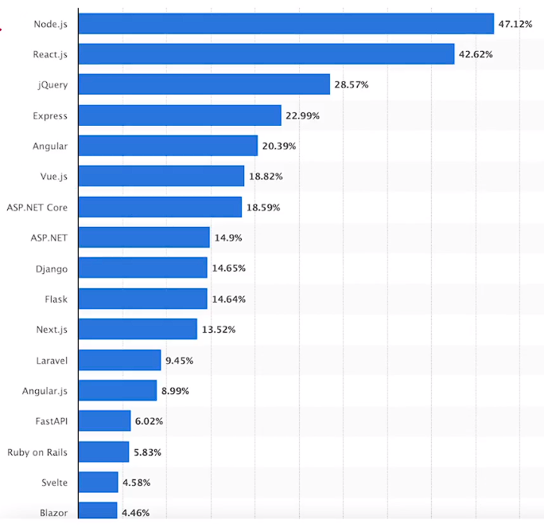
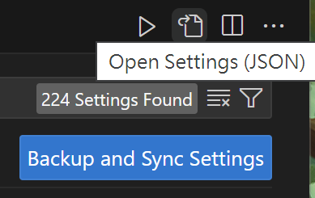

# (348) SPA

Single Page Application SPA

大概就是 Ajax 那種技術

## 優點:

減少server 生成HTML大量頻寬

核心得到餘裕，讓user自己的CPU去跑js就好。

## 缺點:

SPA 複雜，功能越多 越複雜、增加BUG

SEO 搜尋引擎優化會出問題，GOOGLE IE 的腳本不會運行 JS 加載數據，

# (349) Get Started with React

免費 且開源的 js框架

用UI組件 來架構user介面

FB 和 個人 開發維護

基本原理 : 透過js 生成畫面 

React native則是可以用於 ios android手機平台

React 常常和 另一個 Next.js 合作使用

初始版本=2013/9月 

## 好處:

### 1. 可以重複使用的組件 ( reusable components )

component 是 react 的核心架構。

創建UI 會更簡單 易於管理 也能重複使用節省時間

### 2. 無須更改整個DOM

更改網站 components 無須更改整個DOM，他是透過 virtual DOM完成的

虛擬的DOM 是 DOM的虛擬表示 或者copy

每次操作都會更新虛擬DOM，然後比較更新前後 ， 只更新受影像物件而不是刷新整個DOM ，網頁性能跟反應會更高。

### 3. JSX JavaScript XML

JSX  = js的語法擴展， 允許coder 在js中 寫入類似HTML的語法的程式碼

React 的工作就是將 JSX 轉換成 DOM 元素

## 框架的使用統計圖



## npx create-react-app myapp

可以安裝 `React` 專案

`npx` : 代表 Node Package Execution，npm內建功能。


```batch
You can now view myact in the browser.

  Local:            http://localhost:3000
  On Your Network:  http://192.168.100.107:3000

Note that the development build is not optimized.
To create a production build, use npm run build.

webpack compiled successfully
```

- 這邊如果電腦跟手機同一個網域 則可以透過ip連接!

## 解釋REACT 內部資料夾

### public 內部

放置靜態檔案的地方

只留下 `index.html` 即可 


#### index.html 用不到的內容

`link icon` 刪除

`theme-color` 刪除 

`description` 刪除 

`<link rel="apple-touch-icon" />` 刪除

`manifest` 刪除

---

`<noscript>` 如果沒開啟js則會顯示告知需要開啟

### src 資料夾

`React` 的核心資料夾 :

包含`components` 

`index.js`  : 功能是將Component渲染到index.html id為root的標籤。

`App.js` : 製作 App Component ，其責任是根據不同URL route製作畫面。

#### src資料夾內暫用不到的檔案

`reportWebVitals.js`  : 監測跟報告網頁性能數據、加載時間...之類。

`index.css`  :  全域風格

`App.test.js`  :  單元測試使用

`App.css` : 主要負責3000開始看到的轉動畫面

`logo.svg` : 轉動的圖示

`setupTests.js` : 設定測試環境的setting。

#### index.js 改成以下 修剪一下

```js
import React from 'react';
import ReactDOM from 'react-dom/client';
import App from './App';

const root = ReactDOM.createRoot(document.getElementById('root'));
root.render(
  <React.StrictMode>
    <App />
  </React.StrictMode>
);
```

- `<React.StrictMode>` 內部要使用嚴謹的React語法填入畫面


#### App.js 嘗試寫網頁


手動點取 換成 js react模式

這樣就會開啟輔助的功能

移除用不到的 import !

修改return 內容為以下

```js
function App() {
  return (
    <div>
      <h1>這是 app.js H1</h1>
    </div>
  );
}

export default App;
```

# (350) React專案環境設定

## 設定js 預設開啟為 jsreact


齒輪打開後 點右上方這個地方



### settings.json

裡面最後 加入 `files.associations` 的設定

還有 `javascriptreact` 預設的 `formatter` 為 `prettier`

```js
  "[javascriptreact]": {
    "editor.defaultFormatter": "esbenp.prettier-vscode"
  },
  "files.associations": {
    "*.js":"javascriptreact"
  }
  ,
  "code-runner.languageIdToFileExtensionMap": {
    "bat": ".bat",
    "powershell": ".ps1",
    "typescript": ".ts"
  }
}
```

## 設定 extensions 增加

`ES7+ React/Redux/React-Native snippets`

千萬次數下載的那個


- 如果有安裝好就會出現提示字 (小抄) snippets

# (351) JSX語法第一部分

JSX 可以讓我們在 JS 內部使用類 HTML 程式碼製作Component

由於網頁瀏覽器無法理解 `JSX` 所以需要先 `JSX Transformation`

React Project Module 中 有 `babel`  直譯 喧嘩 ( 參雜各種語言的聲音 )

`babel`

屬於 JavaScript 編譯器，可以<u>將不是每個瀏覽器都理解的最新 Js功能 轉換為當前和舊瀏覽器、或者環境中向後兼容的 JS版本</u>。

在React 中負責將 JSX 語法 轉換為React Components。

## 按照步驟做:

...

前面都是基本，讓App.js能放入其他人的畫面
之後 嘗試使用 {} 語法
然後版本2的 info.js
版本3 的 更進階 方式

## info.js

### v1 版本

`rafce` 關鍵字 快速做出外觀

```js
import React from 'react'

const info = () => {
  return (
    <div>
        <h1>這是info組件</h1>
    </div>
  )
}

export default info
```

### v2 版本

```js
import React from "react";
const something = () => {
  return 100;
};
const info = () => {
  let friends = ["咪咪", "阿橘", "黑皮"];
  return (
    <div>
      <h1>這是info組件</h1>
      <h1>{5 * 10}</h1>
      <h1>{10}</h1>
      <h1>{Math.random()}</h1>
      <h1>{something()}</h1>
    </div>
  );
};
export default info;
```

### v3 版本

會自動去除 [ , , , ] 不要的部分，所以才會乾淨顯示

使用 let t=[1,2,3] 讓他住進去 `<p> {t} </p>` 

就會畫面出現 123 而不是 [1,2,3] 。

```js
const info = () => {
  let friends = ["咪咪", "阿橘", "黑皮"];
  return (
    <div>
      <p>朋友:</p>
      {friends.map((friend) => {
        return <p>{friend}</p>;
      })}
    </div>
  );
};
```

`乾淨的寫法` 減少使用return

```js
    <div>
      <p>朋友:</p>
      {friends.map((friend) => (
        <p>{friend}</p>
      ))}
    </div>
```


## nav.js

統一小寫好了 避免錯誤

```js
import React from "react";

const nav = () => {
  return (
    <nav>
      <ul>
        <li>
          <a href="#">首頁</a>
        </li>
        <li>
          <a href="#">另一個頁面</a>
        </li>
      </ul>
    </nav>
  );
};

export default nav;
```

## App.js 其他人的容器

透過 babel 把 JSX 編譯
一定要透過 `div` 放在這裡面 `div/`

```js
import Nav from "./nav";
import Info from "./info";
function App() {
  return (
    <div>
      <Nav />
      <Info />
    </div>
  );
}

export default App;
```

## JSX 特殊語法

在component塞入 Js語法

`statement` : 代表動作或指令

- 代表一個動作或指令，它並不返回值。
- 陳述式通常以分號 `;` 結尾。
- 例如，`if` 陳述式、`for` 迴圈、函數宣告、變數宣告等都是陳述式。
- 陳述式的目的是執行某些操作，而不是產生一個值。

`expression` : 會算出某個值的操作 包含四則運算、function

- 代表一個計算並返回值的操作。
- 表達式可以是單純的值、變數、函數呼叫、四則運算、邏輯運算等。
- 表達式的值可以被賦值給一個變數，或者作為另一個表達式的一部分。
- 函數是一種特殊的表達式，因為它可以返回一個值。

> An expression is something, while a statement does something.

### 1.  JSX 使用 { }

使用{ }  執行expression並return value

### 2. 保留字 避開class

HTML class屬性要改稱 className 因為class是JS 保留字

```batch
git commit -m "Ch23 section 351 JSX-1 ，初步使用JSX語法，建立info.js 跟 nav.js 兩個頁面，引入App.js中，info那邊則好好練習怎麼使用JSX語法"
```

# (352) JSX語法第二部分

承上，JSX 特殊語法 2 保留字

## Manipulate Flow

先講解保留字class 應該為 className

然後設定了`info.js`的 className=info

並且import  css進來使用

接著是`nav.js`的部分

使用 inline-style 

要使用 {{}}

## JSX 特殊語法

### 2. 保留字 避開class

HTML 的 class屬性要改稱 className 因為class是JS 保留字

另外要建立styles 資料夾


### 3. JSX inline-styling 注意事項

要給 expression 

style = {   {  }  } 外面是JSX expression 內部=JS 物件語法

## info.js

使用 className 而不是class

```js
import React from "react";
const something = () => {
  return 100;
};

const info = () => {
  let friends = ["咪咪", "阿橘", "黑皮"];
  return (
    <div className="info">
      <p>朋友:</p>
      {friends.map((friend) => (
        <p>{friend}</p>
      ))}
    </div>
  );
};

export default info;
```

## style.scss

```scss
.info {
  background-color: black;
  color: white;
}
```


## nav.js

設定 style { { } } 、 `-` hyphen  改用 `CamelCase`  

e.g.  `background-color` : `backgroundColor`

```js
<nav style={{ color: "red" }}>
```


```js
<li>
    <a href="#" style={{ color: "red" }}>
```

只設定 a 連結紅字


```js
<nav style={{ backgroundColor: "lightpink" }}>
```


# (353) Props

## Manipulate Flow

app.js 使用的  Info 添加屬性跟值

然後 info.js 就可以拿來使用 

## 屬性 Props

也就是 `App.js` 的 Components 標籤部分，可以添加屬性!  

設定的參數會透過 `argument` 的方式傳給 `Component` 

參數會在 info的 參數那邊被傳入

以物件的形式 

`key` 就是 標籤內的 name 跟 age

`value` 就是標籤內 = `{ friends[0] }` 或者 `{ 3 }` 

## App.js

### 版本一

```js
import Nav from "./nav";
import Info from "./info";
function App() {
  let friends = ["咪咪", "阿橘", "黑皮"];
  return (
    <div>
      <Nav />
      <Info name={friends[0]} age={3} />
      <Info name={friends[1]} age={5} />
      <Info name={friends[2]} age={1} />
    </div>
  );
}

export default App;
```

### 版本二

```js
function App() {
  let friends = ["咪咪", "阿橘", "黑皮"];
  return (
    <div>
      <Nav />
      {friends.map((friend) => (
        <Info name={friend.name} age={friend.age} />
      ))}
    </div>
  );
}

```


## nav.js

### 避開href="#" 錯誤題示

```js
const nav = () => {
  return (
    <nav style={{ backgroundColor: "lightpink" }}>
      <ul>
        <li>
          {
            // eslint-disable-next-line
            <a href="#" style={{ color: "red" }}>
              首頁
            </a>
          }
        </li>
        <li>
          {
            // eslint-disable-next-line
            <a href="#">另一個頁面</a>
          }
        </li>
      </ul>
    </nav>
  );
};
```

## index.js

造成多次顯示console的元兇是

React.StrictMode 之後會說

```js
<React.StrictMode>
    <App />
  </React.StrictMode>
```

## info.js🔥

這邊就可以取得 props 物件 取得App.js 套用的屬性值

```js
const info = (props) => {
  console.log(props);
  return (
    <div className="info">
      <h1>名稱:{props.name}</h1>
      <h1>年紀:{props.age}</h1>
    </div>
  );
};
```

> **也可以用 ({name}) =>{  console.log(name) }🔥**
> 
> 就不需要 props.name 了!

# (354) 事件處理

## Manipulate Flow

React 這邊跟 DOM element 處理事件也很相似

先講語法差異


## 事件處理的語法差異

### camelCase

不能使用 hyphen所以只能用camelCase

使用全部小寫 onclick 變成 onClick

### expression {}

`Dom` 使用 string 

```js
<button onclick="myFunction()"> 按我一下 </button>

<script>
    const myFunction=()=>{
    alert("你按了按鈕");
}
</script>
```

`React` 使用 {   } expression

```js
  const buttonHandler = () => {
    alert("你按了按鈕");
  };
  return (
    <div>
      <Nav />
      {friends.map((friend) => (
        <Info name={friend.name} age={friend.age} />
      ))}
      <button onClick={buttonHandler}>按我</button>
    </div>
  );
}
export default App;

```

## App.js

### 版本一 沒放參數而是Fn名稱

```js
import Nav from "./nav";
import Info from "./info";
function App() {
  let friends = ["咪咪", "阿橘", "黑皮"];
  const buttonHandler = () => {
    alert("你按了按鈕");
  };
  return (
    <div>
      <Nav />
      {friends.map((friend) => (
        <Info name={friend.name} age={friend.age} />
      ))}
      <button onClick={buttonHandler}>按我</button>
    </div>
  );
}

export default App;

```

### 版本二 嘗試放參數

```js

import Nav from "./nav";
import Info from "./info";
function App() {
  let friends = ["咪咪", "阿橘", "黑皮"];
  const buttonHandler = (msg) => {
    alert(msg);
  };
  return (
    <div>
      <Nav />
      {friends.map((friend) => (
        <Info name={friend.name} age={friend.age} />
      ))}
      <button onClick={buttonHandler("天氣不錯喔")}>按我</button>
    </div>
  );
}

export default App;

```


出現alert 好幾次 ( 因為react運作本來就會讀好幾次 )

buttonHandler如果放 ( ) 會造成React 讀取的時候 直接執行

buttonHandler( ) 這個function 。

只能放buttonHandler 才不會直接執行

#### 如果想要放參數的話?

{  ()=>Handler("今天天氣不錯")  }

裡面被當匿名函數 會之後才調用

```js
return (
    <div>
      <Nav />
      {friends.map((friend) => (
        <Info name={friend.name} age={friend.age} />
      ))}
      <button onClick={() => buttonHandler("天氣不錯喔")}>按我</button>
    </div>
  );
```


# (355) State


## chrome , edge可以擴充功能


可以查看f12

 

重新連線才可以 localhost:3000


可以看到hooks 、State

## Manipulate Flow

看完介紹

`App.js`

先刪除 之前的複雜東西，直到以下再開始跟著做

```js
function App() {
  return (
    <div>
      <Nav />
      <Info />
    </div>
  );
}
```

`info.js`

初步改寫，但是不使用state所以不會重新渲染

第二次改寫，使用state

React.ustState ，因為我們用{useState} 所以可以快速解構

另外 const info 應該用大寫否則會出錯

再來是內部有用到陣列快速解構的觀念

## 背景介紹

React 好處在於可以只更改必須改變的Components，無須更改整個DOM

`State` 就是 實現這件事情的。

State 透過 React Hooks中的 useState達成。

React 中 ，State 是 Component所持有的物件，可被改變。

如果State被改變，持有它的Component就會全部重新Rerender

> **<u>React Components 的props 或 state改變 都會重新render</u>**

### Hooks

React 16.8新功能 可以不編寫class的情況下使用 State和其他React功能

class是舊版本的React常見語法。

Hooks在class內部無法起作用。

可以理解為 Hooks是 從 function component中 鉤入

React State 和生命週期特性 的函數

> 以前使用的是 <u>**Class Component**</u>
> 
> 現在使用 **<u>Functional Component</u>** 

`class component` : 

State , Props => 功能

`functional component` : 

useState , useEffect => 功能對應 在這邊稱作Hooks

1.function App(){ return ...} export default App;

2.const Info=()=>{...}

## State語法

`const [name,setName] = useState(initialValue)` 

`name`       : state的名稱 可以隨意稱呼

`setName` : 更新state時，使用的函數

`initialValue` : name ( state ) 持有的初始值


## info.js

### 第一次改寫 不使用state

並不會有成功改寫的跡象 因為不會重新渲染

```js
import React from "react";
import "./styles/style.css";

const info = () => {
  let name = "小名";
  let age = 20;
  const changeNameHandler = () => {
    name += "先生";
  };
  return (
    <div className="info">
      <h1>名稱:{name}</h1>
      <h1>年紀:{age}</h1>
      <button onClick={changeNameHandler}>改名按鈕</button>
    </div>
  );
};

export default info;

```


### 第二次改寫 使用state

讓狀態能被察覺需要重寫，先要import功能

另外 const info要用 大寫才能 const Info


#### 需要import {useState}

`import React,{useState} from "react";` 

解構的寫法就不需要 `React.ustState()` 

#### 快速解構陣列

`let [name, setName] = useState("小明")` 

因為回傳的是陣列 這個寫法可以快速取得陣列前兩者 

```js
import React, { useState } from "react";
import "./styles/style.css";

const Info = () => {
  let [name, setName] = useState("小明");
  let age = 20;
  const changeNameHandler = () => {
    setName("小明星");
  };
  return (
    <div className="info">
      <h1>名稱:{name}</h1>
      <h1>年紀:{age}</h1>
      <button onClick={changeNameHandler}>改名按鈕</button>
    </div>
  );
};

export default Info;

```

## err

遇到錯誤

> React Hook names must start with the word "use" react-hooks/rules-of-hooks

這邊const info 應該要用大寫 Info

然後export default Info ;這樣


# (356) State Lifting

# (357) useEffect

# (358) (進階課程) Class Component, Life Cycle

# (359) React Router
