# (384)安裝注意事項⚠️

下支影片中，安裝Next.js時，需要注意以下幾點資訊：

由於目前 create-next-app 有更新的版本。如果你希望跟著影片操作的話，需要在下支影片的 11:17 指名影片錄製時的 next.js 版本，使用 

```batch
npx create-next-app@13.0.0 my-next && cd my-next && npm install next@13.0.0
```

> **注意看下面** 

因為以上這段指令已經包含 cd next-practice 指令，因此，下支影片 12:23 就不需要再跟著影片重複使用 cd  next-practice 指令。(額外補充：會需要這麼長的指令，是因為 npx create-next-app@13.0.0 會有問題地⭐下載到最新版的 next。⭐

因此，需要額外先換到 next-practice 資料夾，再使用 npm install 來安裝 13.0.0 版本的 next 套件。)

⚠️最後，要記得在 package.json 內部也要將 devDependencies 的部分改成下面這段：

```json
"devDependencies": {
    "eslint": "8.26.0",
    "eslint-config-next": "13.0.0"
}
```

1. Node.js的版本需要至少**大於等於16.8.0**版。你可以透過`node --version`這個指令來確認你目前電腦內的Node.js版本。如果版本不夠大的話，可以先到https://nodejs.org/zh-tw/download下載LTS的Node.js。

2. `npx create-next-app`指令可能會問你幾個選項，全部🔥都選擇No🔥再按下enter鍵即可：

# (385)Next.js

## 介紹

基於React

### 好處

- SEO 優化 ( 因為有 SSR )

- Routing 不需要react-router-dom了 有內建類似
  
  (更好)

- SSR (server-side-rendering)

- CSR (client-side-rendering)

- Deployment  會做一些作業讓效能更好

### Next.js 發布之前

#### Compiling

轉換為瀏覽器可以理解的版本

#### Minifying

不更改的前提，刪除不必要的格式跟註釋，縮小文件、提升效能。

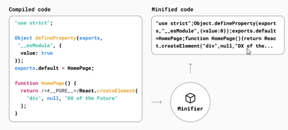

#### Bundling

將 modules合併或打包的過程，減少用戶訪問網頁時，對文件的請求數量。

> 減少 HTTP 確認與等待文件，整合越少越好。

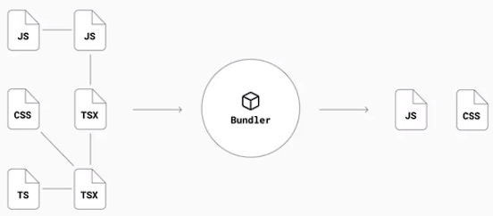

#### Code Splitting

Code Splitting 是一種將應用程式的 bundle 分割成最小單位的過程，其目的在於僅在需要時載入頁面所需的程式碼，以提高初始載入時間。

在建構 Next.js 網站時，`pages/` 目錄中的每個檔案會被自動拆分為其自己的 JavaScript bundle。共享於不同頁面之間的程式碼也會被拆分到另一個 bundle 中，避免在前往另一個頁面時重新下載相同的程式碼。

一旦初始頁面載入完成，Next.js 也會自動開始預先載入用戶可能導向的其他頁面的程式碼。

## 安裝與初始設定

### 參考384 的安裝 跟json設定修改

### Work Flow

> 先刪除 暫用不到的東西

刪除 資料夾 `api` 跟 `_app.js` 

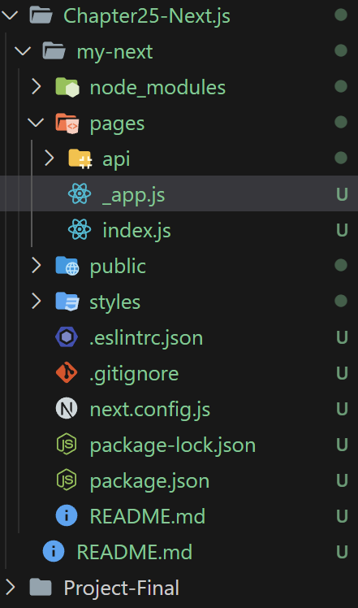

然後 `npm run dev` 試著先讓他跑，開啟看長怎樣

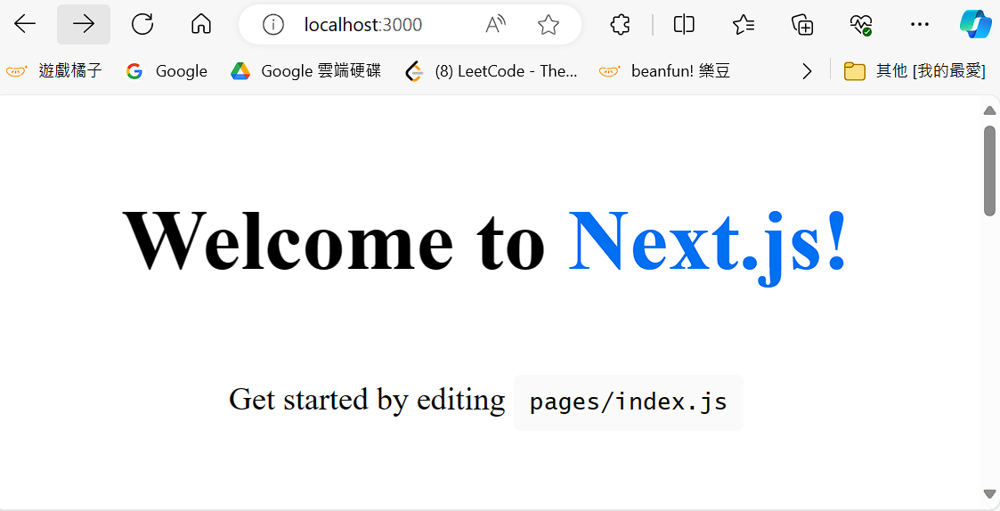

然後

`pages` 創造新的 `newPage.js` 

```js
export default function newPage() {
  return <h1>新的頁面++</h1>;
}
```

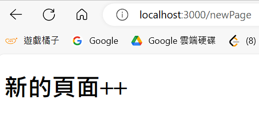

// 居然可以直接訪問?

### GPT:

---

在 Next.js 中，每個位於 `pages/` 目錄下的檔案都會被視為一個獨立的頁面。當這些頁面被訪問時，Next.js 會自動進行程式碼拆分，將每個頁面的相關程式碼打包成獨立的 `bundle`。

根據你提供的 `newPage.js` 程式碼，這是一個簡單的 React 函式元件，並且會被視為一個單一的頁面。當你訪問這個頁面時，Next.js 會自動將與這個頁面相關的程式碼拆分為單獨的 bundle。

因此，是的，你的 `newPage.js` 會被拆分，而拆分的粒度通常是基於頁面的。這使得每個頁面僅載入其相關的程式碼，提高應用程式的效能。

---

在前端開發中，`bundle` 通常指的是將一組相關的程式碼文件打包到一個或多個檔案中的過程。這些檔案可以是 JavaScript、CSS、圖像等資源，它們被組合成一個或多個 `bundle`，以便在瀏覽器中載入和執行。

當我們開發大型的前端應用程式時，有許多不同的 JavaScript 檔案，每個檔案可能包含一個或多個模組、庫或框架。為了優化載入時間和效能，我們使用打包工具（如Webpack、Parcel等）將這些檔案打包成一個或多個 bundle。

`Bundle` 的好處包括：

1. **減少請求次數：** 將多個檔案合併成一個 `bundle` 可減少瀏覽器需要發送的請求次數，提高頁面載入效能。

2. **壓縮和最小化：** 打包工具通常還會對 `bundle` 進行壓縮和最小化處理，以減小檔案大小，進而提高頁面載入速度。

3. **模組化管理：** 可以使用模組系統將代碼分割成獨立的模組，這些模組可以在需要時動態載入，實現按需載入（code splitting）。

在 Next.js 或其他現代前端框架中，打包和 `bundle` 的概念是常見的，以提供更好的效能和使用者體驗。

---

# (386)渲染方式

## 介紹

### React 的方式

React 的運作方式是 client-side rendering，

browser接收index.html 和 js 建構畫面 。

### Next 的方式

Next.js 可以決定要使用 client-side rendering或者 pre-rendering。

#### pre-rendering

##### Server-Side Rendering

對於每個 HTTP Request 網頁會重複製作，通常在需要重複向API請求資料的網頁。

##### Static Site Generation

網頁只製作一次，而後存放在 Cotent Delivery Networks ( CDNs ) 的 伺服器上面重複使用。

## Link 標籤介紹

Next.js中，開發者使用 `<Link>` 標籤當作 `< a >` 的 替代品

> import Link from "next/link";

### Link 、a差別

#### 1.僅更新必要部件

使用 Link 標籤連結的新網頁 是用 javascript加載，只變更需要改變的內容，而不是整個網頁。

#### 2.prefetching功能

Next.js 有 prefetching ，每當 Link 出現在瀏覽器時，Next.js 會在server prefetch Link

的頁面代碼。

> 如果要連接到外部，使用  `<a>` 

# (387)Routing and Link標籤

## Work Flow

`pages` `index.js`  `v1` 先清空return內容

`pages` `posts` `index.js`  `v1` 製作新的 資料夾post 、js檔案

`pages` `posts` `edit-post.js` `v1` 


然後回頭了解 LINK 標籤使用

`pages` `index.js` `v2`  增加LINK功能，和a 的區別 測試一下就差不多了

## index.js ( pages )

### v1

簡化到這樣

```js
import Head from "next/head";
import Image from "next/image";
import styles from "../styles/Home.module.css";

export default function Home() {
  return <div>這是網站首頁</div>;
}
```

### v2 - Link 、a區別

```js
// import Head from "next/head";
// import Image from "next/image";
// import styles from "../styles/Home.module.css";
import Link from "next/link";

export default function Home() {
  return (
    <div>
      <h1>這是網站首頁</h1>
      <a href="/posts/edit-post"> 前往editPost_頁面會重整 </a>
      <hr></hr>
      <Link href="/posts/edit-post">前往editPost_使用Link</Link>
    </div>
  );
}>
  );
}
```

## index.js (posts)

### v1

```js
export default function Post() {
  return <h1>這是post首頁</h1>;
}
```

## edit-post.js

### v1

```js
export default function editPost() {
  return <h1>這是edit post頁面</h1>;
}
```

# (388)Layout與metadata

## 介紹

Next.js 中，使用 `<Head>` 可以設定網頁的 metadata。

`<Head>` 本身是內建在Next.js 的component，可以用來替代HTML <head>

> import Head from "next/head";

`pages` > `index.js`  `v1` 

## Work Flow

新增 `my-next` > `components` > `layout.js`  `v1`⭐

`my-next` > `pages` > `index.js`  `v1`使用 layout.js 給予的Head。

這邊 import Layout from "../components/layout" 

但是實際上此Layout是我們自己命名的

⭐Layout 標籤包圍的東西 會等於 layout(children) 的參數⭐

---

`my-next` > `pages` > `layout.js` `v2` 製作變數玩玩看 搭配 `index.js` `v2` 

`my-next` > `pages`  > `newPage.js` `v1` 也讓這傢伙引用layout試試看

> 上面兩行是一起的 !   index+newPage+layout

---

`my-next` > `pages` > `index.js` `v2`  

> 另外也能幫 Layout 設定屬性 跟之前有點類似 但不盡相同

`newPage.js` `v2` 使用屬性 功能、搭配 `layout.js` `v2` 

⭐Layout 標籤內部的prop會跟之前prop類似⭐

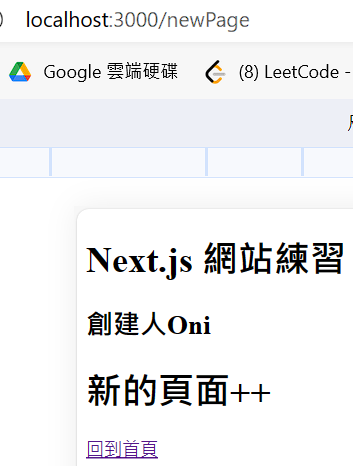

自己再去設定成 false 就知道怎麼玩了~

另外兩個 posts 內要套用 Layout 也一樣!

`posts` > `index.js`    ----- 訪問直接使用 localhost:3000/posts💡💡

`posts` > `edit-post.js` 這個我首頁則有提供

---

## layout.js (components)⭐⭐⭐⭐

### v1

要記得引用 next/head 

```js
import Head from "next/head";
export default function Layout({ children }) {
  return (
    <div>
      <Head>
        <meta charSet="utf-8" />
        <meta name="viewport" content="width=device-width,initial-scale=1" />
        <meta name="author" content="Oni" />
      </Head>
      <main>{children}</main>
    </div>
  );
}
```

### v2 製造變數跟props來玩

```js
import Head from "next/head";

const name = "Oni";
const websiteTitle = "Next.js 網站練習";
export default function Layout({ children }) {
  return (
    <div>
      <Head>
        <meta charSet="utf-8" />
        <meta name="viewport" content="width=device-width,initial-scale=1" />
        <meta name="author" content="Oni" />
      </Head>
      <header>
        <h1>{websiteTitle}</h1>
        <h2>創建人{name}</h2>
      </header>
      <main>{children}</main>
    </div>
  );
}
```

### v3 多一個屬性能玩

newPage 引用的Layout 傳入prop 參數 returnBack = true所以

```js
import Link from "next/link";


export default function Layout({ children, returnBack }) {
  return (
    <div>
      <Head>
        <meta charSet="utf-8" />
        <meta name="viewport" content="width=device-width,initial-scale=1" />
        <meta name="author" content="Oni" />
      </Head>
      <header>
        <h1>{websiteTitle}</h1>
        <h2>創建人{name}</h2>
      </header>
      <main>{children}</main>
      {returnBack && <Link href="/">回到首頁</Link>}
    </div>
  );
}
```

## index.js (pages)

### v1 - 把layout.js 引入⭐⭐⭐⭐

> 被 Layout標籤包圍的內容 會被傳入 Layout 裡面透過解構
> 
> children，然後放入 layout.js 的 {children} 位置上 ! 

```js
// import Head from "next/head";
// import Image from "next/image";
// import styles from "../styles/Home.module.css";
import Link from "next/link";
import Layout from "../components/layout";
export default function Home() {
  return (
    <Layout>
      <div>
        <h1>這是網站首頁</h1>
        <a href="/posts/edit-post"> 前往editPost_頁面會重整 </a>
        <hr></hr>
        <Link href="/posts/edit-post">前往editPost_使用Link</Link>
      </div>
    </Layout>
  );
}
```

### v2 - 讓newPage也有Link能觸及

```js
import Link from "next/link";
import Layout from "../components/layout";
export default function Home() {
  return (
    <Layout>
      <div>
        <h1>這是網站首頁</h1>
        <a href="/posts/edit-post"> 前往editPost_頁面會重整 </a>
        <hr></hr>
        <Link href="/posts/edit-post">前往editPost_使用Link</Link>
        <hr />
        <Link href="/newPage">前往newPage</Link>
      </div>
    </Layout>
  );
}
```

## newPage.js (pages)

### v1  修改，也試圖引用layout

```js
import Layout from "../components/layout";
export default function newPage() {
  return (
    <Layout>
      <h1>新的頁面++</h1>
    </Layout>
  );
}
```

### v2 修改，讓他有類似屬性功能?😕😕

```js
import Layout from "../components/layout";

export default function newPage() {
  return (
    <Layout returnBack={true}>
      <h1>新的頁面++</h1>
    </Layout>
  );
}
```

# (389)CSS Modules與App Component

## 介紹

Next.js 支援 CSS Module

`CSS Module` : 將CSS 文件做成Module，套用給特定的Next.js Component。

CSS Modules 文件的命名規則是 [name].module.css。

此外，CSS樣式套用在Component上時，會自動生成一個獨特的class名稱，此特性可以讓我們避免CSS命名的衝突。

如果希望某些CSS 套用到所有頁面，我們需要創建一個名為

pages/_app.js的文件。 

> 創建這文件後 一定要重新運行，Next.js會自動套用_app.js的樣式，到所有頁面上。

## Work Flow

### 透過 { } + style.module.css 套用到layout身上

> layout.module.css 、layout.js 套用到Layout身上

建立 `my-next` \ `components` \ `layout.module.css`   `v1`

`my-next` \ `components` \ `layout.js`  `v1` 


---

### 套用到全域設定 !

> [Routing: Custom App | Next.js (nextjs.org)](https://nextjs.org/docs/pages/building-your-application/routing/custom-app) ⭐
> 
> 原本預設 App Component當預設，可以自己覆蓋，透過建立_app.js
> 
> 下面我們 _app.js 跟 global.css配合

`pages` > `_app.js`  建立該名稱的js檔 💡

`my-next` > `styles` > `global.css` 建立檔案

#### 🔥發現全域格式套用 優先度確實比較低🔥


---

---

## layout.js (components)

- 手法蠻特殊的，import 特別名稱的CSS進來後，className用 { } 處理

```js
import Head from "next/head";

const name = "Oni";
const websiteTitle = "Next.js 網站練習";
import Link from "next/link";

import styles from "./layout.module.css";

export default function Layout({ children, returnBack }) {
  return (
    <div className={styles.layout}>
      <Head>
        <meta charSet="utf-8" />
        <meta name="viewport" content="width=device-width,initial-scale=1" />
        <meta name="author" content="Oni" />
      </Head>
      <header className={styles.header}>
        <h1>{websiteTitle}</h1>
        <h2>創建人{name}</h2>
      </header>
      <main>{children}</main>
      {returnBack && (
        <Link href="/" className={styles.home}>
          回到首頁
        </Link>
      )}
    </div>
  );
}
```

## layout.module.css (components)

- 單純寫css就可以

```css
.header {
  background-color: black;
  color: aqua;
}

.layout {
  padding: 3rem;
}

.home {
  color: orange;
  text-decoration: none;
}
```

## _app.js (pages)⭐⭐⭐

建立好之後 伺服器要重新啟動! 

記得引用css ! !

```js
import "../styles/global.css";
export default function App({ Component, pageProps }) {
  return <Component {...pageProps} />;
}
```

## 心得

> git commit -m "Ch25 section 389，介紹CSS modules跟 App Component，一個寫好單一CSS，import能套用到目標component身上，只要給出className = {nameInCss}，另一個則是app全域套用預設"

# (390)特別注意事項！

各位同學，請特別留意。

下支影片中的 4:10 秒處使用的 Restful API 是 `Chapter 19` 的 

「Restful API Final Code 」這個專案，並非「網頁系統 Final Code」。

如果你使用到不正確的專案程式碼的話，會導致 API 回傳的資料無法被 Next.js 讀取，要特別小心！

# (391)Client-Side Rendering

## 介紹

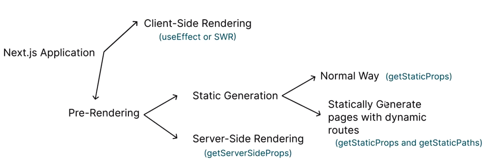

- getStaticProps 跟 getStaticPaths 之後會在說明 ⚠️

> getServerSideProps 跟 getStaticProps 跟 getStaticPaths 只能用在pages下的
> 
> 檔案 **( 開發不適用 ，為了方便開發，但是Production的時候還是會被限制)**

## Work Flow

我使用 Ch21 Authenticate 的Restful API ，裡面的port被我改成3001 因為跟Next衝突。

去開這個API來配合測試 ( 因為只有他可以取得學生raw data，別人很多回傳render )

建立 `pages > profile > index.js` 

### ⚠️ useEffect內不能放async

#### 這些內容是 useEffect跑完之後，return過去的，算是client自己跑完才給出的😕😕😕😕😕😕!

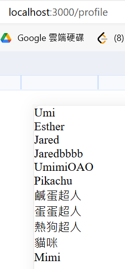

## index.js (profile)

> 不能放async 所以放一般，然後內部再放async

> 另外記得用3001 而不是3000或者8080喔

```js
import { useEffect, useState } from "react";
export default function Profile() {
  const [data, setData] = useState("");
  const [isLoading, setLoading] = useState(false);
  useEffect(() => {
    const myfunction = async () => {
      setLoading(true);
      let response = await fetch("http://localhost:3001/students");
      let data = await response.json();
      setData(data);
      setLoading(false);
    };
    myfunction();
  }, []);
  return (
    <div>
      <h1>{isLoading && "Loading"}</h1>
      {data && data.map((d) => <p>{d.name}</p>)}
    </div>
  );
}
```

## 心得

> **Ch25 section 391，Client-Side Rendering，看起來比較像是透過技巧然後再由client自己等待API跑完之後自己弄出畫面，所以算客戶自己渲染的畫面** 

# (392)Static Site Generation with Data

## 介紹

這次要說 圖中的 

Pre-Rendering > Static Generation > Normal Way  `getStaticProps`

---

## Work Flow

### 

製作

`page > profile > static-generation-with-data.js` 

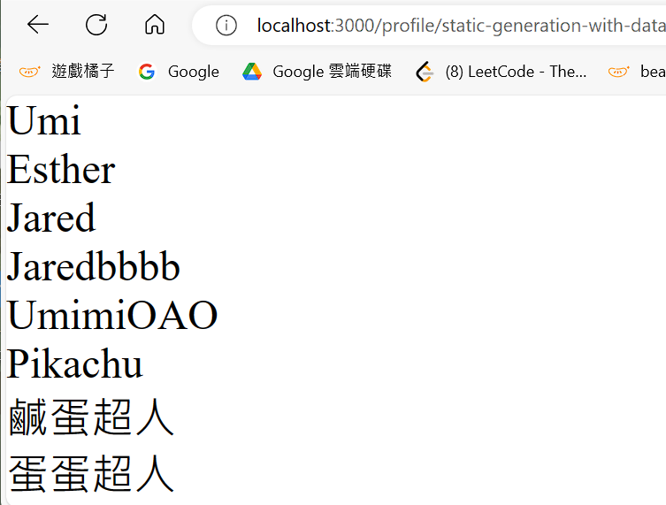

- 如果試過，就會發現有轉圈圈(代表從server 送過來整頁)

再改方便一些


## static-generation-with-data.js⭐⭐⭐⭐⭐

### 💡getStaticProps() 一定要回傳物件

### 💡物件屬性一定要有props

### 💡該屬性會自動被套用到下面default參數

```js
import Layout from "../../components/layout";
// 名稱一定要是getStaticProps
export async function getStaticProps() {
  const response = await fetch("http://localhost:3001/students");
  const data = await response.json();

  // getStaticProps() 一定要return 一個物件
  // 該物件的屬性一定要叫做 props
  // props屬性會自動被Next.js使用
  // props屬性會自動變成下面 default function的參數
  return {
    props: {
      data,
    },
  };
}

export default function StaticGenerationPage({ data }) {
  return (
    <Layout returnBack={true}>
      {" "}
      <div>
        {data.map((d) => (
          <p key={d._id}>{d.name}</p>
        ))}
      </div>
    </Layout>
  );
}
```

## 

# (393)Static Generation with Dynamic Routes

## 目的:

希望可以按下名稱之後 去到對應的 id Route並且顯示內容

## Work Flow

製作

`page > profile > static-generation-with-dynamic-routes.js`

> 雖然等一下會改掉 ，也可以不要先做 反正會改名~

改造以下，前面都被我先註解，隱蔽

`page > profile > index.js`  

> 實際上跟上一節392類似，都使用了async getStaticProps +default+data

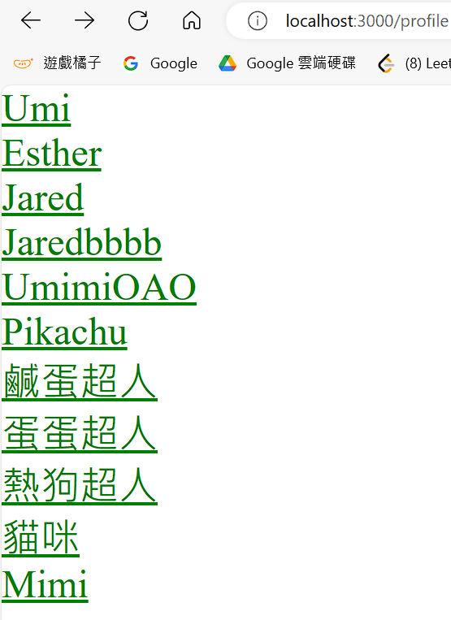

`page > profile > static-.........` 改名成為 `[id].js`

### 有個錯誤需要改ch21 ，我沒建立id的route

`ch21` `app.js` 新增route

### getStaticPaths配合getStaticProps才能⭐⭐⭐

`[id].js` 才能使用，另外額外添加 回上一頁功能 !  

## index.js (pages)

增加Link連結，前往profile

```js
export default function Home() {
  return (
    <Layout>
      <div>
        <h1>這是網站首頁</h1>
        <a href="/posts/edit-post"> 前往editPost_頁面會重整 </a>
        <hr></hr>
        <Link href="/posts/edit-post">前往editPost_使用Link</Link>
        <hr />
        <Link href="/newPage">前往newPage</Link>
        <hr />
        <Link href="/profile/static-generation-with-data">
          前往static-generation-with-data
        </Link>
        <hr />
        <Link href="/profile">前往profile</Link>
      </div>
    </Layout>
  );
}
```

## index.js (profile)

稍微改造，讓他變成  async  getStaticProps + default 聯手出擊 

順便把 Link 弄成 block 讓他變成一列，而且 width : fit-content 💡

順便也把Layout拉一下

```js
// import { useEffect, useState } from "react";
// export default function Profile() {
//   const [data, setData] = useState("");
//   const [isLoading, setLoading] = useState(false);
//   useEffect(() => {
//     const myfunction = async () => {
//       setLoading(true);
//       let response = await fetch("http://localhost:3001/students");
//       let data = await response.json();
//       setData(data);
//       setLoading(false);
//     };
//     myfunction();
//   }, []);
//   return (
//     <div>
//       <h1>{isLoading && "Loading"}</h1>
//       {data && data.map((d) => <p>{d.name}</p>)}
//     </div>
//   );
// }
import Link from "next/link";
import Layout from "../../components/layout";
export async function getStaticProps() {
  const response = await fetch("http://localhost:3001/students");
  const data = await response.json();
  return {
    props: {
      data,
    },
  };
}
export default function Profile({ data }) {
  return (
    <Layout returnBack={true}>
      <div>
        {data.map((d) => (
          <Link
            style={{ display: "block", width: "fit-content" }}
            href={`/profile/${d._id}`}
          >
            {d.name}
          </Link>
        ))}
        <br />
      </div>
    </Layout>
  );
}
```

> **/profile/ 會比較好  用絕對路徑** 

## [id].js  (profile)

弄Layout並添加新屬性

```js
import Layout from "../../components/layout";
export async function getStaticPaths() {
  const response = await fetch("http://localhost:3001/students");
  const data = await response.json();
  // paths一定要符合 Next.js 要求的格式
  // getStaticPaths() 一定要return 一個有paths的屬性的物件
  // paths 一定需要一個array of objects
  // 內部每個objecy都需要有params，裡面還要有id的屬性
  // 每個id會被拿來做頁面
  const paths = data.map((d) => {
    return {
      params: {
        id: d._id.toString(),
      },
    };
  });

  return {
    paths,
    fallback: false, //  false製作404頁面
  };
}

export async function getStaticProps({ params }) {
  const response = await fetch(`http://localhost:3001/students/${params.id}`);
  const data = await response.json();
  return {
    props: {
      data,
    },
  };
}

export default function StudentProfile({ data }) {
  return (
    <Layout returnPrevious={"/profile"}>
      <div>
        <h1>學生資料</h1>
        <p>姓名:{data.name}</p>
        <p>年齡:{data.age}</p>
        <p>獎學金:{data.scholarship.merit}</p>
        <p>其他:{data.scholarship.other}</p>
      </div>
    </Layout>
  );
}
```

## app.js (ch21)

添加一個Route

```js
app.get("/students/:_id", async (req, res) => {
  let { _id } = req.params;
  let foundStudent = await Student.findOne({ _id });
  return res.send(foundStudent);
});
```

# (394)Server-Side Rendering

## Work Flow

使用 `profile > index.js` 

把舊的  getStaticProps 註解

使用 getServerSideProps 

`profile > [id].js` 

前兩個  getStaticProps 、getStaticPaths 註解

新增   getServerSideProps 

> 前兩個搭配的 因為有寫 fallback false 所以會製作404
> 
> 但是getServerSideProps 並不會 反而會直接顯出錯誤

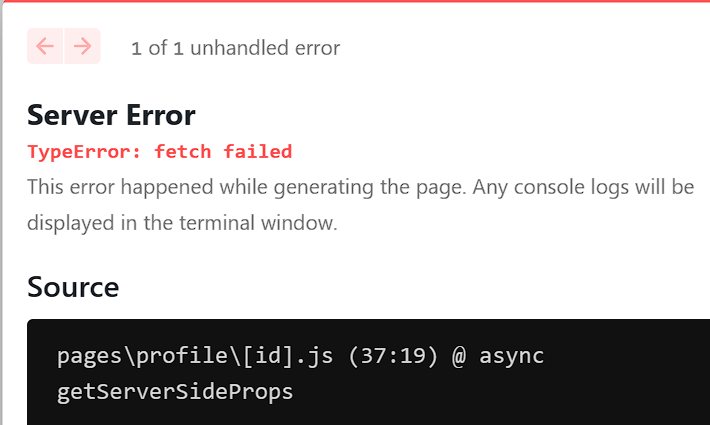

`ch21 > app.js` 新增try catch 避免id給錯或者格式不同發生bug直接罷工

## index.js (profile)

```js
// import { useEffect, useState } from "react";
// export default function Profile() {
//   const [data, setData] = useState("");
//   const [isLoading, setLoading] = useState(false);
//   useEffect(() => {
//     const myfunction = async () => {
//       setLoading(true);
//       let response = await fetch("http://localhost:3001/students");
//       let data = await response.json();
//       setData(data);
//       setLoading(false);
//     };
//     myfunction();
//   }, []);
//   return (
//     <div>
//       <h1>{isLoading && "Loading"}</h1>
//       {data && data.map((d) => <p>{d.name}</p>)}
//     </div>
//   );
// }
import Link from "next/link";
import Layout from "../../components/layout";
// export async function getStaticProps() {
//   const response = await fetch("http://localhost:3001/students");
//   const data = await response.json();
//   return {
//     props: {
//       data,
//     },
//   };
// }
export async function getServerSideProps() {
  const response = await fetch("http://localhost:3001/students");
  const data = await response.json();
  return {
    props: {
      data,
    },
  };
}
export default function Profile({ data }) {
  return (
    <Layout returnBack={true}>
      <div>
        {data.map((d) => (
          <Link
            style={{ display: "block", width: "fit-content" }}
            href={`/profile/${d._id}`}
          >
            {d.name}
          </Link>
        ))}
        <br />
      </div>
    </Layout>
  );
}
```

## [id].js (profile)

```js
import Layout from "../../components/layout";
// export async function getStaticPaths() {
//   const response = await fetch("http://localhost:3001/students");
//   const data = await response.json();
//   // paths一定要符合 Next.js 要求的格式
//   // getStaticPaths() 一定要return 一個有paths的屬性的物件
//   // paths 一定需要一個array of objects
//   // 內部每個objecy都需要有params，裡面還要有id的屬性
//   // 每個id會被拿來做頁面
//   const paths = data.map((d) => {
//     return {
//       params: {
//         id: d._id.toString(),
//       },
//     };
//   });

//   return {
//     paths,
//     fallback: false, //  false製作404頁面
//   };
// }

// export async function getStaticProps({ params }) {
//   const response = await fetch(`http://localhost:3001/students/${params.id}`);
//   const data = await response.json();
//   return {
//     props: {
//       data,
//     },
//   };
// }

//

export async function getServerSideProps({ params }) {
  const response = await fetch(`http://localhost:3001/students/${params.id}`);
  const data = await response.json();
  return {
    props: { data },
  };
}

export default function StudentProfile({ data }) {
  return (
    <Layout returnPrevious={"/profile"}>
      <div>
        <h1>學生資料</h1>
        <p>姓名:{data.name}</p>
        <p>年齡:{data.age}</p>
        <p>獎學金:{data.scholarship.merit}</p>
        <p>其他:{data.scholarship.other}</p>
      </div>
    </Layout>
  );
}
};
}
```

## app.js (ch21)

```js
app.get("/students/:_id", async (req, res) => {
  try {
    let { _id } = req.params;
    let foundStudent = await Student.findOne({ _id });
    return res.send(foundStudent);
  } catch (e) {
    return res.send({});
  }
});
```

# (395)Codes until Now

下載資源(我不需要)

# (396)More Content

之後也許會視情況增加其他課程內容。
