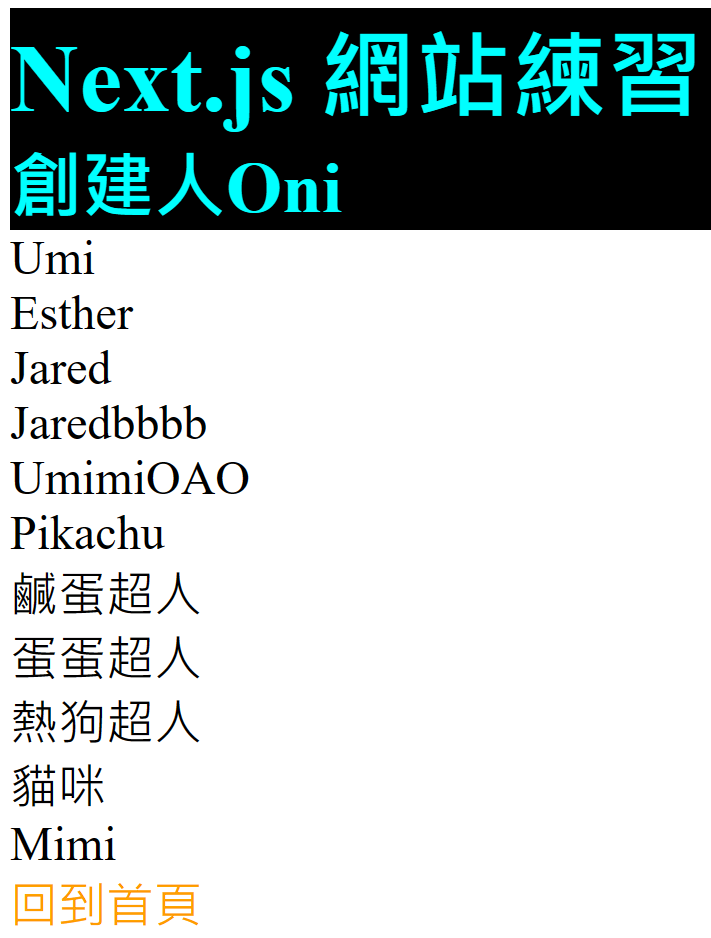

# (384)安è£æ³¨æ„事項⚠ï¸

下支影片中，安è£Next.js時，需è¦æ³¨æ„以下幾é»è³‡è¨Šï¼š

ç”±æ–¼ç›®å‰ create-next-app 有更新的版本。如æœä½ å¸Œæœ›è·Ÿè‘—影片æ“作的話，需è¦åœ¨ä¸‹æ”¯å½±ç‰‡çš„ 11:17 指å影片錄製時的 next.js 版本，使用 

```batch
npx create-next-app@13.0.0 my-next && cd my-next && npm install next@13.0.0
```

> **注æ„看下é¢** 

å› ç‚ºä»¥ä¸Šé€™æ®µæŒ‡ä»¤å·²ç¶“åŒ…å« cd next-practice 指令，因此，下支影片 12:23 å°±ä¸éœ€è¦å†è·Ÿè‘—影片é‡è¤‡ä½¿ç”¨ cd  next-practice 指令。(é¡å¤–補充：會需è¦é€™éº¼é•·çš„指令，是因為 npx create-next-app@13.0.0 會有å•é¡Œåœ°â­ä¸‹è¼‰åˆ°æœ€æ–°ç‰ˆçš„ next。â­

因此，需è¦é¡å¤–å…ˆæ›åˆ° next-practice 資料夾，å†ä½¿ç”¨ npm install ä¾†å®‰è£ 13.0.0 版本的 next 套件。)

âš ï¸æœ€å¾Œï¼Œè¦è¨˜å¾—在 package.json 內部也è¦å°‡ devDependencies 的部分改æˆä¸‹é¢é€™æ®µï¼š

```json
"devDependencies": {
    "eslint": "8.26.0",
    "eslint-config-next": "13.0.0"
}
```

1. Node.js的版本需è¦è‡³å°‘**大於等於16.8.0**版。你å¯ä»¥é€é`node --version`這個指令來確èªä½ ç›®å‰é›»è…¦å…§çš„Node.js版本。如æœç‰ˆæœ¬ä¸å¤ å¤§çš„話，å¯ä»¥å…ˆåˆ°https://nodejs.org/zh-tw/download下載LTSçš„Node.js。

2. `npx create-next-app`指令å¯èƒ½æœƒå•ä½ å¹¾å€‹é¸é …，全部🔥都é¸æ“‡No🔥å†æŒ‰ä¸‹enteréµå³å¯ï¼š

# (385)Next.js

## 介紹

基於React

### 好處

- SEO 優化 ( 因為有 SSR )

- Routing ä¸éœ€è¦react-router-dom了 有內建é¡ä¼¼
  
  (更好)

- SSR (server-side-rendering)

- CSR (client-side-rendering)

- Deployment  會åšä¸€äº›ä½œæ¥­è®“效能更好

### Next.js 發布之å‰

#### Compiling

轉æ›ç‚ºç€è¦½å™¨å¯ä»¥ç†è§£çš„版本

#### Minifying

ä¸æ›´æ”¹çš„å‰æ，刪除ä¸å¿…è¦çš„æ ¼å¼è·Ÿè¨»é‡‹ï¼Œç¸®å°æ–‡ä»¶ã€æå‡æ•ˆèƒ½ã€‚


#### Bundling

å°‡ modulesåˆä½µæˆ–打包的é程，減少用戶訪å•ç¶²é æ™‚，å°æ–‡ä»¶çš„請求數é‡ã€‚

> 減少 HTTP 確èªèˆ‡ç­‰å¾…文件，整åˆè¶Šå°‘越好。


#### Code Splitting

Code Splitting 是一種將應用程å¼çš„ bundle 分割æˆæœ€å°å–®ä½çš„é程，其目的在於僅在需è¦æ™‚載入é é¢æ‰€éœ€çš„程å¼ç¢¼ï¼Œä»¥æ高åˆå§‹è¼‰å…¥æ™‚間。

在建構 Next.js 網站時，`pages/` 目錄中的æ¯å€‹æª”案會被自動拆分為其自己的 JavaScript bundle。共享於ä¸åŒé é¢ä¹‹é–“的程å¼ç¢¼ä¹Ÿæœƒè¢«æ‹†åˆ†åˆ°å¦ä¸€å€‹ bundle 中，é¿å…在å‰å¾€å¦ä¸€å€‹é é¢æ™‚é‡æ–°ä¸‹è¼‰ç›¸åŒçš„程å¼ç¢¼ã€‚

一旦åˆå§‹é é¢è¼‰å…¥å®Œæˆï¼ŒNext.js 也會自動開始é å…ˆè¼‰å…¥ç”¨æˆ¶å¯èƒ½å°å‘的其他é é¢çš„程å¼ç¢¼ã€‚

## 安è£èˆ‡åˆå§‹è¨­å®š

### åƒè€ƒ384 çš„å®‰è£ è·Ÿjson設定修改

### Work Flow

> 先刪除 暫用ä¸åˆ°çš„æ±è¥¿

刪除 資料夾 `api` 跟 `_app.js` 


然後 `npm run dev` 試著先讓他跑，開啟看長æ€æ¨£


然後

`pages` 創造新的 `newPage.js` 

```js
export default function newPage() {
  return <h1>æ–°çš„é é¢++</h1>;
}
```


// 居然å¯ä»¥ç›´æ¥è¨ªå•?

### GPT:

---

在 Next.js 中，æ¯å€‹ä½æ–¼ `pages/` 目錄下的檔案都會被視為一個ç¨ç«‹çš„é é¢ã€‚當這些é é¢è¢«è¨ªå•æ™‚，Next.js 會自動進行程å¼ç¢¼æ‹†åˆ†ï¼Œå°‡æ¯å€‹é é¢çš„相關程å¼ç¢¼æ‰“包æˆç¨ç«‹çš„ `bundle`。

根據你æ供的 `newPage.js` 程å¼ç¢¼ï¼Œé€™æ˜¯ä¸€å€‹ç°¡å–®çš„ React 函å¼å…ƒä»¶ï¼Œä¸¦ä¸”會被視為一個單一的é é¢ã€‚當你訪å•é€™å€‹é é¢æ™‚，Next.js 會自動將與這個é é¢ç›¸é—œçš„程å¼ç¢¼æ‹†åˆ†ç‚ºå–®ç¨çš„ bundle。

因此，是的，你的 `newPage.js` 會被拆分，而拆分的粒度通常是基於é é¢çš„。這使得æ¯å€‹é é¢åƒ…載入其相關的程å¼ç¢¼ï¼Œæ高應用程å¼çš„效能。

---

在å‰ç«¯é–‹ç™¼ä¸­ï¼Œ`bundle` 通常指的是將一組相關的程å¼ç¢¼æ–‡ä»¶æ‰“包到一個或多個檔案中的é程。這些檔案å¯ä»¥æ˜¯ JavaScriptã€CSSã€åœ–åƒç­‰è³‡æºï¼Œå®ƒå€‘被組åˆæˆä¸€å€‹æˆ–多個 `bundle`，以便在ç€è¦½å™¨ä¸­è¼‰å…¥å’ŒåŸ·è¡Œã€‚

當我們開發大å‹çš„å‰ç«¯æ‡‰ç”¨ç¨‹å¼æ™‚，有許多ä¸åŒçš„ JavaScript 檔案，æ¯å€‹æª”案å¯èƒ½åŒ…å«ä¸€å€‹æˆ–多個模組ã€åº«æˆ–框æ¶ã€‚為了優化載入時間和效能，我們使用打包工具（如Webpackã€Parcel等）將這些檔案打包æˆä¸€å€‹æˆ–多個 bundle。

`Bundle` 的好處包括：

1. **減少請求次數：** 將多個檔案åˆä½µæˆä¸€å€‹ `bundle` å¯æ¸›å°‘ç€è¦½å™¨éœ€è¦ç™¼é€çš„請求次數，æ高é é¢è¼‰å…¥æ•ˆèƒ½ã€‚

2. **壓縮和最å°åŒ–：** æ‰“åŒ…å·¥å…·é€šå¸¸é‚„æœƒå° `bundle` 進行壓縮和最å°åŒ–處ç†ï¼Œä»¥æ¸›å°æª”案大å°ï¼Œé€²è€Œæ高é é¢è¼‰å…¥é€Ÿåº¦ã€‚

3. **模組化管ç†ï¼š** å¯ä»¥ä½¿ç”¨æ¨¡çµ„系統將代碼分割æˆç¨ç«‹çš„模組，這些模組å¯ä»¥åœ¨éœ€è¦æ™‚動態載入，實ç¾æŒ‰éœ€è¼‰å…¥ï¼ˆcode splitting）。

在 Next.js 或其他ç¾ä»£å‰ç«¯æ¡†æ¶ä¸­ï¼Œæ‰“包和 `bundle` 的概念是常見的，以æ供更好的效能和使用者體驗。

---

# (386)渲染方å¼

## 介紹

### React çš„æ–¹å¼

React çš„é‹ä½œæ–¹å¼æ˜¯ client-side rendering，

browseræ¥æ”¶index.html å’Œ js å»ºæ§‹ç•«é¢ ã€‚

### Next çš„æ–¹å¼

Next.js å¯ä»¥æ±ºå®šè¦ä½¿ç”¨ client-side rendering或者 pre-rendering。

#### pre-rendering

##### Server-Side Rendering

å°æ–¼æ¯å€‹ HTTP Request 網é æœƒé‡è¤‡è£½ä½œï¼Œé€šå¸¸åœ¨éœ€è¦é‡è¤‡å‘API請求資料的網é ã€‚

##### Static Site Generation

網é åªè£½ä½œä¸€æ¬¡ï¼Œè€Œå¾Œå­˜æ”¾åœ¨ Cotent Delivery Networks ( CDNs ) çš„ 伺æœå™¨ä¸Šé¢é‡è¤‡ä½¿ç”¨ã€‚

## Link 標籤介紹

Next.js中，開發者使用 `<Link>` 標籤當作 `< a >` çš„ 替代å“

> import Link from "next/link";

### Link ã€a差別

#### 1.僅更新必è¦éƒ¨ä»¶

使用 Link 標籤連çµçš„æ–°ç¶²é  æ˜¯ç”¨ javascript加載，åªè®Šæ›´éœ€è¦æ”¹è®Šçš„內容，而ä¸æ˜¯æ•´å€‹ç¶²é ã€‚

#### 2.prefetching功能

Next.js 有 prefetching ，æ¯ç•¶ Link 出ç¾åœ¨ç€è¦½å™¨æ™‚，Next.js 會在server prefetch Link

çš„é é¢ä»£ç¢¼ã€‚

> 如æœè¦é€£æ¥åˆ°å¤–部，使用  `<a>` 

# (387)Routing and Link標籤

## Work Flow

`pages` `index.js`  `v1` 先清空return內容

`pages` `posts` `index.js`  `v1` 製作新的 資料夾post ã€js檔案

`pages` `posts` `edit-post.js` `v1` 


然後å›é ­äº†è§£ LINK 標籤使用

`pages` `index.js` `v2`  å¢åŠ LINK功能，和a çš„å€åˆ¥ 測試一下就差ä¸å¤šäº†

## index.js ( pages )

### v1

簡化到這樣

```js
import Head from "next/head";
import Image from "next/image";
import styles from "../styles/Home.module.css";

export default function Home() {
  return <div>這是網站首é </div>;
}
```

### v2 - Link ã€aå€åˆ¥

```js
// import Head from "next/head";
// import Image from "next/image";
// import styles from "../styles/Home.module.css";
import Link from "next/link";

export default function Home() {
  return (
    <div>
      <h1>這是網站首é </h1>
      <a href="/posts/edit-post"> å‰å¾€editPost_é é¢æœƒé‡æ•´ </a>
      <hr></hr>
      <Link href="/posts/edit-post">å‰å¾€editPost_使用Link</Link>
    </div>
  );
}>
  );
}
```

## index.js (posts)

### v1

```js
export default function Post() {
  return <h1>這是post首é </h1>;
}
```

## edit-post.js

### v1

```js
export default function editPost() {
  return <h1>這是edit posté é¢</h1>;
}
```

# (388)Layout與metadata

## 介紹

Next.js 中，使用 `<Head>` å¯ä»¥è¨­å®šç¶²é çš„ metadata。

`<Head>` 本身是內建在Next.js çš„component，å¯ä»¥ç”¨ä¾†æ›¿ä»£HTML <head>

> import Head from "next/head";

`pages` > `index.js`  `v1` 

## Work Flow

æ–°å¢ `my-next` > `components` > `layout.js`  `v1`â­

`my-next` > `pages` > `index.js`  `v1`使用 layout.js 給予的Head。

這邊 import Layout from "../components/layout" 

但是實際上此Layout是我們自己命åçš„

â­Layout 標籤包åœçš„æ±è¥¿ 會等於 layout(children) çš„åƒæ•¸â­

---

`my-next` > `pages` > `layout.js` `v2` 製作變數ç©ç©çœ‹ æ­é… `index.js` `v2` 

`my-next` > `pages`  > `newPage.js` `v1` 也讓這傢伙引用layout試試看

> 上é¢å…©è¡Œæ˜¯ä¸€èµ·çš„ !   index+newPage+layout

---

`my-next` > `pages` > `index.js` `v2`  

> å¦å¤–也能幫 Layout 設定屬性 跟之å‰æœ‰é»é¡ä¼¼ 但ä¸ç›¡ç›¸åŒ

`newPage.js` `v2` 使用屬性 功能ã€æ­é… `layout.js` `v2` 

â­Layout 標籤內部的prop會跟之å‰propé¡ä¼¼â­


自己å†å»è¨­å®šæˆ false 就知é“æ€éº¼ç©äº†~

å¦å¤–兩個 posts å…§è¦å¥—用 Layout 也一樣!

`posts` > `index.js`    ----- 訪å•ç›´æ¥ä½¿ç”¨ localhost:3000/posts💡💡

`posts` > `edit-post.js` 這個我首é å‰‡æœ‰æä¾›

---

## layout.js (components)â­â­â­â­

### v1

è¦è¨˜å¾—引用 next/head 

```js
import Head from "next/head";
export default function Layout({ children }) {
  return (
    <div>
      <Head>
        <meta charSet="utf-8" />
        <meta name="viewport" content="width=device-width,initial-scale=1" />
        <meta name="author" content="Oni" />
      </Head>
      <main>{children}</main>
    </div>
  );
}
```

### v2 製造變數跟props來ç©

```js
import Head from "next/head";

const name = "Oni";
const websiteTitle = "Next.js 網站練習";
export default function Layout({ children }) {
  return (
    <div>
      <Head>
        <meta charSet="utf-8" />
        <meta name="viewport" content="width=device-width,initial-scale=1" />
        <meta name="author" content="Oni" />
      </Head>
      <header>
        <h1>{websiteTitle}</h1>
        <h2>創建人{name}</h2>
      </header>
      <main>{children}</main>
    </div>
  );
}
```

### v3 多一個屬性能ç©

newPage 引用的Layout 傳入prop åƒæ•¸ returnBack = true所以

```js
import Link from "next/link";


export default function Layout({ children, returnBack }) {
  return (
    <div>
      <Head>
        <meta charSet="utf-8" />
        <meta name="viewport" content="width=device-width,initial-scale=1" />
        <meta name="author" content="Oni" />
      </Head>
      <header>
        <h1>{websiteTitle}</h1>
        <h2>創建人{name}</h2>
      </header>
      <main>{children}</main>
      {returnBack && <Link href="/">å›åˆ°é¦–é </Link>}
    </div>
  );
}
```

## index.js (pages)

### v1 - 把layout.js 引入â­â­â­â­

> 被 Layout標籤包åœçš„內容 會被傳入 Layout 裡é¢é€é解構
> 
> children，然後放入 layout.js çš„ {children} ä½ç½®ä¸Š ! 

```js
// import Head from "next/head";
// import Image from "next/image";
// import styles from "../styles/Home.module.css";
import Link from "next/link";
import Layout from "../components/layout";
export default function Home() {
  return (
    <Layout>
      <div>
        <h1>這是網站首é </h1>
        <a href="/posts/edit-post"> å‰å¾€editPost_é é¢æœƒé‡æ•´ </a>
        <hr></hr>
        <Link href="/posts/edit-post">å‰å¾€editPost_使用Link</Link>
      </div>
    </Layout>
  );
}
```

### v2 - 讓newPage也有Link能觸åŠ

```js
import Link from "next/link";
import Layout from "../components/layout";
export default function Home() {
  return (
    <Layout>
      <div>
        <h1>這是網站首é </h1>
        <a href="/posts/edit-post"> å‰å¾€editPost_é é¢æœƒé‡æ•´ </a>
        <hr></hr>
        <Link href="/posts/edit-post">å‰å¾€editPost_使用Link</Link>
        <hr />
        <Link href="/newPage">å‰å¾€newPage</Link>
      </div>
    </Layout>
  );
}
```

## newPage.js (pages)

### v1  修改，也試圖引用layout

```js
import Layout from "../components/layout";
export default function newPage() {
  return (
    <Layout>
      <h1>æ–°çš„é é¢++</h1>
    </Layout>
  );
}
```

### v2 修改，讓他有é¡ä¼¼å±¬æ€§åŠŸèƒ½?😕😕

```js
import Layout from "../components/layout";

export default function newPage() {
  return (
    <Layout returnBack={true}>
      <h1>æ–°çš„é é¢++</h1>
    </Layout>
  );
}
```

# (389)CSS Modules與App Component

## 介紹

Next.js æ”¯æ´ CSS Module

`CSS Module` : å°‡CSS 文件åšæˆModule，套用給特定的Next.js Component。

CSS Modules 文件的命åè¦å‰‡æ˜¯ [name].module.css。

此外，CSS樣å¼å¥—用在Component上時，會自動生æˆä¸€å€‹ç¨ç‰¹çš„classå稱，此特性å¯ä»¥è®“我們é¿å…CSS命åçš„è¡çªã€‚

如æœå¸Œæœ›æŸäº›CSS 套用到所有é é¢ï¼Œæˆ‘們需è¦å‰µå»ºä¸€å€‹å為

pages/_app.js的文件。 

> 創建這文件後 一定è¦é‡æ–°é‹è¡Œï¼ŒNext.js會自動套用_app.js的樣å¼ï¼Œåˆ°æ‰€æœ‰é é¢ä¸Šã€‚

## Work Flow

### é€é { } + style.module.css 套用到layout身上

> layout.module.css ã€layout.js 套用到Layout身上

建立 `my-next` \ `components` \ `layout.module.css`   `v1`

`my-next` \ `components` \ `layout.js`  `v1` 


---

### 套用到全域設定 !

> [Routing: Custom App | Next.js (nextjs.org)](https://nextjs.org/docs/pages/building-your-application/routing/custom-app) â­
> 
> åŸæœ¬é è¨­ App Component當é è¨­ï¼Œå¯ä»¥è‡ªå·±è¦†è“‹ï¼Œé€é建立_app.js
> 
> 下é¢æˆ‘們 _app.js è·Ÿ global.cssé…åˆ

`pages` > `_app.js`  建立該å稱的js檔 💡

`my-next` > `styles` > `global.css` 建立檔案

#### 🔥發ç¾å…¨åŸŸæ ¼å¼å¥—用 優先度確實比較ä½ğŸ”¥


---

---

## layout.js (components)

- 手法蠻特殊的，import 特別å稱的CSS進來後，className用 { } 處ç†

```js
import Head from "next/head";

const name = "Oni";
const websiteTitle = "Next.js 網站練習";
import Link from "next/link";

import styles from "./layout.module.css";

export default function Layout({ children, returnBack }) {
  return (
    <div className={styles.layout}>
      <Head>
        <meta charSet="utf-8" />
        <meta name="viewport" content="width=device-width,initial-scale=1" />
        <meta name="author" content="Oni" />
      </Head>
      <header className={styles.header}>
        <h1>{websiteTitle}</h1>
        <h2>創建人{name}</h2>
      </header>
      <main>{children}</main>
      {returnBack && (
        <Link href="/" className={styles.home}>
          å›åˆ°é¦–é 
        </Link>
      )}
    </div>
  );
}
```

## layout.module.css (components)

- 單純寫csså°±å¯ä»¥

```css
.header {
  background-color: black;
  color: aqua;
}

.layout {
  padding: 3rem;
}

.home {
  color: orange;
  text-decoration: none;
}
```

## _app.js (pages)â­â­â­

建立好之後 伺æœå™¨è¦é‡æ–°å•Ÿå‹•! 

記得引用css ! !

```js
import "../styles/global.css";
export default function App({ Component, pageProps }) {
  return <Component {...pageProps} />;
}
```

## 心得

> git commit -m "Ch25 section 389，介紹CSS modulesè·Ÿ App Component，一個寫好單一CSS，import能套用到目標component身上，åªè¦çµ¦å‡ºclassName = {nameInCss}，å¦ä¸€å€‹å‰‡æ˜¯app全域套用é è¨­"

# (390)特別注æ„事項ï¼

å„ä½åŒå­¸ï¼Œè«‹ç‰¹åˆ¥ç•™æ„。

下支影片中的 4:10 秒處使用的 Restful API 是 `Chapter 19` 的 

「Restful API Final Code ã€é€™å€‹å°ˆæ¡ˆï¼Œä¸¦é「網é ç³»çµ± Final Codeã€ã€‚

如æœä½ ä½¿ç”¨åˆ°ä¸æ­£ç¢ºçš„專案程å¼ç¢¼çš„話，會å°è‡´ API å›å‚³çš„資料無法被 Next.js 讀å–，è¦ç‰¹åˆ¥å°å¿ƒï¼

# (391)Client-Side Rendering

## 介紹


- getStaticProps è·Ÿ getStaticPaths ä¹‹å¾Œæœƒåœ¨èªªæ˜ âš ï¸

> getServerSideProps è·Ÿ getStaticProps è·Ÿ getStaticPaths åªèƒ½ç”¨åœ¨pages下的
> 
> 檔案 **( 開發ä¸é©ç”¨ ，為了方便開發，但是Production的時候還是會被é™åˆ¶)**

## Work Flow

我使用 Ch21 Authenticate çš„Restful API ，裡é¢çš„port被我改æˆ3001 因為跟Nextè¡çªã€‚

å»é–‹é€™å€‹API來é…åˆæ¸¬è©¦ ( 因為åªæœ‰ä»–å¯ä»¥å–得學生raw data，別人很多å›å‚³render )

建立 `pages > profile > index.js` 

### âš ï¸ useEffectå…§ä¸èƒ½æ”¾async

#### 這些內容是 useEffect跑完之後，returnéå»çš„，算是client自己跑完æ‰çµ¦å‡ºçš„😕😕😕😕😕😕!


## index.js (profile)

> ä¸èƒ½æ”¾async 所以放一般，然後內部å†æ”¾async

> å¦å¤–記得用3001 而ä¸æ˜¯3000或者8080å–”

```js
import { useEffect, useState } from "react";
export default function Profile() {
  const [data, setData] = useState("");
  const [isLoading, setLoading] = useState(false);
  useEffect(() => {
    const myfunction = async () => {
      setLoading(true);
      let response = await fetch("http://localhost:3001/students");
      let data = await response.json();
      setData(data);
      setLoading(false);
    };
    myfunction();
  }, []);
  return (
    <div>
      <h1>{isLoading && "Loading"}</h1>
      {data && data.map((d) => <p>{d.name}</p>)}
    </div>
  );
}
```

## 心得

> **Ch25 section 391，Client-Side Rendering，看起來比較åƒæ˜¯é€é技巧然後å†ç”±client自己等待API跑完之後自己弄出畫é¢ï¼Œæ‰€ä»¥ç®—客戶自己渲染的畫é¢** 

# (392)Static Site Generation with Data

## 介紹

這次è¦èªª 圖中的 

Pre-Rendering > Static Generation > Normal Way  `getStaticProps`

---

## Work Flow

### 

製作

`page > profile > static-generation-with-data.js` 


- 如æœè©¦é，就會發ç¾æœ‰è½‰åœˆåœˆ(代表å¾server é€é來整é )

å†æ”¹æ–¹ä¾¿ä¸€äº›



## static-generation-with-data.jsâ­â­â­â­â­

### 💡getStaticProps() 一定è¦å›å‚³ç‰©ä»¶

### 💡物件屬性一定è¦æœ‰props

### 💡該屬性會自動被套用到下é¢defaultåƒæ•¸

```js
import Layout from "../../components/layout";
// å稱一定è¦æ˜¯getStaticProps
export async function getStaticProps() {
  const response = await fetch("http://localhost:3001/students");
  const data = await response.json();

  // getStaticProps() 一定è¦return 一個物件
  // 該物件的屬性一定è¦å«åš props
  // props屬性會自動被Next.js使用
  // props屬性會自動變æˆä¸‹é¢ default functionçš„åƒæ•¸
  return {
    props: {
      data,
    },
  };
}

export default function StaticGenerationPage({ data }) {
  return (
    <Layout returnBack={true}>
      {" "}
      <div>
        {data.map((d) => (
          <p key={d._id}>{d.name}</p>
        ))}
      </div>
    </Layout>
  );
}
```

## 

# (393)Static Generation with Dynamic Routes

## 目的:

希望å¯ä»¥æŒ‰ä¸‹å稱之後 å»åˆ°å°æ‡‰çš„ id Route並且顯示內容

## Work Flow

製作

`page > profile > static-generation-with-dynamic-routes.js`

> é›–ç„¶ç­‰ä¸€ä¸‹æœƒæ”¹æ‰ ï¼Œä¹Ÿå¯ä»¥ä¸è¦å…ˆåš å正會改å~

改造以下，å‰é¢éƒ½è¢«æˆ‘先註解，隱蔽

`page > profile > index.js`  

> 實際上跟上一節392é¡ä¼¼ï¼Œéƒ½ä½¿ç”¨äº†async getStaticProps +default+data


`page > profile > static-.........` 改åæˆç‚º `[id].js`

### 有個錯誤需è¦æ”¹ch21 ，我沒建立idçš„route

`ch21` `app.js` æ–°å¢route

### getStaticPathsé…åˆgetStaticPropsæ‰èƒ½â­â­â­

`[id].js` æ‰èƒ½ä½¿ç”¨ï¼Œå¦å¤–é¡å¤–添加 å›ä¸Šä¸€é åŠŸèƒ½ !  

## index.js (pages)

å¢åŠ Link連çµï¼Œå‰å¾€profile

```js
export default function Home() {
  return (
    <Layout>
      <div>
        <h1>這是網站首é </h1>
        <a href="/posts/edit-post"> å‰å¾€editPost_é é¢æœƒé‡æ•´ </a>
        <hr></hr>
        <Link href="/posts/edit-post">å‰å¾€editPost_使用Link</Link>
        <hr />
        <Link href="/newPage">å‰å¾€newPage</Link>
        <hr />
        <Link href="/profile/static-generation-with-data">
          å‰å¾€static-generation-with-data
        </Link>
        <hr />
        <Link href="/profile">å‰å¾€profile</Link>
      </div>
    </Layout>
  );
}
```

## index.js (profile)

ç¨å¾®æ”¹é€ ï¼Œè®“ä»–è®Šæˆ  async  getStaticProps + default è¯æ‰‹å‡ºæ“Š 

順便把 Link å¼„æˆ block 讓他變æˆä¸€åˆ—，而且 width : fit-content 💡

順便也把Layout拉一下

```js
// import { useEffect, useState } from "react";
// export default function Profile() {
//   const [data, setData] = useState("");
//   const [isLoading, setLoading] = useState(false);
//   useEffect(() => {
//     const myfunction = async () => {
//       setLoading(true);
//       let response = await fetch("http://localhost:3001/students");
//       let data = await response.json();
//       setData(data);
//       setLoading(false);
//     };
//     myfunction();
//   }, []);
//   return (
//     <div>
//       <h1>{isLoading && "Loading"}</h1>
//       {data && data.map((d) => <p>{d.name}</p>)}
//     </div>
//   );
// }
import Link from "next/link";
import Layout from "../../components/layout";
export async function getStaticProps() {
  const response = await fetch("http://localhost:3001/students");
  const data = await response.json();
  return {
    props: {
      data,
    },
  };
}
export default function Profile({ data }) {
  return (
    <Layout returnBack={true}>
      <div>
        {data.map((d) => (
          <Link
            style={{ display: "block", width: "fit-content" }}
            href={`/profile/${d._id}`}
          >
            {d.name}
          </Link>
        ))}
        <br />
      </div>
    </Layout>
  );
}
```

> **/profile/ 會比較好  用絕å°è·¯å¾‘** 

## [id].js  (profile)

弄Layout並添加新屬性

```js
import Layout from "../../components/layout";
export async function getStaticPaths() {
  const response = await fetch("http://localhost:3001/students");
  const data = await response.json();
  // paths一定è¦ç¬¦åˆ Next.js è¦æ±‚çš„æ ¼å¼
  // getStaticPaths() 一定è¦return 一個有paths的屬性的物件
  // paths 一定需è¦ä¸€å€‹array of objects
  // 內部æ¯å€‹objecy都需è¦æœ‰params，裡é¢é‚„è¦æœ‰id的屬性
  // æ¯å€‹id會被拿來åšé é¢
  const paths = data.map((d) => {
    return {
      params: {
        id: d._id.toString(),
      },
    };
  });

  return {
    paths,
    fallback: false, //  false製作404é é¢
  };
}

export async function getStaticProps({ params }) {
  const response = await fetch(`http://localhost:3001/students/${params.id}`);
  const data = await response.json();
  return {
    props: {
      data,
    },
  };
}

export default function StudentProfile({ data }) {
  return (
    <Layout returnPrevious={"/profile"}>
      <div>
        <h1>學生資料</h1>
        <p>姓å:{data.name}</p>
        <p>年齡:{data.age}</p>
        <p>ç學金:{data.scholarship.merit}</p>
        <p>其他:{data.scholarship.other}</p>
      </div>
    </Layout>
  );
}
```

## app.js (ch21)

添加一個Route

```js
app.get("/students/:_id", async (req, res) => {
  let { _id } = req.params;
  let foundStudent = await Student.findOne({ _id });
  return res.send(foundStudent);
});
```

# (394)Server-Side Rendering

## Work Flow

使用 `profile > index.js` 

把舊的  getStaticProps 註解

使用 getServerSideProps 

`profile > [id].js` 

å‰å…©å€‹  getStaticProps ã€getStaticPaths 註解

æ–°å¢   getServerSideProps 

> å‰å…©å€‹æ­é…çš„ 因為有寫 fallback false 所以會製作404
> 
> 但是getServerSideProps 並ä¸æœƒ å而會直æ¥é¡¯å‡ºéŒ¯èª¤


`ch21 > app.js` æ–°å¢try catch é¿å…id給錯或者格å¼ä¸åŒç™¼ç”Ÿbugç›´æ¥ç½·å·¥

## index.js (profile)

```js
// import { useEffect, useState } from "react";
// export default function Profile() {
//   const [data, setData] = useState("");
//   const [isLoading, setLoading] = useState(false);
//   useEffect(() => {
//     const myfunction = async () => {
//       setLoading(true);
//       let response = await fetch("http://localhost:3001/students");
//       let data = await response.json();
//       setData(data);
//       setLoading(false);
//     };
//     myfunction();
//   }, []);
//   return (
//     <div>
//       <h1>{isLoading && "Loading"}</h1>
//       {data && data.map((d) => <p>{d.name}</p>)}
//     </div>
//   );
// }
import Link from "next/link";
import Layout from "../../components/layout";
// export async function getStaticProps() {
//   const response = await fetch("http://localhost:3001/students");
//   const data = await response.json();
//   return {
//     props: {
//       data,
//     },
//   };
// }
export async function getServerSideProps() {
  const response = await fetch("http://localhost:3001/students");
  const data = await response.json();
  return {
    props: {
      data,
    },
  };
}
export default function Profile({ data }) {
  return (
    <Layout returnBack={true}>
      <div>
        {data.map((d) => (
          <Link
            style={{ display: "block", width: "fit-content" }}
            href={`/profile/${d._id}`}
          >
            {d.name}
          </Link>
        ))}
        <br />
      </div>
    </Layout>
  );
}
```

## [id].js (profile)

```js
import Layout from "../../components/layout";
// export async function getStaticPaths() {
//   const response = await fetch("http://localhost:3001/students");
//   const data = await response.json();
//   // paths一定è¦ç¬¦åˆ Next.js è¦æ±‚çš„æ ¼å¼
//   // getStaticPaths() 一定è¦return 一個有paths的屬性的物件
//   // paths 一定需è¦ä¸€å€‹array of objects
//   // 內部æ¯å€‹objecy都需è¦æœ‰params，裡é¢é‚„è¦æœ‰id的屬性
//   // æ¯å€‹id會被拿來åšé é¢
//   const paths = data.map((d) => {
//     return {
//       params: {
//         id: d._id.toString(),
//       },
//     };
//   });

//   return {
//     paths,
//     fallback: false, //  false製作404é é¢
//   };
// }

// export async function getStaticProps({ params }) {
//   const response = await fetch(`http://localhost:3001/students/${params.id}`);
//   const data = await response.json();
//   return {
//     props: {
//       data,
//     },
//   };
// }

//

export async function getServerSideProps({ params }) {
  const response = await fetch(`http://localhost:3001/students/${params.id}`);
  const data = await response.json();
  return {
    props: { data },
  };
}

export default function StudentProfile({ data }) {
  return (
    <Layout returnPrevious={"/profile"}>
      <div>
        <h1>學生資料</h1>
        <p>姓å:{data.name}</p>
        <p>年齡:{data.age}</p>
        <p>ç學金:{data.scholarship.merit}</p>
        <p>其他:{data.scholarship.other}</p>
      </div>
    </Layout>
  );
}
};
}
```

## app.js (ch21)

```js
app.get("/students/:_id", async (req, res) => {
  try {
    let { _id } = req.params;
    let foundStudent = await Student.findOne({ _id });
    return res.send(foundStudent);
  } catch (e) {
    return res.send({});
  }
});
```

# (395)Codes until Now

下載資æº(我ä¸éœ€è¦)

# (396)More Content

之後也許會視情æ³å¢åŠ å…¶ä»–課程內容。
