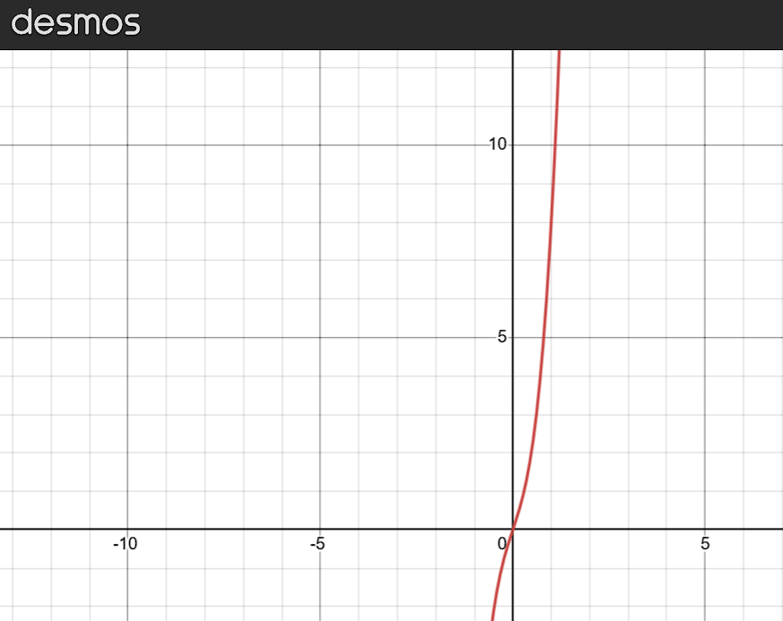
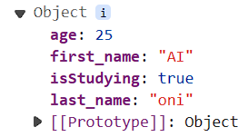
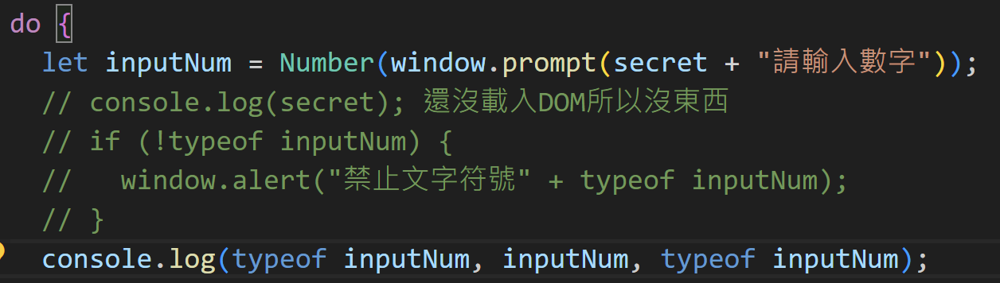
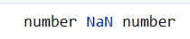
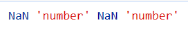
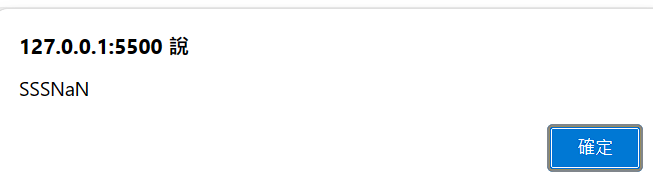
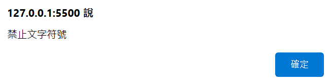
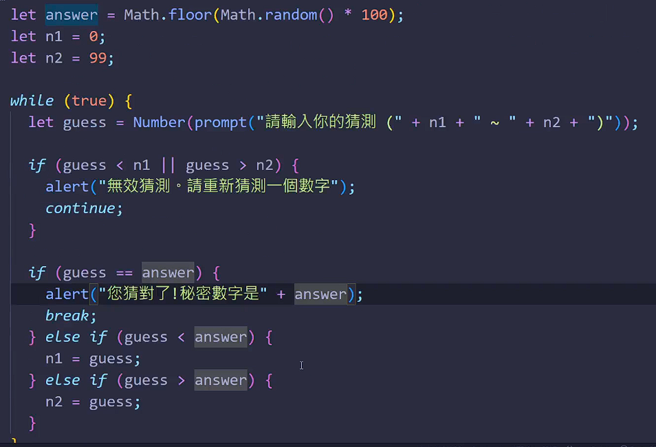

# (122) 認識函式

## 數學函數


如果同一個輸入有兩個不同的輸出，那就非函數。

下面就非函數 一個x 有兩種 y


### Desmos 不錯的繪圖數學網站

> [Desmos | 繪圖計算機](https://www.desmos.com/calculator?lang=zh-TW) 


## JS Function

```js
function name ([param[,param[,...param]]]){
    statements 
}
```

```js
/*       認識函數            */
function f() {
  console.log("first函數");
}
f(); // 寫了才會有輸出!  
```

- 引用函數
  
  function execution 
  
  invoke a function
  
  function invocation
  
  call a function

```js
/*      第二個帶參數   */
function sayHi(name, meal) {
  console.log("你好我" + name);
  console.log("我要去吃" + meal + "了");
}

sayHi("oni");
sayHi("oni","午餐")
```

- 不用像JAVA 還要宣告型態

- 不帶入 午餐 直接得到 undefined 😕😕
  
  

# (123) return關鍵字

## 沒有寫return 會默認回傳undefined。

- ```js
  function circle(r) {
    3.14 * r ** 2;
  }
  console.log(circle(10)); //undefined
  ```

## 💡特殊情況1😕

- 這個特性應該是提升hoisting之類 之後會另外說。

- ```js
  function circle(r) {
    3.14 * r ** 2;
  }
  console.log(circle(10)); //314  ，沒有下面這些code，原本是undefined 。
  
  function circle(r) {
    return 3.14 * r ** 2;
  }
  console.log(circle(10)); //314
  ```

## 💡特殊情況2 😕😕

- 自己多加的
  
  ```js
  /*  自製特殊情況2 */
  function sayHiToPeople(name) {
    return console.log("你好" + name);
  }
  console.log(sayHiToPeople());
  ```
  
  - 你好undefined
  
  - undefined  ====> 這是因為 console.log函數沒有返回值。

Undefined+Undefined=NaN

## ⭐JS函數實際上是物件

- #### 每個function都有instance properties/ methods。🗨

# (124) Array陣列

## 特性

### Not primitive data type.

- ```js
  let friends = ["apple", "banana", "cat", "dog", "umi"];
  ```

### 可以調整大小

### 可以不同資料類型⭐🗨🗨

- ```js
  let anotherArray = [null, ,undefined,false, "String", 3.14];
  console.log(anotherArray);
  ```
  
  - ,, 或者 , , 都是空白，沒差別 prettier 做的事情沒關係。
    
    
    
    
  
  - ### 實際印出來是 undefined 雖然用 console給我寫上面那樣=🙄🙄🙄
    
    ```js
    console.log(anotherArray[0]);
    console.log(anotherArray[1]);
    console.log(anotherArray[2]);
    console.log(anotherArray[3]);
    ```
    
    

### 使用非負整數訪問index

### Array複製會複製reference💡

```js
let friends = ["apple", "banana", "cat", "dog", "umi"];
let f_copy = friends;
f_copy[0] = "pig";
console.log(" -   - - - 經過複製與修改後- - - - - - -");
console.log("friends= " + friends);
// friends 陣列會被改 因為複製的是Reference 而不是deep copy (甚至不是shadow copy)
console.log("f_copy= " + f_copy);

/*        跟JAVA 相似，物件會複製目標reference 原始型態則複製value    */

let deposit = 500;
let anotherDeposit = deposit;
anotherDeposit = 600;
console.log(" -   - - - 經過複製與修改後- - - - - - -");
console.log("deposit: " + deposit);
console.log("anotherDeposit: " + anotherDeposit);
```


# (125) Reference Data Type 比較

## 類似JAVA 不能陣列==陣列

```js
/*       Reference Data Type比較            */
let x = 10;
let y = 10;
console.log(x == y); //true

let a = [1, 2, 3];
let b = [1, 2, 3];
console.log(a == b); //false
```

- primitive type 比較會相同。

- 陣列兩個算是不一樣的 obj 所以即使內容一樣不能這樣比較。

## 有字串池的概念

```js
/*          字串池概念?            */
let r = "花";   //引用池子的 花
let s = "花";  //引用池子的 花
console.log("r==s : ", r == s); //  true
console.log("r===s : ", r === s); //  true
console.log("r=='花' : ", r == "花"); //  true
console.log("r==='花' : ", r === "花"); //  true
console.log("r=='花' : ", "花" == "花"); //  true
```

# (126) ArrayMethods

## array instance properties.

### length

- ```js
  let friends = ["apple", "banana", "cat", "dog", "umi"];
  console.log(friends.length); //5
  ```

## array instanece methods.常見

### ⚠️push(element,[e2,[e3]]) 可多

- 一個或者多個元素添加到array末端，並return陣列新長度。

- 不會創造新的陣列，然後丟過去，是針對原始修改新增。

- friends.push( );
  
  - 不會增加內容例如多一個undefined 。 維持原本，不做事。⭐
    
    - 除非填入undefined
      
      
  
  - 不會出現下面這樣⭐⭐
    
    ```js
    function callphone(number) {
      console.log("印出數字" + number);
      return 1 + number;
    }
    console.log(callphone());
    ```
    
    

### ⚠️ pop

- 從陣列中移除最後一個element並且將它return回傳。
  
  ```js
  let friends = ["apple", "banana", "cat", "dog", "umi"];
  console.log(friends);
  console.log(friends.pop()); //得到umi
  console.log(friends);// ["apple", "banana", "cat", "dog"]
  ```

- 跟 JAVA  的一些異同 ，java使用前最好真的知道該類別提供的方法。
  
  ```java
  ==========================  add  =======================
  Deque<String> st = new LinkedList<String>();
  
  // populating stack
  st.add("Java");
  st.add("Source");
  st.add("code");
  st.forEach(s->System.out.println(s));
  
  > Java
  > Source
  > code
  > [Java,Source,code]
  >   ========= 透過pop/poll 彈出依序是 =========
  >           Java,Source,code
  >   ==========================  push  ====================
  >   Deque<String> st = new LinkedList<String>();
  
    // populating stack
    st.push("Java");
    st.push("Source");
    st.push("code");
    st.forEach(s->System.out.println(s));
  
  > code
  > Source
  > Java
  > [code,Source,Java]
  >   ========= 透過pop/poll 彈出依序是 =========
  >           code,Source,Java
  ```
  
  

- Deque 的`add`對應到 JS 的 `push` !     

- 兩邊的 `push` 不同⚠️⚠️⚠️

### ⚠️ shift

- 刪除第一個元素，並回傳刪除的元素本體。

### unshift(element)

- 將一個或者多個元素加到 Array開頭，並且回傳新長度。

### array of arrays

- ```js
  let myArr = [
    ["name", "address", "age"],
    ["oni", "TW", 25],
    ["umi", "TW", 15],
  ];
  
  console.log(myArr[2][0]); //umi
  ```

# (127) 跳過

- 下支影片的8:35處有小錯誤，f(50)需要的時間應該是125秒。

# (128) Function的時間複雜度

## Time complexity

## Big-O

- 輸入x增加時，時間增加的量 = ?

- f(x)=5x^3+3x  時間就是y=f(x)  增加非常快 通常看次方`最高項`就知道
  
  # O(n^3)
  
  

- # O(n) 線性很好
  
  - shift
    
    - array元素越多，則 整體往後移動越花時間。
  
  - unshift 
    
    - 放入array開頭也是要牽動後續的元素。

- # O(1) 更好  跟輸入數量無關
  
  - push 
    
    - 放到尾部 沒關係
  
  - pop 都是
    
    - 從屁股跳出來 跟array大小幾乎無關。

## 瀏覽器使用的JS引擎對陣列實現略有差異

- 有些使用 double-linked-list 

- binary search tree (BST) 之類

# (129) 進階Big O 正式定義

- 有興趣看就好，不記錄了。

# (130) Object語法

## Object

- ```js
  let Oni = {
    first_name: "AI",
    last_name: "oni",
    age: 25,
    isStudying: true,
  };
  console.log(Oni);
  console.log(Oni.age);
  console.log(Oni["last_name"]);g(Oni);
  ```
  
  

### 可以放入methods⭐

- ```js
  let Oni = {
    first_name: "AI",
    last_name: "oni",
    age: 25,
    isStudying: true,
  
    sayHi() {
      console.log("Oni say Hi");
    },
    walk(step) {
      console.log("Oni go for", step, "step.");
    },
  };        
  Oni.sayHi();     //Oni say Hi
  Oni.walk(3);     //Oni go for 3 step.
  Oni["walk"](5);  //Oni go for 5 step.⭐⭐⭐
  ```

### this

- 指向自己物件本身
  
  ```js
  let Oni = {
  ...
  age:25;
  sayAge() {
      console.log("oni is " + this.age + " years old.");
    },
  ...
  ```

- 外面沒有 物件，直接躺在js最外層的function
  
  瀏覽器顯示的就是window obj 
  
  若其他編譯環境可能是GlobalObject ..?
  
  ```js
  function hello() {
    console.log("hello");
    console.log(this); // window object (GlobalObj 瀏覽器=window object)
  }
  hello();
  ```

## 搜尋k v的方式

### .  (dot notation)

### []⭐

- 並不是指 這樣，這不是陣列。
  
  ```js
  console.log(Oni[2]);
  ```

- 應該放入 變數名稱，變數不會是數字、除非數字結合文字 !
  
  ```js
  console.log(Oni["last_name"]); 
  ```

## function跟array都是特殊Object

### ⚠️Array，不該用typeof

- 只會得到 Object 而已
  
  ```js
  let arr = [1, 2, 3, 4, 5];
  console.log(typeof arr);  //Object 
  ```

- 解方 :

### ⚠️function 該小心 .... (之前我有小實驗過)

- typeof `f` 而不是 typeof `f()` 後者會執行然後return給typeof驗身
  
  ```js
  function helloWord() {
    console.log("hello,word");
  }  
  
  console.log(typeof helloWord); 
  // ⭐fucction⭐
  console.log(typeof helloWord()); 
  //⭐先印出 hellow,word ， 再印出undefined⭐
  ```

- 稍微注意就可以了。

### array 得到Object , function得到 function

- 兩者typeof 所得到的差異。

### 😕😕如何確認 array到底是不是array

> js check array data type 

- 使用 Array.isArray()
  
  ```js
  /*          確認是不是array        */
  console.log(Array.isArray(arr));   //trues
  console.log(Array.isArray(Oni));   //false 
  ```

### 提示 JAVA 中 透過反射判斷最快

- ```java
  public class IsArray {
  
      public static void main(String[] args) {
          int a[] =new int[] {1,2,3};
          Object b=a;
  
          System.out.println(b.getClass().isArray());
      }
  }
  ```

- 使用 instanceof 
  
  ```java
  public class Main {
      public static void main(String[] args) {
          Object obj = new int[]{1, 2, 3}; // 創建一個整數陣列
  
          if (obj instanceof int[]) {
              System.out.println("這是一個整數陣列");
              int[] arr = (int[]) obj; // 進行強制轉換
              for (int num : arr) {
                  System.out.println(num);
              }
          } else {
              System.out.println("這不是一個整數陣列");
          }
      }
  }
  ```
  
  ```java
  import java.lang.reflect.Array;
  
  public class ArrayCheck {
      public static void main(String[] args) {
          Object obj = /* your object */;
  
          if (obj.getClass().isArray()) {
              Class<?> elementType = obj.getClass().getComponentType();
  
              if (elementType.equals(int.class)) {
                  int[] intArray = (int[]) obj;
                  // 现在可以使用 intArray 这个 int 数组
              } else if (elementType.equals(String.class)) {
                  String[] stringArray = (String[]) obj;
                  // 现在可以使用 stringArray 这个 String 数组
              } // 继续添加其他可能性的类型检查...
          } else {
              System.out.println("This is not an array or of an unknown array type.");
          }
      }
  }
  ```

# 

# (131) For loop, while loop

## for

- ```js
  for (let i = 0; i < 11; i++) {
    console.log(i); // 0~10
  }
  ```

## do while

- 無論如何就是先做一次
  
  ```js
  /*      DO WHILE           */
  // 無論如何會先做一次
  let x = 0;
  do {
    console.log(x);
    x++;
  } while (x < 5);    // 0 1 2 3 4
  
  console.log("---dowhile-2-----");
  do {
    console.log(x);
    x++;               // 4進去 出來變成5
  } while (x < -5);    // 5 沒有小於 -5
  // 上面有宣告過了所以可以直接這樣
  for (x; x < 10; x++) {
    console.log(x);
  }
  ```

## while

- ##### 小心無限迴圈 真的會當機!😕😕

- ```js
  /*       WHILE           */
  
  while (false) {  // 千萬不要改true 瀏覽器會當機= =
    console.log("執行中");
  }
  ```

## 透過return停止

- ```js
  function print100() {
    for (let i = 1; i <= 100; i++) {
      console.log(i);
      if (i == 5) {
        return;
      }
    }
  }
  print100();
  ```
  
  放在下一個commit內的132 app.js中

# (132) Nested Loop, break, continue

## NestedLoop

- ```js
  let counter = 0;
  for (let i = 0; i < 30; i++) {
    for (let j = 0; j < 70; j++) {
      counter++;
    }
  }
  console.log("計算了" + counter + "次"); // 0~29 =30 * 70 =2100
  ```

## break

- ```js
  for (let i = 0; i < 100; i++) {
    console.log(i);
    if (i == 10) {
      break;
    }
  }
  ```

- 要跳出多層迴圈用return 不過需要是function情況才能

## continue

- ```js
  console.log("-----continue---------");
  
  for (let i = 0; i < 5; i++) {
    if (i == 3) {
      continue;
    }
    console.log(i);
  }
  ```

# (133) for loop跑回圈

- 很短 跳過
  
  ```js
  let arr = ["A", "B", "C", "D", "E"];
  for (let i = 0; i < arr.length; i++) {
    console.log(arr[i]);
  }
  ```

# (134) Math Object

## Math Class

### 有學過JAVA參考下面

#### 1. 沒有constructor

#### 2. 所有的attributes methods都是static

#### 3. Math.sin(x)  Math.PI

## static properties

### Math.PI

### Math.E

## static methods

### Math.pow(x,y)

- ```js
  console.log(Math.pow(3, 2));  //9
  ```
  
  pesudorandom 偽隨機 =>使用 Mersenne prime 

### Math.random(x,y)⭐

- 包含0 不包含1

- ```js
  console.log(Math.random()); // [0,1)
    let secret = Math.floor(Math.random * 100) + 1;
    // random 0~0.9999
    // floor 讓最小 0,99.999->99
  ```
  
  ### 務必注意要 ()⭐⭐⭐

### Math.sqrt(x,y)

- ```js
  console.log(Math.sqrt(2)); //1.414
  ```

### Math.abs(x,y)

- ```js
  console.log(Math.abs(-11)); //11
  ```

### Math.floor(x,y)

- ```js
  console.log(Math.floor(1.9991)); //1
  ```

### Math.ceil(x,y)

- ```js
  console.log(Math.ceil(1.00001)); //2
  ```

# 終極密碼🙄🙄🙄🙄🙄

## 有點離譜，輸入 R 居然得到Number





```js
console.log(Number("STR"), typeof Number("STR"), inputNum, typeof inputNum);
```



- `NaN` `'number'` `NaN` `'number'` 估計是Number 在搞。

```js
let inputNum = Number(window.prompt(secret + "請輸入數字"));
    console.log(secret);
    //還沒載入DOM所以沒東西;
    window.alert("SSS" + inputNum);

    if (inputNum != NaN) {
      window.alert("禁止文字符號");
    }
```

輸入R 他說





痾???   說 inputNum NaN 的是你，說inputNum !=NaN也是你???

## GPT 佛解答。

- NaN 無法跟人做比較 他也不會等於他自己 NaN==NaN 得false

- 只能用 `isNaN(inputNum)`

## Prompt如果輸入純空白 會要求輸入...😕😕

- 代表我的程式碼被忽視了，

## 另外奇葩事情🔥

- ```js
  let inputNum = Number(window.prompt(secret + "請輸入數字"));
  
  if (!inputNum) {
        window.alert("禁止文字符號" + inputNum == null);
        continue;
      }
  ```

- 如果不輸入任何東西 ，會發現 false ，因為，字串+? ==null是false

- 他是NaN

### alert 只接受一字串🔥🔥

- ```js
  window.alert("禁止文字符號", inputNum == null); 不可以
  ```

- ```js
  window.alert(`禁止文字符號", ${inputNum == null}`); 才可以
  ```
  
  但得到false 
  
  ```js
  window.alert(`禁止文字符號", ${inputNum == false}`);
  ```
  
  得到 true 也就是說什麼都不輸入 inputNum=false的意思!🔥🔥🔥

## 這邊小結論

```js
 let inputNum = Number(window.prompt(secret + "請輸入數字"));
    console.log(secret); // 還沒載入DOM所以console沒東西;

    // 輸入文字之類 NaN  關閉 false 沒輸入 false (ed🔥ge)
    // 原本使用 if(isNaN(inputNum)) 但只能檢查是不是輸入數字以外，不能檢查沒輸入。
    if (!inputNum) {
      // 沒輸入直接按確定 inputNum=false，沒輸入不能給她通過。
      window.alert(`禁止文字符號", ${inputNum == false}`);
      continue;
    }
```

### !inputNum 直接 falsy 全部都禁止最快。

#### 額外注意 inputNum==0的問題就好🗨🗨

`if (!inputNum && inputNum >= 0 && inputNum <= 100) {` 🗨

```js
  let inputNum = Number(window.prompt(secret + "請輸入數字"));
    console.log(secret); // 還沒載入DOM所以console沒東西;

    // 輸入文字之類 NaN  關閉 false 沒輸入 false (ed🔥ge)
    // 原本使用 if(isNaN(inputNum)) 但只能檢查是不是輸入數字以外，不能檢查沒輸入。
   if (!inputNum && inputNum >= 0 && inputNum <= 100) {
      // 沒輸入直接按確定 inputNum=false，沒輸入不能給她通過。
      window.alert(`禁止文字符號", ${inputNum == false}`);
      continu continu
```

## 他的答案



# (136~139) 都是實戰練習

## 137 反轉陣列

```js
const friends = ["Harry", "Ron", "Snap", "Mike", "Grace"];
const reversed_friends = [];

 for (let i=friends.length-1;i>=0;i--) {
    reversed_friends.push(friends[i]);

  }
```

## reversed_friend=friends.reverse();   O(n)

# 138 找出最大值

```js
function findBiggest(arr) {
  if (arr.length == 0) return undefined;
  let biggestNumber = arr[0];
  for (let i = 1; i < arr.length; i++) {
    if (arr[i] > biggestNumber) {
      biggestNumber = arr[i];
    }
  }
  return biggestNumber;
}
console.log(findBiggest([1, 2, 3, 4, 5, 999]));
```

# 139 數值加總

```js
/*                    數值加總                    */

function addUpTo(n) {
  let result = 0;
  for (let i = 1; i <= n; i++) {
    result = result + i;
  }
  return result;
}使用 上底加下底 *高 /2 最快
```

## 時間

```js
let startTime = performance.now();
console.log(addUpTo(50505));
let endTime = performance.now();
console.log(endTime - startTime);
```

# 總結小考

## shift是幹嘛的

## Array length 內建的查大小屬性

- 大小可以調整

- 不可以用負數

- 0開始計算

## 小陷阱 sum

```js
let result = 0;
for (let i = 0; i < 10; i++) {
  result += i;

}// 從1+到9  不是0 不可以0 0不適用三角形概念
```
