# (155) DOM與window object

## DOM (Document Object Model)

- HTML的程式介面，採樹狀結構的表示法。

- HTML的 文本、元素、屬性、方法都視為節點。
  
  - **（Text Node）**
  
  - **（Element Node）**
  
  - **（Attribute Node）**
  
  - **（Method Node）** 

- 允許developer 附加 事件處理程序到HTML、滑鼠懸停之類。

- 可連接 Js 腳本。 如果沒有DOM、js將無法訪問跟操作內容。

### 屬性（Attributes）的例子：

1. **元素節點的屬性：**
   
   - `id`：元素的唯一標識符。
   - `className`：元素的 CSS 類名。
   - `textContent`：元素包含的文本內容。
   - `innerHTML`：元素包含的 HTML 內容。

2. **節點通用的屬性：**
   
   - `nodeType`：節點類型。
   - `nodeName`：節點的名稱。
   - `nodeValue`：節點的值。
   - `parentNode`：節點的父節點。
   - `childNodes`：節點的子節點列表。

### 方法（Methods）的例子：

1. **文件物件的方法：**
   
   - `getElementById(id)`：根據元素 ID 獲取元素節點。
   - `querySelector(selector)`：根據 CSS 選擇器獲取第一個匹配的元素節點。
   - `createElement(tagName)`：創建一個新的元素節點。
   - `appendChild(node)`：將一個節點添加到另一個節點的子節點列表的末尾。

2. **元素節點的方法：**
   
   - `setAttribute(name, value)`：設置元素的屬性。
   - `getAttribute(name)`：獲取元素的指定屬性值。
   - `classList.add(className)`：將類名添加到元素的類列表中。
   - `addEventListener(event, handler)`：為元素添加事件監聽器。

### 小節:

在 DOM（文件物件模型）中，HTML 中的文本、元素、屬性和方法都被視為不同類型的節點。DOM 將 HTML 文件表示為一個節點樹，其中包含多種類型的節點：

1. **文本節點（Text Node）：** 文本內容被視為文本節點。例如，在 HTML 中的段落文本、標題文本或是任何放置在 HTML 元素中的文本內容都被表示為文本節點。

2. **元素節點（Element Node）：** HTML 中的標籤、元素及其內容被視為元素節點。例如，`<div>`、`<p>`、`<span>` 等 HTML 標籤都會被表示為元素節點。

3. **屬性節點（Attribute Node）：** HTML 元素的屬性被視為屬性節點。例如，HTML 元素的 `id`、`class`、`href` 等屬性都被視為屬性節點。

4. **方法節點（Method Node）：** 在 DOM 中，方法並不是節點的一部分，它們是用於節點操作的 JavaScript 方法或函數。這些方法用於處理節點，而不是被視為節點本身。

綜上所述，文本節點和元素節點都是節點樹中的一部分。文本節點代表了 HTML 中的文本內容，而元素節點代表了 HTML 標籤和元素。屬性節點是元素節點的屬性，用於描述和定義元素的特性。方法節點（或方法）則是用於操作節點的 JavaScript 方法，不是節點本身的一部分。

## Window Object

```js
/*             window             */
// console.log(this);
console.log(window); //系統隱含的;😕
```

### 常見methods :

> 其實window 太常用 ，基本上不打也沒差。

#### 1. window.alert()

- 在視窗顯示對話框。
  
  ```js
  /*             alert             */
  window.alert("效果一樣");
  alert("效果一樣");
  ```

- #### 😕所以不用真的每次都window.alert...

#### 2. window.addEventListener()

- 將事件監聽程式碼附加到window object

- 後續課程才會真的講到。跳過。

#### 3. window.clearInterval()

- 將 setInterval所重複執行的code 暫停
  
  ```js
  let interval = window.setInterval(sayHelloInterval, 2000);
  /*             clearInterval()             */
  window.clearInterval(interval);
  ```

#### 4. window.prompt()

- return 用戶在對話框輸入的文字

#### 5. window.setInterval()

- 給定毫秒數、週期執行某函數。
  
  ```js
  /*             setInterval()             */
  function sayHelloInterval() {
    console.log("你好");
    console.log("oni");
  }
  window.setInterval(sayHelloInterval, 2000);
  ```
  
  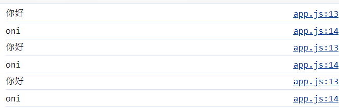

### 常見properties :

#### 1. window.console

- 瀏覽器控制台

- 常用的是console.log()、console.error()

#### 2. window.document

```js
/*    window Object - document          */
console.log(window.document);
```

#### 3. window.localStorage

- 之後說

#### 4. window.sessionStorage

- 之後說

## 物件導向概念

```js
/*            window Object 概念          */
let Umi = {
  name: "Umi",
  age: 15,
};
let Oni = {
  name: "oni",
  age: 25,
  sis: Umi,
};
console.log(Oni.sis.name); // "Umi"
```

## 重點:⚠️

- document 是物件，也是window物件的屬性之一。

- document 是指HTML document。

- document 內部HTML element都是object。
  
  - 其中每個element都有屬性跟方法。
  
  

# (156) get element by id or class

## Document Object 節點 :

### HTML 文件中常見的幾種不同類型的內容😕

1. **HTML 元素節點 (Element Nodes)**：
   
   - 這些節點代表 HTML 文件中的元素，比如 `<p>`、`<div>`、`<span>` 等標籤。
   - 這些節點包含了標籤名稱、屬性和其他子節點（比如其他元素、文字節點、或者註解節點）。

2. **文字節點 (Text Nodes)**：
   
   - 文字節點代表了 HTML 文件中的文字內容。
   - 這些節點包含了文字內容，比如 `<p>你好</p>` 中的 "你好" 部分就是文字節點。

3. **註解節點 (Comment Nodes)**：
   
   - 註解節點代表了 HTML 文件中的註解部分，即 `<!-- 註解內容 -->`。
   - 這些節點包含了註解的內容，但在 DOM 中並不會被作為網頁內容來顯示。

### DOM提供HTML Collection 及 NodeList :

在 JavaScript 中，DOM（文件物件模型）提供了兩種類型的集合：HTML Collection 和 NodeList。這些集合類型用於表示 HTML 文件中的元素集。

#### HTML Collection：

- HTML Collection 是一個包含 DOM 元素的集合，它是由標籤名稱或者是元素的 name 屬性來構建的。
- 它是**動態**的，當文檔結構發生變化時，它會自動更新。
- 它是實時反映 DOM 變化的，並且會自動更新。
- 可以通過標籤名稱、id 或者 name 屬性（在某些情況下）來訪問。

#### NodeList：

- NodeList 是另一種表示 DOM 元素集的類型。
- 通常是由 DOM 方法，例如 `querySelectorAll()` 或者 `childNodes` 返回的。
- NodeList 不是動態的，它在建立時就確定了，<u>後續對 DOM 的變化不會影響它</u>
  - #### 😕重新querySelector 還是會出現，但不會主動因DOM改變而改變。
- NodeList 也可以通過索引或者迭代方式來訪問其元素。

總體來說，HTML Collection 和 NodeList 都代表了 DOM 中的元素集合，但它們之間有一些區別，特別是在更新和訪問元素方面。要注意的是，它們都可以通過索引或迭代方式來訪問其元素。

## Document Object 常用Method :

### 1. window.document.addEventListener()

### 2. window.document.createElement(tagName)

- 下一支影片會講。157

### 3. window.document.getElementById(id)

- return 第一個相符的id的 element object
  
  ```js
  let myH1 = document.getElementById("myH1");
  console.log(myH1);
  console.log(document.getElementById("myH1"));
  ```
  
  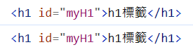

### 4. window.document.getElementyByClassName(className)

- return 一個動態的`HTML Collection`內部元素包含所有具有給定className的元素。
  
  ```js
  /*             getElementsByClassName             */
  
  let myparagraphs = document.getElementsByClassName("my-p");
  console.log(myparagraphs);
  ```
  
  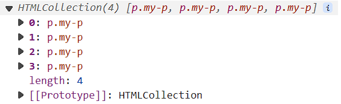

- #### ⚠️不是Array 只是一個Array-Like-Object。

- #### ⚠️正確資料型態叫做 HTMLCollection

### 新專案幾乎都用下面了，更好用。

#### querySelector(selectors)

- return 第一個符合特定選擇器群組的`element object`使用深度優先。

#### querySelectorAll(selectors)

- return 一個`靜態`的 NodeList ，List並不會隨著 DOM後續改變而變化。

# (157) querySelector

- 先補充一下createElement(tagName)
  
  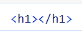
  
  只有出現在控制台。還沒附加到HTML上，附加之後會談。

## querySelector(selectors)

- return 第一個符合特定選擇器群組的`element object`使用深度優先。
  
  ```js
  /*              querySelector                  */
  
  let first_found = document.querySelector(".my-p");
  console.log(first_found); //確實得到一個
  ```

- ##### 好處是使用CSS的選法就可以。

## querySelectorAll(selectors)

- return 一個`靜態`的 NodeList ，<u>**List並不會隨著 DOM後續改變**</u>而變化。
  
  ```js
  let foundElements = document.querySelectorAll(".my-p");
  console.log(foundElements);
  ```
  
  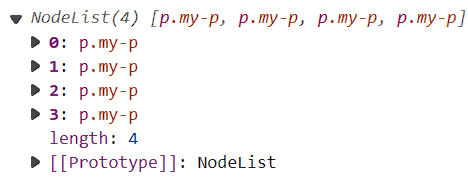
  
  #### ⚠️並不是Array 只是一個Array-Like-Object。
  
  #### ⚠️他正確資料型態叫做 NodeList
  
  #### 😕重新querySelector 查詢後還是會出現，但不會主動因DOM改變而改變。

## 差異querySelectorAll vs getElementByClassName

### 主要是因為HTMLCollection跟NodeList

- ```js
  /*              HTMLCollection是動態         */
  /*              NodeList是靜態         */
  let hellos = document.getElementsByClassName("hello");
  let helloss = document.querySelectorAll(".hello");
  
  console.log(hellos.length);
  console.log(helloss.length);
  
  let body = document.querySelector("body");
  let p = document.createElement("p");
  p.innerText = "this is a new p";
  p.classList.add("hello");
  body.appendChild(p);
  console.log("改變DOM之後，沒做二次get或query 。");
  console.log("document.getElementsByClassName('hello')得: " + hellos.length);
  console.log("document.querySelectorAll('.hello')得: " + helloss.length);
  elloss.length);
  ```
  
  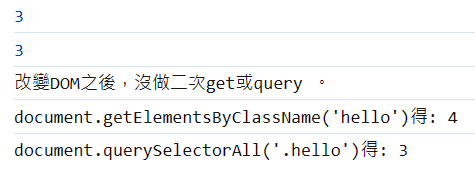
  
  💡建新HTML Element，使用selectorAll再度查詢，避免因靜態而出錯💡
  
  #### 💡提示 SelectorAll 才是NodeList 另個是element Object

# (158) Note

- 下一支影片的0:40，投影片中的【內部包含此節點在DOM Tree之下的所有節點】應更正為【內部包含此節點在DOM Tree之下的**第一層**的所有節點】。  
  
  不論是使用childNodes還是children屬性，所獲得的DOM Tree元素集合，都只會是本身元素在DOM Tree下一層的元素。如果希望獲得下下一層的元素，需要使用，像是element.children[i].children的語法，才能夠取得元素。當然，如果是下下下一層的元素，就需要使用element.children[i].children[j].children的語法。關於程式碼的例子，請見Element Object的影片。

# (159) 差別比較⚠️

## Element Object 是三種Node之1

### 三種都有childNodes屬性 (r.t. NodeList)

- childNodes屬性的回傳return type r.t. 型態為 NodeList
  
  ```js
  /*             child node、NodeList             */
  let body = document.querySelector("body"); // element object
  console.log(body);
  ```
  
  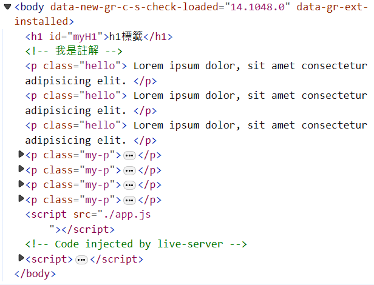
  
  ```js
  console.log(body.childNodes);
  ```
  
  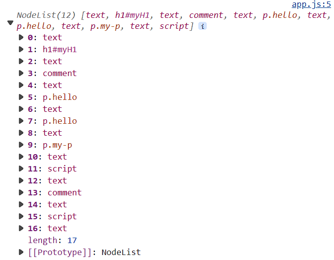

### ⚠️Element Object 多一個children屬性 (r.t. HTMLCollection)

- 💡Element 同時有兩個屬性，但另外兩人只有childNodes屬性。
  
  - ##### 🗨另外兩人 text nodes  / comment nodes🗨

## 表格1 :🔥🔥🔥

| Methods                    | Rt Type                          |
|:--------------------------:|:--------------------------------:|
| getElementById(id)         | Element Object                   |
| ...ByClassName(className)  | HTML Collection內部為Element Object |
| querySelector(selector)    | Element Object                   |
| querySelectorAll(selector) | NodeList 內部為Nodes                |

--- 

## 表格2 :🔥

|           | NodeList                     | HTML Collection              |
| --------- | ---------------------------- | ---------------------------- |
| 特徵        | 類Array、no push pop (un)shift | 類Array、no push pop (un)shift |
| motion    | static                       | dynamic                      |
| elements  | nodes                        | element objects              |
| attribute | length,index                 | length,inde                  |
| forEach   | allowed                      | not allowed                  |

## 總結 : 跟commit一樣。

- " Ch7 - section159 差別比較，比較各種節點(文本、元素、屬性、方法、註解....)，兩種選取方式，getbyClass、selectorAll得到兩種資料結構NodeList跟HTMLCollection，跟別對應nodes跟elements objects，靜態、動態，ForEach可用與否...之類的，然後ElementObject有ChildNodes屬性跟children屬性。"

# (160) Function Expression

## 創建未命名function、放到其他變數、增加彈性⭐

- ```js
  let myAddition = function (a, b) {
    return a + b;
  };
  console.log("myAddition(10, 5)", myAddition(10, 5));
  ```

- ##### ⭐⭐更特別的特性是 類似hoisting 只有宣告function才有提升
  
  ```js
  console.log("尚未宣告可先放上來 addition(3, 2)", addition(3, 2));
  
  function addition(a, b) {
    return a + b;
  }
  console.log("addition(3, 2)", addition(3, 2));
  ```
  
  ##### ⭐下面這種變數方式不能提升 (let不能 var 變成undefined)
  
  ```js
  let myAddition = function (a, b) {
    return a + b;
  };
  ```

## 當higher order function的callback function使用

- 例如 forEach 或者是 addEventListener
  
  ```js
  function react() {
    alert("有人在點螢幕!!");
  }
  window.addEventListener("click", react);
  或
  window.addEventListener("click", function () {
    alert("有人在點螢幕!!");
  });
  ```

## 使用IIFE ( immediately invoked function expression)⭐⭐⭐

- ```js
  (function (a, b) {
    console.log(a + b);
  })(10, 5);
  ```

# (161) Arrow Function Expression⭐⭐⭐⭐⭐

> **很清楚**! [你不可不知的 JavaScript 二三事#Day21：箭頭函數 (Arrow Functions) 的 this 和你想的不一樣 (1) - iT 邦幫忙::一起幫忙解決難題，拯救 IT 人的一天 (ithome.com.tw)](https://ithelp.ithome.com.tw/articles/10207992) ⭐⭐⭐⭐⭐

## ⚠️arrow function 不能傻傻用this⭐⭐⭐

```js
let Oni = {
  name: "OniSan",
  age: 25,
  sayhi: () => {
    console.log(this); // Window 物件
    console.log(this.age + "hihihi"); // 這this 非 Oni物件 
  },
  sayhi2: function () {
    console.log(this);
    console.log(this.age + "hihihi"); // 得到 Oni跟 25 hihihi
  },
};
Oni.sayhi(); // (圖一)  🗨
Oni.sayhi2(); // (圖二)  🗨
```

#### 分別得到下面

  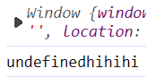


### 1.1函數定義在物件之內:

> 我有放文章連結 

#### 傳統的Fucntion

首先傳統函數每次呼叫都會建立新的函數執行環境 Function Execution Context，然後建立一個新的`this`引用物件，指向當下的呼叫者。

```js
var player = {
  whatsThis: function() {   // normal function
    return this;
  },
};
console.log( player.whatsThis() === player );    // true
```

#### ArrowFunction

沒有自己的`this` 呼叫 this，沿用LexicalContext外圍的this。

```js
var player = {
  whatsThis: () => {    // arrow function
    return this;
  },
};
console.log( player.whatsThis() === window );    // true
```

### 1.2函數定義在物件外(借用函數)

#### 傳統

```js
var whatsThis = function() {   // normal function
    return this;
};
var player = {};
player.f = whatsThis;
console.log(player.f() === player);     // true
```

#### Arrow

看的是寫好的時候的位置。

```js
var whatsThis = () => {    // arrow function
    return this;
};
var player = {};
player.f = whatsThis;
console.log(player.f() === window);     // true
```

### 1.3 物件的屬性物件的函式

#### 傳統

```js
var player = {
  name: 'OneJar',
  f: function() {
    return this;
  },
  pet: {
    name: 'Totoro',
    f: function() {
      return this;
    },
  }
};
console.log(player.f() === player);             // true
console.log(player.pet.f() === player.pet );    // true
```

#### Arrow

兩個箭頭函數外圍都是this指向Window，都沒有屬於自己的this

```js
var player = {
  name: 'OneJar',
  f: () => {
    return this;
  },
  pet: {
    name: 'Totoro',
    f: () => {
      return this;
    },
  }
};
console.log(player.f() === window);         // true
console.log(player.pet.f() === window );    // true
```

### 2.1全域環境 (Global Context) 下定義函數 & 呼叫函數

#### 傳統

```js
var whatsThis = function() {
  return this;
}

console.log( whatsThis() ); // (normal mode) window / (strict mode) undefined
```

#### Arrow

```js
var whatsThis = () => {
  return this;
}

console.log( whatsThis() ); // window
```

### 2.2內部函數 (Inner Functions)

#### 傳統⚠️⚠️⚠️

- 原因是因為 他並沒有直屬呼叫物件，而是透過function呼叫。

- 所以就分發global給它，不會跨兩層傳給他。

```js
var x = 10;
var obj = {
    x: 20,
    f: function(){
        console.log('Output#1: ', this.x);
        var foo = function(){ console.log('Output#2: ', this.x); }
        foo();
    }
};

obj.f();
```

```js
Output#1:  20
Output#2:  10
```

#### Arrow🔥🔥🔥

- 不論情況，它只看它LexicalContext (寫程式當下的上下文)

- 也就是外面有沒有function包住它，有的話就使用那個人的this。

- 外層傳統的function，傳統function會建立this 指向其直屬物件。

```js
var x = 10;
var obj = {
    x: 20,
    f: function(){
        console.log('Output#1: ', this.x);
        var foo = () => { console.log('Output#2: ', this.x); } // arrow function
        foo();
    }
};

obj.f();
```

```js
Output#1:  20
Output#2:  20
```

最後，我在上面的物件追加以下 IIFE 剛剛160最後有寫。

```js
hello: (function a() {
    //要不要命名 取決可讀性而已 ，其他地方用不了。
    console.log("hello u");
  })(), //默默自動執行  建立做一次就沒用了，通常用於初始化之類的行為。
```

### 我的想法、聯想 :😕

😕文章看一下比較好...這內容不是一下下就能了解的東西。

##### 🗨如果能看懂上面 2.2的東西，應該是蠻懂了。剩下就再學遇到再說

#### 首先想到之前印的出物件的有以下 (160)commit有

```js
console.log("----------配合物件使用--------");
let Oni = {
  name: "Oni",
  greet() {
    console.log(this.name + "打招呼");
  },
  walk: function () {
    console.log(this.name + "正在走路");
  },
};
Oni.greet(); // Onit打招呼
Oni.walk(); // Oni正在走路
```

#### 又想到IIFE

## 箭頭函數的要點:

### 零個或者兩個以上參數一定要 + ( )

- 最好加上去比較容易讀懂

### 主體不加上 {  } 則直接回傳該row運算結果

- 只有一行 例如回傳 a+b 結果

### 有多行表達一定要 {  }  包起來

- 只有單一運算式才會幫你回傳結果。

### { } 裡面要 return 才會回傳undefined以外

- {} 的話記得要加上return

### ArrowFunction沒有this綁定，不要在物件當方法使用this

- 自己注意使用this

# (162) forEach method

## forEach(function(element){dosome})

## forEach(function(element,index){})

- 一個是元素本身，一個是位在第幾index。

## ⚠️帶入傳統函數跟箭頭對this有影響否?

- ```js
  /*  index 顯出、this是 Window物件 (沒直屬父親)                 */
  myLuckyNumbers.forEach(function (element, index) {
    console.log(this, ":", index, ":", element + 3);
  });
  ```

- ##### 你還是得到Window 而不是呼叫者，因為它內部直接幫你呼叫function，沒有直屬父親，所以this指向Global或者Window。

# (163) forEach in NodeList

## HTMLCollection  Vs   NodeList😕

- HTMLCollection不可使用forEach功能，雖然兩者看起來很相似。
  
  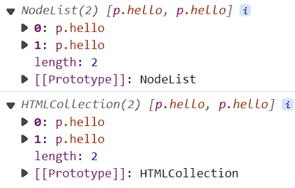
  
  ```js
  /*                       ForEach                      */
  /*    NodeList          */
  console.log("-----------NodeList------------");
  let hellos = document.querySelectorAll(".hello");
  console.log(hellos);
  hellos.forEach((e) => console.log(e));
  
  /*    HTMLCollection          */
  console.log("-----------HTMLCollection------------");
  hellos = document.getElementsByClassName("hello");
  console.log(hellos);
  // hellos.forEach((e) => console.log(e));  //無法使用，這是NodeList才有。
  ```

# (164) Element Objects 1

## 有些獨特的屬性方法是特有，但其他

## 必須具有以下Properties、Methods :

### 1. addEventListener(event,callbackFn)

### 2. appendChild(element)

```js
let body = document.querySelector("body");
let myH1 = document.createElement("h1");
// innerHTML 標籤會被讀做標籤 , innerText 標籤也是純文字
// myH1.innerText = "我是附加的H1";
myH1.innerHTML = "<a href='https://www.google.com'>Google</a>";
body.appendChild(myH1);
```

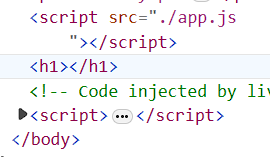

注意innerText是屬性而不是方法 ! 亂用會消失，雖然GPT會告訴你。

innerHTML 標籤會被讀做標籤 , innerText 標籤也是純文字

### 3. children -> HTMLCollection

#### 🔥 去看之前表格一有提到

#### ⚠️ 159說過、只有Element Object 才有此屬性

```js
body = document.querySelector("body");
console.log("----------body--------------");
console.log(body);
console.log("----------body.children--------------");
console.log(body.children); // HTMLCollection
console.log("----------body.children.children--------------");
console.log(body.children[0].children); // 物件[0] 才有children 才有另一個HTMLCollection
```

### 4. childNodes ->NodeList

### 5. parentElement

```js
console.log("----------parentElement--------------");
let firstP = document.querySelector("p");
console.log("----------parentElement=div--------------");
console.log(firstP.parentElement);
console.log("----------parentElement.parentElement=body--------------");
console.log(firstP.parentElement.parentElement);
```

### 6. classList

- 紀錄找到的元素所持有的class列表

```js
console.log("----------classList--------------");
firstP = document.querySelector("p");
console.log(firstP.classList);
```

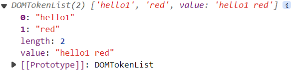

#### 該物件可用、add() remove() toggle() contains()

- 增加屬性、刪除屬性 

- toggle 類似電燈開關那樣切換
  
  ```js
  firstP.addEventListener("click", () => {
    firstP.classList.toggle("blue");
    console.log(firstP.classList);
  });
  ```

- contains查詢 有沒有包含某class

---

# (165) Element Objects 2

## 續 - Properties、Methods :

### 7. getAttribute(attributeName)

```js
<a title="到google首頁" href="https://www.google.com">google</a>
let a = document.querySelector("a");
console.log(a.getAttribute("title")); // 到google首頁
console.log(a.getAttribute("href")); // https://www.google.com
```

- title是跟之前下面這個功能一樣
  
  

### 8. innerHTML

### 9. innerText

- 以上看過就不多述。

### 10. querySelector(selector)

- Element Objects 內部尋找

- 之前是在Document Object去尋找全體

### 11. querySelectorAll(selector)

### 12. remove()💡

```js
console.log("----------remove--------------");

let btn = document.querySelector("#disappear");
btn.addEventListener("click", () => {
  // a.remove("href");  // 不是attr消失而是node本身
  // a.removeAttribute("href");
  a.remove();
  // a.toggleAttribute 也有~
});
```

### 13. style⭐⭐

- 可以改變element object's inline styling。

- 因為JS 不允許使用 hyphen ( - ) 不能 - 

- 所以CSS屬性都使用camelCase。

```js
console.log("----------style--------------");
// btn.style.backgroundColor = "green";
// btn.style.color = "white";
btn.style = "background-Color:gray;color:white;"; 
```

# (166) Inheritance

# (167) JS事件

# (168) Event Bubbling

# (169) Storage講解

# (170) JSON與Storag
