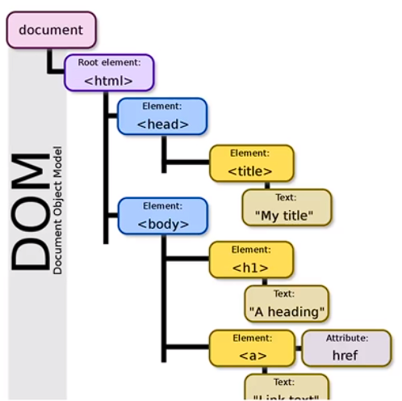

# (155) DOM與window object

## DOM (Document Object Model)

- HTML的程式介面，採樹狀結構的表示法。

- HTML的 文本、元素、屬性、方法都視為節點。
  
  - **（Text Node）**
  
  - **（Element Node）**
  
  - **（Attribute Node）**
  
  - **（Method Node）** 

- 允許developer 附加 事件處理程序到HTML、滑鼠懸停之類。

- 可連接 Js 腳本。 如果沒有DOM、js將無法訪問跟操作內容。

### 屬性（Attributes）的例子：

1. **元素節點的屬性：**
   
   - `id`：元素的唯一標識符。
   - `className`：元素的 CSS 類名。
   - `textContent`：元素包含的文本內容。
   - `innerHTML`：元素包含的 HTML 內容。

2. **節點通用的屬性：**
   
   - `nodeType`：節點類型。
   - `nodeName`：節點的名稱。
   - `nodeValue`：節點的值。
   - `parentNode`：節點的父節點。
   - `childNodes`：節點的子節點列表。

### 方法（Methods）的例子：

1. **文件物件的方法：**
   
   - `getElementById(id)`：根據元素 ID 獲取元素節點。
   - `querySelector(selector)`：根據 CSS 選擇器獲取第一個匹配的元素節點。
   - `createElement(tagName)`：創建一個新的元素節點。
   - `appendChild(node)`：將一個節點添加到另一個節點的子節點列表的末尾。

2. **元素節點的方法：**
   
   - `setAttribute(name, value)`：設置元素的屬性。
   - `getAttribute(name)`：獲取元素的指定屬性值。
   - `classList.add(className)`：將類名添加到元素的類列表中。
   - `addEventListener(event, handler)`：為元素添加事件監聽器。

### 小節:

在 DOM（文件物件模型）中，HTML 中的文本、元素、屬性和方法都被視為不同類型的節點。DOM 將 HTML 文件表示為一個節點樹，其中包含多種類型的節點：

1. **文本節點（Text Node）：** 文本內容被視為文本節點。例如，在 HTML 中的段落文本、標題文本或是任何放置在 HTML 元素中的文本內容都被表示為文本節點。

2. **元素節點（Element Node）：** HTML 中的標籤、元素及其內容被視為元素節點。例如，`<div>`、`<p>`、`<span>` 等 HTML 標籤都會被表示為元素節點。

3. **屬性節點（Attribute Node）：** HTML 元素的屬性被視為屬性節點。例如，HTML 元素的 `id`、`class`、`href` 等屬性都被視為屬性節點。

4. **方法節點（Method Node）：** 在 DOM 中，方法並不是節點的一部分，它們是用於節點操作的 JavaScript 方法或函數。這些方法用於處理節點，而不是被視為節點本身。

綜上所述，文本節點和元素節點都是節點樹中的一部分。文本節點代表了 HTML 中的文本內容，而元素節點代表了 HTML 標籤和元素。屬性節點是元素節點的屬性，用於描述和定義元素的特性。方法節點（或方法）則是用於操作節點的 JavaScript 方法，不是節點本身的一部分。

## Window Object

```js
/*             window             */
// console.log(this);
console.log(window); //系統隱含的;😕
```

### 常見methods :

> 其實window 太常用 ，基本上不打也沒差。

#### window.alert()

- 在視窗顯示對話框。
  
  ```js
  /*             alert             */
  window.alert("效果一樣");
  alert("效果一樣");
  ```

- #### 😕所以不用真的每次都window.alert...

#### window.addEventListener()

- 將事件監聽程式碼附加到window object

- 後續課程才會真的講到。跳過。

#### window.clearInterval()

- 將 setInterval所重複執行的code 暫停
  
  ```js
  let interval = window.setInterval(sayHelloInterval, 2000);
  /*             clearInterval()             */
  window.clearInterval(interval);
  ```

#### window.prompt()

- return 用戶在對話框輸入的文字

#### window.setInterval()

- 給定毫秒數、週期執行某函數。
  
  ```js
  /*             setInterval()             */
  function sayHelloInterval() {
    console.log("你好");
    console.log("oni");
  }
  window.setInterval(sayHelloInterval, 2000);
  ```
  
  

### 常見properties :

#### window.console

- 瀏覽器控制台

- 常用的是console.log()、console.error()

#### window.document

```js
/*    window Object - document          */
console.log(window.document);
```

#### window.localStorage

- 之後說

#### window.sessionStorage

- 之後說

## 物件導向概念

```js
/*            window Object 概念          */
let Umi = {
  name: "Umi",
  age: 15,
};
let Oni = {
  name: "oni",
  age: 25,
  sis: Umi,
};
console.log(Oni.sis.name); // "Umi"
```

## 重點:⚠️

- document 是物件，也是window物件的屬性之一。

- document 是指HTML document。

- document 內部HTML element都是object。
  
  - 其中每個element都有屬性跟方法。
  
  

# (156) get element by id or class

## Document Object 節點 :

### HTML 文件中常見的幾種不同類型的內容😕

1. **HTML 元素節點 (Element Nodes)**：
   
   - 這些節點代表 HTML 文件中的元素，比如 `<p>`、`<div>`、`<span>` 等標籤。
   - 這些節點包含了標籤名稱、屬性和其他子節點（比如其他元素、文字節點、或者註解節點）。

2. **文字節點 (Text Nodes)**：
   
   - 文字節點代表了 HTML 文件中的文字內容。
   - 這些節點包含了文字內容，比如 `<p>你好</p>` 中的 "你好" 部分就是文字節點。

3. **註解節點 (Comment Nodes)**：
   
   - 註解節點代表了 HTML 文件中的註解部分，即 `<!-- 註解內容 -->`。
   - 這些節點包含了註解的內容，但在 DOM 中並不會被作為網頁內容來顯示。

### DOM提供HTML Collection 及 NodeList :

在 JavaScript 中，DOM（文件物件模型）提供了兩種類型的集合：HTML Collection 和 NodeList。這些集合類型用於表示 HTML 文件中的元素集。

#### HTML Collection：

- HTML Collection 是一個包含 DOM 元素的集合，它是由標籤名稱或者是元素的 name 屬性來構建的。
- 它是**動態**的，當文檔結構發生變化時，它會自動更新。
- 它是實時反映 DOM 變化的，並且會自動更新。
- 可以通過標籤名稱、id 或者 name 屬性（在某些情況下）來訪問。

#### NodeList：

- NodeList 是另一種表示 DOM 元素集的類型。
- 通常是由 DOM 方法，例如 `querySelectorAll()` 或者 `childNodes` 返回的。
- NodeList 不是動態的，它在建立時就確定了，<u>後續對 DOM 的變化不會影響它</u>
  - #### 😕重新querySelector 還是會出現，但不會主動因DOM改變而改變。
- NodeList 也可以通過索引或者迭代方式來訪問其元素。

總體來說，HTML Collection 和 NodeList 都代表了 DOM 中的元素集合，但它們之間有一些區別，特別是在更新和訪問元素方面。要注意的是，它們都可以通過索引或迭代方式來訪問其元素。

## Document Object 常用Method :

### window.document.addEventListener()

### window.document.createElement(tagName)

- 下一支影片會講。157

### window.document.getElementById(id)

- return 第一個相符的id的 element object
  
  ```js
  let myH1 = document.getElementById("myH1");
  console.log(myH1);
  console.log(document.getElementById("myH1"));
  ```
  
  

### window.document.getElementyByClassName(className)

- return 一個動態的`HTML Collection`內部元素包含所有具有給定className的元素。
  
  ```js
  /*             getElementsByClassName             */
  
  let myparagraphs = document.getElementsByClassName("my-p");
  console.log(myparagraphs);
  ```
  
  

- #### ⚠️不是Array 只是一個Array-Like-Object。

- #### ⚠️正確資料型態叫做 HTMLCollection

### 新專案幾乎都用下面了，更好用。

#### querySelector(selectors)

- return 第一個符合特定選擇器群組的`element object`使用深度優先。

#### querySelectorAll(selectors)

- return 一個`靜態`的 NodeList ，List並不會隨著 DOM後續改變而變化。

# (157) querySelector

- 先補充一下createElement(tagName)
  
  
  
  只有出現在控制台。還沒附加到HTML上，附加之後會談。

## querySelector(selectors)

- return 第一個符合特定選擇器群組的`element object`使用深度優先。
  
  ```js
  /*              querySelector                  */
  
  let first_found = document.querySelector(".my-p");
  console.log(first_found); //確實得到一個
  ```

- ##### 好處是使用CSS的選法就可以。

## querySelectorAll(selectors)

- return 一個`靜態`的 NodeList ，<u>**List並不會隨著 DOM後續改變**</u>而變化。
  
  ```js
  let foundElements = document.querySelectorAll(".my-p");
  console.log(foundElements);
  ```
  
  
  
  #### ⚠️並不是Array 只是一個Array-Like-Object。
  
  #### ⚠️他正確資料型態叫做 NodeList
  
  #### 😕重新querySelector 查詢後還是會出現，但不會主動因DOM改變而改變。

## 差異querySelectorAll vs getElementByClassName

### 主要是因為HTMLCollection跟NodeList

- ```js
  /*              HTMLCollection是動態         */
  /*              NodeList是靜態         */
  let hellos = document.getElementsByClassName("hello");
  let helloss = document.querySelectorAll(".hello");
  
  console.log(hellos.length);
  console.log(helloss.length);
  
  let body = document.querySelector("body");
  let p = document.createElement("p");
  p.innerText = "this is a new p";
  p.classList.add("hello");
  body.appendChild(p);
  console.log("改變DOM之後，沒做二次get或query 。");
  console.log("document.getElementsByClassName('hello')得: " + hellos.length);
  console.log("document.querySelectorAll('.hello')得: " + helloss.length);
  elloss.length);
  ```
  
  
  
  💡建新HTML Element，使用selectorAll再度查詢，避免因靜態而出錯💡
  
  #### 💡提示 SelectorAll 才是NodeList 另個是element Object

# (158) Note

- 下一支影片的0:40，投影片中的【內部包含此節點在DOM Tree之下的所有節點】應更正為【內部包含此節點在DOM Tree之下的**第一層**的所有節點】。  
  
  不論是使用childNodes還是children屬性，所獲得的DOM Tree元素集合，都只會是本身元素在DOM Tree下一層的元素。如果希望獲得下下一層的元素，需要使用，像是element.children[i].children的語法，才能夠取得元素。當然，如果是下下下一層的元素，就需要使用element.children[i].children[j].children的語法。關於程式碼的例子，請見Element Object的影片。

# (159) 差別比較

# (160) Function Expression

# (161) Arrow Function Expression

# (162) forEach method

# (163) forEach in NodeList

# (164) Element Objects 1

# (165) Element Objects 2

# (166) Inheritance

# (167) JS事件

# (168) Event Bubbling

# (169) Storage講解

# (170) JSON與Storag
