# (155) DOM與window object

## DOM (Document Object Model)

- HTML的程式介面，採樹狀結構的表示法。

- HTML的 文本、元素、屬性、方法都視為節點。
  
  - **（Text Node）**
  
  - **（Element Node）**
  
  - **（Attribute Node）**
  
  - **（Method Node）** 

- 允許developer 附加 事件處理程序到HTML、滑鼠懸停之類。

- 可連接 Js 腳本。 如果沒有DOM、js將無法訪問跟操作內容。

### 屬性（Attributes）的例子：

1. **元素節點的屬性：**
   
   - `id`：元素的唯一標識符。
   - `className`：元素的 CSS 類名。
   - `textContent`：元素包含的文本內容。
   - `innerHTML`：元素包含的 HTML 內容。

2. **節點通用的屬性：**
   
   - `nodeType`：節點類型。
   - `nodeName`：節點的名稱。
   - `nodeValue`：節點的值。
   - `parentNode`：節點的父節點。
   - `childNodes`：節點的子節點列表。

### 方法（Methods）的例子：

1. **文件物件的方法：**
   
   - `getElementById(id)`：根據元素 ID 獲取元素節點。
   - `querySelector(selector)`：根據 CSS 選擇器獲取第一個匹配的元素節點。
   - `createElement(tagName)`：創建一個新的元素節點。
   - `appendChild(node)`：將一個節點添加到另一個節點的子節點列表的末尾。

2. **元素節點的方法：**
   
   - `setAttribute(name, value)`：設置元素的屬性。
   - `getAttribute(name)`：獲取元素的指定屬性值。
   - `classList.add(className)`：將類名添加到元素的類列表中。
   - `addEventListener(event, handler)`：為元素添加事件監聽器。

### 小節:

在 DOM（文件物件模型）中，HTML 中的文本、元素、屬性和方法都被視為不同類型的節點。DOM 將 HTML 文件表示為一個節點樹，其中包含多種類型的節點：

1. **文本節點（Text Node）：** 文本內容被視為文本節點。例如，在 HTML 中的段落文本、標題文本或是任何放置在 HTML 元素中的文本內容都被表示為文本節點。

2. **元素節點（Element Node）：** HTML 中的標籤、元素及其內容被視為元素節點。例如，`<div>`、`<p>`、`<span>` 等 HTML 標籤都會被表示為元素節點。

3. **屬性節點（Attribute Node）：** HTML 元素的屬性被視為屬性節點。例如，HTML 元素的 `id`、`class`、`href` 等屬性都被視為屬性節點。

4. **方法節點（Method Node）：** 在 DOM 中，方法並不是節點的一部分，它們是用於節點操作的 JavaScript 方法或函數。這些方法用於處理節點，而不是被視為節點本身。

綜上所述，文本節點和元素節點都是節點樹中的一部分。文本節點代表了 HTML 中的文本內容，而元素節點代表了 HTML 標籤和元素。屬性節點是元素節點的屬性，用於描述和定義元素的特性。方法節點（或方法）則是用於操作節點的 JavaScript 方法，不是節點本身的一部分。

## Window Object

```js
/*             window             */
// console.log(this);
console.log(window); //系統隱含的;😕
```

### 常見methods :

> 其實window 太常用 ，基本上不打也沒差。

#### 1. window.alert()

- 在視窗顯示對話框。
  
  ```js
  /*             alert             */
  window.alert("效果一樣");
  alert("效果一樣");
  ```

- #### 😕所以不用真的每次都window.alert...

#### 2. window.addEventListener()

- 將事件監聽程式碼附加到window object

- 後續課程才會真的講到。跳過。

#### 3. window.clearInterval()

- 將 setInterval所重複執行的code 暫停
  
  ```js
  let interval = window.setInterval(sayHelloInterval, 2000);
  /*             clearInterval()             */
  window.clearInterval(interval);
  ```

#### 4. window.prompt()

- return 用戶在對話框輸入的文字

#### 5. window.setInterval()

- 給定毫秒數、週期執行某函數。
  
  ```js
  /*             setInterval()             */
  function sayHelloInterval() {
    console.log("你好");
    console.log("oni");
  }
  window.setInterval(sayHelloInterval, 2000);
  ```
  
  

### 常見properties :

#### 1. window.console

- 瀏覽器控制台

- 常用的是console.log()、console.error()

#### 2. window.document

```js
/*    window Object - document          */
console.log(window.document);
```

#### 3. window.localStorage

- 之後說

#### 4. window.sessionStorage

- 之後說

## 物件導向概念

```js
/*            window Object 概念          */
let Umi = {
  name: "Umi",
  age: 15,
};
let Oni = {
  name: "oni",
  age: 25,
  sis: Umi,
};
console.log(Oni.sis.name); // "Umi"
```

## 重點:⚠️

- document 是物件，也是window物件的屬性之一。

- document 是指HTML document。

- document 內部HTML element都是object。
  
  - 其中每個element都有屬性跟方法。
  
  

# (156) get element by id or class

## Document Object 節點 :

### HTML 文件中常見的幾種不同類型的內容😕

1. **HTML 元素節點 (Element Nodes)**：
   
   - 這些節點代表 HTML 文件中的元素，比如 `<p>`、`<div>`、`<span>` 等標籤。
   - 這些節點包含了標籤名稱、屬性和其他子節點（比如其他元素、文字節點、或者註解節點）。

2. **文字節點 (Text Nodes)**：
   
   - 文字節點代表了 HTML 文件中的文字內容。
   - 這些節點包含了文字內容，比如 `<p>你好</p>` 中的 "你好" 部分就是文字節點。

3. **註解節點 (Comment Nodes)**：
   
   - 註解節點代表了 HTML 文件中的註解部分，即 `<!-- 註解內容 -->`。
   - 這些節點包含了註解的內容，但在 DOM 中並不會被作為網頁內容來顯示。

### DOM提供HTML Collection 及 NodeList :

在 JavaScript 中，DOM（文件物件模型）提供了兩種類型的集合：HTML Collection 和 NodeList。這些集合類型用於表示 HTML 文件中的元素集。

#### HTML Collection：

- HTML Collection 是一個包含 DOM 元素的集合，它是由標籤名稱或者是元素的 name 屬性來構建的。
- 它是**動態**的，當文檔結構發生變化時，它會自動更新。
- 它是實時反映 DOM 變化的，並且會自動更新。
- 可以通過標籤名稱、id 或者 name 屬性（在某些情況下）來訪問。

#### NodeList：

- NodeList 是另一種表示 DOM 元素集的類型。
- 通常是由 DOM 方法，例如 `querySelectorAll()` 或者 `childNodes` 返回的。
- NodeList 不是動態的，它在建立時就確定了，<u>後續對 DOM 的變化不會影響它</u>
  - #### 😕重新querySelector 還是會出現，但不會主動因DOM改變而改變。
- NodeList 也可以通過索引或者迭代方式來訪問其元素。

總體來說，HTML Collection 和 NodeList 都代表了 DOM 中的元素集合，但它們之間有一些區別，特別是在更新和訪問元素方面。要注意的是，它們都可以通過索引或迭代方式來訪問其元素。

## Document Object 常用Method :

### 1. window.document.addEventListener()

### 2. window.document.createElement(tagName)

- 下一支影片會講。157

### 3. window.document.getElementById(id)

- return 第一個相符的id的 element object
  
  ```js
  let myH1 = document.getElementById("myH1");
  console.log(myH1);
  console.log(document.getElementById("myH1"));
  ```
  
  

### 4. window.document.getElementyByClassName(className)

- return 一個動態的`HTML Collection`內部元素包含所有具有給定className的元素。
  
  ```js
  /*             getElementsByClassName             */
  
  let myparagraphs = document.getElementsByClassName("my-p");
  console.log(myparagraphs);
  ```
  
  

- #### ⚠️不是Array 只是一個Array-Like-Object。

- #### ⚠️正確資料型態叫做 HTMLCollection

### 新專案幾乎都用下面了，更好用。

#### querySelector(selectors)

- return 第一個符合特定選擇器群組的`element object`使用深度優先。

#### querySelectorAll(selectors)

- return 一個`靜態`的 NodeList ，List並不會隨著 DOM後續改變而變化。

# (157) querySelector

- 先補充一下createElement(tagName)
  
  
  
  只有出現在控制台。還沒附加到HTML上，附加之後會談。

## querySelector(selectors)

- return 第一個符合特定選擇器群組的`element object`使用深度優先。
  
  ```js
  /*              querySelector                  */
  
  let first_found = document.querySelector(".my-p");
  console.log(first_found); //確實得到一個
  ```

- ##### 好處是使用CSS的選法就可以。

## querySelectorAll(selectors)

- return 一個`靜態`的 NodeList ，<u>**List並不會隨著 DOM後續改變**</u>而變化。
  
  ```js
  let foundElements = document.querySelectorAll(".my-p");
  console.log(foundElements);
  ```
  
  
  
  #### ⚠️並不是Array 只是一個Array-Like-Object。
  
  #### ⚠️他正確資料型態叫做 NodeList
  
  #### 😕重新querySelector 查詢後還是會出現，但不會主動因DOM改變而改變。

## 差異querySelectorAll vs getElementByClassName

### 主要是因為HTMLCollection跟NodeList

- ```js
  /*              HTMLCollection是動態         */
  /*              NodeList是靜態         */
  let hellos = document.getElementsByClassName("hello");
  let helloss = document.querySelectorAll(".hello");
  
  console.log(hellos.length);
  console.log(helloss.length);
  
  let body = document.querySelector("body");
  let p = document.createElement("p");
  p.innerText = "this is a new p";
  p.classList.add("hello");
  body.appendChild(p);
  console.log("改變DOM之後，沒做二次get或query 。");
  console.log("document.getElementsByClassName('hello')得: " + hellos.length);
  console.log("document.querySelectorAll('.hello')得: " + helloss.length);
  elloss.length);
  ```
  
  
  
  💡建新HTML Element，使用selectorAll再度查詢，避免因靜態而出錯💡
  
  #### 💡提示 SelectorAll 才是NodeList 另個是element Object

# (158) Note

- 下一支影片的0:40，投影片中的【內部包含此節點在DOM Tree之下的所有節點】應更正為【內部包含此節點在DOM Tree之下的**第一層**的所有節點】。  
  
  不論是使用childNodes還是children屬性，所獲得的DOM Tree元素集合，都只會是本身元素在DOM Tree下一層的元素。如果希望獲得下下一層的元素，需要使用，像是element.children[i].children的語法，才能夠取得元素。當然，如果是下下下一層的元素，就需要使用element.children[i].children[j].children的語法。關於程式碼的例子，請見Element Object的影片。

# (159) 差別比較⚠️

## Element Object 是3種Node之1

### 3種都有childNodes屬性 (r.t. NodeList)

⚠️HTML element/Comment/Text Node (當然還有其他種method 、properties之類)⚠️

- childNodes屬性的回傳return type r.t. 型態為 NodeList
  
  ```js
  /*             child node、NodeList             */
  let body = document.querySelector("body"); // element object
  console.log(body);
  ```
  
  
  
  ```js
  console.log(body.childNodes);
  ```
  
  

### ⚠️Element Object 多一個children屬性 (r.t. HTMLCollection)

- 💡Element 同時有兩個屬性，但另外兩人只有childNodes屬性。
  
  - ##### 🗨另外兩人 text nodes  / comment nodes🗨

## 表格1 :🔥🔥🔥

| Methods                    | Rt Type                          |
|:--------------------------:|:--------------------------------:|
| getElementById(id)         | Element Object                   |
| ...ByClassName(className)  | HTML Collection內部為Element Object |
| querySelector(selector)    | Element Object                   |
| querySelectorAll(selector) | NodeList 內部為Nodes                |

--- 

## 表格2 :🔥

|           | NodeList                     | HTML Collection              |
| --------- | ---------------------------- | ---------------------------- |
| 特徵        | 類Array、no push pop (un)shift | 類Array、no push pop (un)shift |
| motion    | static                       | dynamic                      |
| elements  | nodes                        | element objects              |
| attribute | length,index                 | length,inde                  |
| forEach   | allowed                      | not allowed                  |

## 總結 : 跟commit一樣。

- " Ch7 - section159 差別比較，比較各種節點(文本、元素、屬性、方法、註解....)，兩種選取方式，getbyClass、selectorAll得到兩種資料結構NodeList跟HTMLCollection，跟別對應nodes跟elements objects，靜態、動態，ForEach可用與否...之類的，然後ElementObject有ChildNodes屬性跟children屬性。"

# (160) Function Expression

## 創建未命名function、放到其他變數、增加彈性⭐

- ```js
  let myAddition = function (a, b) {
    return a + b;
  };
  console.log("myAddition(10, 5)", myAddition(10, 5));
  ```

- ##### ⭐⭐更特別的特性是 類似hoisting 只有宣告function才有提升
  
  ```js
  console.log("尚未宣告可先放上來 addition(3, 2)", addition(3, 2));
  
  function addition(a, b) {
    return a + b;
  }
  console.log("addition(3, 2)", addition(3, 2));
  ```
  
  ##### ⭐下面這種變數方式不能提升 (let不能 var 變成undefined)
  
  ```js
  let myAddition = function (a, b) {
    return a + b;
  };
  ```

## 當higher order function的callback function使用

- 例如 forEach 或者是 addEventListener
  
  ```js
  function react() {
    alert("有人在點螢幕!!");
  }
  window.addEventListener("click", react);
  或
  window.addEventListener("click", function () {
    alert("有人在點螢幕!!");
  });
  ```

## 使用IIFE ( immediately invoked function expression)⭐⭐⭐

- ```js
  (function (a, b) {
    console.log(a + b);
  })(10, 5);
  ```

# (161) Arrow Function Expression⭐⭐⭐⭐⭐

> **很清楚**! [你不可不知的 JavaScript 二三事#Day21：箭頭函數 (Arrow Functions) 的 this 和你想的不一樣 (1) - iT 邦幫忙::一起幫忙解決難題，拯救 IT 人的一天 (ithome.com.tw)](https://ithelp.ithome.com.tw/articles/10207992) ⭐⭐⭐⭐⭐

## ⚠️arrow function 不能傻傻用this⭐⭐⭐

```js
let Oni = {
  name: "OniSan",
  age: 25,
  sayhi: () => {
    console.log(this); // Window 物件
    console.log(this.age + "hihihi"); // 這this 非 Oni物件 
  },
  sayhi2: function () {
    console.log(this);
    console.log(this.age + "hihihi"); // 得到 Oni跟 25 hihihi
  },
};
Oni.sayhi(); // (圖一)  🗨
Oni.sayhi2(); // (圖二)  🗨
```

#### 分別得到下面

  

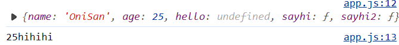

### 1.1函數定義在物件之內:

> 我有放文章連結 

#### 傳統的Fucntion

首先傳統函數每次呼叫都會建立新的函數執行環境 Function Execution Context，然後建立一個新的`this`引用物件，指向當下的呼叫者。

```js
var player = {
  whatsThis: function() {   // normal function
    return this;
  },
};
console.log( player.whatsThis() === player );    // true
```

#### ArrowFunction

沒有自己的`this` 呼叫 this，沿用LexicalContext外圍的this。

```js
var player = {
  whatsThis: () => {    // arrow function
    return this;
  },
};
console.log( player.whatsThis() === window );    // true
```

### 1.2函數定義在物件外(借用函數)

#### 傳統

```js
var whatsThis = function() {   // normal function
    return this;
};
var player = {};
player.f = whatsThis;
console.log(player.f() === player);     // true
```

#### Arrow

看的是寫好的時候的位置。

```js
var whatsThis = () => {    // arrow function
    return this;
};
var player = {};
player.f = whatsThis;
console.log(player.f() === window);     // true
```

### 1.3 物件的屬性物件的函式

#### 傳統

```js
var player = {
  name: 'OneJar',
  f: function() {
    return this;
  },
  pet: {
    name: 'Totoro',
    f: function() {
      return this;
    },
  }
};
console.log(player.f() === player);             // true
console.log(player.pet.f() === player.pet );    // true
```

#### Arrow

兩個箭頭函數外圍都是this指向Window，都沒有屬於自己的this

```js
var player = {
  name: 'OneJar',
  f: () => {
    return this;
  },
  pet: {
    name: 'Totoro',
    f: () => {
      return this;
    },
  }
};
console.log(player.f() === window);         // true
console.log(player.pet.f() === window );    // true
```

### 2.1全域環境 (Global Context) 下定義函數 & 呼叫函數

#### 傳統

```js
var whatsThis = function() {
  return this;
}

console.log( whatsThis() ); // (normal mode) window / (strict mode) undefined
```

#### Arrow

```js
var whatsThis = () => {
  return this;
}

console.log( whatsThis() ); // window
```

### 2.2內部函數 (Inner Functions)

#### 傳統⚠️⚠️⚠️

- 原因是因為 他並沒有直屬呼叫物件，而是透過function呼叫。

- 所以就分發global給它，不會跨兩層傳給他。

```js
var x = 10;
var obj = {
    x: 20,
    f: function(){
        console.log('Output#1: ', this.x);
        var foo = function(){ console.log('Output#2: ', this.x); }
        foo();
    }
};

obj.f();
```

```js
Output#1:  20
Output#2:  10
```

#### Arrow🔥🔥🔥

- 不論情況，它只看它LexicalContext (寫程式當下的上下文)

- 也就是外面有沒有function包住它，有的話就使用那個人的this。

- 外層傳統的function，傳統function會建立this 指向其直屬物件。

```js
var x = 10;
var obj = {
    x: 20,
    f: function(){
        console.log('Output#1: ', this.x);
        var foo = () => { console.log('Output#2: ', this.x); } // arrow function
        foo();
    }
};

obj.f();
```

```js
Output#1:  20
Output#2:  20
```

最後，我在上面的物件追加以下 IIFE 剛剛160最後有寫。

```js
hello: (function a() {
    //要不要命名 取決可讀性而已 ，其他地方用不了。
    console.log("hello u");
  })(), //默默自動執行  建立做一次就沒用了，通常用於初始化之類的行為。
```

### 我的想法、聯想 :😕

😕文章看一下比較好...這內容不是一下下就能了解的東西。

##### 🗨如果能看懂上面 2.2的東西，應該是蠻懂了。剩下就再學遇到再說

#### 首先想到之前印的出物件的有以下 (160)commit有

```js
console.log("----------配合物件使用--------");
let Oni = {
  name: "Oni",
  greet() {
    console.log(this.name + "打招呼");
  },
  walk: function () {
    console.log(this.name + "正在走路");
  },
};
Oni.greet(); // Onit打招呼
Oni.walk(); // Oni正在走路
```

#### 又想到IIFE

## 箭頭函數的要點:

### 零個或者兩個以上參數一定要 + ( )

- 最好加上去比較容易讀懂

### 主體不加上 {  } 則直接回傳該row運算結果

- 只有一行 例如回傳 a+b 結果

### 有多行表達一定要 {  }  包起來

- 只有單一運算式才會幫你回傳結果。

### { } 裡面要 return 才會回傳undefined以外

- {} 的話記得要加上return

### ArrowFunction沒有this綁定，不要在物件當方法使用this

- 自己注意使用this

# (162) forEach method

## forEach(function(element){dosome})

## forEach(function(element,index){})

- 一個是元素本身，一個是位在第幾index。

## ⚠️帶入傳統函數跟箭頭對this有影響否?

- ```js
  /*  index 顯出、this是 Window物件 (沒直屬父親)                 */
  myLuckyNumbers.forEach(function (element, index) {
    console.log(this, ":", index, ":", element + 3);
  });
  ```

- ##### 你還是得到Window 而不是呼叫者，因為它內部直接幫你呼叫function，沒有直屬父親，所以this指向Global或者Window。

# (163) forEach in NodeList

## HTMLCollection  Vs   NodeList😕

- HTMLCollection不可使用forEach功能，雖然兩者看起來很相似。
  
  
  
  ```js
  /*                       ForEach                      */
  /*    NodeList          */
  console.log("-----------NodeList------------");
  let hellos = document.querySelectorAll(".hello");
  console.log(hellos);
  hellos.forEach((e) => console.log(e));
  
  /*    HTMLCollection          */
  console.log("-----------HTMLCollection------------");
  hellos = document.getElementsByClassName("hello");
  console.log(hellos);
  // hellos.forEach((e) => console.log(e));  //無法使用，這是NodeList才有。
  ```

# (164) Element Objects 1

## 有些獨特的屬性方法是特有，但其他

## 必須具有以下Properties、Methods :

### 1. addEventListener(event,callbackFn)

### 2. appendChild(element)

```js
let body = document.querySelector("body");
let myH1 = document.createElement("h1");
// innerHTML 標籤會被讀做標籤 , innerText 標籤也是純文字
// myH1.innerText = "我是附加的H1";
myH1.innerHTML = "<a href='https://www.google.com'>Google</a>";
body.appendChild(myH1);
```


注意innerText是屬性而不是方法 ! 亂用會消失，雖然GPT會告訴你。

innerHTML 標籤會被讀做標籤 , innerText 標籤也是純文字

### 3. children -> HTMLCollection

#### 🔥 去看之前表格一有提到

#### ⚠️ 159說過、只有Element Object 才有此屬性

```js
body = document.querySelector("body");
console.log("----------body--------------");
console.log(body);
console.log("----------body.children--------------");
console.log(body.children); // HTMLCollection
console.log("----------body.children.children--------------");
console.log(body.children[0].children); // 物件[0] 才有children 才有另一個HTMLCollection
```

### 4. childNodes ->NodeList

### 5. parentElement

```js
console.log("----------parentElement--------------");
let firstP = document.querySelector("p");
console.log("----------parentElement=div--------------");
console.log(firstP.parentElement);
console.log("----------parentElement.parentElement=body--------------");
console.log(firstP.parentElement.parentElement);
```

### 6. classList

- 紀錄找到的元素所持有的class列表

```js
console.log("----------classList--------------");
firstP = document.querySelector("p");
console.log(firstP.classList);
```


#### 該物件可用、add() remove() toggle() contains()

- 增加屬性、刪除屬性 

- toggle 類似電燈開關那樣切換
  
  ```js
  firstP.addEventListener("click", () => {
    firstP.classList.toggle("blue");
    console.log(firstP.classList);
  });
  ```

- contains查詢 有沒有包含某class

---

# (165) Element Objects 2

## 續 - Properties、Methods :

### 7. getAttribute(attributeName)

```js
<a title="到google首頁" href="https://www.google.com">google</a>
let a = document.querySelector("a");
console.log(a.getAttribute("title")); // 到google首頁
console.log(a.getAttribute("href")); // https://www.google.com
```

- title是跟之前下面這個功能一樣
  
  

### 8. innerHTML

### 9. innerText

- 以上看過就不多述。

### 10. querySelector(selector)

- Element Objects 內部尋找

- 之前是在Document Object去尋找全體

### 11. querySelectorAll(selector)

### 12. remove()💡

```js
console.log("----------remove--------------");

let btn = document.querySelector("#disappear");
btn.addEventListener("click", () => {
  // a.remove("href");  // 不是attr消失而是node本身
  // a.removeAttribute("href");
  a.remove();
  // a.toggleAttribute 也有~
});
```

### 13. style⭐⭐

- 可以改變element object's inline styling。

- 因為JS 不允許使用 hyphen ( - ) 不能 - 

- 所以CSS屬性都使用camelCase。

```js
console.log("----------style--------------");
// btn.style.backgroundColor = "green";
// btn.style.color = "white";
btn.style = "background-Color:gray;color:white;"; 
```

# (166) Inheritance

## 觀念:

所有 HTML elements 都從 element object繼承attr跟methods。

某些元素還會有獨有的attr跟methods。

- ## 重製表單的方法

```js
console.log("----------Inheritance--------------");
let btn = document.querySelector("button");
btn.addEventListener("click", () => {
  let form = document.querySelector("form");
  form.reset();
});
```

# (167) JS事件

## Event 表示在DOM物件上所發生的事件

## AddEventListener(type,listener)

- addEventListener() 可以在window|document|element Object掛一個Event Listener ，不斷等待事件發生，然後執行任務。

- **type** : 事件類型 
  
  - button可以掛 click，window Object可以掛 resize

- **listener** : function或更常放arrow function，JS 會把**event object**當作argument 放入 listeners內部，自動執行該函式。
  
  ```js
  console.log("------------ JS Events ----------");
  let btn = document.querySelector("button");
  btn.addEventListener("click", (e) => {
    console.log(e);
  });
  ```
  
  **event object** : 上面那個 (e)
  
  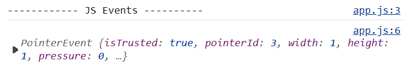

- Events Objects 繼承關係如下
  
  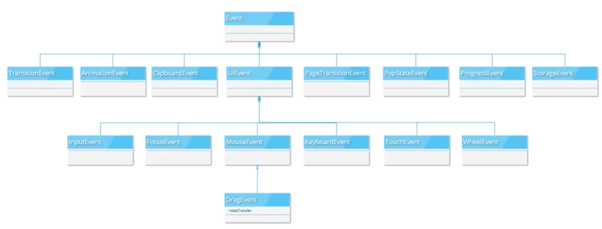

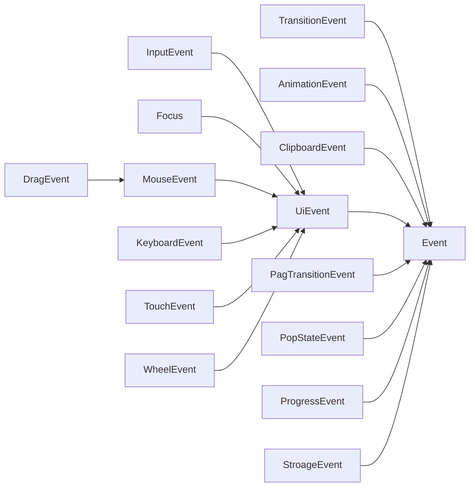

- 去MDN ， 然後他示範了keydown Event

> [Event reference | MDN (mozilla.org)](https://developer.mozilla.org/en-US/docs/Web/Events#event_listing)  

```js
console.log("------------ keydownEvnet ----------");
window.addEventListener("keydown", (e) => {
  console.log(e);
});
```

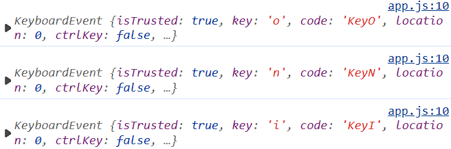

## 常用Event 的屬性跟方法

### 1. target⭐⭐

- 最初發生事件的DOM物件
  
  ```js
  let btn = document.querySelector("button");
  btn.addEventListener("click", (e) => {
    console.log(e.target);
    console.log(e);
  });
  ```
  
  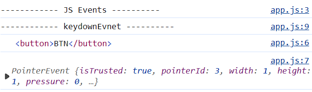

### 2. preventDefault🔥🔥

- 取消事件的預設行為
  
  ```js
  <form action="">
        <input type="text" name="姓名" id="" />
        <input type="number" name="年紀" min="0" max="100" />
        <button>交表單</button>
  </form>
  
  console.log("------------ PreventDefault ----------");
  let form = document.querySelector("form");
  form.addEventListener("submit", (e) => {
    e.preventDefault(); //阻止預設行為
    if (window.confirm("確認提交?")) {
      form.submit();
    } else {
      console.log("已取消提交");
    }
  });
  });
  ```

### 3. stopPropagation

# (168) Event Bubbling

## 剛剛的常用event 3

## stopPropagation

```html
<style>
      .a {
        width: 300px;
        height: 300px;
        background-color: aqua;
        position: relative;
      }
      .b {
        position: relative;
        top: 50%;
        left: 50%;
        width: 150px;
        height: 150px;
        background-color: orange;
        transform: translate(-50%, 50%);

        z-index: -5;
   }
    </style>

 <div class="a">
      <div class="b"></div>
 </div>
```

```js
console.log("------------EventBubbling----------");

let a = document.querySelector(".a");
let b = document.querySelector(".b");

a.addEventListener("click", () => {
  alert("A 事件監聽!");
});
b.addEventListener("click", () => {
  alert("B 事件監聽!");
});
```

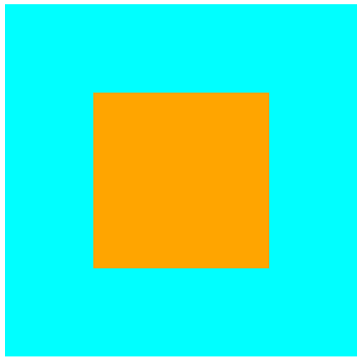

避免 內部元素淺藍被點取

### 補充 z - index⚠️

- 下圖我點的是淺藍色 (橘色被覆蓋的地方) 
  
  

- 但只有A觸動，代表 z- index 遮住後真的就點不到

### 補充 transform translate⚠️

- 參考下圖跟上圖，我點橘色 但是淺藍色也被觸發了 !
  
  明明脫離了淺藍才對 ? 但確實還是觸發A🙄
  
  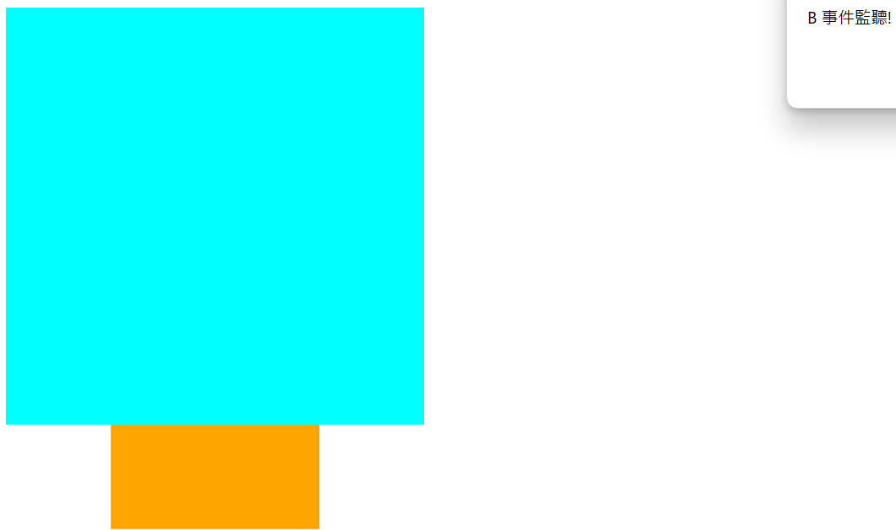 
  
  ( 我們只想要 index-z 上層的 橘色)

### 解決方式 e.stopPropagation()

- B 點取 原本A會連動，使用後就OK了。
  
  ```js
  b.addEventListener("click", (e) => {
    e.stopPropagation();
    alert("B 事件監聽!");
  });
  ```

### preventDefault 無法阻止傳播⚠️

- 終究還是會傳播上去，一定要stop才有效果。
  
  ```js
  b.addEventListener("click", (e) => {
    // e.stopPropagation();
    e.preventDefault();
    alert("B 事件監聽!");
  });
  ```

# (169) currentTarget 額外補充

> 跟 event bubbling 有關

各位同學，上支影片有個忘記補充的資訊，我在這裡用文字的方式補充說明一下。在 event bubbling 發生時，event object 的 target 屬性在 child element 與 parent element 的 event handler 內會是一樣的。

例如：

```html
<!DOCTYPE html>
<html lang="en">
  <head>
    <meta charset="UTF-8" />
    <meta name="viewport" content="width=device-width, initial-scale=1.0" />
    <title>Event Bubbling Demo</title>
  </head>
  <body>
    <div id="outer">
      <div id="middle">
        <button id="inner">Click me!</button>
      </div>
    </div>

    <script>
      // 取得元素
      const outerElement = document.getElementById("outer");
      const middleElement = document.getElementById("middle");
      const innerButton = document.getElementById("inner");

      // 綁定 click 事件
      outerElement.addEventListener("click", function (event) {
        console.log("Outer element clicked!");
        console.log("Event target:", event.target);
      });

      middleElement.addEventListener("click", function (event) {
        console.log("Middle element clicked!");
        console.log("Event target:", event.target);
      });

      innerButton.addEventListener("click", function (event) {
        console.log("Inner button clicked!");
        console.log("Event target:", event.target);
      });
    </script>
  </body>
</html>
```

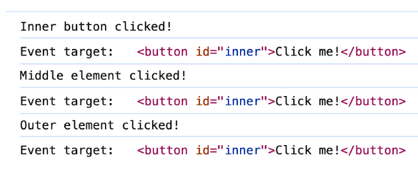

這裡可以看出三個 event handler 內的 event.target 屬性都是

` <button id=“inner”>`。這是一個很特別的規則。但這個規則的壞處是我們無法知道目前是哪個元素上的event handler 正在被執行。因此，JavaScript 的 event object 除了 target 屬性之外，有另一個屬性叫做 currentTarget。

MDN 上對 currentTarget 的定義是

> 「The currentTarget read-only property of the Event interface identifies the element to which the event handler has been attached. This will not always be the same as the element on which the event was fired, because the event may have fired on a descendant of the element with the handler, and then bubbled up to the element with the handler. The element on which the event was fired is given by Event.target.」 （[Event: currentTarget property - Web APIs | MDN](https://developer.mozilla.org/en-US/docs/Web/API/Event/currentTarget)）

簡單來說，addEventListener 監聽的是誰，則 e.currentTarget 就是誰。例如：

```html
<!DOCTYPE html>
<html lang="en">
  <head>
    <meta charset="UTF-8" />
    <meta name="viewport" content="width=device-width, initial-scale=1.0" />
    <title>Event Bubbling Demo</title>
  </head>
  <body>
    <div id="outer">
      <div id="middle">
        <button id="inner">Click me!</button>
      </div>
    </div>

    <script>
      // 取得元素
      const outerElement = document.getElementById("outer");
      const middleElement = document.getElementById("middle");
      const innerButton = document.getElementById("inner");

      // 綁定 click 事件
      outerElement.addEventListener("click", function (event) {
        console.log("Outer element clicked!");
        console.log("Event target:", event.target);
        console.log("Event current target:", event.currentTarget);
      });

      middleElement.addEventListener("click", function (event) {
        console.log("Middle element clicked!");
        console.log("Event target:", event.target);
        console.log("Event current target:", event.currentTarget);
      });

      innerButton.addEventListener("click", function (event) {
        console.log("Inner button clicked!");
        console.log("Event target:", event.target);
        console.log("Event current target:", event.currentTarget);
      });
    </script>
  </body>
</html>
```

這段程式碼運行的結果是：

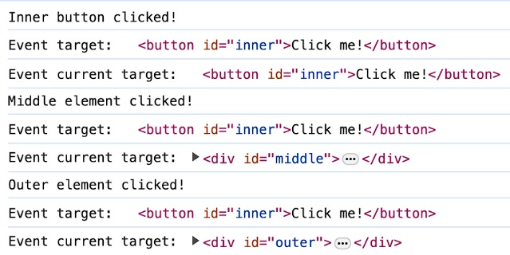

這裡可以看出，currentTarget 不斷在變化，指向的都是 addEventListener 的監聽對象。

# (170) Storage講解

## LocalStorage and SessionStorage

- Storage 瀏覽器儲存數據的地方 (不等於database)、內部資料儲存都是 key value pair，不論key或value 資料型態都必須是String、如果不是的話會被強制轉換再儲存。

- Local 關機也會存在

- Session 瀏覽器關閉就消失

- 綁定網址的

### 兩人的methods都一樣~

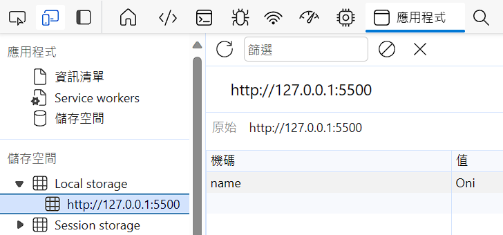

#### 1. setItem(key,value)

- 添加 k-v 進去，如果k存在了，就更新v。
  
  ```js
  // window.localStorage
  localStorage.setItem("name", "Oni");
  localStorage.setItem("age", 25);
  ```

#### 2. getItem(key)

- 找出對應的value，不存在則返回null。
  
  ```js
  let myName = localStorage.getItem("name");
  let myAge = localStorage.getItem("age");
  
  console.log(myName, typeof myName);
  console.log(myAge, typeof myAge);
  ```
  
  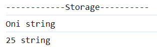

#### 3. removeItem(key)

- 清除給定的key，對應的儲存資料。

#### 4. clear()

- 清除所有的k-v 。

# (171) JSON與Storage

## 原因 :

由於 Storage 只能以字串型態儲存資料，所以陣列物件儲存就要特別設計，讓其內部物件能進去，因此特別介紹JSON。

## 介紹一下樣貌:

vscode>左下角齒輪>setting>

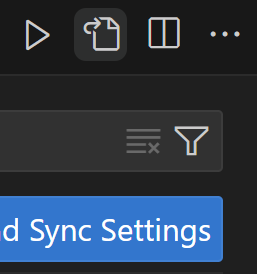

- 裡面就有VS設定檔案

```js
{
  "workbench.colorTheme": "Default Dark Modern",
  "code-runner.runInTerminal": true,
  "markdown-preview-enhanced.revealjsTheme": "black.css",
  "markdown-preview-enhanced.previewTheme": "github-dark.css",
  "editor.defaultFormatter": "esbenp.prettier-vscode",
  "workbench.iconTheme": "eq-material-theme-icons",
  "editor.formatOnSave": true,
  "editor.formatOnPaste": true,
  "window.zoomLevel": 1
}
```

## JSON Object兩個方法:

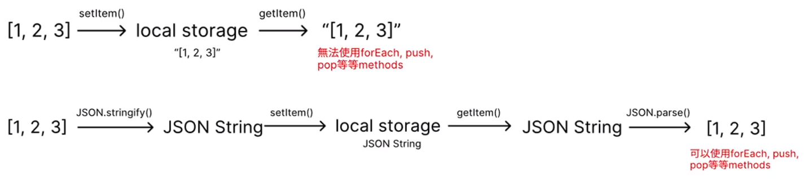

### JSON.stringify(value)

- 將value轉換為JSON String

### JSON.parse(text)

- 解析JSON 字串，製作出它描述的JS值、物件。

```js
console.log("------------JSON ----------");
let myLuckyNumbers = [1, 2, 3, 4, 5, 6];
localStorage.setItem("myNumbers", JSON.stringify(myLuckyNumbers));
let myarr = JSON.parse(localStorage.getItem("myNumbers"));
console.log(myarr);
myarr.forEach((e) => {
  console.log(e);
});
```

# 最終小考:

## 有意思的題目:

- window object 包含 alert()、prompt()、localStorage、console。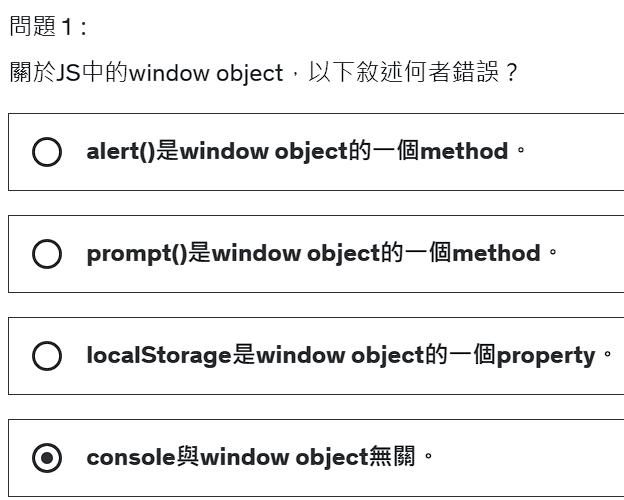

- childNodes、children 
  
  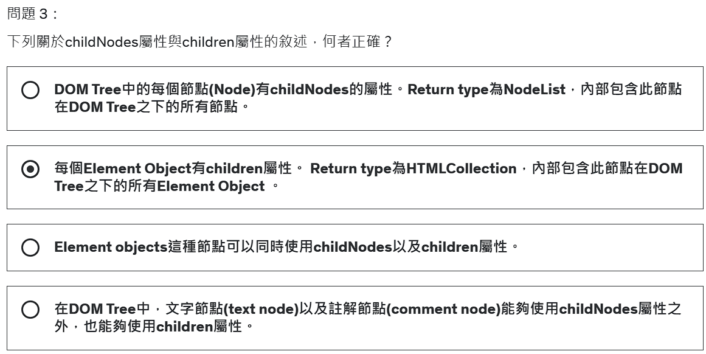
  
  - 答案不是2 而是3  
  
  - 1.2 都錯誤 因為不是所有，而是該節點的下一層而已 下下層不包含。

- NodeList、HTMLCollection比較
  
  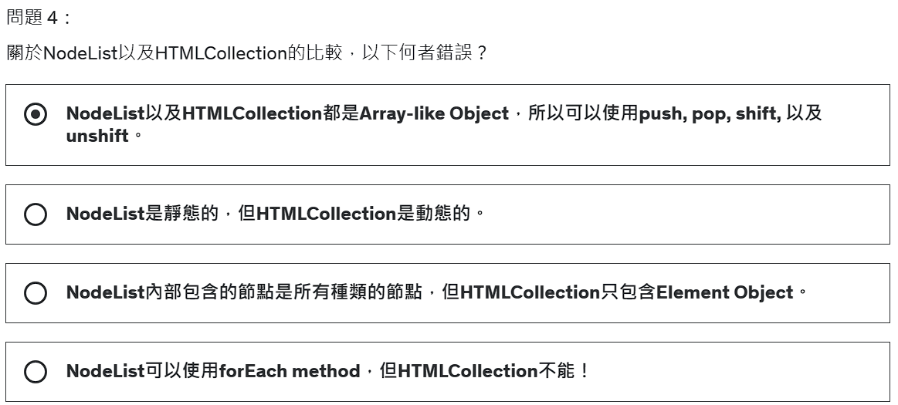
  
  🔥**比較有意思的是第三個選項，原來是這樣** 🔥
