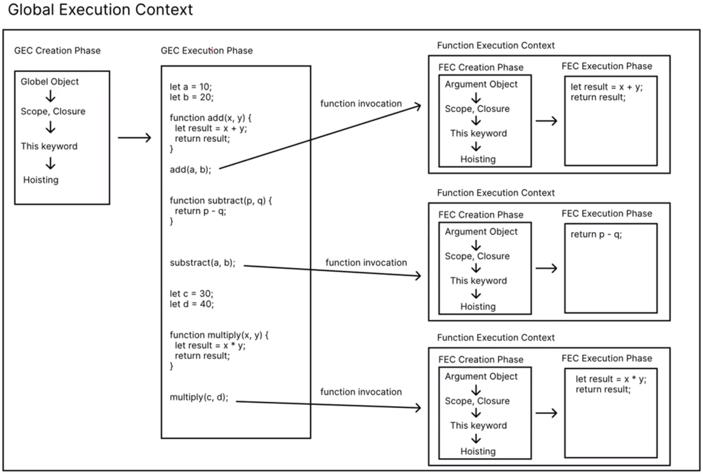
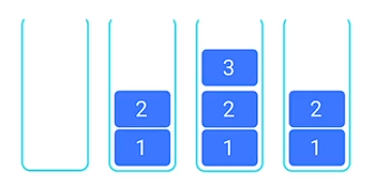
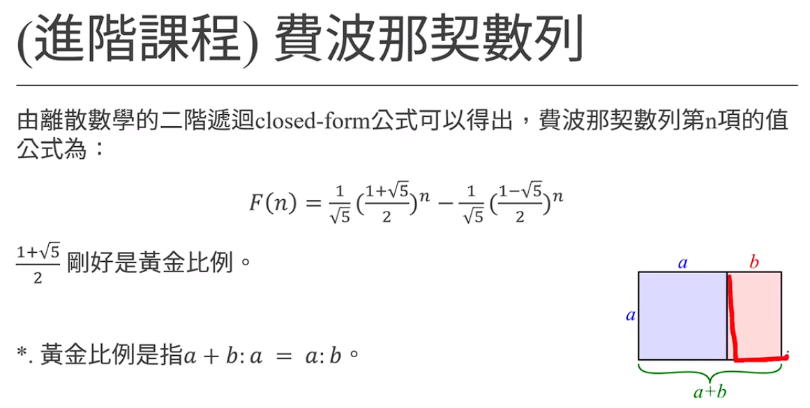
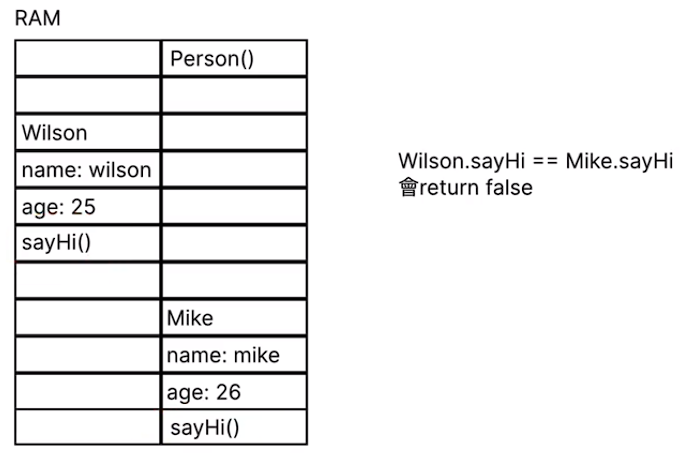

# (190) Execution Context

## 執行環境

- 執行腳本時 創建兩種執行環境

### Global Execution Context

- 執行的時候 會創造第一種 execution context
  
  其內部會進入`creation phase`
  
  1. 創建 global object
  
  2. 建立scope 
  
  3. 創建this關鍵字 ，並被綁定至global object
  
  4. variables、class、function 分配至記憶體 (hoisting步驟)
  
  結束後 進入 execution phase

### Function Execution Context

- 執行的時候也會創造第二種 execution context 也就是function execution context，非常類似，一樣有creation / execution phase。

- 差別在於 函數執行環境 不創建global object，而是創建argument object。

- Argument Object包含 放入此函數的 parameters的參照值
  
  ( a reference to all the parameters passed into the function )

- `creation phase` 
  
  1. 創建 argument object
  
  2. 建立 scope 依照closure 準則
  
  3. 創建this 關鍵字 
     
     - 可能指向window 
     
     - 也可能指向object  若忘記可以翻一下筆記。
  
  4. 將 variables、class、function 分配至記憶體 (hoisting步驟)

### 各自包含兩種階段:

#### creation phase

- 創建 global /argument  object

- 建立scope

- 創建this關鍵字 ，並被綁定至global object

- variables、class、function 分配至記憶體 (hoisting步驟)

#### execution phase

- 逐行 line by line 執行程式碼

- 遇到遞迴時，使用call stack 來排定工作順序。

## 主要是這張圖 😕



# 

# (191) Hoisting

## 解釋作用

JS Engine 執行 code之前，將 function variables class的宣告移動到其範圍頂部的過程。

- 可先執行就是因為有hoisting
  
  ```js
  hello();
  function hello() {
    console.log("hello");
  }
  ```

## 適用函數 、變數

只有declaration 被提升，不包含initialization ! 

let x=10 ; 只有 let x 會被 hoisting 

所以會被警告需要初始化 。

## Hoisting時期

### var 比較特殊，有預設undefined

它 會有預設 undefined 而不會被警告要初始化 所以要小心  

### let const沒有預設undefined

### 但是 如果不是hoisting時期⚠️

- 先宣告w 在印出w 會得到undefined⚠️
  
  ```js
  // let w
  let w;
  console.log(w); //並不是hoisting 階段產生 而是executionPhase happens in the execution phase)
  ```

# (192) Scope & Closure

## Scope

### Global scope

- 預設scope 最外層 (程式碼) 的那邊就是

### Module scope

- The scope for code running in module mode.

- 後端才會用到 之後會講

### Function scope

- scope is created with a function
  
  ```js
  function hello() {
    let a = 10;
    console.log(a);
  }
  hello(); // 10
  
  function hello2() {
    console.log(a);
  }
  // hello2(); // ReferenceError: a is not defined
  
  let x = 10;
  function helloA() {
    function helloB() {
      console.log(x + 10);
    }
    helloB();
  }
  helloA(); // 20
  ```

### Block scope

#### if `{   }` 、Loop `{   }` 的部分

變數作用範圍差異

在 JavaScript 中，使用不同的關鍵字（如 `let`、`const`、`var`）來宣告變數會影響它們的作用範圍，從而影響它們在程式碼中的可見性和生命週期。

#### 作用域

##### 1. let 、const

結論: 無法逃脫 block

```js
if (true) {
  let j = 100;
}
// console.log(j); // 這會產生 ReferenceError，因為 j 是在 if 區塊內定義的

for (let f = 0; f < 10; f++) {}
// console.log(f); // 這也會產生 ReferenceError，因為 f 是在 for 迴圈區塊內定義的
```

##### 2. var

```js
// 以下是 var
if (true) {
  var j = 100;
}
console.log(j); //100
var f = 100; // 會被下面redeclaration reassignment ，沒有block scope
for (var f = 0; f < 10; f++) {}
console.log(f); //10
```

##### 結論、提醒 : ⚠️

1. block 外可以訪問到。if、 for 、function都可以

2. 小心使用var 因為沒有block💡
   
   `declaration`和`assign`可能不小心動到外圍的變數 !

## Closure 閉包

### function也有scope hoisting ...等行為

```js
function sayYa() {
  var YY = 11;
  console.log("Ya");
  // sayYa2(); // 可以這邊執行或者
  function sayYa2() {
    console.log("Ya2");
  }
  // sayYa2(); // 這邊也可以執行
}
// sayYa2(); // 無法執行ReferenceError: sayYa2 is not defined 因為這邊只能被sayYa 這個block 所見
sayYa();
console.log("~~~~~~~~~~~", YY); // 跟block不同，closure 無法訪問裡面，最多只能內層訪問外面
```

### 內層找不到宣告的變數會往外找

```js
// 下面解釋了，他如果closure找不到 宣告的變數，會往外層去搜尋
let c = 100;
function add(a, b) {
  return a + b + c;
}
add(3, 4);
```

### 舉兩個案例⚠️很重要⚠️

#### 第一個

```js
let name = "Oni";
function sayName() {
  let name = "Umi";
  console.log("我是", name);
  sayName2(); //並不是這邊往外查找 而是定義的時候往外!
}

function sayName2() {
  console.log("我是", name);
}

sayName(); //得到??
// 我猜是 Umi 然後 Oni
// 我猜第二個是因為sayName2 早就先在 create context階段
// 就擬定使用哪個  外部的context   (這個例子而言是global的 name="Oni")
```

#### 第二個

```js
let identify = "Oni";
function talkWith() {
  let identify = "Umi";
  console.log(identify + "說話");
  function talkWith2() {
    //執行之前不知道有宣告，這是動態宣告的東西 所以使用Umi
    // 不知道上面那句正確否，但即使錯，也是會使用identify='Umi' 因為就在他頭上。
    // 如果有很多層函數，會往外找，直到global 都找不到 才會出現 undefined的錯誤消息
    console.log(identify + "說話");
  }
  talkWith2();
}
talkWith();
// Umi說話;
// Umi說話;
```

# (193) Call Stack and Recursion

## Call Stack

- JS Engine 追蹤函數調用的機制 ( 資料結構的一種 )。
  
  可以幫助我們知道JS 正在運行什麼Function、從該Function調用哪些其他Function。 
  
  
  
  - 使用Stack 也就是 LIFO 後進先出

### 堆疊過高 => stack overflow

## Recursion

> 遞迴關係 recurrence relation

```js
/*                  Recursion                */
function s(n) {
  if (n == 1) {
    // 如果沒這個，會一直往負數 然後stack overflow
    return 2;
  } else {
    return 2 * s(n - 1);
  }
}
console.log(s(10));
```

### 特殊問題 (牽涉到closure跟遞迴)

```js
//題目練習
let x = 5;
function addUpTo(n) {
  // 1+2+3+....+n = ?
  // for迴圈
  // 公式解
  // 遞迴解
  if (n == 2) {
    return 0;
  }
  n--;

  x--;
  console.log(x);
  return addUpTo(n);
}
addUpTo(5);  //4  3  2   
// 裡面並不會記住 5，而是記住外面的 ref 所以跟著改動!
```

- 代表 return 那邊的addUpTo 也會從上下文的外圍去找 ?🔥

- 並非， 以下是我的實驗結果 🔥
  
  ```js
  /*回憶起上次說到的Closure */
  let name = "Oni";
  function sayName() {
    // let name = "Umi";  取消掉
    console.log("我是", name);
    name = "umi"; 
    sayName2(); //並不是這邊往外查找 而是定義的時候往外!
  }
  function sayName2() {
    console.log("我是", name);
  }
  sayName(); //Oni umi  註解之前 Umi Oni
  ```
  
  - 代表綁定`ref` 而非啟動時狀態 `"Oni"` 🔥🔥 

### 練習1+2+3+....+100

```js
function addUntil(n) {
  // 1+2+3+....+n = ?
  // for迴圈
  // 公式解
  // 遞迴解
  if (n == 1) {
    return 1;
  }
  return n + addUntil(n - 1);
}
console.log(addUntil(100));
```

# (194) 費波那契數列

## 使用recursion

- 遞迴解
  
  ```js
  // 0, 1, 1, 2, 3, 5, 8 ,13 ,21 ,34 ,55 ,89...
  function fibo(n) {
    if (n == 0) {
      return 0;
    }
    if (n == 1) {
      return 1;
    }
    return fibo(n - 2) + fibo(n - 1);
  }
  ```

## 使用非遞迴

- 公式解 
  
  
  
  ```js
  // n越大   n 跟 n-1的比例 越接近 1.618.....黃金比例!
  
  for (let i = 1; i < 30; i++) {
    console.log(fibo(i) / fibo(i - 1)); // 分母小心不能0
  }
  1.6
  1.625
  1.6153846153846154
  1.619047619047619
  1.6176470588235294
  1.6181818181818182
  ```

- 也不一定要遞迴 因為這樣要呼叫很多次。下面更快
  
  ```js
  function fibTarget(n) {
    // 0 1 1   分別是 item 0,1,2
    // item 2-> 1   得第二項 做一次
    // item 3-> 2
    // item 4-> 3
    let fib = [0, 1, 1];
    if (n <= 0) {
      return "不可 < 1";
    }
    if (n <= 2) {
      return fib[n - 1];
    }
    for (let i = 1; i < n; i++) {
      fib[2] = fib[0] + fib[1];
      fib[0] = fib[1];
      fib[1] = fib[2];
    }
    return fib[2];
  }
  console.log(fibTarget(6));
  ```

## 陣列小重點⚠️⚠️⚠️

```js
let aaa = [1, 2, 3];
console.log(aaa[-2]);
不是不能訪問 而是 undefined
```

```js
const arr = [1, 2, 3];
arr[4] = 10;
console.log(arr); // [1, 2, 3, <1 empty item>, 10]
```

# (195) Constructor Function

## 回想起arrow 的this規則

```js
/*複習、this 在方法會指向外圍物件 */
//  另外我還記得 arrow fn 沒有自己的this 所以會使用其他傳統fn的this對象
//  如果一直往外找 找不到，則會使用最外圍的global fn 的this
let oni_origin = {
  name: "Oni",
  walk() {
    console.log(this.name + "走路");
  },
};
oni_origin.walk();
```

## new 關鍵字

1. 如果呼叫 fn 使用new關鍵字，會被當成是constructor fn使用。

2. Ram 預留空間給物件

3. this 指向該物件

4. 該物件自動被return

## 各自有自己的method非共用!!!

  

```js
function Person(name, age) {
  this.name = name;
  this.age = age;
  this.walk = function () {
    console.log(this.name + "走路中");
  };
}
// 屬於變數 用小寫
let oni = new Person("Oni", 25);
let umi = new Person("Umi", 16);
console.log(oni);
console.log(umi);
umi.walk();
console.log(oni.walk == umi.walk); //false 
console.log(undefined == undefined); //true
```

方法是獨立各自 物件擁有  跟JAVA不同!
