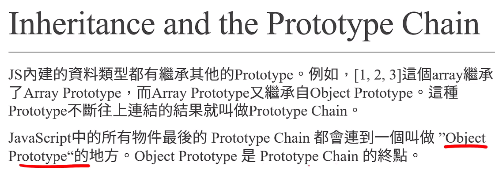

# (190) Execution Context

## 執行環境

- 執行腳本時 創建兩種執行環境

### Global Execution Context

- 執行的時候 會創造第一種 execution context
  
  其內部會進入`creation phase`
  
  1. 創建 global object
  
  2. 建立scope 
  
  3. 創建this關鍵字 ，並被綁定至global object
  
  4. variables、class、function 分配至記憶體 (hoisting步驟)
  
  結束後 進入 execution phase

### Function Execution Context

- 執行的時候也會創造第二種 execution context 也就是function execution context，非常類似，一樣有creation / execution phase。

- 差別在於 函數執行環境 不創建global object，而是創建argument object。

- Argument Object包含 放入此函數的 parameters的參照值
  
  ( a reference to all the parameters passed into the function )

- `creation phase` 
  
  1. 創建 argument object
  
  2. 建立 scope 依照closure 準則
  
  3. 創建this 關鍵字 
     
     - 可能指向window 
     
     - 也可能指向object  若忘記可以翻一下筆記。
  
  4. 將 variables、class、function 分配至記憶體 (hoisting步驟)

### 各自包含兩種階段:

#### creation phase

- 創建 global /argument  object

- 建立scope

- 創建this關鍵字 ，並被綁定至global object

- variables、class、function 分配至記憶體 (hoisting步驟)

#### execution phase

- 逐行 line by line 執行程式碼

- 遇到遞迴時，使用call stack 來排定工作順序。

## 主要是這張圖 😕


# 

# (191) Hoisting

## 解釋作用

JS Engine 執行 code之前，將 function variables class的宣告移動到其範圍頂部的過程。

- 可先執行就是因為有hoisting
  
  ```js
  hello();
  function hello() {
    console.log("hello");
  }
  ```

## 適用函數 、變數

只有declaration 被提升，不包含initialization ! 

let x=10 ; 只有 let x 會被 hoisting 

所以會被警告需要初始化 。

## Hoisting時期

### var 比較特殊，有預設undefined

它 會有預設 undefined 而不會被警告要初始化 所以要小心  

### let const沒有預設undefined

### 但是 如果不是hoisting時期⚠️

- 先宣告w 在印出w 會得到undefined⚠️
  
  ```js
  // let w
  let w;
  console.log(w); //並不是hoisting 階段產生 而是executionPhase happens in the execution phase)
  ```

# (192) Scope & Closure

## Scope

### Global scope

- 預設scope 最外層 (程式碼) 的那邊就是

### Module scope

- The scope for code running in module mode.

- 後端才會用到 之後會講

### Function scope

- scope is created with a function
  
  ```js
  function hello() {
    let a = 10;
    console.log(a);
  }
  hello(); // 10
  
  function hello2() {
    console.log(a);
  }
  // hello2(); // ReferenceError: a is not defined
  
  let x = 10;
  function helloA() {
    function helloB() {
      console.log(x + 10);
    }
    helloB();
  }
  helloA(); // 20
  ```

### Block scope

#### if `{   }` 、Loop `{   }` 的部分

變數作用範圍差異

在 JavaScript 中，使用不同的關鍵字（如 `let`、`const`、`var`）來宣告變數會影響它們的作用範圍，從而影響它們在程式碼中的可見性和生命週期。

#### 作用域

##### 1. let 、const

結論: 無法逃脫 block

```js
if (true) {
  let j = 100;
}
// console.log(j); // 這會產生 ReferenceError，因為 j 是在 if 區塊內定義的

for (let f = 0; f < 10; f++) {}
// console.log(f); // 這也會產生 ReferenceError，因為 f 是在 for 迴圈區塊內定義的
```

##### 2. var

```js
// 以下是 var
if (true) {
  var j = 100;
}
console.log(j); //100
var f = 100; // 會被下面redeclaration reassignment ，沒有block scope
for (var f = 0; f < 10; f++) {}
console.log(f); //10
```

##### 結論、提醒 : ⚠️

1. block 外可以訪問到。if、 for 、function都可以

2. 小心使用var 因為沒有block💡
   
   `declaration`和`assign`可能不小心動到外圍的變數 !

## Closure 閉包

### function也有scope hoisting ...等行為

```js
function sayYa() {
  var YY = 11;
  console.log("Ya");
  // sayYa2(); // 可以這邊執行或者
  function sayYa2() {
    console.log("Ya2");
  }
  // sayYa2(); // 這邊也可以執行
}
// sayYa2(); // 無法執行ReferenceError: sayYa2 is not defined 因為這邊只能被sayYa 這個block 所見
sayYa();
console.log("~~~~~~~~~~~", YY); // 跟block不同，closure 無法訪問裡面，最多只能內層訪問外面
```

### 內層找不到宣告的變數會往外找

```js
// 下面解釋了，他如果closure找不到 宣告的變數，會往外層去搜尋
let c = 100;
function add(a, b) {
  return a + b + c;
}
add(3, 4);
```

### 舉兩個案例⚠️很重要⚠️

#### 第一個

```js
let name = "Oni";
function sayName() {
  let name = "Umi";
  console.log("我是", name);
  sayName2(); //並不是這邊往外查找 而是定義的時候往外!
}

function sayName2() {
  console.log("我是", name);
}

sayName(); //得到??
// 我猜是 Umi 然後 Oni
// 我猜第二個是因為sayName2 早就先在 create context階段
// 就擬定使用哪個  外部的context   (這個例子而言是global的 name="Oni")
```

#### 第二個

```js
let identify = "Oni";
function talkWith() {
  let identify = "Umi";
  console.log(identify + "說話");
  function talkWith2() {
    //執行之前不知道有宣告，這是動態宣告的東西 所以使用Umi
    // 不知道上面那句正確否，但即使錯，也是會使用identify='Umi' 因為就在他頭上。
    // 如果有很多層函數，會往外找，直到global 都找不到 才會出現 undefined的錯誤消息
    console.log(identify + "說話");
  }
  talkWith2();
}
talkWith();
// Umi說話;
// Umi說話;
```

# (193) Call Stack and Recursion

## Call Stack

- JS Engine 追蹤函數調用的機制 ( 資料結構的一種 )。
  
  可以幫助我們知道JS 正在運行什麼Function、從該Function調用哪些其他Function。 
  
  
  
  - 使用Stack 也就是 LIFO 後進先出

### 堆疊過高 => stack overflow

## Recursion

> 遞迴關係 recurrence relation

```js
/*                  Recursion                */
function s(n) {
  if (n == 1) {
    // 如果沒這個，會一直往負數 然後stack overflow
    return 2;
  } else {
    return 2 * s(n - 1);
  }
}
console.log(s(10));
```

### 特殊問題 (牽涉到closure跟遞迴)

```js
//題目練習
let x = 5;
function addUpTo(n) {
  // 1+2+3+....+n = ?
  // for迴圈
  // 公式解
  // 遞迴解
  if (n == 2) {
    return 0;
  }
  n--;

  x--;
  console.log(x);
  return addUpTo(n);
}
addUpTo(5);  //4  3  2   
// 裡面並不會記住 5，而是記住外面的 ref 所以跟著改動!
```

- 代表 return 那邊的addUpTo 也會從上下文的外圍去找 ?🔥

- 並非， 以下是我的實驗結果 🔥
  
  ```js
  /*回憶起上次說到的Closure */
  let name = "Oni";
  function sayName() {
    // let name = "Umi";  取消掉
    console.log("我是", name);
    name = "umi"; 
    sayName2(); //並不是這邊往外查找 而是定義的時候往外!
  }
  function sayName2() {
    console.log("我是", name);
  }
  sayName(); //Oni umi  註解之前 Umi Oni
  ```
  
  - 代表綁定`ref` 而非啟動時狀態 `"Oni"` 🔥🔥 

### 練習1+2+3+....+100

```js
function addUntil(n) {
  // 1+2+3+....+n = ?
  // for迴圈
  // 公式解
  // 遞迴解
  if (n == 1) {
    return 1;
  }
  return n + addUntil(n - 1);
}
console.log(addUntil(100));
```

# (194) 費波那契數列

## 使用recursion

- 遞迴解
  
  ```js
  // 0, 1, 1, 2, 3, 5, 8 ,13 ,21 ,34 ,55 ,89...
  function fibo(n) {
    if (n == 0) {
      return 0;
    }
    if (n == 1) {
      return 1;
    }
    return fibo(n - 2) + fibo(n - 1);
  }
  ```

## 使用非遞迴

- 公式解 
  
  
  
  ```js
  // n越大   n 跟 n-1的比例 越接近 1.618.....黃金比例!
  
  for (let i = 1; i < 30; i++) {
    console.log(fibo(i) / fibo(i - 1)); // 分母小心不能0
  }
  1.6
  1.625
  1.6153846153846154
  1.619047619047619
  1.6176470588235294
  1.6181818181818182
  ```

- 也不一定要遞迴 因為這樣要呼叫很多次。下面更快
  
  ```js
  function fibTarget(n) {
    // 0 1 1   分別是 item 0,1,2
    // item 2-> 1   得第二項 做一次
    // item 3-> 2
    // item 4-> 3
    let fib = [0, 1, 1];
    if (n <= 0) {
      return "不可 < 1";
    }
    if (n <= 2) {
      return fib[n - 1];
    }
    for (let i = 1; i < n; i++) {
      fib[2] = fib[0] + fib[1];
      fib[0] = fib[1];
      fib[1] = fib[2];
    }
    return fib[2];
  }
  console.log(fibTarget(6));
  ```

## 陣列小重點⚠️⚠️⚠️

```js
let aaa = [1, 2, 3];
console.log(aaa[-2]);
不是不能訪問 而是 undefined
```

```js
const arr = [1, 2, 3];
arr[4] = 10;
console.log(arr); // [1, 2, 3, <1 empty item>, 10]
```

# (195) Constructor Function

## 回想起arrow 的this規則

```js
/*複習、this 在方法會指向外圍物件 */
//  另外我還記得 arrow fn 沒有自己的this 所以會使用其他傳統fn的this對象
//  如果一直往外找 找不到，則會使用最外圍的global fn 的this
let oni_origin = {
  name: "Oni",
  walk() {
    console.log(this.name + "走路");
  },
};
oni_origin.walk();
```

## new 關鍵字

1. 如果呼叫 fn 使用new關鍵字，會被當成是constructor fn使用。

2. Ram 預留空間給物件

3. this 指向該物件

4. 該物件自動被return

## 各自有自己的method非共用!!!

  

```js
function Person(name, age) {
  this.name = name;
  this.age = age;
  this.walk = function () {
    console.log(this.name + "走路中");
  };
}
// 屬於變數 用小寫
let oni = new Person("Oni", 25);
let umi = new Person("Umi", 16);
console.log(oni);
console.log(umi);
umi.walk();
console.log(oni.walk == umi.walk); //false 
console.log(undefined == undefined); //true
```

方法是獨立各自 物件擁有  跟JAVA不同!

# (196) Inheritance and the Prototype Chain⭐⭐⭐⭐⭐

## 每個物件🔥都有🔥private attr叫做`__proto__`

- `__proto__` 底線有兩個!

### ⭐⭐⭐關於proto 實際上就是JS的繼承 ? 結論:不太是⭐⭐

### 我覺得Person.call才是 因為proto會受其它物件影響

- 如果`A`物件的`__proto__` 是設定物件`B` 。
  
  那麼`A`就會繼承`B`的所有`attributes` 以及 `methods`  
  
  ```js
  let Oni = {
    name: "oni",
    sayHi() {
      console.log(this.name + "說你好");
    },
  };
  
  let Umi = {
    __proto__: Oni,
    name: "umi", //overwrite
  };
  ...
  Umi.sayHi(); //umi說你好
  console.log("Umi.__proto__", Umi.__proto__); 
  // 確實指向了Oni物件、印出Oni 該有的
  // Umi.__proto__ { name: 'oni', sayHi: [Function: sayHi] }
  console.log("Oni.__proto__", Oni.__proto__); //確實指向了Oni物件
  // Oni.__proto__ [Object: null prototype] {}
  ```

## Prototype屬性

### Constructor method有；基本物件沒有!

```js
console.log(Umi); // { name: 'umi' }
console.log(Umi.prototype); // undefined
```

```js
let oni = new Person("Oni", 25); 
//new關鍵字提供this物件給Person 然後
let umi = new Person("Umi", 16);
 //oni.__proto__ = Person.prototype
```

> 總之 建構式函數 各自持有自己的prototype屬性 是獨立的

```js
console.log("右邊是Animal.prototype", Animal.prototype);
// { hello: [Function (anonymous)] }
console.log("右邊是Animal.prototype", Person.prototype);
// { hello: [Function (anonymous)] }
console.log("右邊是兩者是否同一個物件", Animal.prototype == Person.prototype);
// false
```

### 物件間方法是獨立的，上節講過 !

### 但Prototype可以使之共用!⭐⭐⭐⭐

```js
Person.prototype.hello = function () {
  console.log(this.name + "你好");
};
```

```js
console.log(oni.walk == umi.walk); //false
console.log(oni.hello == umi.hello); //true
```

## 關於陣列跟字串也利用了以上技術💡💡

> **這邊使用上JS提供簡單寫法，提升產出速度。**
> 
> **基本上跟使用Constructor一樣，只是JS Engine幫你做**  

```js
let arr = [1, 2, 3];
let arrArr = new Array(1, 2, 3);
let str = "字串";
console.log(typeof str); //string
let strStr = new String("字串");
console.log(typeof strStr); //object
```

- **只是字串他幫忙時，他會用字串池判斷💡** 

- 還有會使用 Coercion 因為str 的寫法得到primitive type 非 object

### 請去primitive CH8 💡複習Coercion💡

- ⭐這是一種implicit coercion ⭐



> `str.__proto__` 得到下一
> 
> `strStr` 得到下二 


# (197) Function Methods

> 前情提要，下一集會用到所以先講

## 屬於特殊物件

### function.bind()

```js
let Oni = {
  name: "Oni",
  age: 25,
};
function getAge() {
  return this.age; //沒有叫做age的 因為綁定外面的
}
console.log(getAge());
let newFn = getAge.bind(Oni);
console.log(getAge()); // 原始沒有被改變
console.log(newFn()); // 回傳新的到另一個variable上
```

### function.call()

```js
function getName(country, eyeSight) {
  console.log(this.name + "來自" + country + "視力" + eyeSight);
  return this.age;
}

getName.call(Oni, "tw", "nearSighted");
```

### function.apply()

```js
getName.apply(Oni, ["tw", "nearSighted"]);
```

基本上跟 call一樣，只是參數傳入用陣列替代..

# (198) Prototype Inheritance in Constructors

## 建構式函數繼承另一個建構函數的身家

### 屬性attrs💡💡

- A 內部執行 B.call(this,args1,...,argsN) ;可以讓B設定的給A使用

```js
/*          call善用                */
function Person(name, age) {
  this.name = name;
  this.age = age;
  this.m = function () {
    console.log("人類的方法");
  };
}
Person.prototype.sayHi = function () {
  //不能用arrow Fn 否則綁定window或undefined
  console.log(this.name + "說你好");
};
let oni = new Person("Oni", 25);
oni.sayHi();
function Student(name, age, major, grade) {
  Person.call(this, name, age);🔥🔥🔥
  this.major = major;
  this.grade = grade;
}
```

### 方法methods⭐⭐⭐⭐

```js
/*        Object.create 建立出新的物件 讓人繼承                 */

// Student.prototype = Person.prototype;
// 上面這個做法會導致指向 Person的記憶體資料 而不是創造獨立的資料
// 因此如果增加方法，會導致其實增加在Person.prototype、共享 ，而不是Student獨有。
Student.prototype = Object.create(Person.prototype);
Student.prototype.study = function () {
  console.log(this.name + "正在讀" + this.major);
};
```

- 詳細麻煩還是看完整code，基本上就是prototype

```js
let onisan = new Person("Oni", 25);
console.log(onisan);
// Person { name: 'Oni', age: 25, m: [Function (anonymous)] }
Person.prototype.newWord = function () {
  console.log("說點東西而已");
};
onisan.newWord();
// 說點東西而已
```

## 結論: ⭐⭐⭐⭐⭐

🔥🔥🔥🔥🔥🔥🔥🔥🔥🔥

prototype就是模板，所有物件的參照、共用方法跟屬性，可以後續追加進去，都讀得到 !

---

印出物件看不到prototype持有的屬性跟值

但確實可以使用到!! 直接 oni.newWord(); 就能

```js
Person.prototype.newWord = function () {
  console.log("說點東西而已");
};
onisan.newWord();
```

如果物件本身也有重複的變數則 優先使用既有的 ! prototype 不會被看見! 

```js
Person.prototype.name = "共用";
console.log(onisan.name);  // 看不到 因為會先查本身有沒有持有
let x = Person.prototype;
console.log(x.name);
```

### 兩個小範例

```js
let objX = {
  name: "objX",
};
Person.prototype.kk = "box";
objX.__proto__ = Person.prototype;
console.log(objX.name); //objX
// console.log(objX.m()); //沒持有這個 因為prototype
// 僅有prototype有的才能
console.log(objX.kk); //box
```

```js
objX.__proto__ = oni; 
objX.m(); //人類的方法
```

oni才行哦Person不行，他是special function 裡面不會有你想要的東西 !

> A constructor function is **a special type of function in programming that is used to create objects**.

因為`__proto__` 就是用來繼承`物件`的`方法`跟`屬性`，所以繼承 oni內方法屬性

或者繼承 `Person.prototype` 中我們所新增的`共用方法及屬性` 都ok   !

---

`a.__proto__=b` 可以繼承b的方法跟屬性

如果a本身物件有name 、b物件也有name，當a.name查找到a物件下就有，則不會去使用b的部分，屬於一個備查  ，如果需要就去找他引用的概念( ? )

`a.__proto__.age=35` 則等同於動了b物件 ，b物件會被改變。反之b改變a.age也會被改變 他根本就是完全照抄阿???

🔥🔥🔥🔥🔥🔥🔥🔥🔥🔥

# (199) Class

## 基本上就是語法糖!

- 基於prototype in constructor 達成的

### 基本對照class

```js
/*         Constructor               */

// function Student(major, age, major) {
//   this.name = name;
//   this.age = age;

//   this.major = major;
// }
// Student.prototype.sayHi = function () {
//   console.log(this.name, "說你好");
// };
/*             Class                     */

class Student {
  constructor(name, age, major) {
    this.name = name;
    this.age = age;
    this.major = major;
  }
  sayHi() {
    console.log(this.name + "說你好");
  }
}
```

### 使用extends

- 再說一次 `.__proto__` 只是透過chain查找借用、真正繼承是用Person.call這種   !!

- chain 可以很長，但是環環相扣，**真正實現動一髮牽全身** ，我動=別人動，別人動=我動

```js
/*              extends                 */
class Person {
  constructor(name, age) {
    this.name = name;
    this.age = age;
  }
  sayHi() {
    console.log(this.name + "說你好");
  }
}
class Student extends Person {
  constructor(name, age, major, grade) {
    super(name, age);
    // 相當於Person.call(this,name,age)🔥
    // 原本Person因為是傳統fn所以有this，但被替換🔥🔥
    // 所以是真的繼承了跟 .__proto__透過chain查詢的假貨不同!🔥🔥🔥
    this.major = major;
    this.grade = grade;
  }
  study() {
    console.log(this.name + "正在讀", this.major);
  }
}

let umi = new Student("Umi", 16, "All Subject", "A+");
umi.sayHi();
umi.study();
```

### 使用 static

- 這東西跟JAVA一樣，可以被繼承，

```js
/*             static                        */

class Student {
  static title = "學生";
  constructor(name, age) {
    this.name = name;
    this.age = age;
    this.sayhi = function () {
      console.log("你好");
    };
  }
  static star() {
    console.log("******");
  }
}
let oni = new Student("Oni", 25);
console.log(oni.title); //undefined
console.log(Student.title); //學生
// oni.star(); //報錯 沒這東西
Student.star();🙄🙄🙄🙄🙄🙄🙄🙄有夠複雜。
// 由此可見跟JAVA 很類似，同樣可以被繼承!
// JAVA 類別直接呼叫方法或者屬性是可以的
// JAVA method 本來就是共用的 不會在記憶體很多份
// JAVA static 共用屬性跟隨在類別身上也很像

// 從物件去呼喊 JAVA不用特別設定但 JS要改用prototype 
// 這沒辦法寫得像JAVA了，只能像之前那樣設定 obj.__proto__=Student.prototype
// Student.prototype.method=function (){xxxxx}
// Student.prototype 物件間共用方法、屬性 為了省記憶體

class p extends Student {
  constructor(name, age) {
    super(name, age);
  }
}
console.log("p開始表演");
p.star(); //...幹真的有耶
```


## 好玩的chain:

> 主要是可以a物件繼承b物件 ，b繼承c，然後一直查找`__proto__`

```js
class Student {
  constructor(name, age, major) {
    this.name = name;
    this.age = age;
    this.major = major;
  }
  sayHi() {
    console.log(this.name + "說你好");
  }
}
let oX = {
  name: "oX",
};
let oni = new Student("Oni", 25, "no");
oni.__proto__ = { magic: "存在" };
oX.__proto__ = oni;
console.log(oX.name);   
console.log(oX.magic); // 存在  
```

## 參考commit也不錯

git commit -m "Ch9 - section199 class，除了 
講class怎麼作為語法糖、也能使用繼承extends+super 就跟 Person.call(this,arg,arg) 
基本一樣，extends 還會繼承靜態static的部分，這個static就是原本constructor物件直 
接透過.(dot annotation)去新增的屬性或方法，也會被繼承沒錯，然後跟Student.prototype這物件持有的共用屬性及方法是不一樣的，所以如果想製作批量物件之間共有的方法或屬
性可能還是需要照老方法"

-  就是指從Student.prototype下手 因為他才可以使instance共享、呼叫方法、查找屬性
