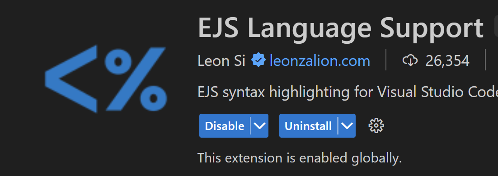

# 先安裝以下東西

- `Live server`

- `Prettier`自動排版 ( 設定成儲存的時候自動 )
  
  - setting > format > format on save 
  
  - setting > Default Formatter > prettier 
  
  - 如果格式錯誤或內容很離譜 (非DOM) 不會自動幫你格式 !

- `Material Theme` 可以下載讓主題跟作者一樣
  
  - setting > color theme 去選擇

- `Material Theme Icons` 讓你的資料夾folder中內容 有小圖案 !
  
  - 點選擴充包下面 uninstall 旁邊有的
  
  - Set File Icon Theme

- `Auto Rename Tag` 

- `EJS language support`
  
  

## 我自己之前安裝的有

- `Auto Close Tag`

- `Bracket Pair Colorization Toggler`

Here is the link to all resources in the course.

Unsplash: [https://unsplash.com/](https://unsplash.com/)

Icon8: https://icons8.com/icons/

Google Font: [https://fonts.google.com/](https://fonts.google.com/)

Font Awesome: [Get Started instantly With 1,000+ Free Icons | Font Awesome](https://fontawesome.com/start)

Animation: https://storyset.com

設計工具 :  

[Webflow 響應式網頁設定方式 (tenten.co)](https://tenten.co/learning/webflow-responsive-web/)  
