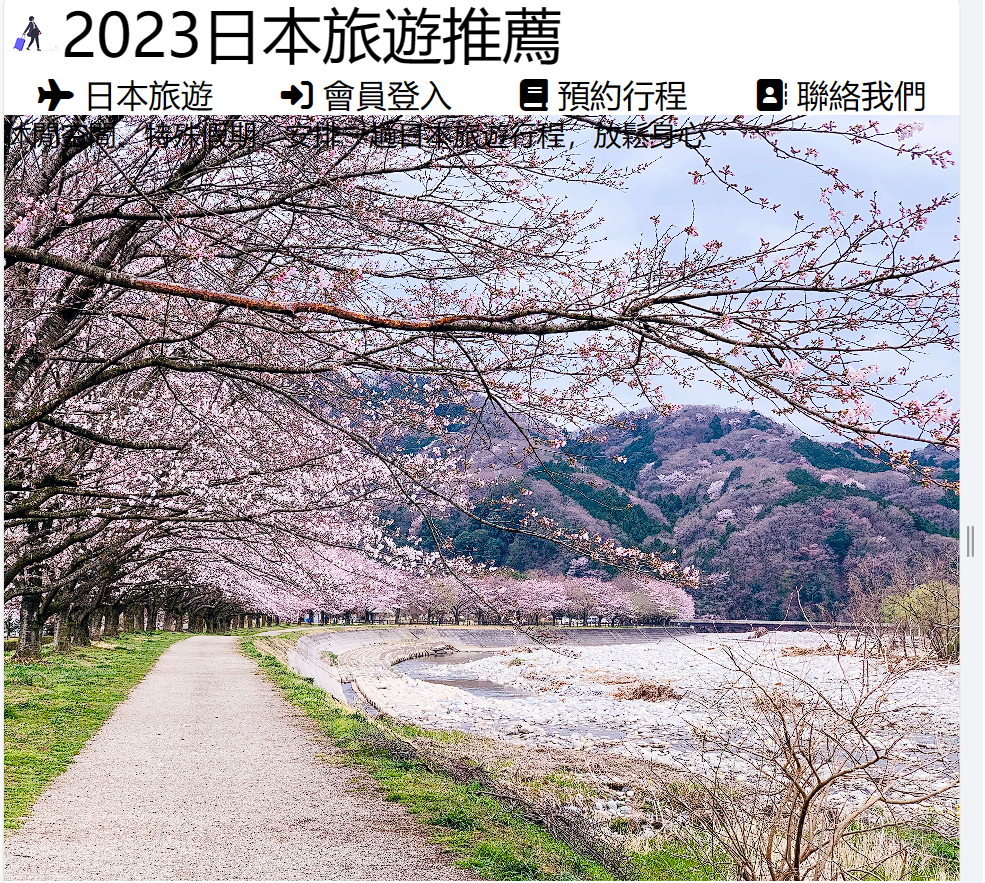
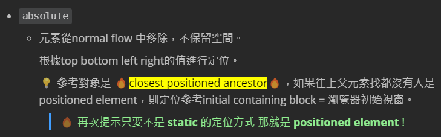
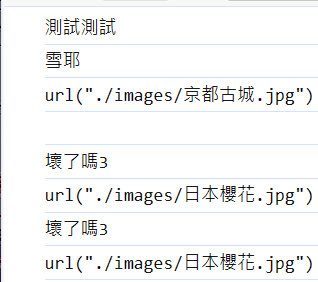
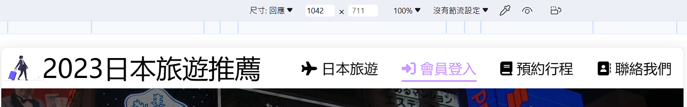
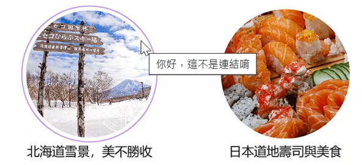
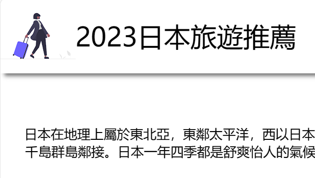
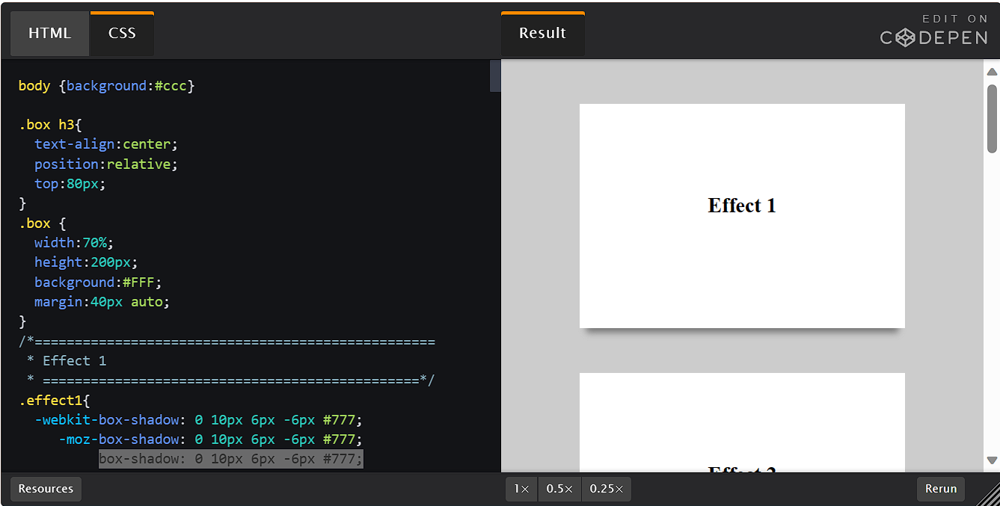

# (84-85) 跳過 簡介而已

# (86) 網站導覽列製作

製作的時候需要用到 nav 的 圖案 去 font awesome

> [font-awesome - Libraries - cdnjs - The #1 free and open source CDN built to make life easier for developers](https://cdnjs.com/libraries/font-awesome) 

💡 貼在自己的 stylesheet 上方 避免覆蓋我們寫的

```html
<link
    rel="stylesheet"
    href="https://cdnjs.cloudflare.com/ajax/libs/font-awesome/6.5.1/css/all.min.css"
    integrity="sha512-DTOQO9RWCH3ppGqcWaEA1BIZOC6xxalwEsw9c2QQeAIftl+Vegovlnee1c9QX4TctnWMn13TZye+giMm8e2LwA=="
    crossorigin="anonymous"
    referrerpolicy="no-referrer"
/>
<link rel="stylesheet" href="./styles/style.css" />
```

去網站找自己喜歡的小圖來用

> [Find Icons with the Perfect Look & Feel | Font Awesome](https://fontawesome.com/search?q=play&o=r) 

```html
<i class="fa-solid fa-plane"></i> 得到這個飛機圖
```

- book

- address book 之類?   自己找喜歡的就對了 

接下來只記錄有意思的地方。 基本上就是開始用運 sass 的方便性來寫code 

`align-items` : center  讓小圖跟文字在同一個水平線上


header 忘了使用 align item  所以右邊文字沒有對齊中間 也就是說

header  包起來的section logo 跟 nav 沒有在 container header 的中間 

左邊負責撐大 右邊如果沒對齊 自然會往上跑 就不好看了。 

# (87) 圖片轉換功能

- ```scss
  main {
    section.background-img {
      //設定背景圖片
      min-height: 70vh;
      background-image: url(../images/日本櫻花.jpg);
      background-size: cover;
      background-position: center;
      transition: all 0.75s ease;
    }
  }
  ```

- 💡 `center` 差異如下 也就是使用圖片正中間進行縮放而非等比例放大之類
  
  
  
  

- ```scss
  position: relative;
  z-index: 0; 🔥relative且 z-index 非auto🔥
               => 形成stacking context
  ```

- 請參考之前CH3 - CSS
  
  

- ⚠️重點在於 
  
  div.filter 使用 position: absolute ；
  
  section.backgorund-img 使用 relative。
  
  ```scss
  position: relative;
      z-index: 0; //relative+index非auto => 形成stacking context
      div.filter {
        background-color: rgba(0, 0, 0, 0.5);
        width: 100%;
        min-height: 70vh;
        position: absolute;
        top: 0;
        left: 0;
        z-index: -1;
      }
  ```
  
  所以寬高才能跟 外圍標籤 section 一樣。

- 接著是輪播圖  但是我一直失敗 🔥原因如下
  
  ```html
  <div id="myDiv" style="background-image: url(./images/北海道雪景.jpg)">
    aaaaaaa
  </div>
  <script>
    console.log("測試測試");
    let kaiddo = document.getElementById("myDiv");
    if (kaiddo.style.backgroundImage == `url("./images/北海道雪景.jpg")`) {
      console.log("雪耶");
      kaiddo.style.backgroundImage = "url(./images/京都古城.jpg)";
    }
    console.log(document.getElementById("myDiv").style.backgroundImage);
  ```
  
   
  
  發現 雖然我圖片是css設定的 路徑是 ../images/日本櫻花.jpg 
  
  💡這邊跟我說的卻是  ./  ，因此我可以直接比較文字 (src) ，不用考慮相對路徑問題!

- 不管使用的是 
  
  ```html
  ` 或者 '  都可以 但是 url ("   ") 一定要是 "" 
  ```
  
  ```html
  <script>
        setInterval(() => {
          let topBackgorund = document.querySelector("section.background-img");
  
          if (
            topBackgorund.style.backgroundImage == 'url("./images/日本櫻花.jpg")'
          ) {
            topBackgorund.style.backgroundImage = 'url("./images/京都古城.jpg")';
          } else if (
            topBackgorund.style.backgroundImage == 'url("./images/京都古城.jpg")'
          ) {
            topBackgorund.style.backgroundImage = 'url("./images/大阪街頭.jpg")';
          } else {
            topBackgorund.style.backgroundImage = 'url("./images/日本櫻花.jpg")';
          }
        }, 3000);
  </script>
  ```

# (88) 圓圈圖片 效果

- 只提幾個遇到個小bug 

```css
align-items: center;
justify-content: center;
img {
     width: 80%;
}
```

align-content 會無法垂直於main aixs 搞置中。

不要跟上面搞混囉。

# (89) 透明背景設定與Google地圖

- 放在 header 上面， \<body> 正下方 富士山2.jpg
  
  
  
  又是 specificity在搞我，因為
  
  ```scss
  @media screen and (max-width: 1024px) {
    body {
      header {
        flex-wrap: wrap;
        section.logo {
          flex: 2 1 600px;
        }
        nav {
          flex: 5 1 500px;
          ul {
            flex-direction: column;
  
            li {
            }
          }
        }
      }
    }
  }
  ```
  
  💡 原本寫的特異度不夠，上面寫的時候有body @media screen 沒寫到就無法覆蓋🙄

# (90) Footer設定

- 基本上沒使用到什麼特殊技巧，跟上面差不多吧。 分層手法會了就 o k。

# (91) 略 Final Code

# (92) Aceessibility

## 無障礙網頁設計

- 背景顏色跟字體不要相近

- 鍵盤能瀏覽

- alt 圖片 替代文字方便視障、 搜尋爬蟲效果更好、

## img 屬性 title

- title="你好，這不是連結唷"
  
  

# (93) Sticky header

## sticky header 怎麼做 ?

- ```scss
  header {
      background-color: white;
      display: flex;
      flex-wrap: wrap;
      align-items: center;
      position: sticky;
      top: 0;
      z-index: 5;
  ```

基本上要注意的就是 z-index跟 top 

> [box-shadow - CSS: Cascading Style Sheets | MDN (mozilla.org)](https://developer.mozilla.org/en-US/docs/Web/CSS/box-shadow) 

- **💡替 Nav Bar 增加陰影** !

> [CSS-Tricks - Tips, Tricks, and Techniques on using Cascading Style Sheets.](https://css-tricks.com/) 

- 之前講 flex box 他說有說過

- [box-shadow | CSS-Tricks - CSS-Tricks](https://css-tricks.com/almanac/properties/b/box-shadow/) 

陰影效果如下





- ```scss
  只需要
  header {
      background-color: white;
      display: flex;
      flex-wrap: wrap;
      align-items: center;
      position: sticky;
      top: 0;
      z-index: 5;
      box-shadow: 0 10px 6px -6px #777;  ---> 這行
  ```

# (94) Scrollbar 設定

> [W3Schools Tryit Editor](https://www.w3schools.com/howto/tryit.asp?filename=tryhow_css_custom_scrollbar) 

- ```html
  <style>
  /* width */
  ::-webkit-scrollbar {
    width: 10px;
  }
  
  /* Track */
  ::-webkit-scrollbar-track {
    background: #f1f1f1; 
  }
  
  /* Handle */
  ::-webkit-scrollbar-thumb {
    background: yellow; 
  }
  
  /* Handle on hover */
  ::-webkit-scrollbar-thumb:hover {
    background: #555; 
  }
  </style>
  ```

# (95) 部屬靜態網頁

## 壓縮圖片

### UTF-8 文字

首先得先提文字部分 UTF-8 佔據的資料量其實是變動的 1byte ~ 4byte都可能，能混搭。

1byte = 8bit

UTF-8 

- 對於UTF-8編碼中的任意位元組B，如果B的第一位為0，則B獨立的表示一個字元(ASCII碼)；
- 如果B的第一位為1，第二位為0，則B為一個多位元組字元中的一個位元組(非ASCII字元)；
- 如果B的前兩位為1，第三位為0，則B為兩個位元組表示的字元中的第一個位元組；
- 如果B的前三位為1，第四位為0，則B為三個位元組表示的字元中的第一個位元組；
- 如果B的前四位為1，第五位為0，則B為四個位元組表示的字元中的第一個位元組；

### 圖片

圖片佔據 RGB 每一個 channel (1bytes=255) \* 3 = 3byte展現一個pixel色彩。

1000萬pixel 直接抵大約 1千萬文字的小說 ( 因為中文通常3 bytes ) 。

所以建議 `壓縮` 再上傳。 

- 作者使用tinypng線上軟體壓縮

- 不過我不想，之後再自己用java code壓看看吧。

## 部屬靜態網頁

- 只能單方面呈現 。

- 介紹Netlify 雲端靜態網站。
