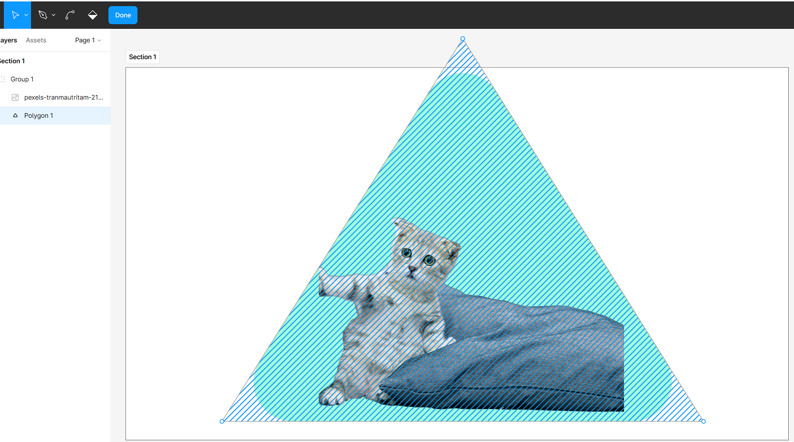
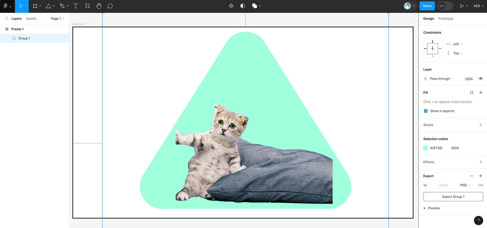
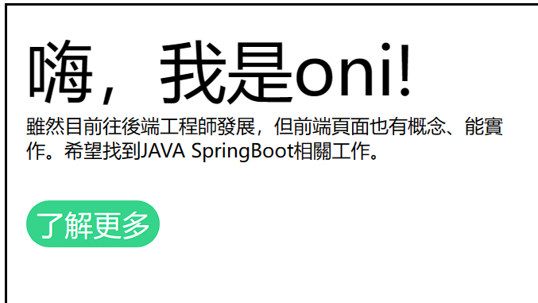
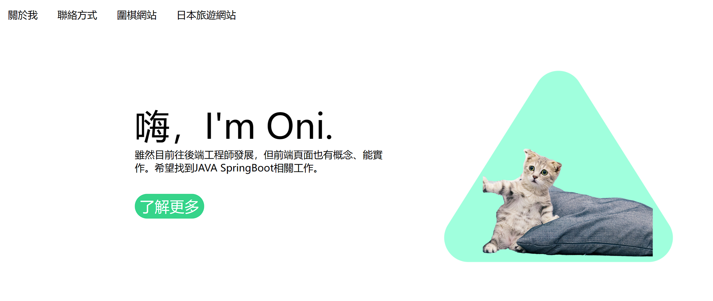
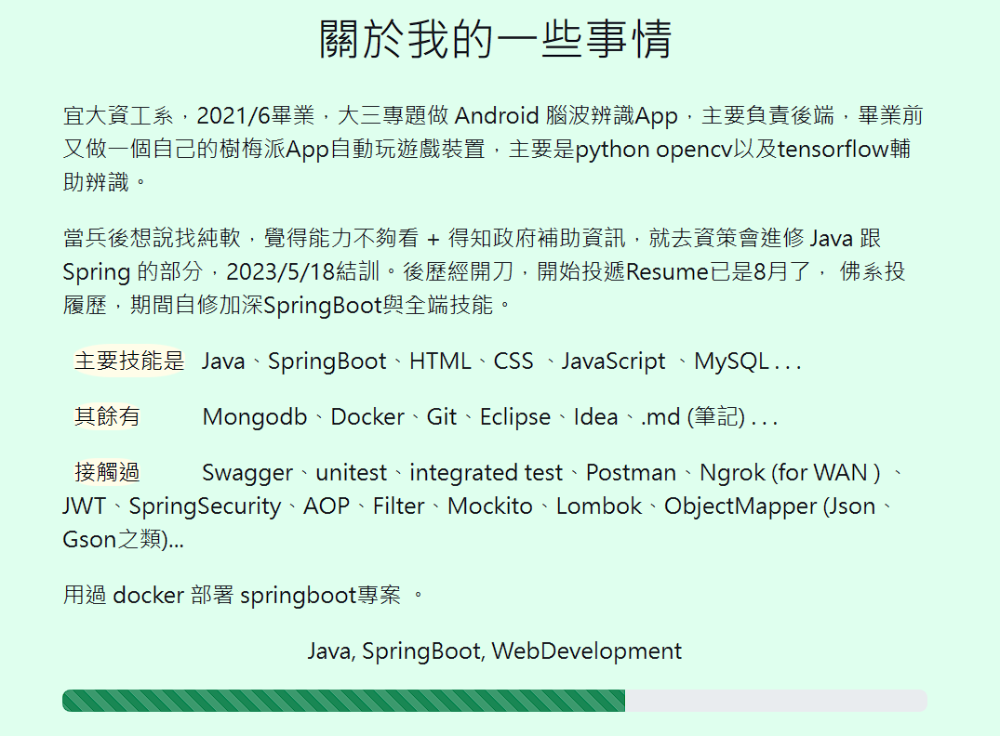
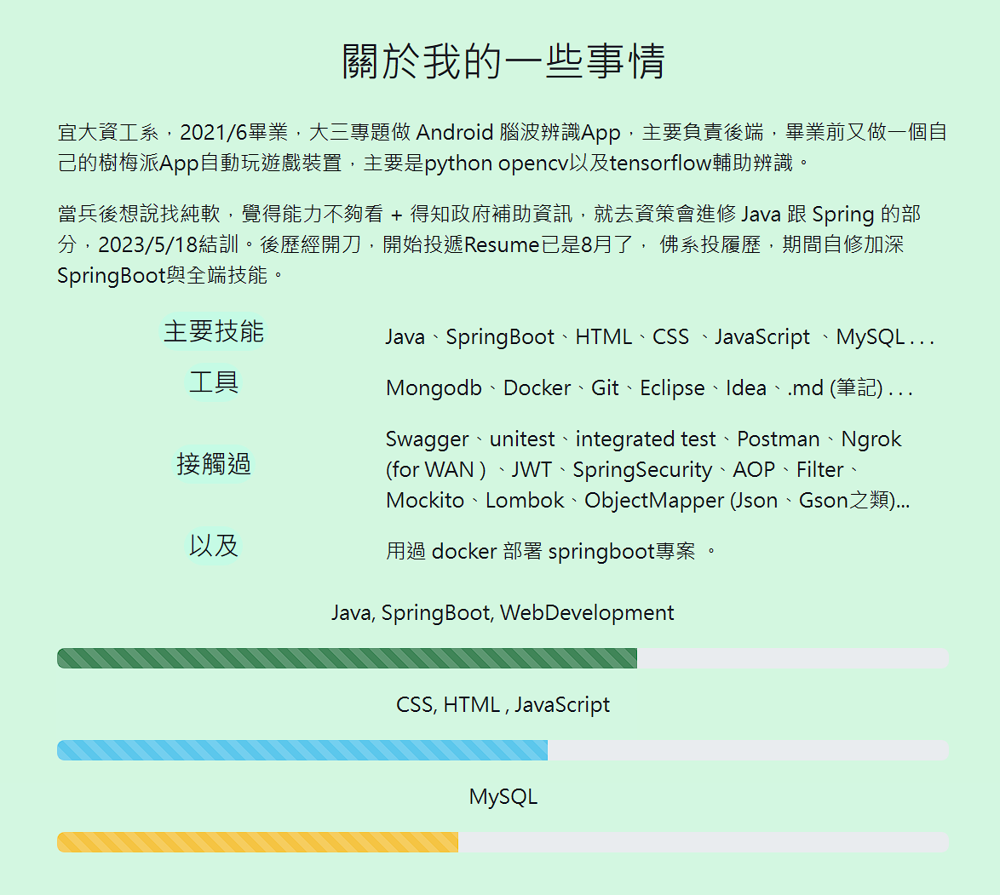

# (97~99) 下載、介紹、Figma照片製作

> [Untitled – Figma](https://www.figma.com/file/kAsIzbcykHU4KW9UIPq2yS/Untitled?type=design&node-id=1-2&mode=design&t=N9m5cjd0oy80XbBm-0) 還不錯用

- 搭配 pexels 免費圖片跟 tab s7+ 內建修圖，摳圖摳出.png之後就能丟進去網站。

- 要多點三角形幾下 才會可以彎曲
  
  

- 成果如下



# (100) 首頁製作

## 先做連結 使用 `target`  blank 分頁

```html
<nav>
     <ul>
        <li><a href="#">關於我</a></li>
        <li><a href="#">聯絡方式</a></li>
        <li><a href="../Project1_圍棋網站/index.html" target="_blank">圍棋</a></li>
        <li><a href="../Project2_日本旅遊網站/index.html">日本旅遊</a></li>
      </ul>
</nav>
```

## 製作 main-area

### info

- ### 文字部分應該按照 h1 h2去做 而非p ，因為這段文字重要性比較高 !
  
  ```html
  <main>
        <section class="main-area">
          <div class="info">
            <h1>嗨，我是oni!</h1>
            <h2></h2>
          </div>
        </section>
      </main>
  ```

- ### 🔥是a 所以要用inline-block 🔥
  
  
  
  ```scss
  h2 {
      font-size: 1rem;
  }
  a {
      color: white;
      background-color: rgb(54, 212, 138);
      padding: 0.25rem 0.5rem;
      font-size: 1.5rem;
      border-radius: 20px;
      display: inline-block;
      margin: 2rem 0;
  }
  ```

- ### 做一做大概長這樣
  
  

# (101) 個人能力值 條狀顯示

## bootstrap progress bar

> [Progress · Bootstrap (getbootstrap.com)](https://getbootstrap.com/docs/4.0/components/progress/) 

- ##### ⚠️依舊要注意的是，link 要在個人style.css之前 ，我們才能覆蓋它。

- ##### 做了 &::before增加文字但覺得排版不好看，拆掉。
  
  ```scss
  .skill-description-main {
            &::before {
              content: "主要技能是";
              display: inline-block;
              box-sizing: border-box;
              width: 5rem;
              margin-left: 0.5rem;
              margin-right: 0.5rem;
              background-color: rgb(255, 253, 233);
              border-radius: 35%;
            }
          }
          .skill-description-rest {
            &::before {
              content: "其餘有";
              box-sizing: border-box;
              width: 4rem;
              margin-left: 0.5rem;
              margin-right: 2.5rem;
              background-color: rgb(255, 253, 233);
              border-radius: 35%;
            }
          }
          .skill-description-contact {
            &::before {
              content: "接觸過";
              box-sizing: border-box;
              width: 4rem;
              margin-left: 0.5rem;
              margin-right: 2.5rem;
              background-color: rgb(255, 253, 233);
              border-radius: 35%;
            }
          }
  ```
  
  

- ##### 修改成下面
  
  

- #### 筆電上面顏色偏淡 所以進度條可能要強調外框
  
  
