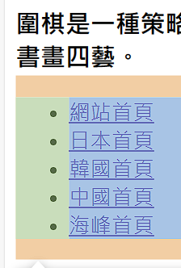
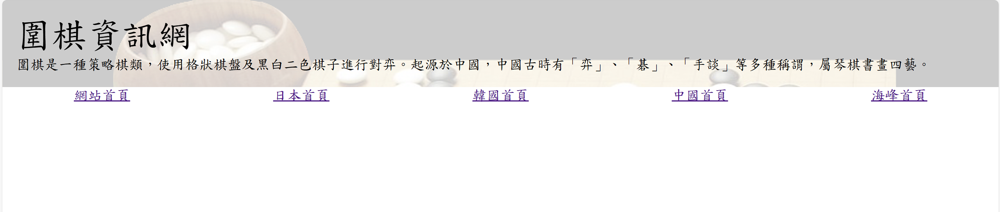
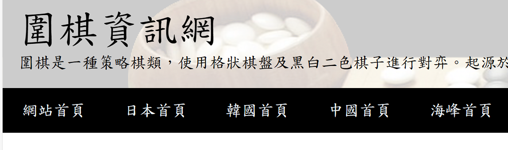
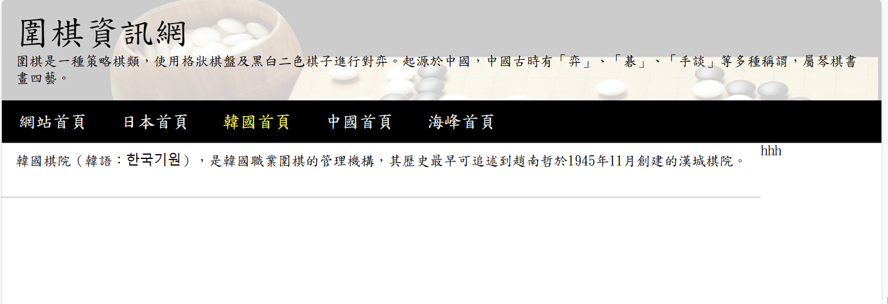
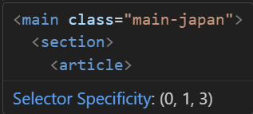
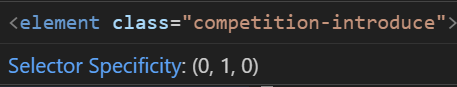

# 基本上下面的網站製作就是編參考提供的教材，邊魔改跟著做而已。

---

# (66) 圍棋網站簡介

- 下載三張圖片之後創建專案

- 把images放入並建立一個index.html

# (67) 導覽列製作

- 網站拆分成 (頭) 導覽列 跟 (身體) 內容 ，內部也可以拆分
  
  使用 `semantic tag` 去拆分 再開始用常接觸的 div h1 h2 做

- ```html
  <body>
      <header></header>
      <main></main>
  </body>
  ```

- 去 CSS Default Values 查找 Tag多少有預設。
  
  

- 我們不需要預設，通常就用 * 去清除預設的 padding margin之類
  
  ```css
  * {
    padding: 0;
    margin: 0;
    box-sizing: border-box;
  }
  ```
  
  `border-box` 就是w,h的設定為最外框，詳細去 `(48)` 找

- 取消 h1~ h6 的預設粗體行為
  
  ```css
  h1,h2,h3,h4,h5,h6 {
    font-weight: normal;
  }
  ```

- 設定 字體 好看一點 ，標楷體 DFkai-sb 如果不存在再用後面 sans-serif、標題字體大小
  
  ```css
  *{
    font-family: DFkai-sb, sans-serif;
  }
  header div.top h1 {
    font-size: 2.5rem;
  }
  header div.top h3 {
    font-size: 1rem;
  }
  ```

- 設定 header 背景圖片
  
  ```css
  header div.top {
    padding: 1rem;
    background-image: url(./images/background.png);
    /* background-position: bottom; */
    /* background-repeat: no-repeat; */
    /* background-size: contain; */
  }
  ```

- `預測他會做以下`，list-style 取消list 自帶的圓特效，如這行文字左邊出現的那個圓
  
  ```css
  header nav ul {
    display: flex;
    justify-content: space-between;
    align-items: start;
    list-style: none;
  }
  ```
  
  結果，不是做這樣。 QQ
  
  
  
  而是 `如下`
  
  ```css
  header nav ul {
    display: flex;
    /* justify-content: space-around; */
    /* align-items: start; */
    list-style: none;
  }
  header nav ul li {
    padding: 0.8rem 1.2rem;
  }
  
  nav ul li a {
    color: aliceblue;
    text-decoration: none;
    font-size: 1.25rem;
  }
  ```
  
  

- `不要讓網站網頁刷新`  靠 `#`
  
  ```html
  <li><a href="./#">網站首頁</a></li>
  ```

# (68) 首頁文字與圖片

- 頁面分成左跟右半 使用 `< section >` 去分
  
  `使用semantic tag`  讓網頁更明確知道 這個圖片跟下面的 文字是相關聯的
  
  ```html
  <main>
        <section class="left">
          <h3>圍棋性質</h3>
          <figure>
            
            <figcaption>進行中的圍棋</figcaption>
          </figure>
        </section>
        <section class="right"></section>
  </main>
  ```

- 關於圖片棋盤，使用以下無效 ，應該使用 background size
  
  ```css
  section > .left > figure {
    height: 250px;
    width: 250px;
  }
  ```

- 我的不能做到 section right 右邊p 能換行、flex item 左右因換行就垂直 而是因div容器也就是flex items 寬，小於basis， 才垂直網頁。
  
  經過我一番努力可以改 但是我的圖片 ， 布局變成垂直的時候不會放大@@
  
  ```css
  * {
    padding: 0;
    margin: 0;
    box-sizing: border-box;
    font-family: DFkai-sb, sans-serif;
  }
  
  h1,
  h2,
  h3,
  h4,
  h5,
  h6 {
    font-weight: normal;
  }
  
  header div.top {
    padding: 1rem;
    background-image: url(./images/background.png);
    /* background-position: bottom; */
    /* background-repeat: no-repeat; */
    /* background-size: contain; */
  }
  
  header div.top h1 {
    font-size: 2.5rem;
  }
  header div.top h3 {
    font-size: 1rem;
  }
  header nav {
    background-color: black;
  }
  header nav ul {
    display: flex;
    /* justify-content: space-around; */
    /* align-items: start; */
    list-style: none;
  }
  header nav ul li {
    padding: 0.8rem 1.2rem;
  }
  
  nav ul li a {
    color: aliceblue;
    text-decoration: none;
    font-size: 1.25rem;
  }
  nav ul li a:hover {
    color: yellow;
    transition: all 0.4s ease-in;
  }
  .active {
    color: yellow;
  }
  section.left {
    margin-right: 3rem;
  }
  section.left {
    margin-right: 3rem;
  }
  section.left table {
    margin-top: 1rem;
  }
  section.left > figure {
  }
  section.left > figure > img {
    max-width: 250px;
    height: auto;
  }
  section.left > figure > img.vertical-expand {
    max-width: none; /* 移除最大寬度限制 */
  }
  
  section.right {
    margin-top: 1rem;
  }
  hr {
    margin: 0.5rem 0rem;
  }
  section.right ul {
    margin-top: 1rem;
  }
  section.right li {
    margin-left: 2rem;
    /* overflow-wrap: break-word; */
  }
  
  main > section.right {
    flex-basis: 500px;
    flex-grow: 5;
  }
  
  main {
    display: flex;
    flex-wrap: wrap;
  }
  main h3 {
    margin: 1rem 0rem;
  }
  main section {
  }
  ```

- GPT說 CSS 無法根據 flex-direction 去改變img的模式，只能偵測 @Media 寬去改變布局，所以需要靠CSS。 

# (69) 首頁文字與圖片的CSS

- `結果是我沒設定左邊的 basis 所以` 
  
  ```css
  section.left {
    flex: 1 1 200px;
  }
  section.right {
    flex-basis: 500px;
    flex-grow: 5;
  }
  ```
  
  🔥左200 右500 圖片再繼承90或100% 那就沒問題🔥

- 💡切換模擬裝置就好，不用一直縮放 window。

- 基本上就不太改，又增加一個 p{ padding } 而已
  
  `去看git紀錄就有`

# (70) 韓國棋院

- 先自己試著做。
  
  💡`注意這邊` : 設計頁面上、korem不使用 flex，新增class for main來覆蓋display。 
  
  

- 自己做完了。

- 它的h234某些使用 inline style 我的使用 style.css 去specify 。

# (71) 日本棋院

- 自己做卡在 section 之間 放 hr沒東西，原因出在 main{ 裡面 是flex 所以要記得改 direction : column }
  
  ```css
  main.main-japan {
    display: flex;
    flex-wrap: wrap;
    flex-direction: column;
  }
  ```
  
  💡不要改 main 他是for index使用 

# (72) 日本棋院樣式設定

- 大致上都做出來了剩圖表 pie chart 

- 使用Google chart 

> [Charts  |  Google for Developers](https://developers.google.com/chart?hl=zh-tw) 直接點開始使用

- 關於我的 日本頭銜那邊 article一直弄不好的原因是 特異度不夠，被上面覆蓋
  
  ```css
  main.main-japan > section > article {
    flex: 1 1 600px;
    margin: 3rem;
  }
  .competition-introduce {
    flex: 1 1 300px;
    border: solid 1px red;
  }
  ```
  
  
  
  
  
  `如上圖所示，所以要改` ，差不多也就這樣。其他看git紀錄吧
  
  ```css
  使用 id 
  
  #competition-introduce {
    flex: 1 1 400px;
    /* border: solid 1px red; */
  }
  ```

# (73) Quick Fix

只有提到

- 在下支影片中的canvas nest的z-index設定，在<script>的屬性設定時，錄影時寫錯了，應該要改成zIndex而非影片中寫的z-index。大家實作的時候可以改一下。

# (74) canvas-nest 套用

真的就是這個名稱去搜尋的功能

> [hustcc/canvas-nest.js: :cancer: Interactive Particle / Nest System With JavaScript and Canvas, no jQuery. (github.com)](https://github.com/hustcc/canvas-nest.js) 

然後提到cdn ，他想直接使用別人提供的資源，而不是自己安裝後，自己再提供給user。

> [cdnjs - The #1 free and open source CDN built to make life easier for developers](https://cdnjs.com/) 跑這來使用

- 套用而已

- 然後我又小改index的畫面 ， 更乾淨利落，但code亂一咪咪ㄏㄏ。

# (75) 跳過，資源包而已

## 等著做中國跟台灣的頁面
