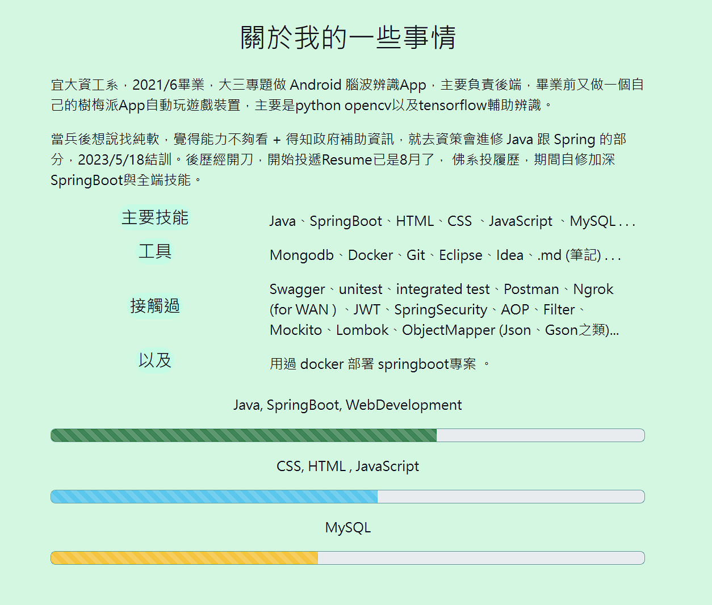
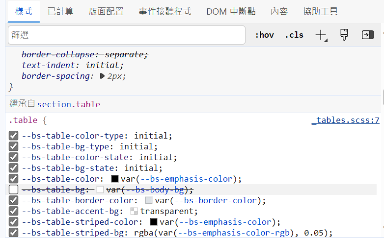
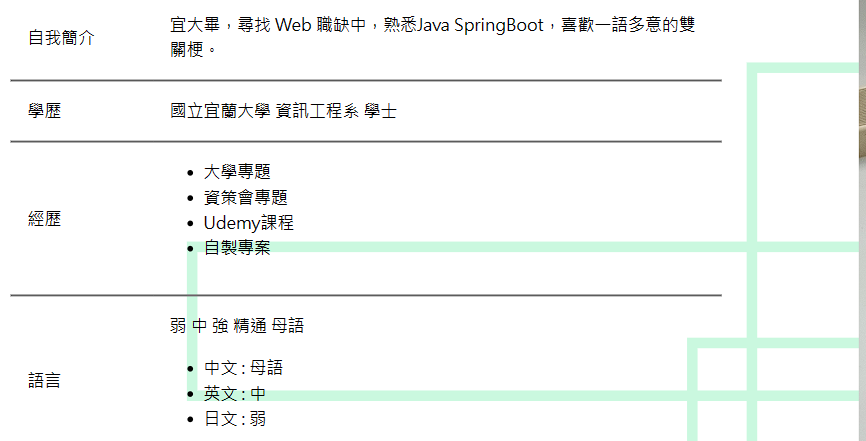
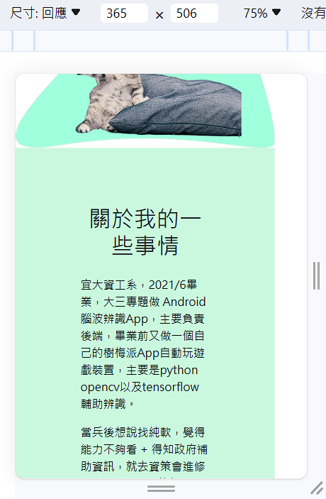
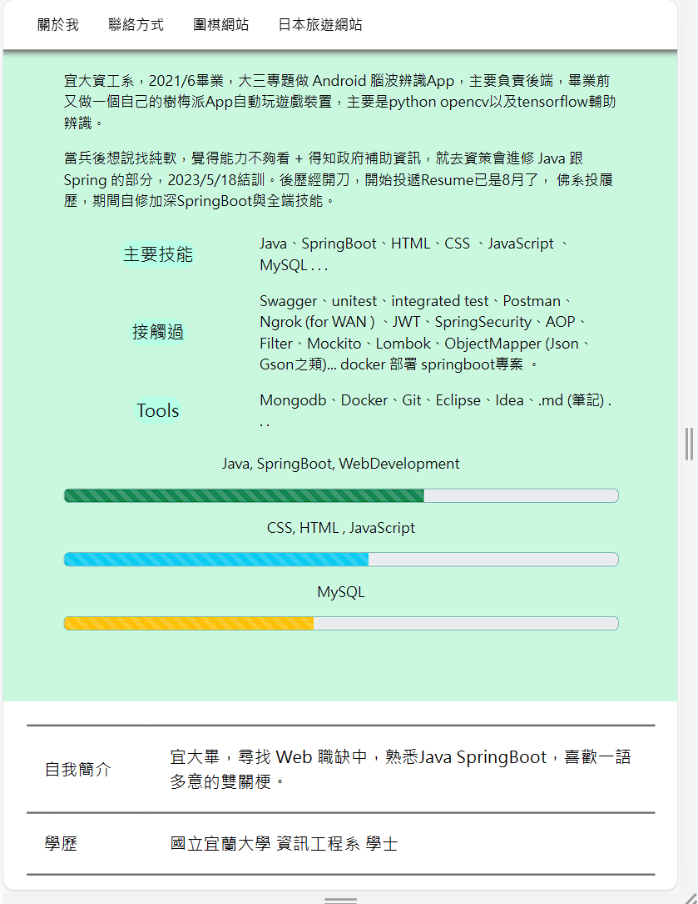
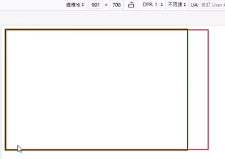
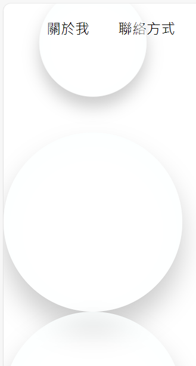

# (97~99) 下載、介紹、Figma照片製作

> [Untitled – Figma](https://www.figma.com/file/kAsIzbcykHU4KW9UIPq2yS/Untitled?type=design&node-id=1-2&mode=design&t=N9m5cjd0oy80XbBm-0) 還不錯用

- 搭配 pexels 免費圖片跟 tab s7+ 內建修圖，摳圖摳出.png之後就能丟進去網站。

- 要多點三角形幾下 才會可以彎曲
  
  

- 成果如下


# (100) 首頁製作

## 先做連結 使用 `target`  blank 分頁

```html
<nav>
     <ul>
        <li><a href="#">關於我</a></li>
        <li><a href="#">聯絡方式</a></li>
        <li><a href="../Project1_圍棋網站/index.html" target="_blank">圍棋</a></li>
        <li><a href="../Project2_日本旅遊網站/index.html">日本旅遊</a></li>
      </ul>
</nav>
```

## 製作 main-area

### info

- ### 文字部分應該按照 h1 h2去做 而非p ，因為這段文字重要性比較高 !
  
  ```html
  <main>
        <section class="main-area">
          <div class="info">
            <h1>嗨，我是oni!</h1>
            <h2></h2>
          </div>
        </section>
      </main>
  ```

- ### 🔥是a 所以要用inline-block 🔥
  
  
  
  ```scss
  h2 {
      font-size: 1rem;
  }
  a {
      color: white;
      background-color: rgb(54, 212, 138);
      padding: 0.25rem 0.5rem;
      font-size: 1.5rem;
      border-radius: 20px;
      display: inline-block;
      margin: 2rem 0;
  }
  ```

- ### 做一做大概長這樣
  
  

# (101) 個人能力值 條狀顯示

## bootstrap progress bar

> [Progress · Bootstrap (getbootstrap.com)](https://getbootstrap.com/docs/4.0/components/progress/) 

- ##### ⚠️依舊要注意的是，link 要在個人style.css之前 ，我們才能覆蓋它。

- ##### 做了 &::before增加文字但覺得排版不好看，拆掉。
  
  ```scss
  .skill-description-main {
            &::before {
              content: "主要技能是";
              display: inline-block;
              box-sizing: border-box;
              width: 5rem;
              margin-left: 0.5rem;
              margin-right: 0.5rem;
              background-color: rgb(255, 253, 233);
              border-radius: 35%;
            }
          }
          .skill-description-rest {
            &::before {
              content: "其餘有";
              box-sizing: border-box;
              width: 4rem;
              margin-left: 0.5rem;
              margin-right: 2.5rem;
              background-color: rgb(255, 253, 233);
              border-radius: 35%;
            }
          }
          .skill-description-contact {
            &::before {
              content: "接觸過";
              box-sizing: border-box;
              width: 4rem;
              margin-left: 0.5rem;
              margin-right: 2.5rem;
              background-color: rgb(255, 253, 233);
              border-radius: 35%;
            }
          }
  ```
  
  

- ##### 修改成下面
  
  

- #### 筆電上面顏色偏淡 所以進度條可能要強調外框
  
  
  
  #### ⭐更加明顯了⭐
  
  

# (102) 履歷製作

## Ctrl+K +0 快速縮vscode區塊

- 方便 ~

## 表格小技巧，快速設定比例🔥

- ##### 💡不需要用class然後分左右再去css 只要對第一列的td 分別設定就好
  
  ```html
  <tbody>
      <tr style="border-top: solid gray 2px">
           <td style="width: 20%">自我簡介</td>
           <td style="width: 80%">
            宜大畢，尋找 Web 職缺中，熟悉Java
            SpringBoot，喜歡一語多意的雙關梗。
           </td>
      </tr>
  ....
  ```

## 表格遮住 div 背景裝飾

- 我自己做
  
  ```scss
  table {
            border-collapse: collapse;
  
            tr {
              // background-color: rgba(255, 255, 255, 0.1);
              border-bottom: 2px solid gray;
              transition: all 0.2s ease-out;
              &:hover {
                background-color: rgb(202, 248, 223);
              }
            }
  ```

- 他做是去發現 bootstrap 特效修改 從而實現
  
  
  
  ```scss
  tr {
              // background-color: rgba(255, 255, 255, 0.1);
              --bs-table-bg: none;
              border-bottom: 2px solid gray;
              transition: all 0.2s ease-out;
              &:hover {
                background-color: rgb(202, 248, 223);
              }
            }
  ```
  
  

# (103) RWD 製作、nav修飾

## nav修飾 sticky

- ```js
  let nav = document.querySelector("nav");
  
  window.addEventListener("scroll", () => {
    if (window.screenY == 0) {
      nav.style.boxShadow = "";
    } else {
      nav.style.boxShadow = "0 10px 6px -6px #777";
    }
  });
  ```

## RWD

### sticky 寬度變小處理問題

- ```scss
  @media screen and (max-width: 500px) {
    body {
      nav {
        // 💡避免繼續占空間 黏住💡
        position: static;
        ul {
          flex-direction: column;
        }
      }
    }
  }
  ```
  
  
  
  

### 修改 about me description 50% 對手機而言太小

- ```scss
  @media screen and (max-width: 1161px) {
    body {
      main {
        section.about-me {
          section.description {
            width: 80%;
          }
        }
  ```

### 表格大小跟圖片也可以跟著改

- ```scss
  @media screen and (max-width: 1161px) {
    body {
      main {
        section.about-me {
          section.description {
            width: 80%;
          }
        }
        section.resume {
          section.picture {
            img {
              width: 70%;
            }
          }
          section.table {
            transform: scale(1.2);
            margin: 2rem;
          }
        }
      }
    }
  }
  ```
  
  

### 消失背景裝飾

- 我喜歡所以我沒讓她消失 但可以做
  
  ```scss
  section.resume {
          section.picture {
            img {
              width: 70%;
            }
            div.greenRect1,
            div.greenRect2,
            div.greenRect3 {
              display: none;
            }
  ```

### 背景裝飾因為超出body 所以造成水平移動 x scroll

- body overflow-x: hidden就好
  
  ```scss
  body {
   overflow-x: hidden;
  ```

## 臨時講一下Shrink

- ### 但是我早就知道了 給你看圖吧
  
  
  
  ##### 基本上就是shrink=0 讓 flex item不收縮，

### 又說明表格使用 overflow:x 搭配shrink

### 但我不需要

# (104) 泡泡製作

- 輸入 pure css bubble animation

> [Pure CSS Animated Bubbles (codepen.io)](https://codepen.io/Mark_Bowley/pen/PozwyP) 

- 新增 bubble.css  、html只有複製上面網址，css手動作

### 手動製作

- 跟著影片做
  
  ```scss
  #background-wrap {
    position: fixed;
    bottom: 0;
    top: 0;
    right: 0;
    left: 0;
    z-index: 10;
    pointer-events: none;
  }
  
  .bubble {
    width: 200px;
    height: 200px;
    border-radius: 50%;
    position: absolute;
    box-shadow: 0 20px 30px rgba(0, 0, 0, 0.2),
      inset 0px 10px 30px 5px rgba(252, 255, 255, 1);
  }
  
  @keyframes animateBubble {
    0% {
      margin-top: 1000px;
    }
    100% {
      margin-top: -100%;
    }
  }
  @keyframes sideWays {
    0% {
      margin-left: 0px;
    }
    100% {
      margin-left: 50px;
    }
  }
  .x1 {
    animation: animateBubble 25s linear infinite,
      sideWays 2s ease-in-out infinite alternate;
    left: 5%;
    top: 0;
    transform: scale(0.5);
  }
  .x2 {
    animation: animateBubble 15s linear infinite,
      sideWays 2s ease-in-out infinite alternate;
    left: 15%;
    top: 0;
    transform: scale(0.8);
  }
  .x3 {
    animation: animateBubble 19s linear infinite,
      sideWays 2s ease-in-out infinite alternate;
    left: 25%;
    top: 0;
    transform: scale(1.2);
  }
  .x4 {
    animation: animateBubble 23s linear infinite,
      sideWays 2s ease-in-out infinite alternate;
    left: 35%;
    top: 0;
    transform: scale(0.6);
  }
  .x5 {
    animation: animateBubble 16s linear infinite,
      sideWays 2s ease-in-out infinite alternate;
    left: 55%;
    top: 0;
    transform: scale(0.7);
  }
  .x6 {
    animation: animateBubble 15s linear infinite,
      sideWays 2s ease-in-out infinite alternate;
    left: 0%;
    top: 0;
    transform: scale(0.2);
  }
  .x7 {
    animation: animateBubble 22s linear infinite,
      sideWays 2s ease-in-out infinite alternate;
    left: 90%;
    top: 0;
    transform: scale(0.9);
  }
  .x8 {
    animation: animateBubble 19s linear infinite,
      sideWays 2s ease-in-out infinite alternate;
    left: 85%;
    top: 0;
    transform: scale(0.5);
  }
  .x9 {
    animation: animateBubble 17s linear infinite,
      sideWays 2s ease-in-out infinite alternate;
    left: 65%;
    top: 0;
    transform: scale(0.4);
  }
  .x10 {
    animation: animateBubble 15s linear infinite,
      sideWays 2s ease-in-out infinite alternate;
    left: 45%;
    top: 0;
    transform: scale(1.1);
  }
  ```

```
## 產個bug

- ##### 如下、忘了用absolute 。


```
