# (171) 資源包-圖片下載

# (172) Project介紹

## 需要添加兩個連結link

### font-awesome 圖片Icon

> font-awesome cdn 

- 選擇all
  
  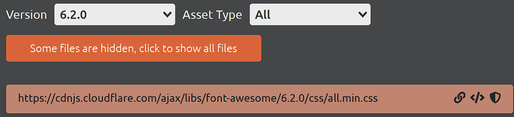

### google 字體

> [Baloo 2 - Google Fonts](https://fonts.google.com/specimen/Baloo+2?query=balo+2) 

- 改變區域 從大陸改為 美國
  
  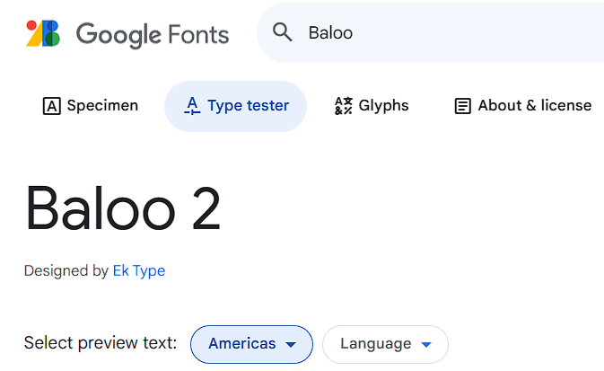

- 選擇400的那一個，然後selected family 這邊記得把之前的 ( 之前上課的瀏覽器自己默默記住)，刪除，用不到Noto Sans 。
  
  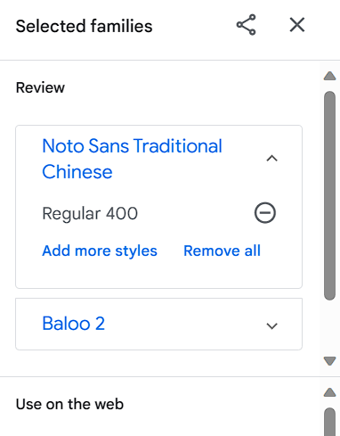

- 留下 Baloo2 就好
  
  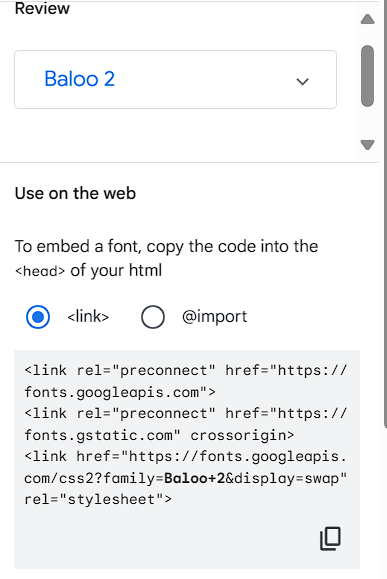

## 製作外觀

- `datalist`去已完成的檔案那邊複製就好。
  
  ```html
  ....
  </main>
      <datalist id="opt">
        <option value="ACCT">Accounting</option>
        <option value="ASL">American Sign Language</option>
        <option value="ANTH">Anthropology</option>
  ```
  
  然後再去把input 修改一下
  
  ```html
  <form>
       <div class="grader">
           <input
              type="text"
              class="class-type"
              placeholder="class category"
              list="opt"   ------------------> 修改這一個🔥
           />
  ```

- `credit` input 後面再加上`select` ，也可以複製 `選單`  【A 沒A+ 、F只有一個F】
  
  ```html
  <select name="select" class="select">
                  <option value=""></option>
                  <option value="A">A</option>
                  <option value="A-">A-</option>
                  <option value="B+">B+</option>
                  <option value="B">B</option>
                                  ...略
  
  </select>
  <button class="trash-btn">
                  <i class="fas fa-trash"></i>
  </button>
  ```

### 關於對齊他使用 text-align...?

```scss
main {
    section.main-part {
      padding: 1rem;
      display: flex;
      flex-direction: column;
      text-align: center;
    }
  }
```

- 比起 justify-content 和 align-items 他選擇 上面這樣 why?

### pointer-events:none💡

- 讓 滑鼠懸浮可以被得知 ( 雖然z-index 遮住了 但底層可以感知上面有滑鼠經過 )
  
     🔥如果上面有人遮擋住(透明 mask)、一樣可以點垃圾桶 🔥
  
  ```scss
  button {
      border: none;
      cursor: pointer;
      background-color: #272727;
      i {
      font-size: 1.25rem;
      pointer-events: none; //允許滑鼠穿透到下面元素
      // 如果上面有人遮擋住(透明 mask)、一樣可以點垃圾桶 !
      color: white;
      }
  }
  ```

### div.all-input下 input.class-credit 15%問題

- 如果使用edge 則會導致跑版
  
  明明有空間
  
  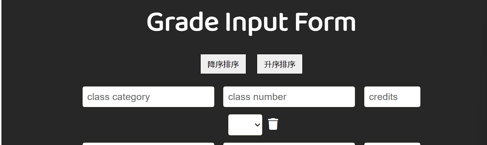

- code
  
  ```scss
  div.all-inputs {
   width: 100%;----------------->加上100%就可以
          input,
          select {
            font-size: 1.05rem;
            padding: 0.5rem;
            border: 0.25px solid rgb(39, 39, 21);
            margin: 0.35rem;
            border-radius: 0.25rem;
          }
          input.class-credit {
            width: 15%;
          }
  ```

- 有人發問，解答是 瀏覽器計算空間量不同 所導致
  
  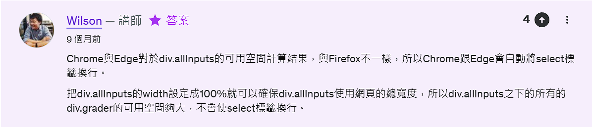
  
  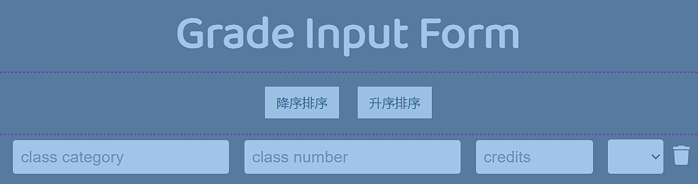
  
  #### 改好100%就沒事了@^@ 。😕

- 記得justify align text-align 都要弄一下各有優點
  
  ```scss
  main {
      section.main-part {
        padding: 1rem;
        display: flex;
        flex-direction: column;
        justify-content: center;   --------> 加入這個
        align-items: center;       --------> 這個
        text-align: center;        --------> 這個
  ```

### 回憶動畫製作

- animation
  
  ```scss
  div.result {
          width: 200px;
          height: 200px;
          border: 3px solid red;
          border-radius: 50%;
          text-align: center;
          animation-name: border_color;
          animation-duration: 8s;
          animation-iteration-count: infinite;
          }
  ..
  ...
  @keyframes border_color {
    0% {
      border-color: red;
    }
    33% {
      border-color: limegreen;
    }
    66% {
      border-color: yellow;
    }
  }
  ```

### 回憶selector同時兩個條件

- 選擇器滿足兩個條件的話

```scss
h2#result-gpa {
          font-size: 3.5rem;
          font-weight: bold;
}
```

  不需要空格，直接連著寫就行 !

## 不用太在意咖啡色點點

- 資料夾旁邊那個 git 說Contains Emphasized items 。
  
  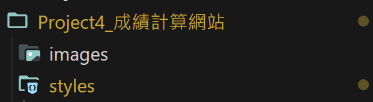

- 是因為我scss留白沒填東西 被警告而已
  
  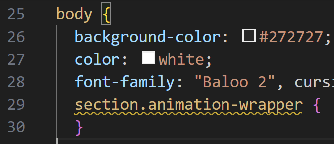

# (173) 開場動畫製作

## gsap介紹+cdnjs

> [gsap - Libraries - cdnjs - The #1 free and open source CDN built to make life easier for developers](https://cdnjs.com/libraries/gsap/2.1.3) 

- 選擇 TimelineMax跟TweenMax
  
  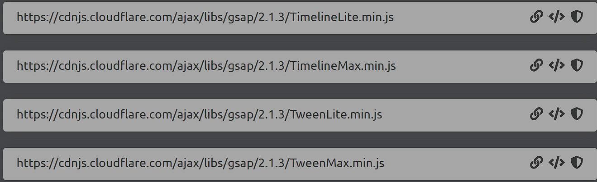

- 講解 HTML 設計理念，看影片7:00或者實操比較能了解。
  
  ```html
    <section class="animation-wrapper">
        <section class="animation">
          <div class="hero">
            
          </div>
        </section>
        <div class="slider"></div>
      </section>
  ```

## 💡小提醒，永遠記得Watch Sass 以及tag層級。

## 幹勒，一直忘記= =

## 關於圖片的部分

### object-Fit mdn

> [object-fit - CSS：层叠样式表 | MDN (mozilla.org)](https://developer.mozilla.org/zh-CN/docs/Web/CSS/object-fit) 

- 選cover
  
  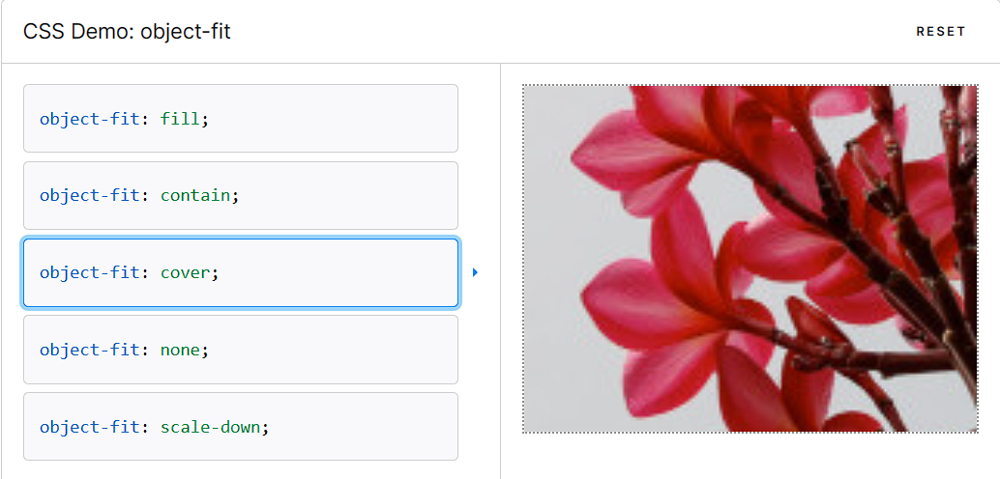
  
  ```scss
  .hero {
          // border: 5px solid blue;
          width: 100%;
          height: 0%;
          img {
            width: 100%;
            height: 100%;
            object-fit: cover;
          }
        }
  ```

## slider使用了linear-gradient()💡😕😕

- ```scss
  .slider {
        position: absolute;
        top: 0;
        left: 0;
        width: 100%;
        height: 100vh;
        background-color: linear-gradient(to right, rgb(144, 144, 144), black);
        z-index: -1;
      }
  ```

- #### 不是 bg color 是 background
  
  ```js
  background: linear-gradient(to right, rgb(144, 144, 144), black);
  ```

## JavaScript

### 1. 套件提供的功能

- 動畫套件
  
  ```js
  let hero = document.querySelector(".hero");
  let slider = document.querySelector(".slider");
  let animation = document.querySelector("section.animation-wrapper");
  const time_line = new TimelineMax();
  //param 1是要控制的對象
  //param 2是duration
  //param 3是控制對象的原始狀態
  //param 4是控制對象的動畫結束後狀態
  time_line.fromTo(
    hero,
    1,
    { height: "0%" },
    { height: "100%", ease: Power2.easeInOut } // 套件提供的功能
  );
  ```

### 2. 比較有意思的⭐⭐⭐

#### setTimeout

#### animation.style.pointerEvents="none" 點擊後面

#### 可以參考前面167💡

- 結束長這樣
  
  ```js
  let hero = document.querySelector(".hero");
  let slider = document.querySelector(".slider");
  let animation = document.querySelector("section.animation-wrapper");
  
  const time_line = new TimelineMax();
  
  //param 1是要控制的對象
  //param 2是duration
  //param 3是控制對象的原始狀態
  //param 4是控制對象的動畫結束後狀態
  //param 5提早進場
  time_line
    .fromTo(
      hero,
      1,
      { height: "0%" },
      { height: "100%", ease: Power2.easeInOut } // 套件提供的功能
    )
    .fromTo(hero, 0.8, { width: "80%" }, { width: "100%" })
    .fromTo(
      slider,
      1,
      { x: "-100%" },
      { x: "0%", ease: Power2.easeInOut },
      "-=0.8"
    )
    .fromTo(animation, 0.3, { opacity: 1 }, { opacity: 0 });//透明化
  
  window.setTimeout(() => {
    animation.style.pointerEvents = "none"; //點擊後面
  }, 2100);
  ```

# (174) 改變select 顏色

## 順序

### 垃圾桶preventDefault

- 改變form 按垃圾桶 自動送出問題。
  
  ```js
  // 如果是HTMLCollection則不能forEach 🔥
  // 除非透過Array.from(丟進來).forEach才能用🔥
  allbtns.forEach((btn) => {
    btn.addEventListener("click", (e) => {
      e.preventDefault();
    });
  });
  ```

### 表單preventDefault (enter送出問題)

- 避免form 填入後按enter直接送出表單
  
  ```js
  window.addEventListener("keypress", (e) => {
    if (e.key == "Enter") {
      e.preventDefault();
    }
  });
  ```

### JS 選取 select 標籤、印target、target.value

- 改變選取 option A~F 之後的背景顏色
  
  > html select choose option event 
  > 
  > 標籤上面叫做onchange
  
  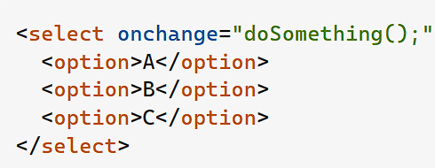
  
  ##### event 叫做 change 🙄...
  
  ```js
  let allSelects = document.querySelectorAll("select");
  allSelects.forEach((select) => {
    select.addEventListener("change", (e) => {
      console.log(e.target);
      console.log(e.target.value);
    });
  });
  ```
  
  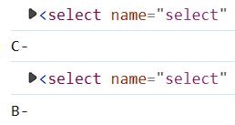

### 顏色改變 target.style.backgroundColor

- ```js
  function changeColor(target) {
    if (target.value == "A" || target.value == "A-") {
      target.style.backgroundColor = "lightgreen";
      target.style.color = "black";
    } else if (
  ```

## 最後留著一個setGPA等著做。

# (175) 計算成績 gpa

## 順序

### 製作setGPA()

### 關於數字跟空字串行為:⚠️

#### console.log(  填這 ) ....以下舉例

- `"3"` * `""`+ `"A"`  = `0` 然後字串相接 `"A"` =>>>> `"0A"` string

- `"2"` * `""`+   `5`    = `0` 然後 +`5` 等於 `0`+`5`   =>>>> `5` number

- `0` * `false` = `0`  可以預期、轉換就會去轉

- `0` * `""` = `0` 

- `0` * `null` = `0` 

- `0` * `NaN` = `NaN`  ( 屬於數字下的 無法辨認 例如infinte之類)
  
  - 特別注意下面⭐⭐⭐⭐⭐  
  
  - NaN 的資料型態是 number 🔥
    
    - `console.log("NaN資料型態是", typeof NaN);` 
  
  - isNaN(填這) 用來判斷 `obj.valueAsNumber` 或 `Number(obj)` 是否NaN
    
    - 因為兩者一定typeof number  但可能NaN 不是一個合法數字🔥
    - 如果物件A沒有輸入值， A.valueAsNumber 得到 NaN !🔥

- `0` * `undefined` = `undefined`  無定義 ( undefined )
  
  ```js
   console.log("-----", "" * 5 + "2", typeof ("" * 5 + "2")); //string
   console.log("-----", "" * 5 + 2, typeof ("" * 5 + 2)); //number
   console.log("-----", "" * 5, typeof ("" * 5)); //number  = 0
  ```
  
  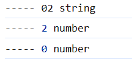

- 數字 小數第二位為止
  
  ```js
  if (creditSum != 0) {
      gpa.innerText = (sum / creditSum).toFixed(2);
  } else {
      gpa.innerText = "0.00";
  }
  ```

# (176) 新增form

## 其實有個問題就是input number credit可以>6

- 因為直接透過js ，但HTML表單那邊是默認送出才會阻止

- 我有稍微做修改~

## 製作表單新增的功能⚠️

### 關於成績select 用陣列做比起複製他的更好!🔥🔥

- 例如
  
  ```js
  function makeSelectTag() {
    var grades = [
      "",
      "A","A-",
      "B+","B","B-",
      "C+","C","C-",
      "D+","D","D-",
      "F",
    ];
    let newSelect;
    newSelect = document.createElement("select");
    newSelect.setAttribute("name", "select");
    newSelect.classList.add("select");
    grades.forEach((g) => {
      var opt = document.createElement("option");
      opt.setAttribute("value", g);
      let textNode = document.createTextNode(g);
      opt.appendChild(textNode);
      newSelect.appendChild(opt);
    });
    return newSelect;
  }
  ```

## datalist跟select 有點不同，一個輸入文字一個純提供選擇

- 一個文字，然後提供選擇，但未必要選

- 一個只能選擇或不選

## 16:00 input之間空格造成跟我們製作出來的版面不同

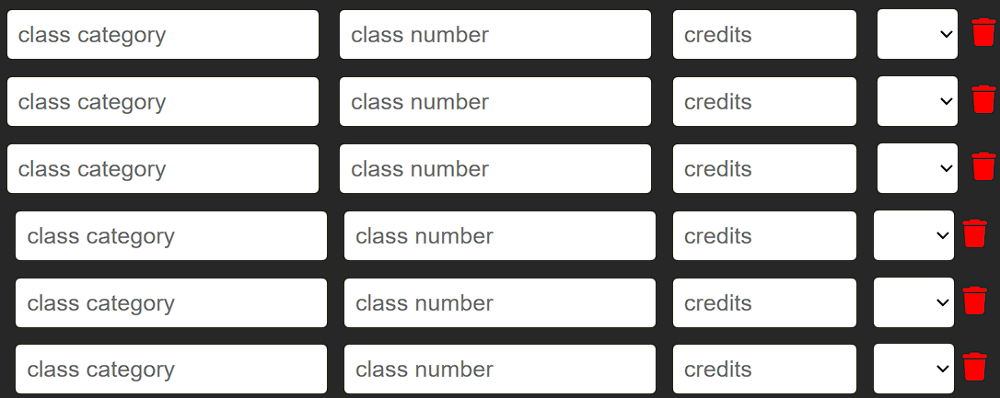

- 其實就是上面每個之間有空格 `<input/>   <input/>` 有空格

## 解決辦法 :

> newDiv.appendChild(document.createTextNode(" "));

```js
  newDiv.appendChild(newInput1);
  newDiv.appendChild(document.createTextNode(" "));
  newDiv.appendChild(newInput2);
  newDiv.appendChild(document.createTextNode(" "));
  newDiv.appendChild(newInput3);
  newDiv.appendChild(document.createTextNode(" "));
  newDiv.appendChild(newSelect);
  newDiv.appendChild(document.createTextNode(" "));
  newDiv.appendChild(newBtn);
  newDiv.appendChild(document.createTextNode(" "));
  newForm.appendChild(newDiv);
```

## 表單出現 由小變大 ⌛!

- js 要做 對新的標籤form 追加動畫style 
  
  ```js
    newForm.style.animation = "scaleUp 0.5s ease forwards";
  ```
  
  ```
  
  ```

- css要做 keyframes  💡記得按下watch sass💡
  
  ```scss
  @keyframes scaleUp {
    from {
      transform: scale(0);
    }
    to {
      transform: scale(1);
    }
  }
  ```

# (177) 垃圾桶製作

## 一開始的移除沒動畫效果

- 也只套用初期的三個
  
  ```js
  let allTrash = document.querySelectorAll(".trash-btn");
  allTrash.forEach((trash) => {
    trash.addEventListener("click", (e) => {
      console.log(e.target.parentElement.parentElement.remove());
    });
  });
  ```

## 中間的只套用前三個垃圾桶

- 其他新增依舊不套用
  
  ```js
  let allTrash = document.querySelectorAll(".trash-btn");
  allTrash.forEach((trash) => {
    trash.addEventListener("click", (e) => {
      console.log(e.target.parentElement.parentElement.classList.add("remove"));
    });
    let form = trash.parentElement.parentElement;
    form.addEventListener("transitionend", (e) => {
      e.target.remove();
      setGPA();
    });
  });
  ```

- 💡transistionend 是比較有意思的 然後除了移除也要記得重設定GPA💡

## 新增的垃圾桶動畫及移除效果

- 回去中間之前寫的部分，然後用稍微不同的做法 (動畫作法)
  
  ```js
    newInput3.addEventListener("change", () => {
      setGPA();
    });
    newSelect.addEventListener("change", (e) => {
      setGPA();
      changeColor(e.target);
    });
    newBtn.addEventListener("click", (e) => {
      e.preventDefault();
      >>>>>>  這 寫 東 西
    });
  ```

# (178) 排序演算法比較

- 一開始講之前的泡沫排序bigO = $n^2$
  
  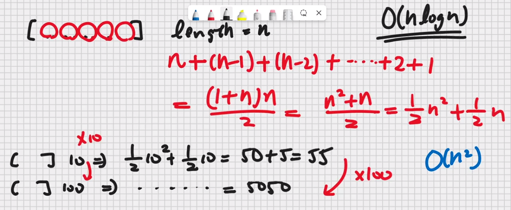

- from
  
  > [**Algorithm 演算法排序筆記** - HackMD](https://hackmd.io/@coherent17/Sy79MIyju) 
  
  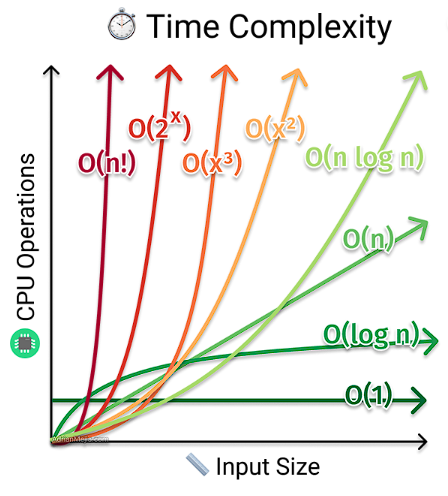
  
  ### GPT 說 n^2跟 nlogn交叉點大概n=10~20

## 使用merge排序

- 他選的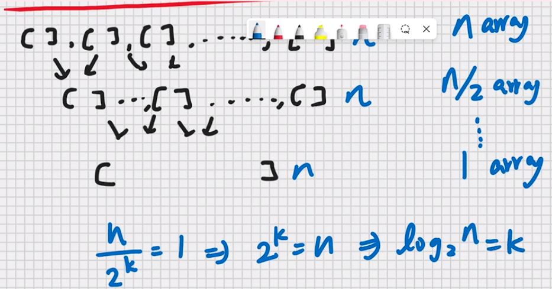

# (179) 排序程式碼

## 物件的另一種寫法

- 原本要 A:A  ,B:B,C:C   如下
  
  ```js
  for (let i = 0; i < graders.length; i++) {
      let class_name = graders[i].children[0].value; // class category
      let class_number = graders[i].children[1].value; // class number
      let class_credit = graders[i].children[2].value; // class credit
      let class_grade = graders[i].children[3].value;
      let object = {
        class_name: class_name,
        class_number: class_number,
        class_credit: class_credit,
        class_grade: class_grade,
      };
      objectArray;
    }
  ```

### 由於太常見所以可以省略🔥🔥

- 直接寫就好，名稱直接對應物件。
  
  ```js
  let object = {
        class_name,
        class_number,
        class_credit,
        class_grade,
      };
  ```

## Object屬性直接增加的方法如下

- 直接  .aaa 不存在的屬性 就會增加上去
  
  ```jsag-0-1hj6ubm0oag-1-1hj6ubm0o
  // 取得objectArray之後 要把成績換成數字才能排序。
    for (let i = 0; i < objectArray.length; i++) {
      objectArray[i].class_grade_number = convertor(objectArray[i].class_grade);
    }
  ```

- 例如 .class_grade_numbe 原本不存在 但我們需要數字

## 合併排序

### 需要稍微掌握遞迴概念

- merge(a1,a2)
  
  ```js
  function merge(a1, a2) {
    let result = [];
    let i = 0;
    let j = 0;
    while (i < a1.length && j < a2.length) {
      if (a1[i].class_grade_number > a2[j.class_grade_number]) {
        result.push(a2[j]);
        j++;
      } else {
        result.push(a1[i]);
        i++;
      }
    }
    while (i < a1.length) {
      result.push(a1[i]);
      i++;
    }
    while (j < a2.length) {
      result.push(a2[j]);
      j++;
    }
    return result;
  }
  ```

- mergeSort(arr)
  
  ```js
  function mergeSort(arr) {
    if (arr.length == 0) {
      return;
    }
    if (arr.length == 1) {
      return arr;
    } else {
      let middle = Math.floor(arr.length / 2);
      let left = arr.slice(0, middle);
      let right = arr.slice(middle, arr.length);
      return marge(mergeSort(left), mergeSort(right));
    }
  }
  ```

### 然後應用上去就可以完成囉~

- 搭配reverse就好
  
  ```js
  objectArray = mergeSort(objectArray);
    if (direction == "descending") {
      objectArray = objectArray.reverse();
    }
    console.log(objectArray);
  ```

## 最後砍forms、重新生成+監聽之。

- byTeacher_MakeFormByHTML

- ReAppendTrashListener

- ReAppendSelectionListener

- ReAppendCreditListener
  
  - credit監聽追加+數字上限追加+自動重算追加
    
    creditInputRestrictGPA()
