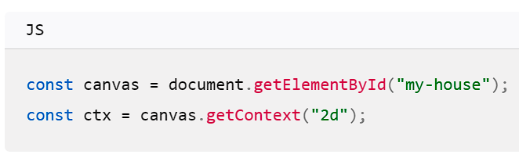
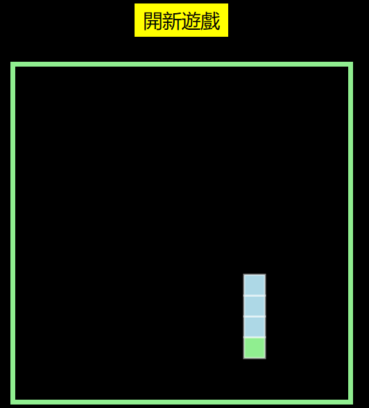
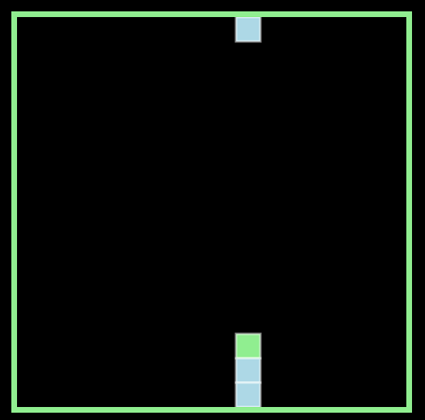
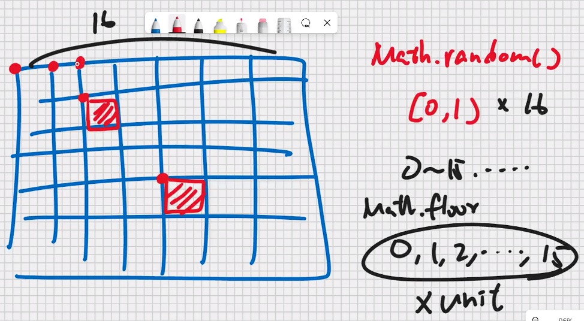
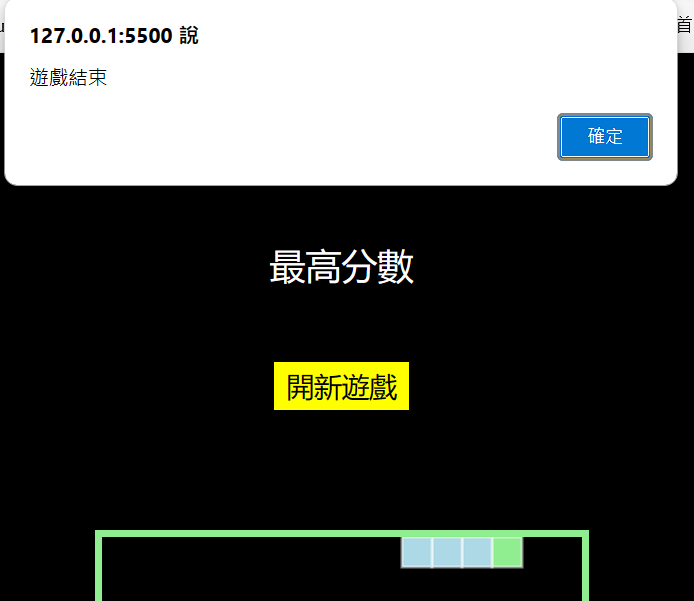

# (201) 遊戲介紹

## HTML canvas

- 介紹cavas這個東西，方便製圖、和初始HTML

> [javascript - Button that refreshes the page on click - Stack Overflow](https://stackoverflow.com/questions/29884654/button-that-refreshes-the-page-on-click)  

```html
<canvas
    id="myCanvas"
    width="320"
    height="320"
    style="background-color: black"
>
</canvas>
<p id="myScore"></p>
<p id="myBestScore"></p>
<button type="button" id="Start" onclick="location.reload()">
    開新遊戲
</button>
<script src="./app.js
"></script>
```

# (202) CSS設定

基本工作

## 設定*行為

他每次都先

```scss
* {
  padding: 0;
  border: 0;
  box-sizing: border-box;0%, -50%);
  }
```

感覺故意html寫前面，然後練習transform absolute?

```scss
body {
  background-color: black;
  display: flex;
  flex-direction: column;
  align-items: center;
  #myCanvas {
    border: 5px solid lightgreen;
    position: absolute;
    top: 60%;
    left: 50%;
    transform: translate(-50%,-50%);
    }
}
```

# (203) 蛇製作

## JS 開寫

> [CanvasRenderingContext2D - Web APIs | MDN (mozilla.org)](https://developer.mozilla.org/en-US/docs/Web/API/CanvasRenderingContext2D)   



```js
const unit = 20;
const row = canvas.height / unit; //320/20=16
const column = canvas.width / unit; //320/20=16
```

```js
// 最右邊是0
snake[0] = {
  x: 80,
  y: 0,
};
for (let i = 0; i < snake.length; i++) {
  if (i) {
    ctx.fillStyle = "lightblue";
  } else {
    ctx.fillStyle = "lightgreen";
  }
  ctx.strokeStyle = "white";
  ctx.fillRect(snake[i].x, snake[i].y, unit, unit);
  ctx.strokeRect(snake[i].x, snake[i].y, unit, unit);
}
```

# (204) 蛇移動

## 要考量

1. 方向

2. snake pop 、unshift 

3. 畫布要讓之前   畫的身體不會殘留
   
   ```js
   function draw() {
     console.log("drawing");
     ctx.fillStyle = "black";
     ctx.fillRect(0, 0, canvas.width, canvas.height);
   ```

# (205) 控制方向

## 需要偵測按鈕

```js
window.addEventListener("keydown", changeDirection);
然後修改d就好

function changeDirection(e) {
  if (e.key == "ArrowLeft" && d != "Right") {
    console.log("已按左鍵");
    d = "Left";
  } ...
...
```



# (206) 穿牆

## 設定在for內，畫蛇的之前

因為穿牆之後，畫頭在超出顯示範圍的格子沒用。

穿牆之後畫到畫布 沒感覺，所以在畫之前 先重新調整位置。

當然其他部位還是畫到外面去，但無所謂 頭有效果就好

- 自己要設定好x y條件
  
  ```js
  if (snake[i].x >= canvas.width) {
      // exceed right boundary
      snake[i].x = 0;
  }
  if (snake[i].x < 0) {
      // exceed left boundary
      snake[i].x = canvas.width - unit;
  }
  if (snake[i].y < 0) {
      // exceed top boundary
      snake[i].y = canvas.height - unit;
  }
  if (snake[i].y >= canvas.height) {
      // exceed bottom boundary
      snake[i].y = 0;
  }
  ```



# (207) 果實功能



想好格子、果實隨機怎做

```js
 function checkOverlap(new_x, new_y) {
      for (let i = 0; i < snake.length; i++) {
        if (new_x == snake[i].x && new_y == snake[i].y) {
          overlapping = true;
          return;
        } else {
          overlapping = false;
          // 如果沒設定 會導致重疊後被設定為true，
          // 之後即使真的沒有重疊
          // 也沒人幫你設定false;
          // 他之前以為預設false就能免去後面設定false
        }
      }
    }
    do {
      new_x = Math.floor(Math.random() * column) * unit;
      new_y = Math.floor(Math.random() * row) * unit;
      checkOverlap(new_x, new_y);
      console.log("印數字");
    } while (overlapping);
```

比較關鍵 要手動設定false不然會無窮迴圈

# (208) 遊戲結束設定

## 蛇的0確認有沒有跟1~n-1重疊

## changeDirectionBug

- 只要改變draw的速度1秒1格 很容易測出來
  
  遊戲開始後，狂按下或上 然後跟移動方向相反
  
   

- 如果手速夠快，是有可能導致頭逆向往身體衝過去
  
  ```js
  function changeDirection(e) {
    if (e.key == "ArrowLeft" && d != "Right") {
      console.log("已按左鍵");
      d = "Left";
    } else if (e.key == "ArrowRight" && d != "Left") {
      console.log("已按右鍵");
      d = "Right";
    } else if (e.key == "ArrowUp" && d != "Down") {
      console.log("已按上鍵");
      d = "Up";
    } else if (e.key == "ArrowDown" && d != "Up") {
      console.log("已按下鍵");
      d = "Down";
   // draw 1 d=left    d=up   d=right
    // frame 之間差...0.1秒，但是window.addEvent很快，所以出錯!
    // draw 2 d=right
    // 因此要避免 Next frame 出現之前能夠連續按
    // draw 執行完， d 才能再度改變。
    window.removeEventListener("keydown", changeDirection);
  
  
    }
  }
  
  
  
  ```

## 解決

- 上面那邊的 偵測到按鈕後 ，改完d，移除偵測功能
  
  ```js
  window.removeEventListener("keydown", changeDirection);
  ```
  
  
  

- 頭做好了才讓他可以重新控制方向
  
  ```js
    snake.unshift(newHead);
    // 頭做好了
    // 可以開始控制了
    window.addEventListener("keydown", changeDirection);
  ```
