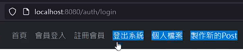

# (335) OAuth 流程

OAuth 2.0 安全協議

## OAuth常見名詞

### Resource Owner

資源擁有者 網頁的使用者

### Client

客戶端 第三方應用程式網站本身

### Authorization Server

授權伺服器，google、facebook等大系統，給予授權的server

### Resource Server

資源伺服器，GOOGLE FB 存放 Resource Owner 的被保護資訊的位置。


## 比較詳細的流程:

1. `AppServer` 去 `GOOGLE` 登記自己，並且從`GOOGLE`  得到 `AppServer` 的 `secret` 和`id` 。

2. `Umi` 告訴 `AppServer` 去存取 `Umi` 在`GOOGLE` 的資料 ，`Umi`會被轉送，持著 `AppServer` 的 `id` 送到 `GOOGLE` 授權網頁，並且 `Umi` 要同意讓 `AppServer` 取得其個資。 

3. `GOOGLE` 接下來把 `Umi` 導回 `AppServer` 並且附上 `Authorization Code` 。

4. `AppServer` 接著把 `Authorization Code`  以及 AppServer 本身的`secret`和`id` 送到 `GOOGLE` 。

5. `GOOGLE` 確認了 `AppServer` 給的`secret`，確認不是其他`server` 冒充，並且也從`Authorization Code`確認  `Umi` 真的有授權存取，接著就會將 `security token` 寄給 `AppServer`。

6. `AppServer` 接下來就拿著 `security token` 到 `GOOGLE` 取資料。

## Client叫做 Spencer Cool Website


# (336) OAuth 流程2

又提跟剛剛差不多的事情

光於第二個Spencer Cool Website 

我決定後續用到再來自己描述


# (337) Google client id與secret

## 去google建立專案id

### 先選擇create credential OAuth client ID


### 被要求先設定consent screen


#### 選擇外部，建立


#### 接著編輯授權時候顯示的畫面跟一些申請資料


#### 使用者回傳redirect的網址

##### 之後可以試圖轉掛Ngrok


#### 最後再填一下信箱就好


#### Scopes沒什麼特別想限制


#### 基本上Test users也不需要


### 設定完同意畫面後，繼續憑證設定


#### 下面繼續填寫，redirect要導回我們需要的位置


### 完成後記得保存json金鑰


# (339) Google登入頁面

## Passport套件

適用node.js 用來做身分驗證的middleware，可以輕鬆集成OAuth身分驗證功能到任何基於Node、Express的APP中

提供了500多種身分驗證機制、包含本地身分驗證、Google、FaceBook、Twitter、GitHub、LinkedIn、IG。


複雜步驟都會被藏起來，只要關注 `client_id`,`secret`,`redirect uri`給 `passport`，它就會提供`token`以及`protected resource`給`client`。

## 安裝以下全部

npm i express ejs cors method-override cookie-parser express-session dotenv connect-flash bcrypt

npm i mongoose@6.6.5 另外裝上去

npm i passport-google-oauth20  

npm i passport

## 忽視以下

package-lock.json

package.json

node_modules

.env

## 記得去拿免費的views

- 其中nav.ejs的 <%>都先拿掉 後面手動作一個出來

- 基本上造成阻礙的就先拿掉，反正跟著做而已。

- 看得懂最重要

## 使用那些檔案

auth-routes.js

login.ejs

app.js

## 依舊只解釋重要的

### passport.authenticate

```js
router.get("/google", (req, res) => {
  passport.authenticate("google", {
    scope: ["profile", "email"],
    prompt: "select_account",
  });
});
```

- 第一個參數是`google`，因此passport會使用內部策略去處理

- 也有說明需要安裝npm passport-google-Oauth20

- `scope` 內是我們想拿到的資料

- `prompt` 讓使用者能選擇帳戶


### passport.js

```js
const passport = require("passport");
const GoogleStrategy = require("passport-google-oauth20");

passport.use(
  new GoogleStrategy({
    clientID: process.env.GOOGLE_CLIENT_ID,
    clientSecret: process.env.GOOGLE_CLIENT_SECRET,
    callbackURL: "/auth/google/redirect",
  })
);
```

### .env 放入密碼了

不過這邊額外開passport.js是為了分割使用嗎? 

總之影片太長，下次再說!

# (340) Quick Fix

下支影片中的18:55秒處有出現小錯誤，email屬性的設定中，profile的emails array少打了s，應該要是 `profile.emails[0].value` 。另外，profile 的 photos array 也少了一個 s，請要改成 `profile.photos[0].value`。

# (341) 儲存使用者資訊

## 繼續記錄

### auth-routes.js

#### 上次寫錯了

```js
router.get("/google", (req, res) => {
  passport.authenticate("google", {
    scope: ["profile", "email"],
    prompt: "select_account",
  });
});
```

#### 下面才對💡

```js
router.get(
  "/google",
  passport.authenticate("google", {
    scope: ["profile", "email"],
    prompt: "select_account",
  })
);
});
```

- 因為authenticate屬於middleware 所以這樣寫就行 !

### passport.js

```js
const passport = require("passport");
const GoogleStrategy = require("passport-google-oauth20");

passport.use(
  new GoogleStrategy(
    {
      clientID: process.env.GOOGLE_CLIENT_ID,
      clientSecret: process.env.GOOGLE_CLIENT_SECRET,
      callbackURL: "/auth/google/redirect",
    },
    (accessToken, refreshToken, profile, done) => {
      console.log(profile);
    }
  )
);
```

```js
server run on port 8080
Connecting to mongodb..
{
  id: '111147244433538782003',
  displayName: '林chen',
  name: { familyName: '林', givenName: 'chen' },
  emails: [ { value: 'linc4003931@gmail.com', verified: true } ],     
  photos: [
    {
      value: 'https://lh3.googleusercontent.com/a/ACg8ocIQdfEh7THZFyNkkMkNlIxVTyztwwTmUVMgHfM63lRrmA=s96-c'
    }
  ],
  provider: 'google',
  _raw: '{\n' +
    '  "sub": "111147244433538782003",\n' +
    '  "name": "林chen",\n' +
    '  "given_name": "chen",\n' +
    '  "family_name": "林",\n' +
    '  "picture": "https://lh3.googleusercontent.com/a/ACg8ocIQdfEh7THZFyNkkMkNlIxVTyztwwTmUVMgHfM63lRrmA\\u003ds96-c",\n' +
    '  "email": "linc4003931@gmail.com",\n' +
    '  "email_verified": true,\n' +
    '  "locale": "zh-TW"\n' +
    '}',
  _json: {
    sub: '111147244433538782003',
    name: '林chen',
    given_name: 'chen',
    family_name: '林',
    picture: 'https://lh3.googleusercontent.com/a/ACg8ocIQdfEh7THZFyNkkMkNlIxVTyztwwTmUVMgHfM63lRrmA=s96-c',
    email: 'linc4003931@gmail.com',
    email_verified: true,
    locale: 'zh-TW'
  }
}
```

- 上面是profile

#### done()

執行的時候 會去執行passport的serializeUser

```js
const passport = require("passport");
const GoogleStrategy = require("passport-google-oauth20");
const User = require("../models/user-model");

passport.serializeUser((user, done) => {
  console.log("serialize user");
  console.log(user);
  done(null,user._id) //mongodb的id存在session內部，
  //並且id簽名後 以cookie交給user
});

passport.use(
  new GoogleStrategy(
    {
      clientID: process.env.GOOGLE_CLIENT_ID,
      clientSecret: process.env.GOOGLE_CLIENT_SECRET,
      callbackURL: "/auth/google/redirect",
    },
    async (accessToken, refreshToken, profile, done) => {
      // console.log(profile);
      // 第一次登入則幫她註冊
      console.log("進入Google Strategy區域");
      console.log("==================");
      let foundUser = await User.findOne({ googleID: profile.id }).exec();
      if (foundUser) {
        console.log("已經註冊過，無須存入");
        done(null, foundUser);
      } else {
        console.log("偵測到新用戶，需儲存");
        let newUser = new User({
          name: profile.displayName,
          googleID: profile.id,
          thumbnail: profile.photos[0].value,
          email: profile.emails[0].value,
        });
        let savedUser = await newUser.save();
        console.log("成功創建新用戶");
        done(null, savedUser);
      }
    }
  )
);
```

- google Strategy的 async function 中，done如果執行，則會被passport的serializeUser 匿名函數去做事，這個匿名函數中也有done(null,user._id)，他會把參數放入session內部，並且在user那邊設定，這邊的user._id是透過上一個 done傳入的使用者。

## 太複雜之後再看怎麼整理

git commit -m "Project7 section 341，儲存使用者資訊，成功得到我另一個Gmail資料。做了user-model.js、使用use (session({}))之後要 use passport.initialize() 跟 passport.session()，另外passport.js中，使用GoogleStrategy，內部的四個參數，箭頭函數中，one(null,savedUser或foundUser)會把 passport.serializeUser給執行，參數也會轉交給其((user,done)=>{}) user的部分，然後在此內部done(null,user.id)也要再度執行，他會把剛剛傳過來的資料自動設定到session內部，簽名後傳給user"

# (342) 顯示使用者資訊

## 該做的事

反序列化，取得user資料，透過done傳達下去，最後passport會幫我們把req.user屬性設定為找到的user。

關於登入畫面nav.ejs 也要調整，登入前後要有所改變 

登入前 : 登出系統 個人檔案 製作新的Post         要不存在

登入後 : 會員登入 註冊會員        要拿掉



因此各個route要傳達 類似下方

 `return res.render("index", { user: req.user });`

把使用到render ejs的地方 加一加就對了。

## passport.js

上次做到序列化，這次做反序列化

### deserializeUser

反序列化沒錯，應該說是一個抽象的行為，具體實現則是透過我們決定使用什麼方式，這邊使用mongoose 所以套上User.findOne去反序列化出來，得到資料。

```js
passport.deserializeUser(async (_id, done) => {
  console.log("反序列化使用者(回歸物件)，透過之前序列化的資料，得到_id");
  let foundUser = await User.findOne({ _id });
  done(null, foundUser);
  // passport 將 req.user的這個屬性設定為 foundUser 方便存取。
});
```

### profile-routes.js

這邊新增route，分流渲染頁面而已。

```js
const router = require("express").Router();
const authCheck = (req, res, next) => {
  if (req.isAuthenticated()) {
    next();
  } else {
    return res.redirect("/auth/login");
  }
};
router.get("/", authCheck, (req, res) => {
  console.log("已進入 >> /profile");
  return res.render("profile", { user: req.user });
  // deSerial那邊有解釋req.user
});
module.exports = router;
```

- 把user丟過去ejs

- 也要保護profile .ejs ，如果非認證者(不存在req.user)，不應顯示 !

### auth-routes.js

主要增加logout 這邊，為了可以登出! 

他好像是req自帶的 > Terminate an existing login session.

```js
const router = require("express").Router();
const passport = require("passport");
router.get("/login", (req, res) => {
  return res.render("login");
});
router.get("/logout", (req, res) => {
  req.logOut((err) => {
    if (err) return res.send(err);
    return res.redirect("/");
  });
});
router.get(
  "/google",
  passport.authenticate("google", {
    scope: ["profile", "email"],
    prompt: "select_account",
  })
);

router.get("/google/redirect", passport.authenticate("google"), (req, res) => {
  console.log("Redirect To profile");
  return res.redirect("/profile");
});
module.exports = router;

```

## console

### 印出了各router如何運作順序

```batch
server run on port 8080
Connecting to mongodb..
進入Google Strategy區域
==================
已經註冊過，無須存入
serialize user
{
  _id: new ObjectId("659e356492553f317e567ef9"),
  name: '林chen',
  googleID: '111147244433538782003',
  thumbnail: 'https://lh3.googleusercontent.com/a/ACg8ocIQdfEh7THZFyNkkMkNlIxVTyztwwTmUVMgHfM63lRrmA=s96-c',
  email: 'linc4003931@gmail.com',
  date: 2024-01-10T06:12:52.880Z,
  __v: 0
}
Redirect To profile
反序列化使用者(回歸物件)，透過之前序列化的資料，得到_id
已進入 >> /profile


```


# (343) 註冊本地使用者

# (344) 登入本地使用者

# (345) 製作Post

# (346) Final Code

# (347) (進階課程) RFC 6749 導讀與詳細說明
