# (335) OAuth 流程

OAuth 2.0 安全協議

## OAuth常見名詞

### Resource Owner

資源擁有者 網頁的使用者

### Client

客戶端 第三方應用程式網站本身

### Authorization Server

授權伺服器，google、facebook等大系統，給予授權的server

### Resource Server

資源伺服器，GOOGLE FB 存放 Resource Owner 的被保護資訊的位置。

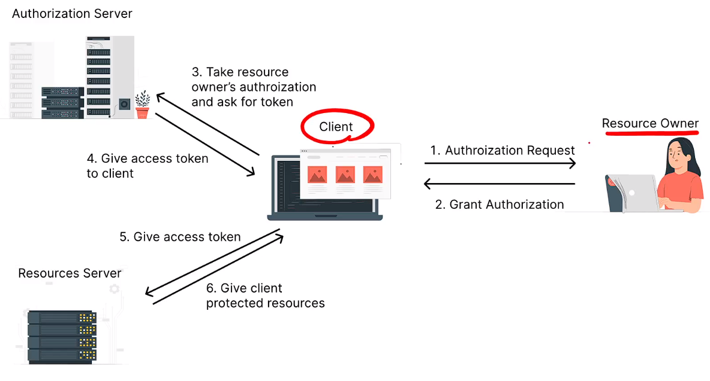

## 比較詳細的流程:

1. `AppServer` 去 `GOOGLE` 登記自己，並且從`GOOGLE`  得到 `AppServer` 的 `secret` 和`id` 。

2. `Umi` 告訴 `AppServer` 去存取 `Umi` 在`GOOGLE` 的資料 ，`Umi`會被轉送，持著 `AppServer` 的 `id` 送到 `GOOGLE` 授權網頁，並且 `Umi` 要同意讓 `AppServer` 取得其個資。 

3. `GOOGLE` 接下來把 `Umi` 導回 `AppServer` 並且附上 `Authorization Code` 。

4. `AppServer` 接著把 `Authorization Code`  以及 AppServer 本身的`secret`和`id` 送到 `GOOGLE` 。

5. `GOOGLE` 確認了 `AppServer` 給的`secret`，確認不是其他`server` 冒充，並且也從`Authorization Code`確認  `Umi` 真的有授權存取，接著就會將 `security token` 寄給 `AppServer`。

6. `AppServer` 接下來就拿著 `security token` 到 `GOOGLE` 取資料。


## Client叫做 Spencer Cool Website

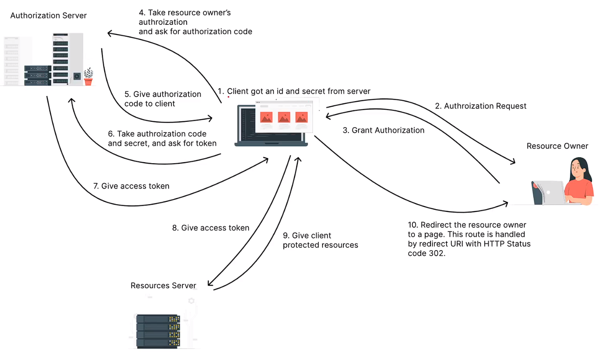

  


# (336) OAuth 流程2

又提跟剛剛差不多的事情

光於第二個Spencer Cool Website 

我決定後續用到再來自己描述

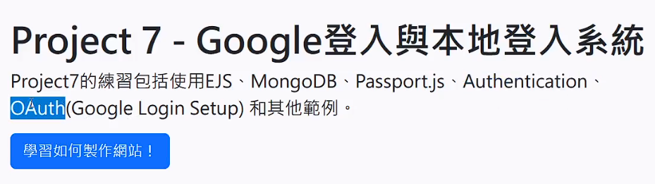

# (337) Google client id與secret

## 去google建立專案id

### 先選擇create credential OAuth client ID

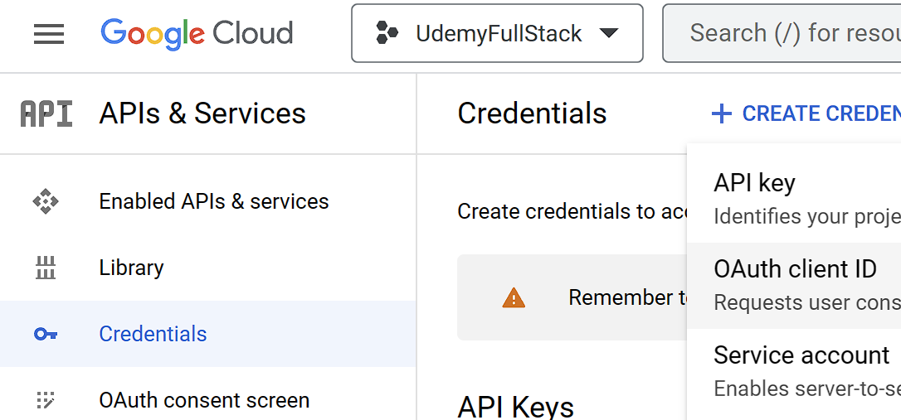

### 被要求先設定consent screen

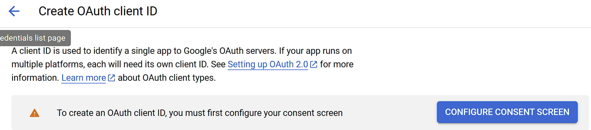

#### 選擇外部，建立

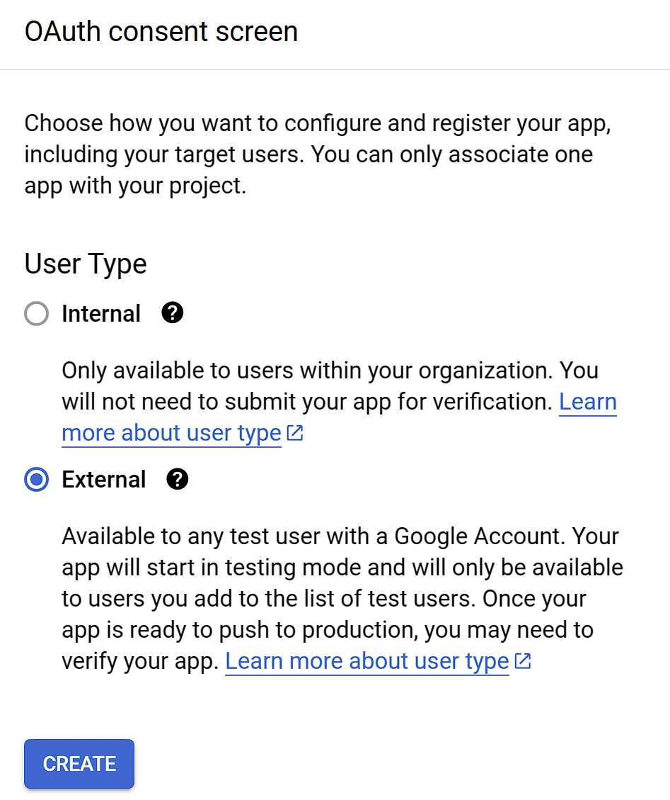

#### 接著編輯授權時候顯示的畫面跟一些申請資料

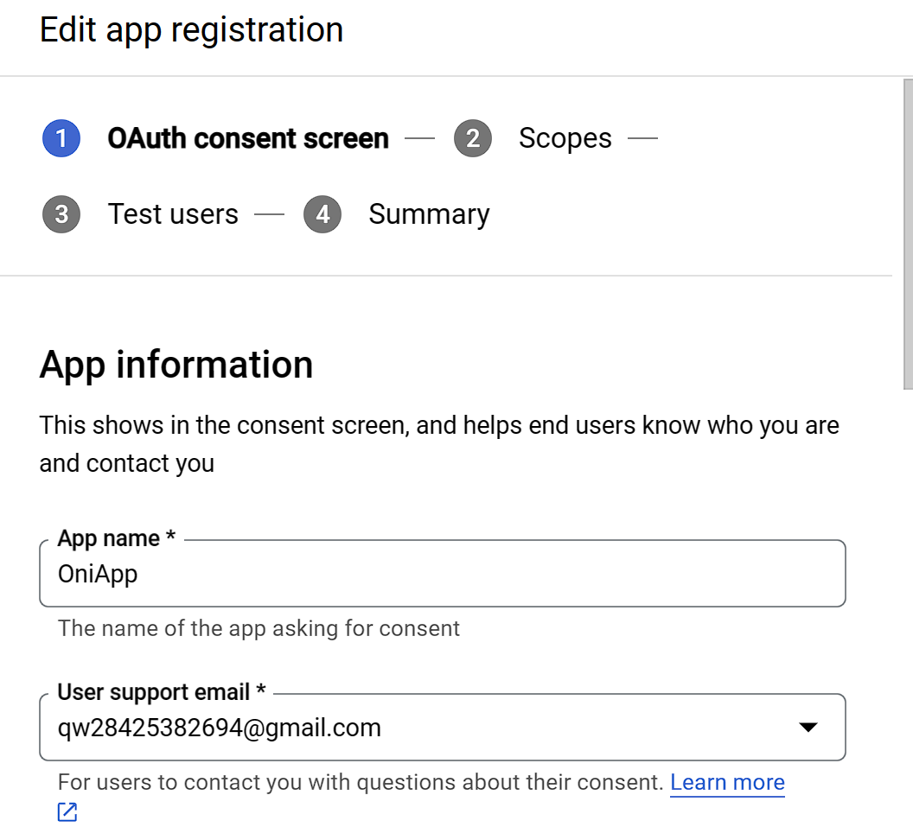

#### 使用者回傳redirect的網址

##### 之後可以試圖轉掛Ngrok


#### 最後再填一下信箱就好

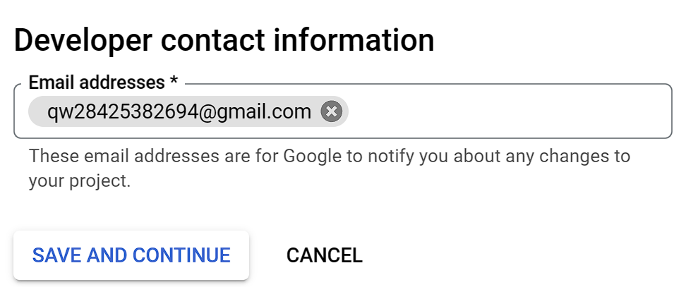

#### Scopes沒什麼特別想限制

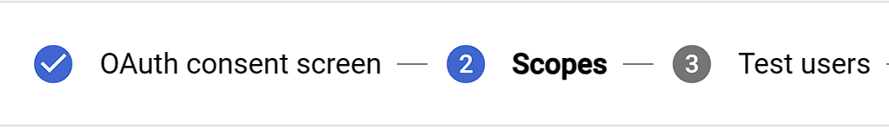

#### 基本上Test users也不需要

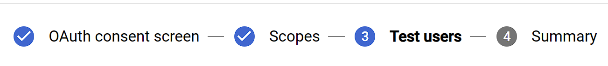

### 設定完同意畫面後，繼續憑證設定

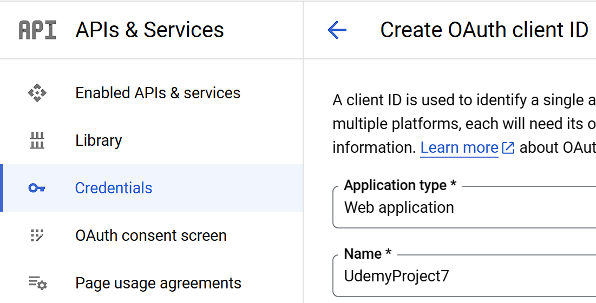

#### 下面繼續填寫，redirect要導回我們需要的位置

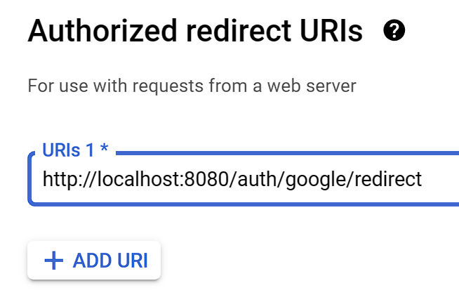

### 完成後記得保存json金鑰

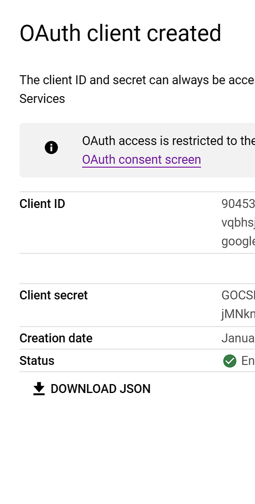


# (339) Google登入頁面


## Passport套件

適用node.js 用來做身分驗證的middleware，可以輕鬆集成OAuth身分驗證功能到任何基於Node、Express的APP中

提供了500多種身分驗證機制、包含本地身分驗證、Google、FaceBook、Twitter、GitHub、LinkedIn、IG。

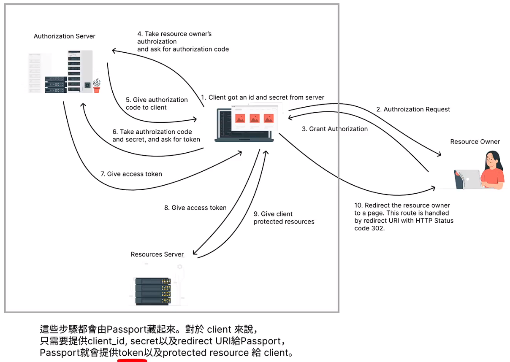

複雜步驟都會被藏起來，只要關注 `client_id`,`secret`,`redirect uri`給 `passport`，它就會提供`token`以及`protected resource`給`client`。


## 安裝以下全部

npm i express ejs cors method-override cookie-parser express-session dotenv connect-flash bcrypt

npm i mongoose@6.6.5 另外裝上去

npm i passport-google-oauth20  

npm i passport

## 忽視以下

package-lock.json

package.json

node_modules

.env

## 記得去拿免費的views

- 其中nav.ejs的 <%>都先拿掉 後面手動作一個出來

- 基本上造成阻礙的就先拿掉，反正跟著做而已。

- 看得懂最重要

## 使用那些檔案

auth-routes.js

login.ejs

app.js

## 依舊只解釋重要的

### passport.authenticate

```js
router.get("/google", (req, res) => {
  passport.authenticate("google", {
    scope: ["profile", "email"],
    prompt: "select_account",
  });
});
```

- 第一個參數是`google`，因此passport會使用內部策略去處理

- 也有說明需要安裝npm passport-google-Oauth20

- `scope` 內是我們想拿到的資料

- `prompt` 讓使用者能選擇帳戶

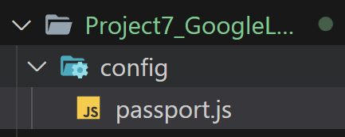

### passport.js

```js
const passport = require("passport");
const GoogleStrategy = require("passport-google-oauth20");

passport.use(
  new GoogleStrategy({
    clientID: process.env.GOOGLE_CLIENT_ID,
    clientSecret: process.env.GOOGLE_CLIENT_SECRET,
    callbackURL: "/auth/google/redirect",
  })
);
```

### .env 放入密碼了

不過這邊額外開passport.js是為了分割使用嗎? 

總之影片太長，下次再說!


# (340) Quick Fix

# (341) 儲存使用者資訊

# (342) 顯示使用者資訊

# (343) 註冊本地使用者

# (344) 登入本地使用者

# (345) 製作Post

# (346) Final Code

# (347) (進階課程) RFC 6749 導讀與詳細說明
