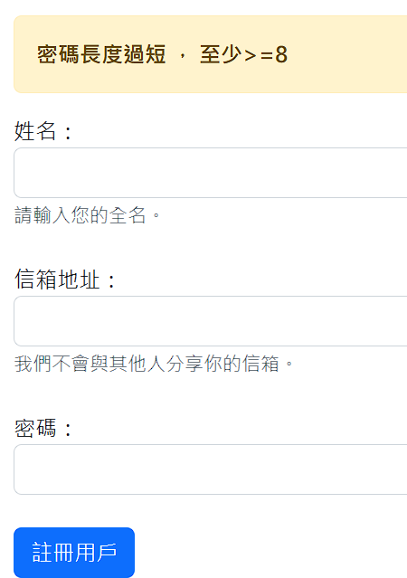
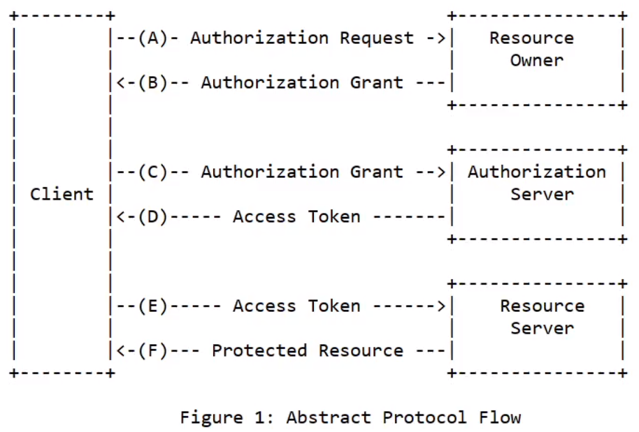
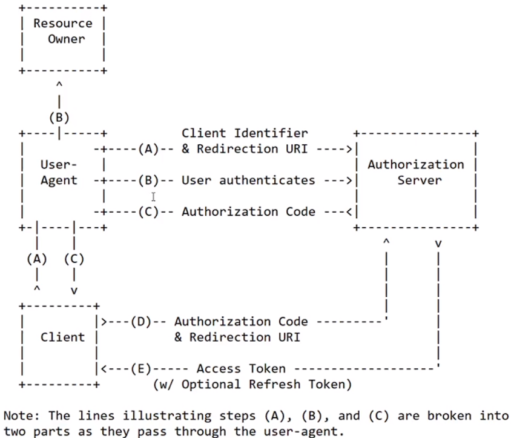
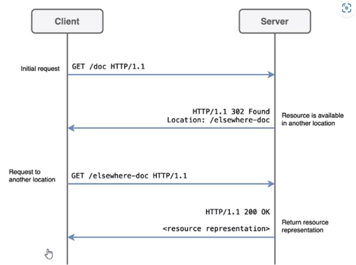

# (335) OAuth 流程

OAuth 2.0 安全協議

## OAuth常見名詞

### Resource Owner

資源擁有者 網頁的使用者

### Client

客戶端 第三方應用程式網站本身

### Authorization Server

授權伺服器，google、facebook等大系統，給予授權的server

### Resource Server

資源伺服器，GOOGLE FB 存放 Resource Owner 的被保護資訊的位置。


## 比較詳細的流程:

1. `AppServer` 去 `GOOGLE` 登記自己，並且從`GOOGLE`  得到 `AppServer` 的 `secret` 和`id` 。

2. `Umi` 告訴 `AppServer` 去存取 `Umi` 在`GOOGLE` 的資料 ，`Umi`會被轉送，持著 `AppServer` 的 `id` 送到 `GOOGLE` 授權網頁，並且 `Umi` 要同意讓 `AppServer` 取得其個資。 

3. `GOOGLE` 接下來把 `Umi` 導回 `AppServer` 並且附上 `Authorization Code` 。

4. `AppServer` 接著把 `Authorization Code`  以及 AppServer 本身的`secret`和`id` 送到 `GOOGLE` 。

5. `GOOGLE` 確認了 `AppServer` 給的`secret`，確認不是其他`server` 冒充，並且也從`Authorization Code`確認  `Umi` 真的有授權存取，接著就會將 `security token` 寄給 `AppServer`。

6. `AppServer` 接下來就拿著 `security token` 到 `GOOGLE` 取資料。

## Client叫做 Spencer Cool Website


# (336) OAuth 流程2

又提跟剛剛差不多的事情

光於第二個Spencer Cool Website 

我決定後續用到再來自己描述


# (337) Google client id與secret

## 去google建立專案id

### 先選擇create credential OAuth client ID


### 被要求先設定consent screen


#### 選擇外部，建立


#### 接著編輯授權時候顯示的畫面跟一些申請資料


#### 使用者回傳redirect的網址

##### 之後可以試圖轉掛Ngrok


#### 最後再填一下信箱就好


#### Scopes沒什麼特別想限制


#### 基本上Test users也不需要


### 設定完同意畫面後，繼續憑證設定


#### 下面繼續填寫，redirect要導回我們需要的位置


### 完成後記得保存json金鑰


# (339) Google登入頁面

## Passport套件

適用node.js 用來做身分驗證的middleware，可以輕鬆集成OAuth身分驗證功能到任何基於Node、Express的APP中

提供了500多種身分驗證機制、包含本地身分驗證、Google、FaceBook、Twitter、GitHub、LinkedIn、IG。


複雜步驟都會被藏起來，只要關注 `client_id`,`secret`,`redirect uri`給 `passport`，它就會提供`token`以及`protected resource`給`client`。

## 安裝以下全部

npm i express ejs cors method-override cookie-parser express-session dotenv connect-flash bcrypt

npm i mongoose@6.6.5 另外裝上去

npm i passport-google-oauth20  

npm i passport

## 忽視以下

package-lock.json

package.json

node_modules

.env

## 記得去拿免費的views

- 其中nav.ejs的 <%>都先拿掉 後面手動作一個出來

- 基本上造成阻礙的就先拿掉，反正跟著做而已。

- 看得懂最重要

## 使用那些檔案

auth-routes.js

login.ejs

app.js

## 依舊只解釋重要的

### passport.authenticate

```js
router.get("/google", (req, res) => {
  passport.authenticate("google", {
    scope: ["profile", "email"],
    prompt: "select_account",
  });
});
```

- 第一個參數是`google`，因此passport會使用內部策略去處理

- 也有說明需要安裝npm passport-google-Oauth20

- `scope` 內是我們想拿到的資料

- `prompt` 讓使用者能選擇帳戶


### passport.js

要給google `id` `secret`  `callbackURL`

關於  明明GCP 已經有設定`callbackURL` 

為什麼這邊也設定:

1. 防止使用自己打錯

2. 防止myServer被竄改了

```js
const passport = require("passport");
const GoogleStrategy = require("passport-google-oauth20");

passport.use(
  new GoogleStrategy({
    clientID: process.env.GOOGLE_CLIENT_ID,
    clientSecret: process.env.GOOGLE_CLIENT_SECRET,
    callbackURL: "/auth/google/redirect",
  })
);
```

### .env 放入密碼了

不過這邊額外開passport.js是為了分割使用嗎? 

總之影片太長，下次再說!

# (340) Quick Fix

下支影片中的18:55秒處有出現小錯誤，email屬性的設定中，profile的emails array少打了s，應該要是 `profile.emails[0].value` 。另外，profile 的 photos array 也少了一個 s，請要改成 `profile.photos[0].value`。

# (341) 儲存使用者資訊

## 繼續記錄

### auth-routes.js

#### 上次寫錯了

```js
router.get("/google", (req, res) => {
  passport.authenticate("google", {
    scope: ["profile", "email"],
    prompt: "select_account",
  });
});
```

#### 下面才對💡

```js
router.get(
  "/google",
  passport.authenticate("google", {
    scope: ["profile", "email"],
    prompt: "select_account",
  })
);
});
```

- 因為authenticate屬於middleware 所以這樣寫就行 !

### passport.js

```js
const passport = require("passport");
const GoogleStrategy = require("passport-google-oauth20");

passport.use(
  new GoogleStrategy(
    {
      clientID: process.env.GOOGLE_CLIENT_ID,
      clientSecret: process.env.GOOGLE_CLIENT_SECRET,
      callbackURL: "/auth/google/redirect",
    },
    (accessToken, refreshToken, profile, done) => {
      console.log(profile);
    }
  )
);
```

```js
server run on port 8080
Connecting to mongodb..
{
  id: '111147244433538782003',
  displayName: '林chen',
  name: { familyName: '林', givenName: 'chen' },
  emails: [ { value: 'linc4003931@gmail.com', verified: true } ],     
  photos: [
    {
      value: 'https://lh3.googleusercontent.com/a/ACg8ocIQdfEh7THZFyNkkMkNlIxVTyztwwTmUVMgHfM63lRrmA=s96-c'
    }
  ],
  provider: 'google',
  _raw: '{\n' +
    '  "sub": "111147244433538782003",\n' +
    '  "name": "林chen",\n' +
    '  "given_name": "chen",\n' +
    '  "family_name": "林",\n' +
    '  "picture": "https://lh3.googleusercontent.com/a/ACg8ocIQdfEh7THZFyNkkMkNlIxVTyztwwTmUVMgHfM63lRrmA\\u003ds96-c",\n' +
    '  "email": "linc4003931@gmail.com",\n' +
    '  "email_verified": true,\n' +
    '  "locale": "zh-TW"\n' +
    '}',
  _json: {
    sub: '111147244433538782003',
    name: '林chen',
    given_name: 'chen',
    family_name: '林',
    picture: 'https://lh3.googleusercontent.com/a/ACg8ocIQdfEh7THZFyNkkMkNlIxVTyztwwTmUVMgHfM63lRrmA=s96-c',
    email: 'linc4003931@gmail.com',
    email_verified: true,
    locale: 'zh-TW'
  }
}
```

- 上面是profile

#### done()

執行的時候 會去執行passport的serializeUser

```js
const passport = require("passport");
const GoogleStrategy = require("passport-google-oauth20");
const User = require("../models/user-model");

passport.serializeUser((user, done) => {
  console.log("serialize user");
  console.log(user);
  done(null,user._id) //mongodb的id存在session內部，
  //並且id簽名後 以cookie交給user
});

passport.use(
  new GoogleStrategy(
    {
      clientID: process.env.GOOGLE_CLIENT_ID,
      clientSecret: process.env.GOOGLE_CLIENT_SECRET,
      callbackURL: "/auth/google/redirect",
    },
    async (accessToken, refreshToken, profile, done) => {
      // console.log(profile);
      // 第一次登入則幫她註冊
      console.log("進入Google Strategy區域");
      console.log("==================");
      let foundUser = await User.findOne({ googleID: profile.id }).exec();
      if (foundUser) {
        console.log("已經註冊過，無須存入");
        done(null, foundUser);
      } else {
        console.log("偵測到新用戶，需儲存");
        let newUser = new User({
          name: profile.displayName,
          googleID: profile.id,
          thumbnail: profile.photos[0].value,
          email: profile.emails[0].value,
        });
        let savedUser = await newUser.save();
        console.log("成功創建新用戶");
        done(null, savedUser);
      }
    }
  )
);
```

- google Strategy的 async function 中，done如果執行，則會被passport的serializeUser 匿名函數去做事，這個匿名函數中也有done(null,user._id)，他會把參數放入session內部，並且在user那邊設定，這邊的user._id是透過上一個 done傳入的使用者。

## 太複雜之後再看怎麼整理

git commit -m "Project7 section 341，儲存使用者資訊，成功得到我另一個Gmail資料。做了user-model.js、使用use (session({}))之後要 use passport.initialize() 跟 passport.session()，另外passport.js中，使用GoogleStrategy，內部的四個參數，箭頭函數中，one(null,savedUser或foundUser)會把 passport.serializeUser給執行，參數也會轉交給其((user,done)=>{}) user的部分，然後在此內部done(null,user.id)也要再度執行，他會把剛剛傳過來的資料自動設定到session內部，簽名後傳給user"

# (342) 顯示使用者資訊

## 該做的事

反序列化，取得user資料，透過done傳達下去，最後passport會幫我們把req.user屬性設定為找到的user。

關於登入畫面nav.ejs 也要調整，登入前後要有所改變 

登入前 : 登出系統 個人檔案 製作新的Post         要不存在

登入後 : 會員登入 註冊會員        要拿掉


因此各個route要傳達 類似下方

 `return res.render("index", { user: req.user });`

把使用到render ejs的地方 加一加就對了。

## passport.js

上次做到序列化，這次做反序列化

### deserializeUser

反序列化沒錯，應該說是一個抽象的行為，具體實現則是透過我們決定使用什麼方式，這邊使用mongoose 所以套上User.findOne去反序列化出來，得到資料。

```js
passport.deserializeUser(async (_id, done) => {
  console.log("反序列化使用者(回歸物件)，透過之前序列化的資料，得到_id");
  let foundUser = await User.findOne({ _id });
  done(null, foundUser);
  // passport 將 req.user的這個屬性設定為 foundUser 方便存取。
});
```

### profile-routes.js

這邊新增route，分流渲染頁面而已。

```js
const router = require("express").Router();
const authCheck = (req, res, next) => {
  if (req.isAuthenticated()) {
    next();
  } else {
    return res.redirect("/auth/login");
  }
};
router.get("/", authCheck, (req, res) => {
  console.log("已進入 >> /profile");
  return res.render("profile", { user: req.user });
  // deSerial那邊有解釋req.user
});
module.exports = router;
```

- 把user丟過去ejs

- 也要保護profile .ejs ，如果非認證者(不存在req.user)，不應顯示 !

### auth-routes.js

主要增加logout 這邊，為了可以登出! 

他好像是req自帶的 > Terminate an existing login session.

```js
const router = require("express").Router();
const passport = require("passport");
router.get("/login", (req, res) => {
  return res.render("login");
});
router.get("/logout", (req, res) => {
  req.logOut((err) => {
    if (err) return res.send(err);
    return res.redirect("/");
  });
});
router.get(
  "/google",
  passport.authenticate("google", {
    scope: ["profile", "email"],
    prompt: "select_account",
  })
);

router.get("/google/redirect", passport.authenticate("google"), (req, res) => {
  console.log("Redirect To profile");
  return res.redirect("/profile");
});
module.exports = router;
```

## console

### 印出了各router如何運作順序

```batch
server run on port 8080
Connecting to mongodb..
進入Google Strategy區域
==================
已經註冊過，無須存入
serialize user
{
  _id: new ObjectId("659e356492553f317e567ef9"),
  name: '林chen',
  googleID: '111147244433538782003',
  thumbnail: 'https://lh3.googleusercontent.com/a/ACg8ocIQdfEh7THZFyNkkMkNlIxVTyztwwTmUVMgHfM63lRrmA=s96-c',
  email: 'linc4003931@gmail.com',
  date: 2024-01-10T06:12:52.880Z,
  __v: 0
}
Redirect To profile
反序列化使用者(回歸物件)，透過之前序列化的資料，得到_id
已進入 >> /profile
```

# (343) 註冊本地使用者

## 該做的事:

auth-routes增加 `router.get("/signup", (req, res)` 

然後分發渲染頁面，傳入 `{ user : req.user }` 

然後安裝 `npm i connect-flash`

`app.js` 那邊要 `app.use(flash())` 

而且還要使用自製 middleware  把想寫入 flash 放到res.locals下

也要記得next() 

回到 `auth-routes.js` 

這邊 router.post ("/signup") 自製防堵牆壁，禁止使用者註冊時

密碼少於8碼也能偷渡成功，透過 `req.flash("","")` 

添加要求，將用戶導回 自己伺服器內部的另一個 route 

然後傳承前面的req，使用render，去渲染畫面時，會自動帶入該屬性。

另外 user name長度也要記得防堵 !

回到 `signup.ejs`  之前，我們拿掉了message.ejs引用

這次要把 引用放回去，因為透過redirect，把資料添加在req送過去後，已經可以render上去了，error這個參數將會被附上。

另外，要注意 `signup.ejs` 下面 密碼那邊記得長度設定6 

才能顯示出 `server` 阻擋 長度不足的密碼功能有沒有實現 !

後續則引用`User` 模型 跟 `bcrypt`加密

找看看有無註冊過的信箱

如果找到，就會被發錯誤訊息並且導向 註冊畫面 (從而發出錯誤訊息)

如果沒有，才可以註冊，然後成功的畫面也要導向 ( 成功訊息 )

另外 訊息 要安裝回去index.ejs 透過include 安裝回去!

## signup.ejs

首先要取消 `<%- include ("partials/message") %>` 

避免引用報錯

---

等到後續

記得要改密碼最短=6 另一端auth那邊則設定最短8

```ejs
        <div class="form-group">
          <label for="exampleInputPassword1">密碼：</label>
          <input
            type="password"
            class="form-control"
            id="exampleInputPassword1"
            minlength="6"
            maxlength="1024"
            name="password"
            required
          />
        </div>
```



## auth-routes.js

使用者的頁面渲染

註冊頁面的錯誤 則返回

記得密碼長度要額外攔截 避免postman漏洞

姓名長度也是 User有設定的都要check !

---

後續則引用User 模型 跟 bcrypt加密

然後找出註冊過後的信箱

如果找到，就會被發錯誤訊息並且導向

如果沒有，才可以註冊，然後成功的畫面也要導向

另外 訊息 要安裝回去index.ejs 透過include 安裝回去!

```js
const User = require("../models/user-model");
const bcrypt = require("bcrypt");
router.get("/signup", (req, res) => {
  return res.render("signup", { user: req.user });
});

router.post("/signup", async (req, res) => {
  let { name, email, password } = req.body;
  if (password.length < 8) {
    //二度防堵 避免有人繞路
    req.flash("error_msg", "密碼長度過短 ， 至少>=8 ");
    return res.redirect("/auth/signup");
  }
  if (name.length < 3) {
    req.flash("error_msg", "名稱過短 ， 至少>=3 ");
    return res.redirect("/auth/signup");
  }
  // 確認信箱是否註冊過
  const foundEmail = await User.findOne({ email }).exec();
  if (foundEmail) {
    req.flash("error_msg", "信箱已被註冊，請直接登入，或使用其他註冊");
    return res.redirect("/auth/signup");
  }
  let hashedPassword = await bcrypt.hash(password, 12);
  let newUser = new User({ name, email, password: hashedPassword });
  await newUser.save();
  req.flash("success_msg", "註冊成功!");
  return res.redirect("/auth/login");
});/auth/login");
});
```

## 安裝 connect-flash

npm i connect-flash

## app.js

套用模組 `connect-flash` 然後 

進入`Router` 之前，`middleware` 要先套用 `flsh()` 

之後則是新增一個手動設定的 `MiddleWare`

增加資料到 `res . locals` 屬性下面 

要記得轉交控制權 next ( )

```js
const passport = require("passport");
const flash = require("connect-flash");

app.use(passport.session());
app.use(flash());
app.use((req, res, next) => {
  res.locals.success_msg = req.flash("success_msg");
  res.locals.error_msg = req.flash("error_msg");
  res.locals.error = req.flash("error");
  next();
});
```

## message.ejs

這邊使用的 error 他會自己去找到 res.locals.error 的部分

之前我們都是使用 `res.render("index",{error})`

`res.render`      會 取得 第二個參數放入的

`res.flash`        則會 看怎麼

```ejs
<% if (error != "") { %>
<div class="alert alert-warning alert-dismissible fade show" role="alert">
  <strong><%= error %></strong>
</div>
<% } %>

<!--break-->
<% if (error_msg != "") { %>
<div class="alert alert-warning alert-dismissible fade show" role="alert">
  <strong><%= error_msg %></strong>
</div>
<% } %>

<!--break-->
<% if (success_msg != "") { %>
<div class="alert alert-success alert-dismissible fade show" role="alert">
  <strong><%= success_msg %></strong>
</div>
<% } %>
```

## 自己做的後續

登入功能的路由 我猜類似下面這樣

但是還要使用session 的部分

```js
router.post("/login", async (req, res) => {
  try {
    let { username, password } = req.body;
    let foundUser = await User.findOne({ email: username }).exec();

    if (foundUser) {
      let result = await bcrypt.compare(password, foundUser.password);
      if (result) {

      }
    } else {
      req.flash("error_msg", "重新登入");
      return res.redirect("/auth/login");
    }
  } catch (e) {
    req.flash("error_msg", e.reason);
    return res.redirect("/auth/login");
  }
});
```

# (344) 登入本地使用者

## 該做的事:

因為要做登入，雖然也不是不能像之前那樣，但既然要用google，那就統一用passport。

使用 passport 的 LocalStrategy !!!

安裝 npm i passport-local

接著去`passport.js`

記得先引用 `passport-local` 、`bcrypt`

在這邊我們要新增 `LocalStrategy`策略

然後 `auth-routes.js`  

這邊要使用

`router.post("/login",passport....,()=>{成功後}`

 三個參數分別是 route、authenticate事宜、success後要幹嘛

## 安裝passport-local

為了統一使用格式、靈活使用

## passport.js

使用 passport-local、bcrypt

然後讓passport新增 本地端的策略

async那邊採用的username跟password是自動收集

`req.body` 解構出來的 username,password 帶入

> 所以這邊的username,password 可以 u , p 命名無所謂
> 
> 知道代表username=email，password=password就好!

然後done 跟之前googleStrategy 很相似 

```js
const LocalStrategy = require("passport-local");
const bcrypt = require("bcrypt");


// 這邊的username , password 是根據post自動從req.body 解構進去的
passport.use(
  new LocalStrategy(async (username, password, done) => {
    let foundUser = await User.findOne({ email: username }).exec();
    if (foundUser) {
      let result = await bcrypt.compare(password, foundUser.password);
      if (result) {
        done(null, foundUser);
      } else {
        done(null, false);
      }
    } else {
      done(null, false);
    }
  })
);
```

## auth-routes.js

這邊則是使用 middleware 讓passport去幫忙掌管

如果失敗就會跳到我們輸入的部分

成功就會往下，然後會被導向profile

```js
router.post(
  "/login",
  passport.authenticate("local", {
    failureRedirect: "/auth/login",
    failureFlash: "登入失敗，帳號或密碼錯誤", 
    // 自動套入 req.locals.error這邊
  }),
  async (req, res) => {
    return res.redirect("/profile"); //成功才會到這邊
  }
);
```


# (345) 製作Post

## 該做的事:

模型新增 `post-model.js `  文件

`profile-routes` 

寫 `router.get('post')` 跟 `router.post('post')` 的部分

兩者都要驗證登入，前者給予畫面，後者負責文章資料。

另外這邊原有的 `router.get('/',authCheck,reqr)` 

這邊改成 async 並且 要去撈 post 的collection資料， 也在render時給予。

`profile.ejs` 

這邊要做section 然後透過 posts 去作出內容 若無則不會做出

## post-model.js

做一個資料模型出來

```js
const mongoose = require("mongoose");
const postSchema = new mongoose.Schema({
  title: {
    type: String,
    required: true,
  },
  content: {
    type: String,
    required: true,
  },
  date: {
    type: Date,
    default: Date.now,
  },
  author: String,
});

module.exports = mongoose.model("Post", postSchema);
```

## profile-routes.js

引用Post，這邊主要是做post文章的動作

因此 get 取得ejs 文件，post 送出填寫內容都要做事

兩邊都要先確認authCheck有登入

然後建立Post Object，儲存，失敗則重新導向並填寫flash提示

另外就是 / 這邊有改用async 並且試圖取得 Post Object資料 

讓profile.ejs 可以使用collection資料。

```js
const Post = require("../models/post-model");

router.get("/", authCheck, async (req, res) => {
  console.log("已進入 >> /profile");
  let postFound = await Post.find({ author: req.user._id }).exec();
  return res.render("profile", { user: req.user, posts: postFound });
  // deSerial那邊有解釋req.user
});

router.get("/post", authCheck, (req, res) => {
  return res.render("post", { user: req.user });
});
router.post("/post", authCheck, async (req, res) => {
  let { title, content } = req.body;
  let newPost = new Post({
    title,
    content,
    author: req.user._id,
  });
  try {
    let savedPost = await newPost.save();
    return res.redirect("/profile");
  } catch (e) {
    req.flash("error_msg", "標題跟內容都要填寫");
    return res.redirect("/profile/post");
  }
});
```

## profile.ejs

在section下方添加以下內容

```ejs
    </section>
    <section class="posts">
      <% for (let i = 0; i < posts.length; i++) { %>
      <div class="card" style="width: 18rem; margin: 1rem">
        <div class="card-body">
          <h5 class="card-title"><%= posts[i].title %></h5>
          <p class="card-text"><%= posts[i].content %></p>
          <a href="#" class="btn btn-primary"><%= posts[i].date %></a>
        </div>
      </div>
      <% } %>
    </section>
```

# (346) Final Code

# (347) (進階課程) RFC 6749 導讀與詳細說明

## 如何達到

## Protocol Flow



client 基本上就是 My server 





- 302 redirect 重新導向 發現302 然後導向/elsewhere-doc

# 最終小考

## 問題 1：以下關於OAuth 2.0的敘述，何者錯誤？

- OAuth 2.0 是一種安全協議

- OAuth 2.0 規範了如何讓第三方應用程式，代表資源擁有者訪問伺服器，獲得資源擁有者的資訊。

- OAuth 2.0 中的Resource Owner(資源擁有者)指的是是Google, Facebook等大型系統，也就是給予授權的伺服器。🔥

- Resource Server – 資源伺服器，指的是Google, Facebook等大型系統中，存放資源擁有者的被保護資訊的位置。

Resource Owner – 資源擁有者，即網頁的使用者。資源是指網頁使用者的個人資料與授權。


## 問題 2：Oauth 2.0當中的secret的功能為何？

- Authorization Server使用secret來確認沒有其他網站可以冒充我們製作的網站。🔥

- 用來將訊息簽名。原理與Cookie簽名一樣。

- 讓大家有很多秘密，創造一種神秘感。

- 沒有什麼特別的功能。。。


## 問題 3：在OAuth當中，client通常是指?

- 出手闊綽消費者

- 網站的用戶端

- 這個英文單字我沒看過，容我先查一下字典。

- 我們製作的網頁伺服器🔥

## 問題 4：在OAuth當中，resource owner通常是指?

- 網頁的使用者🔥

- 我們製作的網站

- Google伺服器

- 世界上的有錢人與貧富不均的現象
