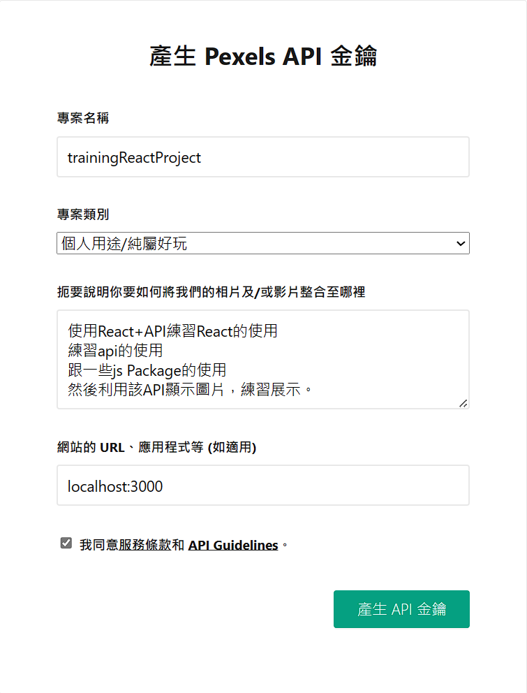
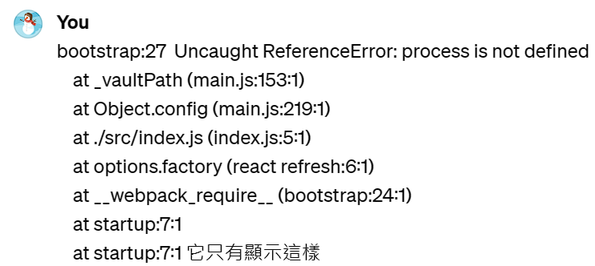
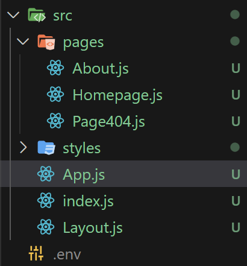

# (360) 資源包下載

裡面只有styles 

# (361) 專案介紹

# (362) 專案基本設定

## Work Flow

先設定到跟 Chapter24 -React狀態差不多

先在 src下面創建styles

然後 解壓縮的 styles 內容貼過來

去pexel取得鑰匙

---

不應該在 `Homepage.js` 使用 import dotenv from 'dotenv'

應該在 `index.js` 使用......

其實內建支援 直接使用.env 不需要安裝 dotenv 

const k = process.env.REACT_APP_PHOTOAPIKEY;

直接用就好  挖耖浪費好多時間...

---

整理一下 ，新增

建立pages資料夾、components資料夾

`pages` 把 `App.js` `index.js` `Layout.js` 以外的放進去

`components` 建立 `Footer.js`

`Layout.js`  `v1` 引用 `Footer` 進去

然後回到 `App.js`

加入樣式 import進去後

`Homepage.js`  改變樣式，minHeight:"100vh"

加入Search Component 

所以要先建立 `Search.js`  到 components 資料夾下面

要注意className是否有取對名稱

## 創建styles資料夾並放入解壓檔案


## Pexel 取得金鑰




- 使用React+API練習React的使用
  練習api的使用
  跟一些js Package的使用
  然後利用該API顯示圖片，練習展示。

## 以下不需要理會 其實內建.env不需要安裝dotenv

## 使用dotenv

### 建議import在index.js

process.env 在其它可以直接呼叫

### 發生錯誤

> BREAKING CHANGE: webpack < 5 used to include polyfills for node.js core modules by default.
> This is no longer the case. Verify if you need this module and configure a polyfill for it.

### 原因:

Webpack 5 不再默認提供 Node.js 核心模塊的 polyfills，主要是因為在瀏覽器環境中，並不是所有的 Node.js 核心模塊都是有意義的或必要的。這樣的變化旨在減小打包文件的大小，並提高應用的性能。

### 解決辦法:

> **craco 是因為我們透過 create-react-app 創建專案所以無法簡單修改 webpack**

#### npm install @craco/craco

#### root 建檔案 craco.config.js

#### 安裝 path-browserify

npm install path-browserify

#### npx craco start

用了還是無法解決 ( 可能有衝突? )



```js
const path = require("path");

module.exports = {
  webpack: {
    configure: {
      resolve: {
        fallback: {
          path: require.resolve("path-browserify"),
          os: require.resolve("os-browserify"),
          crypto: require.resolve("crypto-browserify"),
          stream: require.resolve("stream-browserify"),
          buffer: require.resolve("buffer"),
        },
      },
    },
  },
};
```

## 建立pages資料夾、components資料夾



把 `app.js` `index.js` `layout.js` 留下而已
其它放到新的pages 資料夾內 ( pages建在 src內 )

## Footer.js

```js
import React from "react";

const Footer = () => {
  return <div className="footer">Oni 2024</div>;
};

export default Footer;
```

## Layout.js

引用footer 進去

```js
import React from "react";
import { Link, Outlet } from "react-router-dom";
import Footer from "./components/Footer";
const Layout = () => {
  return (
    <div>
      <nav>
        <ul>
          <li>
            <Link to="/">首頁</Link>
          </li>
          <li>
            <Link to="/about">關於網站</Link>
          </li>
        </ul>
      </nav>
      <Outlet />
      <Footer />
    </div>
  );
};

export default Layout;
ooter;
```

## App.js

加入以下就能套用了

```js
import "./styles/style.css";
```

```js
import { BrowserRouter, Routes, Route } from "react-router-dom";
import Layout from "./Layout";
import Homepage from "./pages/Homepage";
import About from "./pages/About";
import Page404 from "./pages/Page404";
import "./styles/style.css";
function App() {
  return (
    <BrowserRouter>
      <Routes>
        <Route path="/" element={<Layout />}>
          <Route index element={<Homepage />}></Route>
          <Route path="about" element={<About />}></Route>
          <Route path="*" element={<Page404 />}></Route>
        </Route>
      </Routes>
    </BrowserRouter>
  );
}

export default App;
```

## Homepage.js

改變樣式，讓中間的高度最小為100vh

然後搭配下面的search ，套用到Homepage中

```js
import React from "react";
import Search from "../components/Search";
const Homepage = () => {
  const auth = process.env.REACT_APP_PHOTOAPIKEY;
  return (
    <div style={{ minHeight: "100vh" }}>
      <Search />
    </div>
  );
};

export default Homepage;
mepage;
```

## Search.js

注意 className要一致，否則css不會套用到唷

```js
import React from "react";

const Search = () => {
  return (
    <div className="search">
      <input className="input" type="text" />
      <button>Search</button>
    </div>
  );
};

export default Search;
ult Search;
```

# (363) 展示圖片

# (364) 搜尋圖片

# (365) 更多圖功能

# (366) Final Code
