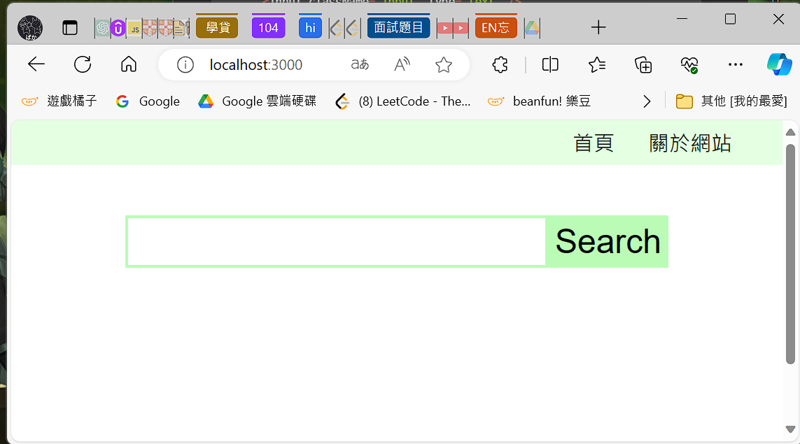
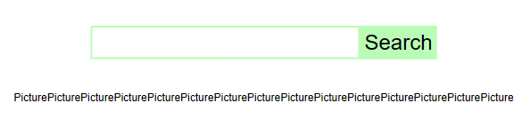

# (360) 資源包下載

裡面只有styles 

# (361) 專案介紹

# (362) 專案基本設定

## Work Flow

先設定到跟 Chapter24 -React狀態差不多

先在 src下面創建styles

然後 解壓縮的 styles 內容貼過來

去pexel取得鑰匙

---

不應該在 `Homepage.js` 使用 import dotenv from 'dotenv'

應該在 `index.js` 使用......

其實內建支援 直接使用.env 不需要安裝 dotenv 

const k = process.env.REACT_APP_PHOTOAPIKEY;

直接用就好  挖耖浪費好多時間...

---

整理一下 ，新增

建立pages資料夾、components資料夾

`pages` 把 `App.js` `index.js` `Layout.js` 以外的放進去

`components` 建立 `Footer.js`

`Layout.js`  `v1` 引用 `Footer` 進去

然後回到 `App.js`

加入樣式 import進去後

`Homepage.js`  改變樣式，minHeight:"100vh"

加入Search Component 

所以要先建立 `Search.js`  到 components 資料夾下面

要注意className是否有取對名稱

---

接著是使用 pexels API 、搭配axios package (比fetch 當作加強版就好)

套用到 `Search.js` 身上 `v2` 版本有

## 創建styles資料夾並放入解壓檔案


## Pexel 取得金鑰


- 使用React+API練習React的使用
  練習api的使用
  跟一些js Package的使用
  然後利用該API顯示圖片，練習展示。

## 以下不需要理會 其實內建.env不需要安裝dotenv

## 使用dotenv

### 建議import在index.js

process.env 在其它可以直接呼叫

### 發生錯誤

> BREAKING CHANGE: webpack < 5 used to include polyfills for node.js core modules by default.
> This is no longer the case. Verify if you need this module and configure a polyfill for it.

### 原因:

Webpack 5 不再默認提供 Node.js 核心模塊的 polyfills，主要是因為在瀏覽器環境中，並不是所有的 Node.js 核心模塊都是有意義的或必要的。這樣的變化旨在減小打包文件的大小，並提高應用的性能。

### 解決辦法:

> **craco 是因為我們透過 create-react-app 創建專案所以無法簡單修改 webpack**

#### npm install @craco/craco

#### root 建檔案 craco.config.js

#### 安裝 path-browserify

npm install path-browserify

#### npx craco start

用了還是無法解決 ( 可能有衝突? )


```js
const path = require("path");

module.exports = {
  webpack: {
    configure: {
      resolve: {
        fallback: {
          path: require.resolve("path-browserify"),
          os: require.resolve("os-browserify"),
          crypto: require.resolve("crypto-browserify"),
          stream: require.resolve("stream-browserify"),
          buffer: require.resolve("buffer"),
        },
      },
    },
  },
};
```

## 建立pages資料夾、components資料夾


把 `app.js` `index.js` `layout.js` 留下而已
其它放到新的pages 資料夾內 ( pages建在 src內 )

## Footer.js

```js
import React from "react";

const Footer = () => {
  return <div className="footer">Oni 2024</div>;
};

export default Footer;
```

## Layout.js

引用footer 進去

```js
import React from "react";
import { Link, Outlet } from "react-router-dom";
import Footer from "./components/Footer";
const Layout = () => {
  return (
    <div>
      <nav>
        <ul>
          <li>
            <Link to="/">首頁</Link>
          </li>
          <li>
            <Link to="/about">關於網站</Link>
          </li>
        </ul>
      </nav>
      <Outlet />
      <Footer />
    </div>
  );
};

export default Layout;
ooter;
```

## App.js

加入以下就能套用了

```js
import "./styles/style.css";
```

```js
import { BrowserRouter, Routes, Route } from "react-router-dom";
import Layout from "./Layout";
import Homepage from "./pages/Homepage";
import About from "./pages/About";
import Page404 from "./pages/Page404";
import "./styles/style.css";
function App() {
  return (
    <BrowserRouter>
      <Routes>
        <Route path="/" element={<Layout />}>
          <Route index element={<Homepage />}></Route>
          <Route path="about" element={<About />}></Route>
          <Route path="*" element={<Page404 />}></Route>
        </Route>
      </Routes>
    </BrowserRouter>
  );
}

export default App;
```

## Homepage.js

改變樣式，讓中間的高度最小為100vh

然後搭配下面的search ，套用到Homepage中

```js
import React from "react";
import Search from "../components/Search";
const Homepage = () => {
  const auth = process.env.REACT_APP_PHOTOAPIKEY;
  return (
    <div style={{ minHeight: "100vh" }}>
      <Search />
    </div>
  );
};

export default Homepage;
mepage;
```

## Search.js

注意 className要一致，否則css不會套用到唷

```js
import React from "react";

const Search = () => {
  return (
    <div className="search">
      <input className="input" type="text" />
      <button>Search</button>
    </div>
  );
};

export default Search;
ult Search;
```



- 網站大概會長成這樣

### v2 search

```js
import React from "react";
import axios from "axios";

const Search = () => {
  const auth = process.env.REACT_APP_PHOTOAPIKEY;
  const initialURL = "https://api.pexels.com/v1/curated?page==1&per_page=15";
  const search = async () => {
    let result = await axios.get(initialURL, {
      headers: { Authorization: auth },
    });
    console.log(result);
  };
  return (
    <div className="search">
      <input className="input" type="text" />
      <button onClick={search}>Search</button>
    </div>
  );
};

export default Search;
```

## 使用 Axios npm i axios

`axios` 和 `fetch` 都是用來進行網路請求的工具，但它們有一些差異。

1. **API 設計：**
   
   - **axios：** 提供了一個簡潔的 API，支援 Promise，能夠輕鬆處理請求和響應的轉換，還有方便的錯誤處理。它還可以進行請求攔截，並支援取消請求。
   - **fetch：** 使用瀏覽器內建的 `fetch` 函式，返回的是一個 Promise，也提供了基本的 HTTP 請求功能，但 API 相對較低階，可能需要額外的處理。

2. **預設設定：**
   
   - **axios：** 在預設情況下，axios 支援 JSON 格式的請求和響應，並自動轉換。
   - **fetch：** 需要手動處理 JSON 轉換，例如使用 `response.json()`。

3. **取消請求：**
   
   - **axios：** 提供了取消請求的機制，可以使用 `CancelToken` 進行取消。
   - **fetch：** 本身不提供內建的取消請求的方法，但可以使用 `AbortController` 進行取消。

4. **瀏覽器支援：**
   
   - **axios：** 不僅可以在瀏覽器中使用，還支援在 Node.js 中運行。
   - **fetch：** 是瀏覽器的內建函式，需要注意在某些瀏覽器中可能需要 polyfill。

總體而言，`axios` 提供了更豐富的功能和更容易使用的 API，尤其在處理 JSON 和錯誤時更為方便。`fetch` 則是一個簡單、基本的瀏覽器原生 API，它也能夠完成大部分的網路請求工作，但使用上相對較為原始。選擇使用哪一個通常取決於項目的需求和開發者的喜好。


# (363) 展示圖片

## Work Flow

`components` 資料夾內  建立 `Picture.js` 

`Search.js` 的大部分內容轉移到 `Homepage.js` 

然後`Homepage.js`透過 `props` 傳送`state` 到 `Search.js` 使用

這樣子只要 search 按下按鈕，props 被傳過去，觸動setData就會重新渲染畫面

`Homepage.js` `v2` ，把資料傳送到 `Picture.js` `v2` 

## Homepage.js🔥

### v1

data && data.map🔥

> 利用 js && 的特性 ，前者true 回傳後者的特性 !🔥🔥🔥

```js
import React, { useState } from "react";
import Search from "../components/Search";
import Picture from "../components/Picture";
import axios from "axios";
const Homepage = () => {
  let [data, setData] = useState(null);
  const auth = process.env.REACT_APP_PHOTOAPIKEY;
  const initialURL = "https://api.pexels.com/v1/curated?page==1&per_page=15";
  const search = async () => {
    let result = await axios.get(initialURL, {
      headers: { Authorization: auth },
    });
    console.log(result);
    setData(result.data.photos);
  };
  return (
    <div style={{ minHeight: "100vh" }}>
      <Search search={search} />
      <div className="pictures">{data && data.map((d) => <Picture />)}</div>
    </div>
  );
};

export default Homepage;
```



### v2 傳送prop到Picture

```js
  return (
    <div style={{ minHeight: "100vh" }}>
      <Search search={search} />
      <div className="pictures">
        {data && data.map((d) => <Picture data={d} />)}
      </div>
    </div>
  );
```

## Search.js

大部分內容移轉到 `Homepage.js`

```js
import React, { useState } from "react";

const Search = ({ search }) => {
  return (
    <div className="search">
      <input className="input" type="text" />
      <button onClick={search}>Search</button>
    </div>
  );
};

export default Search;
```

## Picture.js

### v1 rafce

```js
import React from "react";

const Picture = () => {
  return <div>Picture</div>;
};

export default Picture;
```

### v2 接受到內容，讀取prop

> 記得 是透過 {data} 解構 得到 data 否則那是物件
> 
> data.data才得到 :(   。

```js
import React from "react";

const Picture = ({ data }) => {
  return (
    <div className="picture">
      <p>{data.photographer}</p>
      <div className="imageContainer">
        
      </div>
      <p>
        下載圖片:{" "}
        <a target="_blank" href={data.src.large}>
          按我
        </a>
      </p>
    </div>
  );
};

export default Picture;
```

# (364) 搜尋圖片

## Work Flow

`homepage.js`  `v1` 初次渲染畫面 希望執行一次search ，利用useEffect空陣列達成 !

`homepage.js` `v2`  搭配 `Search.js` `v2`  

達成搜尋結果

## Homepage.js

### v1- 利用useEffect

空陣列，初次 `render` 的時候執行一次 `search()` 

```js
const Homepage = () => {
  let [data, setData] = useState(null);
  const auth = process.env.REACT_APP_PHOTOAPIKEY;
  const initialURL = "https://api.pexels.com/v1/curated?page==1&per_page=15";
  const search = async () => {
    let result = await axios.get(initialURL, {
      headers: { Authorization: auth },
    });
    console.log(result);
    setData(result.data.photos);
  };
  useEffect(() => {
    search();
  }, []);
  return (
```

### v2 - prop {()=>{}   }

為什麼使用  `prop = {  ()=>{search(searchURL)}   }` ? 

因為  要避免 render的時候直接觸發，然後裡面沒有值

如果直接 search(searchURL) 那會直接執行

但是如果傳送的是 arr fn 則不會被直接執行，而是匿名函數

[ AnonymousFunction ] 被丟過去，由對面按鈕負責

另外 `searchURL` 會跟隨render 函數 ( 也就是Homepager內部 )，

每當被重新渲染，都會重新計算值，所以才會跟著變動。

```js
import React, { useEffect, useState } from "react";
import Search from "../components/Search";
import Picture from "../components/Picture";
import axios from "axios";
const Homepage = () => {
  let [data, setData] = useState(null);
  let [input, setInput] = useState("");
  const auth = process.env.REACT_APP_PHOTOAPIKEY;
  const initialURL = "https://api.pexels.com/v1/curated?page=1&per_page=15";
  let searchURL = `https://api.pexels.com/v1/search?query=${input}&per_page=15&page=1`;
  const search = async (url) => {
    let result = await axios.get(url, {
      headers: { Authorization: auth },
    });
    console.log(result);
    setData(result.data.photos);
  };
  useEffect(() => {
    search(initialURL);
  }, []);
  return (
    <div style={{ minHeight: "100vh" }}>
      <Search
        search={() => {
          search(searchURL);
        }}
        setInput={setInput}
      />
      <div className="pictures">
        {data && data.map((d) => <Picture data={d} />)}
      </div>
    </div>
  );
};

export default Homepage;
```

## Search.js

這邊就配合 setInput函數，每當改變輸入內容就會改變input的值

useState 產出的setInput 傳送過去被觸發的話 就會

讓渲染函數重新渲染 ，如此，隔壁let searchURL 就會被重新計算

```js
import React, { useState } from "react";

const Search = ({ search, setInput }) => {
  const inputHandler = (e) => {
    setInput(e.target.value);
  };
  return (
    <div className="search">
      <input className="input" type="text" onChange={inputHandler} />
      <button onClick={search}>Search</button>
    </div>
  );
};

export default Search;
```

# (365) 更多圖功能

## Work Flow

`Homepage.js`  增加按鈕功能

只有改 homepage而已

---

page,setPage 

currentSearch , setCurrentSearch

---

建立morePicture 按鈕 功能，獨立於const search 

借用search的 axios而已

---

data.concat (result.data.photos)

原本是null，但是一旦有圖片，初始化後他就是array存放obj，

所以陣列有 concat功能 

setData([...data, ...result.data.photos]);   這是額外想到的

## Homepage.js

```js
import React, { useEffect, useState } from "react";
import Search from "../components/Search";
import Picture from "../components/Picture";
import axios from "axios";
const Homepage = () => {
  let [data, setData] = useState(null);
  let [input, setInput] = useState("");
  let [page, setPage] = useState(1);
  let [currentSearch, setCurrentSearch] = useState("");
  const auth = process.env.REACT_APP_PHOTOAPIKEY;
  const initialURL = `https://api.pexels.com/v1/curated?page=1&per_page=15`;
  let searchURL = `https://api.pexels.com/v1/search?query=${input}&per_page=15&page=1`;
  const search = async (url) => {
    let result = await axios.get(url, {
      headers: { Authorization: auth },
    });
    console.log(result);
    setData(result.data.photos);
    setCurrentSearch(input);
  };

  const morePicture = async () => {
    let newURL;
    setPage(page + 1); //因為clousre所以設定完，不會拿到更改後的page
    if (currentSearch === "") {
      newURL = `https://api.pexels.com/v1/curated?page=${page + 1}&per_page=15`;
    } else {
      newURL = `https://api.pexels.com/v1/search?query=${currentSearch}&per_page=15&page=${
        page + 1
      }`;
    }
    let result = await axios.get(newURL, {
      headers: { Authorization: auth },
    });
    setData(data.concat(result.data.photos));
    //setData([...data, ...result.data.photos]); 也可以喔
  };
  useEffect(() => {
    search(initialURL);
  }, []);
  return (
    <div style={{ minHeight: "100vh" }}>
      <Search
        search={() => {
          search(searchURL);
        }}
        setInput={setInput}
      />
      <div className="pictures">
        {data && data.map((d) => <Picture data={d} />)}
      </div>
      <div className="morePicture">
        <button onClick={morePicture}>更多圖片</button>
      </div>
    </div>
  );
};

export default Homepage;
```

# (366) Final Code
