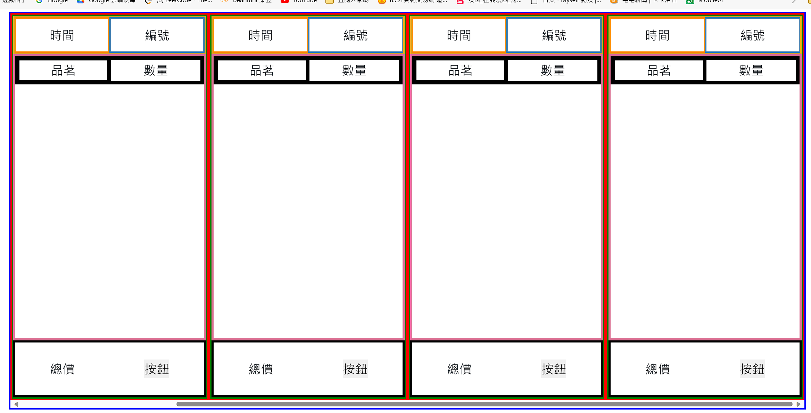
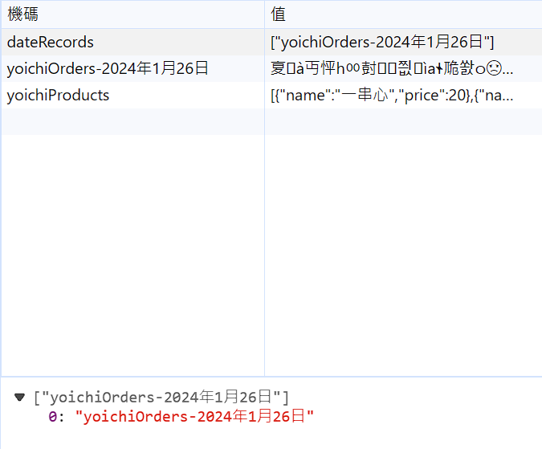
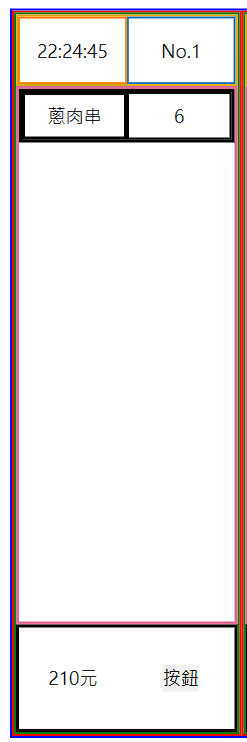
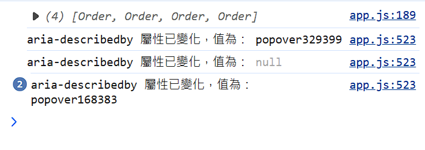
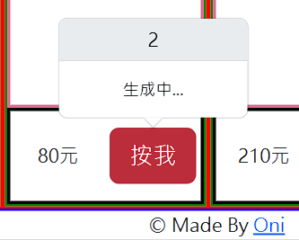
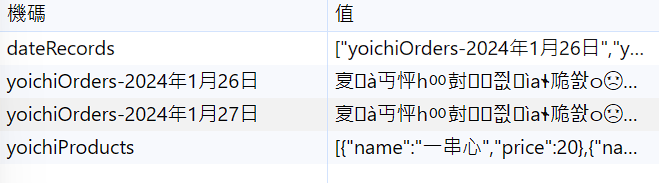

# 設計時應注意: ( 想到就補充 )

訂單資料不應該依賴 會受編輯而變動的 localStorage 的 yoichiProducts資料 

( 使用者更改、歷史才不會跟著變動)

因此頁面應該要 創建新的 ( 依賴yoichiProducts給的資料創建、但是獨立於yoichiProducts )

儲存到另一個kv 叫做 yoichiOrders 

生成之後就是獨立的個體戶

訂單修改的話 則依賴已經生成的內容yoichiOrders 內部資訊去改。

`yoichiOrders` 應該包含

- `order`
  
  - `raw_products_info`
    
    - 香腸 : 40
    
    - 蔥肉串 : 35
    
    - 豬肉串 : 40
    
    - 雞肉串 : 50
    
    - 特殊規則 : 蔥肉串 3隻 則 -5元 ，類推  ( 隨時可以取消 )
  
  - `details`
    
    - ( 產品名稱 ) : ( 數量 )
    
    - 香腸 : 3
    
    - 蔥肉串 : 2
    
    - 雞肉串 : 1
    
    - 總價 : 120+70+50=240 元
    
    - 日期 : 2024/1/2  18:20:00
    
    - 

---

# Section 1

## 關於解構、stringify

這邊使用了 destructuring assignment來快速解構

- 使用的方式如下

```js
  static historyRetrieve() {
    const data = JSON.parse(localStorage.getItem("yoichiProducts"));
    data.map(({ name, price }) => {
          new Product(name, Number(price));
    });
  }
  static historyUpdate() {
    localStorage.setItem("yoichiProducts", JSON.stringify(Product.products));
  }
  }
```

- 對應的舊方法

```js
data.map((obj) => {
      console.log(obj.name, obj.price);
    });
```

## 提醒未來要注意一下

1. 由於 historyRetrieve 有使用 new Product(name, Number(price));
   
   之後使用 變數創建new Product帶入的時候要小心 使用者輸入非數字、需要再那之前就先判斷他是否偷偷傳文字 而非數字。

# Section 2

## 小心事件監聽的重複附加

因為 updateDisplay 會更新並且重複執行 之前執行過的addEvenListener到 新和舊element

所以會導致重複附加

- 如下

- updateDisplay 內有以下
  
  - synchronizeEditModalContent
  
  - editProductDelete  ------------只需要跟modalEdit綁定一次就夠
  
  - editProductSavebtn  -----------只需要跟modalEdit綁定一次就夠
  
  - EditAppendFunctions

### modalEdit 內刪除跟保存   只需要綁定一次就好

這兩按鈕     不隨    畫面更新    而改變

```js
 // 針對畫面 all btEdits 增加監聽功能 ，modalEdit才能知道是誰被點取。
  function btnEditAppendFunctions(btnEdits) {
    btnEdits.forEach((btn, index) => {
      btn.addEventListener("click", (e) => {
        let parentElement = e.target.parentElement;
        // 跟sync 合併使用
        synchronizeEditModalContent(parentElement, index);
      });
    });
    // #yoichi-p-delete  這是modalEdit 刪除按鈕，只會有一個，欲知who被刪除直接參照modal內名稱跟價錢
    // 不要這樣用 updateDisplay()會重複呼叫!!!!!!!!!!!!!
    let btnDelete = document.querySelector("#yoichi-p-delete");
    editProductDelete(btnDelete);
    let btnSave = document.querySelector("#yoichi-p-editSave");
    editProductSave(btnSave);
  }
  let btnEdits = document.querySelectorAll(".yoichi-p-show-edit");
  btnEditAppendFunctions(btnEdits);
}
```

## 解決方法 兩個:

### 1. 先移除listener、將arrow function改為命名fn。

先移除 不會報錯、反而可以保證只會有一人負責監聽!

```js
  function editProductSave(btnSave) {
    // 請保持良好的實踐、每次先移除 (避免重複附加到既有element身上)
    btnSave.removeEventListener("click", editSaveListener);
    btnSave.addEventListener("click", function editSaveListener(e) {
      let modalEdit = document.querySelector("#yoichi-product-edit");

      modalEdit.classList.forEach((c) => {
```

### 2. IIFE

## 我決定給IIFE機會試試

section2 的版本是刷新show呈現會重複 綁定listener的、我不保留上面解決方法1的code、有興趣自己做，但是每次刷新都重新呼叫 這樣很吃資源!    


## 結論:失敗、除非放最外層只執行一次

IIFE 會被執行多次 ( 如果放在其他函數內 )  updateDisplay多次調用所以還是出bug

# Section3

其實2 那邊 有些應該寫到三來

## let var 區別⭐⭐⭐⭐⭐

> [JavaScript 立即調用函式 IIFE (Immediately Invoked Function Expression) 是什麼？優缺點是什麼？｜ExplainThis](https://www.explainthis.io/zh-hant/swe/what-is-iife) 

```js
for (var i = 1; i <= 5; i++) {
  setTimeout(function () {
    console.log(i);   // 全都是6
  }, 0);
}
for (let i = 1; i <= 5; i++) {
  setTimeout(function () {
    console.log(i);
  }, 0);    // 1 2 3 4 5 
}
```

### GPT :

在 JavaScript 中，使用 `var` 關鍵字聲明的變數具有函式作用域。在你的例子中，`setTimeout` 的回調函式不會立即執行，而是在循環結束後才會被調用。當它們被調用時，它們都會引用循環結束後的 `i` 變數。JavaScript 函式會保留它們創建時的作用域，因此所有的 `setTimeout` 共享相同的作用域和 `i` 變數。因此，當這些回調函式被執行時，它們引用的都是循環結束後的 `i`，導致輸出結果都是 6。使用 `let` 關鍵字可以避免這個問題，因為 `let` 声明的变量是具有块级作用域的，每次迭代都会创建一个新的 `i` 变量。

### IIFE 破解var

讓他內外不相干 ! 

```js
for (var i = 1; i <= 5; i++) {
  (function (i) {
    setTimeout(function () {
      console.log(i);
    }, i * 1000);
  })(i);
}
```

## 關於animationend我又再度忘了開watchSaas

e04 !

## 關於刪除後怪怪的: 不能只是移除

對於show-product 也就是display Area 的div form 區塊 那邊的edit-0  1 2 3要同步!

- 記得更改其他人的標籤  因為 [0,1,2] 如果 1拿走 則 畫面上會是edit-0,edit-2

- 2想再拿走 會失敗 因為 products[0,1]  編號是1 他找不到2 !!!!

## 改好了，完成功能了。 直接看commit就知。


## 還有一小bug 新增的商品 無法刪除

# section 4

- 新增功能  禁止現有商品名稱重複 

## splice bug 如果undefined🔥🔥🔥🔥

splice(i,1) 如果i undefined則會刪除

### 會被視為0 直接刪除索引0 明明未定義!

### 直接操作物件

```js
if (this.pickedNumber == "") {
      let i;
      PickedProduct.pickedProducts.forEach((e, index) => {
        if (e.pickedName == this.pickedName) {
          i = index;
        }
      });
      // 下面會直接刪除 第i個物件
      console.log("i=", i);
      // 下面如果 i undefined的時候則 直接刪除0
      PickedProduct.pickedProducts.splice(i, 1);
      console.log("要刪除了", this.pickedName, this.pickedNumber);
    }
```

## arr.map( ) 記得回傳否則無效💡💡💡

```js
  static historyRetrieve() {
    const data = JSON.parse(localStorage.getItem("yoichiProducts"));

    if (data == null || data.includes(null)) {
      console.log("沒歷史紀錄或短缺");

      console.log("localData=", data);
      return "沒歷史紀錄或短缺";
    }
    Product.products = [];
    data.map(({ name, price }) => {
      new Product(name, Number(price));
      // 這邊直接改變了所以才不用回傳! 💡💡💡💡💡💡💡
    });
  }
```

# section 5-1

## css 選擇棄，不同class但希望寫一起

希望同時兩種class被Sass使用，要用 逗號 `,` 分開 別忘了

## 希望按了btn後自動定位到顯示區塊

```js
setTimeout(() => {
  let targetElement = document.querySelector(".presentation-Area");
  targetElement.scrollIntoView({ behavior: "smooth", block: "start" });
}, 500);
```

## 顯示小提示文字


```html
<footer>
  © Made By
  <a href="mailto:qw28425382694@gmail.com" title="qw28425382694@gmail.com"
        >Oni</a>
</footer>
```

## 時間功能，之前有做格式了

### 格式Part

```js
function generateTime() {
  let now = new Date();

  // 日期部分
  let dateOptions = {
    year: "numeric",
    month: "long",
    day: "numeric",
    timeZone: "Asia/Taipei",
  };
  let dateStr = now.toLocaleDateString("zh-TW", dateOptions);

  // 時間部分
  let timeOptions = {
    hour: "numeric",
    minute: "numeric",
    second: "numeric",
    hour12: false,
    timeZone: "Asia/Taipei",
  };
  let timeStr = now.toLocaleTimeString("zh-TW", timeOptions);
  let hour = timeStr.substring(0, 2);
  let other = timeStr.substring(2);
  hour = Number(hour) % 24;
  timeStr = hour.toString().padStart(2, "0") + other;
  return { dateStr, timeStr };
}
```

### HTML 顯示時間 (菜單上)

setTimeout最好使用 ()=>{  triggerfunction()}

```js
class HTMLTime {
  static interval;
  constructor() {}
  static showTime() {
    let clock = document.querySelector(".yoichi-orderTime");
    let { timeStr, dateStr } = generateTime();
    clock.innerText = timeStr;
  }
  static showUp() {
    this.interval = setInterval(() => {
      this.showTime();
    }, 1000);
  }
  static vanish() {
    clearInterval(this.interval);
  }
}
HTMLTime.showUp();
setTimeout(() => {
  HTMLTime.vanish();
}, 5000);
```

## 畫面layout，訂單的part 製作完成

# section 5-2

## 動態新增後，顯示出明細

先思考Order的取得與顯示

發現現階段 訂單沒有按造日期 取得當日訂單的功能

希望 static orders=[]  儲存訂單的結構，改變一下，不同day的訂單，存到不同day去。

先去test做小測試，分析day 要怎麼拆解，然後依造day push & get。

---

改從 history 下手

## 文件太大 最好要做壓縮

```js
const LZString = require("lz-string");

const jsonData = [/* json放這 */ ];

// 將數據轉換為 JSON 字符串
const jsonString = JSON.stringify(jsonData);

// 計算原始大小
const originalSize = new TextEncoder().encode(jsonString).length;
console.log(`原始大小: ${originalSize} 字節`);

// 將 JSON 字符串進行壓縮
const compressedData = LZString.compress(jsonString);

// 計算壓縮後大小
const compressedSize = new TextEncoder().encode(compressedData).length;
console.log(`壓縮後大小: ${compressedSize} 字節`);

// 解壓縮數據
const decompressedData = LZString.decompress(compressedData);

console.log(decompressedData);
// 解壓縮後的 JSON 對象
const yourDecompressedData = JSON.parse(decompressedData);

// console.log(yourDecompressedData);
```

### getItem

```js
 //取回要取回當天的紀錄，如果有給date則取回那天的 (做出來但是工作區不會使用，歷史紀錄才會用到)
      data = JSON.parse(
        LZString.decompress(localStorage.getItem(`yoichiOrders-${dateStr}`))
      );
```

### setItem

```js
localStorage.setItem(
      `yoichiOrders-${dateStr}`,
      LZString.compress(JSON.stringify(Order.orders))
    );
```

# section 5-3

## 卡牌顯示訂單水平overflow效果

主要透過 shrink:0 、overflow-x、flex-wrap 達成

```scss
section.presentation-Area {
      position: relative;
      border: 2px blue solid;
      height: 95vh;
      width: 90vw;
      left: 2rem;
      margin-top: 4rem;
      display: flex;

      flex-wrap: nowrap;
      overflow-x: auto; /* 水平溢出滾動 */
      .yoichi-order-shown {
        border: 2px red solid;
        height: 100%;
        display: flex;
        flex-basis: 25%;
        flex-shrink: 0;
```



## 訂單使用 .innerHTML+ `` 設定更省力

```js
 yoichi_order_shown.innerHTML = `

          <div class="yoichi-card">
            <div class="yoichi-card-time-number">
              <div class="order-time"><p>${order.orderTime}</p></div>
              <div class="order-number"><p>${index}</p></div>
            </div>
            <div class="yoichi-card-order-detail">

                ${products}

            </div>
            <div class="yoichi-card-bottom">
              <div class="order-total-price">
                <p>總價</p>
              </div>
              <div class="order-buttonMotion">
                <button>按鈕</button>
              </div>
            </div>
          </div>
     `;
```

## 小改 historyRetrive邏輯，更通暢

如果取出 = null，避免像之前直接LZString分析。

改成直接說沒有，避免出錯。

## 插入順序 要在舊的之前的話

```js
  let shownExist = orderScreen.querySelector(".yoichi-order-shown");
    if (shownExist) {
      orderScreen.insertBefore(yoichi_order_shown, shownExist);
    } else {
      orderScreen.append(yoichi_order_shown);
    }
```

# section 5-4⚠️

## 增加紀錄 有訂單的日子，明天確認有沒有多⚠️，再添加LZ



## bug- 總價 顯示正確但訂單沒-5元⚠️



## 按鈕按下去後，跳三個選項

### 編輯訂單

### 已付款

### 完成訂單

## 監聽DOM元素是否多了屬性

### 廢棄了

```js
// 目標元素
const targetElement = document.querySelector('.yoichi-triplebtn');

// 監聽屬性變化
targetElement.addEventListener('DOMAttrModified', (event) => {
  if (event.attrName === 'aria-describedby' && event.newValue) {
    console.log('aria-describedby 屬性已變化，值為：', event.newValue);
    // 在這裡執行你的相應操作
  }
});

// 修改 aria-describedby 屬性
setTimeout(() => {
  targetElement.setAttribute('aria-describedby', 'popover803560');
}, 1000);
```

### 新方式

```js
const targetElement = document.querySelector('.yoichi-triplebtn');

const observer = new MutationObserver((mutations) => {
  mutations.forEach((mutation) => {
    if (mutation.type === 'attributes' && mutation.attributeName === 'aria-describedby') {
      console.log('aria-describedby 屬性已變化，值為：', targetElement.getAttribute('aria-describedby'));
      // 在這裡執行你的相應操作
    }
  });
});

observer.observe(targetElement, { attributes: true });

// 修改 aria-describedby 屬性
setTimeout(() => {
  targetElement.setAttribute('aria-describedby', 'popover803560');
}, 1000);
```

### 套用效果


```js
 let btns = orderScreen.querySelectorAll(".yoichi-triplebtn");
    btns.forEach((btn) => {
      let observer = new MutationObserver((mutations) => {
        mutations.forEach((mutation) => {
          if (
            mutation.type === "attributes" &&
            mutation.attributeName === "aria-describedby"
          ) {
            console.log(
              "aria-describedby 屬性已變化，值為：",
              btn.getAttribute("aria-describedby")
            );
            // 在這裡執行你的相應操作
          }
        });
      });

      observer.observe(btn, { attributes: true });
```





## 變日，嚇一跳，確實可以使用


