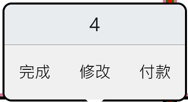
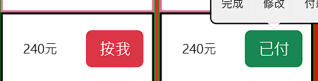
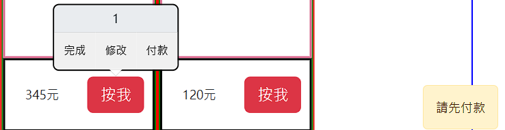
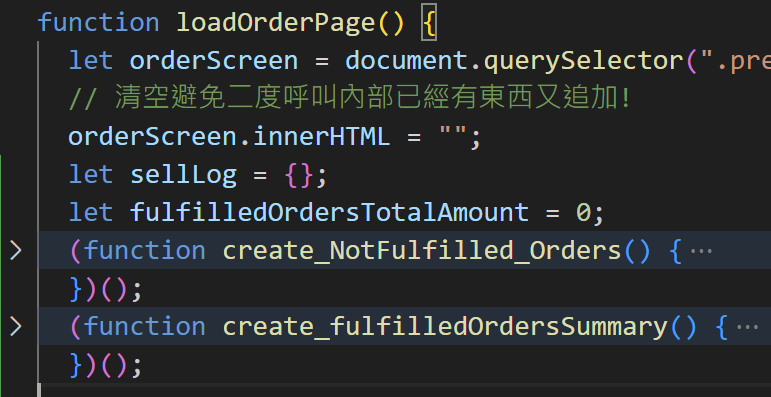
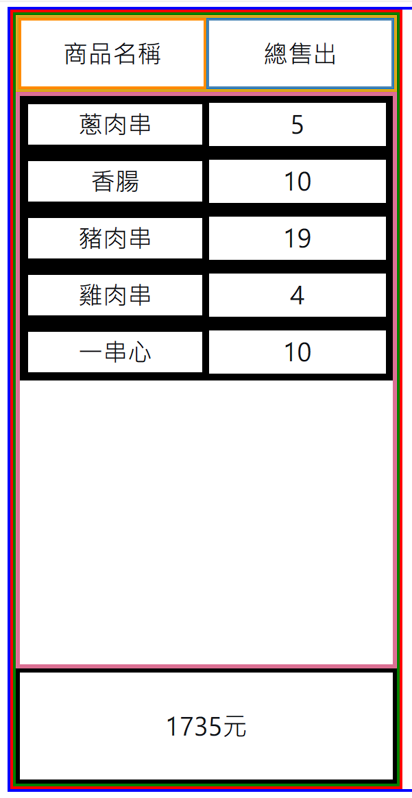

# 設計時應注意: ( 想到就補充 )

訂單資料不應該依賴 會受編輯而變動的 localStorage 的 yoichiProducts資料 

( 使用者更改、歷史才不會跟著變動)

因此頁面應該要 創建新的 ( 依賴yoichiProducts給的資料創建、但是獨立於yoichiProducts )

儲存到另一個kv 叫做 yoichiOrders 

生成之後就是獨立的個體戶

訂單修改的話 則依賴已經生成的內容yoichiOrders 內部資訊去改。

`yoichiOrders` 應該包含

- `order`
  
  - `raw_products_info`
    
    - 香腸 : 40
    
    - 蔥肉串 : 35
    
    - 豬肉串 : 40
    
    - 雞肉串 : 50
    
    - 特殊規則 : 蔥肉串 3隻 則 -5元 ，類推  ( 隨時可以取消 )
  
  - `details`
    
    - ( 產品名稱 ) : ( 數量 )
    
    - 香腸 : 3
    
    - 蔥肉串 : 2
    
    - 雞肉串 : 1
    
    - 總價 : 120+70+50=240 元
    
    - 日期 : 2024/1/2  18:20:00
    
    - 

---

# Section 1

## 關於解構、stringify

這邊使用了 destructuring assignment來快速解構

- 使用的方式如下

```js
  static historyRetrieve() {
    const data = JSON.parse(localStorage.getItem("yoichiProducts"));
    data.map(({ name, price }) => {
          new Product(name, Number(price));
    });
  }
  static historyUpdate() {
    localStorage.setItem("yoichiProducts", JSON.stringify(Product.products));
  }
  }
```

- 對應的舊方法

```js
data.map((obj) => {
      console.log(obj.name, obj.price);
    });
```

## 提醒未來要注意一下

1. 由於 historyRetrieve 有使用 new Product(name, Number(price));
   
   之後使用 變數創建new Product帶入的時候要小心 使用者輸入非數字、需要再那之前就先判斷他是否偷偷傳文字 而非數字。

# Section 2

## 小心事件監聽的重複附加

因為 updateDisplay 會更新並且重複執行 之前執行過的addEvenListener到 新和舊element

所以會導致重複附加

- 如下

- updateDisplay 內有以下
  
  - synchronizeEditModalContent
  
  - editProductDelete  ------------只需要跟modalEdit綁定一次就夠
  
  - editProductSavebtn  -----------只需要跟modalEdit綁定一次就夠
  
  - EditAppendFunctions

### modalEdit 內刪除跟保存   只需要綁定一次就好

這兩按鈕     不隨    畫面更新    而改變

```js
 // 針對畫面 all btEdits 增加監聽功能 ，modalEdit才能知道是誰被點取。
  function btnEditAppendFunctions(btnEdits) {
    btnEdits.forEach((btn, index) => {
      btn.addEventListener("click", (e) => {
        let parentElement = e.target.parentElement;
        // 跟sync 合併使用
        synchronizeEditModalContent(parentElement, index);
      });
    });
    // #yoichi-p-delete  這是modalEdit 刪除按鈕，只會有一個，欲知who被刪除直接參照modal內名稱跟價錢
    // 不要這樣用 updateDisplay()會重複呼叫!!!!!!!!!!!!!
    let btnDelete = document.querySelector("#yoichi-p-delete");
    editProductDelete(btnDelete);
    let btnSave = document.querySelector("#yoichi-p-editSave");
    editProductSave(btnSave);
  }
  let btnEdits = document.querySelectorAll(".yoichi-p-show-edit");
  btnEditAppendFunctions(btnEdits);
}
```

## 解決方法 兩個:

### 1. 先移除listener、將arrow function改為命名fn。

先移除 不會報錯、反而可以保證只會有一人負責監聽!

```js
  function editProductSave(btnSave) {
    // 請保持良好的實踐、每次先移除 (避免重複附加到既有element身上)
    btnSave.removeEventListener("click", editSaveListener);
    btnSave.addEventListener("click", function editSaveListener(e) {
      let modalEdit = document.querySelector("#yoichi-product-edit");

      modalEdit.classList.forEach((c) => {
```

### 2. IIFE

## 我決定給IIFE機會試試

section2 的版本是刷新show呈現會重複 綁定listener的、我不保留上面解決方法1的code、有興趣自己做，但是每次刷新都重新呼叫 這樣很吃資源!    


## 結論:失敗、除非放最外層只執行一次

IIFE 會被執行多次 ( 如果放在其他函數內 )  updateDisplay多次調用所以還是出bug

# Section3

其實2 那邊 有些應該寫到三來

## let var 區別⭐⭐⭐⭐⭐

> [JavaScript 立即調用函式 IIFE (Immediately Invoked Function Expression) 是什麼？優缺點是什麼？｜ExplainThis](https://www.explainthis.io/zh-hant/swe/what-is-iife) 

```js
for (var i = 1; i <= 5; i++) {
  setTimeout(function () {
    console.log(i);   // 全都是6
  }, 0);
}
for (let i = 1; i <= 5; i++) {
  setTimeout(function () {
    console.log(i);
  }, 0);    // 1 2 3 4 5 
}
```

### GPT :

在 JavaScript 中，使用 `var` 關鍵字聲明的變數具有函式作用域。在你的例子中，`setTimeout` 的回調函式不會立即執行，而是在循環結束後才會被調用。當它們被調用時，它們都會引用循環結束後的 `i` 變數。JavaScript 函式會保留它們創建時的作用域，因此所有的 `setTimeout` 共享相同的作用域和 `i` 變數。因此，當這些回調函式被執行時，它們引用的都是循環結束後的 `i`，導致輸出結果都是 6。使用 `let` 關鍵字可以避免這個問題，因為 `let` 声明的变量是具有块级作用域的，每次迭代都会创建一个新的 `i` 变量。

### IIFE 破解var

讓他內外不相干 ! 

```js
for (var i = 1; i <= 5; i++) {
  (function (i) {
    setTimeout(function () {
      console.log(i);
    }, i * 1000);
  })(i);
}
```

## 關於animationend我又再度忘了開watchSaas

e04 !

## 關於刪除後怪怪的: 不能只是移除

對於show-product 也就是display Area 的div form 區塊 那邊的edit-0  1 2 3要同步!

- 記得更改其他人的標籤  因為 [0,1,2] 如果 1拿走 則 畫面上會是edit-0,edit-2

- 2想再拿走 會失敗 因為 products[0,1]  編號是1 他找不到2 !!!!

## 改好了，完成功能了。 直接看commit就知。


## 還有一小bug 新增的商品 無法刪除

# section 4

- 新增功能  禁止現有商品名稱重複 

## splice bug 如果undefined🔥🔥🔥🔥

splice(i,1) 如果i undefined則會刪除

### 會被視為0 直接刪除索引0 明明未定義!

### 直接操作物件

```js
if (this.pickedNumber == "") {
      let i;
      PickedProduct.pickedProducts.forEach((e, index) => {
        if (e.pickedName == this.pickedName) {
          i = index;
        }
      });
      // 下面會直接刪除 第i個物件
      console.log("i=", i);
      // 下面如果 i undefined的時候則 直接刪除0
      PickedProduct.pickedProducts.splice(i, 1);
      console.log("要刪除了", this.pickedName, this.pickedNumber);
    }
```

## arr.map( ) 記得回傳否則無效💡💡💡

```js
  static historyRetrieve() {
    const data = JSON.parse(localStorage.getItem("yoichiProducts"));

    if (data == null || data.includes(null)) {
      console.log("沒歷史紀錄或短缺");

      console.log("localData=", data);
      return "沒歷史紀錄或短缺";
    }
    Product.products = [];
    data.map(({ name, price }) => {
      new Product(name, Number(price));
      // 這邊直接改變了所以才不用回傳! 💡💡💡💡💡💡💡
    });
  }
```

# section 5-1

## css 選擇棄，不同class但希望寫一起

希望同時兩種class被Sass使用，要用 逗號 `,` 分開 別忘了

## 希望按了btn後自動定位到顯示區塊

```js
setTimeout(() => {
  let targetElement = document.querySelector(".presentation-Area");
  targetElement.scrollIntoView({ behavior: "smooth", block: "start" });
}, 500);
```

## 顯示小提示文字


```html
<footer>
  © Made By
  <a href="mailto:qw28425382694@gmail.com" title="qw28425382694@gmail.com"
        >Oni</a>
</footer>
```

## 時間功能，之前有做格式了

### 格式Part

```js
function generateTime() {
  let now = new Date();

  // 日期部分
  let dateOptions = {
    year: "numeric",
    month: "long",
    day: "numeric",
    timeZone: "Asia/Taipei",
  };
  let dateStr = now.toLocaleDateString("zh-TW", dateOptions);

  // 時間部分
  let timeOptions = {
    hour: "numeric",
    minute: "numeric",
    second: "numeric",
    hour12: false,
    timeZone: "Asia/Taipei",
  };
  let timeStr = now.toLocaleTimeString("zh-TW", timeOptions);
  let hour = timeStr.substring(0, 2);
  let other = timeStr.substring(2);
  hour = Number(hour) % 24;
  timeStr = hour.toString().padStart(2, "0") + other;
  return { dateStr, timeStr };
}
```

### HTML 顯示時間 (菜單上)

setTimeout最好使用 ()=>{  triggerfunction()}

```js
class HTMLTime {
  static interval;
  constructor() {}
  static showTime() {
    let clock = document.querySelector(".yoichi-orderTime");
    let { timeStr, dateStr } = generateTime();
    clock.innerText = timeStr;
  }
  static showUp() {
    this.interval = setInterval(() => {
      this.showTime();
    }, 1000);
  }
  static vanish() {
    clearInterval(this.interval);
  }
}
HTMLTime.showUp();
setTimeout(() => {
  HTMLTime.vanish();
}, 5000);
```

## 畫面layout，訂單的part 製作完成

# section 5-2

## 動態新增後，顯示出明細

先思考Order的取得與顯示

發現現階段 訂單沒有按造日期 取得當日訂單的功能

希望 static orders=[]  儲存訂單的結構，改變一下，不同day的訂單，存到不同day去。

先去test做小測試，分析day 要怎麼拆解，然後依造day push & get。

---

改從 history 下手

## 文件太大 最好要做壓縮

```js
const LZString = require("lz-string");

const jsonData = [/* json放這 */ ];

// 將數據轉換為 JSON 字符串
const jsonString = JSON.stringify(jsonData);

// 計算原始大小
const originalSize = new TextEncoder().encode(jsonString).length;
console.log(`原始大小: ${originalSize} 字節`);

// 將 JSON 字符串進行壓縮
const compressedData = LZString.compress(jsonString);

// 計算壓縮後大小
const compressedSize = new TextEncoder().encode(compressedData).length;
console.log(`壓縮後大小: ${compressedSize} 字節`);

// 解壓縮數據
const decompressedData = LZString.decompress(compressedData);

console.log(decompressedData);
// 解壓縮後的 JSON 對象
const yourDecompressedData = JSON.parse(decompressedData);

// console.log(yourDecompressedData);
```

### getItem

```js
 //取回要取回當天的紀錄，如果有給date則取回那天的 (做出來但是工作區不會使用，歷史紀錄才會用到)
      data = JSON.parse(
        LZString.decompress(localStorage.getItem(`yoichiOrders-${dateStr}`))
      );
```

### setItem

```js
localStorage.setItem(
      `yoichiOrders-${dateStr}`,
      LZString.compress(JSON.stringify(Order.orders))
    );
```

# section 5-3

## 卡牌顯示訂單水平overflow效果

主要透過 shrink:0 、overflow-x、flex-wrap 達成

```scss
section.presentation-Area {
      position: relative;
      border: 2px blue solid;
      height: 95vh;
      width: 90vw;
      left: 2rem;
      margin-top: 4rem;
      display: flex;

      flex-wrap: nowrap;
      overflow-x: auto; /* 水平溢出滾動 */
      .yoichi-order-shown {
        border: 2px red solid;
        height: 100%;
        display: flex;
        flex-basis: 25%;
        flex-shrink: 0;
```


## 訂單使用 .innerHTML+ `` 設定更省力

```js
 yoichi_order_shown.innerHTML = `

          <div class="yoichi-card">
            <div class="yoichi-card-time-number">
              <div class="order-time"><p>${order.orderTime}</p></div>
              <div class="order-number"><p>${index}</p></div>
            </div>
            <div class="yoichi-card-order-detail">

                ${products}

            </div>
            <div class="yoichi-card-bottom">
              <div class="order-total-price">
                <p>總價</p>
              </div>
              <div class="order-buttonMotion">
                <button>按鈕</button>
              </div>
            </div>
          </div>
     `;
```

## 小改 historyRetrive邏輯，更通暢

如果取出 = null，避免像之前直接LZString分析。

改成直接說沒有，避免出錯。

## 插入順序 要在舊的之前的話

```js
  let shownExist = orderScreen.querySelector(".yoichi-order-shown");
    if (shownExist) {
      orderScreen.insertBefore(yoichi_order_shown, shownExist);
    } else {
      orderScreen.append(yoichi_order_shown);
    }
```

# section 5-4⚠️

## 增加紀錄 有訂單的日子，明天確認有沒有多⚠️，再添加LZ


## bug- 總價 顯示正確但訂單沒-5元⚠️


## 按鈕按下去後，跳三個選項

### 編輯訂單

### 已付款

### 完成訂單

## 監聽DOM元素是否多了屬性

### 廢棄了

```js
// 目標元素
const targetElement = document.querySelector('.yoichi-triplebtn');

// 監聽屬性變化
targetElement.addEventListener('DOMAttrModified', (event) => {
  if (event.attrName === 'aria-describedby' && event.newValue) {
    console.log('aria-describedby 屬性已變化，值為：', event.newValue);
    // 在這裡執行你的相應操作
  }
});

// 修改 aria-describedby 屬性
setTimeout(() => {
  targetElement.setAttribute('aria-describedby', 'popover803560');
}, 1000);
```

### 新方式

```js
const targetElement = document.querySelector('.yoichi-triplebtn');

const observer = new MutationObserver((mutations) => {
  mutations.forEach((mutation) => {
    if (mutation.type === 'attributes' && mutation.attributeName === 'aria-describedby') {
      console.log('aria-describedby 屬性已變化，值為：', targetElement.getAttribute('aria-describedby'));
      // 在這裡執行你的相應操作
    }
  });
});

observer.observe(targetElement, { attributes: true });

// 修改 aria-describedby 屬性
setTimeout(() => {
  targetElement.setAttribute('aria-describedby', 'popover803560');
}, 1000);
```

### 套用效果

```js
 let btns = orderScreen.querySelectorAll(".yoichi-triplebtn");
    btns.forEach((btn) => {
      let observer = new MutationObserver((mutations) => {
        mutations.forEach((mutation) => {
          if (
            mutation.type === "attributes" &&
            mutation.attributeName === "aria-describedby"
          ) {
            console.log(
              "aria-describedby 屬性已變化，值為：",
              btn.getAttribute("aria-describedby")
            );
            // 在這裡執行你的相應操作
          }
        });
      });

      observer.observe(btn, { attributes: true });
```


- 套用 MutationObserver 後 就不需要等待了，自動出現

## 變日，嚇一跳，確實可以使用


# section 6-1

## 思考流程1/27

今天按鈕 應該怎麼賦予功能



### 1.付款後 修改只能廢棄訂單 ( 追加必須重新製作訂單 )

### 2.付款按下去後 才能按完成 ( ok )

---

---

## ⚠️popover要focus 才行 避免出錯 (新增訂單圖層跑掉)

## 讓訂單按下去有手感

```scss
  .paidOrder {
    flex-basis: 33%;
    height: 100%;
    display: flex;
    align-items: center;
    justify-content: center;
    flex-grow: 1;
    border-radius: 0 0 12% 0;
    button {
      border-radius: 0 0 12% 0;
      height: 100%;
      width: 100%;
      &:active {
        transform: translateY(1px); /* 向下移動 2px，模擬按下效果 */
        box-shadow: 0 0 5px rgba(0, 0, 0, 0.3); /* 添加一點陰影效果 */
      }
    }
  }
```

## 大錯誤 loadOrderPage() 裡面{}給錯範圍

```js
function loadOrderPage() {
  let orderScreen = document.querySelector(".presentation-Area");
  // 清空避免二度呼叫內部已經有東西又追加!
  orderScreen.innerHTML = "";
  Order.orders.forEach((order, index) => {
    let products 


  });
  // 替.popover-body 裡面增加元素，然後flex，放三個按鈕!
  let btns = orderScreen.querySelectorAll(".yoichi-triplebtn");
  console.log(btns);
  btns.forEach((btn, index) => {
```

 不小心把 btns也包含進去 導致重複製作 觀察器!

```batch
製作中 0
app.js:495 製作中 1
app.js:495 製作中 0
app.js:495 製作中 1
app.js:495 製作中 2
app.js:495 製作中 0
app.js:495 製作中 1
app.js:495 製作中 2
app.js:495 製作中 3
app.js:495 製作中 0
app.js:495 製作中 1
app.js:495 製作中 2
app.js:495 製作中 3
app.js:495 製作中 4
```

## 要立刻保存狀態否則f5就沒了

```js
paidBtn.addEventListener("click", (e) => {
              console.log("paidBtn數字是" + header_num);
              // 去修改對應編號的 order 狀態為 paid
              Order.orders[header_num].status = "paid";
              document.querySelector(`[data-bs-title="${header_num}"]`).click();
              Order.historyUpdate(); //保存狀態否則畫面f5刷新就沒了
              loadOrderPage();
            });
```



# section 6-2

## fulfilled的對象就離場不需列出

```js
     if (order.status == "paid") {
      btnMsg = "已付";
      btnColor = "success";
    }
    if (order.status == "fulfilled") {
      return; //直接跳過，不創建該訂單了
    }


           fulfillBtn.addEventListener("click", (e) => {
              console.log("fulfillBtn數字是" + header_num);
              // 去修改對應編號的 order 狀態為 fulfill
              if (Order.orders[header_num].status == "paid") {
                // 已經付錢，直接修改狀態，然後刷新，讓訂單離場
                Order.orders[header_num].status = "fulfilled";
                document
                  .querySelector(`[data-bs-title="${header_num}"]`)
                  .click();
                Order.historyUpdate(); //保存狀態否則畫面f5刷新就沒了
                loadOrderPage();
              } else {
                // 不可以跳過付錢的警告
              }
           });
```

## 💡考慮要不要做空白訂單 ( 顯示銷售總數 跟總金額 +訂單筆數 )

## 增加訂單的 + 滑動錯誤⭐⭐⭐

---

### stack-overflow answer⭐⭐

在代碼的這一部分

```javascript
<a
    className="btn btn-primary"
    data-bs-toggle="modal"
    onClick={handleClick}
    role="button"
  >
```

您添加了`data-bs-toggle`⭐

而且你的`handleClick`⭐

```javascript
const modal = Modal.getOrCreateInstance(modalElement);
modal.show();
```

**這兩者不能一起工作**

如果您從“A”標籤中刪除，則問題將得到解決。`data-bs-toggle="modal"`

因為你的函數中已經有模態動作了`handleClick`

要刪除 **data-bs-toggle** 因為這出錯的

```html
    <aside class="floating-element">
      <button
        type="button"
        class="newOrderBtn btn btn-primary"
        data-bs-toggle="modal"
        data-bs-target="#Modal-add-product"
      >
        +
      </button>
```

```batch
modal.js:158  Uncaught TypeError: Cannot read properties of undefined (reading 'backdrop')
    at On._initializeBackDrop (modal.js:158:39)
    at new On (modal.js:69:27)
    at On.getOrCreateInstance (base-component.js:65:41)
    at HTMLButtonElement.<anonymous> (modal.js:363:22)
    at HTMLDocument.n (event-handler.js:118:19)
```

## 訂單請先付款才能完成 (fulfill) (顯示警告)



```js
fulfillBtn.addEventListener("click", (e) => {
              console.log("fulfillBtn數字是" + header_num);
              // 去修改對應編號的 order 狀態為 fulfill
              if (Order.orders[header_num].status == "paid") {
                // 已經付錢，直接修改狀態，然後刷新，讓訂單離場
                Order.orders[header_num].status = "fulfilled";
                document
                  .querySelector(`[data-bs-title="${header_num}"]`)
                  .click();
                Order.historyUpdate(); //保存狀態否則畫面f5刷新就沒了
                loadOrderPage();
              } else {
                // 不可以跳過付錢的警告
                (function showWarn() {
                  let body = document.querySelector("body");
                  let warn = document.createElement("div");
                  // <div class="successSend alert alert-warning" role="alert">新增成功</div>
                  warn.innerText = "請先付款";
                  warn.className = "noSend alert alert-warning";
                  warn.setAttribute("role", "alert");
                  body.append(warn);
                  warn.addEventListener("animationend", (e) => {
                    e.target.remove();
                  });
                  warn.style.animation =
                    "opacityTransitions 2.1s ease forwards";
                })();
              }
            });
          }
```

## 還是讓按鈕有專注功能避免完成出現鬼影

```js
data-bs-trigger="focus"


<div class="order-buttonMotion">
                <button type="button" data-bs-trigger="focus" data-bs-custom-class="custom-popover" data-bs-placement="top"  class="yoichi-triplebtn btn btn-lg btn-${btnColor}" data-bs-toggle="popover" data-bs-title="${index}" data-bs-content="生成中...">${btnMsg}</button>

              </div>
```

## 確定做空白訂單 ( 顯示銷售總數 跟總金額 +訂單筆數 )

方法: 訂單全部先出現後，最後再去 新增統計的 假訂單在最前面的位置

品名       數量

豬肉串    11

香腸         8

..

..

..

收入 2500元    之類

### 動了兩處，順便把他們淨空比較好查看邏輯





# section 6-3

## revise 按鈕的修改訂單功能

之前有寫displayProducts 現在只要透過他就可以顯示歷史productsLog 然後order商品數量、總價

```js
reviseBtn.addEventListener("click", (e) => {
        console.log("reviseBtn數字是" + header_num);
        // 去顯示訂單修改畫面出來
        // 已經付款的 只能廢棄訂單 (跳出提示)
        displayProducts("revise", header_num);
});
```

## 已經付款的 revise 只能廢棄訂單 (按鈕提示不可修改)

## displayProducts修改商品重新呈現(累加HTMLbug)

- 每次 forEach..... append之前都先清空，避開bug

```js
let block = document.querySelector(".cal-Area form");
  block.innerHTML = `<section class="yoichi-block yoichi-block-title">
            <div class="yoichi-p-name">商品名稱</div>
            <div class="yoichi-p-number">數量</div>
            <div class="yoichi-p-btns">操作</div>
          </section>`;
  Product.products.forEach((product, index) => {
```

## numberBtnsAppendFunction放入displayProducts

否則info="revise" 產生的按鈕會失去功能，也不會計價

另外必須要產生商品跟數量跟操作後，自動計價看看

避免 revise 預設有商品數量 但不是透過btn 所以不會計價的問題!

```js
block.append(section);
  });
  // 先計算看看 (因為如果是修改的商品預設的數量 並非由按鈕觸發(不會run計算calculateAll))
  calculateAll();
  (function numberBtnsAppendFunction() {
```

## displayProducts  new及revise 輔助參數設定，避免pickedProducts出錯

💡**pickedProducts 為了方便 calculateAll 計算** 💡

```js
function displayProducts(info, oid) {
  let productsInfo;
  if (info == "new") {
    Product.historyRetrieve(); //依照最新設定顯示
    // 訂單編號要自動推算
    document.querySelector(".yoichi-orderNumber").innerText =
      Order.orders.length;
    PickedProduct.pickedProducts = [];
  } else if (info == "revise") {
    // 如果要求顯示舊訂單則依log去顯示
    // Product.products = Order.orders[oid].productsLog;
    Order.historyRetrieve(); // 這邊就接著之後更改Product.products使用特定Order的 productsLog 歷史紀錄囉
    // 後續不可以Product.historyupdate覆蓋，會覆蓋商家的最新編輯售價
    // 送出修改之後，重新diplayProducts("new")
    // HTMLTime要停止 、改成訂單產生的時間
    console.log("修改中");
    Product.products = Order.orders[oid].productsLog;
    PickedProduct.pickedProducts = Order.orders[oid].details;
    // 改變按鈕 【送出】 => 【修改】
  }
```

## revise按下後應該自動往上視窗

```js
 reviseBtn.addEventListener("click", (e) => {
              console.log("reviseBtn數字是" + header_num);
              // 去顯示訂單修改畫面出來
              // 已經付款的 只能廢棄訂單 (跳出提示)
              displayProducts("revise", header_num);
              // 應該要自動往上
              let header = document.querySelector("header");
              console.log("滑動中");
              header.scrollIntoView({
                behavior: "instant",
                block: "start",
              });
            });
```

## info=="revise" 內，時間跟編號要改設定

## 修改 addNewOrderBtn內部不再使用clearScreen，直接displayProducts("new") 全部刷新，覆蓋修改中的

```js
(function addNewOrderBtn() {
  let btn = document.querySelector(".newOrderBtn");
  btn.addEventListener("click", (e) => {
    try {
      let header = document.querySelector("header");
      console.log("滑動中");
      header.scrollIntoView({
        behavior: "instant",
        block: "start",
      });
      (function resetCart() {
        let resetOrderBtn = document.querySelector(".yoichi-order-revise");
        if (resetOrderBtn != null) {
          resetOrderBtn.classList.add("yoichi-order-create");
          resetOrderBtn.classList.remove("yoichi-order-revise");
        }
        displayProducts("new");
      })();
    } catch (e) {
      console.log(e, "錯誤");
    }
  });
})();
```

## createOrderBtn 改成 sendOrderBtn，應該可IIFE，另外也在按扭上先確認class包含create或者revise來確認動作

```js
function sendOrderBtn() {
  let btnSend = document.querySelector(".yoichi-order-create");
  if (btnSend == null) return;
  btnSend.addEventListener("click", (e) => {
    if (e.target.classList.contains("yoichi-order-create")) {
```

## 修改訂單之前，先去把revise的畫面時間處理(停止+改變為old訂單生成時間)

```js
   } else if (info == "revise") {
    // 如果要求顯示舊訂單則依log去顯示
    // Product.products = Order.orders[oid].productsLog;
    Order.historyRetrieve(); // 這邊就接著之後更改Product.products使用特定Order的 productsLog 歷史紀錄囉
    // 後續不可以Product.historyupdate覆蓋，會覆蓋商家的最新編輯售價
    // 送出修改之後，重新diplayProducts("new")
    // HTMLTime要停止 、改成訂單產生的時間
    console.log("修改中");
    Product.products = Order.orders[oid].productsLog;
    PickedProduct.pickedProducts = Order.orders[oid].details;
    // 改變按鈕 【送出】 => 【修改】 如果null代表找不到，那一定跟上一個訂單有關
    let reviseOrderBtn = document.querySelector(".yoichi-order-create");
    if (reviseOrderBtn != null) {
      reviseOrderBtn.classList.add("yoichi-order-revise");
      reviseOrderBtn.classList.remove("yoichi-order-create");
    }
    // 改訂單編號
    document.querySelector(".yoichi-orderNumber").innerText = oid;
    HTMLTime.t_vanish();
    document.querySelector(".yoichi-orderTime").innerText =
      Order.orders[oid].orderTime;
  }
```

## 預設叫做生成訂單，修改狀態要叫修改，info=='revise'那邊做設定。

```js
 if (reviseOrderBtn != null) {
      reviseOrderBtn.classList.add("yoichi-order-revise");
      reviseOrderBtn.classList.remove("yoichi-order-create");
    }
    // 改內容文字
    document.querySelector(".yoichi-order-revise").innerText = "修改";
```

## 如果有paid就顯示不可改

## 修改後移動到顯示區

## 小小修改，生成btn的class、按鈕內文字統一由display new revise發包

# section 6-4

## new的時候，模擬鎖改成文字'新訂單'

```js
 document.querySelector(".yoichi-tiptool").innerHTML = "<p>新單</p>";
  } else if (info == "revise") {
```

## 忘記顯示生成，雖然有移除immutable-order，小改。

```js
  } else if (info == "revise") {
    // 如果要求顯示舊訂單則依log去顯示
    // Product.products = Order.orders[oid].productsLog;
    Order.historyRetrieve(); // 這邊就接著之後更改Product.products使用特定Order的 productsLog 歷史紀錄囉
    // 後續不可以Product.historyupdate覆蓋，會覆蓋商家的最新編輯售價
    // 送出修改之後，重新diplayProducts("new")
    // HTMLTime要停止 、改成訂單產生的時間
    Product.products = Order.orders[oid].productsLog;
    PickedProduct.pickedProducts = Order.orders[oid].details;
    // 改變按鈕 【送出】 => 【修改】 如果null代表找不到，那一定跟上一個訂單有關
    let reviseOrderBtn = document.querySelector(".yoichi-order-send");
    reviseOrderBtn.classList.add("yoichi-order-revise");
    reviseOrderBtn.classList.remove("yoichi-order-create");
    reviseOrderBtn.classList.remove("immutable-order");
    reviseOrderBtn.innerText = "生成";
```

## revise或者revise+paid的時候，顯示作廢按扭

```js
    if (Order.orders[oid].status == "paid") {
      // 改內容文字
      let btn = document.querySelector(".yoichi-order-revise");
      btn.innerText = "不可修改"; //要二度確認作廢與否
      btn.classList.add("immutable-order"); //如果偵測到就使用廢棄的方式
    }

    (function deprecatedBtnTooltip() {
      let div_deprecate = document.querySelector(".yoichi-tiptool");
      div_deprecate.innerHTML = "";
      let deprecatedBtn = document.createElement("button");
      deprecatedBtn.classList.add("yoichi-deprecatedBtn");
      deprecatedBtn.innerHTML = "作廢";
      div_deprecate.append(deprecatedBtn);
    })();  })();
```

## 作廢按扭按下去訂單作廢

```js
(function deprecatedBtnTooltip() {
      let div_deprecate = document.querySelector(".yoichi-tiptool");
      div_deprecate.innerHTML = "";
      let deprecatedBtn = document.createElement("button");
      deprecatedBtn.classList.add("yoichi-deprecatedBtn");
      deprecatedBtn.innerHTML = "作廢";
      div_deprecate.append(deprecatedBtn);
      deprecatedBtn.addEventListener("click", (e) => {
        // 顯示是否作廢 (防止按錯)
        let confirmed = window.confirm("確定要作廢?");
        if (confirmed) {
          Order.orders[oid].status = "deprecated";
          Order.historyUpdate();
          alert("成功作廢!");
          displayProducts("new");
          loadOrderPage();
        }
      });
    })();
```

```batch
mongodb+srv://yee885495:<password>@cluster0.cjbwlxs.mongodb.net/?retryWrites=true&w=majority
```

# 7-1

## 發現bug ，先修改，付款後，沒有更新上面的displayProduct畫面，清空付款會消失商品但錢沒被改

付款有bug!!!

修改中付款 會直接結算(變更)

## 因為被同步操作，我們使用Order.orders[i]的引用，所以出錯。

pickedProducts 如果被移除陣列，會真的影響到Order.orders[oid].details  !!!

```js
 PickedProduct.pickedProducts = Order.orders[oid].details;
    // 改變按鈕 【送出】 => 【修改】 如果null代表找不到，那一定跟上一個訂單有關
    let reviseOrderBtn = document.querySelector(".yoichi-order-send");
    reviseOrderBtn.classList.add("yoichi-order-revise");
    reviseOrderBtn.classList.remove("yoichi-order-create");
    reviseOrderBtn.classList.remove("immutable-order");
    reviseOrderBtn.innerText = "修改";

    if (Order.orders[oid].status == "paid") {
```

## 之所以按了 paid才發現錯誤是因為，他會更新畫面(其實早就錯了)

## 請善用深度複製，避免誤傷引用!!!!

```js
    Product.products = Order.orders[oid].productsLog;
    PickedProduct.pickedProducts = Order.orders[oid].details;
```

```js
// 深拷貝 Product.products
    Product.products = JSON.parse(
      JSON.stringify(Order.orders[oid].productsLog)
    );

    // 深拷貝 PickedProduct.pickedProducts
    PickedProduct.pickedProducts = JSON.parse(
      JSON.stringify(Order.orders[oid].details)
    );
```

## 深度複製搞定就剩這個，如果fulfill、pay就順便displayupdate('new')，編輯到一半付錢或者完成訂單，視同放棄displayProducts編輯區，避開bug。

```js
 paidBtn.addEventListener("click", (e) => {
              console.log("paidBtn數字是" + header_num);
              // 去修改對應編號的 order 狀態為 paid
              Order.orders[header_num].status = "paid";
              document.querySelector(`[data-bs-title="${header_num}"]`).click();
              Order.historyUpdate(); //保存狀態否則畫面f5刷新就沒了
              console.log(Order.orders[header_num]);
              displayProducts("new"); //編輯到一半付錢就視同放棄修改

              loadOrderPage();
            });
```

```js
 fulfillBtn.addEventListener("click", (e) => {
              console.log("fulfillBtn數字是" + header_num);
              // 去修改對應編號的 order 狀態為 fulfill
              if (Order.orders[header_num].status == "paid") {
                // 已經付錢，直接修改狀態，然後刷新，讓訂單離場
                Order.orders[header_num].status = "fulfilled";
                document
                  .querySelector(`[data-bs-title="${header_num}"]`)
                  .click();
                Order.historyUpdate(); //保存狀態否則畫面f5刷新就沒了
                displayProducts("new");
                loadOrderPage();
              } else {
```
