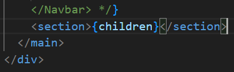
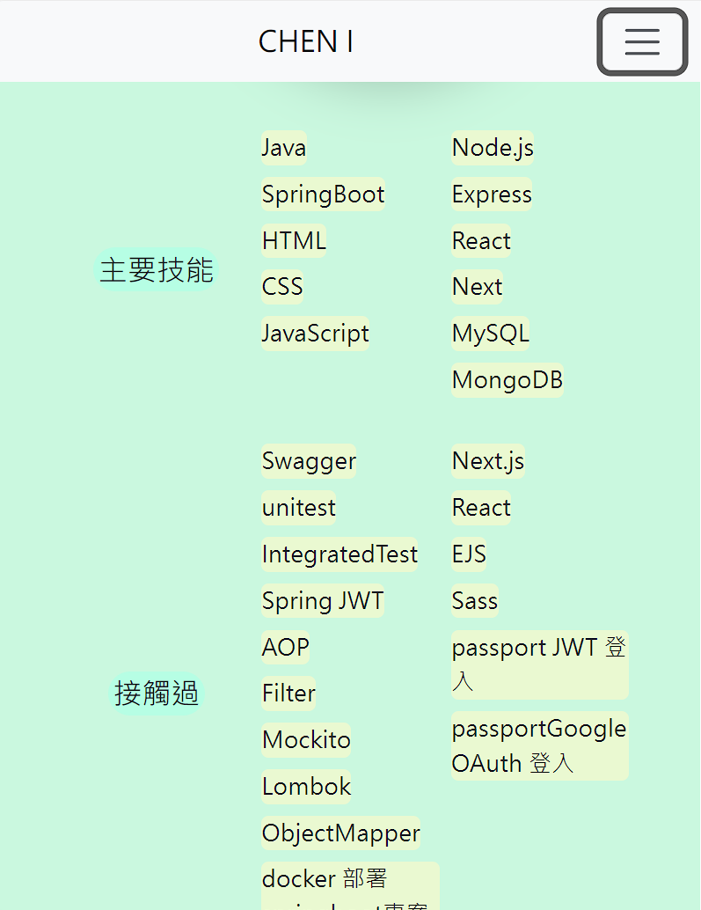
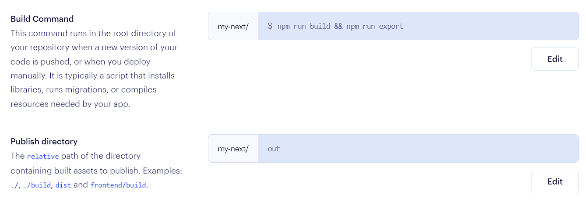
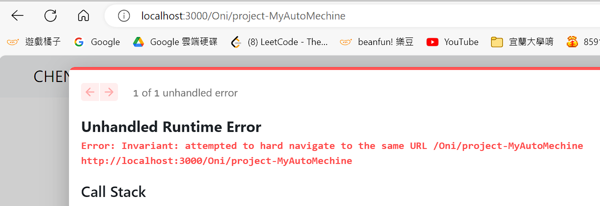

# 到第五節之前都是修改+修改為主

# section 1-1

## 透過webservices才搭建完成

```js
  "scripts": {
    "test": "echo \"Error: no test specified\" && exit 1",
    "start": "node app.js",
    "build": "npm install"
  },
```

`BuildCommand` : npm install

`StartCommand` : node app.js

`Auto-Deployee` : Yes

記得填入環境變數

# section 1-2

## 解決revise可停留，趁機paid或fulfill，偷偷卡bug，導致奇怪錯誤

# section 1-3

## 解決時間忘記'new'的時候更新HTMLt_showUp()的部分

---

> 開始用React+React bootstrap

---

# section 2-1

準備開始做 react Next 版本的 前端畫面

發現直接像往常一樣使用 bootstrap會發生錯誤

需要安裝 react-bootstrap版本 才能

因此我去安裝了

## 安裝React Bootstrap

```batch
npm install react-bootstrap bootstrap
```

在 React 中使用 

`import { Button } from 'react-bootstrap';` 的方式

通常被描述為「less ideally」，是因為這樣的引入方式可能會導致 bundle 大小增加。

這是由於 `react-bootstrap` 的每個組件都被打包為獨立的模組，如果你只引入其中一個組件，整個模組也會被包含在 bundle 中。

相對地

`import Button from 'react-bootstrap/Button';` 的方式

僅引入了特定的 `Button` 組件，這樣可以減小 bundle 大小，因為只有你實際使用的模組件會被包含。

## render 錯誤server not match client

### 不能使用body標籤!!!



因為chrome 自己重新組織 所以導致不匹配!

## react bootstrap css引用方式

```js
import "bootstrap/dist/css/bootstrap.min.css"; // 引入 Bootstrap CSS
```

---

> 搬遷 portfolio  Project3的主畫面過來Next.js

---

# section 3-1

## Work Flow

看一下如何引用 style 

事先分隔 global 樣式 跟 含有class selector的樣式

變成 `styles > globals.css` 和 `styles > Home.module.css` 

前者是給 _app.js 進行全域設定

後者是給 Home使用 (`pages > index.js`)  

---

去看看 `Home.module.css`

裡面教你怎麼 轉換成 next JSX格式，包含一個`tag` 持有多個class

或者 `tag`  的 className 含有 `-`  要怎麼辦。

以及過濾一些用不到的@media

---

`layout.js` 

接著處理畫面 nav 沒有黏在top的問題、

內部頁面頂端被遮住 的問題

---

## style的引用方式

```js
import style from "../styles/Home.module.css";
import styleB from "../styles/bubble.module.css";
export default function Home() {
  return 
```

## Home.module.css

### 持有多個className 透過 {``} 達成

```js
<Layout>
  <div className={styleB.bubbleBackgroundWrap}>
    <div className={`${styleB.bubble} ${styleB.x1}`}></div>
```

### className含有 - 的處理方式

```js
<section className={style["main-area"]}>
```

## layout.js (components)

### Nav fixed:top 設定固定位置

```js
<Navbar expand={false} fixed="top" className="bg-body-tertiary mb-3">
```

### 頂端內容被fixed遮住，增加margin

```js
</Navbar>
      <section style={{ marginTop: "10vh" }}>{children}</section>
```

# section 3-2

# Work Flow

修改泡泡點擊遮住的問題、

修改Icons8 免費使用的連結要求

修改內文 Footer呈現

修改文字 css  (技能描述那邊)

## 點擊穿越泡泡

> ** pointer-event: none**

```scss
.bubble {
  width: 200px;
  height: 200px;
  border-radius: 50%;
  position: absolute;
  box-shadow: 0 20px 30px rgba(0, 0, 0, 0.2),
    inset 0px 10px 30px 5px rgba(252, 255, 255, 1);
  pointer-events: none; /* 設置 pointer-events 為 none，讓事件穿透 */
}
```

## 連結引用只需要用icons by Icons8就夠

## 修改一些內文、Footer呈現

## 技能描述使用map達成(main+contact)、tool不管

```js
const mainSikksLeft = ["Java", "SpringBoot", "HTML", "CSS", "JavaScript"];
const mainSikksRight = [
  "Node.js",
  "Express",
  "React",
  "Next",
  "MySQL",
  "MongoDB",
];


<div className={style["skill-more-information"]}>
                <div className={style["skill-more-information"]}>
                  <div className={style["skill-more-info-left"]}>
                    {mainSikksLeft.map((skill) => (
                      <p>{skill}</p>
                    ))}
                  </div>
                  <div className={style["skill-more-info-right"]}>
                    {mainSikksRight.map((skill) => (
                      <p>{skill}</p>
                    ))}
                  </div>
                </div>
              </div>
```

## 修改css

```css
  .skill-main-title {
  flex-basis: 33%;

  section.about-me
  section.description
  .skill-descriptions
  .skill-description
  .skill-more-information {
  flex-basis: 66%;
  flex-wrap: wrap;
  display: flex;
  align-items: center;
  margin-bottom: 0.5rem;
  margin-top: 0.5rem;

  justify-content: flex-start;
  flex-wrap: wrap;
  flex-grow: 1;
  align-items: flex-start;
}
.skill-more-info-left {
  flex-basis: 50%;
}
.skill-more-info-right {
  flex-basis: 50%;
}
section.about-me
  section.description
  .skill-descriptions
  .skill-description
  .skill-more-information
  p {
  display: block;
  margin: 0;
  margin-left: 0.5rem;
  margin-bottom: 0.5rem;
  background-color: rgba(242, 249, 205, 0.8);
  border-radius: 5px;
  width: fit-content;
}
```



# section 3-3

## Work Flow

改成 Nav Dropdown 群集專案

修改 Nav `CHEN I` 文字置中

## 修改 其他頁面 Link (群集NavDropDown)

```js
const UdemyProjectArray = [
  { link: "/Udemy/project-GoGame", name: "圍棋網站" },
  { link: "/Udemy/project-Tourism", name: "日本旅遊網站" },
  { link: "/Udemy/project-GPA", name: "成績計算網站" },
  { link: "/Udemy/project-SnakeGame", name: "貪食蛇" },
  { link: "/Udemy/project-Bricks", name: "彈跳球" },
  { link: "/Udemy/project-MongoDB", name: "MongoDB" },
];
const ISpanProjectArray = [
  { link: "/ISpan/project-FlipCard", name: "翻卡牌遊戲" },
  { link: "/ISpan/project-OShop", name: "OShop網路商店" },
];
const IndividualProjectArray = [
  { link: "/Oni/project-MyAutoMechine", name: "樹梅派~自動玩遊戲" },
  { link: "/Oni/project-Yoichi", name: "夜市APP" },
];


               <NavDropdown>
                  className={style.NavLinkHover}
                  title="獨立開發專案"
                  id={`offcanvasNavbarDropdown-Individual-expand-${false}`}
                >
                  {IndividualProjectArray.map((object, index) => (
                    <NavDropdown.Item
                      className={style.NavLinkHover}
                      key={object.name + index}
                      href={object.link}
                    >
                      {object.name}
                    </NavDropdown.Item>
                  ))}
                </NavDropdown>
```

## 修改 Nav 文字置中

```js
<Navbar.Brand
            href="#"
            style={{
              marginLeft: "auto",
              marginRight: "auto",
              transform: "translate(50%,0)",
            }}
          >
```

> **主畫面差不多就到這邊，剩下是分頁內容 !**

## 製作bubble Toggler (手動開關泡泡)

## 當我修改到一半，發現bubble錯誤

應該要改成這個才對

```js
<div className={`${styleB["bubble-background-wrap"]}`}> 
```

## 泡泡添加RWD策略

x4 ~ x10 直接透明化

```css
@media screen and (max-width: 1161px) {
  .x1 {
    animation: animateBubble 25s linear infinite,
      sideWays 2s ease-in-out infinite alternate;
    left: 5%;
    top: 0;
    transform: scale(0.25);
  }
  .x2 {
    animation: animateBubble 15s linear infinite,
      sideWays 2s ease-in-out infinite alternate;
    left: 15%;
    top: 0;
    transform: scale(0.4);
  }
  .x3 {
    animation: animateBubble 19s linear infinite,
      sideWays 2s ease-in-out infinite alternate;
    left: 25%;
    top: 0;
    transform: scale(0.6);
  }
  .x4 {
    opacity: 0;
  }
  .x5 {
    opacity: 0;
  }
```

## 把div移動到layout 這樣就能全域共享

保留button功能在home但是layout持有div bubble cluster

---

# 先偷偷部屬Render試試看!⭐⭐⭐⭐⭐

## 發生警告 要求使用Image 這個next標籤

使用方式 一定要填入width + height 

基本上都跟img一樣

但是我這邊發生錯誤

### Image 錯誤 (請css要另外添加類別)⭐⭐⭐

#### index.js 特殊技巧Image⭐⭐⭐

🔥 缺一不可喔 最好別亂少

```js
<section className={style.picture}>

<Image
            className={style.nextImage}🔥
            width={0}🔥
            height={0}🔥
            sizes="100vw"🔥
            style={{ width: "90%", height: "auto" }}🔥
            src="/project3/images/貓貓彎曲三角形.png"
            alt="貓貓頭貼"
          />
```

#### Home.module.css

注意寫上class

```css
section.resume section.picture img,
.nextImage {
  width: 90%;
  position: relative;
  z-index: 4;
}


@media screen and (max-width: 1161px) {
  section.about-me section.description {
    width: 80%;
  }
  section.resume section.picture img,
  .nextImage {
    position: relative;
    width: 70%;
  }
```

## 警告: 不能直接寫 【'】

### 錯誤在index.js 【I'm Oni】

```js
  return (
    <Layout>
      <section className={style["main-area"]}>
        <div className={style.info}>
          <h1>嗨，I&apos;m Oni.</h1>
```

## static site Vs web severices

不能夠用npm run build

改用 npm run export

## Next可以導出靜態網站給Render

### neext.config.js

```js
/** @type {import('next').NextConfig} */
const nextConfig = {
  reactStrictMode: true,
  swcMinify: true,
  images: {
    unoptimized: true,
  },
  output: "export",
};

module.exports = nextConfig;
```

### 步驟:

npm run build

npm run export



然後成功Static site了 ，之後可能換用WebService也不一定 ?

暫時 連出去網站的部分，使用webServices EJS 提供 之前專案

---

# 4-1

## 修改 停止泡泡的滑鼠游標樣式

```css
.stopBubble:hover {
  cursor: pointer;
}
```

```js
<a
            className={style.stopBubble}
```

## 修正 navbar 比父元素更寬(超出的問題)

### 兇手是自己裝飾的框框😕、以及@media scale害的😕

```css
section.resume section.picture {
  display: flex;
  justify-content: center;
  align-items: center;
  flex: 2 1 500px;
  position: relative;
  padding: 2rem 0rem;
  overflow: hidden; /* 防止子元素溢出 */
}


section.resume section.picture div.greenRect1 {
  width: 30vw;
  height: 90vh;
  border: 10px solid rgb(202, 248, 223);
  transform: rotate(-90deg) translate(-50%, 0);
  position: absolute;
  z-index: -1;
}
```

```css
@media screen and (max-width: 1161px) {
  section.about-me section.description {
    width: 80%;
  }
  section.resume section.picture img,
  .nextImage {
    position: relative;
    width: 70%;
  }
  section.resume section.table {
    /* transform: scale(1.2); */
    margin: 2rem;
  }
}
```

## 圖片又要求或警告了

> 把objectFit="cover"拿掉了

```js
<Image
            className={style.nextImage}
            width={0}
            height={0}
            sizes="100vw"
            style={{ width: "90%", height: "auto" }}
            alt="me"
            src="/project3/images/portrait.jpg"
            layout="fill"
            priority={true}
          />
```

## 修改 停止泡泡+貓貓的位置

# 4-2

## toggle area 改成左邊出現

> **start** 

```js
<Navbar.Offcanvas
            id={`offcanvasNavbar-expand-${false}`}
            aria-labelledby={`offcanvasNavbarLabel-expand-${false}`}
            placement="start"
          >
```

## toggle hamburger 改成左邊出現

```js
 <Container fluid>
          <Navbar.Toggle aria-controls={`offcanvasNavbar-expand-${false}`} />

          <Navbar.Brand
```

## 字體 CHEN I 校正

```js
<Navbar.Brand
            href="#"
            style={{
              marginLeft: "auto",
              marginRight: "auto",
              textAlign: "center",
            }}
          >
```

# 4-3

## 改回右邊 (比較好操作!)

```js
<Navbar.Brand
            href="#"
            style={{
              marginLeft: "auto",
              marginRight: "auto",
              textAlign: "center",
              transform: "translate(50%,0)",
            }}
          >
            {navTitle}
          </Navbar.Brand>
          <Navbar.Toggle aria-controls={`offcanvasNavbar-expand-${false}`} />
          <Navbar.Offcanvas
            id={`offcanvasNavbar-expand-${false}`}
            aria-labelledby={`offcanvasNavbarLabel-expand-${false}`}
            placement="end"
            style={{ width: "50%" }}
          >
```

# 4-4

## 泡泡出現範圍 以及相對絕對問題

改用 hidden 這樣泡泡才不會超出範圍造成某些手機 scroll-x 可以動來動去

absolute 讓位置是絕對

```js
.bubble-background-wrap {
  position: absolute;
  bottom: 0;
  top: 0;
  right: 0;
  left: 0;
  z-index: 10;
  pointer-events: none;
  overflow: hidden;
}
```

```js
export default function Layout({ children, bubbleStatus }) {
  return (
    <div style={{ position: "relative" }}>
      <div
        className={`${styleB["bubble-background-wrap"]} bubbleCluster  bubbleShow`}
      >
        <div className={`${styleB.bubble} ${styleB.x1}`}></div>
        <div className={`${styleB.bubble} ${styleB.x2}`}></div>
        <div className={`${styleB.bubble} ${styleB.x3}`}></div>
        <div className={`${styleB.bubble} ${styleB.x4}`}></div>
        <div className={`${styleB.bubble} ${styleB.x5}`}></div>
        <div className={`${styleB.bubble} ${styleB.x6}`}></div>
        <div className={`${styleB.bubble} ${styleB.x7}`}></div>
        <div className={`${styleB.bubble} ${styleB.x8}`}></div>
        <div className={`${styleB.bubble} ${styleB.x9}`}></div>
        <div className={`${styleB.bubble} ${styleB.x10}`}></div>
      </div>
      <Head>
```

```css
.bubble {
  width: 200px;
  height: 200px;
  border-radius: 50%;
  bottom: 0;
  position: absolute;
  box-shadow: 0 20px 30px rgba(0, 0, 0, 0.2),
    inset 0px 10px 30px 5px rgba(252, 255, 255, 1);
  pointer-events: none; /* 設置 pointer-events 為 none，讓事件穿透 */
}

@keyframes animateBubble {
  0% {
    bottom: 0%;
  }
  100% {
    bottom: 100%;
  }
}
```

然後把x1~x10 的 top都拿掉

```js
.x1 {
  animation: animateBubble 25s linear infinite,
    sideWays 2s ease-in-out infinite alternate;
  left: 5%;
  transform: scale(0.5);
}
```

## 4-5 也是修改畫面呈現而已

## 修改Nav 為sticky

```js
 <Navbar
        expand={false}
        className="navbar-expand-lg bg-body-tertiary mb-3"
        sticky="top"
      >
```

## 修改children那邊的section，移除marginTop:10vh

## Nav的傳送方式 as {Link}⭐⭐⭐⭐

```js
<Nav.Link as={Link} href="/" className={style.NavLinkHover}>
                  首頁
                </Nav.Link>
```

# section 5 -1  開始製造分頁(作品說明)

如果導航兩次到 同一個目前都不存在的頁面 = 404 會出現錯誤

```batch
Error: Invariant: attempted to hard navigate to the same URL /Oni/project-MyAutoMechine 
```



- 這是因為 第一次有預渲染，第二次會試圖拿來用但是沒有。

## 重複連接 使用useRouter邏輯避險 直接不允許相同

```js
import { useRouter } from "next/router";

const navigateToSamePage = (url) => {
 if (router.asPath !== url) {
 router.push(url);
 }
 };

                   <NavDropdown.Item
                      className={style.NavLinkHover}
                      key={object.name + index}
                      // as={Link}
                      // href={object.link}
                      onClick={() => {
                        navigateToSamePage(object.link);
                      }}
                    >
                      {object.name}
                    </NavDropdown.Item>
```

## 製作 blog-img-container 、blog-img 自己的圖片格式

```css
.blog-img-container {
  display: flex;
  align-items: center;
  justify-content: center;
  flex-wrap: nowrap;
  margin-bottom: 1rem;
}

.blog-img {
  flex-basis: 40%;
  flex-shrink: 1;
  /* 添加其他樣式，例如邊框或間距，根據需要 */
  border: 1px solid #ddd;
  margin: 5px;
}
```

```js
<div className={style["blog-img-container"]}>
              <Image
                className={style["blog-img"]}
                width={0}
                height={0}
                sizes="100vw"
                style={{ width: "50%", height: "auto" }}
                alt="me"
                src="/Oni/images/relay_wire.png"
                layout="fill"
                priority={true}
              />
            </div>
```

## 先寫樹梅派計畫內容

連結也用上了，樹梅派姑且就這樣吧，去看commit

## 使用Redux 全域狀態管理()

# Section 5-2

// output: "export", 好像用不用都無所謂ㄟ @@?
